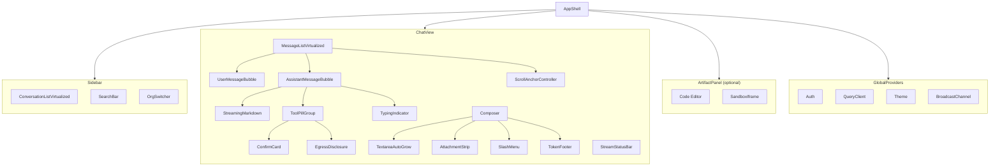

# Rendering HTML in cursor
_Exported on 5/30/2026 at 22:04:25 GMT+5:30 from Cursor (3.4.20)_

---

**User**

How to render html in cursor

---

**Cursor**

Checking Cursor docs for how to preview HTML in the editor.


Here are the practical ways to preview HTML in **Cursor** (it’s VS Code–based, so the same options apply):

## 1. Open in your browser (simplest)

For a standalone file like your `01-streaming-real-time-rendering.html`:

- **Right-click** the file in the explorer → **Reveal in Finder**
- Double-click the file to open it in Chrome/Safari/Firefox

Or from the terminal:

```bash
open /Users/sarthakagarwal/Desktop/Dream11/Agent/prep/system-design/answers-html/01-streaming-real-time-rendering.html
```

## 2. Live Preview (built into VS Code / Cursor)

1. Open the `.html` file
2. **Cmd+Shift+P** → run **“Live Preview: Show Preview”**
3. A preview pane opens beside your editor and refreshes on save

If that command isn’t there, install the **Live Preview** extension (Microsoft).

## 3. Simple Browser (inside Cursor)

1. **Cmd+Shift+P** → **“Simple Browser: Show”**
2. Paste the file URL, e.g.:

```
file:///Users/sarthakagarwal/Desktop/Dream11/Agent/prep/system-design/answers-html/01-streaming-real-time-rendering.html
```

Good for a quick in-editor view; less polished than a real browser.

## 4. Live Server extension

Install **Live Server**, then:

- Right-click the HTML file → **Open with Live Server**
- Serves at `http://127.0.0.1:5500/...` with auto-reload

Useful if you add JS, fetch local files, or need a local server.

## 5. Cursor Canvas (for agent-generated UI)

When the agent builds a **`.canvas.tsx`** React artifact, Cursor can show it in a **Canvas** panel beside chat. That’s for interactive React apps the agent creates—not for opening an existing static `.html` file.

---

**For your current file:** option **1** or **2** is enough—it’s self-contained HTML with embedded CSS, no server required.

If you tell me whether you want **in-editor preview** or **browser preview**, I can walk you through the exact steps for that setup.

---

**User**

in html Can you embed some ui elements so that I can understand every question and answer better
And also use subagents for every section

---

**Cursor**

Exploring the HTML structure and markdown sources, then using subagents to enhance each section with interactive UI.


Reviewing the HTML structure across files, then building shared interactive components and dispatching subagents per section.


Creating shared interactive components, enhancing section 01 as the template, then dispatching subagents for the remaining sections.


Adding interactive demos to section 01, then dispatching subagents for sections 02–10.


Verifying subagent changes and adding missing demo handlers for section 08.


Adding the missing streaming-table demo to section 01.


All 10 section pages now have interactive study UI. Here’s what was added and how to use it.

## What you get on every question

Each `article.qa` block now includes:

1. **Interview sound bite** — one-line summary at the top  
2. **Tabs** — Problem | Approach | Tradeoffs (auto-split from content)  
3. **Flashcard mode** — hide the answer, try answering aloud, then reveal  
4. **Mark as studied** — tracked in browser localStorage with progress in the sticky nav  
5. **Try it demo** — a hands-on widget per question (sliders, quizzes, decision trees, simulations)

## Shared assets

- `prep/system-design/answers-html/assets/interactive.css` — study UI + demo styles  
- `prep/system-design/answers-html/assets/interactive.js` — tabs, flashcards, progress, and all demo logic  

## Demo types by section (via subagents)

| Section | Highlights |
|--------|------------|
| **01** Streaming | Token throttle, stop chain, SSE quiz, fence FSM, typing bubble, table stream |
| **02** State | Decision trees for edits/branches; protocol picker for multi-tab sync |
| **03** MCP tools | Tool pill states, idempotency trees, provider protocol quizzes |
| **04** Artifacts | Sandbox quizzes, CSP trees, render-loop stop chain |
| **05** Performance | Layout thrash, debounce slider, virtualization decision trees |
| **06** Auth | JWT/RLS trees, OAuth refresh chain, security policy quizzes |
| **07** Offline | Drop recovery trees, error taxonomy quiz, rate-limit gauge |
| **08** Input | Textarea grow, upload progress, slash menu, voice transcript, token counter |
| **09** API | Provider adapter quizzes, streaming adapter chain, fallback trees |
| **10** Killer Qs | Full scenario decision trees + stop chains for the hard cases |

## How to preview

Open any HTML file in a browser, for example:

```bash
open /Users/sarthakagarwal/Desktop/Dream11/Agent/prep/system-design/answers-html/01-streaming-real-time-rendering.html
```

Or use **Cmd+Shift+P → “Live Preview: Show Preview”** in Cursor.

## Suggested study flow

1. Read the **question** and switch to **Flashcard** mode  
2. Answer out loud  
3. Click **Reveal answer**, then skim the **tabs**  
4. Use the **Try it** demo to make the concept stick  
5. Check **Mark as studied** and watch progress in the nav bar  

Start from `index.html` — it now notes that each section has interactive demos and progress tracking. If you want changes (e.g. a global dark-mode toggle, export progress, or more demos for a specific section), say which section and what kind of widget you want.

---

**User**

there is a black thick line in @prep/system-design/answers-html/01-streaming-real-time-rendering.html 
when I switch to approach in quesiotn 1
check this image

---

**Cursor**

Investigating the black bar in the Approach tab — likely a Mermaid diagram rendering issue when content moves into hidden tab panels.


Mermaid runs before tabs are built, so diagrams inside hidden Approach panels render at zero size — showing as a dark `pre` bar. Fixing by preserving diagram source during tab cloning and lazy-rendering Mermaid when each tab becomes visible.


The black bar was an **unrendered Mermaid diagram**.

**What happened:** When you switched to the **Approach** tab, the flowchart was sitting in a hidden panel (`display: none`). Mermaid ran on page load before tabs were built, so it couldn’t measure that panel and left a dark `<pre>` block (your `--pre-bg` color) instead of the diagram.

**What I fixed:**

1. **Lazy Mermaid rendering** — diagrams render only when their tab becomes visible  
2. **Fresh diagram source on tab split** — cloning tabs no longer copies broken/hidden SVG state  
3. **Removed early `mermaid.run()`** from section 01 — `interactive.js` handles rendering after tabs are built  
4. **CSS fallback** — pending diagrams no longer show as a thick dark bar before render  
5. **Disabled `startOnLoad: true`** on all section pages so Mermaid doesn’t run too early

**Try it:** Hard refresh the page (`Cmd+Shift+R`), open question 1, switch to **Approach** — you should see the flowchart (Token buffer → lexer → blocks → DOM → scroll anchor) instead of the black line.

If it still looks wrong after refresh, tell me and we can dig in further.

---

**User**

now it is fine Can you check in other files as well 
And use subagents for each file

---

**Cursor**

Auditing all section HTML files for the same Mermaid/tab issue and dispatching subagents per file.


Updating shared Mermaid handling for all markup patterns, then dispatching subagents to audit each file.


Verifying all files are consistent after subagent fixes:


All section files are audited and aligned. Summary:

## Shared fix (`assets/interactive.js` + `interactive.css`)
- Lazy Mermaid render when a tab becomes visible
- Supports both `pre.mermaid` and `div.mermaid`
- Fresh diagram source when content is cloned into tabs
- Pending-state CSS so unrendered diagrams don’t show as a dark bar

## Per-file results (subagents)

| File | Mermaid diagrams | Changes |
|------|------------------|---------|
| **01** Streaming | 3 | Already fixed (reference) |
| **02** State | 3 in Tradeoffs tabs | Added pending-mermaid CSS override |
| **03** MCP tools | 0 | Removed unused Mermaid CDN; fixed tab labels (`<strong>Problem framing:` etc.) so tabs actually split |
| **04** Artifacts | 0 | Moved Mermaid scripts to footer; added `.mermaid-wrap` CSS for future diagrams |
| **05** Performance | 0 | Added `defer` to `interactive.js`; standardized Mermaid init |
| **06** Auth | 0 | Moved Mermaid to footer; added pending CSS |
| **07** Offline | 0 | Removed redundant Mermaid CDN; added tab labels on all 9 Q&As + pending CSS |
| **08** Input | 0 | No changes needed — already correct |
| **09** API | 0 | Moved Mermaid init to footer before `interactive.js` |
| **10** Killer Qs | 12 | Fixed script order; wrapped all diagrams in `mermaid-wrap`; fixed pending CSS |

## Global checks (all 10 section pages)
- No `startOnLoad: true`
- No `mermaid.run()` on page load
- All use `interactive.js` with `defer`
- Script order: `mermaid.min.js` → `initialize({ startOnLoad: false })` → `interactive.js defer`

## Where to spot-check
1. **02** — switch to **Tradeoffs** on Q&As with flowcharts (`where-does-conversation-state-live`, `sync-across-tabs`, `tree-vs-linear-array`)
2. **10** — open any killer question; architecture diagrams should render on load (no tabs)
3. **03, 07** — confirm Problem / Approach / Tradeoffs tabs appear and work

Hard refresh (`Cmd+Shift+R`) when testing. If any page still shows a black bar, tell me which file and tab.

---

**User**

okay Now I want you to create a diagram of claude system for frontend which will cover most context of questions.
Please generate a interactive HTML file this.
And put it in folder@prep/system-design 
Whatever research you require offload to subagents

---

**Cursor**

Researching the prep materials across sections, then building an interactive frontend architecture diagram.


Building a self-contained interactive architecture diagram from the research.


Adding a link from the answers index page.


Created an interactive architecture map at:

**`prep/system-design/claude-frontend-architecture.html`**

Research was split across subagents covering sections 01–05 and 06–10 + the design doc. The diagram maps **28 nodes** across the full Claude-style frontend stack.

## What’s in the diagram

**6 layers**
- UI Surfaces — Composer, Sidebar, Message List, Streaming Bubble, Tool Pills, Artifact Panel  
- Client State — Conversation Store, Streaming Pipeline, Branch Assembler, Outbox, Cache  
- Transport — REST, SSE, WebSocket  
- API / BFF — Gateway, Conversation Svc, Stream Gateway, Orchestrator, MCP Client  
- Providers — IR + Adapters, LLM APIs, MCP Servers  
- Data — Postgres Graph, Redis, Object Storage, IndexedDB  
- Security (cross-cutting) — Auth Boundary, Sandbox iframe, Content Firewall  

**Interactive features**
- **Click any node** → detail panel with mechanisms, interview questions, links to answer sections  
- **Layer filter** — show/hide UI, Client, Transport, etc.  
- **Section filter** — filter by prep section (01–10)  
- **Search** — find nodes by keyword  
- **6 flow walkthroughs** — animated highlights for:
  - Send message → stream response  
  - Tool call → HITL confirm → resume  
  - Stream drop at token 400/1000  
  - Edit message N → branch regen  
  - Artifact stream → sandbox preview  
  - MCP OAuth expires mid-task  
- **Pan & zoom** — drag canvas, +/- buttons  

## How to open

```bash
open /Users/sarthakagarwal/Desktop/Dream11/Agent/prep/system-design/claude-frontend-architecture.html
```

Or from the answers index — there’s now a link under the study-order box.

Each node is tagged with the prep sections it relates to, so you can filter to e.g. only **§01 Streaming** or **§03 MCP** while studying.

---

**User**

So whenver I am selecting an step some random nodes are getting highlighted

---

**Cursor**

Inspecting the flow-step highlighting logic in the architecture diagram.


Fixing broken highlight logic: flow steps were toggling classes on existing DOM incorrectly, and edge highlights used consecutive step order instead of actual graph connections.


Fixed. The bug had two causes:

1. **Broken toggle logic** — step selection was patching CSS classes on existing nodes with `classList.toggle`, which fought filter dimming and left stale highlights from the previous step.

2. **Wrong edge highlighting** — edges were drawn between *consecutive nodes in the step array*, not actual graph connections (e.g. `sse → streamPipeline` was highlighted even though that edge doesn’t exist).

**Fix:** flow highlighting is now computed in `renderNodes()` from state:
- Only nodes listed in the current step get `highlight`
- Everything else visible gets `dimmed`
- Edges highlight only when **both endpoints** are in the step and the edge exists in the graph

Hard refresh and try a flow walkthrough again — each step should highlight exactly the nodes listed in that step’s text.

---

**User**

What is IR here

---

**Cursor**

**IR** here means **Internal Representation** — your app’s **provider-neutral** model of a conversation, separate from Anthropic, OpenAI, or Gemini API shapes.

## Why it exists

Each provider formats messages differently:

| Concept | Anthropic | OpenAI |
|--------|-----------|--------|
| System prompt | Top-level `system` field | `messages[0]` with `role: system` |
| Tool call | `tool_use` in assistant message | `tool_calls` on assistant |
| Tool result | Next **user** message with `tool_result` blocks | Separate `role: tool` messages |

If the UI, DB, branching, and streaming logic talk directly to one provider’s format, switching providers or supporting features like extended thinking gets messy.

## What IR looks like

A single internal message model, e.g.:

```text
message {
  id, parent_id          // branching (edit/regenerate)
  role                   // system | user | assistant
  content[]              // blocks: text | image | tool_call | tool_result | thinking
  metadata               // model, provider, stop_reason, ...
}
```

**Everything inside your product uses IR:**
- UI (message list, tool pills)
- Postgres (message graph)
- Branch assembler (path to active leaf)
- Token/cost estimation

**Adapters compile IR only at the boundary:**

```text
IR  →  ProviderAdapter.compile()  →  Anthropic / OpenAI / Gemini request
Provider stream  →  StreamDecoder  →  normalized events  →  back into IR
```

## In the architecture diagram

The **IR + Adapters** node is that translation layer — it sits between your **Agent Orchestrator / Conversation Service** and the **LLM APIs**, so the rest of the frontend stack doesn’t need to know provider-specific details.

**Interview sound bite:** *“We persist IR, not provider payloads. Adapters compile on the way out and decode on the way in.”*

More detail in **§09 Providers**: `prep/system-design/answers-html/09-api-design-provider-abstraction.html`.

---

**User**

@prep/system-design 
This is the format to answer a system design question do you understand it or not
Dont do anything just chceck it

---

**Cursor**

Yes — I understand the format from your whiteboard.

It’s a **timed frontend system design interview structure**:

1. **Requirements (5–10 min)**  
   - Functional requirements (business) — clarify with interviewer  
   - Non-functional requirements — metrics, constraints, assumptions  
   - Scope the problem explicitly  

2. **Architecture (10–15 min)**  
   - Framework / high-level architecture  
   - Component / module tree (UI breakdown)  
   - State management — where state lives (cookies, ephemeral/JS, disk, cache)  

3. **Data Model (~5 min)**  
   - Core entities and their properties/methods  
   - e.g. `User { …, getStatus() }`  

4. **API Design / BFF (~10 min)**  
   - Protocol choice — REST, GraphQL, gRPC  
   - Real-time patterns — long polling, WebSockets, SSE  
   - Endpoints, network lifecycle, latency  
   - Edge/caching (e.g. Cloudflare), storage types, ACID vs BASE  

5. **Deep Dive (~10 min)**  
   - Pick 1–2 areas: performance, security, observability, testing, a11y/i18n, build/CI  

Supporting context on the board (protocol stack, URL → render) is background knowledge, not a separate interview section.

Your `prep/system-design` answers follow this spirit — problem framing → approach → tradeoffs — mapped to Claude-style chat frontend topics. I won’t change anything unless you ask.

---

**User**

create one more HTML for claude system design 
in these format please

---

**Cursor**

Creating a structured interview-format HTML for the Claude frontend system design. Reviewing existing materials to align content.


Created **`prep/system-design/claude-system-design-interview.html`** — a full Claude chat frontend system design answer in your whiteboard interview format.

## Structure (matches your template)

| Section | Time | Content |
|--------|------|---------|
| **① Requirements** | 5–10m | FR table, NFR cards, metrics/constraints/assumptions, scoping checklist |
| **② Architecture** | 10–15m | Stack, Mermaid diagram, component tree, state ladder (ephemeral → server SoT) |
| **③ Data Model** | 5m | `Conversation`, `MessageNode`, IR `ContentBlock`, tool/generation entities |
| **④ API / BFF** | 10m | SSE vs REST vs WS, endpoint table, streaming adapter, cancel/reconnect lifecycle |
| **⑤ Deep Dive** | 10m | Tabs: Performance · Security · Observability · Testing · A11y/i18n + closing synthesis |

## Interactive bits
- Sticky nav with section highlighting while scrolling  
- Collapsible sections (click header to fold)  
- Deep-dive tab switcher  
- Scoping checklist (saved in localStorage)  
- Links to section answer pages + architecture map  

## Open it

```bash
open /Users/sarthakagarwal/Desktop/Dream11/Agent/prep/system-design/claude-system-design-interview.html
```

Also linked from **`answers-html/index.html`** under “Interview template (45–60m)”.

---

**User**

show this in mermaid
Component / Module Tree

---

**Cursor**

Replacing the ASCII component tree with a Mermaid diagram in the interview HTML.


Simplifying the diagram for a cleaner component-tree layout:


Updated **`claude-system-design-interview.html`** — the Component / Module Tree is now a Mermaid diagram in the Architecture section.



Hard refresh the interview page to see it rendered. It lives under **② Architecture → Component / Module Tree**.

---

**User**

@prep Check I have changed some folder structure
please dont change anythign just be awae about it

---

**Cursor**

Noted — I won’t change anything.

You moved the Claude system-design prep under a dedicated **`claude/`** subfolder. Current layout:

```
prep/system-design/claude/
├── Claude-design-doc.md
├── claude-frontend-architecture.html
├── claude-system-design-interview.html
├── answers/                    # markdown (01–10 + README)
├── answers-html/               # interactive HTML + assets/
│   ├── index.html
│   ├── 01–10 section pages
│   └── assets/interactive.css, interactive.js
└── scripts/
    └── md_to_html_10.py
```

**Before:** everything lived directly under `prep/system-design/`  
**Now:** all of that is under `prep/system-design/claude/`

Internal links still look consistent with this layout (e.g. `answers-html/` ↔ `../claude-frontend-architecture.html` ↔ `../answers/`). I’ll use **`prep/system-design/claude/`** as the base path going forward.

