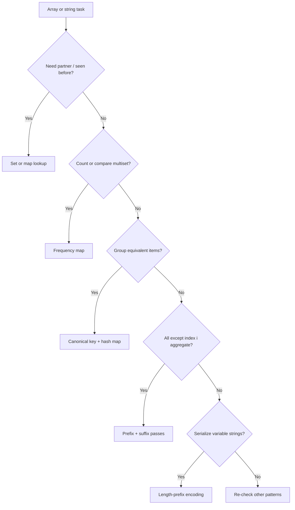

# 01. Arrays & Hashing (NeetCode category)

Lookup, counting, grouping, and complement-finding problems where a hash structure turns O(n²) scans into O(n) single passes.

---

## Recognition

### Problem signals
| You read… | Likely sub-pattern |
|-----------|---------------------|
| duplicate / already seen / unique | Set membership |
| two numbers that sum to target / complement | Hash map lookup |
| anagram / same letters / frequency match | Frequency counter |
| group by signature / bucket similar items | Canonical key + hash map |
| top K most frequent / count occurrences | Frequency map + heap or bucket sort |
| product/sum of **all except** index i | Prefix/suffix running state |
| consecutive sequence / chain of +1 values | Hash set + expand from starts only |
| encode/decode list of strings / delimiters | Length-prefix serialization |
| row/column/box uniqueness (Sudoku) | Per-group seen sets |

### Constraints that confirm it
- Unsorted input where binary search or two pointers on sorted order don't apply
- Need O(1) average lookup, insert, or count update per element
- Often n up to 10⁵–10⁶ with O(n) or O(n log n) expected
- "Without extra space" sometimes means O(1) **auxiliary** space (output array excluded)

### When NOT arrays & hashing
| Situation | Use instead |
|-----------|-------------|
| Array is **sorted** and you need two values summing to target | Two pointers |
| **Contiguous** subarray length/sum optima | Sliding window or prefix sum |
| Need **ordering** of top K without full sort | Heap (still may build freq map first) |
| Tree/graph structure in the prompt | DFS/BFS, not flat hash |

---

## Sub-patterns

### Set / map lookup & complement
**When:** need to know if a value was seen, or find partner `target - x` in one pass  
**Mechanism:** hash set for membership; hash map stores value → index (or count) for complement queries  
**Examples:** Contains Duplicate, Two Sum, Longest Consecutive Sequence (set + only extend when `num-1` not in set)

### Frequency counting & multiset
**When:** compare character/word counts, find mode-like values, or validate equal multisets  
**Mechanism:** array of size 26/256 for fixed alphabet, or hash map for arbitrary keys; increment/decrement in lockstep for anagram checks  
**Examples:** Valid Anagram, Top K Frequent Elements, Valid Sudoku (seen digits per row/col/box)

### Canonical key grouping
**When:** bucket items that are equivalent under reordering or normalization  
**Mechanism:** map each item to a canonical form (sorted string, frequency signature string, tuple of counts); group by key in hash map  
**Examples:** Group Anagrams

### Prefix / suffix running aggregation
**When:** each output index depends on all elements **except** self; division disallowed or unstable  
**Mechanism:** one pass left→right building prefix products/prefix sums; one pass right→left for suffix; combine at each index  
**Examples:** Product of Array Except Self

### Length-prefix serialization
**When:** encode variable-length strings so delimiters in content can't break parsing  
**Mechanism:** write `length + delimiter + payload` per string; decode by reading length then slicing exactly that many chars  
**Examples:** Encode and Decode Strings

---

## Templates

Pseudocode only — not tied to any language.

### Complement lookup (Two Sum style)
```
function twoSum(nums, target):
    seen ← empty map   // value → index

    for i from 0 to length(nums) - 1:
        need ← target - nums[i]
        if need in seen:
            return [seen[need], i]
        seen[nums[i]] ← i

    return none   // no pair
```

### Frequency counter (anagram / count)
```
function buildFreq(s):
    freq ← empty map
    for each char c in s:
        freq[c] ← freq.get(c, 0) + 1
    return freq

function isAnagram(s, t):
    if length(s) ≠ length(t):
        return false
    return buildFreq(s) equals buildFreq(t)
```

### Canonical key grouping
```
function groupAnagrams(strs):
    groups ← empty map   // canonicalKey → list of strings

    for each word in strs:
        key ← sorted characters of word joined
        // or: key ← frequency signature "#a2#b1..."
        if key not in groups:
            groups[key] ← empty list
        append word to groups[key]

    return all lists in groups.values()
```

### Prefix + suffix product
```
function productExceptSelf(nums):
    n ← length(nums)
    answer ← array of size n filled with 1

    prefix ← 1
    for i from 0 to n - 1:
        answer[i] ← prefix
        prefix ← prefix * nums[i]

    suffix ← 1
    for i from n - 1 down to 0:
        answer[i] ← answer[i] * suffix
        suffix ← suffix * nums[i]

    return answer
```

### Consecutive sequence (set, start-only expansion)
```
function longestConsecutive(nums):
    numSet ← set of all nums
    best ← 0

    for each num in numSet:
        if (num - 1) in numSet:
            continue   // not a sequence start

        length ← 0
        current ← num
        while current in numSet:
            length ← length + 1
            current ← current + 1
        best ← max(best, length)

    return best
```

### Encode / decode with length prefix
```
function encode(strs):
    result ← empty string
    for each s in strs:
        result ← result + str(length(s)) + "#" + s
    return result

function decode(s):
    i ← 0
    out ← empty list
    while i < length(s):
        j ← i
        while s[j] ≠ "#":
            j ← j + 1
        len ← integer parse of s[i .. j-1]
        payload ← s[j+1 .. j+1+len-1]
        append payload to out
        i ← j + 1 + len
    return out
```

---

## Decision flow



---

## Anti-patterns

| Misroute | Why it fails | Use instead |
|----------|--------------|-------------|
| Sort + two pointers for Two Sum on **unsorted** array | Loses original indices; sort is O(n log n) when O(n) map suffices | Hash map complement |
| Nested loops for duplicate check | O(n²) TLE on large n | Hash set |
| Expand consecutive sequence from every element | Each element visited multiple times → O(n²) | Only start when `num-1` absent |
| Sorting every string as the group key alone | O(n · k log k) per word; works but signature key is cleaner | Frequency signature or sorted key in map |
| Using division for product except self | Fails on zeros; problem often forbids division | Prefix/suffix product |
| Delimiter-only encoding (`join with comma`) | Payload can contain delimiter → ambiguous decode | Length-prefix (`len#payload`) |
| One global set for Valid Sudoku | Must track row, column, and box separately | 9 row sets + 9 col sets + 9 box sets |

---

## Complexity cheat sheet

| Variant | Time | Space |
|---------|------|-------|
| Set membership / complement map | O(n) | O(n) |
| Frequency map (alphabet size k) | O(n) | O(k) |
| Group anagrams (n words, length w) | O(n · w log w) sort-key; O(n · w) sig-key | O(n · w) |
| Top K frequent (n elements) | O(n) count + O(n log k) heap | O(n) |
| Product except self | O(n) | O(1) extra (output excluded) |
| Longest consecutive | O(n) | O(n) |
| Encode/decode m strings, total chars L | O(L) | O(L) |

---

## NeetCode 150 — problems in this bucket

| # | Problem | Difficulty | Sub-pattern | Status |
|---|---------|------------|-------------|--------|
| 1 | Contains Duplicate | Easy | Set membership | generated |
| 2 | Valid Anagram | Easy | Frequency counter | generated |
| 3 | Two Sum | Easy | Complement map | generated |
| 4 | Group Anagrams | Medium | Canonical key grouping | generated |
| 5 | Top K Frequent Elements | Medium | Frequency map + heap/bucket | generated |
| 6 | Product of Array Except Self | Medium | Prefix/suffix aggregation | generated |
| 7 | Valid Sudoku | Medium | Per-group seen sets | generated |
| 8 | Encode and Decode Strings | Medium | Length-prefix serialization | generated |
| 9 | Longest Consecutive Sequence | Medium | Set + start-only expansion | generated |

---

## One-page summary

- **Seen / complement / partner?** → hash set or map; one pass, O(n).
- **Counts or anagrams?** → frequency map; fixed alphabet → size-26 array.
- **Bucket equivalents?** → canonical key (sorted word or freq signature) → map of lists.
- **All except self?** → prefix pass then suffix pass; no division.
- **Consecutive chain?** → hash set; only expand when `num-1` is missing.
- **Encode strings?** → `length#payload` so content can't break parsing.
