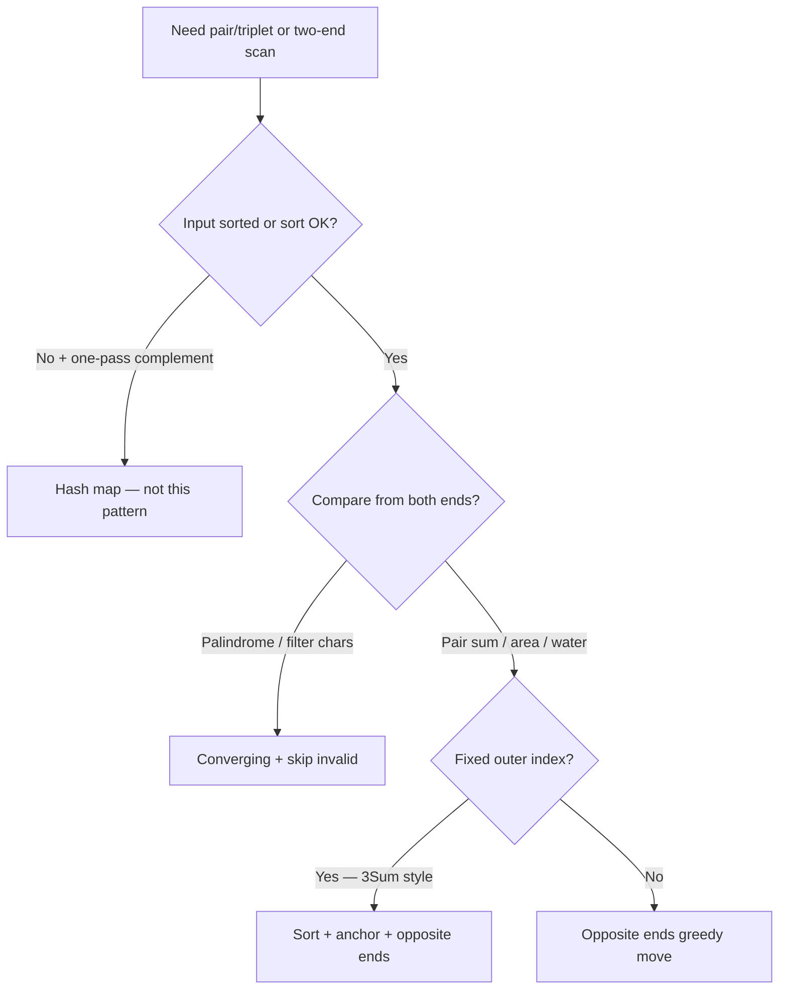

# 02. Two Pointers (NeetCode category)

Pair-wise scanning with two indices that move toward each other or in the same direction — often on sorted arrays or strings — to avoid O(n²) nested loops.

---

## Recognition

### Problem signals
| You read… | Likely sub-pattern |
|-----------|---------------------|
| **sorted** array + find pair summing to target | Opposite ends |
| **palindrome** / compare from both ends | Converging with filter |
| **3Sum / kSum** / unique triplets | Sort + anchor + opposite ends |
| **max area** between two lines / walls | Opposite ends + greedy shrink |
| **trap / collect water** between bars | Opposite ends + running max heights |
| **in-place** remove / merge sorted (other categories) | Same-direction read/write |

### Constraints that confirm it
- Input is **sorted** or can be **sorted** without breaking the problem
- Need a **pair or triplet** meeting a sum/area condition — not counting all subarrays
- O(n) or O(n log n) expected with n up to 10⁴–10⁵
- Often "return indices" or "in-place" hints at pointer movement instead of hash lookup

### When NOT two pointers
| Situation | Use instead |
|-----------|-------------|
| Unsorted array, need complement in one pass | Hash map (Two Sum I) |
| **Contiguous** subarray optima (longest, at-most-K) | Sliding window |
| Need **all** pairs regardless of order after sort duplicates | Nested loops or hash |
| Linked list cycle / middle | Fast/slow pointers (Linked List category) |

---

## Sub-patterns

### Opposite ends on sorted array
**When:** sorted (or sortable) sequence; find pair with target sum or maximize a function of `(left, right)`  
**Mechanism:** `left ← 0`, `right ← n-1`; compare `nums[left] + nums[right]` to target; move the pointer that must change to improve the sum (too small → `left++`, too large → `right--`)  
**Examples:** Two Sum II, inner loop of 3Sum

### Converging pointers with filter
**When:** compare characters from both ends; non-alphanumeric or spaces should be ignored  
**Mechanism:** advance each pointer until valid character; compare case-insensitively; shrink window inward on mismatch  
**Examples:** Valid Palindrome

### Sort + fixed anchor + two pointers
**When:** find all unique triplets/quads summing to zero or target  
**Mechanism:** sort array; for each index `i`, run opposite-ends on `[i+1 .. n-1]` with target `0 - nums[i]`; skip duplicate values at `i`, `left`, and `right`  
**Examples:** 3Sum

### Greedy opposite ends (area / water)
**When:** maximize area or volume bounded by two indices; shorter side limits result  
**Mechanism:** compute answer at `(left, right)`; always move the pointer at the **shorter** height (container) or track running max heights from both sides (trapping rain)  
**Examples:** Container With Most Water, Trapping Rain Water

---

## Templates

Pseudocode only — not tied to any language.

### Opposite ends — pair sum on sorted array
```
function twoSumSorted(nums, target):
    left ← 0
    right ← length(nums) - 1

    while left < right:
        sum ← nums[left] + nums[right]
        if sum equals target:
            return [left + 1, right + 1]   // 1-indexed if required
        if sum < target:
            left ← left + 1
        else:
            right ← right - 1

    return none
```

### Converging — valid palindrome
```
function isPalindrome(s):
    left ← 0
    right ← length(s) - 1

    while left < right:
        while left < right and s[left] is not alphanumeric:
            left ← left + 1
        while left < right and s[right] is not alphanumeric:
            right ← right - 1

        if lowercase(s[left]) ≠ lowercase(s[right]):
            return false

        left ← left + 1
        right ← right - 1

    return true
```

### Sort + anchor + two pointers — 3Sum
```
function threeSum(nums):
    sort nums
    result ← empty list
    n ← length(nums)

    for i from 0 to n - 3:
        if i > 0 and nums[i] equals nums[i - 1]:
            continue   // skip duplicate anchor

        left ← i + 1
        right ← n - 1
        need ← 0 - nums[i]

        while left < right:
            sum ← nums[left] + nums[right]
            if sum equals need:
                append [nums[i], nums[left], nums[right]] to result
                left ← left + 1
                right ← right - 1
                while left < right and nums[left] equals nums[left - 1]:
                    left ← left + 1
                while left < right and nums[right] equals nums[right + 1]:
                    right ← right - 1
            else if sum < need:
                left ← left + 1
            else:
                right ← right - 1

    return result
```

### Greedy opposite ends — container with most water
```
function maxArea(height):
    left ← 0
    right ← length(height) - 1
    best ← 0

    while left < right:
        width ← right - left
        h ← min(height[left], height[right])
        best ← max(best, width * h)

        if height[left] < height[right]:
            left ← left + 1
        else:
            right ← right - 1

    return best
```

### Opposite ends — trapping rain water
```
function trap(height):
    if length(height) < 3:
        return 0

    left ← 0
    right ← length(height) - 1
    leftMax ← 0
    rightMax ← 0
    water ← 0

    while left < right:
        if height[left] <= height[right]:
            leftMax ← max(leftMax, height[left])
            water ← water + (leftMax - height[left])
            left ← left + 1
        else:
            rightMax ← max(rightMax, height[right])
            water ← water + (rightMax - height[right])
            right ← right - 1

    return water
```

---

## Decision flow



---

## Anti-patterns

| Misroute | Why it fails | Use instead |
|----------|--------------|-------------|
| Two pointers on **unsorted** Two Sum I | Moving left/right doesn't monotonically adjust sum | Hash map complement |
| Nested loops for 3Sum after sort | O(n³) TLE | Sort once + O(n²) with two pointers |
| Move **both** pointers after finding a 3Sum triplet without skipping dupes | Duplicate triplets in output | Skip equal values at left/right while loop continues |
| Always move **taller** wall in Container With Most Water | Area cannot increase — width shrinks and height is capped by shorter side | Move pointer at shorter height |
| Prefix-max array for Trapping Rain when O(1) space asked | O(n) extra space when two-pointer works | Opposite ends + running leftMax/rightMax |
| Forgetting to skip non-alphanumeric in Valid Palindrome | Compares spaces/punctuation | Inner while loops to advance pointers |

---

## Complexity cheat sheet

| Variant | Time | Space |
|---------|------|-------|
| Opposite ends (sorted pair) | O(n) | O(1) |
| Converging palindrome | O(n) | O(1) |
| 3Sum (sort + two pointers) | O(n²) | O(1) extra excluding output |
| Container With Most Water | O(n) | O(1) |
| Trapping Rain Water (two pointers) | O(n) | O(1) |
| Trapping Rain Water (prefix max arrays) | O(n) | O(n) |

---

## NeetCode 150 — problems in this bucket

| # | Problem | Difficulty | Sub-pattern | Status |
|---|---------|------------|-------------|--------|
| 10 | Valid Palindrome | Easy | Converging with filter | generated |
| 11 | Two Sum II | Medium | Opposite ends (sorted) | generated |
| 12 | 3Sum | Medium | Sort + anchor + opposite ends | generated |
| 13 | Container With Most Water | Medium | Greedy opposite ends | generated |
| 14 | Trapping Rain Water | Hard | Greedy opposite ends (water) | generated |

---

## One-page summary

- **Sorted pair sum** → opposite ends; too small move left, too large move right.
- **Palindrome** → converging pointers; skip junk chars; compare lowercase.
- **3Sum** → sort; fix `i`; two-pointer on rest; skip duplicates at all three levels.
- **Max area / water** → opposite ends; move the side that cannot help (shorter bar or process lower side in trap).
- **Unsorted two-sum** → hash map, not two pointers.
