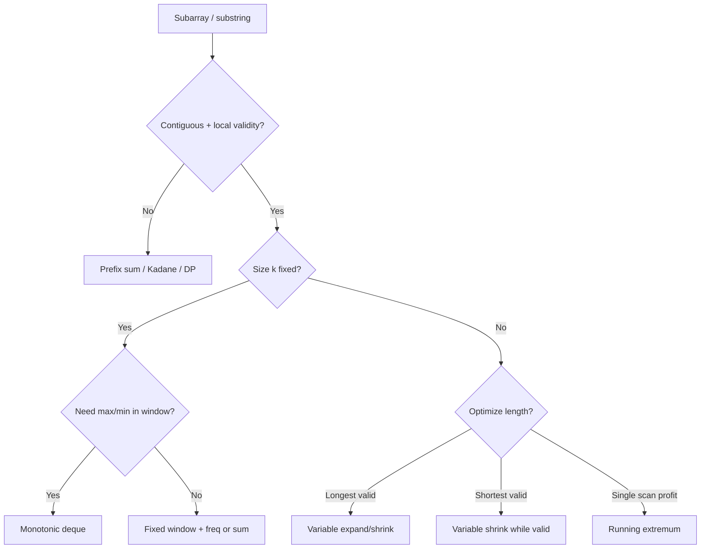

# 03. Sliding Window (NeetCode category)

Contiguous subarray/substring problems where you maintain a window and optimize length, count, or validity — usually O(n) by incrementally adding/removing one end.

---

## Recognition

### Problem signals
| You read… | Likely sub-pattern |
|-----------|---------------------|
| longest / shortest **substring** with a constraint | Variable window |
| subarray of **size k** / max average of length k | Fixed window |
| **at most K** distinct / flips / replacements | Variable window + freq map |
| **contains all** characters of t / anagram in s | Fixed window + freq match |
| max/min in every window of size k | Fixed window + monotonic deque |
| max **profit** / best buy-sell in one pass | One-pass running extremum |

### Constraints that confirm it
- Need **contiguous** elements (not subsequence)
- Adding/removing one end changes validity in a **local**, monotonic way
- Often O(n) expected with n up to 10⁵
- "Substring" or "subarray" in the prompt — window is always a contiguous slice

### When NOT sliding window
| Situation | Use instead |
|-----------|-------------|
| Subarray sum = K with **negative** numbers | Prefix sum + hash map |
| Maximum subarray **sum** (no length constraint) | Kadane's algorithm |
| Longest increasing **subsequence** | DP (not contiguous) |
| Count all subarrays with sum = K (negatives OK) | Prefix sum + hash map |

---

## Sub-patterns

### Variable window — longest valid
**When:** maximize window length while a constraint holds (at most K distinct, no repeats, at most K replacements)  
**Mechanism:** expand `right`; while invalid, shrink `left`; update best **after** window is valid  
**Examples:** Longest Substring Without Repeating Characters, Longest Repeating Character Replacement

### Variable window — shortest valid
**When:** minimize window length while containing all required elements  
**Mechanism:** expand `right` until valid; then shrink `left` while still valid, updating best at each valid step  
**Examples:** Minimum Window Substring

### Fixed window — size k
**When:** window size k is given or implied (permutation length, average of k elements)  
**Mechanism:** build window `[0..k-1]`; slide by adding `right` and removing `right - k` in one step  
**Examples:** Permutation in String, Max Average Subarray I

### Fixed window + monotonic deque
**When:** need max (or min) in each window of size k in O(n)  
**Mechanism:** deque stores **indices** in decreasing (for max) or increasing (for min) value order; drop indices outside window from front  
**Examples:** Sliding Window Maximum

### One-pass running extremum
**When:** optimize a single buy/sell or track running min/max over a scan — no explicit shrink loop  
**Mechanism:** at each index, update running extremum and best answer seen so far  
**Examples:** Best Time to Buy and Sell Stock

---

## Templates

Pseudocode only — not tied to any language.

### Variable window — longest valid
```
function longestValidWindow(input):
    left ← 0
    state ← empty map or counter
    best ← 0

    for right from 0 to length(input) - 1:
        add input[right] to state

        while window is invalid according to state:
            remove input[left] from state
            left ← left + 1

        best ← max(best, right - left + 1)

    return best
```

### Variable window — shortest valid (contains all of target)
```
function shortestWindow(s, need):
    left ← 0
    have ← empty counter
    required ← count of distinct chars in need with freq > 0
    formed ← 0
    bestLen ← infinity
    bestStart ← 0

    for right from 0 to length(s) - 1:
        add s[right] to have
        if have[s[right]] count now matches need[s[right]]:
            formed ← formed + 1

        while formed equals required:
            if right - left + 1 < bestLen:
                bestLen ← right - left + 1
                bestStart ← left
            remove s[left] from have
            if have[s[left]] count now below need[s[left]]:
                formed ← formed - 1
            left ← left + 1

    return substring s[bestStart .. bestStart + bestLen - 1] if bestLen finite else ""
```

### Fixed window — slide and update
```
function fixedWindow(nums, k):
    windowSum ← sum of nums[0 .. k-1]
    best ← windowSum

    for right from k to length(nums) - 1:
        windowSum ← windowSum + nums[right] - nums[right - k]
        best ← max(best, windowSum)

    return best
```

### Fixed window — anagram / permutation match
```
function containsPermutation(s, p):
    k ← length(p)
    if k > length(s):
        return false

    need ← freq count of p
    have ← empty counter
    matches ← 0

    for right from 0 to length(s) - 1:
        add s[right] to have
        update matches if s[right] freq now equals need

        if right >= k:
            remove s[right - k] from have
            update matches if removed char freq now below need

        if matches equals number of distinct chars in need:
            return true

    return false
```

### Monotonic deque — sliding window maximum
```
function maxSlidingWindow(nums, k):
    deque ← empty list of indices   // stores indices, values decreasing
    result ← empty list

    for right from 0 to length(nums) - 1:
        while deque not empty and nums[deque.back] <= nums[right]:
            pop back from deque
        push right onto deque

        if deque.front <= right - k:
            pop front from deque

        if right >= k - 1:
            append nums[deque.front] to result

    return result
```

### One-pass running extremum — max profit
```
function maxProfit(prices):
    minPrice ← infinity
    best ← 0

    for price in prices:
        minPrice ← min(minPrice, price)
        best ← max(best, price - minPrice)

    return best
```

---

## Decision flow



---

## Anti-patterns

| Misroute | Why it fails | Use instead |
|----------|--------------|-------------|
| Sliding window for subarray sum = K with negatives | Removing from left doesn't monotonically decrease sum | Prefix sum + hash map |
| Nested loops for "at most K distinct" | O(n²) TLE on n = 10⁵ | Variable window + freq map |
| Recount entire window each step | O(n·k) or O(n²) | Incremental add/remove on expand/shrink |
| Update best **before** shrinking in longest-valid problems | Counts invalid windows as answers | Shrink until valid, then update best |
| Shrink too aggressively in shortest-window | Misses minimum-length valid windows | Shrink while **still** valid, update at each step |
| Store values in deque instead of indices | Cannot evict elements outside window | Store indices; compare `front <= right - k` |
| Sort substring to check anagram | O(n log n) per window | Fixed window + freq counter |
| Brute-force max in each window of size k | O(n·k) TLE | Monotonic deque O(n) |

---

## Complexity cheat sheet

| Variant | Time | Space |
|---------|------|-------|
| Variable window (longest/shortest) | O(n) | O(1) or O(σ) for alphabet size |
| Fixed window (sum / average) | O(n) | O(1) |
| Fixed window + freq match | O(n) | O(σ) |
| Monotonic deque (window max/min) | O(n) | O(k) deque size |
| One-pass running extremum | O(n) | O(1) |
| Brute force all windows | O(n²) or O(n·k) | O(1) — avoid |

---

## NeetCode 150 — problems in this bucket

| # | Problem | Difficulty | Sub-pattern | Status |
|---|---------|------------|-------------|--------|
| 15 | Best Time to Buy and Sell Stock | Easy | One-pass running extremum | generated |
| 16 | Longest Substring Without Repeating Characters | Medium | Variable — longest valid | generated |
| 17 | Longest Repeating Character Replacement | Medium | Variable — longest valid + freq | todo |
| 18 | Permutation in String | Medium | Fixed window + freq match | todo |
| 19 | Minimum Window Substring | Hard | Variable — shortest valid | todo |
| 20 | Sliding Window Maximum | Hard | Fixed window + monotonic deque | todo |

---

## One-page summary

- **Fixed k** → slide both ends together; add `right`, subtract `right - k`; use freq map for anagram/permutation checks.
- **Longest with constraint** → expand right, shrink left while invalid, update best when valid.
- **Shortest containing all** → expand until valid, then shrink while still valid, track minimum length.
- **Max in window** → monotonic deque of indices; pop smaller values from back, evict stale index from front.
- **Buy/sell one pass** → track running min price; profit at each step is `price - minSoFar`.
- **Subarray sum = K with negatives** → not classic sliding window; use prefix sums.
