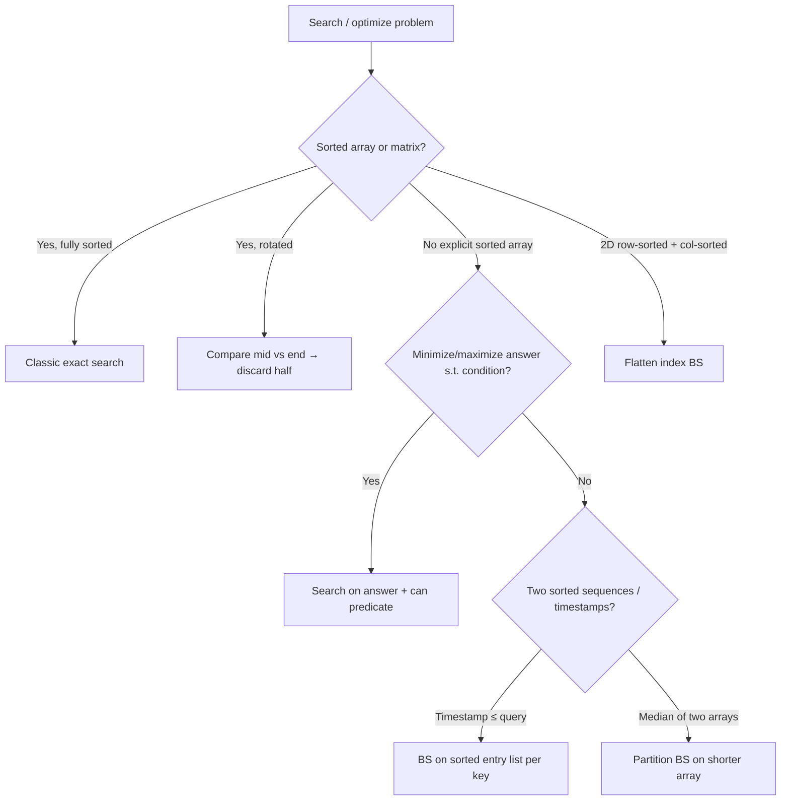

# 05. Binary Search (NeetCode category)

Halve a monotonic search space — sorted arrays, rotated sorted arrays, or an implicit answer range — to find a target, boundary, or optimal value in O(log n) or O(log(range)).

---

## Recognition

### Problem signals
| You read… | Likely sub-pattern |
|-----------|---------------------|
| find **target** in **sorted** array | Classic exact search |
| **O(log n)** required on sorted input | Classic or rotated search |
| **rotated** sorted array / find minimum / pivot | Rotated sorted |
| **minimize** or **maximize** X such that condition holds | Search on answer |
| can Koko finish in **H hours**? / smallest speed | Search on answer |
| **2D matrix** with sorted rows and row starts > previous row end | Flatten to 1D index |
| **timestamp** lookup / value at or before time | Search on sorted timestamps |
| **median** of two sorted arrays in O(log(m+n)) | Partition binary search |

### Constraints that confirm it
- Data is **sorted** (fully, per row, or by timestamp) or the **feasibility** of an answer is monotonic in the search variable
- Expected time is **O(log n)** or **O(log(range))** — not O(n) scan
- "Find minimum/maximum such that …" — answer space is discrete and predicate flips from false→true (or true→false) once
- Rotated array: at least one half of `[left..mid]` or `[mid..right]` is always normally sorted

### When NOT binary search
| Situation | Use instead |
|-----------|-------------|
| Unsorted array, need exact value | Hash map O(1) lookup |
| Count pairs with sum = K in unsorted array | Hash map |
| Subarray problems with negative numbers | Prefix sum + hash map |
| Need all solutions / enumerate combinations | Backtracking or brute force |
| Graph shortest path | BFS / Dijkstra |
| Greedy works with local choice | Greedy (no global search space) |

---

## Sub-patterns

### Classic exact search — sorted 1D or flattened 2D
**When:** find exact target (or return -1) in a fully sorted array or matrix that is one sorted sequence when row-major flattened  
**Mechanism:** maintain `[left, right]`; compare `mid` to target; discard half where target cannot lie  
**Examples:** Binary Search, Search a 2D Matrix

### Search on answer — monotonic predicate
**When:** minimize or maximize a numeric answer (speed, capacity, days) such that a feasibility check passes for all larger/smaller values  
**Mechanism:** binary search on `[lo, hi]` answer range; at each `mid`, run `can(mid)`; shrink toward first true (minimize) or last true (maximize)  
**Examples:** Koko Eating Bananas

### Rotated sorted array — pivot and search
**When:** array was sorted then rotated; find minimum element or search for target in O(log n)  
**Mechanism:** compare `nums[mid]` with `nums[right]` (or `nums[left]`) to know which half is sorted; discard the half that cannot contain answer; for search, check if target lies in sorted half  
**Examples:** Find Minimum in Rotated Sorted Array, Search in Rotated Sorted Array

### Partition search — timestamps and two-array median
**When:** lookup value at largest timestamp ≤ query, or find median by splitting two sorted arrays into left/right halves of equal total size  
**Mechanism:** binary search a **partition index** (not a value); ensure all left elements ≤ all right elements; answer is at partition boundary  
**Examples:** Time Based Key-Value Store, Median of Two Sorted Arrays

---

## Templates

Pseudocode only — not tied to any language.

### Classic exact search — sorted array
```
function binarySearch(nums, target):
    left ← 0
    right ← length(nums) - 1

    while left <= right:
        mid ← left + (right - left) / 2
        if nums[mid] equals target:
            return mid
        if nums[mid] < target:
            left ← mid + 1
        else:
            right ← mid - 1

    return -1
```

### Flattened 2D matrix search
```
function searchMatrix(matrix, target):
    if matrix is empty:
        return false

    rows ← length(matrix)
    cols ← length(matrix[0])
    left ← 0
    right ← rows * cols - 1

    while left <= right:
        mid ← left + (right - left) / 2
        value ← matrix[mid / cols][mid mod cols]
        if value equals target:
            return true
        if value < target:
            left ← mid + 1
        else:
            right ← mid - 1

    return false
```

### Search on answer — minimize feasible value
```
function minFeasibleAnswer(lo, hi, can):
    // can(x) is false for x < answer, true for x >= answer (monotone)

    while lo < hi:
        mid ← lo + (hi - lo) / 2
        if can(mid):
            hi ← mid
        else:
            lo ← mid + 1

    return lo
```

### Koko-style feasibility check (used inside search on answer)
```
function canFinish(piles, h, speed):
    hours ← 0
    for pile in piles:
        hours ← hours + ceil(pile / speed)
        if hours > h:
            return false
    return true
```

### Find minimum in rotated sorted array
```
function findMin(nums):
    left ← 0
    right ← length(nums) - 1

    while left < right:
        mid ← left + (right - left) / 2
        if nums[mid] > nums[right]:
            left ← mid + 1          // min in right half
        else:
            right ← mid             // min at mid or left half

    return nums[left]
```

### Search in rotated sorted array
```
function searchRotated(nums, target):
    left ← 0
    right ← length(nums) - 1

    while left <= right:
        mid ← left + (right - left) / 2
        if nums[mid] equals target:
            return mid

        if nums[left] <= nums[mid]:           // left half sorted
            if nums[left] <= target and target < nums[mid]:
                right ← mid - 1
            else:
                left ← mid + 1
        else:                                 // right half sorted
            if nums[mid] < target and target <= nums[right]:
                left ← mid + 1
            else:
                right ← mid - 1

    return -1
```

### Time-based key lookup — largest timestamp ≤ query
```
function get(key, timestamp):
    entries ← map[key] sorted by timestamp
    left ← 0
    right ← length(entries) - 1
    result ← ""

    while left <= right:
        mid ← left + (right - left) / 2
        if entries[mid].timestamp <= timestamp:
            result ← entries[mid].value
            left ← mid + 1
        else:
            right ← mid - 1

    return result
```

### Median of two sorted arrays — partition search
```
function findMedianSortedArrays(a, b):
    if length(a) > length(b):
        swap a and b                    // a is shorter

    m ← length(a)
    n ← length(b)
    totalLeft ← (m + n + 1) / 2
    lo ← 0
    hi ← m

    while lo <= hi:
        i ← lo + (hi - lo) / 2          // cut in a after i elements
        j ← totalLeft - i               // cut in b after j elements

        aLeftMax  ← a[i-1]  or -infinity if i = 0
        aRightMin ← a[i]    or +infinity if i = m
        bLeftMax  ← b[j-1]  or -infinity if j = 0
        bRightMin ← b[j]    or +infinity if j = n

        if aLeftMax <= bRightMin and bLeftMax <= aRightMin:
            if (m + n) is odd:
                return aLeftMax if i > 0 else bLeftMax
            else:
                return (max(aLeftMax, bLeftMax) + min(aRightMin, bRightMin)) / 2
        else if aLeftMax > bRightMin:
            hi ← i - 1
        else:
            lo ← i + 1
```

---

## Decision flow



---

## Anti-patterns

| Misroute | Why it fails | Use instead |
|----------|--------------|-------------|
| Linear scan on sorted array when O(log n) required | TLE on n = 10⁶ | Classic binary search |
| `mid = (left + right) / 2` without overflow guard | Integer overflow on large indices | `left + (right - left) / 2` |
| `while left < right` when searching exact target | May skip the only matching index | Use `left <= right` for exact search; `left < right` for min/max boundary |
| Binary search on answer without proving monotonicity | Wrong half discarded; incorrect optimal | Verify: if `can(x)` true then `can(x+1)` true (for minimize) |
| Treat rotated array as two separate binary searches blindly | Miss target straddling pivot | Check which half is sorted at each step |
| Search 2D matrix row-by-row then col-by-col | O(m·log n) or wrong when rows not independent | Flatten to single index or use boundary property |
| Store all timestamps then linear scan on get | O(n) per query | Binary search within key's sorted list |
| Merge two arrays for median | O(m+n) violates log requirement | Partition binary search |
| Off-by-one in partition indices for median | Wrong left/right max/min at boundary | Handle `i=0`, `i=m`, `j=0`, `j=n` with ±infinity sentinels |
| Using floating mid for integer answer space | Infinite loop or wrong convergence | Integer mid with `lo = mid + 1` or `hi = mid` |

---

## Complexity cheat sheet

| Variant | Time | Space |
|---------|------|-------|
| Classic exact search (1D) | O(log n) | O(1) |
| Flattened 2D search | O(log(m·n)) | O(1) |
| Search on answer (check O(n)) | O(n log R) where R = answer range | O(1) |
| Rotated min / search | O(log n) | O(1) |
| Time-based get (k entries for key) | O(log k) per query | O(total stored) for map |
| Median of two sorted arrays | O(log(min(m,n))) | O(1) |
| Linear scan on sorted data | O(n) — avoid when log required | O(1) |

---

## NeetCode 150 — problems in this bucket

| # | Problem | Difficulty | Sub-pattern | Status |
|---|---------|------------|-------------|--------|
| 28 | Binary Search | Easy | Classic exact search | generated |
| 29 | Search a 2D Matrix | Medium | Classic — flattened 2D | generated |
| 30 | Koko Eating Bananas | Medium | Search on answer | generated |
| 31 | Find Minimum in Rotated Sorted Array | Medium | Rotated sorted — pivot | generated |
| 32 | Search in Rotated Sorted Array | Medium | Rotated sorted — search | generated |
| 33 | Time Based Key-Value Store | Medium | Partition search — timestamps | generated |
| 34 | Median of Two Sorted Arrays | Hard | Partition search — two arrays | generated |

---

## One-page summary

- **Sorted lookup** → `left <= right`, compare mid to target, discard half; use `left + (right-left)/2`.
- **Minimize answer** → binary search on range; `can(mid)` true → `hi = mid`, else `lo = mid + 1`; prove monotonic predicate first.
- **Rotated array** → compare `nums[mid]` vs `nums[right]` to find pivot or decide which half is sorted; never assume both halves sorted.
- **2D sorted matrix** → treat as one array via `index → [index/cols, index%cols]`.
- **Timestamp get** → per-key sorted list; BS for largest timestamp ≤ query, track best seen when moving right.
- **Median of two arrays** → partition shorter array; ensure `maxLeft ≤ minRight` on both sides; handle empty-half sentinels.
