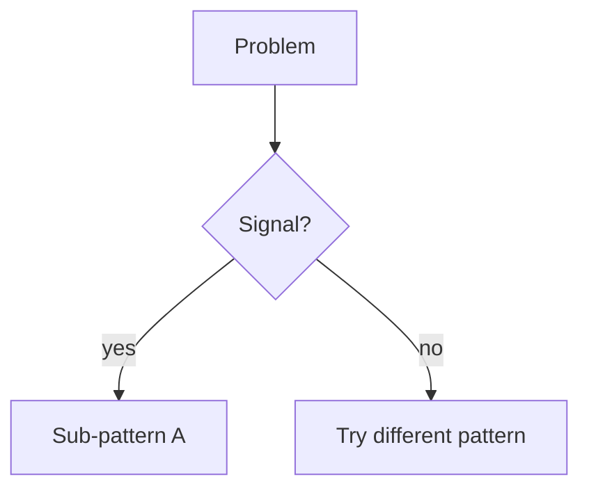

# <!-- NN. Pattern Name --> (NeetCode category)

<!-- One-line description: what family of problems this covers. -->

---

## Recognition

### Problem signals
<!-- Phrases / shapes that should make you think of this pattern -->
| You read… | Likely this pattern |
|-----------|---------------------|
| | |

### Constraints that confirm it
<!-- e.g. contiguous subarray + optimize length → sliding window -->
-

---

## Sub-patterns

<!-- Break the topic into 2–4 variants. Example for sliding window: fixed vs variable. -->

### <!-- Sub-pattern 1 name -->
**When:** 
**Mechanism:** 
**Examples:** 

### <!-- Sub-pattern 2 name -->
**When:** 
**Mechanism:** 
**Examples:** 

---

## Templates

Pseudocode only — not tied to any language.

### <!-- Sub-pattern 1 -->
```
function subPattern1(input):
    initialize state

    for each element in input:
        // update state incrementally

    return answer
```

### <!-- Sub-pattern 2 -->
```
function subPattern2(input):
    left ← 0

    for right from 0 to length(input) - 1:
        // expand window with input[right]

        while window is invalid:
            // shrink from input[left]
            left ← left + 1

        update best answer using [left, right]
```

---

## Decision flow

<!-- Optional: mermaid or bullet tree for picking sub-pattern -->



---

## Anti-patterns

<!-- Wrong routes — when people misapply this topic -->
| Misroute | Why it fails | Use instead |
|----------|--------------|-------------|
| | | |

---

## Complexity cheat sheet

| Variant | Time | Space |
|---------|------|-------|
| | | |

---

## NeetCode 150 — problems in this bucket

| # | Problem | Difficulty | Sub-pattern | Status |
|---|---------|------------|-------------|--------|
| | | | | |

---

## One-page summary

<!-- 3–5 bullets you'd read the morning of an interview -->

-
