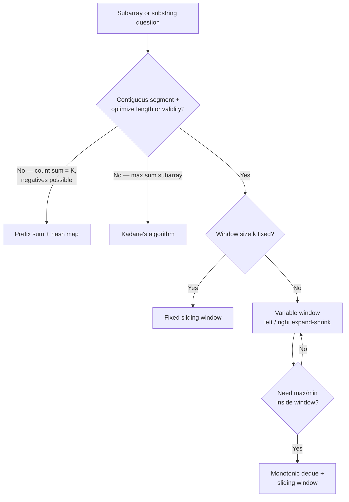

# Pattern Recognition Guide

First guess from problem wording + constraints. **Not every problem has one answer** — use this to start, then verify with constraints.

For full pattern docs, add files like `03-sliding-window.md` using [`_template.md`](./_template.md).

---

## Layer model

```
Problem prompt + constraints
        ↓
   Pattern family          ← this guide
        ↓
   Sub-pattern             ← e.g. fixed vs variable sliding window
        ↓
   Template + code
```

---

## Phrase → pattern (quick lookup)

| You read… | Try first | NeetCode category |
|-----------|-----------|-------------------|
| find two numbers / complement / anagram | Hash map or set | Arrays & Hashing |
| two sum on **sorted** array | Two pointers (opposite ends) | Two Pointers |
| **in-place** remove / filter / merge sorted | Two pointers (read/write) | Two Pointers |
| **longest/shortest substring** | Variable sliding window | Sliding Window |
| subarray of **size k** / max average length k | Fixed sliding window | Sliding Window |
| **at most K** distinct / flips / replacements | Variable sliding window | Sliding Window |
| subarray sum **equals K** (negatives allowed) | Prefix sum + hash map | Arrays & Hashing |
| **maximum subarray sum** | Kadane's (greedy / 1-D DP) | 1-D DP |
| next greater / smaller element | Monotonic stack | Stack |
| valid parentheses / nested structure | Stack | Stack |
| histogram / largest rectangle | Monotonic stack | Stack |
| find in **sorted** array / rotated sorted | Binary search on array | Binary Search |
| minimize/maximize **answer** s.t. condition | Binary search on answer | Binary Search |
| reverse / cycle / merge / middle of list | Fast/slow or dummy head | Linked List |
| tree path / depth / same structure | DFS or BFS | Trees |
| level-order / shortest depth | BFS | Trees |
| prefix of words / autocomplete | Trie | Trie |
| **top K** / Kth largest / merge K lists | Heap | Heap / Priority Queue |
| **all** subsets / permutations / combinations | Backtracking | Backtracking |
| islands / connected components / clone graph | DFS/BFS + visited | Graphs |
| shortest path **unweighted** | BFS | Graphs |
| shortest path **weighted** (non-negative) | Dijkstra | Advanced Graphs |
| prerequisites / dependency order | Topological sort | Advanced Graphs |
| pick / skip / max ways on sequence | 1-D DP | 1-D DP |
| two strings / grid paths | 2-D DP | 2-D DP |
| merge meetings / overlapping intervals | Sort + sweep / greedy | Intervals |
| single number / subset via bits | XOR / bit masks | Bit Manipulation |

---

## Subarray / substring decision tree

Not all subarray problems use sliding window.



| Sub-problem shape | Technique | Sub-pattern |
|-------------------|-----------|-------------|
| Length exactly / at most k | Sliding window | **Fixed** — window always width k |
| Longest/shortest with constraint | Sliding window | **Variable** — expand right, shrink left |
| Count subarrays with sum = K | Prefix sum + hash | Not sliding window if negatives exist |
| Maximum subarray sum | Kadane's | Greedy / 1-D DP |

---

## NeetCode 150 categories → what they solve

| # | Category | Solves problems about… |
|---|----------|------------------------|
| 1 | Arrays & Hashing | Lookup, counting, duplicates, complements |
| 2 | Two Pointers | Sorted pairs, in-place array edits, palindromes |
| 3 | Sliding Window | Contiguous subarray/substring optima |
| 4 | Stack | Matching, monotonic next/previous greater |
| 5 | Binary Search | Sorted search, search space on the answer |
| 6 | Linked List | Pointer manipulation, cycles, reversal |
| 7 | Trees | Hierarchy, paths, traversal, BST rules |
| 8 | Tries | Prefix queries over strings |
| 9 | Heap / Priority Queue | Top-K, streaming median, K-way merge |
| 10 | Backtracking | Enumerate all valid configurations |
| 11 | Graphs | Reachability, components, unweighted shortest path |
| 12 | Advanced Graphs | Weighted shortest path, MST, topo sort |
| 13 | 1-D DP | Optimal substructure on a line |
| 14 | 2-D DP | Two sequences or grid state |
| 15 | Greedy | Local choice with global proof |
| 16 | Intervals | Overlap, scheduling, merging ranges |
| 17 | Math & Geometry | Formulas, gcd, matrix tricks |
| 18 | Bit Manipulation | Powers of two, subsets, XOR properties |

---

## When the obvious pattern is wrong

| Problem shape | Obvious guess | Often wrong because… | Better fit |
|---------------|---------------|----------------------|------------|
| Subarray sum = K | Sliding window | Negative numbers break the two-pointer sum | Prefix sum + hash |
| Longest increasing | Sliding window | Might mean **subsequence**, not subarray | DP / patience sorting |
| 3Sum | Hash map | Hard to avoid duplicates | Sort + two pointers |
| Shortest path | DFS | DFS doesn't guarantee shortest | BFS (unweighted) |
| Top K frequent | Sort full array | O(n log n) wasteful | Heap or bucket sort |

---

## Adding a new pattern doc

1. Copy [`_template.md`](./_template.md) → `NN-topic-slug.md`
2. Fill recognition, sub-patterns, templates, anti-patterns
3. Link problems from [`progress.md`](../progress.md)
4. Add a row to the category table above if needed
