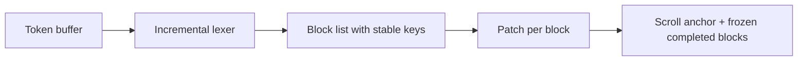
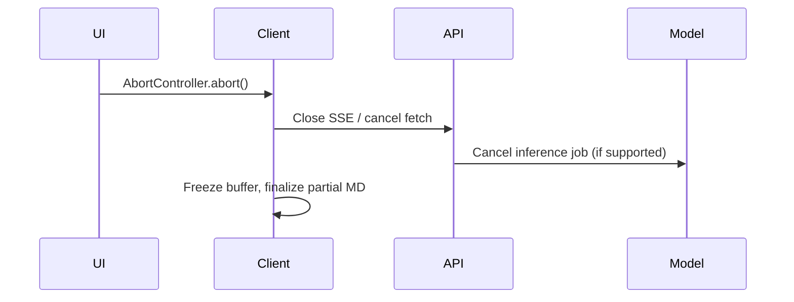
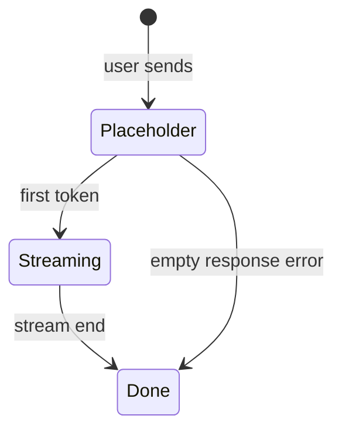

# Section 1 — Streaming & Real-Time Rendering (Answers)

Interview-depth answers for Claude-style AI chat frontends: problem framing, approach, tradeoffs, concrete techniques, and pitfalls.

---

## Core

### How do you render incomplete Markdown mid-stream without layout thrash?

**Problem framing:** Tokens arrive as plain text, but the UI must show formatted Markdown (headings, lists, code fences, links). Re-parsing the entire message and replacing the DOM on every token causes **layout thrash**: reflow, scroll jumps, flickering list markers, and collapsed-then-expanded code blocks.

**Approach:** Treat streaming render as a **stable incremental pipeline**, not “re-render the whole message.”

1. **Parse incrementally** — Maintain a lexer/parser state machine (or use a streaming-capable parser) that classifies the buffer into *blocks* (paragraph, heading, list item, fenced code, table). Only re-parse from the last *incomplete* block boundary backward, not from byte zero. Libraries like `marked` are batch-oriented; production UIs often use **remark/rehype** on a block cache, or a custom tokenizer tuned for partial input.

2. **Stable DOM mapping** — Assign each logical block a stable `key` (block index + type). Update block *content* in place (text nodes, `innerHTML` for inline only where safe) instead of unmounting/remounting the whole message. New blocks append; completed blocks freeze.

3. **Defer expensive work** — Syntax highlighting (Shiki, Prism) runs on **completed** code fences only. Incomplete fences render as a plain `<pre>` with a monospace class; swap to highlighted tree once the closing ``` arrives.

4. **Contain layout** — `content-visibility: auto`, `min-height` on message shells, and **scroll anchoring** (`overflow-anchor: auto` on the scroll container) reduce viewport jumps when block heights change.



**Tradeoffs:** Full AST correctness on partial Markdown is impossible (e.g. `*` might start emphasis or a list). Heuristics + “provisional” styling are acceptable; **correct on completion** is the bar. **Pitfall:** Using `dangerouslySetInnerHTML` on the full message each tick — XSS risk and guaranteed thrash. **Pitfall:** Measuring height after every token for virtualization without caching block metrics.

---

### How do you throttle token appends so the DOM doesn't repaint 50×/sec?

**Problem framing:** Model output can arrive at 30–100+ small chunks per second. Each `setState` / DOM write can trigger style, layout, paint, and composite — blowing the 16ms frame budget.

**Approach:** Separate **network ingestion** from **render commits** using a micro-batching layer:

| Layer | Responsibility |
|--------|----------------|
| Network | Append to a string buffer / ring buffer immediately (never drop tokens) |
| Scheduler | Flush buffer to React state on `requestAnimationFrame` or `queueMicrotask` batch |
| Fallback | `setTimeout(16–32ms)` cap if rAF pauses (background tab) |

**Concrete techniques:**

- **`requestAnimationFrame` coalescing** — One state update per frame; merge all tokens since last frame into one append.
- **React 18 `startTransition`** — Mark streaming text updates as transitions so input and sidebar stay responsive.
- **Refs for hot path** — Hold the live string in a ref; commit to state every N ms or every frame; display layer reads ref for sub-frame smoothness in canvas/DOM hybrid designs.
- **CSS `contain: layout style`** on message bubbles to limit invalidation scope.

```text
tokens --> [buffer] --rAF--> setState once/frame --> Markdown pipeline
```

**Tradeoffs:** Batching adds 0–16ms visual latency — acceptable for chat; unacceptable for collaborative cursors. **Pitfall:** Batching only React but re-running Markdown parse on the full 50k-char message each frame — CPU bound, not paint bound. **Pitfall:** Using lodash `debounce(300ms)` — feels laggy; use rAF-aligned micro-batches instead.

---

### How do you implement a stop-generation button that actually stops the stream?

**Problem framing:** “Stop” must halt **three** things: token delivery, server-side inference (cost/GPU), and client-side rendering/processing. Closing the UI spinner alone is insufficient.

**Approach — end-to-end cancellation chain:**



1. **Client** — Keep an `AbortController` per active stream; pass `signal` to `fetch()` (SSE over fetch) or call `eventSource.close()` and abort the underlying fetch. On abort, stop appending to the buffer and **finalize** the partial message (mark `status: cancelled`, run final Markdown pass).

2. **Transport** — SSE: closing the connection signals the server (with well-implemented handlers). WebSocket: send a `cancel` / `stop` frame with `request_id` so the server can correlate.

3. **Server** — Propagate cancellation to the LLM provider (`stream: true` streams often support closing the HTTP connection to stop billing). Maintain a **job registry** (`request_id → cancel fn`); on disconnect or explicit cancel API, call provider abort and persist partial assistant message.

4. **UI** — Disable Stop after ack; show partial content with optional “Generation stopped” footer. Idempotency: ignore late tokens after abort (sequence numbers or `stream_closed` flag).

**Tradeoffs:** Some providers drain buffered tokens after close — accept partial billing. **Pitfall:** Only aborting client state while the server keeps generating — wasted cost and race when tokens arrive after “stopped.” **Pitfall:** Not persisting partial messages — user loses work on refresh.

---

### What is the difference between SSE and WebSockets — when would you pick each?

**SSE (Server-Sent Events)** — Unidirectional **server → client** over HTTP. Built on `text/event-stream`, automatic browser reconnect, simple `fetch` + ReadableStream or `EventSource`. Fits **LLM token streaming** where the client sends one prompt (POST) and reads many events.

**WebSockets** — Full-duplex, persistent frame channel. Fits **bidirectional** chat: typing indicators, collaborative editing, tool progress from client and server, multiplexed rooms, binary frames.

| Criterion | SSE | WebSocket |
|-----------|-----|-----------|
| Direction | Server → client (client starts via HTTP) | Bidirectional |
| HTTP/2 / proxies | Works through most CDNs; standard HTTP | Some proxies timeout idle WS |
| Reconnect | `EventSource` + `Last-Event-ID` | Manual heartbeat + resume protocol |
| Multiplexing | One stream per connection typically | Many logical channels per socket |
| Tooling | curl, HTTP logs, standard auth headers | Custom protocol |

**When to pick SSE:** Default for **AI chat completion streams** (Claude/OpenAI-style), especially with HTTP/2, standard cookies/JWT on the initial POST, and infrastructure that prefers HTTP.

**When to pick WebSockets:** Multiplayer features, **voice**, frequent client→server chunks, unified connection for notifications + chat + presence, or avoiding HTTP connection limits at very high concurrency.

**Hybrid (common in production):** POST to start generation (SSE response body) + WebSocket for session sync, or SSE for tokens and REST for control (cancel, retry).

**Pitfall:** Using WebSockets “for performance” when 99% of traffic is server-push — adds heartbeat complexity without benefit.

---

### How do you handle a stream that drops midway — reconnect, retry, or resume?

**Problem framing:** Mobile networks, load balancers, and idle timeouts kill long streams. The product must choose among **reconnect**, **retry from scratch**, and **true resume** without duplicating or corrupting the assistant message.

**Decision framework:**

```text
Drop detected
    |
    +-- No message id / no cursor --> RETRY (new request, discard or hide partial)
    |
    +-- Server supports resume cursor --> RESUME (same generation, offset)
    |
    +-- SSE with Last-Event-ID --> RECONNECT (event replay if server buffers)
    |
    +-- Partial persisted in DB --> SHOW partial + "Continue" / manual Retry
```

1. **Reconnect (SSE-native)** — Client tracks `lastEventId`; on disconnect, `EventSource` reconnects with header `Last-Event-ID`. Server must **buffer recent events** (Redis stream, short TTL) or replay from stored partial output. Works when the *same* generation is still running server-side.

2. **Retry** — New API call with same user message; server may return a **new** completion (non-deterministic). Use idempotency keys if billing must dedupe. UX: “Connection lost — Retry” preserves user message; assistant bubble shows partial + regen.

3. **Resume (best UX, hardest)** — Protocol: `stream_id`, `byte_offset` or `token_index`. Server continues generation from checkpoint (requires provider support or server-side buffering of prompt + partial completion). Anthropic/OpenAI often don’t expose mid-stream resume — **application-level** resume = append “continue from: …” with partial text (hacky) or store chunks and only fetch missing suffix from your own buffer.

**Concrete client behavior:** Exponential backoff (1s, 2s, 4s, cap 30s), max attempts, then surface error with **partial content retained** in local state and IndexedDB. Distinguish **user abort** vs **network drop** in analytics.

**Pitfalls:** Blind retry creating duplicate assistant messages. Reconnect without idempotency producing duplicate paragraphs. Assuming resume when the server started a new job — always correlate with `message_id` / `generation_id`.

---

## Deep

### How do you buffer tokens before flushing to the DOM — what's the right interval?

**Problem framing:** Pure per-token rendering wastes frames; aggressive debouncing feels sluggish. The buffer sits between **network arrival rate** (variable) and **display refresh rate** (60Hz, or 120Hz).

**Right interval (rule of thumb):**

| Strategy | Interval | When |
|----------|----------|------|
| rAF-aligned | ~16ms (1 frame) | Default; smooth scroll, 60Hz displays |
| 2-frame batch | ~32ms | Heavy Markdown/highlight per flush |
| Adaptive | 16–48ms based on p95 parse time | Large messages, mobile |
| Max wait cap | 50–80ms | Ensure progress visible on slow devices even if frames skip |

**Implementation pattern:**

```javascript
// Pseudocode: dual constraint flush
flushIf:
  buffer.length >= 80 chars OR
  timeSinceLastFlush >= 32ms OR
  receivedStreamEnd
schedule: requestAnimationFrame(flush)
```

**Adaptive backpressure-aware batching:** If Markdown parse + layout exceeds 8ms consistently, increase target interval to 48ms and/or parse fewer blocks per flush (see backpressure question).

**Tradeoffs:** Character thresholds (e.g. 40 chars) smooth CJK vs Latin differently — prefer **time + rAF** as primary, char count as secondary to avoid stutter on slow token trickle. **Pitfall:** Fixed 300ms debounce — TTFT feels fine but mid-stream updates look jerky. **Pitfall:** Flushing on wall-clock only without rAF — tears and misalignment with scroll.

---

### How do you handle a code block that opens with ``` but the closing fence hasn't arrived yet?

**Problem framing:** A premature closing fence guess wrong splits the block; treating everything as prose breaks formatting mid-stream. Code blocks are the highest-cost render (highlighting, copy button, line numbers).

**Approach — explicit fence state machine:**

```text
OUTSIDE_CODE --"```lang"--> IN_CODE (provisional)
IN_CODE --"```\n" on own line--> OUTSIDE_CODE (finalize)
IN_CODE --more tokens--> IN_CODE (extend plain pre)
```

1. **Provisional fence** — On opening ``` + optional language id, render a **single** `<pre><code class="language-xyz streaming">` with unhighlighted text. Do not run Shiki until closed.

2. **No false closes** — Require closing fence at line start (after newline), optional whitespace, then ```. Ignore triple backticks inside strings if you do mini-parsing; for interview simplicity: line-based fence detection matches CommonMark behavior.

3. **Height stability** — `white-space: pre-wrap`, monospace font, min-height from line count × line-height avoids collapse when highlight swaps in.

4. **Edge cases** — Nested fences in markdown (rare): outer fence wins until closed. Model emits ````` → show as literal until grammar resolves. **Streaming indicator:** subtle cursor or pulsing border on open fence only.

5. **On close** — One-shot highlight (Web Worker for Shiki), add copy button, swap class from `streaming` to `highlighted`.

**Tradeoffs:** Line-based detection fails on code that contains ``` in output — acceptable; show warning “code block may be incomplete” if stream ends in `IN_CODE`. **Pitfall:** Running highlight on every token inside the block — O(n²) re-highlight. **Pitfall:** Injecting HTML before escape — always escape code body, never parse as HTML.

---

### How do you render a streaming table where rows arrive one token at a time?

**Problem framing:** Markdown tables need header row, separator `|---|`, and body rows. Token-by-token arrival means partial rows, misaligned columns, and huge reflow if the whole table re-parses.

**Approach:**

1. **Table sub-state machine** — After detecting `|...|`, enter `TABLE_PENDING` until separator line validates headers. Before separator, render as **plain preformatted** text (no `<table>` yet) to avoid invalid table DOM.

2. **Row commit model** — Append a `<tr>` only when a full row line arrives (ends with `\n` and starts/ends with `|`). Cells: split on `|`, trim, escape HTML. Incomplete last line: show in a **staging row** (`opacity: 0.6`) or keep in a `<pre>` below the table.

3. **Column stability** — On first complete row, compute `columnCount` and `colgroup` widths (fixed % or `minmax`). Do not reshuffle columns as later rows reveal wider content — use `table-layout: fixed` and `text-overflow: ellipsis` until stream completes, then optional remeasure.

4. **Performance** — For wide tables, virtualize **rows** inside the message (only visible `<tr>` in DOM). Header sticky within the message bubble.

```text
| A | B |        ->  preformatted strip (no table)
| --- | --- |    ->  <table><thead>...
| 1 | 2 |        ->  <tbody><tr>...
| 3 | 4 | (no \n) ->  staging row or pre
```

**Tradeoffs:** GitHub-flavored Markdown tables only; HTML tables from model need sanitization. **Pitfall:** Building `<table>` before separator — header row jumps when separator arrives. **Pitfall:** Re-splitting entire table body on each token — quadratic work.

---

### How do you show a "typing indicator" that transitions seamlessly into real content?

**Problem framing:** Users expect immediate feedback after send (TTFT). A bouncing dots loader that **disappears** then content **pops in** feels disjoint; the transition should feel like one continuous assistant “turn.”

**Approach — single assistant message slot:**



1. **One bubble, multiple phases** — Create assistant message `id` immediately with `status: pending`. Content area shows typing indicator (CSS animation, optional “Thinking…” for reasoning models). **Same container** receives tokens — indicator removed on first token *inside* that container, not by unmounting the whole bubble.

2. **Crossfade, not swap** — `opacity` transition: indicator fades 150–200ms as first text fades in. Avoid layout shift: reserve `min-height: 2.5rem` or match indicator height to one line of body text.

3. **Reasoning / tool phases** — Replace dots with “Reading files…” or tool pill strip; first content token collapses only the **active** sub-indicator, not the full message chrome (avatar, actions).

4. **Accessibility** — `aria-live="polite"` on the message region; `aria-busy="true"` until first content; announce “Assistant is responding” once.

**Tradeoffs:** Showing indicator after TTFT &lt; 200ms can flash annoyingly — delay indicator 100–150ms unless reasoning UI always needs it. **Pitfall:** Separate DOM nodes for loader vs message — causes pop and scroll jump. **Pitfall:** Removing message shell on first token — breaks scroll anchor and message actions.

---

### How do you handle backpressure if the client is rendering slower than tokens arrive?

**Problem framing:** Fast Wi-Fi + slow phone, or heavy Shiki/highlight, can make the **consumer** (parse + layout + paint) slower than the **producer** (tokens/sec). Unbounded buffers grow memory and increase lag between “true” stream position and what the user sees.

**Approach — multi-layer backpressure:**

```text
Network --> [ring buffer cap] --> [parse queue] --> [rAF display queue] --> DOM
                |                      |
                drop/coalesce          shed: skip highlight
                or pause read          extend batch interval
```

1. **Bound the inbound buffer** — e.g. 256KB or 30s of tokens. When full: **pause TCP** by not reading from `ReadableStream` (`reader.read()` not called) — natural HTTP flow control — or cancel upstream with policy.

2. **Coalesce in the buffer** — Merge tokens into larger chunks before parse queue; store “skipped display frames” but keep full text in the canonical string for final message persistence (never drop data for the saved message, only for intermediate frames).

3. **Shed expensive work** — Skip syntax highlight, defer KaTeX, render plain text until `idle` callback or stream end. Increase flush interval adaptively when `performance.now() - lastFlush > budget`.

4. **Catch-up mode** — If lag &gt; N seconds behind live buffer, jump UI to **latest** tail (user sees live edge) while background catches up persisted log — or show “Rendering…” with skip-to-end. Chat products usually prefer showing the **tail** (most recent tokens) for long delays.

5. **Measure** — `tokens_received - tokens_rendered`, frame time p95, parse ms; alert if sustained gap &gt; 500ms.

**Tradeoffs:** Pausing `read()` applies TCP backpressure — good for memory; may hit server write timeouts — coordinate with keep-alive/ping. **Pitfall:** Dropping tokens to “keep up” without merging into canonical store — corrupted final message. **Pitfall:** Unbounded `useState` string copies on every chunk — GC pressure; use mutable buffer + periodic immutable snapshot for React.

**Libraries/patterns:** `ReadableStream` default queuing; `TransformStream` for coalescing; Web Worker for Markdown/highlight so main thread backpressure is parse-bound; `scheduler.postTask` (where available) for lower-priority highlight.

---

*Next section: [02 — Conversation State Management](./02-conversation-state-management.md) (when available).*
