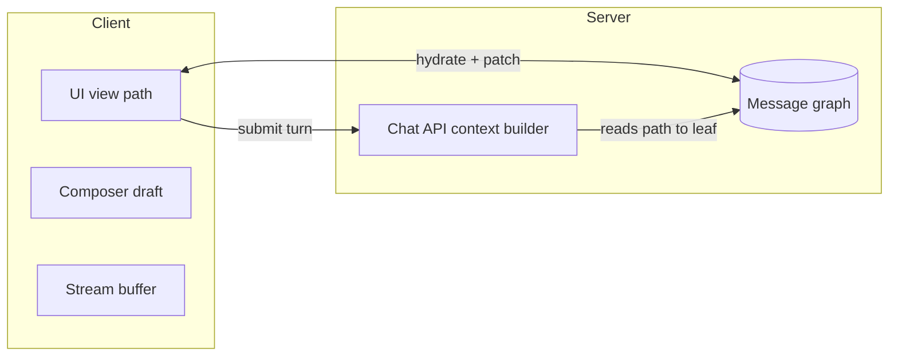
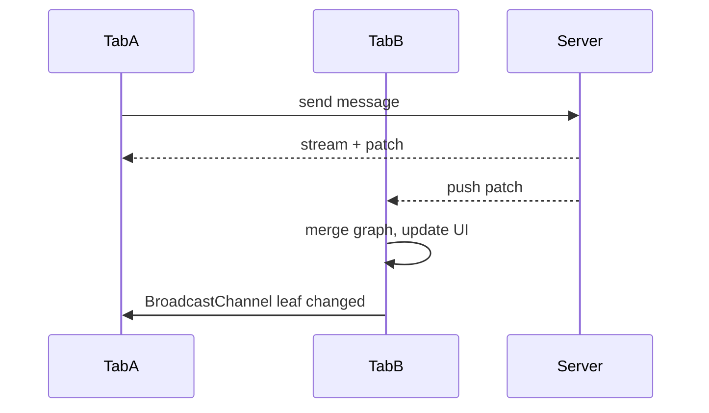
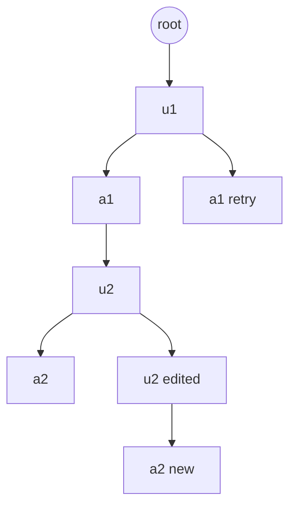

# Section 2 — Conversation State Management

Interview-prep answers for Claude-style AI chat frontends: where state lives, edits, branching, multi-tab sync, context limits, and persistence.

---

## Core

### Where does conversation state live — client, server, or both?

**Framing:** Conversation state is not one blob—it splits into *authoritative history* (what the model actually saw), *presentation state* (which branch is visible, scroll, drafts), and *ephemeral runtime* (in-flight stream, optimistic placeholders).

**Approach:** Use a **split authority model**. The server owns durable conversation records: message IDs, parent pointers for branches, content, attachments metadata, and the canonical path sent to the API. The client owns UI-local state: active branch pointer, composer draft, scroll position, partial stream buffer, and optimistic rows before ACK. On load, the client hydrates from the server and reconciles; during chat, the client updates optimistically and patches from server events (SSE/WebSocket or polling).

**Tradeoffs:** Client-only storage (localStorage) is fast offline but breaks multi-device and cannot enforce auth or billing. Server-only with no local cache feels laggy and loses drafts on refresh. Both is the production default: server is source of truth for replay and model calls; client is source of truth for *interaction latency* until sync completes.

**Data structures:** Server stores messages as nodes (`id`, `parentId`, `role`, `content`, `createdAt`, `status`). Client keeps `messagesById: Map`, `activeLeafId`, and a derived `visiblePath: Message[]` from root → active leaf. Pitfall: treating the React messages array as authoritative—it must be a *view* over the graph, not the store.



---

### How do you handle editing a previous message and regenerating from that point?

**Framing:** Editing message *k* is not an in-place update—it forks history. The model must receive messages `[0..k-1, k', ...]` where `k'` is the edited user turn; everything after the old `k` on that branch becomes stale or archived.

**Approach:** (1) User edits message `k` → create a **new message node** `k'` with `parentId = parent(k)` (sibling of original `k`), or replace-in-place only if `k` had no children yet. (2) Set `activeLeaf` to `k'`. (3) Truncate the *API context* to the path from root through `k'`—do not send descendants of the old `k`. (4) Call generate with that path; stream assistant reply as child of `k'`. UI shows the new path; old branch remains reachable via branch switcher.

**Tradeoffs:** In-place edit is simpler when the edited message is the leaf; mid-thread edit always implies branching. Regenerating assistant-only (without user edit) reuses the same user parent and adds a new assistant sibling—same machinery, different trigger.

**Pitfalls:** Reusing the old message ID for edited content breaks caching and audit trails. Sending the full flat array including orphaned siblings poisons the model. Always build context via `getPathToLeaf(activeLeafId)`.

```ascii
Before edit:          After edit at k:
  u1                    u1
   └ a1                  ├ a1 (old branch)
      └ u2                └ u2' (edited)
         └ a2                 └ a2' (regenerated)
```

---

### How do you implement branching conversations (retry gives a different response path)?

**Framing:** "Retry" on an assistant message means: same parent user turn, **new assistant sibling**—not overwriting the failed or unsatisfactory reply.

**Approach:** Model branches as a **tree of message nodes**. Retry on assistant `a` with parent `u`: `POST` with `parentMessageId: u.id`, optionally `regenerateFrom: a.id` for analytics. Server creates `a'` as another child of `u`. Client increments branch index (`2 of 3`) and sets active leaf to `a'`. Navigation UI walks siblings at the same depth. Deleting a branch is soft-delete (`archivedAt`) so undo and compliance retain history.

**Tradeoffs:** Tree storage costs more than a linear log but matches product semantics. Linear array with "version" fields on one row works for assistant-only retries but breaks when the user edits mid-thread (multiple divergent subtrees). Prefer explicit `parentId` edges.

**Sync:** Branch selection is client presentation state until persisted (`userPreference.activeBranch per parent` optional). Server must store all siblings; client picks which sibling chain to display.

**Pitfall:** Overwriting `a` in the DB loses the prior answer users may want to compare; always sibling, never silent replace unless the message never finished (`status: streaming` aborted).

---

### How do you sync conversation state across two open tabs on the same conversation?

**Framing:** Two tabs are two replicas of one conversation; without coordination they double-send, diverge on branch choice, or show stale streams.

**Approach — layers:**

1. **Authoritative server events:** After any mutation, server broadcasts (SSE fan-out, WebSocket room `conversation:{id}`, or short polling). Payload: patched nodes or version vector `{ conversationRevision, messagePatches[] }`.
2. **Cross-tab local sync:** `BroadcastChannel('conv:{id}')` or `storage` event for lightweight signals (active branch changed, draft updated, stream started) when both tabs are same origin.
3. **Leader election for sends:** Only one tab should own an in-flight generation, or use server-side lock (`generationId`, 409 if busy). Tab B sees "Generating in another tab" if A holds the lock.

**Conflict rules:** Server revision wins on content. Last-writer-wins is acceptable for `activeLeafId` and draft with timestamp. Never merge two concurrent user sends—queue or reject second with UX prompt.



**Pitfall:** Syncing only the linear `messages[]` array without `parentId` cannot reconstruct branches after concurrent retries in two tabs.

---

### What is your strategy when the context window fills up — truncate, summarize, or paginate?

**Framing:** The limit is on **tokens in the model request**, not on UI list length. Users still scroll full history; the API gets a compressed *working set*.

**Approach — tiered strategy (combine in practice):**

| Strategy | Use when | Pros | Cons |
|----------|----------|------|------|
| **Truncate (sliding window)** | Long thread, recent turns matter most | Deterministic, cheap | Loses early facts |
| **Summarize** | Need retention of old facts | Keeps semantic memory | Cost, drift, latency |
| **Paginate (UI only)** | Display 10k messages | Great UX | Does not shrink API context alone |

**Production pattern:** Keep full graph in DB for UI. At request time, `buildContext(activePath, budget)`:

1. Always include system prompt + recent *N* turns on the active path (newest first until budget).
2. If over budget, inject a **rolling summary** node (hidden `role: system` or vendor-specific summary block) generated async when thread crosses threshold.
3. Optionally retrieve relevant older turns via RAG over message embeddings (not true pagination into the model, but selective recall).

**Tradeoffs:** Summaries can hallucinate thread facts—version summaries per branch, re-summarize on major fork. Hard truncate is safer for compliance-heavy chats. Never silently drop the current user message.

**Pitfall:** Summarizing across branches mixes incompatible histories—summarize **per path to active leaf** only.

---

## Deep

### How do you model a branched conversation as a data structure — tree vs linear array?

**Framing:** The API expects a linear `messages[]`, but the product is a DAG (usually a tree). The model is the mapping between them.

**Tree (recommended):**

```ts
type MessageNode = {
  id: string;
  parentId: string | null;
  role: 'user' | 'assistant' | 'system' | 'tool';
  content: ContentBlock[];
  children: string[];        // or derive via index parentId -> ids
  status: 'draft' | 'sent' | 'streaming' | 'error';
  siblingIndex?: number;     // optional cache
};

type Conversation = {
  id: string;
  rootId: string | null;
  activeLeafId: string;
  nodes: Record<string, MessageNode>;
};
```

**Linear array:** Fine for prototype (`messages: Message[]`) until branch/retry/edit. Workarounds (`branchId`, `replacesMessageId`) accrete into a implicit tree—migrate early.

**Deriving API payload:**

```ts
function pathToLeaf(nodes: Record<string, MessageNode>, leafId: string): MessageNode[] {
  const path: MessageNode[] = [];
  let cur: string | null = leafId;
  while (cur) {
    path.push(nodes[cur]);
    cur = nodes[cur].parentId;
  }
  return path.reverse();
}
```

**Tradeoffs:** Tree enables O(path) context build and O(1) branch switch. Array + copy-on-write fork is O(n) per edit. DB: adjacency list (`parent_id`) or closure table for analytics queries ("all descendants of u2").



**Pitfall:** Cycles from bad `parentId` break traversal—validate on write.

---

### How do you reassemble the messages array after a mid-conversation edit?

**Framing:** "Reassemble" means: (a) UI list for render, (b) API array for the next request—same path, different projections.

**Algorithm:**

1. User submits edit at node `k` → create `k'` with `parentId = k.parentId` (or `parent(k)` in tree terms).
2. Set `activeLeafId = k'`.
3. `visibleMessages = pathToLeaf(nodes, activeLeafId)` — excludes old siblings below the fork point from the *new* path until new children exist.
4. Append streaming placeholder child `a_pending` under `k'`.
5. On stream complete, replace placeholder with final assistant node.

**For the API:** Map `visibleMessages` to provider format; strip UI-only fields (`siblingIndex`, `isActiveBranch`). Attachments and tool blocks must stay ordered per turn.

**Edge cases:** Edit on assistant message is usually disallowed (edit user, regenerate assistant). Edit while streaming: cancel in-flight generation, mark partial node `aborted`, fork from last stable user node.

**Pitfall:** Filtering `messages.filter(m => !m.archived)` on a flat list without walking `parentId` leaves holes or wrong order—always path reconstruction from leaf.

```ascii
Reassemble path (active leaf = a2'):
  root → u1 → a1 → u2' → a2'
  (u2 and old a2 not on path)
```

---

### How do you handle optimistic UI rollback if a regenerated message fails?

**Framing:** Optimistic UI shows the new branch before the server confirms. Failure modes: network error, 4xx validation, 5xx, stream abort, moderation block.

**Approach — state machine per optimistic node:**

```ts
type OptimisticState =
  | { phase: 'pending'; tempId: string }
  | { phase: 'confirmed'; serverId: string }
  | { phase: 'failed'; error: Error; rollbackSnapshot: Snapshot };
```

**Flow:**

1. On edit/regenerate: snapshot `{ activeLeafId, visiblePath ids }`, apply optimistic graph (temp IDs, `status: streaming`).
2. On success: remap `tempId → serverId`, clear snapshot.
3. On failure: **rollback** — restore `activeLeafId` and node map from snapshot; remove temp subtree; toast with retry. If partial stream arrived, keep partial in an "failed attempt" sibling (status `error`) instead of rollback-only—user may want to see what failed.

**Tradeoffs:** Full graph rollback vs leaving a failed leaf. Product choice: Claude-like often keeps failed sibling with error badge; strict rollback feels safer for inconsistent API state.

**Idempotency:** Client sends `clientRequestId` so retry does not duplicate nodes server-side.

**Pitfall:** Remapping IDs breaks React keys mid-animation—key on stable `clientRequestId` until server ID arrives.

---

### How do you implement "undo" for a sent message?

**Framing:** "Undo" in chat is not a general time machine—it is **recoverable removal or return to prior branch**, bounded by policy (e.g. 30s, or until next message).

**Patterns:**

1. **Branch-based undo (preferred):** "Undo send" = revert `activeLeafId` to the parent before the message (message stays in graph, `archived` or hidden). No API call if next turn has not been generated. If assistant already replied, undo = switch active path back to previous leaf (user sees prior branch). Aligns with tree model.

2. **Soft delete:** Set `deletedAt` on node; rebuild path skipping deleted nodes for future API calls; UI collapses with "Message removed."

3. **True retract (hard):** DELETE on server + purge from context—needed for compliance (PII sent by mistake). Requires admin/mod pipeline if assistant already ingested content in logs.

**Client UX:** Toast "Undo" with timer; store `lastMutation: { type, prevLeafId, nodeId }` in memory (not long-term DB). Second action clears undo stack.

**Server:** Optional `undoWindow` rejects delete if child exists and policy forbids; else cascade archive children.

**Tradeoffs:** Undo after model used content in a later turn cannot un-inform the model—must edit/regenerate from corrected path, not magic erase.

**Pitfall:** Implementing undo as `pop()` on a linear array corrupts branch history—always pointer move or archive on the graph.

---

### How do you persist draft messages across page refreshes?

**Framing:** Drafts are **uncommitted user input**—must not enter model context or branch graph until send.

**Approach — layered persistence:**

| Layer | Scope | Mechanism |
|-------|--------|-----------|
| **In-memory** | Current session | React state / Zustand |
| **localStorage / IndexedDB** | Per-device, survives refresh | `drafts:v1:{conversationId}` → `{ text, attachments meta, updatedAt }` |
| **Server draft (optional)** | Cross-device | Autosave API debounced 1–2s; `status: draft` row or separate `Draft` table |

**Implementation details:**

- Debounce writes 300–500ms; `beforeunload` flush.
- On mount: load draft after conversation hydrate; if server has newer `draftUpdatedAt`, prefer server.
- **Do not** create a `MessageNode` in the branch tree for drafts—keeps `pathToLeaf` clean.
- Attachments: store refs (uploadId) not File blobs in localStorage; rehydrate from upload session.
- Clear draft on successful send (same `clientRequestId` ack).

**Privacy:** localStorage for logged-in sensitive chats—offer opt-out or encrypt at rest (limited) for enterprise.

**Multi-tab:** `BroadcastChannel` syncs draft text; last-write-wins on `updatedAt` prevents oscillation.

**Pitfall:** Putting draft in the messages array and accidentally including it in `buildContext()` pollutes the model—strict separation of `composerState` vs `committedNodes`.

```ascii
┌─────────────────┐     send      ┌──────────────────┐
│ Composer draft  │ ──────────────► │ Message graph    │
│ (local/server)  │               │ (server truth)   │
└─────────────────┘               └──────────────────┘
        │ refresh OK                     │ API context
        ▼                                  ▼
   localStorage                      pathToLeaf only
```

---

## Quick reference (interview close)

| Topic | One-liner |
|-------|-----------|
| State location | Server owns graph; client owns view + draft + stream |
| Edit / regenerate | Fork at edit point; new path to leaf; never poison context with old branch |
| Branching | Sibling nodes under same parent; UI shows branch index |
| Multi-tab | Server push + BroadcastChannel; single-flight generation lock |
| Context limit | Full history in DB; API gets window + summary/RAG on active path only |
| Data model | Tree with `parentId`; linear array is a derived view |
| Optimistic failure | Snapshot rollback + idempotent `clientRequestId` |
| Undo | Move active leaf or archive; not array pop |
| Drafts | Outside graph; localStorage + optional debounced server autosave |
