# Killer Questions — Full System Design Answers

Deep mini design docs for the six hardest Claude-style AI chat frontend questions. Each section is self-contained for interview use.

---

## 1. Edit Message N in a 20-Message Conversation

### Requirements

| Category | Requirement |
|----------|-------------|
| Functional | User edits message at index N (0-based); all messages after N are invalidated; assistant regenerates from the edited turn onward. |
| Functional | User can switch between branches (original vs edited path) without losing either subtree. |
| Functional | Context sent to the model is the **active branch** from root → leaf, capped by context window budget. |
| Non-functional | Edit feels instant (optimistic UI); server is source of truth within ~500ms. |
| Non-functional | Concurrent edits from two tabs must converge or surface a conflict. |
| Constraints | 20 messages in view ≠ 20 nodes in storage; branching multiplies stored turns. |

The hard part is not the textarea — it is **consistent identity** across client cache, server graph, provider API shape, and regeneration streaming.

### Architecture

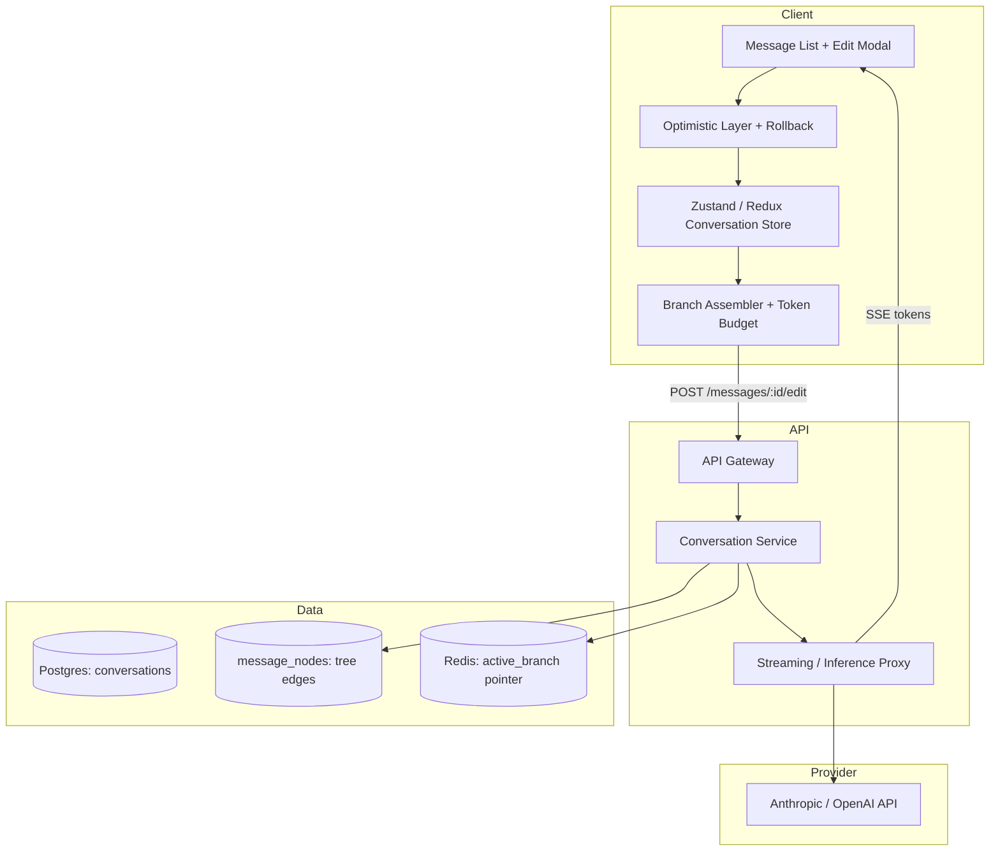

### Component Breakdown

**Message graph (server).** Store messages as nodes, not a flat array. Each node: `id`, `conversation_id`, `parent_id`, `role`, `content`, `created_at`, `branch_label` (optional), `status` (`final` | `streaming` | `superseded`). The “current” path is `active_leaf_id` on the conversation row. Editing message N creates a **sibling** under the same parent as the original N, not an in-place overwrite — preserves branch history.

**Branch assembler (client + server).** Walk from `active_leaf_id` to root via `parent_id`, reverse to chronological order, map to provider format (Anthropic strict alternation, tool blocks, etc.). Apply **token budget**: count tokens bottom-up; if over limit, drop oldest non-system messages or inject a summary node (product policy).

**Optimistic layer.** On submit edit: (1) clone local subtree after N as `pending_branch`, (2) replace messages N..end in UI with edited user message + placeholder assistant bubble, (3) assign temporary IDs (`temp-*`). On ACK: remap IDs. On failure: restore snapshot from `pre_edit_snapshot` in store.

**Regeneration orchestrator.** `POST /conversations/:cid/messages/:mid/edit` body: `{ content, client_mutation_id }`. Server: validate user owns conversation, create new user node, set `active_leaf` to parent of old N’s children (truncate active path), enqueue stream job, return `{ new_user_message_id, stream_id }`.

**Context window re-assembly.** Server authoritative assembly prevents client tampering. Include attachments and tool results on the path only if they belong to active branch. Editing a user message that triggered tool calls may require re-executing tools on the new branch — product choice: auto re-run vs ask user.

### Sequence of Operations

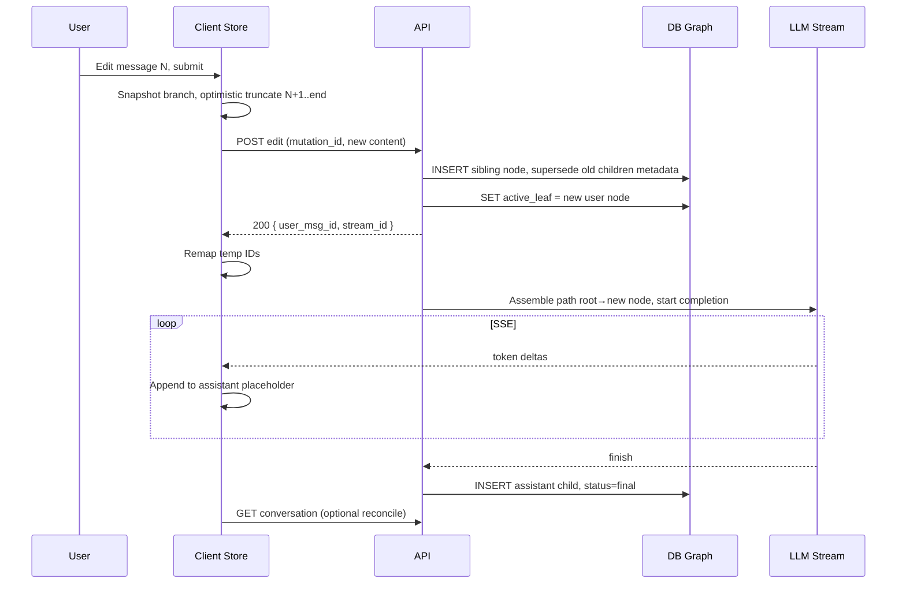

### Edge Cases

- **Edit message N that is not on the active branch.** UI should either switch branch first or edit implicitly activates that branch (Claude-style: editing activates the path containing N).
- **Edit while assistant is still streaming on the tail.** Cancel in-flight stream (AbortController + server cancel flag) before applying edit; otherwise two competing assistant nodes.
- **N is an assistant message.** Some products disallow; if allowed, treat as “retry/regenerate” (new assistant sibling) not text edit.
- **Tool-use message in the middle.** Re-assembly must include `tool_use` / `tool_result` pairs on the path; editing upstream user text may invalidate downstream tool results — drop or mark stale tool nodes.
- **Two tabs:** Tab B edits while Tab A streams. Version vector on `conversation.updated_at` + `branch_generation`; reject stale edits with 409 and merge UI.

### Failure Modes

| Failure | User sees | Recovery |
|---------|-----------|----------|
| Optimistic OK, server 4xx | Toast + rollback to snapshot | Retry edit |
| Stream fails mid-regeneration | Partial assistant text + “Retry” | Resume from partial node or delete partial and retry |
| Assembler over context limit | Inline warning before send | Truncate UI picker or auto-summarize |
| ID remap race | Duplicate or missing messages | Reconcile via full graph fetch |
| DB commit OK, stream never starts | Stuck placeholder | Poll stream status; compensating job |

### Tradeoffs

| Choice | Pros | Cons |
|--------|------|------|
| Tree vs copy-on-write array | True branching, cheap retry paths | More complex queries, UI branch switcher needed |
| Sibling node vs in-place update | History preserved | Storage growth; need GC policy |
| Client vs server assembly | Lower latency previews | Trust boundary — server must re-validate |
| Immediate stream vs confirm on long context | Better UX | Harder to cancel if user edits again quickly |

**Interview sound bite:** Treat conversation state as a **directed tree** with an **active leaf pointer**; editing is **forking**, not mutation; regeneration is **path assembly + stream**, with optimistic UI always reconciled to server graph IDs.

---

## 2. The Confirm Button Is Clicked Twice in 200ms

### Requirements

| Category | Requirement |
|----------|-------------|
| Functional | Destructive or irreversible MCP action (book flight, send email, charge card) executes **at most once** per user intent. |
| Functional | Second click within debounce window produces no duplicate side effect. |
| UX | User sees single success or single clear error; no double toast or conflicting states. |
| Non-functional | Idempotency survives tab close, network retry, and mobile double-tap. |
| Compliance | Audit log ties one business outcome to one `idempotency_key`. |

Double-click in 200ms exercises the full stack: UI event loop, HTTP retries, MCP server semantics, and eventual consistency.

### Architecture

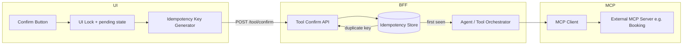

### Component Breakdown

**UI button state machine.** States: `idle` → `confirming` (on first click, **synchronous** before await) → `success` | `error`. Disable button and ignore pointer events on enter `confirming`. Do not rely on 200ms debounce alone — use `pointer-events: none` + `aria-busy`. Optional: show spinner in-button.

**Idempotency key.** Deterministic per intent: `hash(conversation_id, tool_call_id, user_id)` or client-generated UUID stored on the tool pill when rendered. **Same key for both clicks.** Server keys: `(user_id, idempotency_key)` unique index.

**Backend deduplication store.** Redis or Postgres: `INSERT ... ON CONFLICT RETURNING prior_response`. TTL 24–72h. Value: `{ status, http_body, created_at }`. First request runs MCP; duplicates return cached outcome (including errors — “same failure” is idempotent).

**Tool orchestrator.** Maps UI confirm to pending `tool_use` block from assistant turn. Validates tool still `awaiting_confirmation` (state machine). Transition `awaiting` → `executing` with compare-and-swap; second worker sees `executing` and waits or returns in-flight result.

**MCP / external layer.** Pass `Idempotency-Key` header if MCP server supports it. If not, BFF is the only dedup gate — document that external APIs without idempotency need adapter-side locks (e.g. booking hold token).

**UX rollback.** If first request succeeds but client times out and retries with same key, show success from cache — never second booking. If first fails transiently, only retry with **same key** if operation is safe-idempotent; else new user gesture.

### Sequence of Operations

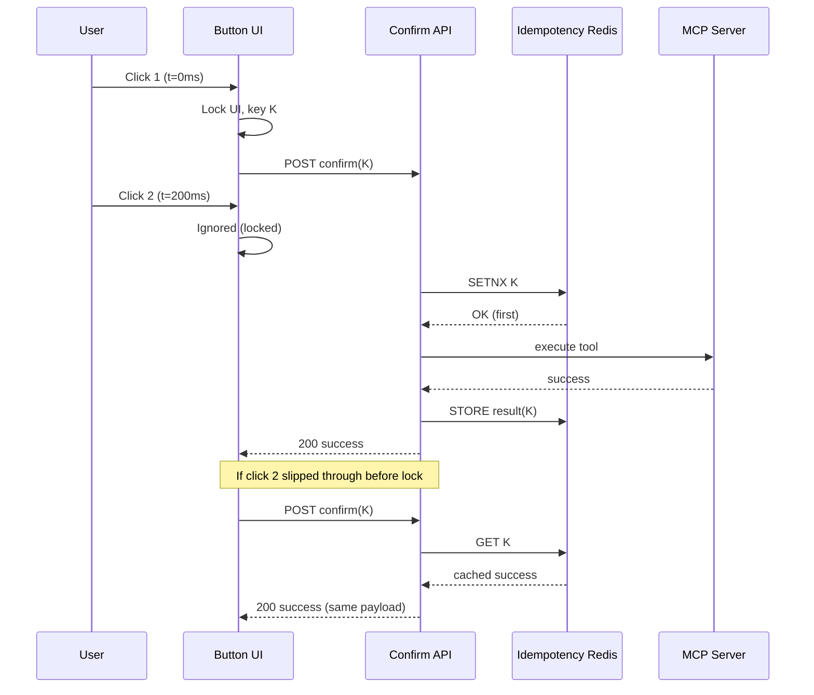

### Edge Cases

- **Two different tools, same millisecond.** Keys must include `tool_call_id`, not just conversation.
- **User clicks Confirm then Cancel on another pill.** Independent keys per tool call.
- **Idempotent success but UI never got response.** Client polls `GET /tool/status?key=K` or refetches message with `tool_result`.
- **Partial MCP success** (charged card, failed confirmation email). Not idempotent at business level — use two-phase: `reserve` + `commit` with separate keys; interview: call out saga/compensation.
- **Keyboard double-submit (Enter).** Same lock on form submit handler.

### Failure Modes

| Failure | Risk | Mitigation |
|---------|------|------------|
| UI lock only, no server dedup | Duplicate booking | Always server idempotency |
| Server dedup only, slow double click | Two requests before SETNX | UI lock + SETNX atomic |
| Cached error blocks retry | User stuck | Allow new key after explicit “Try again” UI action |
| Different keys on retry | Duplicate | Stable key from `tool_call_id` |
| MCP timeout, unknown state | Double or orphan | Poll external status; `executing` lease with TTL |

### Tradeoffs

| Choice | Pros | Cons |
|--------|------|------|
| Deterministic vs random idempotency key | Replay-safe retries | Harder “try again” after real failure |
| Cache errors vs only success | True exactly-once semantics | User must click again for transient errors |
| Pessimistic UI lock vs optimistic | Simple mental model | Slightly slower perceived response |
| Redis vs Postgres dedup | Fast SETNX | Postgres survives Redis flush; use both tiers for enterprise |

**Interview sound bite:** **UI lock stops the second click; idempotency key stops the second effect;** dedup store returns the first outcome to any duplicate HTTP request.

---

## 3. The Stream Drops at Token 400 of 1000

### Requirements

| Category | Requirement |
|----------|-------------|
| Functional | User always sees coherent state: partial text is readable, not corrupted mid-Unicode or mid-Markdown fence. |
| Functional | Recovery path: resume, retry, or manual continue — product-defined. |
| Data | DB reflects partial assistant message with `status=partial` or `streaming_interrupted`. |
| UX | Clear distinction: network blip vs model error vs user stop. |
| Non-functional | No duplicate tail tokens on resume; idempotent stream segments. |

### Architecture

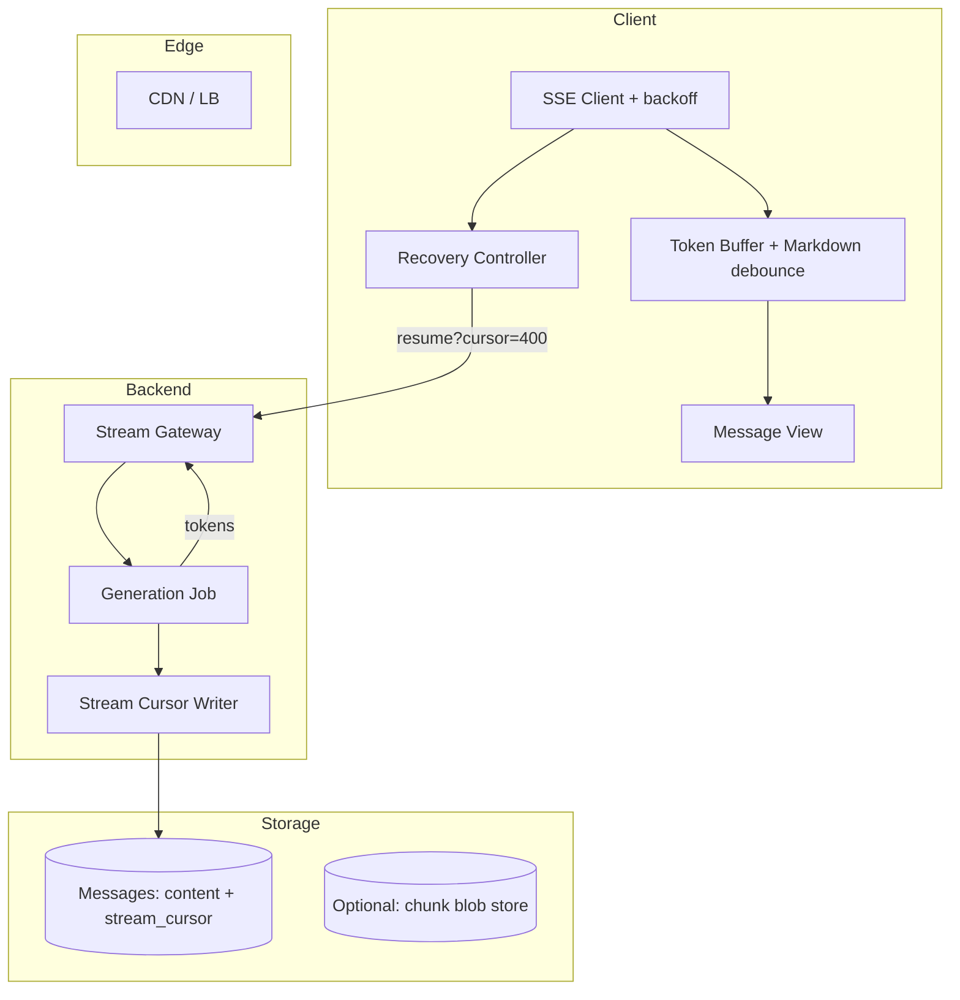

### Component Breakdown

**Streaming protocol.** SSE events: `{ type: delta, index, text }`, `{ type: checkpoint, index }` every N tokens or 500ms, `{ type: done }`, `{ type: error, code }`. `index` is monotonic token or byte offset for resume dedup.

**Partial persistence.** Flush to DB on checkpoint (async, non-blocking): `content = accumulated`, `stream_cursor = 400`, `status = streaming`. On disconnect, job marks `interrupted` or leaves worker running — **sticky generation**: if server still generating, client reconnects to same stream.

**Client recovery controller.** On `error` / `onclose`: (1) show banner “Connection lost — Reconnecting…”, (2) exponential backoff SSE reconnect with `Last-Event-ID` or `?cursor=400`, (3) if server supports resume, append only tokens > 400; else offer “Continue generation” (new request with prefix completion) or “Retry” (delete partial, restart).

**User-visible state.** At drop: freeze UI with partial Markdown rendered (debounced parse last safe block). Badge: “Incomplete response”. Actions: Resume | Retry | Edit prompt. Do not leave cursor blinking forever.

**DB truth.** Row exists for assistant message with 400 tokens — not empty, not full. `generation_id` links stream attempts. Unique constraint prevents two final rows for same parent.

**Resume vs retry policy.** **Resume** if same `generation_id` alive < TTL (e.g. 60s) and provider sends remaining stream. **Retry** if job dead or context invalid. Anthropic may not offer true mid-stream resume — adapter implements **completion continuation**: send assistant prefix + `continue` stop reason in a new API call (document as approximation).

### Sequence of Operations

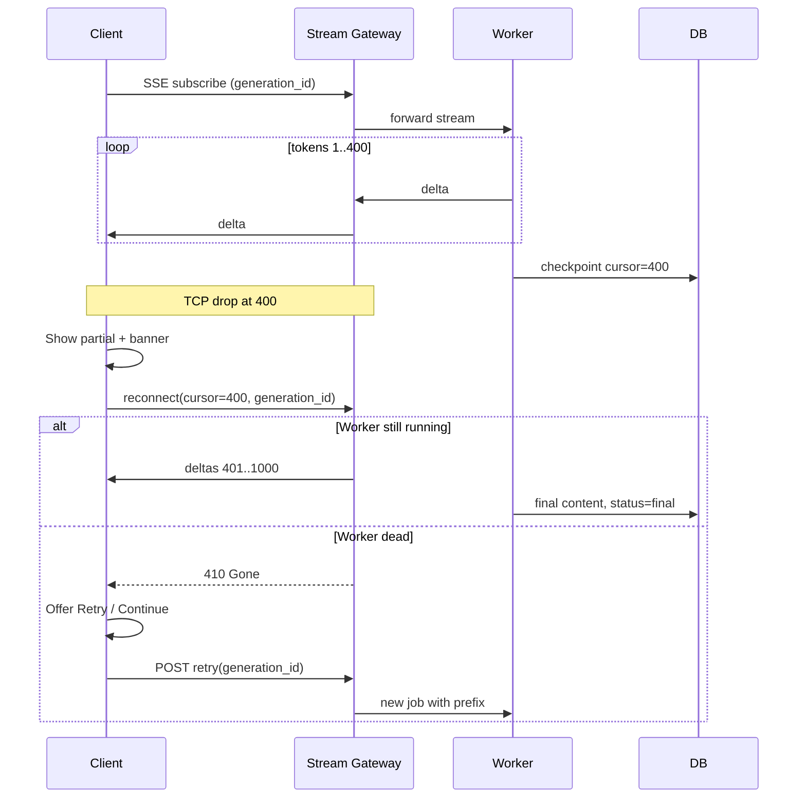

### Edge Cases

- **Drop after `done` sent but before client processes.** Client reconciles with `GET message`; idempotent final content.
- **Duplicate deltas on resume.** Server sends `index > last_client_index` only; client ignores `index <= 400`.
- **User hits Stop during reconnect.** Cancel server job; persist partial with `status=cancelled`.
- **Mid-Unicode or mid-code fence at 400.** Markdown renderer uses “incomplete block” styling until close fence arrives.
- **Mobile backgrounding.** OS kills SSE; on foreground, same recovery flow with cursor from localStorage.

### Failure Modes

| Failure | User sees | DB state | Recovery |
|---------|-----------|----------|----------|
| Network only | Partial + reconnect | streaming @ 400 | Auto resume |
| Worker crash | Partial + retry button | interrupted @ 400 | Retry job |
| Provider 429 | Rate limit message | partial or none | Backoff + retry |
| DB write lag | Partial in UI only | behind | Reconcile on GET |
| Resume not supported | Partial + “Continue” | partial | New completion request with prefix |

### Tradeoffs

| Choice | Pros | Cons |
|--------|------|------|
| Frequent DB checkpoints | Durable partial | Write load |
| Client-only buffer until done | Simple DB | Lose everything on crash |
| True resume vs prefix continue | Bandwidth savings | Provider-dependent |
| Show partial as final | Honest | Confusing if user thinks it’s complete |

**Interview sound bite:** **Cursor-indexed SSE + checkpointed partial rows + reconnect with generation_id**; if the provider cannot resume, **continue-from-prefix** is the production fallback.

---

## 4. Conversation Sidebar for 10,000 Conversations

### Requirements

| Category | Requirement |
|----------|-------------|
| Functional | List, search, pin, rename, delete, archive; open any conversation without loading all 10k rows. |
| Performance | Initial sidebar paint < 200ms; scroll at 60fps; search results < 300ms p95. |
| UX | Optimistic rename/delete with rollback; active conversation highlighted. |
| Scale | 10k metadata rows (~few MB); full message bodies not loaded in sidebar. |
| Offline-ish | Stale list OK briefly; reconcile on focus. |

### Architecture

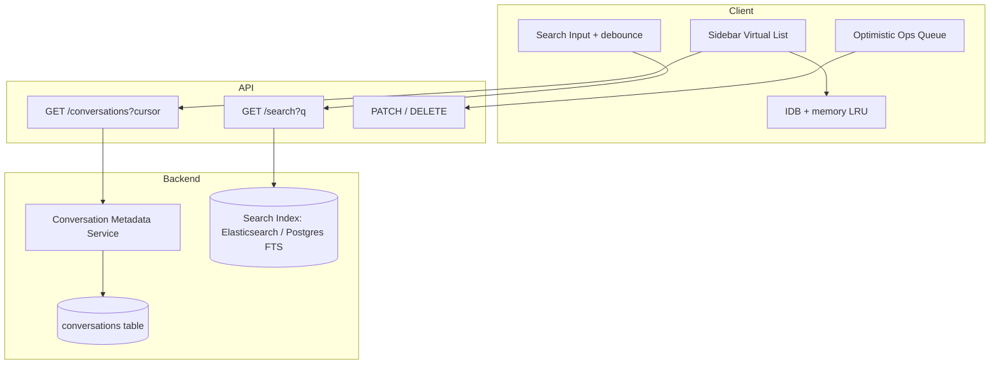

### Component Breakdown

**Virtualized list.** `react-window` / `@tanstack/react-virtual`: fixed or measured row height (~56px). Only ~20 DOM nodes for 10k items. `itemKey={id}` for stable focus on reorder.

**Pagination / infinite scroll.** Cursor-based: `GET /conversations?limit=50&cursor=updated_at,id`. Sort by `pinned DESC, updated_at DESC`. Prefetch next page at 80% scroll. **Do not** fetch 10k in one JSON array.

**Search indexing.** Metadata fields: `title`, `snippet` (first user message or auto-title), `updated_at`, `tags`. FTS or Elasticsearch for fuzzy match; sidebar debounces 200ms. Results view replaces virtual list temporarily (may be non-virtual if < 100 hits).

**Client cache tier.** Memory: last 200 sidebar rows + active conversation. IndexedDB: last 1000 metadata for instant cold start. TTL + `ETag` on list API.

**Optimistic rename/delete.** Rename: PATCH local cache immediately, queue mutation; on 409/5xx revert title + toast. Delete: remove from list with undo snackbar (5s); hard delete on timer or immediate server DELETE based on policy.

**Title generation.** Background job sets `title` from first message summary; sidebar shows skeleton until ready.

**Pin / archive.** Filter tabs reduce effective list size; archived excluded from default virtual list but searchable.

### Sequence of Operations

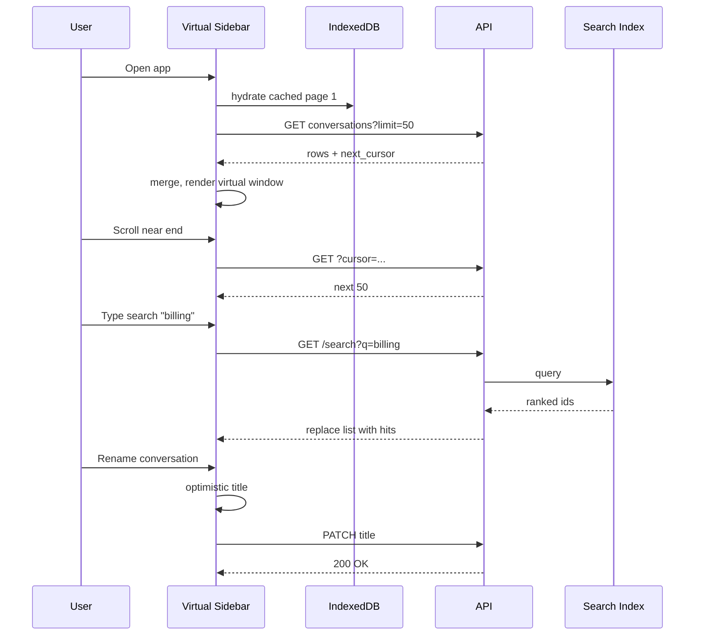

### Edge Cases

- **Rename while deleted in another tab.** 404 on PATCH → remove row + toast.
- **Search during infinite scroll.** Cancel in-flight page fetches; reset scroll top.
- **10k items all pinned.** Rare; still virtualize; pin sort stable by `pin_order`.
- **Empty search.** Restore paginated list from cache.
- **Very long titles.** CSS truncate; full title on hover tooltip.

### Failure Modes

| Failure | Mitigation |
|---------|------------|
| Search index lag | Show DB FTS fallback or “still indexing” |
| Virtual list height wrong | Measure dynamic rows with cache |
| Optimistic delete, server fail | Restore row on error |
| Stale IDB | Background refresh on app focus |
| API returns duplicate cursor | Dedupe by `id` in merge |

### Tradeoffs

| Choice | Pros | Cons |
|--------|------|------|
| Virtual scroll vs pagination only | Smooth scroll 10k | Complexity |
| Elasticsearch vs Postgres FTS | Better relevance | Ops cost |
| Client IDB cache | Instant boot | Stale data risk |
| Soft delete + undo | Safer UX | Storage until purge job |

**Interview sound bite:** **Metadata-only sidebar + cursor pagination + virtualization**; search is a **separate indexed path**, not `filter()` on 10k client rows.

---

## 5. Claude-Generated React Component Has an Infinite Loop

### Requirements

| Category | Requirement |
|----------|-------------|
| Safety | Runaway JS cannot freeze parent app, steal cookies, or access parent DOM. |
| Detection | Infinite render loop or `while(true)` detected within bounded time. |
| UX | User sees artifact preview fail gracefully with explanation, not blank iframe. |
| Functional | Other artifacts and chat remain usable. |
| Ops | Telemetry: loop type, time to detect, artifact id. |

### Architecture

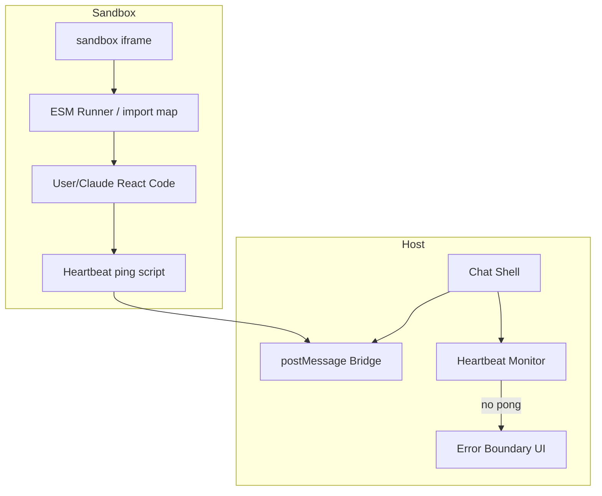

### Component Breakdown

**Iframe sandbox.** `sandbox="allow-scripts"` **without** `allow-same-origin` (isolates origin) or use `srcdoc` + blob URL. CSP inside iframe: `default-src 'none'; script-src 'unsafe-inline' 'unsafe-eval' blob:; style-src 'unsafe-inline'; connect-src 'none'` (tighten per product). No top navigation.

**Bundled runtime.** Host injects React/ReactDOM via import map; Claude code only supplies component module. Prevents arbitrary CDN supply-chain in enterprise mode.

**Heartbeat.** Parent `setInterval` 500ms sends `{ type: 'ping' }`. Child script at bootstrap responds `{ type: 'pong', renderCount }`. Child increments render count in `useEffect` guard: if renders > 50 in 1s, post `{ type: 'error', code: 'RENDER_LOOP' }` and throw to stop React.

**Wall-clock timeout.** If no pong for 3s (CPU spin in sync loop without yielding), parent kills iframe: `iframe.contentWindow` → replace iframe node, show error panel.

**Graceful error rendering.** Host `ArtifactError` component: icon, “Preview stopped — possible infinite loop”, actions: Reset preview | View code | Report. Chat message unchanged.

**Optional Worker offload.** For heavier isolation, compile JSX in worker; still use iframe for DOM — interview mention as v2.

**Versioning.** Loop in artifact v3 does not block v2 preview in history panel.

### Sequence of Operations

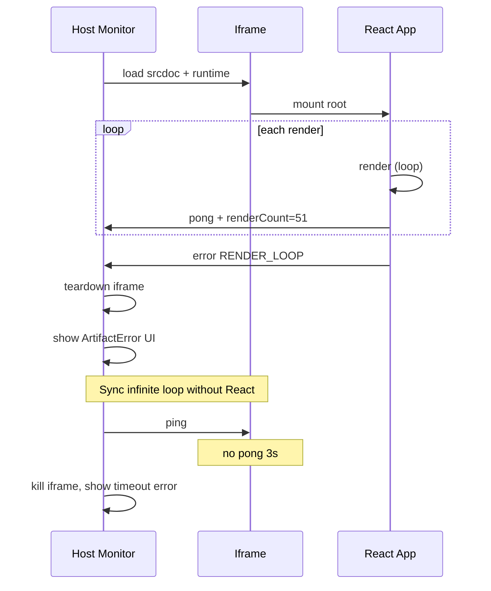

### Edge Cases

- **Legitimate long computation.** Distinguish via heartbeat during `await` — async work should still pong from event loop turns; use Worker for heavy compute.
- **Memory bomb vs loop.** Separate limit: `performance.memory` not reliable cross-browser — cap iframe reload count.
- **postMessage origin check.** Validate `event.origin` matches sandbox blob origin.
- **Error boundary inside iframe catches render loop.** Still need host-level watchdog — child may never mount boundary.
- **Streaming code into iframe.** Don’t execute until parse complete or use incremental compile with same guards.

### Failure Modes

| Failure | Mitigation |
|---------|------------|
| Heartbeat false positive on slow device | Adaptive timeout, 3s → 8s on mobile |
| Child bypasses heartbeat | Mandatory injected prelude script in srcdoc |
| `allow-same-origin` misconfig | Security review; CSP + sandbox audit |
| User code imports external script | Block via CSP connect-src/script-src |
| Iframe crash without message | Parent timeout kills and shows generic error |

### Tradeoffs

| Choice | Pros | Cons |
|--------|------|------|
| iframe vs full Worker DOM | Real React DOM | Heavier |
| Kill iframe vs pause | Clean recovery | Re-mount cost |
| Render count vs stack trace | Cheap | Less debug info |
| `unsafe-eval` for Babel | Flexible | Wider attack surface — precompile server-side |

**Interview sound bite:** **Defense in depth: sandbox iframe + CSP + child render budget + parent heartbeat timeout**, with **replace iframe** as recovery unit.

---

## 6. MCP OAuth Token Expires Mid-Conversation (Multi-Step Agentic Task)

### Requirements

| Category | Requirement |
|----------|-------------|
| Functional | Long agentic flows (search → book → confirm) survive token expiry between steps. |
| Security | Refresh tokens stored server-side; never expose refresh token to browser LLM context. |
| UX | User prompted only when refresh fails; in-progress work pauses clearly, not silent failure. |
| Resumption | After re-auth, task continues from last completed tool step, not from scratch. |
| Compliance | Audit: which MCP server, which scopes, re-auth events. |

### Architecture

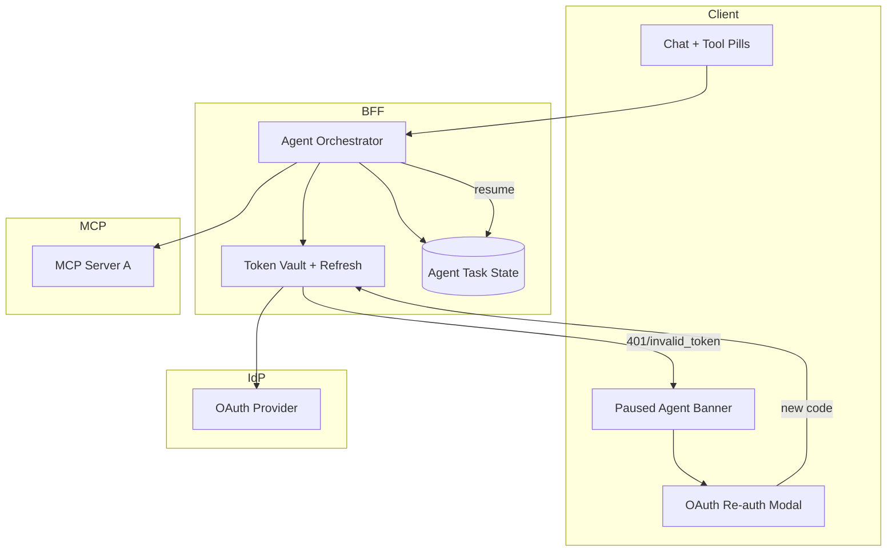

### Component Breakdown

**Token vault (server).** Per `(user_id, mcp_server_id)`: `access_token`, `refresh_token`, `expires_at`, `scopes`. Encrypted at rest. Client holds only `connection_id` or “connected” badge — not tokens.

**Proactive refresh.** Before each MCP call: if `expires_at < now + 120s`, refresh. Single-flight lock per connection to avoid refresh stampede.

**Mid-stream pause.** Orchestrator state machine: `running` → `paused_auth` on 401 from MCP or prophylactic expiry mid-SSE. Persist `task_id`, `completed_steps[]`, `pending_tool_call`, `partial_assistant_message_id`. SSE to client: `{ type: 'auth_required', mcp_server, scopes, task_id }` — not a generic error.

**User re-auth UX.** Modal: which service, why (“Session expired for Calendar”), scopes list, **Connect again** opens OAuth popup or system browser. PKCE flow; callback to BFF; update vault; postMessage to app `auth_complete`.

**Task resumption.** `POST /agent/tasks/:task_id/resume` after refresh. Orchestrator replays from `pending_tool_call` with fresh token. LLM context includes prior `tool_result`s on the active branch — do not re-send secrets. If user declines auth: mark task `cancelled`, assistant message explains blocked step.

**Multi-step agentic task record.** `agent_tasks`: `id`, `conversation_id`, `steps JSON`, `status`. Each step: `tool_use_id`, `status`, `result_ref`. Idempotent resume prevents duplicate bookings (link to Q2).

**Stream handling during pause.** Client stops appending tokens; shows paused banner; keeps partial assistant text. On resume, same `generation_id` or new stream segment `{ type: 'resume', task_id }`.

### Sequence of Operations

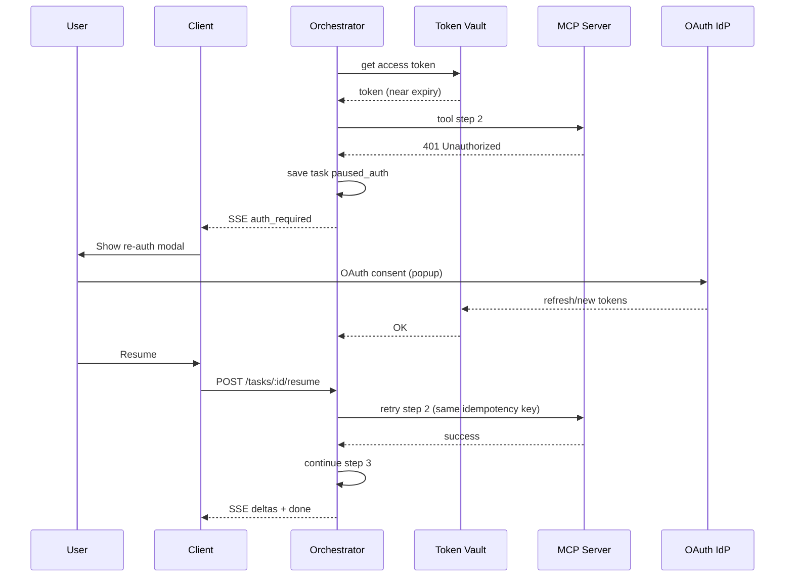

### Edge Cases

- **Refresh token revoked.** Proactive refresh fails → full re-auth required; clear vault row.
- **Multiple MCP servers; only B expired.** Pause only B’s tools; others continue if orchestrator supports per-connection pause.
- **Expiry during user confirmation wait.** Confirm button disabled until auth refreshed or show auth on confirm click.
- **Parallel tool calls, one 401.** Partial results: complete non-expired; pause expired arm; resume individually.
- **SSE disconnect during auth.** Client reconnects; task still `paused_auth`; modal on hydrate.

### Failure Modes

| Failure | UX | Recovery |
|---------|-----|----------|
| Refresh fails | Re-auth modal | OAuth again |
| User ignores modal | Paused banner persists | Stale task TTL 24h |
| Resume without vault update | 401 again | Block resume until token OK |
| OAuth popup blocked | Inline instructions | Same-tab redirect fallback |
| Task TTL expired | “Session expired, start over” | New user message |

### Tradeoffs

| Choice | Pros | Cons |
|--------|------|------|
| Proactive vs reactive refresh | Fewer mid-task failures | Extra refresh calls |
| Server-only tokens | Secure | More BFF complexity |
| Pause vs fail task | Better UX | State machine complexity |
| Full replay vs pending step only | Less LLM cost | Harder to implement correctly |

**Interview sound bite:** **Tokens live in a server vault with proactive refresh; orchestrator persists agent task checkpoints; 401 becomes `auth_required` pause + OAuth + idempotent resume**, not a broken stream.

---

## Cross-Question Synthesis (Interview Closing)

These six questions share three patterns worth stating explicitly:

1. **Source of truth is server-side graph/state** — client optimism always reconciles (Q1, Q2, Q4).
2. **Idempotency keys and cursors** — duplicate user actions and duplicate network bytes are the same class of problem (Q2, Q3, Q6).
3. **Bounded failure domains** — iframe kill, stream checkpoint, auth pause — never let one subsystem freeze the whole app (Q3, Q5, Q6).

*Prep alignment: questions sourced from `prep/system-design/Claude-design-doc.md` §10.*
