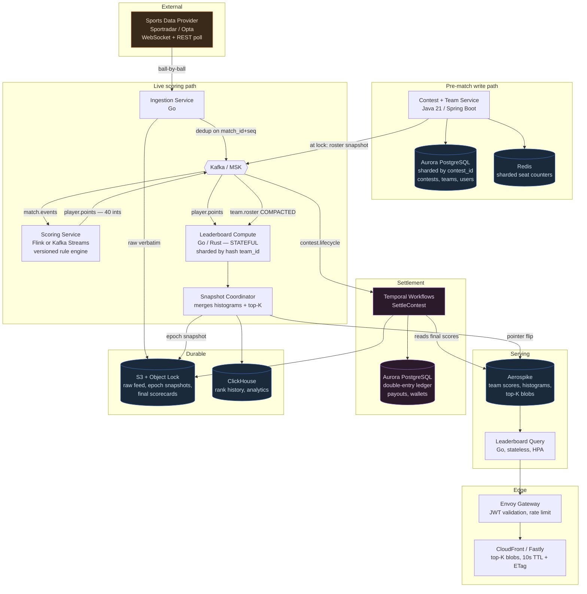
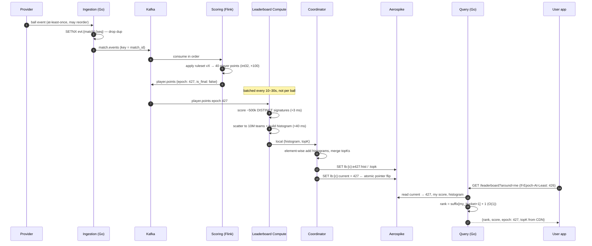
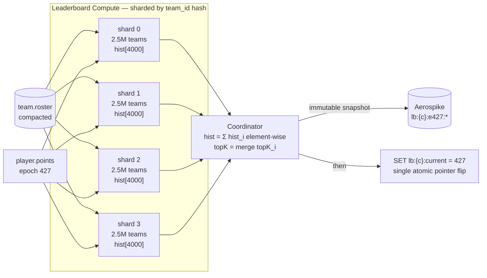
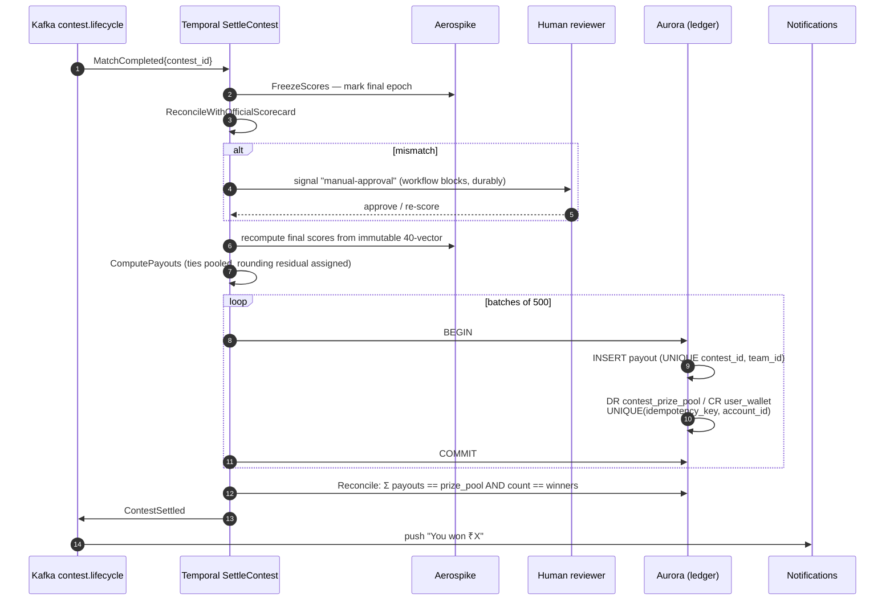

# Dream11 — Live Leaderboard, Match Completion & Winner Declaration

**Backend system design.** How a fantasy sports platform keeps 10M+ ranks fresh during a live
match, and how it flips from an eventually-consistent leaderboard to an exactly-once,
auditable payout at match end.

> Interactive version: [`dream11-backend-architecture.html`](./dream11-backend-architecture.html)

---

## 0. TL;DR

Compress the problem to **22 numbers** (player points), fan out via **de-duplicated
bit-packed team signatures**, rank with **mergeable histograms** instead of sorted lists,
serve **immutable versioned snapshots** through a CDN with monotonic epochs — then draw a
hard line at match end where the system switches from *eventually consistent and disposable*
to *transactional, idempotent and auditable*, with a provisional→final window because
upstream scorecard data gets revised.

Two failure modes that actually bite in production:

| Failure | Root cause | Fix |
|---|---|---|
| Rank goes **backwards** on refresh | client hit a stale replica / older snapshot | monotonic `epoch` in every response |
| **Double payout** on retry | trusting "the consumer processed it once" | `UNIQUE(idempotency_key, account_id)` in the ledger |

---

## 1. Requirements & numbers

### Functional

- Users build teams (11 players + captain 2×, vice-captain 1.5×) before a deadline.
- Teams join contests: free/cash, sizes from 2 to 10,000,000 entries.
- During the match, ranks update in near-real-time and survive a pull-to-refresh.
- At match end, ranks are frozen, winners declared, prize money credited.
- Abandoned / cancelled matches are fully refunded.

### Non-functional

| Metric | Target |
|---|---|
| Leaderboard staleness | ≤ 30 s (bounded, **monotonic**) |
| Rank read p99 | < 100 ms |
| Peak read QPS | 1–2 M req/s at match end |
| Contest recompute (10M teams) | < 100 ms |
| Payout correctness | **exactly once**, ₹0.00 reconciliation drift |
| Settlement latency | minutes after official scorecard |

### Constraints that shape the design

1. **Matches are scheduled.** You know the exact minute traffic goes 30×. Capacity planning
   is a calendar problem, not an autoscaling problem.
2. **Provider data is revised.** Scorecard corrections, DLS, super overs, disputed catches.
   You cannot pay out on the `MATCH_COMPLETE` event.
3. **Rosters freeze at lock.** After the deadline, team composition is immutable — which is
   what makes an in-memory compute engine viable.

---

## 2. Architecture



### Service inventory

| # | Service | Language | Store | Why this choice |
|---|---|---|---|---|
| 1 | Contest & Team | Java 21 / Spring Boot | Aurora PG (sharded) | rich domain logic, transactions, team library |
| 2 | Ingestion | Go | Redis (dedup TTL) | tiny, I/O bound, must never GC-pause on a WS frame |
| 3 | Scoring | Flink / Kafka Streams | RocksDB state | exactly-once via checkpoints + transactional sink |
| 4 | **Leaderboard Compute** | **Go or Rust** | in-memory + S3 | the one bespoke service; needs memory layout control, no GC pauses |
| 5 | Leaderboard Query | Go | Aerospike | stateless, scale to 500 pods in seconds |
| 6 | Settlement | Go/Java + **Temporal** | Aurora PG | durable execution, human-in-the-loop, queryable state |
| 7 | Wallet / Ledger | Java | Aurora PG | integer money, strict constraints, no float anywhere |

---

## 3. Data model

```sql
-- source of truth (Aurora, sharded by contest_id)
CREATE TABLE contest (
  contest_id     BIGINT PRIMARY KEY,
  match_id       BIGINT NOT NULL,
  capacity       INT NOT NULL,
  entry_fee_paise BIGINT NOT NULL,
  prize_pool_paise BIGINT NOT NULL,
  prize_slabs    JSONB NOT NULL,        -- [{from:1,to:1,amt:...},{from:2,to:10,amt:...}]
  state          TEXT NOT NULL,          -- see lifecycle state machine
  ruleset_version TEXT NOT NULL,
  version        INT NOT NULL            -- optimistic locking
);

CREATE TABLE team (
  team_id     BIGINT PRIMARY KEY,
  contest_id  BIGINT NOT NULL,
  user_id     BIGINT NOT NULL,
  signature   BIGINT NOT NULL,           -- bit-packed, see §5.2
  joined_at   TIMESTAMPTZ NOT NULL,      -- deterministic tiebreak
  locked_at   TIMESTAMPTZ                -- immutable after this
);
CREATE INDEX ON team (contest_id, signature);   -- powers de-dup

-- money (never sharded, never eventually consistent)
CREATE TABLE ledger_entry (
  id              BIGSERIAL PRIMARY KEY,
  account_id      BIGINT NOT NULL,
  amount_paise    BIGINT NOT NULL,       -- integers only. never NUMERIC, never float
  direction       CHAR(2) NOT NULL CHECK (direction IN ('DR','CR')),
  contest_id      BIGINT,
  idempotency_key TEXT NOT NULL,
  created_at      TIMESTAMPTZ NOT NULL DEFAULT now(),
  UNIQUE (idempotency_key, account_id)   -- <<< exactly-once lives HERE
);
```

### Kafka topic design

| Topic | Partitions | Key | Retention | Notes |
|---|---|---|---|---|
| `match.events` | 64 | `match_id` | 7 d | ordering per match; never > 50 live matches |
| `player.points` | 64 | `match_id` | 7 d | ~40 int32s per message. Tiny. |
| `team.roster` | 256 | `contest_id` | **compacted** | rebuilds Leaderboard Compute state on restart |
| `contest.lifecycle` | 32 | `contest_id` | 30 d | drives Temporal workflows |
| `settlement.cmd` | 32 | `contest_id` | 90 d | audit trail |

---

## 4. Live scoring path



**Why batch instead of stream per ball?** Users cannot perceive faster than ~10 s, and
batching collapses write amplification by ~100×. Trigger an epoch on a timer *or* on a
material event (wicket, boundary, over end) — whichever comes first.

---

## 5. The three core tricks

### 5.1 Don't score users — score players

The naive framing is "10M teams × recompute on every ball = disaster." The actual state is tiny:

- A match has **≤ 40 players** in the squad universe. That is the entire scoring state.
- A team is `11 player_ids + captain + vice-captain`.
- Team score = **dot product** of a 40-slot points vector with a sparse multiplier vector.

So the pipeline output at the expensive stage is **40 integers**, not 10 million rows.

### 5.2 Bit-pack the team → dedup becomes free

```
┌──────────────── 40 bits ────────────────┬── 6 ──┬── 6 ──┬─ 12 ─┐
│  selection bitmask (exactly 11 bits set) │  cap  │  vc   │ pad  │  = uint64
└──────────────────────────────────────────┴───────┴───────┴──────┘
```

**A fantasy team is 8 bytes.** Two users who picked identically produce the *same* uint64 —
de-duplication is just a hash-map key. Millions of users pick the same popular XI, so
distinct signatures are typically 1–2 orders of magnitude fewer than teams:
**10M teams → ~500k distinct signatures.**

### 5.3 Rank with a histogram, not a sorted list

You do **not** need a sorted array of 10M entries to answer "what is my rank?" Fantasy points
are discrete (0.5 increments, bounded range), so bucket them:

```
bucket   = points_x100 / 50                 // ~4000 buckets covers 0–2000 points
count[b] += 1                                // O(n) build
suffix[b] = Σ count[b..MAX]                  // O(buckets) scan

my_rank  = suffix[my_bucket + 1] + 1         // O(1), standard competition ranking
```

**Histograms are mergeable.** Shard teams across N nodes, build a local histogram on each,
and the coordinator just adds the arrays element-wise. Same for top-K. Both operations are
associative, so the distributed merge is trivially correct.



### The epoch loop

```go
func (s *Shard) RecomputeEpoch(pp *PlayerPoints) *Snapshot {
    // 1. dense 40-slot points vector, fixed point (×100)
    var pts [40]int32
    for _, p := range pp.Points { pts[s.slot[p.PlayerID]] = p.PointsX100 }

    // 2. score each DISTINCT signature: ~500k × 11 mul-adds ≈ 5.5M ops ≈ 3 ms
    for sig := range s.sigTable {
        mask, capIdx, vcIdx := decode(sig)
        var total int32
        for slot := range bits(mask) {
            m := int32(100)                          // 1.00×
            if slot == capIdx { m = 200 } else if slot == vcIdx { m = 150 }
            total += pts[slot] * m / 100
        }
        s.sigScore[sig] = total
    }

    // 3. scatter to teams + build histogram in ONE pass: 10M gathers ≈ 40 ms
    var hist [4000]int32
    for i, sig := range s.teamSig {
        sc := s.sigScore[sig]
        s.teamScore[i] = sc
        hist[sc/50]++                                // 0.5-point buckets
    }
    return &Snapshot{Epoch: pp.Epoch, Hist: hist, TopK: s.localTopK()}
}
```

### Sizing a 10M-team mega contest

| Structure | Size |
|---|---|
| `team_id[] → signature (uint64)` | 10M × 8 B = **80 MB** |
| `team_id[] → score (int32)` | 10M × 4 B = **40 MB** |
| ~500k distinct signatures → score | **6 MB** |
| histogram (4000 × int32) | **16 KB** |
| **Total** | **≈ 130 MB, < 100 ms per epoch, single core** |

> **Compute is not the bottleneck.** This is the thing most candidates get wrong. You shard
> for memory headroom, HA and many concurrent contests — not because the math is hard.

### Recovering in-memory state (the part people forget)

A pod holding 10M teams *will* get evicted mid-match.

1. Load last epoch snapshot from **S3** (serialised signature array).
2. Replay `team.roster` compacted topic from the snapshot's offset.
3. Replay `player.points` from the snapshot's epoch.

Cold start **< 30 s**. Rosters are frozen at match start, so the compacted topic is static
during the match — replay is fast and deterministic. Run shards as a `StatefulSet` with a
warm standby consuming the same partitions.

---

## 6. Serving & the refresh problem

```
GET /contests/{id}/leaderboard?around=me
  ├─ top 100     → identical bytes for every user → CDN, 10s TTL + ETag  (>95% hit)
  └─ my rank     → 2 lookups: score (hash) + suffix[bucket] (16 KB array)
```

```go
epoch := as.Get("lb:" + c + ":current")
score := as.Get("score:" + c + ":" + teamID)
hist  := localLRU.GetOrLoad(c, epoch)          // 16 KB, cached in-process
rank  := hist.SuffixCount(score/50+1) + 1
```

Cache the histogram in each query pod's process memory keyed by epoch — 16 KB × a few
thousand contests is nothing, and it removes the network hop from the hot path entirely.

### Monotonicity matters more than freshness

A rank that reads 4000 → 3800 → 4000 across consecutive refreshes looks like a bug and
generates support tickets.

- Every response carries `epoch`.
- Client echoes the highest epoch seen as `If-Epoch-At-Least`.
- Server serves only `epoch ≥ N` (sticky routing, or short wait).

**Bounded staleness is fine. Going backwards is not.**

### Push vs poll

SSE/WebSocket carrying only `{"epoch": 427}` — "something changed, refetch from cache" — is
cheap and lets clients pull CDN-cached bytes. Pure delta-push to 10M connections during a
final over is where things break. If you poll, **add jitter**: synchronised 30 s refresh
across millions of clients is a self-inflicted DDoS every 30 seconds.

---

## 7. Contest lifecycle — the state machine

This is where the design changes character. Everything above is eventually consistent and
disposable. Everything below is money.

```mermaid
stateDiagram-v2
  direction LR
  [*] --> PRE_MATCH

  PRE_MATCH: PRE_MATCH<br/>teams editable, contests filling
  LOCKED: LOCKED<br/>rosters immutable, published to compacted topic
  LIVE: LIVE<br/>epochs every 10-30s, eventually consistent
  SCORING_FROZEN: SCORING_FROZEN<br/>final=true epoch, PROVISIONAL ranks shown
  UNDER_REVIEW: UNDER_REVIEW<br/>reconcile vs official scorecard
  MANUAL_REVIEW: MANUAL_REVIEW<br/>human maker-checker
  FINALIZED: FINALIZED<br/>recomputed from scratch, ranks immutable
  SETTLING: SETTLING<br/>Temporal credits wallets, idempotent
  SETTLED: SETTLED<br/>reconciled, sum(payouts) == prize pool
  ABANDONED: ABANDONED<br/>no result / DLS washout
  REFUNDING: REFUNDING<br/>reverse the entry-fee ledger
  REFUNDED: REFUNDED

  PRE_MATCH --> LOCKED: deadline
  LOCKED --> LIVE: first ball
  LIVE --> SCORING_FROZEN: provider MATCH_COMPLETE
  SCORING_FROZEN --> UNDER_REVIEW: auto
  UNDER_REVIEW --> FINALIZED: scorecard matches
  UNDER_REVIEW --> MANUAL_REVIEW: mismatch / dispute
  MANUAL_REVIEW --> UNDER_REVIEW: corrected + re-scored
  FINALIZED --> SETTLING: workflow start
  SETTLING --> SETTLED: reconciliation passes
  LOCKED --> ABANDONED: match called off
  LIVE --> ABANDONED: no result
  ABANDONED --> REFUNDING
  REFUNDING --> REFUNDED
  SETTLED --> [*]
  REFUNDED --> [*]
```



### Why the provisional window exists

Provider data gets **revised** — scorecard corrections, DLS adjustments, super overs,
retroactive stat fixes, disputed catches. If you pay out the instant the feed says
`MATCH_COMPLETE`, you will eventually pay the wrong person and be unable to claw it back.

That "winnings will be credited after review" banner is a **deliberate architectural
decision**, not a UX afterthought.

At `FINALIZED`, recompute all team scores **from scratch** off the immutable final 40-vector.
Never settle from incrementally accumulated in-memory state — you want a computation you can
reproduce and defend in an audit six months later.

---

## 8. Winner declaration & settlement

### Tie handling — pool and split the occupied ranks

Prizes are rank-range based. Ties must pool:

> 3 teams tie for rank 2 → they occupy ranks 2, 3, 4 →
> `(₹50L + ₹25L + ₹10L) / 3 = ₹28.33L` each.

Then handle rounding **deterministically**: after rounding to paise, the residual is assigned
by a fixed rule (lowest `team_id`, or a house rounding account) so that
`Σ payouts == prize pool` **exactly**. A leaderboard that is off by ₹0.03 fails reconciliation
and blocks the whole settlement run.

### The workflow



```go
func SettleContest(ctx workflow.Context, contestID string) error {
    workflow.ExecuteActivity(ctx, FreezeScores, contestID).Get(ctx, nil)

    var ok bool
    workflow.ExecuteActivity(ctx, ReconcileWithOfficialScorecard, contestID).Get(ctx, &ok)
    if !ok {
        // durable block — survives worker restarts, deploys, a weekend
        workflow.GetSignalChannel(ctx, "manual-approval").Receive(ctx, nil)
    }

    var payouts []Payout
    workflow.ExecuteActivity(ctx, ComputePayouts, contestID).Get(ctx, &payouts)

    for _, batch := range chunk(payouts, 500) {
        workflow.ExecuteActivity(ctx, CreditWallets, batch).Get(ctx, nil)
    }
    return workflow.ExecuteActivity(ctx, Reconcile, contestID).Get(ctx, nil)
}
```

### Exactly-once is a database constraint, not a messaging guarantee

`idempotency_key = sha256(contest_id | team_id | settlement_run_id)`

Temporal retries. Workers crash. Kafka redelivers. The unique index makes every one of those
a **no-op**. Say this explicitly in an interview — it is the line that separates a real answer
from a hand-wave.

**Reconciliation job** after every settlement: `Σ payouts == prize pool`,
`count(payouts) == count(winning teams)`, wallet deltas match ledger deltas. Alert and freeze
on mismatch. Corrections go through maker-checker with a **reversing ledger entry** — never an
`UPDATE` on a settled row.

**Abandoned matches** reuse the identical machinery in reverse: refund each entry fee, same
idempotency keys, same reconciliation.

---

## 9. Full tech stack

| Concern | Technology | Rationale |
|---|---|---|
| Event backbone | **Kafka (MSK)** | ordered per-partition, compaction for roster rebuild |
| Stream processing | **Flink** (or Kafka Streams) | exactly-once checkpoints; KStreams if you don't already run Flink |
| Hot store | **Aerospike** (or Redis Cluster) | hybrid memory: index in RAM, data on NVMe → sub-ms at TB scale |
| Source of truth | **Aurora PostgreSQL** | real transactions, constraints, integer money |
| Workflow | **Temporal** | durable execution, human-in-the-loop, queryable, retry semantics |
| Compute engine | **Go / Rust** | memory layout control, no GC pause during the final over |
| CRUD services | **Java 21 / Spring Boot** | team velocity; don't rewrite CRUD in Rust |
| Edge | **CloudFront / Fastly** + **Envoy** | top-K is identical bytes for millions of users |
| Analytics | **ClickHouse** (or Druid) | "how did my rank move" time-series over 10M rows |
| Object store | **S3 + Object Lock (WORM)** | raw feed + final scorecards = dispute evidence |
| Metrics | Prometheus + Grafana (VictoriaMetrics if cardinality blows up) | |
| Tracing | OpenTelemetry → Tempo / Jaeger | |
| Flags | LaunchDarkly / Unleash | you *will* need to kill live leaderboards mid-match |
| Orchestration | EKS + Karpenter, **scheduled pre-scaling on the match calendar** | |

### Scale numbers to quote

| Metric | Value |
|---|---|
| Contest recompute (10M teams) | < 100 ms, single core |
| Epoch cadence | 10–30 s, or on material event |
| Peak leaderboard QPS | 1–2 M req/s |
| Served from CDN | > 95 % |
| Origin QPS after caching | 50–100 k/s → ~200 Go pods |
| Memory per 10M-team contest | ≈ 130 MB |
| Settlement | ~10M ledger writes, 500/txn, minutes |

---

## 10. Trade-offs worth defending

**Why not Redis `ZSET` for everything?**
`ZADD` of 10M members every 20 s is ~500k ops/s of write churn per contest, plus ~1 GB of
skiplist overhead. The histogram gives O(1) rank at 16 KB. Use `ZSET` only for contests under
~100k teams where exact "players near me" ordering matters and cost is negligible —
**one interface, two implementations selected by contest size.**

**Why not Spark / batch?** Minutes of latency. Wrong tool.

**Why not compute rank per user on read?** Read amplification is the enemy: 10M users
refreshing vs 10M scores computed once per epoch. Precompute wins by four orders of magnitude.

**Why Go/Rust for one service and Java everywhere else?** Exactly one service is
latency-and-layout critical. Optimise there; keep velocity everywhere else.

**Why Temporal and not a Kafka consumer for settlement?** You need durable blocking on human
approval, queryable workflow state at 2 AM during a dispute, and retry semantics you didn't
write yourself.

---

## 11. Interview cheat sheet

1. **Clarify**: contest sizes (2 → 10M), how fresh must ranks be (10–30 s is fine), is money
   involved (yes → the second half of the design changes).
2. **Reduce the problem**: "a match is 40 numbers."
3. **Bit-pack + dedup**: 8 bytes per team, 10M → 500k distinct.
4. **Histogram ranking**: O(1) rank, mergeable across shards, 16 KB.
5. **Immutable snapshots + atomic pointer flip**: no torn leaderboards.
6. **Monotonic epochs**: ranks never go backwards on refresh.
7. **CDN the top-K**: it's the same bytes for everyone.
8. **State machine at match end**: provisional → review → finalized → settled.
9. **Exactly-once = unique constraint**, not delivery semantics.
10. **Reconcile every settlement**, and never `UPDATE` a settled row.
