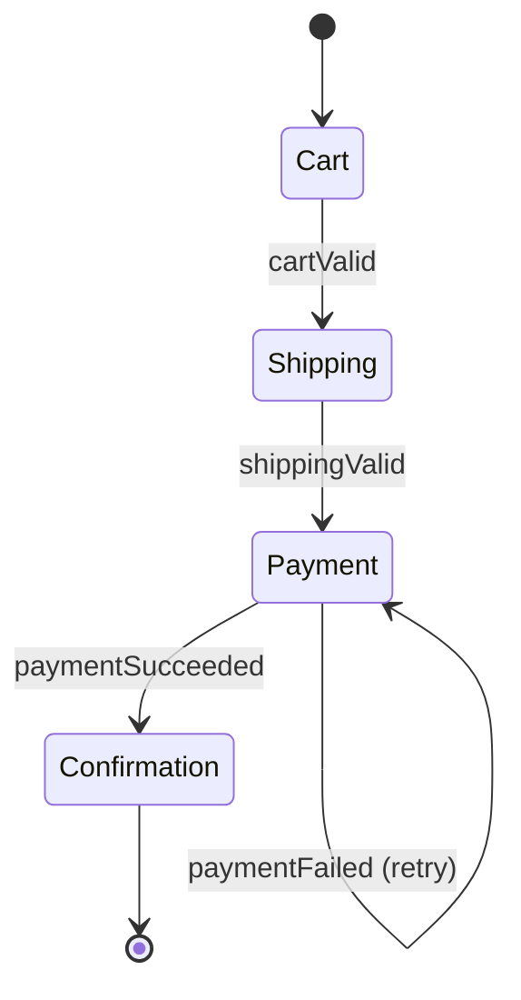
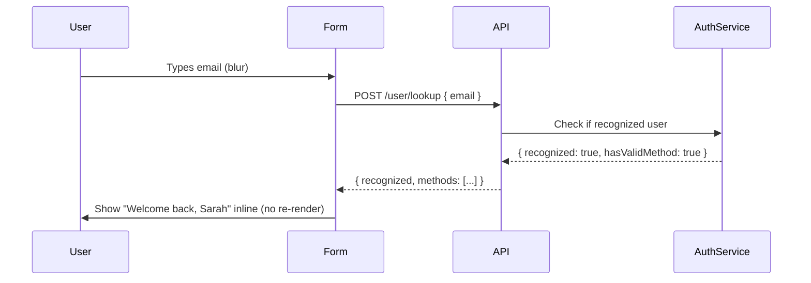
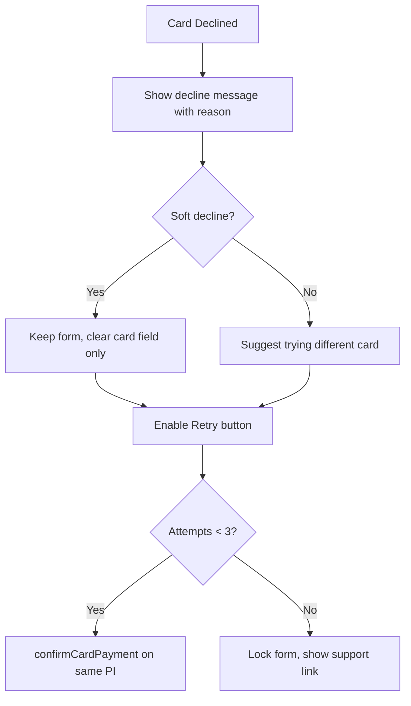

# 1. Checkout Flow & Form UX

Interview-depth answers for payment system frontend design: problem framing, approach, tradeoffs, and concrete implementation details. Section covers multi-step flow architecture, card input UX, validation strategy, autocomplete, loading states, and progressive disclosure.

---

## Core

### Walk me through how you would architect a multi-step checkout flow (cart → shipping → payment → confirmation). Where does state live, how do you handle back-navigation, and how do you prevent users from skipping steps?

**Problem framing:** A multi-step checkout is a linear wizard with real monetary consequences — partial state must survive navigation, back-nav must not lose data, and skipping steps can produce incomplete orders or security holes (e.g. confirming payment before collecting shipping address). Getting this wrong directly costs revenue.

**Approach:**

Model the checkout as a **state machine** with four nodes and explicit transition guards:



**State residence:**

| Layer | What lives there |
|-------|-----------------|
| URL / router param | Current step (`/checkout/shipping`) — makes back-nav free |
| React context / Zustand store | `cartItems`, `shippingAddress`, `selectedMethod` (non-sensitive) |
| Server-side session | `cartId`, `orderId`, `paymentIntentId` — authoritative |
| Never persisted | Raw card numbers, CVV — only ever in Stripe's iframe |

**Step gating:** Each route renders a `StepGuard` higher-order component. Before rendering step N, it checks that all steps 1…N-1 have valid data in the store. If not, it redirects to the earliest incomplete step. This prevents URL manipulation to skip steps.

```
/checkout/payment → StepGuard checks: hasCart && hasValidShipping
  → if false: redirect /checkout/shipping
```

**Back navigation:** Because step state lives in the store (not component state), pressing the browser back button to `/checkout/shipping` restores all previously entered values instantly. The store is seeded from `sessionStorage` on mount so a refresh doesn't lose work:

```ts
// On store init
const persisted = sessionStorage.getItem('checkout_draft')
if (persisted) store.hydrate(JSON.parse(persisted))

// On every store mutation
store.subscribe(state => sessionStorage.setItem('checkout_draft', JSON.stringify(state)))
```

**Confirmation is server-authoritative:** The confirmation page never trusts client state alone. It fetches `GET /orders/:id` on mount and reconciles against what the client believes. This catches redirect failures, query-param stripping, and race conditions.

**Tradeoffs:** Storing step state in the URL (query params per field) is too verbose and leaks data in logs. Storing purely in component state loses data on back-nav. The store + sessionStorage hybrid gives the best UX at the cost of needing a clear/invalidate mechanism when the user abandons (handle via `beforeunload` → `DELETE /carts/:id/draft` and `sessionStorage.clear()`).

---

### How do you design a credit card input form that provides real-time feedback — card type detection, formatted input masking (e.g., `4242 4242 4242 4242`), expiry validation, and CVV length rules — without blocking the user while they type?

**Problem framing:** Card input is the highest-friction moment in checkout. Unformatted numbers are error-prone, wrong CVV length expectations cause failures, and aggressive validation frustrates users. All formatting logic must run synchronously inside the keypress handler or it feels laggy.

**Approach:** In practice, **always use Stripe Elements or a hosted fields solution** — raw card input on your page puts you in PCI SAQ D scope. But the UX logic is worth understanding for non-Stripe contexts or custom implementations on top of a vault tokenization service.

**Card type detection** from the first 1–4 digits (BIN range):

```ts
const CARD_PATTERNS: [RegExp, CardType][] = [
  [/^4/, 'visa'],                    // Visa: starts with 4
  [/^5[1-5]|^2[2-7]/, 'mastercard'],// MC: 51-55 or 2221-2720
  [/^3[47]/, 'amex'],               // Amex: 34 or 37
  [/^6(?:011|5)/, 'discover'],
]

function detectCard(value: string): CardType {
  const digits = value.replace(/\D/g, '')
  return CARD_PATTERNS.find(([re]) => re.test(digits))?.[1] ?? 'unknown'
}
```

Detect on every keystroke but only *display* the card brand icon after 2+ digits to avoid flicker.

**Formatting mask:** On `input` event, strip non-digits, then re-insert spaces at the right positions. Use `selectionStart` to maintain cursor position through the mask:

```ts
function formatCard(raw: string, type: CardType): string {
  const digits = raw.replace(/\D/g, '').slice(0, type === 'amex' ? 15 : 16)
  if (type === 'amex') {
    // 4-6-5 pattern: 3782 822463 10005
    return digits.replace(/^(\d{4})(\d{0,6})(\d{0,5})/, (_, a, b, c) =>
      [a, b, c].filter(Boolean).join(' '))
  }
  // 4-4-4-4 pattern
  return digits.match(/.{1,4}/g)?.join(' ') ?? digits
}
```

**Expiry validation:**
- Accept `MM/YY` or `MMYY` — auto-insert `/` after month digits
- Validate: month 01–12, year >= current year
- If month is current month and year is current year: still valid (expires end of month)

**CVV length:**
- Visa/MC/Discover: 3 digits
- Amex: 4 digits
- Enforce `maxLength` attribute dynamically based on detected card type

**Non-blocking:** All of the above runs synchronously in the event handler — it's pure string manipulation, O(16) worst case. No async operations in the hot path. The card icon swap (image/SVG) is instant since all card brand assets are preloaded.

**Tradeoffs:** Hand-rolling this is ~300 lines of edge cases (paste handling, mobile keyboard quirks, screen reader announcements for format changes). Libraries like `cleave.js` or `card-validator` handle most of this. More importantly, doing any of this on your own page means raw PANs enter your JS environment — default to Stripe Elements instead.

---

### What is the correct strategy for inline vs. summary error display in a payment form? When should you validate on `blur` vs. `change` vs. `submit`, and how do you avoid frustrating users with premature errors on partially-typed card numbers?

**Problem framing:** Validation timing is one of the highest-impact UX details in checkout forms. Too eager (validate on every keypress) → errors appear while the user is mid-typing, feel accusatory. Too late (validate only on submit) → the user fills 4 fields wrong and sees a wall of errors at once.

**Approach — three-phase validation:**

| Phase | Trigger | What runs |
|-------|---------|-----------|
| **Lenient** | `change` (keypress) | Format masking only, no error display |
| **Intermediate** | `blur` (field exit) | Full field validation, show error if invalid |
| **Final** | `submit` | Validate all fields, prevent submit, scroll to first error |

**The key rule:** Never show a validation error on a field the user has not yet interacted with. Track `touched` state per field:

```ts
const [touched, setTouched] = useState<Set<string>>(new Set())

const handleBlur = (field: string) => {
  setTouched(prev => new Set(prev).add(field))
}

// Only show error if field has been touched
const showError = (field: string) => touched.has(field) && !!errors[field]
```

**Card number special case:** A 16-digit Visa number is partially valid at digits 1–15. Don't validate until: (a) the field loses focus (`blur`), OR (b) the user has typed the maximum length for the detected card type. This prevents the "Your card number is invalid" error appearing after the 5th digit.

```ts
const isCardComplete = (value: string, type: CardType) => {
  const digits = value.replace(/\D/g, '')
  return digits.length === (type === 'amex' ? 15 : 16)
}

// Show error only if complete OR blurred
if (isCardComplete(value, cardType) || touched.has('cardNumber')) {
  // run luhn check
}
```

**Inline vs. summary display:**
- **Inline** (below each field): Best for field-level errors — user knows exactly which field to fix
- **Summary** (top of form or near submit): Use for cross-field errors (e.g. "Billing ZIP doesn't match card") or server errors that span multiple fields
- **Never both** for the same error — it feels redundant and confusing

**After submit failure:** Re-validate all fields immediately, mark all as `touched`, focus the first error field, announce the error count to screen readers via `aria-live`.

**Tradeoffs:** The `touched` + `blur` pattern is standard (Formik, React Hook Form both default to this). The main alternative — showing errors only on submit — has higher error density at the worst moment and is favored only when form length is ≤ 2 fields. The eager `onChange` validation pattern is appropriate only for async checks like coupon code validation where the user explicitly wants live feedback.

---

### How do you handle address autocomplete (Google Places API, Smarty Streets) in a checkout form — including debouncing, fallback to manual entry when the API is unavailable, and ensuring the autofilled address is still validated server-side?

**Problem framing:** Address autocomplete reduces typing effort and typo-induced failed deliveries, but introduces risks: API failures silently break the field, autofilled addresses bypass field-level validation, and users in rural areas or new buildings get no suggestions. The integration must degrade gracefully.

**Approach:**

**Debounced input → autocomplete fetch:**

```ts
const debouncedFetch = useMemo(
  () => debounce(async (query: string) => {
    if (query.length < 3) { setSuggestions([]); return }
    try {
      const results = await placesAutocomplete(query, { country: 'US' })
      setSuggestions(results)
    } catch {
      // Fail silently — fallback to manual entry
      setSuggestions([])
    }
  }, 300),
  []
)
```

300ms debounce: aggressive enough to feel fast, conservative enough to avoid per-keystroke API calls (Google Places charges per request).

**Fallback to manual entry:**
- If the autocomplete API returns an error or times out (use a 2s timeout), show a non-blocking inline notice: *"Address suggestions unavailable — please type your address manually."*
- All address fields remain fully editable regardless — autocomplete is an enhancement, not a gate
- Use `navigator.onLine` and a preflight `HEAD` request to detect offline state proactively

**Autofill → field decomposition:**
When the user selects a suggestion, the Places API returns a structured object. Decompose it into individual form fields:

```ts
const handleSelect = async (placeId: string) => {
  const details = await getPlaceDetails(placeId) // street, city, state, zip, country
  form.setValue('address1', details.streetNumber + ' ' + details.route)
  form.setValue('city', details.locality)
  form.setValue('state', details.administrativeAreaLevel1)
  form.setValue('zip', details.postalCode)
  // Trigger validation on all filled fields
  form.trigger(['address1', 'city', 'state', 'zip'])
}
```

**Server-side validation is mandatory:** Autofilled addresses must still go through USPS/SmartyStreets address verification on the server before order creation. The frontend presents a "Did you mean: 123 Main St, Suite 4?" correction flow if the server returns a normalized variant. Never trust the Places API as the authoritative address validator — it can autocomplete non-deliverable addresses.

**Tradeoffs:** SmartyStreets is more accurate for USPS delivery validation but costs more. Google Places has better international coverage but requires a separate geocoding call to get full structured data. For global checkout, use Google Places for UX + a server-side validation step for each country's postal service API. The debounce delay is a UX-vs-cost tradeoff — 300ms feels natural; dropping to 150ms roughly doubles API costs.

---

### A user fills out the payment form and hits "Pay Now," but the network request takes 3 seconds. Describe your loading state strategy: what is disabled, what is shown, and how do you prevent double-submission?

**Problem framing:** A 3-second payment request is a trust-critical moment. If the user sees no feedback, they assume something broke and click again — causing a double-charge attempt. If you disable too much, they feel trapped. The loading state must be both reassuring and idempotent.

**Approach:**

**Immediately on click (0ms):**
1. Set `isSubmitting = true`
2. Disable the "Pay Now" button (prevent click replay)
3. Disable all form fields (prevent mutation mid-request)
4. Show a spinner *inside* the button (not replacing it — preserves button dimensions, prevents CLS)
5. Change button text to "Processing…"

```tsx
<button
  type="submit"
  disabled={isSubmitting}
  aria-busy={isSubmitting}
  aria-label={isSubmitting ? 'Processing payment…' : 'Pay Now'}
>
  {isSubmitting ? <Spinner size="sm" /> : null}
  {isSubmitting ? 'Processing…' : 'Pay Now'}
</button>
```

**At 1.5 seconds (if still pending):** Show a reassurance message below the form: *"Your payment is being processed. Please don't close this window."* This threshold covers the "did it work?" anxiety window without spamming users on fast connections.

**At 10 seconds (timeout):** Show an error with two options:
- *"Check your order status"* → link to `/orders?status=pending`
- *"Try again"* → re-enables the form

**Double-submission prevention — three layers:**
1. **UI layer:** Button is `disabled` immediately on first click
2. **Request layer:** Generate an idempotency key on component mount (`crypto.randomUUID()`) and send it as a header on every payment attempt. The server deduplicates on this key — a second identical request returns the first response, not a second charge
3. **State machine guard:** `isSubmitting` is a state flag; the submit handler bails immediately if it's already true

```ts
const handleSubmit = async () => {
  if (isSubmitting) return  // guard
  setIsSubmitting(true)
  try {
    await confirmPayment({ idempotencyKey })
    navigate('/confirmation')
  } catch (err) {
    setError(err)
  } finally {
    setIsSubmitting(false)  // only on definitive failure
    // On success: navigate away, so no need to reset
  }
}
```

**Tradeoffs:** `finally { setIsSubmitting(false) }` should only run on error — on success, the user is navigated away and resetting state is moot. Some teams skip the idempotency key for simplicity and rely solely on UI disabling — this is fine for most cases but fails if the user opens a second tab or the first click triggers two events (race on slow devices).

---

### How would you design the order summary panel in a checkout flow so it stays in sync with cart mutations (quantity changes, coupon application, tax recalculation) without full-page reloads?

**Problem framing:** The order summary (subtotal, tax, shipping cost, total) is computed server-side based on factors the frontend can't fully know (tax jurisdiction rules, coupon eligibility, shipping rate matrix). Keeping it in sync without full reloads requires a clear contract between frontend cart state and server-computed totals.

**Approach:**

**Optimistic subtotal, authoritative total:**
- The frontend can compute `subtotal = Σ(price × qty)` instantly for snappy feedback
- `tax`, `shipping`, `discount`, and `total` come from the server and should never be fabricated client-side

**Debounced recalculation:**

```ts
const recalculateOrder = useMemo(
  () => debounce(async (cart: CartState) => {
    setTotalsLoading(true)
    try {
      const totals = await api.post('/cart/calculate', {
        items: cart.items,
        coupon: cart.couponCode,
        shippingAddressId: cart.shippingAddress?.id,
      })
      setTotals(totals)
    } finally {
      setTotalsLoading(false)
    }
  }, 500),
  []
)

// Fire on every cart mutation
useEffect(() => { recalculateOrder(cart) }, [cart])
```

500ms debounce prevents a recalc request on every quantity spinner tick. Show a subtle skeleton/shimmer on the tax and total rows while fetching — not on the subtotal (which the frontend already updated).

**Coupon application:**
- Input + "Apply" button
- Optimistically show a "Applying…" state, then reconcile with server response
- If invalid: inline error *"Coupon SAVE20 not valid for this cart"*
- If valid: animate the discount line item appearing in the summary

**Race condition guard:** Tag each recalculation request with a sequence number. On response, only apply if the sequence number matches the latest request (discard stale responses):

```ts
const seq = useRef(0)
const recalc = async (cart) => {
  const thisSeq = ++seq.current
  const totals = await api.post('/cart/calculate', cart)
  if (thisSeq !== seq.current) return  // stale
  setTotals(totals)
}
```

**Tradeoffs:** Debouncing 500ms means the total might be briefly stale after rapid quantity changes — acceptable since the subtotal updates instantly. An alternative is SSE-streaming totals in real time (too complex for marginal gain). Another alternative is computing tax client-side using a tax table — faster but error-prone and not compliant in jurisdictions with address-level tax rules.

---

### How do you approach progressive disclosure in a checkout form — e.g., showing the billing address form only when it differs from shipping, or revealing the installment options only for purchases above a threshold?

**Problem framing:** Progressive disclosure reduces cognitive load and perceived form length, directly improving conversion. But it requires careful state management — conditionally rendered fields must not lose their values when hidden, and their validation rules must be active only when visible.

**Approach:**

**Billing address toggle:**

```tsx
<label>
  <input
    type="checkbox"
    checked={billingSameAsShipping}
    onChange={e => setBillingSameAsShipping(e.target.checked)}
  />
  Billing address same as shipping
</label>

{!billingSameAsShipping && (
  <BillingAddressForm />
)}
```

When `billingSameAsShipping` is true, the billing form is hidden *and* the billing address is set to the shipping address at submission time. The form fields are *unmounted* when hidden — this intentionally clears billing values since they're irrelevant. If you need to preserve the billing values (in case the user toggles back), keep the component mounted but visually hidden with `display: none`, and use `aria-hidden`:

```tsx
<div hidden={billingSameAsShipping} aria-hidden={billingSameAsShipping}>
  <BillingAddressForm />
</div>
```

**Validation scope:** When the billing form is hidden, its validation rules must not fire on submit. Use a `shouldValidate` flag in your schema:

```ts
// With Zod:
const schema = z.object({
  billing: billingSameAsShipping
    ? z.object({}).optional()
    : billingAddressSchema,
})
```

Or with React Hook Form's `shouldUnregister: true` — fields unregister themselves when unmounted, removing them from validation automatically.

**Installment options (above threshold):**

```tsx
{cart.total >= 5000_00 && ( // $5,000 in cents
  <InstallmentSelector options={installmentPlans} />
)}
```

The threshold comes from a feature-flag config (not hardcoded), allowing the risk team to adjust it without a deploy. Animate the reveal with `framer-motion` or a CSS transition to avoid a jarring layout shift.

**Tradeoffs:** `shouldUnregister: true` (unmount = unregister) is simpler but loses user-entered data on toggle. `shouldUnregister: false` (mount once, hide) preserves data but means hidden fields can submit stale values if not explicitly nulled. Choose based on whether "remembering" the value when the user re-expands is a feature or a footgun (for billing addresses, remembering is usually good UX).

---

## Deep

### Stripe's "Link" feature auto-fills payment details for returning customers across merchants. If you were building a similar saved-payment-method flow, how would you design the UX handoff between "guest checkout" and "recognized user" without causing a jarring re-render mid-form, and how do you handle the case where the saved method has expired?

**Problem framing:** Stripe Link identifies users by email across merchants and auto-fills their saved card details. The UX challenge is that recognition happens asynchronously *after* the user starts typing their email, potentially in the middle of a form they've already partially filled. A clumsy handoff — clearing fields, full re-render, or a modal interruption — damages trust at the highest-value moment in checkout.

**Approach:**

**Detection flow:**



**Non-jarring handoff — key techniques:**

1. **Don't re-render the form** — When the user is recognized, don't unmount the guest form and mount a new one. Instead, animate a "recognized user" panel *above* or *below* the email field using CSS transitions. The existing form fields stay mounted and focused.

2. **Offer, don't force** — Show: *"We found a saved card ending in 4242. Use it or continue as guest."* Two buttons. This respects the user's agency and handles the case where the browser auto-filled a different email.

3. **Authentication gate:** Accessing saved payment methods requires a soft authentication (magic link OTP via SMS/email or biometric on mobile WebAuthn). This challenge should appear in-flow as an inline step, not a redirect:

```tsx
{recognizedUser && !authenticated && (
  <InlineOTPChallenge
    email={recognizedUser.email}
    onVerified={() => loadSavedMethods()}
  />
)}
```

**Handling expired saved methods:**

- Check expiry client-side before presenting the method: `new Date(method.expiryYear, method.expiryMonth - 1) < new Date()`
- If expired: surface a specific message — *"Your saved card ending in 4242 expired in March. Please use a new card."* — rather than letting the user click "Pay" and receive a decline
- If multiple saved methods, filter out expired ones and show only valid ones
- Offer "Update card" which opens an inline card update form (new Stripe Elements instance) rather than redirecting to a profile page

**Pre-populating non-sensitive fields:** Billing name, address, and email from the saved profile can safely populate form fields — no security concern. Only the card number/CVV remain inside Stripe's iframe and are never exposed to your form.

**Tradeoffs:** The "soft auth via OTP" flow adds friction — some users won't complete it and will fall back to guest checkout. This is acceptable; the fallback must be seamless. An alternative is cookie-based recognition (no OTP required) — lower friction but more fraud risk since cookies can be stolen. Stripe Link uses a combination of cookie + device fingerprint to calibrate the required auth level.

---

### A/B tests on checkout forms consistently show that reducing the number of visible fields increases conversion — but fewer fields can also increase fraud and failed deliveries. How do you architect a checkout form component system that allows product and risk teams to toggle field visibility, validation rules, and required/optional status from a feature-flag config without frontend deploys?

**Problem framing:** The tension between conversion optimization (fewer fields) and fraud/fulfillment risk (more data) can't be resolved statically. Different user segments, merchants, and risk profiles need different field configurations. Hard-coding field layout in components means every A/B test requires a deploy.

**Approach:**

**Config-driven field schema:**

```ts
interface FieldConfig {
  id: string
  type: 'text' | 'select' | 'checkbox' | 'phone' | 'postal'
  label: string
  visible: boolean
  required: boolean
  validators: ValidatorId[]           // e.g. ['minLength:2', 'postalFormat']
  visibilityCondition?: ConditionExpr // e.g. { field: 'country', eq: 'US' }
}

interface CheckoutFormConfig {
  version: string
  fields: FieldConfig[]
  experimentId?: string
}
```

This config is fetched from a feature-flag service (LaunchDarkly, Statsig) on checkout page load. The frontend renders whatever the config says — it has no hardcoded opinions about which fields exist.

**Config renderer:**

```tsx
function DynamicCheckoutForm({ config }: { config: CheckoutFormConfig }) {
  return (
    <form>
      {config.fields
        .filter(f => evaluateCondition(f.visibilityCondition, formValues))
        .filter(f => f.visible)
        .map(field => (
          <DynamicField
            key={field.id}
            config={field}
            required={field.required}
            validators={resolveValidators(field.validators)}
          />
        ))
      }
    </form>
  )
}
```

**Validator registry:** Validators are identified by string ID and resolved from a registry at runtime, not baked into component code:

```ts
const VALIDATORS: Record<string, Validator> = {
  'minLength:2': v => v.length >= 2 || 'Too short',
  'postalFormat': v => /^\d{5}(-\d{4})?$/.test(v) || 'Invalid ZIP',
  'phoneE164': v => /^\+[1-9]\d{10,14}$/.test(v) || 'Invalid phone',
}
```

**Safety rails:** The risk team can add fields via config, but cannot add fields that collect card data (those are always handled by Stripe Elements, not the dynamic form). The form config system is scoped to non-PCI data. A server-side config validation step rejects any config that attempts to add a `cardNumber` field type.

**Analytics integration:** Each rendered config version includes the `experimentId`. All analytics events include this ID so the data team can attribute conversion rates to specific form configurations.

**Tradeoffs:** Config-driven forms shift validation bugs from "caught at PR review" to "caught at runtime." Mitigate with a config schema (Zod) validated on the feature flag SDK's response. The main risk is configuration drift — a risk team member toggling a field to `required: false` without understanding downstream fraud impact. Solve with a config review workflow (PR-gated config changes) even if the feature flag itself deploys without a code deploy.

---

### Describe how you would implement a "smart retry" UX after a card decline. Specifically: how do you preserve the user's previously entered data (without re-storing raw card numbers), which fields do you clear vs. keep, and what messaging hierarchy do you use to distinguish a soft decline (insufficient funds) from a hard decline (stolen card) given that your frontend may only receive a generic error code?

**Problem framing:** A card decline is not the end of the checkout — 30–40% of declines result in a successful retry with the same or a different card. The UX goal is to keep the user engaged, give them enough information to act, and preserve their non-sensitive data to reduce re-entry friction. The constraint is that raw card data never touches your state — it lives in Stripe's iframe.

**Approach:**

**What to clear vs. keep on decline:**

| Field | Action | Reason |
|-------|--------|--------|
| Card number | Stripe Elements auto-clears | Stripe's iframe handles this; you cannot clear it |
| Expiry | Stripe Elements keeps | Often still valid; user can change if needed |
| CVV | Stripe Elements auto-clears | Security requirement — never persisted |
| Name on card | Keep | Non-sensitive; tedious to re-type |
| Billing address | Keep | Non-sensitive; very tedious to re-type |
| Email | Keep | Non-sensitive |
| Coupon code | Keep | User shouldn't re-enter a coupon they already applied |

**PaymentIntent preservation:** On retry, do NOT create a new PaymentIntent. Update the existing one with the new payment method:

```ts
// On retry: attach new card to same PaymentIntent
await stripe.confirmCardPayment(existingClientSecret, {
  payment_method: { card: cardElement }
})
// Same PaymentIntent = same idempotency guarantee
```

**Messaging hierarchy:**

The frontend typically receives only the top-level `card_declined` code. Stripe provides a `decline_code` with more detail, but not all codes are safe to show users verbatim:

```ts
const DECLINE_MESSAGES: Record<string, { user: string; showRetry: boolean }> = {
  insufficient_funds: {
    user: 'Your card has insufficient funds. Try a different card or contact your bank.',
    showRetry: true,
  },
  card_velocity_exceeded: {
    user: 'Too many attempts on this card. Please try a different card.',
    showRetry: true,
  },
  stolen_card: {
    // DO NOT tell the user the card is flagged as stolen — merchant guidance from card networks
    user: 'We were unable to process this card. Please try a different payment method.',
    showRetry: true,
  },
  do_not_honor: {
    user: 'Your bank has declined this payment. Please contact your bank or try a different card.',
    showRetry: true,
  },
  fraudulent: {
    // High-risk: consider not offering retry at all
    user: 'We were unable to complete your purchase. Please contact support.',
    showRetry: false,
  },
}

// Fallback
const DEFAULT_MESSAGE = {
  user: 'Your payment was declined. Please try a different card or contact your bank.',
  showRetry: true,
}
```

**Retry cap:** After 3 failed attempts, lock the checkout and require the user to start over (new session). This prevents card testing attacks. The cap is enforced both client-side (UI logic) and server-side (PaymentIntent metadata tracks attempt count).

**Retry UX flow:**



**Tradeoffs:** Showing specific decline codes (e.g. `insufficient_funds`) is more helpful but can embarrass users. Card network rules actually prohibit revealing `stolen_card` status to the user — always show a generic message for security-flagged codes. The retry cap (3 attempts) is a judgment call — too low and legitimate users get frustrated; too high and you're enabling card testing. Stripe's default recommendation is 3–5 attempts.
