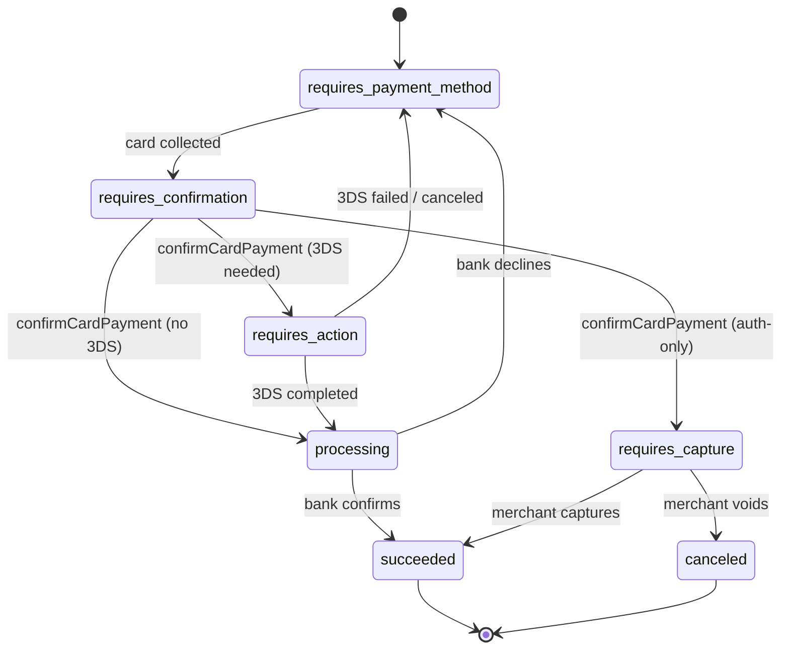
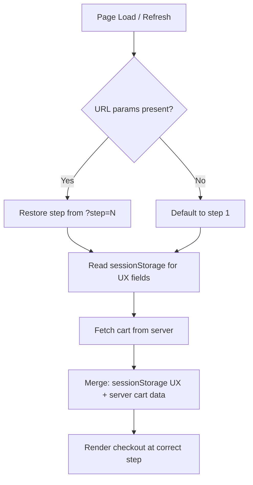
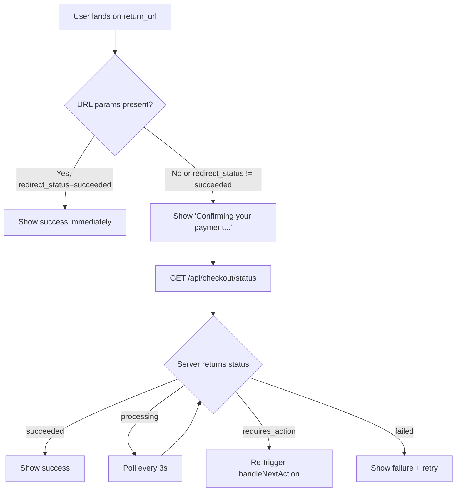
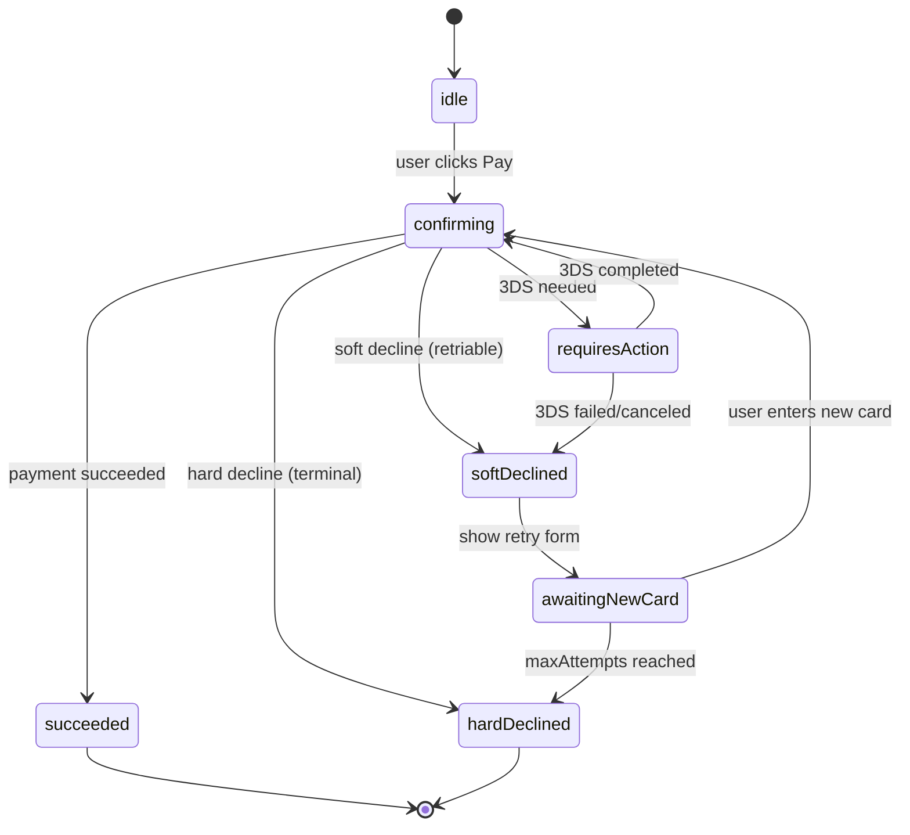
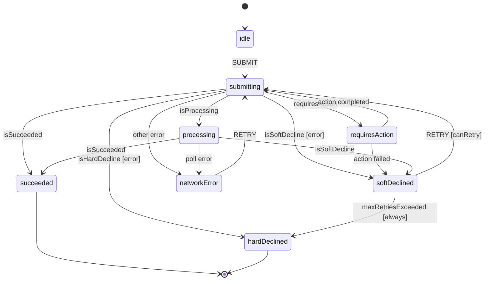
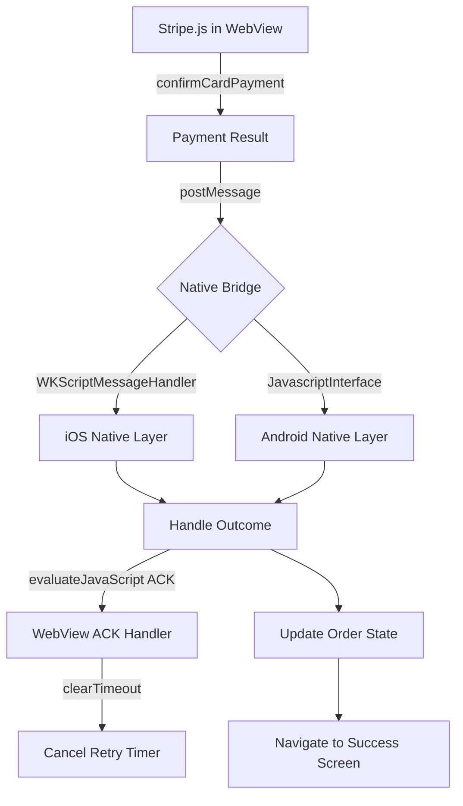

# Section 3: State Management & Transaction Lifecycle

Payment flows are among the most state-sensitive surfaces in frontend engineering. Unlike a social feed or a search results page, a payment UI must be simultaneously correct (never show success when the charge failed), resilient (survive tab closes, network errors, 3DS redirects, and browser extensions), and responsive (don't leave the user staring at a frozen button). This section covers the full lifecycle of a Stripe `PaymentIntent` — from initial state machine modeling through idempotency, optimistic UI tradeoffs, persistence strategy, re-entry recovery, cross-tab conflicts, redirect fragility, retry loops, XState architecture, and native WebView bridge communication.

---

## Core

### Q: A Stripe `PaymentIntent` moves through states: `requires_payment_method` → `requires_confirmation` → `requires_action` → `processing` → `succeeded` (or `requires_capture`, `canceled`). How does your frontend model this state machine, and how do you decide which UI to render at each transition?

**Problem framing:** A `PaymentIntent` (PI) is a server-side object with a `status` field that acts as the authoritative state of a charge attempt. If your frontend doesn't accurately model these transitions, you risk rendering the wrong UI — showing a success screen while the PI is still `processing`, or leaving the user stuck on a loading spinner when `requires_action` demands 3DS interaction. Race conditions compound this: a webhook may update the PI status on the server while the client is polling, and the two can briefly diverge. Modeling the PI as a finite state machine (FSM) on the frontend forces you to enumerate every valid state and every valid transition, making impossible states impossible to render.

**Approach:**

Map each `PaymentIntent.status` to a discrete UI component. The mapping should be exhaustive — every Stripe-documented status should have a handler, with a fallback for unexpected values:



React render function keyed to PI status:

```javascript
function PaymentStatusView({ paymentIntent, clientSecret, stripe }) {
  switch (paymentIntent.status) {
    case 'requires_payment_method':
      return <CardForm clientSecret={clientSecret} stripe={stripe} />;

    case 'requires_confirmation':
      // Rare in client-side flows — Stripe.js handles this internally
      return <ConfirmingView />;

    case 'requires_action':
      // Trigger 3DS challenge immediately
      stripe.handleNextAction(clientSecret).then(handleActionResult);
      return <ActionRequiredView message="Verifying with your bank..." />;

    case 'processing':
      // Async — charge is in flight; poll for resolution
      return <ProcessingView onTimeout={handleProcessingTimeout} />;

    case 'requires_capture':
      // Auth-only mode — funds are held, not yet captured
      return <SuccessView message="Order confirmed — payment pending capture." />;

    case 'succeeded':
      return <SuccessView message="Payment complete. Thank you!" />;

    case 'canceled':
      return <FailureView message="This payment was canceled. Please start over." />;

    default:
      return <ErrorView message={`Unexpected payment state: ${paymentIntent.status}`} />;
  }
}
```

`requires_action` is the most operationally significant state: it signals that Stripe needs to trigger a 3DS authentication challenge (or another next action like a redirect). Calling `stripe.handleNextAction(clientSecret)` opens the appropriate modal or redirect. On resolution it returns either a `paymentIntent` with `status: 'succeeded'` or `processing'`, or an `error` indicating the user canceled or failed 3DS — in which case the PI returns to `requires_payment_method` and the user must retry with a different card or try again.

`requires_capture` is specific to manual-capture flows (common in travel/hospitality or marketplaces): the charge has been authorized but not settled. Your UI should show "Order confirmed" — the user's experience is success — but your backend must capture within 7 days or the authorization expires.

For the `processing` state: Stripe resolves this asynchronously (typically within seconds, but occasionally minutes for certain card networks). Poll by calling `stripe.retrievePaymentIntent(clientSecret)` every 3 seconds, with a cap of ~10 attempts before presenting a "still processing" message and advising the user to check their email.

**Tradeoffs:** Polling is simple to implement but creates server load and adds latency. Webhooks are canonical — Stripe sends `payment_intent.succeeded` or `payment_intent.payment_failed` server-side — but the user's browser doesn't receive webhooks directly. A hybrid approach (webhook updates server state; client polls a lightweight `/api/payment/status` endpoint instead of hitting Stripe directly) is both efficient and reliable. Never trust only the client-side status: a sophisticated user could manipulate local state; always confirm with server or Stripe before fulfilling an order.

---

### Q: What is idempotency in the context of payment requests, and how do you implement it on the frontend? Specifically, if a user clicks "Pay" and the request times out before you receive a response, how do you safely retry without charging the user twice?

**Problem framing:** HTTP has an inherent ambiguity problem with non-idempotent operations: if a POST request times out, you don't know whether the server processed it before the connection dropped or never received it at all. For most API calls this is a minor inconvenience. For payments, it means the user could be charged twice if you naively retry the same POST. The core challenge is that from the client's perspective, a timeout is indistinguishable from a server failure — both look like an unresponsive connection.

**Approach:**

Generate a stable idempotency key tied to the specific purchase intent — typically the cart ID or session ID — and persist it for the lifetime of that purchase attempt:

```javascript
function getOrCreateIdempotencyKey(cartId) {
  const storageKey = `idempotency_key_${cartId}`;
  let key = sessionStorage.getItem(storageKey);
  if (!key) {
    key = crypto.randomUUID();
    sessionStorage.setItem(storageKey, key);
  }
  return key;
}
```

Send this key as an `Idempotency-Key` header on every payment request to your backend, which forwards it to Stripe on the charge or PaymentIntent creation call:

```javascript
async function initiatePayment(cartId, paymentMethodId) {
  const idempotencyKey = getOrCreateIdempotencyKey(cartId);

  const response = await fetch('/api/payments/confirm', {
    method: 'POST',
    headers: {
      'Content-Type': 'application/json',
      'Idempotency-Key': idempotencyKey,
    },
    body: JSON.stringify({ cartId, paymentMethodId }),
  });

  if (!response.ok && isRetriableError(response.status)) {
    // Safe to retry — Stripe will deduplicate using the same key
    return retryWithBackoff(() => initiatePayment(cartId, paymentMethodId));
  }

  return response.json();
}
```

Stripe deduplicates requests bearing the same idempotency key within a 24-hour window. If the original request succeeded but the response was lost in transit, retrying with the same key returns the cached original response — no second charge occurs. If the original request was still in flight, Stripe queues the retry. If the original request failed, Stripe processes the retry as a new attempt.

After confirmed success — when you receive a `paymentIntent.status === 'succeeded'` response — clear the idempotency key from sessionStorage and from any server-side store. This ensures that a new purchase (e.g., same user, new cart) generates a new key:

```javascript
function clearIdempotencyKey(cartId) {
  sessionStorage.removeItem(`idempotency_key_${cartId}`);
}
```

The even more robust approach with PaymentIntents is to not use a separate idempotency key mechanism at all for the confirmation step: because `stripe.confirmCardPayment(clientSecret)` operates on a single PI resource identified by its `clientSecret`, repeated calls are naturally idempotent — you're confirming the same PaymentIntent, not creating new charges. Create the PI server-side (with an idempotency key on creation), then let the client call `confirmCardPayment` as many times as needed.

**Tradeoffs:** UUIDs are effectively unguessable, preventing key collisions, but they carry no semantic meaning — a hash of `(userId + cartId + amount + timestamp-rounded-to-minute)` is more debuggable in logs. `sessionStorage` survives page refreshes within the same tab but is wiped on tab close — if the user closes and reopens the tab, they'll generate a new key. For most flows this is acceptable (the original charge either succeeded or didn't). The 24-hour Stripe dedup window covers the vast majority of retry scenarios; if a user returns after 25 hours with the same cart, treat it as a new purchase.

---

### Q: How do you handle optimistic UI in a payment flow? Unlike a social media "like," a payment has real monetary consequence if the optimistic update is wrong. Where do you draw the line between responsiveness and correctness?

**Problem framing:** Optimistic UI pre-renders the expected outcome of an action before the server confirms it, making the app feel instantaneous. This works beautifully for reversible, low-stakes operations — liking a post, reordering a list — because rolling back is cheap. Payments are different: showing a success screen before the charge is confirmed could mislead a user into believing they've purchased something they haven't, leading to order fulfillment on unconfirmed funds, customer service disputes, and loss of trust. The question is not whether to use optimistic UI at all, but where in the checkout funnel it is safe to apply.

**Approach:**

Divide the checkout flow into steps by their risk level and reversibility:

**Safe for optimistic UI (low stakes, easily reversible):**
- Adding or removing items from cart
- Applying a coupon code (show discount immediately; validate server-side; roll back with "coupon expired" if invalid)
- Selecting a shipping method (show estimated delivery date immediately)
- Address validation (mark address as valid optimistically; correct if geocoding fails)

**Never optimistic (high stakes, irreversible from user's perspective):**
- The payment confirmation step itself
- Order creation post-payment
- Any state that implies money has moved

For the payment button click specifically, use a "pending" intermediate state — not a "success" state:

```javascript
function CheckoutButton({ clientSecret, stripe, cardElement }) {
  const [status, setStatus] = useState('idle'); // idle | pending | success | error

  async function handlePay() {
    setStatus('pending'); // Disable button, show spinner — NOT showing success
    
    const { paymentIntent, error } = await stripe.confirmCardPayment(clientSecret, {
      payment_method: { card: cardElement },
    });

    if (error) {
      setStatus('error');
      // Re-enable form, show error message, preserve cart state
      return;
    }

    if (paymentIntent.status === 'succeeded' || paymentIntent.status === 'requires_capture') {
      setStatus('success'); // Only now transition to success
    }
  }

  return (
    <button onClick={handlePay} disabled={status === 'pending'}>
      {status === 'pending' ? <Spinner /> : 'Pay Now'}
    </button>
  );
}
```

The `pending` state is UI responsiveness without claiming success. It shows the user "something is happening" — which is true — without asserting an outcome that hasn't been confirmed. For 3DS flows (`requires_action`), display "Verifying with your bank..." to explain the delay without implying the charge has gone through.

For rollback on failure: re-enable the payment form with an error message, but preserve all cart state. The user should not have to re-enter their shipping address because their card was declined.

**Tradeoffs:** Full optimistic (claim success before server confirms) is inappropriate for any step that involves money movement. Full pessimistic (no UI feedback until every server round-trip completes) creates a frustrating experience for low-stakes steps like applying coupons. The correct approach is a hybrid keyed to risk level: optimistic for cart mutations, pessimistic-with-pending-state for payment confirmation. This gives users the responsiveness they expect without the correctness risks they cannot afford.

---

### Q: Describe how you would manage the state of a multi-step checkout form across a full page refresh. What should be persisted (to `sessionStorage`, a URL param, or a server-side cart session), and what should be intentionally discarded to avoid security issues?

**Problem framing:** Users accidentally refresh pages, browsers crash, and the back button is a first-class navigation gesture. A checkout flow that loses all state on refresh forces users to re-enter information they've already provided — a significant source of cart abandonment. At the same time, blindly persisting everything creates security vulnerabilities: raw card numbers, CVVs, or PaymentIntent `client_secret` values stored in `localStorage` are accessible to any XSS payload running on your domain.

**Approach:**

Use a three-tier persistence model keyed to sensitivity:

**Tier 1 — URL parameters (public, shareable, not sensitive):**
- Current checkout step (`?step=2`)
- Cart ID (`?cart=abc123`)
- These are safe to share, bookmarkable, and survive all forms of navigation. Never put pricing or discount amounts here — they can be manipulated.

**Tier 2 — `sessionStorage` (tab-scoped, not shareable, survives refresh):**
- Form field values: name, email, shipping address
- Selected shipping method
- Applied coupon code (not the discount amount — re-validate from server)
- UI preferences: "bill to same address as shipping"
- NOT card data — Stripe Elements live in a sandboxed iframe; you never touch card numbers

**Tier 3 — Server-side cart session (authoritative, durable):**
- Cart contents and quantities
- Canonical pricing and applied discounts (never trust the client for price)
- PaymentIntent ID (not `client_secret`) — so you can recover in-flight payments
- Inventory reservations



Rehydration function:

```javascript
function rehydrateCheckoutState(cartId) {
  const saved = sessionStorage.getItem(`checkout_${cartId}`);
  const localState = saved ? JSON.parse(saved) : {};
  // Always re-fetch cart from server for canonical price/inventory
  return fetchCart(cartId).then(serverCart => ({
    ...localState,
    cart: serverCart, // server is authoritative for price
  }));
}
```

**What to intentionally discard:**
- Raw card numbers, CVV, full PAN — these should never exist in your JavaScript context; Stripe Elements keeps them in an iframe
- `PaymentIntent.client_secret` — avoid persisting to `localStorage` (XSS risk); acceptable in `sessionStorage` with awareness that it expires with the tab. Prefer storing only the PI ID server-side and re-fetching the `client_secret` on rehydration
- Authentication tokens in URL params — these end up in server logs and browser history

**Tradeoffs:** `localStorage` persists across tabs and browser restarts, making it more durable but more exposed to XSS and accidental cross-session bleed (e.g., two users sharing a computer). `sessionStorage` is scoped to the tab, which is the right lifetime for a checkout session. Server-side sessions are the most secure but add a round-trip on every rehydration; cache aggressively but always revalidate prices server-side before capture.

---

### Q: What happens to an in-flight payment confirmation if the user's browser tab is closed or the device loses power during the `processing` state? How does your frontend handle re-entry — e.g., the user re-opens the tab or returns to the site 10 minutes later?

**Problem framing:** The `processing` state is inherently asynchronous — Stripe has submitted the charge to the card network but hasn't received a final response. If the user closes their browser at this exact moment, the charge may or may not complete. When they return, they are in an unknown state: the charge could have succeeded (in which case showing the payment form would be dangerous — they might pay again), failed (in which case they need to retry), or still be processing (in which case they need to wait). Getting this wrong means either a confused user or a double charge.

**Approach:**

The key architectural decision is where to store the PaymentIntent ID. Store it server-side (in the cart session, keyed to the user/cart) so it survives browser state loss entirely. On re-entry, your backend can look up the PI ID and retrieve its current status from Stripe.

For the client-side path, if you stored the `client_secret` in `sessionStorage` before the browser closed (tab close wipes sessionStorage, but the user may have the same session if they just navigated away), call `stripe.retrievePaymentIntent(clientSecret)` and branch on status:

```javascript
async function handleReEntry(clientSecret) {
  const { paymentIntent, error } = await stripe.retrievePaymentIntent(clientSecret);
  if (error) return { state: 'error', error };
  switch (paymentIntent.status) {
    case 'succeeded': return { state: 'success', paymentIntent };
    case 'processing': return { state: 'polling', paymentIntent };
    case 'requires_action': return { state: 'action_required', paymentIntent };
    case 'requires_payment_method': return { state: 'retry', paymentIntent };
    default: return { state: 'unknown', paymentIntent };
  }
}
```

Status-based recovery flows:
- **`succeeded`** → Navigate to success/order-confirmation page immediately
- **`requires_capture`** → Treat as success; order is confirmed, awaiting merchant capture
- **`processing`** → Show "Your payment is still being processed..." with auto-polling every 3s (up to ~10 polls, then present manual refresh option)
- **`requires_action`** → Re-trigger `stripe.handleNextAction(clientSecret)` — the 3DS challenge was never completed; user must finish it
- **`requires_payment_method`** → The charge failed during processing (e.g., card network decline after initial authorization); show error and payment retry form
- **`canceled`** → PI was voided; show failure message and start fresh

For polling in `processing`:

```javascript
async function pollUntilResolved(clientSecret, maxAttempts = 10) {
  for (let i = 0; i < maxAttempts; i++) {
    await delay(3000 * Math.pow(1.5, i)); // exponential backoff
    const { paymentIntent } = await stripe.retrievePaymentIntent(clientSecret);
    if (paymentIntent.status !== 'processing') {
      return paymentIntent;
    }
  }
  return null; // timed out — advise user to check email
}
```

**Tradeoffs:** Polling against Stripe is simple but creates unnecessary load if many users are polling simultaneously. A better architecture: your server receives the `payment_intent.succeeded` webhook from Stripe; the client polls your lightweight `/api/payment/status` endpoint instead, which reads from your database rather than calling Stripe on every poll. Server-Sent Events (SSE) or WebSockets push the update to the client as soon as the webhook arrives, eliminating polling latency entirely — but adds infrastructure complexity.

---

### Q: How do you handle concurrent modifications to a shared cart — e.g., the same user opens checkout in two browser tabs simultaneously? How do you detect the conflict on the frontend and recover gracefully?

**Problem framing:** A user opens their cart in a mobile browser tab, then opens the same URL on their desktop. Both tabs share the same server-side cart session. If Tab A applies a coupon and Tab B simultaneously removes an item, you have a classic read-modify-write race condition: whichever write arrives second overwrites the first without knowing the conflict occurred. Worse, if both tabs attempt to initiate payment, you could end up with two PaymentIntents for the same cart — one of which will be charged.

**Approach:**

**Server-side: optimistic locking with version numbers.** Each cart has a `version` field. Every mutation request includes the version the client last saw; the server rejects mutations against a stale version with `409 Conflict` and returns the current cart state. This prevents the lost-update problem at the data layer.

**Client-side: BroadcastChannel for cross-tab awareness.** The `BroadcastChannel` API lets tabs in the same browser origin communicate without a server round-trip:

```javascript
const channel = new BroadcastChannel('checkout_cart');
channel.onmessage = (event) => {
  if (event.data.type === 'CART_UPDATED') {
    refetchCart(); // refresh from server
  }
  if (event.data.type === 'PAYMENT_INITIATED') {
    // Another tab started checkout — disable this tab's pay button
    setCartLocked(true);
    showBanner("Checkout is in progress in another tab.");
  }
};

// Broadcast when making mutations
function updateCart(item) {
  return patchCart(item).then(result => {
    channel.postMessage({ type: 'CART_UPDATED', cartId, version: result.version });
    return result;
  });
}

// Broadcast when initiating payment
function initiatePayment() {
  channel.postMessage({ type: 'PAYMENT_INITIATED', cartId });
  return createPaymentIntent(cartId);
}
```

**Conflict recovery:** When a mutation returns `409 Conflict`, re-fetch the current cart from the server, diff the changes ("Your cart was updated in another tab: Item X was removed"), display the diff to the user, and ask them to confirm before proceeding. Never silently discard either write.

**Payment initiation locking:** Use first-write-wins for payment initiation — whichever tab creates the PaymentIntent first "wins." The server should enforce that only one active PI can exist per cart. Broadcast `PAYMENT_INITIATED` so other tabs disable their checkout button immediately.

**Tradeoffs:** `BroadcastChannel` only works within the same browser on the same device — it does nothing for a user on two different devices. For multi-device conflicts, you need server-side locking (a `locked_by_payment_intent` field on the cart) and polling/WebSocket push to notify the second device. The `localStorage` `storage` event is an older cross-tab communication mechanism that works in older browsers but fires for every `localStorage` write — more noise. `BroadcastChannel` is purpose-built and cleaner for this use case.

---

### Q: A user completes payment but the success redirect is intercepted by an ad blocker or a browser extension that strips query params. How do you design the confirmation flow so the user reaches a correct success state even if your `?payment_intent=pi_xxx&redirect_status=succeeded` URL param never arrives?

**Problem framing:** Stripe's 3DS redirect flow works by redirecting the user to your `return_url` with query parameters: `payment_intent`, `payment_intent_client_secret`, and `redirect_status`. Privacy-focused browser extensions (uBlock Origin, Privacy Badger), corporate proxies, and some mobile browsers strip or block URL parameters containing tracking-like patterns. If your confirmation page only checks URL params, a significant fraction of users — especially enterprise users behind corporate proxies — will land on a blank or broken confirmation page even though their payment succeeded.

**Approach:**

Build a layered resolution strategy that uses URL params as the fast path but falls back to server-side lookup:

```javascript
async function resolvePaymentStatus() {
  const params = new URLSearchParams(window.location.search);
  const redirectStatus = params.get('redirect_status');
  const clientSecret = params.get('payment_intent_client_secret');
  
  if (redirectStatus === 'succeeded' && clientSecret) {
    // Happy path: params arrived intact
    return { source: 'redirect_params', status: 'succeeded' };
  }
  
  // Fallback: query server for canonical status
  const response = await fetch('/api/checkout/status');
  const { paymentIntentId, status } = await response.json();
  return { source: 'server_poll', status };
}
```

The server endpoint `/api/checkout/status` looks up the PaymentIntent ID stored in the user's session (stored before payment was initiated), calls `stripe.paymentIntents.retrieve(piId)` via the Stripe server SDK, and returns the canonical status. This path works even if zero URL params arrived.

As a third fallback: if you stored `client_secret` in `sessionStorage` before the 3DS redirect, call `stripe.retrievePaymentIntent(clientSecret)` client-side. Note: 3DS redirects navigate away from the page, so `sessionStorage` is cleared on iOS Safari in some configurations — don't rely on this as the primary fallback.



Webhooks should make the server's answer authoritative and fast: your backend receives `payment_intent.succeeded` from Stripe before or around the same time the user is redirected back. By the time the fallback server poll fires, the server already knows the outcome. Display "Confirming your payment..." while the resolution is in flight — this is honest, non-alarming, and covers the brief gap between redirect and server knowledge.

**Tradeoffs:** Relying solely on redirect params is brittle and increasingly unreliable as privacy tooling proliferates. Always-server-check adds ~200ms latency on the happy path but eliminates an entire class of "payment succeeded but showed error" bugs. The hybrid approach — fast path via params, reliable fallback via server — is the correct production design. The incremental cost of the server fallback call is trivial compared to the customer service cost of a user who paid but saw an error page.

---

## Deep

### Q: Walk me through implementing a robust payment retry loop on the frontend. The user's card was declined (soft decline). You want to: (1) allow the user to update their card details, (2) re-confirm the same `PaymentIntent` rather than creating a new one, and (3) cap retries at a safe limit to avoid locking the card. How do you manage the state transitions, and what data do you pass back to the `confirmCardPayment` call on a retry?

**Problem framing:** Card declines come in two flavors with fundamentally different retry semantics. Soft declines (`insufficient_funds`, `do_not_honor`, `card_velocity_exceeded`, `try_again_later`) are transient — the user may succeed with a different card, a different time, or after resolving their balance. Hard declines (`fraudulent`, `lost_card`, `stolen_card`, `pickup_card`) are permanent — retrying is not only futile but can trigger additional fraud signals and further lock the card. Presenting a retry UI for a hard decline is poor UX and potentially a compliance issue. The retry loop must distinguish these, cap attempts to avoid card lockouts (most issuers lock a card after 3–5 consecutive failures), and preserve the same PaymentIntent across attempts to avoid leaving dangling PI objects on Stripe's side.

**Approach:**

Start with the error taxonomy. Stripe surfaces card errors as `error.type === 'card_error'`. Check `error.code` and `error.decline_code` to classify:

```javascript
const RETRY_CONFIG = {
  maxAttempts: 3,
  softDeclineCodes: new Set(['insufficient_funds', 'do_not_honor', 'card_velocity_exceeded', 'try_again_later']),
  hardDeclineCodes: new Set(['fraudulent', 'lost_card', 'stolen_card', 'pickup_card']),
};

const retryState = {
  attempts: 0,
  paymentIntentId: null, // reuse same PI
  clientSecret: null,
  lastDeclineCode: null,
};
```

After a decline, Stripe moves the PaymentIntent back to `requires_payment_method`. This is the key insight: you don't create a new PI — you call `stripe.confirmCardPayment(clientSecret, { payment_method: newCardElement })` on the existing PI with the new payment method. The PI ID stays the same; only the payment method changes.

Full retry loop:

```javascript
async function attemptPayment(clientSecret, cardElement, retryState) {
  if (retryState.attempts >= RETRY_CONFIG.maxAttempts) {
    return { success: false, reason: 'max_retries_exceeded' };
  }
  
  const { paymentIntent, error } = await stripe.confirmCardPayment(clientSecret, {
    payment_method: { card: cardElement },
  });
  
  if (!error && paymentIntent.status === 'succeeded') {
    return { success: true, paymentIntent };
  }
  
  if (error?.type === 'card_error') {
    const declineCode = error.decline_code || error.code;
    retryState.lastDeclineCode = declineCode;
    retryState.attempts++;
    
    if (RETRY_CONFIG.hardDeclineCodes.has(declineCode)) {
      return { success: false, reason: 'hard_decline', error };
    }
    
    if (RETRY_CONFIG.softDeclineCodes.has(declineCode)) {
      // Allow user to update payment method and retry
      return { success: false, reason: 'soft_decline', error, retriable: true };
    }
  }
  
  return { success: false, reason: 'other_error', error };
}
```

UI flow on soft decline:

1. Show user-friendly message: "Your card was declined: insufficient funds. Please try a different card."
2. Re-render Stripe Elements to accept a new card — do NOT create a new PI
3. Pass the same `clientSecret` to the next `confirmCardPayment` call
4. Pass the new `cardElement` as the `payment_method`
5. Optionally pass `payment_method_data: { billing_details: { name, address } }` if the user updates billing details

State machine diagram for the retry flow:



Persist the retry counter in both component state and `sessionStorage` so a page refresh doesn't reset it — a refresh shouldn't grant the user additional retry attempts beyond what the cap allows. After `maxAttempts`, do not present another card entry form. Instead: advise the user to contact their bank, offer alternative payment methods (different card, PayPal, Apple Pay), or show a "Try again tomorrow" message for `card_velocity_exceeded`.

`requires_action` can appear mid-retry: if the user switches to a card that requires 3DS, `stripe.confirmCardPayment` will trigger `handleNextAction` internally (when using `confirmCardPayment` directly) or return `requires_action` for manual handling. Ensure your retry loop handles this state on every attempt, not just the first.

Add a small delay between automated retries (1–2 seconds) to avoid rate limiting. For user-initiated retries (user clicks "Try another card"), no delay is needed — the user's action is the natural throttle.

**Tradeoffs:** Creating a new PI on each retry is simpler to implement but leaves dangling PIs on Stripe's dashboard and makes reconciliation harder. Stripe explicitly recommends reusing the same PI. The `maxAttempts` cap of 3 is conservative; real-world card networks typically allow 3–5 attempts before locking, so a frontend cap of 3 gives a margin of safety. A delay between retries is courteous to the card network but not strictly required for user-initiated retries with a different card.

---

### Q: Describe how you would architect a frontend payment state machine using XState (or a comparable library). Define the states, events, guards, and side effects for the full lifecycle including 3DS authentication, network errors, and soft declines. What are the advantages of this approach over ad-hoc `if/else` logic in React component state?

**Problem framing:** Ad-hoc payment state management using `useState` and `if/else` chains has a fundamental flaw: state is implicit and distributed. A component with `isLoading`, `isError`, `isSuccess`, `isRetrying`, `requires3DS`, and `retryCount` variables can be in combinations that should be impossible — `isLoading: true` and `isSuccess: true` simultaneously — but React won't prevent it. These impossible states cause bugs: a spinner that stays visible after success, an error message that flashes briefly during a successful 3DS flow, a retry button that appears during processing. As the number of boolean flags grows, the number of impossible state combinations grows combinatorially. XState makes the valid states explicit and the invalid states unreachable by construction.

**Approach:**

Define a complete XState v4 machine for the full payment lifecycle:

```javascript
import { createMachine, assign } from 'xstate';

const paymentMachine = createMachine({
  id: 'payment',
  initial: 'idle',
  context: {
    clientSecret: null,
    retryCount: 0,
    maxRetries: 3,
    error: null,
    paymentIntent: null,
    declineCode: null,
  },
  states: {
    idle: {
      on: {
        SUBMIT: {
          target: 'submitting',
          actions: assign({ error: null }),
        },
      },
    },
    submitting: {
      invoke: {
        src: 'confirmPayment',
        onDone: [
          { target: 'succeeded', cond: 'isSucceeded', actions: assign({ paymentIntent: (_, e) => e.data }) },
          { target: 'processing', cond: 'isProcessing' },
          { target: 'requiresAction', cond: 'requiresAction' },
        ],
        onError: [
          { target: 'softDeclined', cond: 'isSoftDecline', actions: ['assignError', 'incrementRetry'] },
          { target: 'hardDeclined', cond: 'isHardDecline', actions: 'assignError' },
          { target: 'networkError', actions: 'assignError' },
        ],
      },
    },
    requiresAction: {
      invoke: {
        src: 'handleNextAction',
        onDone: { target: 'submitting' },
        onError: { target: 'softDeclined', actions: 'assignError' },
      },
    },
    processing: {
      invoke: {
        src: 'pollPaymentStatus',
        onDone: [
          { target: 'succeeded', cond: 'isSucceeded' },
          { target: 'softDeclined', cond: 'isSoftDecline' },
        ],
        onError: { target: 'networkError', actions: 'assignError' },
      },
    },
    softDeclined: {
      on: {
        RETRY: {
          target: 'submitting',
          cond: 'canRetry',
        },
        MAX_RETRIES_REACHED: 'hardDeclined',
      },
      always: {
        target: 'hardDeclined',
        cond: 'maxRetriesExceeded',
      },
    },
    networkError: {
      on: {
        RETRY: 'submitting',
      },
    },
    hardDeclined: { type: 'final' },
    succeeded: { type: 'final' },
  },
}, {
  guards: {
    canRetry: (ctx) => ctx.retryCount < ctx.maxRetries,
    maxRetriesExceeded: (ctx) => ctx.retryCount >= ctx.maxRetries,
    isSoftDecline: (_, e) => RETRY_CONFIG.softDeclineCodes.has(e.data?.decline_code),
    isHardDecline: (_, e) => RETRY_CONFIG.hardDeclineCodes.has(e.data?.decline_code),
    isSucceeded: (_, e) => e.data?.status === 'succeeded',
    isProcessing: (_, e) => e.data?.status === 'processing',
    requiresAction: (_, e) => e.data?.status === 'requires_action',
  },
  actions: {
    assignError: assign({ error: (_, e) => e.data }),
    incrementRetry: assign({ retryCount: (ctx) => ctx.retryCount + 1 }),
  },
  services: {
    confirmPayment: (ctx) => stripe.confirmCardPayment(ctx.clientSecret, { payment_method: { card: cardElement } }),
    handleNextAction: (ctx) => stripe.handleNextAction(ctx.clientSecret),
    pollPaymentStatus: (ctx) => pollUntilResolved(ctx.clientSecret),
  },
});
```

React integration with `useMachine`:

```javascript
const [state, send] = useMachine(paymentMachine, {
  context: { clientSecret: props.clientSecret }
});

// Render is a pure function of state.value — no if/else chains
function PaymentUI() {
  switch (state.value) {
    case 'idle': return <PayButton onClick={() => send('SUBMIT')} />;
    case 'submitting': return <Spinner label="Processing payment..." />;
    case 'requiresAction': return <ActionView label="Verifying with your bank..." />;
    case 'processing': return <Spinner label="Waiting for bank confirmation..." />;
    case 'softDeclined': return (
      <RetryForm 
        error={state.context.error}
        retriesLeft={state.context.maxRetries - state.context.retryCount}
        onRetry={() => send('RETRY')}
      />
    );
    case 'networkError': return <NetworkErrorView onRetry={() => send('RETRY')} />;
    case 'hardDeclined': return <HardDeclineView error={state.context.error} />;
    case 'succeeded': return <SuccessView paymentIntent={state.context.paymentIntent} />;
  }
}
```

Full machine state diagram:



**Advantages over ad-hoc state:**

1. **No impossible states.** The machine literally cannot be in `succeeded` and `softDeclined` simultaneously. Each state is a named node with explicit entry and exit conditions.
2. **All transitions are documented.** Every valid `state → event → next state` path is enumerable. Code review and onboarding become dramatically easier.
3. **Side effects are isolated.** `invoke`d services (API calls, polling) are attached to specific states. They start when the state is entered, are automatically canceled when the state is exited, and their results drive transitions. No dangling `useEffect` subscriptions.
4. **Testable in isolation.** You can unit-test the state machine by sending events and asserting state transitions without rendering any UI.
5. **Visualizable.** XState's inspector and visualizer tools generate the state diagram automatically from the machine definition — the diagram is always in sync with the code.
6. **Guards prevent illegal transitions.** The `canRetry` guard prevents a `RETRY` event from firing when `retryCount >= maxRetries` — this is enforced by the machine, not by an `if` statement that might be missing from some code path.
7. **Predictable context.** The `context` object is updated only via `assign` actions tied to specific transitions — no scattered `setState` calls that could apply in the wrong order.

**Tradeoffs:** XState has a meaningful learning curve, particularly around invoked services and the v4→v5 API differences. The bundle adds ~15KB (gzipped). For a simple two-state payment form (idle → loading → success/error), XState is overkill. For a full checkout lifecycle with 3DS, retries, polling, network errors, and re-entry recovery, the structure it provides more than pays for itself in reduced bugs and maintainability.

---

### Q: Your checkout frontend runs inside a mobile WebView embedded in a native iOS/Android app. The native app and the WebView both need to know the payment outcome. Walk through the communication architecture: how does a payment confirmation event travel from the Stripe SDK (inside the WebView) through the `postMessage` bridge to the native layer, what are the failure modes, and how do you ensure exactly-once delivery of the success event to the native app?

**Problem framing:** Stripe.js is a browser-only SDK — it cannot run in native iOS or Android code. When a checkout flow runs inside a WKWebView (iOS) or WebView (Android), the payment confirmation happens inside the browser context, but the native app needs to know the outcome to update order state, dismiss the WebView, navigate to a native success screen, and trigger post-purchase flows (loyalty points, push notification receipts). The `postMessage` bridge between WebView and native is fire-and-forget with no built-in acknowledgment, and the WebView may be destroyed by the OS (memory pressure, user backgrounding the app) before the message is delivered.

**Approach:**

Architecture overview:



**Unified bridge abstraction:**

```javascript
function postToNative(message) {
  const payload = JSON.stringify(message);
  if (window.webkit?.messageHandlers?.paymentBridge) {
    // iOS WKWebView
    window.webkit.messageHandlers.paymentBridge.postMessage(payload);
  } else if (window.PaymentBridge?.postMessage) {
    // Android JavascriptInterface
    window.PaymentBridge.postMessage(payload);
  } else {
    // Fallback: running in browser (dev/test)
    console.warn('No native bridge found', message);
  }
}
```

**Message schema — include a `requestId` for deduplication:**

```javascript
const successMessage = {
  type: 'PAYMENT_RESULT',
  requestId: crypto.randomUUID(), // for dedup
  status: 'succeeded', // | 'failed' | 'requires_action'
  paymentIntentId: paymentIntent.id,
  amount: paymentIntent.amount,
  currency: paymentIntent.currency,
  timestamp: Date.now(),
};
```

**Exactly-once delivery via ACK protocol:**

`postMessage` is fire-and-forget. To guarantee delivery, implement a request/acknowledge loop:

```javascript
const pendingAcks = new Map(); // requestId → { message, retryCount, timeoutId }

function sendWithAck(message, maxRetries = 3) {
  const { requestId } = message;
  
  function attempt(retryCount) {
    postToNative(message);
    const timeoutId = setTimeout(() => {
      if (retryCount < maxRetries) {
        attempt(retryCount + 1);
      } else {
        // Give up — fall back to server-side notification
        triggerServerSideOutcome(message);
      }
    }, 3000 * Math.pow(2, retryCount)); // exponential backoff: 3s, 6s, 12s
    
    pendingAcks.set(requestId, { message, retryCount, timeoutId });
  }
  
  attempt(0);
}

window.onNativeAck = function(requestId) {
  const pending = pendingAcks.get(requestId);
  if (pending) {
    clearTimeout(pending.timeoutId);
    pendingAcks.delete(requestId);
  }
};
```

Native sends the ACK back to the WebView via `evaluateJavaScript`:

```swift
// iOS WKScriptMessageHandler
func userContentController(_ userContentController: WKUserContentController,
                           didReceive message: WKScriptMessage) {
  guard let body = message.body as? String,
        let data = body.data(using: .utf8),
        let event = try? JSONDecoder().decode(PaymentEvent.self, from: data)
  else { return }
  
  // Dedup: ignore messages we've already processed
  guard !processedIds.contains(event.requestId) else { return }
  processedIds.insert(event.requestId)
  
  // ACK back to WebView
  webView.evaluateJavaScript("window.onNativeAck('\(event.requestId)')")
  
  // Handle outcome
  handlePaymentOutcome(event)
}
```

**Failure modes and mitigations:**

1. **WebView destroyed before postMessage fires** (OS kills app while processing): Store the payment outcome in your server session at the moment of confirmation. Native app polls `GET /api/orders/{orderId}/status` on `UIApplicationDidBecomeActiveNotification` (iOS) or `onResume` (Android). Even if the WebView never delivers the message, the native app learns the outcome on next foreground.

2. **Bridge not initialized when message fires** (race condition on app cold start): Queue messages in a local array and flush them when the bridge becomes available. Detect bridge readiness via a native → WebView initialization message: `window.onBridgeReady = function() { flushMessageQueue(); }`.

3. **Android JavascriptInterface not injected** (timing issue or security settings): Feature-detect before sending. Fallback: navigate the WebView to a custom URL scheme like `myapp://payment/result?status=succeeded&pi=pi_xxx`. The native layer intercepts navigation via `shouldOverrideUrlLoading` (Android) or `decidePolicyForNavigationAction` (iOS) and reads the outcome from the URL without actually loading it.

4. **3DS opens external browser** (Stripe opens SFSafariViewController on iOS or Custom Chrome Tab on Android): The WebView context is suspended. Stripe handles the return via universal links / app links configured in your `return_url`. The native app intercepts the universal link, relaunches or resumes the WebView with the 3DS result, and the WebView calls `stripe.retrievePaymentIntent` to get the final status — then sends the outcome via postMessage as normal.

5. **Message ordering** (network error event arrives after success event due to retry timing): Include a `sequence` number in each message. Native tracks the last seen sequence per payment and discards out-of-order duplicates that carry an older sequence than the most recent processed event.

**Deep link / URL scheme as a simpler alternative:**

For teams that find the ACK protocol complex, the URL scheme interception pattern is simpler and more reliable for one-way outcome delivery:

```javascript
// WebView navigates to custom scheme — never loads, just signals outcome
function notifyNativeViaScheme(paymentIntent) {
  const params = new URLSearchParams({
    status: paymentIntent.status,
    pi: paymentIntent.id,
    amount: paymentIntent.amount,
  });
  window.location.href = `myapp://payment/result?${params}`;
}
```

Native intercepts the navigation before it loads, reads the params, handles the outcome, and dismisses the WebView. This is unidirectional (no ACK possible), carries limited data (URL length constraints), and requires no bridge setup — but loses the exactly-once guarantee and cannot carry complex payloads.

**Server-side fallback (belt and suspenders):**

Regardless of bridge strategy, configure your backend to receive Stripe webhooks and update order state. The native app's `onResume` handler should always call `GET /api/orders/{orderId}/status` after a payment session. This ensures the native app converges to the correct state even if every client-side communication channel fails.

**Tradeoffs:** The postMessage+ACK approach is robust but adds implementation complexity on both the WebView and native sides, and requires coordination between web and native engineering teams. URL scheme interception is simpler but unidirectional and limited. Shared server state is the most reliable channel but adds latency. Native WebView frameworks like Capacitor/Ionic or React Native's WebView component have built-in bridge abstractions that handle much of this boilerplate — if you're already using one, prefer their native bridge APIs over rolling your own. For first-party WebViews in otherwise native apps, the ACK protocol with server-side fallback is the production-grade choice.
