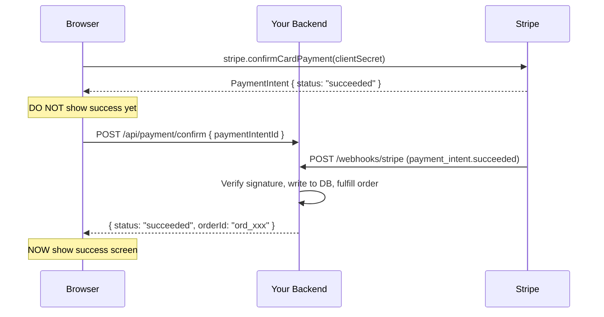
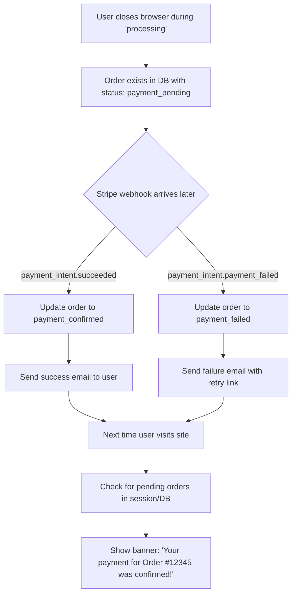
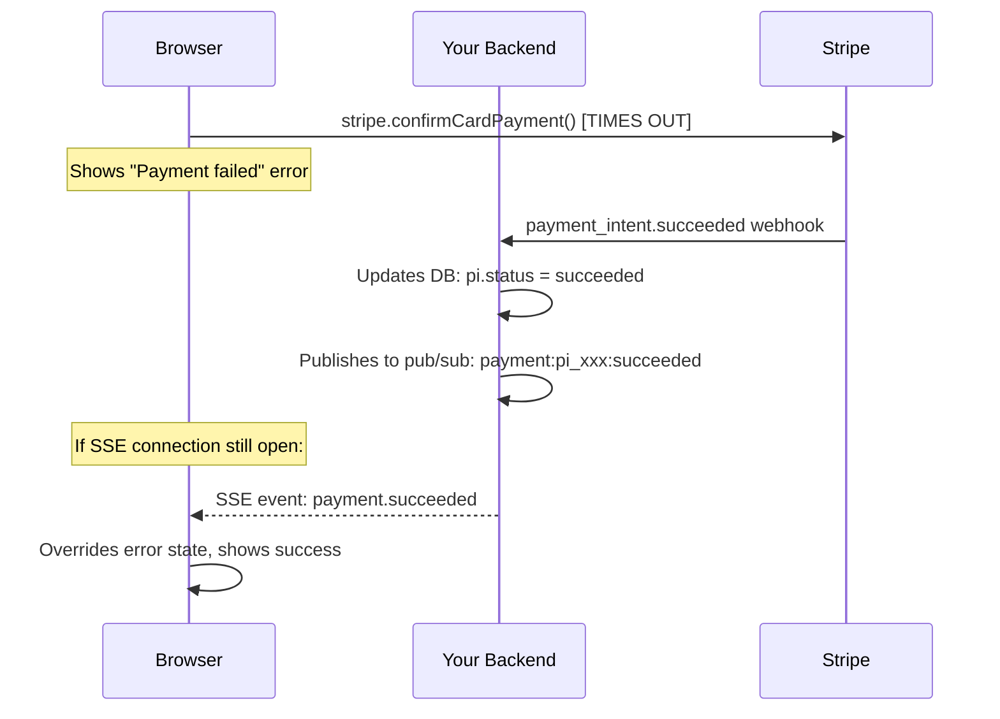
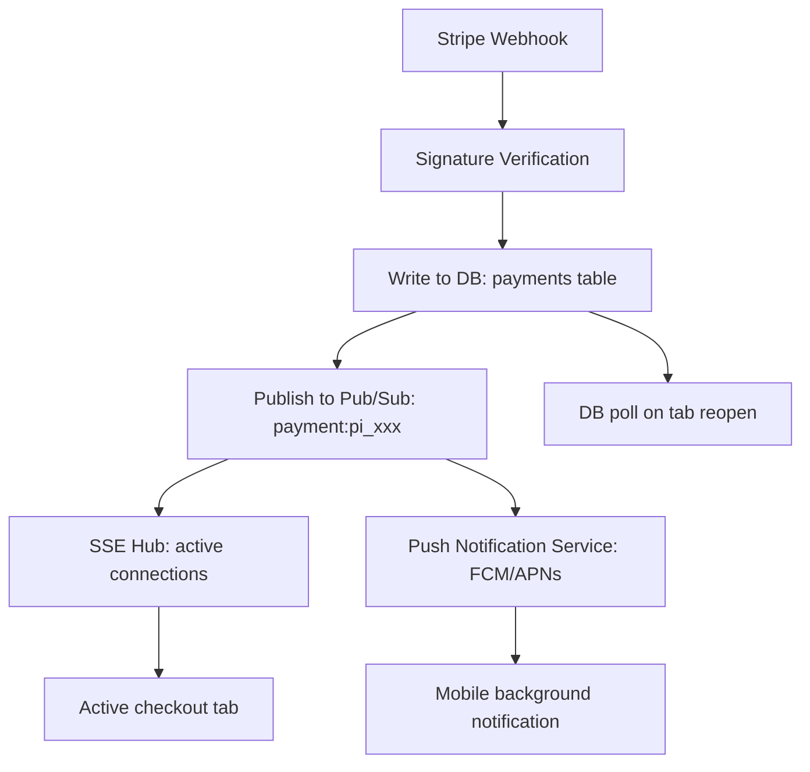
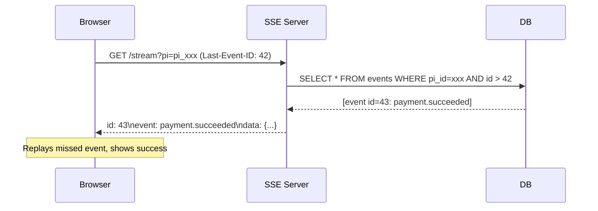
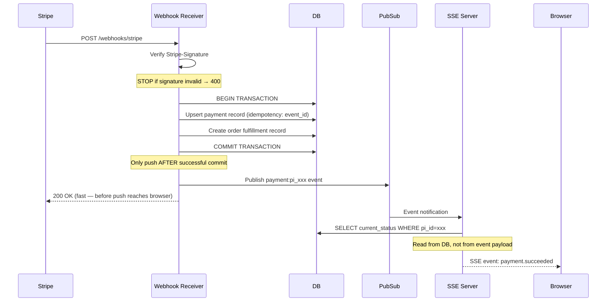

# 04 — Real-Time Updates & Webhooks

Payment status is never instantaneous. Stripe's `confirmCardPayment` returns within milliseconds, but the authoritative settlement signal — the webhook — arrives asynchronously, sometimes seconds later, sometimes minutes, and for certain payment methods like SEPA debit or ACH, days. This gap between "the user clicked Pay" and "the bank confirmed the charge" is where most real-time complexity lives. This section covers the full architecture of delivering payment status updates reliably across every frontend context: active tabs, closed-and-reopened tabs, mobile apps in the background, and concurrent POS dashboards processing dozens of payments simultaneously. The recurring theme is that the webhook is ground truth — everything on the client is provisional until the server confirms it.

---

## Core Questions

### Q1. Reconciling `confirmCardPayment` return vs. webhook ground truth

**Problem framing:** `stripe.confirmCardPayment()` is a synchronous-feeling call that resolves with a `PaymentIntent` object whose `status` field says `succeeded`. This is not the same as the Stripe webhook event `payment_intent.succeeded`. The JS SDK call returns after Stripe's API has created and confirmed the charge object, but "confirmed" here means Stripe accepted the request and it is in flight — not that the issuing bank has settled it. The webhook arrives after the issuing bank communicates the final outcome back through the card network. For most cards this gap is milliseconds to a few seconds. For certain card programs (deferred debit, some international networks) the gap is longer, and in all cases the webhook is what your backend actually acts on to fulfill the order. If a user sees a success screen based only on the client-side return value but the webhook never arrives (network failure, Stripe retry exhausted, your endpoint returned 500), you may fulfill an order with no settled funds.

**Approach:**

The reconciliation architecture works in two layers: client-side optimism gated by server confirmation.



After `confirmCardPayment` resolves with `status: "succeeded"`, immediately call your own backend to confirm:

```javascript
async function handlePaymentConfirmation(clientSecret, stripe) {
  const { paymentIntent, error } = await stripe.confirmCardPayment(clientSecret, {
    payment_method: { card: cardElement },
  });

  if (error) {
    return { outcome: 'failed', error };
  }

  // Client-side says succeeded — now verify server-side
  // Show "Confirming your payment..." — not success yet
  setStatus('verifying');

  const serverConfirmation = await pollServerStatus(paymentIntent.id, {
    maxAttempts: 12,
    initialDelayMs: 500,
  });

  if (serverConfirmation.status === 'succeeded') {
    // Webhook was received and processed — safe to show success
    return { outcome: 'succeeded', orderId: serverConfirmation.orderId };
  }

  return { outcome: 'processing', paymentIntentId: paymentIntent.id };
}
```

Your backend `/api/payment/status/:piId` endpoint reads from your own database (which the webhook populates), not from Stripe directly on every poll. This is crucial: polling Stripe's API directly on every client request is rate-limited, slow, and bypasses your own business logic (fulfillment, inventory, etc.).

**The safe rule for showing a success screen:** You may show success when your backend confirms the webhook has been processed **and** your fulfillment logic has run. Until then, show a "verifying" / "confirming" intermediate state. The user-visible delay is typically under 2 seconds.

**Tradeoffs:** A small percentage of payments will have the client-side `succeeded` status but the webhook delayed (Stripe retries webhooks over 72 hours if your endpoint returns errors). For these users, polling will eventually time out. The correct UX is to show a "We're confirming your payment — you'll receive a confirmation email shortly" message, not an error. The webhook always eventually arrives or Stripe notifies you of permanent failure. Do not make the user wait indefinitely — set them free after ~60 seconds of polling with the email-confirmation fallback.

---

### Q2. Polling vs. WebSockets vs. SSE for payment status

**Problem framing:** Once a payment enters an async state (sent for processing, waiting for webhook), the frontend needs a mechanism to receive the resolution without requiring the user to manually refresh. The three primary options — polling, WebSockets, and Server-Sent Events — have meaningfully different complexity, infrastructure, and reliability profiles. The choice matters especially in payment flows because the connection must be resilient (mobile networks are unreliable), the message stream is unidirectional (server → client), and the use case is ephemeral (one confirmation per session, not a persistent data stream).

**Approach:**

| Dimension | Polling | SSE | WebSocket |
|-----------|---------|-----|-----------|
| Direction | Client-initiated | Server-initiated (one-way) | Bidirectional |
| Protocol | HTTP | HTTP/2 (or HTTP/1.1) | WS (TCP upgrade) |
| Built-in reconnect | ❌ Manual | ✅ `EventSource` native | ❌ Manual |
| Proxy/firewall friendly | ✅ | ✅ (pure HTTP) | ⚠️ Some proxies strip WS |
| Infrastructure complexity | Low | Low | High (stateful server) |
| Mobile battery impact | High (keep-alive requests) | Low (idle connection) | Moderate |
| Implementation effort | Minimal | Low | High |
| Right for payment status | Fallback | ✅ Primary choice | Overkill for one-way |

**SSE is the right choice for payment confirmation flows.** The reasons:

1. **Unidirectional fit:** Payment status updates flow server → client. There is no reason the client needs to send data over the same channel. WebSockets' bidirectional capability is wasted here and adds overhead.

2. **Native reconnection:** `EventSource` reconnects automatically on connection drop, which is critical on mobile. The browser re-issues the request with a `Last-Event-ID` header so you can replay missed events.

3. **HTTP semantics:** SSE runs over plain HTTP/2. Load balancers, CDNs, and proxies that handle HTTP handle SSE without special configuration. WebSockets require explicit proxy support and upgraded connections.

4. **Simple infrastructure:** SSE is a long-lived HTTP response — your existing HTTP server handles it. WebSockets require either a dedicated WS server or a library like Socket.IO with room management.

SSE implementation for payment status:

```javascript
// Client
function subscribeToPaymentStatus(paymentIntentId, onUpdate) {
  const url = `/api/payment-status/stream?pi=${paymentIntentId}`;
  const source = new EventSource(url);

  source.addEventListener('payment.succeeded', (event) => {
    const data = JSON.parse(event.data);
    onUpdate({ status: 'succeeded', orderId: data.orderId });
    source.close(); // One-shot — close after resolution
  });

  source.addEventListener('payment.failed', (event) => {
    const data = JSON.parse(event.data);
    onUpdate({ status: 'failed', declineCode: data.decline_code });
    source.close();
  });

  source.onerror = () => {
    // EventSource reconnects automatically — onerror fires on temporary drops
    // Only close if you want to give up entirely
  };

  // Return cleanup function for useEffect
  return () => source.close();
}
```

```javascript
// Server (Node/Express)
app.get('/api/payment-status/stream', (req, res) => {
  const { pi: paymentIntentId } = req.query;

  res.writeHead(200, {
    'Content-Type': 'text/event-stream',
    'Cache-Control': 'no-cache',
    'Connection': 'keep-alive',
    'X-Accel-Buffering': 'no', // Disable nginx buffering
  });

  // Register this connection in your pub/sub store
  const cleanup = pubSub.subscribe(`payment:${paymentIntentId}`, (event) => {
    res.write(`event: ${event.type}\n`);
    res.write(`data: ${JSON.stringify(event.data)}\n\n`);
    res.end();
  });

  req.on('close', cleanup);
});
```

**When to use polling instead:** As a fallback when SSE is unavailable (HTTP/1.0 intermediaries, some corporate proxies that buffer chunked responses). Implement SSE as primary; detect connection failure and fall back to polling automatically.

**When to use WebSockets:** Multi-directional flows — a POS dashboard where the client also sends commands (void payment, split bill), or collaborative cart editing. Not appropriate for a simple payment confirmation screen.

**Tradeoffs:** SSE has a browser limit of 6 concurrent connections per origin (HTTP/1.1) — not an issue for a payment confirmation page with one connection, but a concern for dashboards with many concurrent streams. HTTP/2 multiplexing removes this limit. SSE also doesn't work in Internet Explorer — acceptable for most modern payment contexts.

---

### Q3. Resilient polling strategy with exponential backoff

**Problem framing:** Simple interval-based polling (`setInterval(fetch, 3000)`) has three failure modes: it hammers the server uniformly under load (no backoff), it doesn't handle the server being temporarily unavailable, and it runs indefinitely if the user leaves the page. A production-grade polling loop needs exponential backoff with jitter, a maximum attempt cap with graceful UX degradation, and cleanup on component unmount via `AbortController`.

**Approach:**

Complete polling implementation:

```javascript
async function pollPaymentStatus(paymentIntentId, { onResolved, onTimeout, onError }) {
  const MAX_ATTEMPTS = 12;        // ~2 minutes total with exponential backoff
  const BASE_DELAY_MS = 1000;     // Start at 1s
  const CAP_DELAY_MS = 30_000;    // Cap at 30s
  const controller = new AbortController();

  // Expose abort for cleanup
  pollPaymentStatus.abort = () => controller.abort();

  for (let attempt = 0; attempt < MAX_ATTEMPTS; attempt++) {
    // Delay before each poll (0ms on first attempt)
    if (attempt > 0) {
      const exponentialDelay = BASE_DELAY_MS * Math.pow(2, attempt - 1);
      const cappedDelay = Math.min(exponentialDelay, CAP_DELAY_MS);
      // Add jitter: ±20% randomness to prevent thundering herd
      const jitter = cappedDelay * 0.2 * (Math.random() - 0.5);
      await sleep(cappedDelay + jitter, controller.signal);
    }

    if (controller.signal.aborted) return;

    try {
      const response = await fetch(`/api/payment/status/${paymentIntentId}`, {
        signal: controller.signal,
      });

      if (!response.ok) {
        // 5xx: server error — retry
        if (response.status >= 500) continue;
        // 4xx: client error (404 = PI not found) — stop
        onError({ type: 'client_error', status: response.status });
        return;
      }

      const { status, orderId, declineCode } = await response.json();

      if (status === 'succeeded') {
        onResolved({ status, orderId });
        return;
      }

      if (status === 'failed' || status === 'canceled') {
        onResolved({ status, declineCode });
        return;
      }

      // status === 'processing' — continue polling
      // Update UI with attempt progress for transparency
      onError?.({ type: 'still_processing', attempt, maxAttempts: MAX_ATTEMPTS });

    } catch (err) {
      if (err.name === 'AbortError') return; // Intentional cancellation

      // Network error — retry (don't stop)
      console.warn(`Poll attempt ${attempt + 1} failed:`, err.message);
    }
  }

  // Exhausted all attempts
  onTimeout({ attempts: MAX_ATTEMPTS });
}

function sleep(ms, signal) {
  return new Promise((resolve, reject) => {
    const timer = setTimeout(resolve, ms);
    signal?.addEventListener('abort', () => {
      clearTimeout(timer);
      reject(new DOMException('Aborted', 'AbortError'));
    });
  });
}
```

**Backoff schedule at each attempt:**

| Attempt | Base delay | With cap | With ±20% jitter range |
|---------|-----------|----------|----------------------|
| 1 | 0s | 0s | 0s |
| 2 | 1s | 1s | 0.8s – 1.2s |
| 3 | 2s | 2s | 1.6s – 2.4s |
| 4 | 4s | 4s | 3.2s – 4.8s |
| 5 | 8s | 8s | 6.4s – 9.6s |
| 6 | 16s | 16s | 12.8s – 19.2s |
| 7+ | 32s → | 30s (cap) | 24s – 36s |

12 attempts ≈ 0 + 1 + 2 + 4 + 8 + 16 + 30 + 30 + 30 + 30 + 30 + 30 = ~211 seconds ≈ 3.5 minutes.

**UX at each stage:**

```
Attempts 1–3 (0–3s):    "Confirming your payment..." + spinner
Attempts 4–7 (3–30s):   "Still confirming... this is taking a moment."
Attempts 8–11 (30–90s): "Almost there — your bank is still responding."
                         + "Having trouble? Check your email shortly."
Attempt 12 / timeout:   "We're still waiting on confirmation."
                         + "You'll receive an email when your payment is complete."
                         + [Check Order Status] button
```

**React integration with cleanup:**

```javascript
useEffect(() => {
  pollPaymentStatus(paymentIntentId, {
    onResolved: (result) => setPaymentResult(result),
    onTimeout: () => setStatus('email_pending'),
    onError: ({ attempt }) => setProgress(attempt),
  });

  return () => pollPaymentStatus.abort(); // Cleanup on unmount
}, [paymentIntentId]);
```

**Tradeoffs:** The jitter is critical — without it, every user whose payment entered `processing` at the same time (a common pattern after a marketing email blast) polls at synchronized intervals, creating load spikes. The `AbortController` cleanup is not optional: without it, the polling loop fires into unmounted components, causing React's "setState on unmounted component" warnings and wasted server requests. The 12-attempt / ~3.5-minute cap is generous; most resolutions happen within 30 seconds.

---

### Q4. The risk of trusting `confirmCardPayment` return value alone

**Problem framing:** A backend that fulfills orders based solely on what the frontend claims — rather than verifying via webhook or a server-side Stripe API call — is vulnerable to a category of fraud where the frontend's report of success is fabricated or manipulated. This is not theoretical: client-side JavaScript is fully inspectable and modifiable.

**Approach — the specific attack scenario:**

**Client-side fake success attack:**

```
1. Attacker opens your checkout page
2. They open DevTools → Network tab
3. They add a Payment Method using a card they control (valid but with $0 balance)
4. stripe.confirmCardPayment() returns { error: { code: 'card_declined' } }
5. Attacker sets a breakpoint in your payment confirmation handler BEFORE the
   success check, or uses a Proxy (mitmproxy/Charles) to intercept the response
6. They modify the response to appear as:
   { paymentIntent: { status: 'succeeded', id: 'pi_real_id_here' } }
7. Your frontend reads paymentIntent.status === 'succeeded' and:
   - Calls POST /api/order/fulfill with the (real) paymentIntentId
   - Your backend trusts the client's claim, marks order as paid
   - Fulfills the order (ships physical goods or grants digital access)
8. Your Stripe dashboard shows the PaymentIntent as declined. No charge occurred.
   Revenue loss = full order value.
```

This attack works because:
- The PaymentIntent ID is real (it exists on Stripe, but in `requires_payment_method` status)
- Your backend receives a real PI ID but never checks its actual status with Stripe
- The fraud signal only appears in Stripe's dashboard, not in your order system

**The correct server-side verification pattern:**

```javascript
// ❌ VULNERABLE: Trusting client report
app.post('/api/order/fulfill', async (req, res) => {
  const { paymentIntentId } = req.body;
  // Just trust whatever the client says
  await fulfillOrder(req.body.orderId);
  res.json({ success: true });
});

// ✅ CORRECT: Verify with Stripe directly or via webhook
app.post('/api/order/fulfill', async (req, res) => {
  const { paymentIntentId, orderId } = req.body;

  // Option A: Verify directly (for cases where webhook hasn't arrived yet)
  const pi = await stripe.paymentIntents.retrieve(paymentIntentId);
  if (pi.status !== 'succeeded') {
    return res.status(402).json({ error: 'Payment not confirmed', status: pi.status });
  }

  // Option B (preferred): Check your own DB — only populated by verified webhook
  const payment = await db.payments.findOne({ stripePaymentIntentId: paymentIntentId });
  if (!payment || payment.status !== 'succeeded') {
    return res.status(402).json({ error: 'Payment not confirmed' });
  }

  await fulfillOrder(orderId);
  res.json({ success: true });
});
```

**The webhook-as-fulfillment-trigger pattern is more secure than direct API verify:**

```javascript
// Webhook handler — the only path to order fulfillment
app.post('/webhooks/stripe', async (req, res) => {
  const sig = req.headers['stripe-signature'];
  let event;

  try {
    event = stripe.webhooks.constructEvent(req.body, sig, process.env.STRIPE_WEBHOOK_SECRET);
  } catch (err) {
    return res.status(400).send(`Webhook signature verification failed: ${err.message}`);
  }

  if (event.type === 'payment_intent.succeeded') {
    const pi = event.data.object;
    // This path is cryptographically signed — cannot be faked
    await db.payments.updateStatus(pi.id, 'succeeded');
    await fulfillOrder(pi.metadata.orderId); // orderId stored in PI metadata at creation
  }

  res.json({ received: true });
});
```

**Second attack scenario — race condition exploit:**

Even with server-side checking, a race condition attack is possible if you check Stripe immediately and the attacker's PI is in `processing`:

1. Attacker initiates a real charge that immediately enters `processing`
2. Frontend immediately calls `/api/order/fulfill`
3. Your server calls `stripe.paymentIntents.retrieve()` — sees `processing`
4. Your server (incorrectly) fulfills the order on `processing` rather than waiting for `succeeded`
5. The charge eventually fails; you've already shipped

**Mitigation:** Never fulfill on `processing`. Only fulfill on `payment_intent.succeeded` webhook. Treat `processing` as "pending" from your fulfillment system's perspective.

**Tradeoffs:** Verifying directly with Stripe on every `/fulfill` call adds ~200ms latency and counts against your Stripe API rate limits. The webhook-driven fulfillment pattern is more scalable: webhooks are async and don't add latency to the user's checkout response. The tradeoff is the brief window between the user seeing success (client-side) and the webhook arriving to actually fulfill — which is why the "verifying" intermediate state is important: it gives the webhook time to arrive before showing the user a success screen.

---

### Q5. "Processing" state UX for async payment methods

**Problem framing:** Bank transfers, SEPA Direct Debit, ACH, Bacs, and certain card networks (some deferred debit programs) return a `processing` status from `confirmCardPayment` that can persist for hours to days before resolving. Keeping a user on a spinner for 3 business days is not an option. The UX must gracefully release the user while maintaining the ability to resurface the outcome when it eventually arrives.

**Approach:**

The `processing` state requires a different UX contract than card payments: instead of "wait for confirmation," the contract is "we've received your payment, we'll tell you when it settles."

**Immediate screen (0–30 seconds):**

Show a "Payment received" screen (not "Payment confirmed" — semantically different):

```
╔══════════════════════════════════════╗
║  ⏳ Payment Received                  ║
║                                      ║
║  Your payment is being processed.    ║
║  Bank transfers typically take       ║
║  1–3 business days to confirm.       ║
║                                      ║
║  Order #12345 has been created.      ║
║  We'll email you at user@email.com   ║
║  when payment is confirmed.          ║
║                                      ║
║  [View Order Details]  [Continue Shopping]  ║
╚══════════════════════════════════════╝
```

Key UX decisions:
1. **Create the order immediately** in `payment_pending` state — don't wait for settlement. The user gets an order number they can reference with support.
2. **Set clear expectations** about timeline based on payment method type.
3. **Give them an exit** — "Continue Shopping" — so they don't feel trapped.
4. **Commit to an email notification.** This is the primary async notification channel.

**Timer-based state progression:**

```javascript
function ProcessingPaymentScreen({ paymentIntentId, orderId, paymentMethod }) {
  const [phase, setPhase] = useState('initial'); // initial | polling | release

  const timeouts = {
    'card': 60,        // 60s before releasing user
    'sepa_debit': 0,   // Release immediately — takes days
    'ach': 0,          // Release immediately — takes 1-3 days
    'bank_transfer': 0,
  };

  const holdDurationMs = (timeouts[paymentMethod] ?? 30) * 1000;

  useEffect(() => {
    if (holdDurationMs === 0) {
      setPhase('release');
      return;
    }

    // Brief polling window for card-based processing
    const timer = setTimeout(() => setPhase('release'), holdDurationMs);
    return () => clearTimeout(timer);
  }, [holdDurationMs]);

  // ... render based on phase
}
```

**What happens when the user closes the browser:**



**Email notification contract:**
- On entering `processing`: send "Payment received" email with order number and timeline
- On `payment_intent.succeeded` webhook: send "Payment confirmed" email with receipt
- On `payment_intent.payment_failed`: send "Payment failed" email with a link to retry (`/orders/:id/retry-payment`)

**Tradeoffs:** Creating the order immediately in `payment_pending` state means your inventory system must handle orders that may never convert (payment fails). Soft-reserve inventory during `payment_pending` with a TTL (7 days for bank transfers) and release it back if payment ultimately fails. Alternatively, use a two-stage model: "payment pending" creates a reservation but not an order, and the full order is created only on `succeeded`. The first approach is simpler and gives users a better experience (immediate order number); the second is safer for inventory-constrained businesses.

---

### Q6. Re-surfacing payment outcome after user navigates away

**Problem framing:** The most common real-world scenario: user submits payment, browser shows "processing," user opens a new tab to check email, then never returns to the checkout tab. The webhook arrives at your server 5 minutes later. How does the user learn the outcome?

**Approach:**

This requires a persistence layer on the server that outlives the browser session, and a check-on-visit mechanism that surfaces the result next time the user engages with your site.

**Step 1: Persist the pending payment state server-side at checkout initiation**

```javascript
// When creating PaymentIntent — store the pending state immediately
async function createPaymentIntent(userId, cartId, amount) {
  const pi = await stripe.paymentIntents.create({
    amount,
    currency: 'usd',
    metadata: { userId, cartId, orderId: order.id },
  });

  // Store in DB immediately — before user confirms
  await db.pendingPayments.upsert({
    userId,
    paymentIntentId: pi.id,
    orderId: order.id,
    status: 'created',
    createdAt: new Date(),
  });

  return pi;
}
```

**Step 2: Webhook handler updates the persistent record**

```javascript
// payment_intent.succeeded webhook
await db.pendingPayments.update(
  { paymentIntentId: pi.id },
  {
    status: 'succeeded',
    resolvedAt: new Date(),
    notified: false, // Flag: user hasn't seen this yet
  }
);

// payment_intent.payment_failed webhook
await db.pendingPayments.update(
  { paymentIntentId: pi.id },
  {
    status: 'failed',
    failureCode: event.data.object.last_payment_error?.code,
    resolvedAt: new Date(),
    notified: false,
  }
);
```

**Step 3: Check for unnotified outcomes on next page load / login**

```javascript
// Middleware or layout component — runs on every page load for logged-in users
async function checkPendingPaymentNotifications(userId) {
  const pending = await db.pendingPayments.findFirst({
    where: {
      userId,
      status: { in: ['succeeded', 'failed'] },
      notified: false,
    },
    orderBy: { resolvedAt: 'desc' },
  });

  return pending;
}
```

**Step 4: Surface as a banner or modal on next visit**

```javascript
// In your app's layout/root component
const pendingNotification = await checkPendingPaymentNotifications(userId);

if (pendingNotification?.status === 'succeeded') {
  showBanner({
    type: 'success',
    message: `Your payment for Order #${pendingNotification.orderId} was confirmed!`,
    action: { label: 'View Order', href: `/orders/${pendingNotification.orderId}` },
    onDismiss: () => markNotified(pendingNotification.id),
  });
}

if (pendingNotification?.status === 'failed') {
  showBanner({
    type: 'error',
    message: `Your payment for Order #${pendingNotification.orderId} failed.`,
    action: { label: 'Retry Payment', href: `/orders/${pendingNotification.orderId}/retry` },
    onDismiss: () => markNotified(pendingNotification.id),
  });
}
```

**Guest users (no login):** Store the PaymentIntent ID in a long-lived cookie or `localStorage` at checkout initiation:

```javascript
localStorage.setItem('pending_payment', JSON.stringify({
  paymentIntentId: pi.id,
  orderId: order.id,
  expiresAt: Date.now() + (7 * 24 * 60 * 60 * 1000), // 7 days
}));
```

On next visit, check `localStorage`, call `/api/payment/status/:piId`, and show the appropriate banner. Clean up after display.

**Tradeoffs:** The server-side persistence approach requires a `pendingPayments` table and a per-user query on every page load — low cost but non-zero. Cache the "has pending notifications" check in a Redis boolean keyed to userId, invalidated by the webhook handler. The localStorage approach for guests works but has edge cases: different device, cleared storage, or 7-day TTL expiry. Email is the most reliable fallback for guests — always send a confirmation or failure email regardless of frontend notification strategy.

---

### Q7. Reconciling a "failed" UI with a later-arriving `payment_intent.succeeded` webhook

**Problem framing:** A common failure mode: the user's `confirmCardPayment` call times out at the network layer (the HTTP request hangs for >30 seconds and the browser gives up), the frontend shows an error, and the user sees a "Payment failed" screen. Meanwhile, Stripe did receive the request and the payment succeeds. The webhook arrives at your server, your server marks it succeeded, but the user is currently staring at an error message. This is a costly false negative — the user may try to pay again, creating a duplicate charge attempt, or abandon entirely.

**Approach:**



**The key architectural requirement:** Your SSE/WebSocket connection must remain open even after the frontend shows an error — at least for a grace period.

**Implementation:**

```javascript
function PaymentConfirmationPage({ paymentIntentId }) {
  const [uiStatus, setUiStatus] = useState('confirming');
  const [webhookStatus, setWebhookStatus] = useState(null);

  // The SSE subscription runs independently of the confirmCardPayment outcome
  useEffect(() => {
    const source = new EventSource(`/api/payment-status/stream?pi=${paymentIntentId}`);

    source.addEventListener('payment.succeeded', () => {
      // Override whatever the UI currently shows
      setWebhookStatus('succeeded');
    });

    source.addEventListener('payment.failed', (event) => {
      setWebhookStatus('failed');
    });

    // Keep SSE open for 5 minutes regardless of confirmCardPayment outcome
    const timeout = setTimeout(() => source.close(), 5 * 60 * 1000);
    return () => { source.close(); clearTimeout(timeout); };
  }, [paymentIntentId]);

  // confirmCardPayment result (may time out or fail transiently)
  useEffect(() => {
    stripe.confirmCardPayment(clientSecret, { payment_method: { card: cardElement } })
      .then(({ paymentIntent, error }) => {
        if (error?.type === 'api_connection_error' || error?.type === 'api_error') {
          // Transient — do NOT show permanent failure
          // SSE will correct the state when webhook arrives
          setUiStatus('network_error_waiting');
        } else if (error) {
          setUiStatus('failed');
        } else if (paymentIntent.status === 'succeeded') {
          setUiStatus('awaiting_server_confirm');
        }
      });
  }, []);

  // Webhook status overrides confirmCardPayment status
  const displayStatus = webhookStatus ?? uiStatus;

  // Render based on displayStatus
}
```

**When the tab is closed (no SSE connection):** The webhook arrives, server processes it, stores `status: succeeded` in DB. Next time the user visits (via the pending notification banner from Q6), they see the correct success state. Additionally, your fulfillment system processes the order — so even if the user never comes back, the order is fulfilled.

**Showing the correction to the user:** If the SSE delivers `payment.succeeded` while the screen shows a failure message:

```javascript
if (webhookStatus === 'succeeded' && uiStatus === 'failed') {
  // Don't silently swap to success — this is jarring
  // Show an explanatory transition
  showModal({
    title: "Good news — your payment went through!",
    body: "We had a network hiccup earlier, but your payment was successfully processed.",
    action: { label: "View Order", href: `/orders/${orderId}` }
  });
}
```

**Tradeoffs:** The 5-minute SSE grace period uses server resources (open connection) even for error states. This is a reasonable tradeoff: the cost per connection is very low (one file descriptor, minimal memory) and the benefit (catching the timeout-then-success scenario) is high. Alternatively, on network error, immediately start polling your server-side status endpoint instead of keeping SSE open — polling has higher latency but doesn't require a persistent connection.

---

## Deep Questions

### Q8. Real-time notification system across all frontend contexts

**Problem framing:** A payment notification system must work correctly across three fundamentally different contexts that have radically different capabilities: (a) an active tab with a live SSE connection that can receive push events; (b) a tab that was closed and re-opened within a short window; and (c) a mobile app that has backgrounded — JavaScript is suspended, but the user's device can receive push notifications. Each context requires a different delivery mechanism, but all three must show consistent data with no duplicates.

**Approach:**

Full architecture from Stripe webhook to each frontend context:



**Case A: Active checkout tab with SSE**

The SSE connection is established when the payment confirmation page loads, keyed to the `paymentIntentId`. The connection is registered in an in-memory map (or Redis if horizontally scaled):

```javascript
// Server: in-memory connection registry (use Redis for multi-instance)
const sseConnections = new Map(); // paymentIntentId → Set<Response>

// Register on SSE connect
app.get('/api/payment-status/stream', (req, res) => {
  const { pi } = req.query;

  // SSE headers
  res.writeHead(200, { 'Content-Type': 'text/event-stream', 'Cache-Control': 'no-cache' });

  if (!sseConnections.has(pi)) sseConnections.set(pi, new Set());
  sseConnections.get(pi).add(res);

  req.on('close', () => {
    sseConnections.get(pi)?.delete(res);
  });
});

// Called by webhook handler after writing to DB
function pushToActiveTabs(paymentIntentId, event) {
  const connections = sseConnections.get(paymentIntentId);
  if (!connections?.size) return;

  const payload = `event: ${event.type}\ndata: ${JSON.stringify(event.data)}\nid: ${event.id}\n\n`;
  for (const res of connections) {
    res.write(payload);
    if (event.type.endsWith('.succeeded') || event.type.endsWith('.failed')) {
      res.end(); // Close connection after terminal event
    }
  }
}
```

**Event deduplication:** Each SSE event carries a unique `id` (the DB event ID). The browser's `EventSource` API tracks the last received `id` and sends it as `Last-Event-ID` on reconnect. Your server resends any events with ID greater than `Last-Event-ID`:

```javascript
app.get('/api/payment-status/stream', (req, res) => {
  const lastEventId = req.headers['last-event-id'];
  const { pi } = req.query;

  // Replay missed events on reconnect
  if (lastEventId) {
    const missed = await db.paymentEvents.findMany({
      where: { paymentIntentId: pi, id: { gt: parseInt(lastEventId) } },
    });
    for (const event of missed) {
      res.write(`id: ${event.id}\nevent: ${event.type}\ndata: ${JSON.stringify(event.data)}\n\n`);
    }
  }

  // Continue with live subscription...
});
```

**Case B: Tab closed, re-opened within 10 minutes**

On mount of the confirmation page (or any page that should check payment status), check the server directly:

```javascript
async function checkPaymentStatusOnMount(paymentIntentId) {
  // Simple REST call — no SSE needed yet
  const response = await fetch(`/api/payment/status/${paymentIntentId}`);
  const { status, orderId, resolvedAt } = await response.json();

  if (status === 'succeeded' || status === 'failed') {
    // Already resolved during the tab's absence
    return { status, orderId, source: 'db_poll' };
  }

  // Still processing — establish SSE for live updates
  return { status: 'processing', source: 'db_poll' };
}
```

The key: this REST call reads from **your DB** (populated by the webhook), not from Stripe. Sub-millisecond response, no Stripe API rate limit consumption.

**Case C: Mobile app backgrounded**

When JavaScript is suspended (iOS background, Android doze mode), SSE connections are severed and polling is impossible. Use push notifications:

```javascript
// At payment initiation, register device token
async function initPaymentWithPushNotification(paymentIntentId, deviceToken) {
  await db.paymentPushRegistrations.upsert({
    paymentIntentId,
    deviceToken,
    platform: getPlatform(), // 'ios' | 'android' | 'web'
  });
}

// Webhook handler sends push notification
async function notifyMobileBackground(paymentIntentId, event) {
  const registrations = await db.paymentPushRegistrations.findMany({
    where: { paymentIntentId },
  });

  for (const reg of registrations) {
    if (reg.platform === 'ios') {
      await apns.send(reg.deviceToken, {
        alert: event.type === 'payment_intent.succeeded'
          ? 'Payment confirmed! Your order is being prepared.'
          : 'Payment issue — tap to retry.',
        badge: 1,
        payload: { paymentIntentId, orderId: event.data.object.metadata.orderId },
      });
    } else if (reg.platform === 'android') {
      await fcm.send(reg.deviceToken, {
        notification: { title: 'Payment Update', body: '...' },
        data: { paymentIntentId },
      });
    }
  }
}
```

**Handling reconnection and missed events — unified sequence:**



**Tradeoffs:** The in-memory `sseConnections` map works on a single server instance but fails in a horizontally-scaled deployment (multiple API servers). Replace with Redis pub/sub: each server instance subscribes to the payment's Redis channel; the webhook handler publishes there; all instances receive it and push to their own local SSE connections. This is the standard pattern for scaling SSE.

---

### Q9. Webhook → frontend pipeline: consistency and no stale states

**Problem framing:** The pipeline from "Stripe sends webhook" to "user sees status update" has multiple steps, each of which can fail, produce a partial write, or arrive out of order. If you push to the frontend before writing to the DB, the UI shows `succeeded` but a database crash leaves the DB in `processing` — permanently inconsistent. If you push after the DB write but before order fulfillment, the user sees success but the order isn't fulfilled. This section is about ensuring the DB state and the frontend state are always consistent.

**Approach:**

The full pipeline with consistency guarantees at each step:



**Step 1: Signature verification**

```javascript
app.post('/webhooks/stripe', express.raw({ type: 'application/json' }), async (req, res) => {
  const sig = req.headers['stripe-signature'];

  let event;
  try {
    // constructEvent requires raw body — never parse with JSON middleware first
    event = stripe.webhooks.constructEvent(req.body, sig, process.env.STRIPE_WEBHOOK_SECRET);
  } catch (err) {
    console.error('Webhook signature failed:', err.message);
    return res.status(400).send('Invalid signature');
  }

  // Event is now cryptographically verified — cannot be forged
  await handleVerifiedEvent(event);
  res.json({ received: true }); // Must respond quickly — Stripe has a 30s timeout
});
```

**Step 2: Idempotent DB write inside a transaction**

```javascript
async function handleVerifiedEvent(event) {
  await db.transaction(async (tx) => {
    // Idempotency check — Stripe may deliver the same event multiple times
    const existing = await tx.processedWebhookEvents.findUnique({
      where: { stripeEventId: event.id },
    });
    if (existing) return; // Already processed — skip

    // Write event record first (for idempotency)
    await tx.processedWebhookEvents.create({
      data: { stripeEventId: event.id, type: event.type, processedAt: new Date() },
    });

    // Update payment status
    await tx.payments.update({
      where: { stripePaymentIntentId: event.data.object.id },
      data: {
        status: event.type === 'payment_intent.succeeded' ? 'succeeded' : 'failed',
        resolvedAt: new Date(),
      },
    });

    // Trigger fulfillment (within same transaction for atomicity)
    if (event.type === 'payment_intent.succeeded') {
      await tx.orders.update({
        where: { paymentIntentId: event.data.object.id },
        data: { status: 'confirmed', fulfilledAt: new Date() },
      });
    }
  });

  // ONLY after successful commit — push to pub/sub
  await pubSub.publish(`payment:${event.data.object.id}`, {
    type: event.type,
    paymentIntentId: event.data.object.id,
  });
}
```

**Step 3: SSE server reads from DB before pushing to browser**

This is the critical consistency guarantee — the SSE server does NOT push the event payload directly to the browser. It reads fresh from the DB:

```javascript
pubSub.subscribe(`payment:${paymentIntentId}`, async (pubSubEvent) => {
  // Re-read from DB — not from the pub/sub payload
  const payment = await db.payments.findUnique({
    where: { stripePaymentIntentId: paymentIntentId },
    select: { status: true, orderId: true, resolvedAt: true },
  });

  // Push what the DB actually says — never a stale intermediate state
  const ssePayload = {
    type: `payment.${payment.status}`,
    data: { status: payment.status, orderId: payment.orderId },
    id: payment.eventId, // DB-generated sequential ID for Last-Event-ID
  };

  pushToActiveTabs(paymentIntentId, ssePayload);
});
```

**Why DB-read-before-push prevents stale state:**
- Pub/sub messages can arrive out of order (Kafka/Redis can reorder messages under load)
- If a `payment_intent.payment_failed` message arrives before `payment_intent.succeeded` (race in your webhook processing), pushing the pub/sub payload directly could show "failed" to the user even though the DB has `succeeded`
- Reading from DB always shows the current committed state — the most recent write wins by DB constraints

**Stripe returns 200 immediately vs. fulfillment time:** Return `200 OK` to Stripe as soon as signature verification succeeds. Don't wait for the transaction to commit. This prevents Stripe from retrying the webhook (which has a 30-second timeout). Process asynchronously:

```javascript
app.post('/webhooks/stripe', express.raw({ type: 'application/json' }), async (req, res) => {
  // Verify synchronously
  const event = stripe.webhooks.constructEvent(req.body, sig, webhookSecret);

  // Respond immediately
  res.json({ received: true });

  // Process asynchronously — outside the request handler
  setImmediate(() => handleVerifiedEvent(event));
});
```

Better: push to a queue (SQS, BullMQ) and process with a worker. This decouples Stripe's 30-second timeout from your processing time.

**Tradeoffs:** The DB-read-before-push adds one extra DB read per push event. This is almost always acceptable — a single indexed read is microseconds. The alternative (push the event payload directly) is faster but opens the consistency gap. The transaction-per-event approach serializes webhook processing for the same payment intent — if two events arrive simultaneously, the second transaction's idempotency check serializes behind the first, preventing race conditions.

---

### Q10. POS dashboard: concurrent payments, normalized store, render optimization

**Problem framing:** A restaurant POS processing 20 simultaneous orders has different requirements than a single-user checkout: state is shared across multiple payments, events arrive continuously and potentially out of order, the UI must update individual order cards without re-rendering unrelated ones, and the WebSocket must handle reconnection without losing events. The standard "array of payments in React state" approach breaks down because any status update causes a full list re-render.

**Approach:**

**WebSocket message schema:**

Design for idempotency, ordering, and partial updates:

```typescript
interface PaymentStatusEvent {
  // Routing
  eventId: string;          // Globally unique — for deduplication
  orderId: string;          // Which order this applies to
  paymentIntentId: string;

  // Ordering (handle out-of-order delivery)
  sequenceNumber: number;   // Monotonically increasing per orderId
  timestamp: number;        // Unix ms — for display only, not ordering

  // Payload
  type:
    | 'payment.created'
    | 'payment.processing'
    | 'payment.succeeded'
    | 'payment.failed'
    | 'payment.refunded';

  // Partial update — only include changed fields
  patch: {
    status?: OrderStatus;
    amount?: number;
    paymentMethod?: string;
    failureCode?: string;
    receiptUrl?: string;
  };
}
```

The `patch` design (sending only changed fields) reduces message size and simplifies the reducer:

```typescript
// Server sends partial updates, not full order objects
ws.send(JSON.stringify({
  eventId: 'evt_xxx',
  orderId: 'ord_123',
  sequenceNumber: 7,
  type: 'payment.succeeded',
  patch: { status: 'paid', receiptUrl: 'https://...' },
  // NOT the entire order with 30 fields
}));
```

**Client-side normalized store:**

Use a `Map<orderId, Order>` instead of an array. Map updates are O(1) and don't require array scans:

```typescript
// Zustand store with normalized Map
interface POSStore {
  orders: Map<string, Order>;
  processedEventIds: Set<string>; // For deduplication
  lastSequenceNumbers: Map<string, number>; // For out-of-order handling
  applyEvent: (event: PaymentStatusEvent) => void;
}

const usePOSStore = create<POSStore>((set, get) => ({
  orders: new Map(),
  processedEventIds: new Set(),
  lastSequenceNumbers: new Map(),

  applyEvent: (event) => set((state) => {
    // 1. Deduplication
    if (state.processedEventIds.has(event.eventId)) {
      return state; // Already applied — ignore
    }

    // 2. Out-of-order detection
    const lastSeq = state.lastSequenceNumbers.get(event.orderId) ?? -1;
    if (event.sequenceNumber <= lastSeq) {
      // Stale event — ignore (we have a newer state for this order)
      return state;
    }

    // 3. Apply patch to existing order
    const existingOrder = state.orders.get(event.orderId);
    if (!existingOrder) return state; // Order not in our store yet

    const updatedOrder = { ...existingOrder, ...event.patch };

    // 4. Immutable update — new Map to trigger React re-render
    const newOrders = new Map(state.orders);
    newOrders.set(event.orderId, updatedOrder);

    const newSeqNumbers = new Map(state.lastSequenceNumbers);
    newSeqNumbers.set(event.orderId, event.sequenceNumber);

    const newEventIds = new Set(state.processedEventIds);
    newEventIds.add(event.eventId);
    // Prune old event IDs to prevent unbounded growth
    if (newEventIds.size > 10_000) {
      const [firstId] = newEventIds;
      newEventIds.delete(firstId);
    }

    return {
      orders: newOrders,
      processedEventIds: newEventIds,
      lastSequenceNumbers: newSeqNumbers,
    };
  }),
}));
```

**Render optimization — React.memo + selector per order:**

The critical insight: each order card should subscribe only to its own order's state, not the entire `orders` Map. Use selectors:

```typescript
// Each OrderCard subscribes to only its own order
const OrderCard = React.memo(({ orderId }: { orderId: string }) => {
  // Selector: extracts only this order from the store
  const order = usePOSStore(
    useCallback((state) => state.orders.get(orderId), [orderId]),
    // Equality: only re-render if this specific order changed
    (a, b) => a?.status === b?.status && a?.amount === b?.amount
  );

  if (!order) return null;

  return (
    <div className={`order-card order-card--${order.status}`}>
      <span className="order-number">#{order.number}</span>
      <span className="order-amount">${(order.amount / 100).toFixed(2)}</span>
      <PaymentStatusBadge status={order.status} />
    </div>
  );
});
```

**Order list — virtualization for 20+ orders:**

Even with memoized order cards, rendering 20+ cards simultaneously can cause jank if each card is complex. Use `react-window` or `@tanstack/virtual` for the order list:

```typescript
import { FixedSizeList as List } from 'react-window';

function OrderList() {
  const orderIds = usePOSStore(
    (state) => Array.from(state.orders.keys()),
    // Shallow compare arrays — only re-render if the list of IDs changes
    (a, b) => a.length === b.length && a.every((id, i) => id === b[i])
  );

  return (
    <List
      height={600}
      itemCount={orderIds.length}
      itemSize={120} // px per order card
      width="100%"
    >
      {({ index, style }) => (
        <div style={style}>
          <OrderCard key={orderIds[index]} orderId={orderIds[index]} />
        </div>
      )}
    </List>
  );
}
```

**WebSocket reconnection with event replay:**

```typescript
class POSWebSocket {
  private ws: WebSocket | null = null;
  private lastEventId: string | null = null;
  private reconnectDelay = 1000;
  private store: POSStore;

  connect() {
    const url = `/api/pos/ws?lastEventId=${this.lastEventId ?? ''}`;
    this.ws = new WebSocket(url);

    this.ws.onmessage = (e) => {
      const event: PaymentStatusEvent = JSON.parse(e.data);
      this.lastEventId = event.eventId;
      this.store.applyEvent(event); // Deduplication handles replayed events
    };

    this.ws.onclose = () => {
      // Exponential backoff with cap
      setTimeout(() => {
        this.reconnectDelay = Math.min(this.reconnectDelay * 2, 30_000);
        this.connect();
      }, this.reconnectDelay);
    };

    this.ws.onopen = () => {
      this.reconnectDelay = 1000; // Reset on successful connect
    };
  }
}
```

**Server replays events on reconnect:**

```javascript
ws.on('connection', async (socket, req) => {
  const { lastEventId } = req.query;

  // Replay missed events since lastEventId
  if (lastEventId) {
    const missed = await db.posEvents.findMany({
      where: { id: { gt: lastEventId } },
      orderBy: { sequenceNumber: 'asc' },
    });
    for (const event of missed) {
      socket.send(JSON.stringify(event));
    }
  }

  // Subscribe to new events
  pubSub.subscribe('pos:events', (event) => {
    socket.send(JSON.stringify(event));
  });
});
```

**Out-of-order handling — concrete example:**

```
Events arrive:  [seq:7, ord:123, succeeded] then [seq:5, ord:123, processing]
                 ↓                                  ↓
Store sees:      Apply seq:7 (lastSeq → 7)         Reject seq:5 (5 ≤ 7, stale)
Result:          Order 123 shows "succeeded"        No change — correct!
```

Without sequence numbers, the `processing` event arriving late would incorrectly revert a `succeeded` order to `processing`.

**Tradeoffs:** The normalized `Map` over an array is essential for O(1) updates but requires mutable-style updates wrapped in immutable patterns (creating a new Map on every update). For 20 orders this is fine; for 10,000 orders, consider a more efficient immutable data structure (Immer, structural sharing). The `processedEventIds` Set grows unboundedly — prune it on a sliding window (keep last N event IDs, where N > your maximum expected duplicate window). The sequence-number approach assumes events are ordered per `orderId` — if your Kafka/queue doesn't partition by orderId, sequence numbers may not be reliable; use timestamps as a secondary sort key in that case, accepting that two events in the same millisecond are treated as concurrent and either ordering is acceptable.
