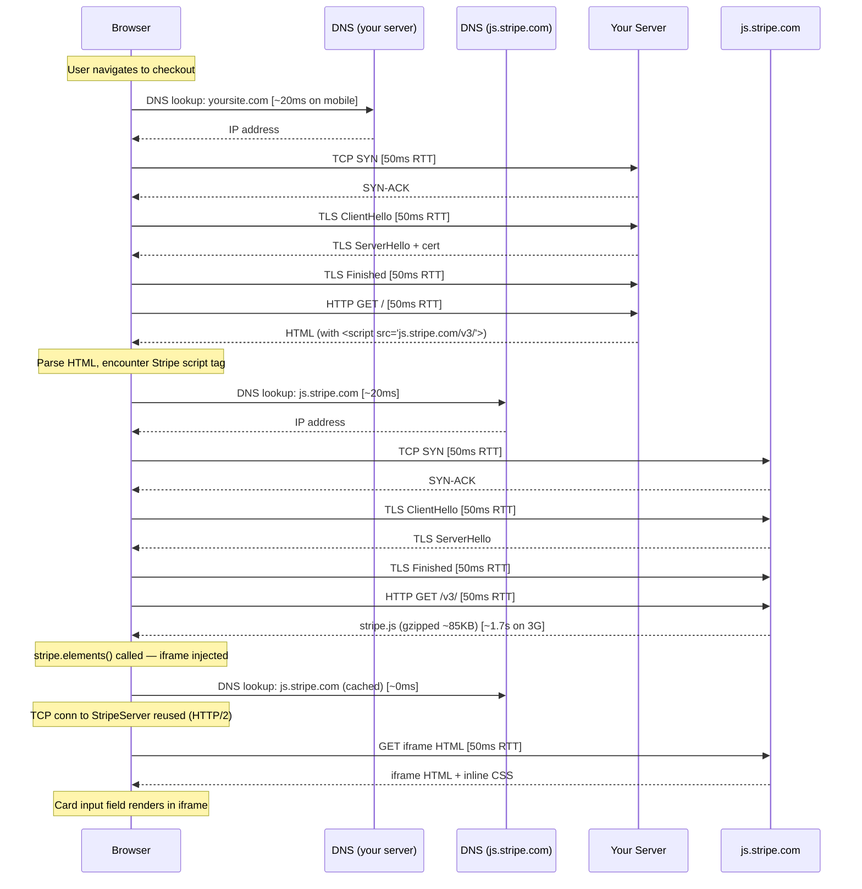

# 05 — Performance & Core Web Vitals

A checkout page's performance is directly coupled to revenue. Every 100ms of added latency costs measurable conversion — Google's data puts it at ~1% per 100ms for e-commerce. This section covers the specific performance challenges of a payments frontend: loading heavy third-party SDKs (Stripe.js, PayPal), managing iframe mount jank, optimizing the critical path to card entry, and building one-click experiences that feel instant. The recurring theme is that checkout has a uniquely strict performance budget because the user is mid-transaction and has high intent — you lose them to a slow page the moment friction exceeds their patience.

---

## Core Questions

### Q1. Stripe.js loading strategy — every page vs. checkout page only

**Problem framing:** Stripe.js is approximately 300KB of third-party JavaScript. Loading it on every page incurs a bandwidth and parse cost for users who never reach checkout. Loading it only on the checkout page means the user pays the full load cost at the worst possible moment — when they're about to pay. Stripe's documentation explicitly recommends loading on every page of the site. Understanding why — and when to deviate — is the question.

**Approach:**

Stripe recommends loading on every page primarily for **fraud detection and machine learning**. Stripe.js instruments browser signals (device fingerprinting, behavioral biometrics, timing patterns) from the moment it loads. By the time the user reaches checkout, Stripe has collected session-level signals that inform its fraud models. Loading only on checkout means Stripe sees only the last 30 seconds of a session — a cold signal.

Secondary benefit: **connection pre-warming**. Stripe.js initiates a connection to `js.stripe.com` and `q.stripe.com` (the telemetry endpoint) on first load. Subsequent navigations can reuse that connection or hit the browser cache.

```
// In your root layout or _app.tsx (Next.js example)
<script src="https://js.stripe.com/v3/" async></script>
```

Loading with `async` is critical — it prevents render-blocking. The script is also heavily cached by Stripe's CDN (long `Cache-Control` headers), so repeat page loads cost only a cache hit.

**Strategy comparison:**

| Approach | LCP impact | Fraud signal quality | Time-to-card-entry |
|---|---|---|---|
| Load on every page (`async`) | Minimal (async, cached) | High (full session) | Fast (already warm) |
| Load on checkout only (`async`) | Small (async) | Low (cold start) | ~300–500ms slower |
| Load on checkout only (`defer`) | None | Low | As above |
| Inline/bundle Stripe.js | Violates Stripe TOS | N/A | N/A |

You cannot bundle Stripe.js — Stripe's TOS prohibits it, and the SDK self-updates from Stripe's CDN to pick up security patches. If you must limit the every-page approach (strict performance budget), preconnect on all pages and load the script on the cart/product pages that precede checkout.

**Tradeoffs:**
- Every-page approach increases your main-thread parse work on non-checkout pages, but the script is async so it only competes during idle time.
- If your site has a very large non-checkout audience (e.g., a blog with an embedded store), the every-page approach wastes bandwidth for most users. The pragmatic compromise is to load on `product`, `cart`, and `checkout` pages but not on marketing/content pages.
- The fraud signal benefit is real but not measurable in your own RUM — Stripe internalizes it. Don't skip this optimization just because you can't A/B test it locally.

---

### Q2. Stripe Elements iframe and Cumulative Layout Shift (CLS)

**Problem framing:** CLS measures unexpected layout shifts — elements moving after the page renders. Stripe Elements mounts card input fields inside cross-origin iframes. When the iframe first renders, it may have no size, causing the surrounding layout to reflow as it settles to its final height. A poor CLS score (above 0.25) directly impacts both user experience and Google's SEO signals.

**Approach:**

The root cause of CLS from Elements is that the iframe's intrinsic height is unknown until mount. The browser has to wait for the iframe content to load and the SDK to call `resize` on the parent, which triggers a layout recalculation.

**Prevention techniques:**

1. **Reserve space with a fixed-height container before mount:**

```css
.card-element-container {
  min-height: 40px;   /* matches the default Elements height */
  width: 100%;
  /* Prevents collapse while iframe loads */
}
```

2. **Use skeleton/placeholder content:**

```jsx
function CardInput() {
  const [ready, setReady] = useState(false);

  return (
    <div className="card-element-container" style={{ minHeight: '40px' }}>
      {!ready && <CardSkeleton />}  {/* same height as Elements */}
      <CardElement
        onReady={() => setReady(true)}
        options={{ style: { base: { fontSize: '16px', lineHeight: '40px' } } }}
      />
    </div>
  );
}
```

3. **Use Elements' `onReady` callback to do a single swap** (not a reflow). The skeleton and the mounted element should occupy the same box — no layout shift, just a paint.

4. **Avoid `display: none` → `display: block` on the container.** Toggling display triggers a full layout. Instead toggle `visibility: hidden` → `visibility: visible`, which only triggers paint.

5. **For the `PaymentElement` (newer, multi-method):** Stripe's PaymentElement can have variable height depending on the selected payment method. Give it a `min-height` matching your tallest expected configuration and use `overflow: hidden` to prevent content below from jumping.

**CLS budget:** Core Web Vitals "Good" threshold is CLS < 0.1. A single unmounted Elements frame can easily push you past 0.25 without these guards.

**Tradeoffs:**
- Fixed `min-height` may look slightly off if Stripe changes its default element height in a future SDK update. Monitor the rendered iframe height in your E2E tests.
- Skeleton components add complexity; if your design team insists on exact brand-matching, negotiate a static placeholder (grey rectangle) over a fully designed skeleton.

---

### Q3. Bundle-splitting strategy for a checkout page

**Problem framing:** A checkout page has a complex dependency graph: form libraries, validation, Stripe React wrapper, address autocomplete, analytics, A/B testing SDKs. Loading everything upfront pushes Time to Interactive far past what the user needs to start filling in their name. The goal is to define what is critical-path and what can load after first interaction.

**Approach:**

**Critical path (inline or synchronously loaded):**
- HTML shell with form structure (SSR-rendered — zero client JS needed to display the form)
- CSS for above-the-fold layout (inlined in `<head>` — avoids render-blocking stylesheet request)
- Authentication state (resolved server-side via cookie — no client fetch required)
- React core + router hydration (~50–80KB gzipped)

**Deferred — load after `DOMContentLoaded` or after first paint:**
- Stripe.js (async script tag — should already be warm from previous pages)
- `@stripe/react-stripe-js` and `CardElement` wrapper (~20KB gzipped)
- Address autocomplete (dynamic import triggered when user focuses address field)
- PayPal button (dynamic import triggered when PayPal tab is selected)

**Lazy — load on user interaction:**
- Apple Pay / Google Pay detection and button render (triggered by payment method selection)
- Installment/BNPL options (triggered by cart value threshold crossing)
- Order history sidebar (triggered by "View past orders" click)

```javascript
// Next.js dynamic import pattern for address autocomplete
const AddressAutocomplete = dynamic(
  () => import('@/components/AddressAutocomplete'),
  {
    loading: () => <input placeholder="Start typing your address..." />,
    ssr: false,  // Only needed client-side
  }
);
```

**Inline in HTML (not a separate request):**
- Critical CSS (above-the-fold layout, form structure)
- Analytics initialization snippet (tiny, must fire before user interaction to avoid losing events)
- Feature flag values (injected via `__NEXT_DATA__` or equivalent — avoids a fetch)

**Tradeoffs:**
- Aggressive deferring of Stripe.js means if the user navigates directly to checkout (from an email link), they pay the full Stripe load cost. Mitigate with a `<link rel="preload">` on the cart page pointing to `https://js.stripe.com/v3/`.
- Dynamic importing the Stripe wrapper adds ~200ms of latency for the first user who reaches the card field. If your users commonly deep-link to checkout, consider eager-loading the wrapper and only lazy-loading the lower-priority SDKs.

---

### Q4. Third-party payment SDKs and TBT/INP

**Problem framing:** Total Blocking Time (TBT) measures how long the main thread is blocked (tasks > 50ms) between First Contentful Paint and Time to Interactive. Interaction to Next Paint (INP) measures the worst-case response latency for user interactions. Payment SDKs are large scripts that run complex initialization (fingerprinting, SDK bootstrapping, DOM injection) which can cause long tasks and directly harm both metrics.

**Approach:**

**Stripe.js:** Load with `async` — the script tag won't block the parser, and the SDK's initialization runs in the background. The actual Elements mount (`stripe.elements()`, `elements.create()`) runs synchronously on the main thread — keep this to after initial paint.

**PayPal button:** PayPal's SDK is particularly aggressive about blocking initialization. Use their `data-namespace` and `data-components` attributes to load only the button component, not the full SDK:

```html
<script
  src="https://www.paypal.com/sdk/js?client-id=xxx&components=buttons&currency=USD"
  async
  data-namespace="paypal_sdk"
></script>
```

Mount it lazily — only inject the script tag when the user selects PayPal as their payment method. This avoids running the SDK's long initialization task entirely for users who pay by card.

**Apple Pay / Google Pay:** Use the Payment Request API directly instead of the vendor SDKs for a lighter-weight integration:

```javascript
const pr = stripe.paymentRequest({
  country: 'US',
  currency: 'usd',
  total: { label: 'Order total', amount: cartTotal },
});

const canMakePayment = await pr.canMakePayment();
if (canMakePayment?.applePay || canMakePayment?.googlePay) {
  // Only now create and mount the PaymentRequestButton element
  mountWalletButton(pr);
}
```

`stripe.paymentRequest` wraps both Apple Pay and Google Pay through the W3C Payment Request API — single SDK, zero additional script load.

**Measuring impact:** Use Lighthouse with CPU 4x throttle and `--preset=mobile` to see TBT from your SDKs. Chrome DevTools Performance panel → "Main thread" shows individual long tasks. Look for tasks > 50ms labeled with SDK script names.

**Tradeoffs:**
- Lazy-loading the PayPal SDK means a ~400–600ms delay when the user first selects PayPal. Add a spinner on the payment method tab so the transition feels intentional, not broken.
- The Payment Request API for Apple Pay requires serving the page over HTTPS with an Apple-verified domain. Budget time for the domain verification step in your PSP's dashboard.

---

### Q5. Optimizing Time to Interactive (TTI) for checkout

**Problem framing:** A checkout page with the full requirement set — auth state check, cart data fetch, Stripe.js load, address form render — has four sequential or parallel blockers before the user can type a card number. TTI measures when the main thread is quiet enough for the page to reliably respond to user input. Each unoptimized dependency adds directly to TTI.

**Approach:**

**Make dependencies parallel, not sequential:**

```
// BEFORE (sequential): 1.8s total
Auth check (400ms) → Cart fetch (600ms) → Stripe.js load (600ms) → Elements mount (200ms) = 1.8s

// AFTER (parallel): 600ms total  
Auth check (400ms) ─────────────────────────────────┐
Cart fetch (600ms) ─────────────────────────────────┤→ Elements mount (200ms)
Stripe.js load (500ms, cached) ─────────────────────┘
```

Implementation with `Promise.all`:

```javascript
export async function getServerSideProps({ req }) {
  // Parallel server fetches
  const [session, cart] = await Promise.all([
    getSession(req),
    getCart(req.cookies.cartId),
  ]);
  
  return {
    props: {
      user: session?.user ?? null,
      cart,
      stripePublishableKey: process.env.NEXT_PUBLIC_STRIPE_KEY,
    }
  };
}
```

By handling auth and cart server-side, the client receives both in a single TTFB — eliminating two waterfall round trips.

**Stripe.js:** Already loaded on previous pages — should be a cache hit. If not, use `<link rel="preload">` on the cart page.

**Elements mount:** Call `stripe.elements()` and `elements.create()` as early as possible in the React lifecycle — ideally in a `useEffect` that runs immediately after the Stripe instance is ready, before the user scrolls to the card field.

**Address form:** Render the address form with SSR — it's pure HTML inputs, no JS required to display. The address autocomplete library can be a dynamic import triggered on first focus.

**Result sequence after optimization:**
1. TTFB: server returns HTML with cart + auth embedded (~100–200ms)
2. FCP: page paints (form visible, no JS interaction yet)
3. Stripe.js: cache hit, re-executed (~100–200ms of main thread parse)
4. Elements mount: card field ready (~200ms after Stripe init)
5. TTI: ~600ms after navigation (vs. 1.8s sequential)

**Tradeoffs:**
- Server-side cart fetch adds server latency. If your cart service is slow (> 400ms p95), consider serving a stale cart from a cache and refreshing client-side — accepting a brief stale price display over blocking the initial HTML.
- Parallel initialization means you waste Stripe init work on users who abandon at the shipping step. This is acceptable — the JS is cached and the initialization cost is low compared to the conversion improvement.

---

### Q6. Resource hints for a checkout page

**Problem framing:** Resource hints (`preconnect`, `dns-prefetch`, `prefetch`, `preload`) allow the browser to warm up connections or fetch resources before they're explicitly needed. On a checkout page with three distinct third-party origins (Stripe, Google Fonts, your image CDN), the wrong sequence of hints wastes the page's early network budget; the right sequence eliminates 200–400ms of waterfall latency.

**Approach:**

**`preconnect`** — perform DNS lookup + TCP handshake + TLS negotiation for origins you'll use immediately:

```html
<!-- Stripe: required for Stripe.js and the Elements iframe -->
<link rel="preconnect" href="https://js.stripe.com">
<link rel="preconnect" href="https://q.stripe.com">   <!-- telemetry -->
<link rel="preconnect" href="https://api.stripe.com"> <!-- confirmCardPayment -->

<!-- Google Fonts: two separate origins required by Google's serving architecture -->
<link rel="preconnect" href="https://fonts.googleapis.com">
<link rel="preconnect" href="https://fonts.gstatic.com" crossorigin>

<!-- Your image CDN: for product/hero images above the fold -->
<link rel="preconnect" href="https://images.yourcdn.com">
```

`crossorigin` is required for `fonts.gstatic.com` because fonts are fetched with CORS credentials.

**`preload`** — fetch a specific critical resource as early as possible:

```html
<!-- Stripe.js: preload if not already on page from earlier pages -->
<link rel="preload" href="https://js.stripe.com/v3/" as="script">

<!-- Critical CSS: if not inlined -->
<link rel="preload" href="/checkout.css" as="style">

<!-- LCP image (hero product image): preload with correct sizes -->
<link rel="preload" href="https://images.yourcdn.com/product.jpg" 
      as="image" 
      imagesrcset="product-400.jpg 400w, product-800.jpg 800w"
      imagesizes="(max-width: 600px) 100vw, 50vw">
```

**`dns-prefetch`** — lighter version of `preconnect` for origins you won't connect to for another few seconds (analytics, error monitoring):

```html
<link rel="dns-prefetch" href="https://sentry.io">
<link rel="dns-prefetch" href="https://amplitude.com">
```

**Priority order reasoning:**
1. `preconnect` for Stripe origins — card field cannot initialize without this
2. `preconnect` for Google Fonts (if fonts are embedded in Elements via Stripe's `fonts` config)
3. `preload` for LCP image — directly impacts LCP score
4. `dns-prefetch` for analytics — important but not on the critical rendering path

**Tradeoffs:**
- Do not `preconnect` to more than 6 origins — each preconnect holds an open socket for 10 seconds consuming memory and network resources. If you have more origins, use `dns-prefetch` for the lower-priority ones.
- `preload` with incorrect `as` attribute type causes double-fetching — the browser fetches for preload, then fetches again for the actual resource because it doesn't recognize the cached version. Always set `as` correctly.
- If Stripe.js is already loaded from a previous page visit (recommended strategy), the `preload` for it is wasteful. Guard it: only emit the `preload` hint on direct-to-checkout entry paths.

---

### Q7. SSR vs. SSG vs. CSR for a checkout page

**Problem framing:** The choice of rendering strategy fundamentally affects TTFB (when the browser receives HTML), FCP (when the user sees the form), and TTI (when the form is interactive). Checkout pages are unique — they require authenticated user state and real-time cart data, which limits static generation, but they also benefit from fast first paints to reduce abandonment.

**Approach:**

**Server-Side Rendering (SSR) — recommended for checkout:**

The checkout page requires per-user, per-session data: cart contents, auth state, pre-created PaymentIntent client secret. SSR resolves all of these server-side before the first byte is sent. The user receives a fully hydrated HTML page that renders the cart and form shell without any client-side data fetches.

TTFB: 100–300ms (server processing).
FCP: immediately after TTFB (HTML contains rendered content).
TTI: FCP + hydration time (~200–400ms for checkout bundle).

**Static Site Generation (SSG) — not suitable for checkout:**

SSG pre-renders at build time. Since cart and user data change per-request, SSG cannot be used for the checkout page itself. It can be used for adjacent pages (product listing, FAQ, marketing pages) that feed into checkout.

**Client-Side Rendering (CSR) — suboptimal for checkout:**

With CSR, the browser receives a near-empty HTML shell and must execute JS, fetch auth, fetch cart, and initialize Stripe before rendering the form. This creates a waterfall:

```
HTML shell (fast) → JS bundle download → Auth fetch → Cart fetch → Stripe init → Form render
```

FCP is early (blank shell with spinner), but TTI is 1–3 seconds later — users see a loading state for longer than with SSR.

**Hybrid: SSR shell + client-side enrichment:**

```jsx
// Server-rendered shell with pre-fetched data
export async function getServerSideProps({ req }) {
  const [session, cart, paymentIntent] = await Promise.all([
    getSession(req),
    getCart(req.cookies.cartId),
    stripe.paymentIntents.create({ amount: cartTotal, currency: 'usd' }),
  ]);

  return {
    props: {
      cart,
      clientSecret: paymentIntent.client_secret,
      user: session?.user ?? null,
    },
  };
}
```

This gives SSR's fast first paint while letting the client enhance dynamically (address autocomplete, live cart updates).

**Summary:**

| Strategy | TTFB | FCP | TTI | User data | Suitable |
|---|---|---|---|---|---|
| SSR | Medium | Fast | Fast | ✅ | ✅ Recommended |
| SSG | Instant | Instant | Fast | ❌ | ❌ Checkout |
| CSR | Fast | Medium | Slow | ✅ (delayed) | ⚠️ Avoid for checkout |
| SSR + CSR | Medium | Fast | Fast | ✅ | ✅ Best of both |

**Tradeoffs:**
- SSR increases server costs and adds latency risk if your data sources (cart service, Stripe) are slow. Set aggressive server-side timeouts and fall back to a client-side fetch if they exceed 1 second.
- SSR can create a "hydration mismatch" if the rendered HTML doesn't exactly match what React would render client-side (e.g., different locale data). Use `suppressHydrationWarning` carefully and test with SSR disabled.

---

## Deep Questions

### Q8. Systematic performance audit for LCP 4.2s on 3G mobile

**Problem framing:** A 4.2s LCP on 3G with a 15% higher bounce rate than competitors is a real revenue problem. LCP should be under 2.5s for "Good" classification. The challenge is diagnosing which specific asset (Stripe SDK, hero image, form render) is the bottleneck on 3G — these perform very differently than on fast connections because the bandwidth constraint moves the bottleneck from CPU to network.

**Approach:**

**Step 1 — Establish baseline with real 3G conditions:**

Use Chrome DevTools → Network throttling → "Slow 3G" (400 Kbps down, 400ms RTT) + CPU 4x slowdown. Run Lighthouse in this mode. The LCP element will be highlighted — this tells you what the bottleneck is.

Common suspects:
- Render-blocking Stripe.js (loaded without `async`)
- Unoptimized hero product image (no WebP, no `srcset`, no `loading="eager"` + `fetchpriority="high"`)
- Large above-the-fold CSS bundle

**Step 2 — Form hypotheses from Lighthouse audit:**

| LCP element | Root cause | Fix |
|---|---|---|
| Product image | No `fetchpriority="high"`, loaded via CSS `background-image` | Move to ``, add `fetchpriority="high"` |
| Hero text | Render-blocked by Stripe.js | Add `async` to Stripe script tag |
| Card input frame | Elements mount blocking FCP | Defer Elements init until after FCP |

**Step 3 — Stripe SDK optimizations for 3G:**

On 3G, 300KB at 400 Kbps takes ~6 seconds uncompressed. Stripe.js is served gzipped (~85KB) but still costs ~1.7 seconds on 3G. Mitigations:
- Ensure Stripe.js is loaded on the cart page (previous page) — by the time the user navigates to checkout, it's cached.
- Add `<link rel="preload" href="https://js.stripe.com/v3/" as="script">` on the cart page. This uses the cart page's idle bandwidth to pre-fetch the script.
- If Stripe.js loads on checkout for the first time: use `async` so it doesn't block the form HTML from rendering.

**Step 4 — Hero image optimizations:**

```html
<!-- BEFORE: LCP bottleneck -->
<div style="background-image: url('/hero.jpg')"></div>

<!-- AFTER: LCP optimized -->

```

WebP vs JPEG on 3G: typically 25–35% smaller file size, directly reducing download time.

**Step 5 — Above-the-fold form render:**

Inline critical CSS for the form skeleton. On 3G, an external CSS file costs a full round-trip (~400ms RTT × 2 for TCP + TLS). Inlining 5–10KB of critical CSS in `<head>` eliminates this bottleneck.

**Expected results after fixes:**
- Hero image: 4.2s LCP → ~2.1s (WebP + `fetchpriority` + preload)
- Stripe.js: no longer blocking LCP (async + cached)
- Critical CSS inlined: eliminates one round-trip

**Tradeoffs:**
- `fetchpriority="high"` on the image instructs the browser to deprioritize other resources — including Stripe.js. On 3G this is the right tradeoff (LCP is revenue-critical), but monitor TBT to ensure Stripe init isn't pushed too late.
- Inlining CSS increases HTML payload size and uncacheable bytes. Keep inlined CSS < 15KB and move the rest to a cached external stylesheet.

---

### Q9. Network connection sequence for Stripe Elements on mobile

**Problem framing:** Stripe Elements renders card input fields inside a cross-origin iframe hosted at `js.stripe.com`. This means the browser must establish a separate network connection to that origin — independent of the connection to your server. On a 50ms RTT mobile connection, every round-trip has a visible cost. Understanding the exact sequence reveals where you can optimize and what the irreducible minimum is.

**Approach:**



**Breakdown by phase:**

| Phase | Latency on 50ms RTT | Optimization opportunity |
|---|---|---|
| DNS for your server | ~20ms | DNS TTL tuning (minor) |
| TCP + TLS to your server | ~150ms (3 round trips) | Use TLS 1.3 (saves 1 RTT vs 1.2) |
| HTML fetch | ~50ms RTT | CDN edge termination (reduces RTT to 10ms) |
| DNS for js.stripe.com | ~20ms | `<link rel="dns-prefetch">` eliminates this |
| TCP + TLS to js.stripe.com | ~150ms | `<link rel="preconnect">` eliminates this |
| Stripe.js download | ~1.7s on 3G, ~100ms on 4G | Caching (loaded on prior pages) |
| iframe resource load | ~50ms RTT (HTTP/2 reuses conn) | Already optimal |

**Optimization opportunities:**
1. `<link rel="preconnect" href="https://js.stripe.com">` — eliminates DNS + TCP + TLS for Stripe (~190ms saved)
2. Load Stripe.js on previous pages — converts a 1.7s download to a cache hit
3. CDN edge termination for your server — reduces RTT from 50ms to 10–15ms for first request
4. TLS 1.3 — reduces your server's TLS handshake from 2 RTTs to 1 RTT
5. HTTP/2 — Stripe's CDN uses it; the iframe reuses the existing connection with no extra handshake

**Irreducible minimum latency floor:**

Even with all optimizations applied:
- Stripe.js must be fetched at least once per device (cache miss on first visit): ~1.7s on 3G
- iframe content requires at least 1 RTT after Stripe.js runs (the `stripe.elements()` call must execute first)
- On 50ms RTT after all optimizations: ~250ms for preconnected Stripe.js download (from CDN, cached) + 50ms for iframe request = ~300ms minimum floor before the card input is interactive

**Tradeoffs:**
- `preconnect` uses a real TCP connection that expires after 10 seconds unused. If the user spends more than 10 seconds on the page before the card field appears, you've wasted the preconnect. In practice this is rare on a checkout page.
- HTTP/2 multiplexing means the iframe HTML request doesn't block other requests, but the iframe's JavaScript parse happens on the renderer process, not the main thread — meaning it doesn't contribute to TBT.

---

### Q10. One-click checkout performance architecture (< 2 seconds)

**Problem framing:** A one-click checkout experience (Shop Pay, Amazon 1-Click) must complete a full purchase in under 2 seconds for a returning user. The challenge is that a standard checkout flow involves: loading the form, entering card details, calling `confirmCardPayment`, waiting for the server to confirm — each step taking 300ms–1s. The only way to hit < 2s is to pre-compute everything that can be pre-computed before the user clicks "Buy."

**Approach:**

**Phase 1 — Pre-fetch on product page (before user signals intent):**

As soon as the product page loads, prefetch assets and data that will be needed at checkout:
- Stripe.js: already loaded (every-page strategy)
- `savedPaymentMethod`: fetch the user's saved default payment method from `/api/user/payment-methods` and cache in memory
- Cart total: already known from product price
- Shipping estimate: pre-calculate for the user's saved address

**Phase 2 — Pre-create PaymentIntent on hover/tap (user signals intent):**

```javascript
// On product page — trigger when user hovers or touches "Buy Now"
async function onBuyNowHover() {
  if (paymentIntentCache) return; // Already pre-created

  // Pre-create PaymentIntent server-side
  const { clientSecret } = await fetch('/api/payment-intent/pre-create', {
    method: 'POST',
    body: JSON.stringify({ productId, quantity }),
  }).then(r => r.json());

  paymentIntentCache = clientSecret;
}
```

The `PaymentIntent` is created server-side (requires Stripe API call ~200ms). Doing this on hover gives you ~300–500ms of pre-computation before the click.

**Phase 3 — Critical rendering path on "Buy Now" click:**

```
User clicks "Buy Now" → Show confirmation modal (~0ms, already in DOM)
                     → stripe.confirmCardPayment(paymentIntentCache, { 
                           payment_method: savedPaymentMethodId 
                        })     (~300–500ms)
                     → Server confirms via webhook poll    (~200–500ms)
                     → Show success screen    (~50ms)
```

Total: ~550–1050ms — comfortably under 2 seconds.

**The confirmation modal:**
- Pre-render hidden in the DOM on product page load with the saved card last 4 digits, amount, and address
- On click: `display: block` — zero paint latency, user sees the confirmation instantly

**Critical implementation detail — `confirmCardPayment` without re-entering card details:**

For a saved payment method, pass `payment_method` directly (no CardElement needed):

```javascript
const { paymentIntent, error } = await stripe.confirmCardPayment(
  paymentIntentCache,
  { payment_method: user.savedPaymentMethodId }
);
```

No iframe needed, no user input — the call goes directly from Stripe.js to Stripe's API.

**Timeline breakdown for < 2s target:**

| Step | Duration | Optimization |
|---|---|---|
| PaymentIntent pre-created | 0ms (done on hover) | Pre-create on hover |
| Modal renders | 0ms | Pre-rendered in DOM |
| `confirmCardPayment` | 300–500ms | Saved PM — no challenge |
| Server webhook confirm poll | 200–500ms | First poll at 300ms |
| Success screen paint | 50ms | Pre-built component |
| **Total** | **550–1050ms** | **< 2s ✅** |

**Failure modes:**
- Saved payment method requires 3DS challenge — must show the challenge UI, adding 15–60s. Detect via `paymentIntent.status === 'requires_action'` and fall back to the full checkout flow.
- PaymentIntent pre-created but user doesn't click within 5 minutes — PaymentIntent expires or amount changes (discount expires). Catch `payment_intent_unexpected_state` error and create a new one.
- User's saved payment method was deleted since last session — `payment_method_not_found`. Fall back to full checkout.

**Tradeoffs:**
- Pre-creating PaymentIntents on hover increases your Stripe API call volume — each hover (including mis-hovers) costs a Stripe API request. Rate-limit with a 200ms hover debounce and cancel the request if the user exits within the debounce window.
- This architecture assumes a saved payment method exists. For new users, you cannot hit < 2s on the first purchase — the form entry and Stripe.js boot are irreducible. One-click checkout is a retention feature, not an acquisition feature.
- The pre-rendered confirmation modal is shown before the PaymentIntent confirms. If `confirmCardPayment` fails (card declined), you must animate the modal to an error state — design for this upfront.
