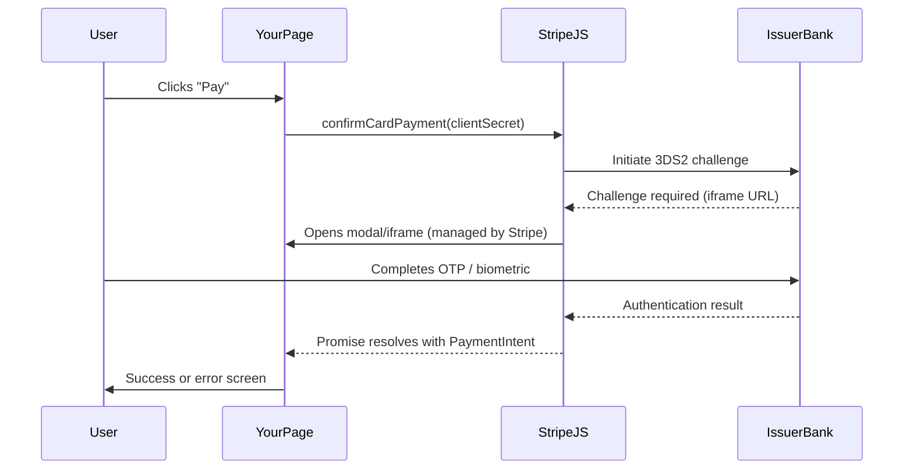
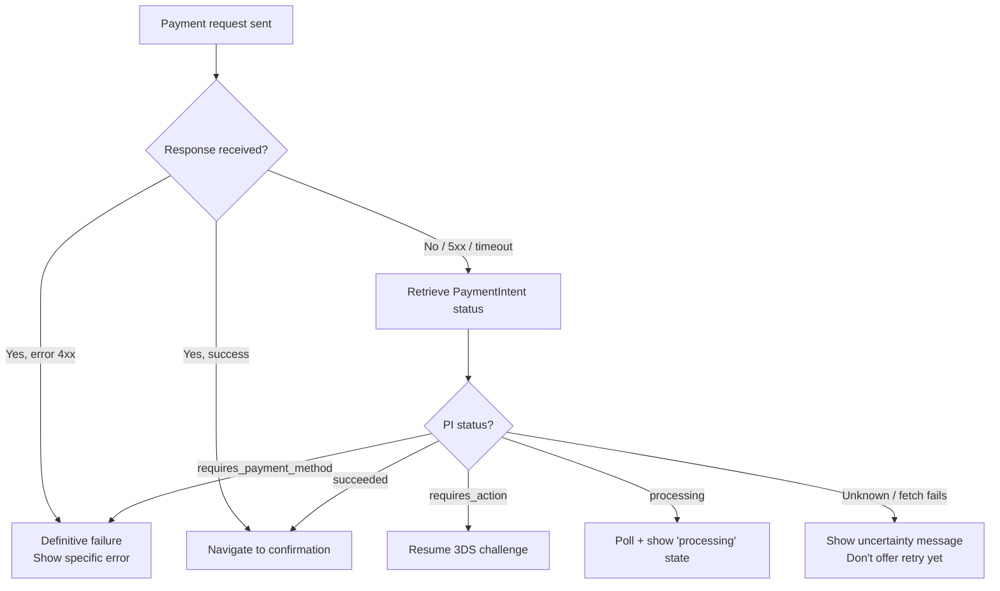
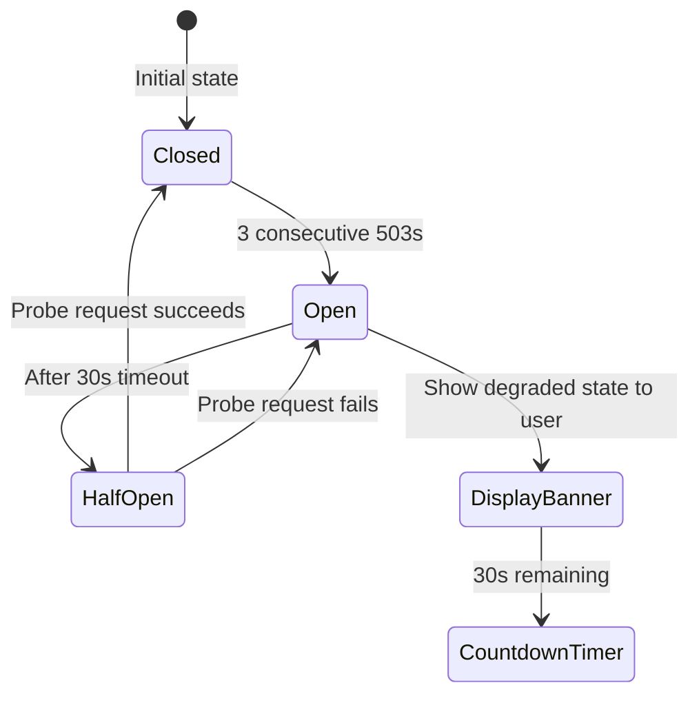
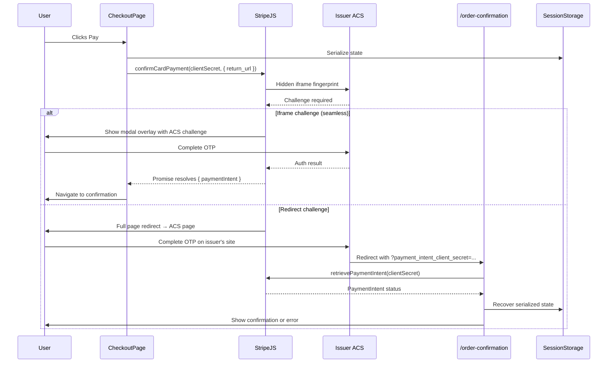
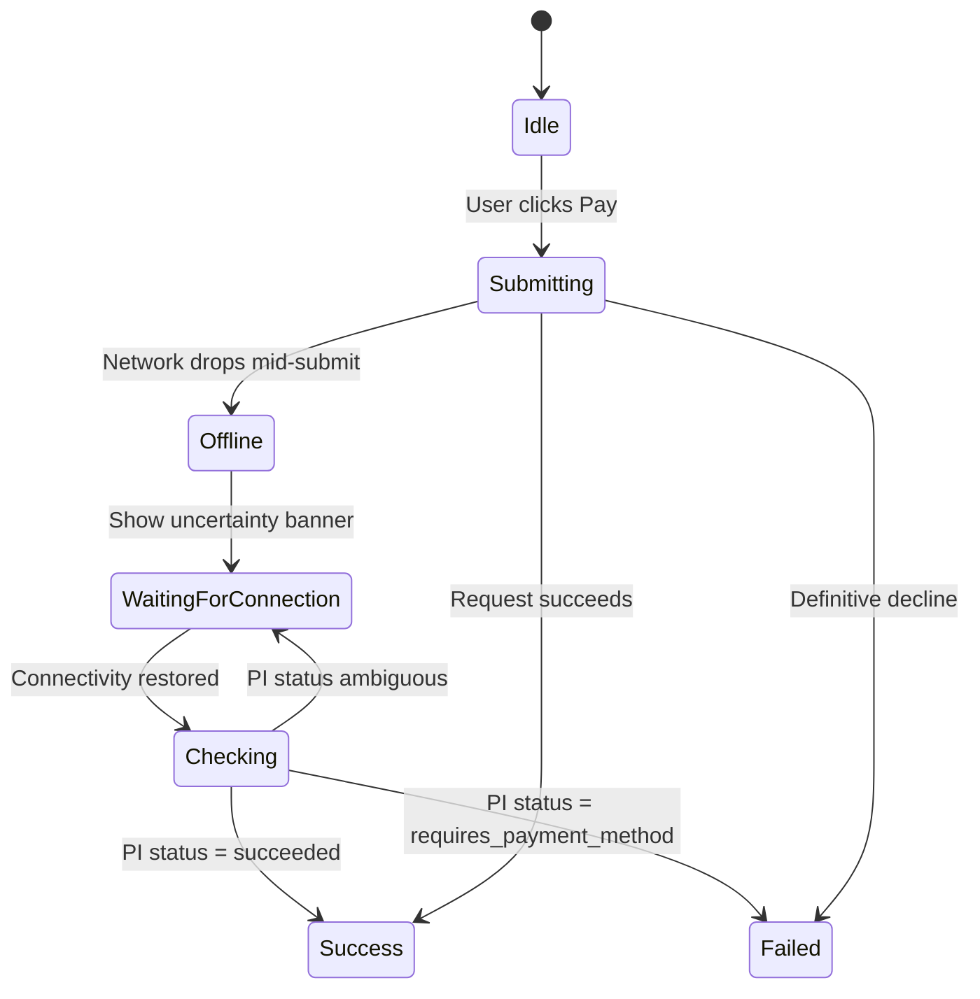

# 06 — Error Handling & Resilience

> Payments errors are high-stakes and high-frequency. These answers cover error taxonomy, Stripe-specific decline handling, 3DS authentication, network resilience, and offline-first patterns.

---

## Core Questions

### Q: Enumerate the categories of errors that can occur in a frontend payment flow (network errors, card declines, validation errors, authentication failures, fraud blocks, rate limits) and describe how the error handling strategy differs for each category.

**Problem framing:** The interviewer is testing whether you treat "payment failed" as a monolith or whether you have a nuanced mental model. Each error category has different recoverability, different disclosure obligations, and different UX affordances. Blurring them leads to confusing copy, frustrated users, and missed recovery opportunities.

**Approach:**

There are six distinct error categories, each demanding a different response:

| Category | Source | Recoverability | User action |
|---|---|---|---|
| Validation errors | Client-side / Stripe.js | Immediate | Correct field |
| Network errors | Transport layer | Ambiguous | Retry or wait |
| Card declines | Issuer bank | Varies by code | New card / contact bank |
| Authentication failures | 3DS / auth layer | Often recoverable | Complete challenge |
| Fraud blocks | Stripe Radar / issuer | Usually not | Call bank |
| Rate limits | Your API / Stripe | Temporary | Wait + retry |

**1. Validation errors** — caught by Stripe Elements `onChange` events before any network call. Show inline field-level errors immediately; never surface these as a toast or modal. The form is the context.

```typescript
// Stripe Elements onChange handler
elements.getElement('card')?.on('change', (event) => {
  if (event.error) {
    setFieldError(event.error.message); // inline, beneath the field
  } else {
    setFieldError(null);
  }
});
```

**2. Network errors** — the ambiguous category. The request may have reached the server (charge may have fired) or may not have. Strategy: never show "payment failed" — show "we couldn't confirm your payment." Provide a status-check path (order history, email confirmation). Log the full request context for idempotency key recovery.

**3. Card declines** — issuer-side rejections returned synchronously by Stripe. The `PaymentIntent` returns to `requires_payment_method` status. Strategy: be specific where safe (insufficient funds → "check your balance"), be vague where security demands it (stolen card → generic decline message). Never retry automatically.

**4. Authentication failures** — 3DS challenge was shown but failed or was cancelled. The `PaymentIntent` enters `requires_action` or stays in `requires_payment_method`. Strategy: offer to retry the authentication challenge; the card itself isn't necessarily bad.

**5. Fraud blocks** — Stripe Radar rules or issuer fraud systems block the charge. Decline code `do_not_honor` or `transaction_not_allowed`. Strategy: generic messaging ("your bank declined this transaction"). Do not tell the user *why*; fraud systems are gamed if you're too specific. Log aggressively server-side.

**6. Rate limits** — HTTP 429 from your backend or Stripe. Strategy: exponential backoff with jitter, surface a non-alarming "we're busy, trying again" message, implement the circuit breaker (Q6) to stop hammering.

```typescript
type ErrorCategory =
  | 'validation'
  | 'network'
  | 'card_decline'
  | 'authentication'
  | 'fraud'
  | 'rate_limit';

function classifyStripeError(error: Stripe.StripeError): ErrorCategory {
  if (error.type === 'validation_error') return 'validation';
  if (error.type === 'card_error') {
    const fraudCodes = ['do_not_honor', 'stolen_card', 'pickup_card', 'lost_card', 'restricted_card'];
    return fraudCodes.includes(error.decline_code ?? '') ? 'fraud' : 'card_decline';
  }
  if (error.code === 'authentication_required') return 'authentication';
  if (error.type === 'api_connection_error') return 'network';
  if (error.status === 429) return 'rate_limit';
  return 'network'; // fail safe
}
```

**Tradeoffs:**

- **Alternative: single generic error message** — simpler to build, but converts poorly. Users with fixable issues (insufficient funds, wrong billing address) abandon instead of correcting.
- **Alternative: exposing raw Stripe error messages** — Stripe's messages are terse and technical; they're designed for developers, not cardholders. Pass them through a copy layer.
- **Not discussed here but critical**: server-side logging must capture the full Stripe error object (including `charge` ID) before the frontend ever sees the error, because the frontend's error context is lossy.

---

### Q: A user's card is declined with Stripe error code `card_declined` and decline code `insufficient_funds`. What do you show the user? What do you show the user if the decline code is `stolen_card`? How does your error message component know which codes warrant specific messaging vs. a generic "payment failed" message?

**Problem framing:** This question tests security awareness alongside UX judgment. Oversharing decline reasons enables card testing attacks (attackers probe which cards are "almost valid"). Under-sharing frustrates legitimate users with fixable problems.

**Approach:**

Maintain an explicit allowlist of decline codes that get specific messaging. Everything else falls through to a safe generic.

```typescript
// decline-messages.ts
const SPECIFIC_DECLINE_MESSAGES: Record<string, string> = {
  insufficient_funds:
    'Your card has insufficient funds. Please use a different card or contact your bank.',
  expired_card:
    'Your card has expired. Please update your card details or use a different card.',
  incorrect_cvc:
    'The security code (CVC) you entered is incorrect. Please check and try again.',
  incorrect_zip:
    'The billing zip code doesn\'t match your card records. Please verify and retry.',
  card_velocity_exceeded:
    'Too many payment attempts. Please wait a few minutes before trying again.',
  currency_not_supported:
    'This card doesn\'t support payments in this currency. Please use a different card.',
};

// Codes that get ONLY generic messaging — never expose these
const SILENT_DECLINE_CODES = new Set([
  'stolen_card',
  'lost_card',
  'pickup_card',
  'fraudulent',
  'do_not_honor',
  'transaction_not_allowed',
  'restricted_card',
  'security_violation',
]);

const GENERIC_DECLINE_MESSAGE =
  'Your payment was declined. Please contact your bank or use a different payment method.';

export function getDeclineMessage(declineCode: string | undefined): string {
  if (!declineCode) return GENERIC_DECLINE_MESSAGE;
  if (SILENT_DECLINE_CODES.has(declineCode)) return GENERIC_DECLINE_MESSAGE;
  return SPECIFIC_DECLINE_MESSAGES[declineCode] ?? GENERIC_DECLINE_MESSAGE;
}
```

For `insufficient_funds`: show the specific message above. The user can take a clear action — top up or switch cards.

For `stolen_card`: show the **exact same generic message** as any unknown decline. Do not hint that the card is flagged. Why? Three reasons:
1. If a fraudster is testing a stolen card, you've just confirmed the card number is valid but flagged.
2. If a legitimate user's card was incorrectly flagged, they need to call their bank anyway — the message is the same.
3. Legal/compliance teams often require this.

Server-side, log the full decline code with the user ID, attempt count, and IP for fraud review. The frontend's copy layer is the only place you scrub this.

**Component architecture:**

```tsx
// PaymentErrorAlert.tsx
interface PaymentErrorAlertProps {
  stripeError: Stripe.StripeError | null;
}

export function PaymentErrorAlert({ stripeError }: PaymentErrorAlertProps) {
  if (!stripeError) return null;

  const isCardDecline = stripeError.type === 'card_error';
  const message = isCardDecline
    ? getDeclineMessage(stripeError.decline_code)
    : 'Something went wrong processing your payment. Please try again.';

  // Always offer a path forward
  const showContactSupport = stripeError.decline_code
    ? SILENT_DECLINE_CODES.has(stripeError.decline_code)
    : false;

  return (
    <Alert role="alert" aria-live="assertive" variant="error">
      <p>{message}</p>
      {showContactSupport && (
        <a href="/support">Contact support if this persists</a>
      )}
    </Alert>
  );
}
```

**Tradeoffs:**

- **Alternative: pass Stripe's raw `error.message` to the user** — Stripe's messages for `stolen_card` are "Your card was declined." — accidentally safe in this case, but not consistently safe across all codes, and not localization-friendly.
- **Alternative: look up decline code at runtime from an API** — adds a round-trip to show an error message, creating a loading state inside an error state — poor UX.
- **The allowlist approach** is the safest default: you consciously decide what to reveal rather than consciously deciding what to hide.

---

### Q: What is 3D Secure (3DS) authentication, when is it triggered, and how does `stripe.confirmCardPayment()` handle the 3DS challenge flow? What does the user experience look like, and what are the failure modes (user cancels, 3DS times out, bank's 3DS page is down)?

**Problem framing:** 3DS is the most complex UX branch in a card payment flow. Interviewers want to see that you understand the full state machine — not just the happy path — and that you've thought about failure modes that are genuinely outside your control.

**Approach:**

**What is 3DS?** 3D Secure is an authentication protocol (EMV 3DS2 is the current version) where the card issuer challenges the cardholder to prove identity — via a one-time code, biometric, or push notification to their banking app. It shifts fraud liability from merchant to issuer when completed successfully.

**When is it triggered?**
- The issuer's risk engine flags the transaction (high amount, new device, unusual location)
- The merchant explicitly requests it (`request_three_d_secure: 'any'` on the PaymentIntent)
- EU regulatory requirement (PSD2 Strong Customer Authentication for European cards)
- Stripe Radar rules requiring it

**How `confirmCardPayment()` handles 3DS:**

```typescript
const { paymentIntent, error } = await stripe.confirmCardPayment(clientSecret, {
  payment_method: {
    card: cardElement,
    billing_details: { name: 'Jane Doe' },
  },
});

// Stripe.js handles the 3DS redirect/iframe internally
// This promise only resolves after the full challenge is complete
if (error) {
  // 3DS failed, cancelled, or timed out — error.code === 'payment_intent_authentication_failure'
} else if (paymentIntent.status === 'succeeded') {
  // Fully authenticated and charged
}
```

The key insight: **`confirmCardPayment()` is a long-running promise.** Stripe.js orchestrates the entire challenge flow — opening an iframe or redirect, waiting for the user to complete authentication, receiving the result — before the promise resolves. Your UI just needs to show a loading/waiting state during this time.

**User experience flow:**



Your page shows a "Verifying with your bank…" loading state while the modal is open. Stripe renders the bank's 3DS challenge UI inside its own iframe overlay — you don't control this UI.

**Failure modes:**

| Failure | What Stripe returns | Your response |
|---|---|---|
| User cancels challenge | `error.code: 'payment_intent_authentication_failure'` | Offer to retry or use different card |
| 3DS times out (issuer slow) | Same error code | Same — offer retry |
| Bank's 3DS page is down | Same error code | Same — but also offer alternative payment methods |
| User closes browser mid-challenge | PaymentIntent stays `requires_action` | On next page load, check PI status and resume |

For the "user closes browser" case, you must poll or webhook-receive the PaymentIntent status on return:

```typescript
// On checkout page mount, resume an in-progress payment
useEffect(() => {
  const pendingClientSecret = sessionStorage.getItem('pending_client_secret');
  if (pendingClientSecret) {
    stripe.retrievePaymentIntent(pendingClientSecret).then(({ paymentIntent }) => {
      if (paymentIntent?.status === 'requires_action') {
        // Resume the 3DS challenge
        stripe.confirmCardPayment(pendingClientSecret);
      }
    });
  }
}, []);
```

**Tradeoffs:**

- **Alternative: redirect-based 3DS** (return_url approach) — simpler to implement, no iframe state management, but causes a full page navigation which loses React state. Must serialize form state to server or sessionStorage before redirect.
- **Alternative: `confirmCardPayment` with `return_url` only** — some banks fall back to redirect even with the iframe flow; you must always handle both paths regardless.

---

### Q: How do you distinguish between a network timeout (where the payment may or may not have processed) and a definitive payment failure (where you know the charge was rejected)? How does each case change your frontend error recovery strategy?

**Problem framing:** This is the most dangerous error category in payments. Showing "payment failed" when the charge actually succeeded causes duplicate charges (user retries). Showing "payment succeeded" when it failed causes unfulfilled orders. The interviewer wants to see that you understand the ambiguity and have a concrete resolution strategy.

**Approach:**

The key is the **idempotency key** and **PaymentIntent status**.

**Definitive failure** (synchronous rejection): Stripe returns an error response with HTTP 402 and `type: 'card_error'`. The charge was attempted and rejected. You **know** the money didn't move. Safe to show "payment failed" and prompt retry.

**Network timeout / ambiguous failure**: The request never got a response (fetch promise rejected with `TypeError: Failed to fetch`, or a 504 gateway timeout). You don't know if Stripe received the request.

**Resolution strategy:**

Before any payment attempt, store the idempotency key:

```typescript
// Generate once, persist before the request
const idempotencyKey = `pay_${userId}_${orderId}_${Date.now()}`;
sessionStorage.setItem('payment_idempotency_key', idempotencyKey);
sessionStorage.setItem('pending_payment_intent_id', paymentIntentId);
```

On network error, do NOT show "payment failed." Instead:

```typescript
async function handlePaymentError(error: unknown) {
  if (isNetworkError(error)) {
    // Ambiguous — check PaymentIntent status directly
    const piId = sessionStorage.getItem('pending_payment_intent_id');
    if (piId) {
      const { paymentIntent } = await stripe.retrievePaymentIntent(clientSecret);
      if (paymentIntent?.status === 'succeeded') {
        // Charge went through! Navigate to success.
        router.push('/order-confirmation');
        return;
      }
      if (paymentIntent?.status === 'requires_payment_method') {
        // Definitive failure after all — safe to retry
        setError('Payment failed. Please try again.');
        return;
      }
    }
    // Can't determine status — show uncertainty message
    setError(
      'We couldn\'t confirm your payment. Please check your email for a confirmation, ' +
      'or visit your order history before trying again.'
    );
    return;
  }
  // Definitive failure
  setError(getDeclineMessage((error as Stripe.StripeError).decline_code));
}

function isNetworkError(error: unknown): boolean {
  if (error instanceof TypeError && error.message === 'Failed to fetch') return true;
  if ((error as any)?.status >= 500) return true;
  if ((error as any)?.status === 504) return true;
  return false;
}
```

The `retrievePaymentIntent` call uses the `client_secret` which is already in your app state — it doesn't require another server call. It queries Stripe directly via Stripe.js.

**Flow diagram:**



**Tradeoffs:**

- **Alternative: always retry on network error** — causes duplicate charges if the first attempt went through. Catastrophic for perceived reliability and customer trust.
- **Alternative: server-side idempotency check via your own API** — more robust than relying on `retrievePaymentIntent`, because it can also check your DB for the order record. The downside is you need a working server connection — which you may not have if it's a network partition. Use both: try Stripe directly first, fall back to your server.

---

### Q: Describe your strategy for handling the case where Stripe.js itself fails to load (CDN outage, network error, ad blocker). Do you have a fallback, or do you fail gracefully? What does the user see, and what do you log?

**Problem framing:** Stripe.js is a cross-origin script that must be loaded from `js.stripe.com` — you cannot self-host it (PCI requirement). This makes it uniquely vulnerable to CDN outages, aggressive ad blockers (uBlock Origin blocks Stripe.js by default in some configurations), and corporate proxies. Handling this gracefully is often overlooked.

**Approach:**

**Detection:** Load Stripe.js asynchronously and detect failure explicitly:

```typescript
// stripe-loader.ts
let stripeLoadPromise: Promise<Stripe | null> | null = null;

export function loadStripeWithTimeout(publishableKey: string): Promise<Stripe | null> {
  if (stripeLoadPromise) return stripeLoadPromise;

  stripeLoadPromise = Promise.race([
    loadStripe(publishableKey), // from @stripe/stripe-js
    new Promise<null>((resolve) =>
      setTimeout(() => resolve(null), 5000) // 5s timeout
    ),
  ]).catch(() => null); // loadStripe rejects on network error

  return stripeLoadPromise;
}
```

```tsx
// CheckoutPage.tsx
function CheckoutPage() {
  const [stripeLoadState, setStripeLoadState] = useState<
    'loading' | 'ready' | 'failed'
  >('loading');
  const stripeRef = useRef<Stripe | null>(null);

  useEffect(() => {
    loadStripeWithTimeout(STRIPE_PUBLISHABLE_KEY).then((stripe) => {
      if (stripe) {
        stripeRef.current = stripe;
        setStripeLoadState('ready');
      } else {
        setStripeLoadState('failed');
        logger.error('stripe_js_load_failed', {
          // Diagnose the cause
          isAdBlockerSuspected: !navigator.onLine ? false : true,
          userAgent: navigator.userAgent,
          timestamp: Date.now(),
        });
      }
    });
  }, []);

  if (stripeLoadState === 'failed') {
    return <StripeLoadFailureFallback />;
  }
  // ...
}
```

**Fallback UI — StripeLoadFailureFallback:**

```tsx
function StripeLoadFailureFallback() {
  return (
    <div role="alert">
      <h2>Secure payment form unavailable</h2>
      <p>
        We couldn't load our payment processor. This can happen if a browser
        extension is blocking payment scripts.
      </p>
      <ul>
        <li>Try disabling your ad blocker for this page</li>
        <li>Or pay via{' '}
          <a href="/checkout/paypal">PayPal</a> or{' '}
          <a href="/checkout/bank-transfer">bank transfer</a>
        </li>
      </ul>
      <p>
        If the problem persists, <a href="/support">contact support</a>.
      </p>
    </div>
  );
}
```

**What you log:**
- `stripe_js_load_failed` event with: timestamp, navigator.onLine, connection type (if available via `navigator.connection`), userAgent, page URL
- Do NOT try to infer "ad blocker vs CDN outage" definitively on the client — log the signals and let your analytics team correlate with Stripe status page events

**What you never do:**
- Self-host Stripe.js (PCI DSS violation — Stripe explicitly prohibits it)
- Proceed to show a raw `<input type="text">` for card numbers as a "fallback" (PCI DSS violation)
- Show a blank page or an unhandled `stripe is not defined` exception

**Tradeoffs:**

- **Alternative: subresource integrity (SRI) hash on the Stripe.js `<script>` tag** — cannot do this because Stripe updates the script continuously without version pinning, so any hash would immediately invalidate.
- **Alternative: loading Stripe.js earlier (in `_document.tsx` / `<head>`)** — reduces the failure window (script starts loading before React hydrates) but doesn't eliminate it. Still need the detection and fallback.
- **Alternative: no fallback, just block checkout** — if you have no alternative payment methods, this may be unavoidable. But you should still surface a clear explanation rather than a broken UI.

---

### Q: How do you implement a circuit breaker pattern on the frontend for payment requests? If your payment API endpoint is returning 503s, how do you detect this condition and prevent the user from hammering a degraded backend?

**Problem framing:** The circuit breaker pattern is typically discussed in backend/microservices contexts. The interviewer is testing whether you can apply it thoughtfully to the frontend, where "requests" are user-initiated and there's no service mesh. This matters because a degraded payment API that receives 10x normal traffic from retrying users will take longer to recover.

**Approach:**

Implement a client-side circuit breaker as a singleton that tracks consecutive failures and opens/half-opens on a timer:

```typescript
// circuit-breaker.ts
type CircuitState = 'closed' | 'open' | 'half-open';

interface CircuitBreakerConfig {
  failureThreshold: number;   // failures before opening
  successThreshold: number;   // successes to close from half-open
  timeout: number;            // ms to wait before half-open
}

class CircuitBreaker {
  private state: CircuitState = 'closed';
  private failureCount = 0;
  private successCount = 0;
  private lastFailureTime = 0;
  private config: CircuitBreakerConfig;

  constructor(config: CircuitBreakerConfig) {
    this.config = config;
  }

  isOpen(): boolean {
    if (this.state === 'open') {
      const elapsed = Date.now() - this.lastFailureTime;
      if (elapsed > this.config.timeout) {
        this.state = 'half-open';
        this.successCount = 0;
        return false; // Allow one probe request through
      }
      return true;
    }
    return false;
  }

  recordSuccess(): void {
    this.failureCount = 0;
    if (this.state === 'half-open') {
      this.successCount++;
      if (this.successCount >= this.config.successThreshold) {
        this.state = 'closed';
      }
    }
  }

  recordFailure(): void {
    this.lastFailureTime = Date.now();
    this.failureCount++;
    if (this.failureCount >= this.config.failureThreshold) {
      this.state = 'open';
    }
  }

  getState(): CircuitState {
    return this.state;
  }
}

export const paymentCircuitBreaker = new CircuitBreaker({
  failureThreshold: 3,   // 3 consecutive 503s → open
  successThreshold: 1,   // 1 success → close from half-open
  timeout: 30_000,       // 30s before probing again
});
```

Integration in the payment submission hook:

```typescript
async function submitPayment(payload: PaymentPayload) {
  if (paymentCircuitBreaker.isOpen()) {
    // Don't even attempt the request
    setError(
      'Our payment service is temporarily unavailable. ' +
      'Please try again in a few minutes.'
    );
    // Disable the submit button, show estimated recovery time
    setCircuitOpen(true);
    return;
  }

  try {
    const result = await createPaymentIntent(payload);
    paymentCircuitBreaker.recordSuccess();
    return result;
  } catch (error) {
    if (isServiceUnavailable(error)) { // 503, 502, 504
      paymentCircuitBreaker.recordFailure();
      logger.warn('payment_api_degraded', {
        state: paymentCircuitBreaker.getState(),
        failureCount: /* ... */,
      });
    }
    throw error;
  }
}
```

**UX when circuit is open:**



Show a non-alarming banner: *"Payment processing is experiencing delays. We'll try again automatically — your card hasn't been charged."*

Persist circuit state to `sessionStorage` so a page refresh doesn't reset it (a refreshing user isn't new demand, it's the same user retrying):

```typescript
// Hydrate from sessionStorage on init
const persisted = sessionStorage.getItem('circuit_state');
if (persisted) {
  const { state, lastFailureTime } = JSON.parse(persisted);
  // Restore state
}
```

**Tradeoffs:**

- **Alternative: server-sent circuit breaker signal** — your API returns a `Retry-After` header on 503, and the frontend respects it. More accurate than client-side counting, but requires backend coordination and doesn't handle the case where the API is unreachable at all.
- **Alternative: exponential backoff without a circuit breaker** — backoff reduces retry frequency but doesn't stop determined users from clicking "Pay" repeatedly. The circuit breaker's open state disables the button entirely.
- **Threshold tuning**: 3 failures / 30s is conservative for a low-volume checkout. High-volume checkouts might need 10 failures / 10s to avoid false positives on transient spikes.

---

### Q: What is the UX strategy for a payment that fails at the very last step — after the user has entered all their details and clicked "Pay" — but due to a server-side error rather than a card decline? How do you preserve their form state and communicate the error without inducing panic?

**Problem framing:** This is an empathy + engineering question. The user has completed the highest-friction step of your product. A bad error state causes abandonment. The interviewer wants to see that you distinguish server errors from card errors in both copy and in form state management.

**Approach:**

**Preserve form state absolutely.** Stripe Elements card fields are controlled by Stripe's iframe — you cannot read or restore their values. But you CAN:
1. Keep the `PaymentElement` or `CardElement` mounted (don't unmount on error)
2. Preserve all non-sensitive fields (name, billing address, email) in React state
3. Keep the `clientSecret` valid — a server error doesn't invalidate the PaymentIntent

```tsx
function CheckoutForm() {
  const [submitState, setSubmitState] = useState<
    'idle' | 'loading' | 'server_error' | 'card_error' | 'success'
  >('idle');
  const [serverError, setServerError] = useState<string | null>(null);

  // Form state preserved across errors
  const [billingName, setBillingName] = useState('');
  const [email, setEmail] = useState('');

  async function handleSubmit(e: React.FormEvent) {
    e.preventDefault();
    setSubmitState('loading');
    setServerError(null);

    try {
      const { error } = await stripe.confirmPayment({ elements, confirmParams: {
        return_url: `${window.location.origin}/order-confirmation`,
        payment_method_data: {
          billing_details: { name: billingName, email },
        },
      }});

      if (error?.type === 'card_error' || error?.type === 'validation_error') {
        setSubmitState('card_error');
        // Card element stays mounted with its current state
      } else if (error) {
        // Server-side or unexpected error
        setSubmitState('server_error');
        setServerError(
          'Something went wrong on our end. Your card has not been charged. ' +
          'Please try again — your payment details are still saved.'
        );
        logger.error('payment_server_error', {
          errorType: error.type,
          errorCode: error.code,
          paymentIntentId: clientSecret.split('_secret')[0],
        });
      }
    } catch (networkError) {
      setSubmitState('server_error');
      setServerError(
        'We lost connection while processing. Please check your internet and try again.'
      );
    }
  }

  return (
    <form onSubmit={handleSubmit}>
      {/* Form fields preserved across errors */}
      <NameField value={billingName} onChange={setBillingName} />
      <EmailField value={email} onChange={setEmail} />

      {/* Stripe Elements STAY MOUNTED — don't conditionally render */}
      <PaymentElement />

      {submitState === 'server_error' && (
        <Alert variant="warning" role="alert" aria-live="assertive">
          <strong>Payment not completed</strong>
          <p>{serverError}</p>
          <p>Your card has not been charged.</p>
        </Alert>
      )}

      <Button
        type="submit"
        disabled={submitState === 'loading'}
        aria-busy={submitState === 'loading'}
      >
        {submitState === 'loading' ? 'Processing…' : 'Pay now'}
      </Button>
    </form>
  );
}
```

**Critical UX details:**

1. **"Your card has not been charged"** — say this explicitly for server errors. Users' #1 fear is being charged and getting nothing.
2. **Don't reset the form** — the user shouldn't have to re-enter their name, address, or email.
3. **Don't show a modal or navigate away** — the error is in the context of the form; keep them there.
4. **Aria live region** — screen reader users need the error announced immediately.
5. **Re-enable the submit button** — they should be able to try again without refreshing.
6. **Log the `paymentIntentId`** — your support team will need it to investigate.

**Tradeoffs:**

- **Alternative: redirect to an error page** — loses all form state, requires the user to start over. Only appropriate for truly unrecoverable states (e.g., session expired).
- **Alternative: auto-retry on server error** — increases charge risk if the first request actually processed. Don't auto-retry payment requests; only the user should initiate a retry.
- **Alternative: toast notification** — toasts dismiss themselves. Payment errors must persist until the user acknowledges them.

---

## Deep Questions

### Q: Walk me through the full 3DS2 authentication flow from a frontend architecture standpoint. Specifically: how does Stripe.js detect that 3DS is required after `confirmCardPayment`, how is the challenge rendered (in an iframe? a redirect? a modal?), how do you handle the case where the device fingerprinting step triggers a full redirect rather than a seamless iframe challenge, and what happens to your React component state across that redirect boundary?

**Problem framing:** This question is separating engineers who've read the Stripe docs from engineers who've debugged 3DS in production. The redirect boundary is where most implementations break. The interviewer wants a complete architecture answer, not a happy-path walkthrough.

**Approach:**

**Phase 1: Device Fingerprinting (Frictionless Flow)**

Before the cardholder challenge, 3DS2 runs a silent device fingerprinting step. Stripe.js embeds a hidden iframe pointing to the issuer's ACS (Access Control Server). The ACS collects browser data (screen size, timezone, plugins) and makes a risk decision:

- **Frictionless**: risk is low enough, no challenge needed → `PaymentIntent.status = 'succeeded'`
- **Challenge required**: risk too high → proceed to Phase 2

This fingerprinting happens automatically inside `stripe.confirmCardPayment()` before the promise resolves or the challenge UI appears.

**Phase 2: Challenge Rendering**

3DS2 supports two challenge modes:

**Mode A: Iframe challenge (seamless)** — Stripe.js renders its own modal overlay containing the issuer's challenge UI in an iframe. The promise stays pending. Your page shows a loading state. This is the common case on desktop and modern mobile browsers.

**Mode B: Full redirect challenge** — The issuer's ACS doesn't support the iframe flow, or the browser blocks cross-origin iframes (some Samsung Browser configs, certain corporate proxies). In this case, Stripe redirects the entire page to the issuer's 3DS page.

**The redirect boundary is the hard part.** When a full redirect happens:

```
Your checkout → issuer 3DS page → [return_url you specified]
```

Your React state is **completely destroyed**. `useState`, `useRef`, Zustand store — all gone. Stripe reconstructs the `PaymentIntent` result at the `return_url` via a URL parameter: `?payment_intent=pi_xxx&payment_intent_client_secret=pi_xxx_secret_yyy&redirect_status=succeeded`.

**Handling the redirect boundary:**

**Before the payment attempt** — serialize essential state:

```typescript
function CheckoutForm() {
  const serializedState = {
    orderId,
    cartItems: cartItems.map(i => i.id), // IDs only, not full objects
    billingName,
    email,
    returnPath: window.location.pathname,
  };

  // Before initiating payment
  sessionStorage.setItem('checkout_state', JSON.stringify(serializedState));

  const handleSubmit = async () => {
    await stripe.confirmCardPayment(clientSecret, {
      payment_method: { card: cardElement },
      return_url: `${window.location.origin}/order-confirmation`,
      // return_url is where Stripe sends the user after redirect-based 3DS
    });
  };
}
```

**At the return_url** — detect and handle redirect result:

```typescript
// order-confirmation.tsx or a dedicated return URL handler
function OrderConfirmation() {
  useEffect(() => {
    const searchParams = new URLSearchParams(window.location.search);
    const clientSecret = searchParams.get('payment_intent_client_secret');
    const redirectStatus = searchParams.get('redirect_status');

    if (clientSecret) {
      // We came back from a 3DS redirect — verify the result
      stripe.retrievePaymentIntent(clientSecret).then(({ paymentIntent }) => {
        switch (paymentIntent?.status) {
          case 'succeeded':
            // Recover order context from sessionStorage
            const savedState = JSON.parse(
              sessionStorage.getItem('checkout_state') ?? '{}'
            );
            sessionStorage.removeItem('checkout_state');
            showOrderConfirmation(paymentIntent, savedState);
            break;
          case 'requires_payment_method':
            // 3DS failed — redirect back to checkout with error
            router.push(`/checkout?error=authentication_failed&pi=${paymentIntent.id}`);
            break;
          case 'requires_action':
            // Unusual: still needs action (shouldn't happen at return_url)
            logger.error('unexpected_pi_status_at_return_url', paymentIntent.status);
            break;
        }
      });
    }
  }, []);
}
```

**Full architectural flow:**



**What you cannot do:**

- Detect in advance whether the redirect path will be taken — Stripe doesn't expose this before `confirmCardPayment` runs
- Maintain React context across the redirect — it's a full navigation
- Store sensitive data in sessionStorage — only store IDs and non-sensitive metadata

**Tradeoffs:**

- **Alternative: always use `return_url`-only flow (avoid `confirmCardPayment` modal)** — simplifies architecture (always redirect), but degrades UX for the 90%+ of users who get seamless iframe challenges.
- **Alternative: serialize full cart to sessionStorage** — tempting, but sessionStorage has a 5MB limit and storing PII (addresses, emails) in sessionStorage creates a data hygiene problem. Store IDs, fetch fresh data from your API at the return URL.
- **Alternative: server-side session for redirect state** — more robust (survives sessionStorage clear), requires an authenticated session, and adds server round-trip. Worth it for high-value checkouts.

---

### Q: You are building a checkout that must work in environments with extremely poor connectivity (rural mobile, flaky WiFi). Design a resilience strategy that includes: detecting offline state before submission, queuing the payment attempt for retry when connectivity returns, preventing duplicate charges, and communicating uncertainty to the user without causing them to abandon. What APIs do you use, and what are the limits of what you can guarantee on the frontend?

**Problem framing:** This question is genuinely hard because payments and offline-first are almost philosophically opposed — payments require confirmed server-side state, offline-first defers it. The interviewer wants to see that you understand both the technical tools available and the fundamental limits of what a frontend can safely guarantee.

**Approach:**

**Layer 1: Pre-submission offline detection**

```typescript
// connectivity.ts
function useConnectivity() {
  const [isOnline, setIsOnline] = useState(navigator.onLine);
  const [connectionQuality, setConnectionQuality] = useState<
    'good' | 'poor' | 'offline'
  >('good');

  useEffect(() => {
    const updateOnline = () => setIsOnline(true);
    const updateOffline = () => setIsOnline(false);

    window.addEventListener('online', updateOnline);
    window.addEventListener('offline', updateOffline);

    // Network Information API (Chrome/Android only)
    const connection = (navigator as any).connection;
    if (connection) {
      const assess = () => {
        const { effectiveType, downlink } = connection;
        if (!navigator.onLine) setConnectionQuality('offline');
        else if (effectiveType === '2g' || downlink < 0.5) setConnectionQuality('poor');
        else setConnectionQuality('good');
      };
      connection.addEventListener('change', assess);
      assess();
    }

    return () => {
      window.removeEventListener('online', updateOnline);
      window.removeEventListener('offline', updateOffline);
    };
  }, []);

  return { isOnline, connectionQuality };
}
```

Before allowing form submission:

```tsx
const { isOnline, connectionQuality } = useConnectivity();

// Proactive warning for poor connectivity
{connectionQuality === 'poor' && (
  <Banner variant="warning">
    Your connection is slow. Payment may take longer than usual.
  </Banner>
)}

// Hard block for offline
<Button
  type="submit"
  disabled={!isOnline}
  title={!isOnline ? 'You appear to be offline' : undefined}
>
  Pay now
</Button>
```

**Layer 2: Idempotency-key-first submission**

The core primitive for preventing duplicate charges:

```typescript
// payment-queue.ts
interface PendingPayment {
  idempotencyKey: string;
  paymentIntentId: string;
  clientSecret: string;
  createdAt: number;
  attempts: number;
}

const PAYMENT_TTL_MS = 5 * 60 * 1000; // 5 minutes — beyond this, PI may be stale

function persistPendingPayment(payment: PendingPayment) {
  sessionStorage.setItem('pending_payment', JSON.stringify(payment));
}

function clearPendingPayment() {
  sessionStorage.removeItem('pending_payment');
}

function getPendingPayment(): PendingPayment | null {
  const raw = sessionStorage.getItem('pending_payment');
  if (!raw) return null;
  const parsed: PendingPayment = JSON.parse(raw);
  // Expire stale pending payments
  if (Date.now() - parsed.createdAt > PAYMENT_TTL_MS) {
    clearPendingPayment();
    return null;
  }
  return parsed;
}
```

**Layer 3: Retry on connectivity restoration**

```typescript
function usePaymentRetry(stripe: Stripe) {
  const { isOnline } = useConnectivity();

  useEffect(() => {
    if (!isOnline) return;

    const pending = getPendingPayment();
    if (!pending) return;

    // Connectivity restored — check if payment went through
    stripe.retrievePaymentIntent(pending.clientSecret).then(({ paymentIntent }) => {
      if (paymentIntent?.status === 'succeeded') {
        clearPendingPayment();
        router.push('/order-confirmation?recovered=true');
        return;
      }

      if (paymentIntent?.status === 'requires_payment_method') {
        // Definitively failed — clear and let user retry manually
        clearPendingPayment();
        setError('Your previous payment attempt was declined. Please try again.');
        return;
      }

      if (
        paymentIntent?.status === 'requires_confirmation' ||
        paymentIntent?.status === 'requires_action'
      ) {
        // Attempt to complete the payment
        // Only retry if the PI is still actionable
        if (pending.attempts < 3) {
          updatePendingPayment({ ...pending, attempts: pending.attempts + 1 });
          stripe.confirmCardPayment(pending.clientSecret);
        }
      }
    });
  }, [isOnline]); // Re-run when connectivity changes
}
```

**Layer 4: User communication during uncertainty**



The uncertainty banner copy:

```tsx
function OfflinePaymentBanner({ pendingPayment }: { pendingPayment: PendingPayment }) {
  return (
    <Banner variant="info" persistent>
      <strong>Your payment is pending.</strong>
      <p>
        We lost connection while processing your payment. Your card has not been
        charged yet. We'll automatically complete your payment when your
        connection returns — or you can{' '}
        <button onClick={checkPaymentStatus}>check status now</button>.
      </p>
      <p>
        Reference: <code>{pendingPayment.idempotencyKey}</code>
      </p>
    </Banner>
  );
}
```

**The limits of what you can guarantee:**

This is the most important part of the answer. Be explicit in an interview:

1. **You cannot guarantee the idempotency key reaches the server** — if connectivity drops before the request is transmitted, the key was never sent. There's no in-flight retry at the HTTP layer from the browser.
2. **`navigator.onLine` lies** — it detects local network connectivity, not internet connectivity. A user on a WiFi network with no internet is reported as "online."
3. **Service Workers can intercept requests but cannot sign payment requests** — you cannot queue a payment for later and replay it, because the `confirmCardPayment` call requires the user's browser to be active (3DS may trigger).
4. **PaymentIntents expire** — after 24 hours, a PI is cancelled. If the user is offline for days, their pending payment is stale.
5. **The only safe "retry" is `retrievePaymentIntent` first** — always check status before retrying, never blindly resend.

**Tradeoffs:**

- **Alternative: Service Worker with Background Sync API** — can queue POST requests and replay when online. Fatal flaw: cannot handle 3DS challenges from a service worker (no UI context). Also, `confirmCardPayment` is a Stripe.js call, not a simple fetch — not replayable.
- **Alternative: server-side payment recovery** — your server polls Stripe for incomplete PaymentIntents and handles recovery. Much more robust, but the user experience is async (they'd get an email, not a real-time update). Combine both: frontend tries, server catches what falls through.
- **Alternative: pre-authorize, confirm when online** — create the PaymentMethod before connectivity issues, so at least card data is tokenized. But `confirmCardPayment` still requires connectivity to complete the charge.

---

### Q: Your monitoring alerts that 8% of users who click "Pay" are seeing an unhandled JavaScript exception in the Stripe Elements payment confirmation step. You have Sentry traces showing the error originates inside the cross-origin Stripe iframe. What do you know, and what don't you know, from that error report? How do you diagnose the root cause given that you cannot inspect Stripe's iframe code, and what mitigations do you ship while the investigation is ongoing?

**Problem framing:** This is an incident response and debugging methodology question. The cross-origin iframe constraint is the crux — it fundamentally limits your observability. The interviewer wants to see systematic diagnosis under constraints, not pattern-matching to a solution.

**Approach:**

**What you know from the Sentry report:**

- The exception was thrown in JavaScript that Sentry detected
- It was attributed to the Stripe iframe's origin (Sentry's cross-origin source mapping limitation)
- 8% of users clicking "Pay" are affected (not 100%, so it's not a hard crash for all inputs)
- The error is "unhandled" — meaning it surfaced as an uncaught exception rather than being returned via the Stripe.js promise API

**What you do NOT know:**

- The actual error message (cross-origin iframes don't expose error details — you get `"Script error."` with no stack)
- Whether it correlates to a specific card type, browser, device, or user segment
- Whether the `confirmCardPayment` promise rejected cleanly (Stripe caught it) or whether the exception bypassed Stripe's error handling entirely
- Whether Stripe is aware of this issue on their end
- Whether affected users were actually charged (most dangerous unknown)

```typescript
// What Sentry actually sees from a cross-origin iframe error:
{
  message: "Script error.",
  filename: "",
  lineno: 0,
  colno: 0,
  stack: null
  // No stack, no message, no source — this is the browser Same-Origin Policy
}
```

**Diagnosis strategy — instrument your frame, not Stripe's:**

Since you can't see into the iframe, instrument everything around it:

```typescript
// Step 1: Wrap confirmCardPayment with detailed telemetry
async function instrumentedConfirmPayment(
  stripe: Stripe,
  clientSecret: string,
  options: ConfirmCardPaymentData
) {
  const startTime = performance.now();
  const context = {
    browser: navigator.userAgent,
    viewport: `${window.innerWidth}x${window.innerHeight}`,
    connectionType: (navigator as any).connection?.effectiveType ?? 'unknown',
    paymentIntentId: clientSecret.split('_secret')[0],
    timestamp: new Date().toISOString(),
  };

  Sentry.addBreadcrumb({
    category: 'payment',
    message: 'confirmCardPayment started',
    data: context,
  });

  try {
    const result = await stripe.confirmCardPayment(clientSecret, options);
    const duration = performance.now() - startTime;

    Sentry.addBreadcrumb({
      category: 'payment',
      message: result.error ? 'confirmCardPayment errored' : 'confirmCardPayment succeeded',
      data: {
        ...context,
        duration,
        errorType: result.error?.type,
        errorCode: result.error?.code,
        piStatus: result.paymentIntent?.status,
      },
    });

    return result;
  } catch (caughtException) {
    // This is the 8% case — an exception escaped Stripe's error handling
    const duration = performance.now() - startTime;

    Sentry.captureException(caughtException, {
      extra: {
        ...context,
        duration,
        caughtAt: 'confirmCardPayment',
        // Was the PI created? Check server-side.
        piId: clientSecret.split('_secret')[0],
      },
      tags: {
        payment_flow: 'confirmation',
        is_stripe_exception: 'true',
      },
    });

    throw caughtException;
  }
}
```

**Segmentation analysis — what to cut the data by:**

```typescript
// Log everything you can measure about the user/session at payment time
analytics.track('payment_confirmation_attempted', {
  // Browser
  userAgent: navigator.userAgent,
  browserName: parseBrowser(navigator.userAgent),
  // Device
  isMobile: /Mobi/.test(navigator.userAgent),
  screenWidth: screen.width,
  // Network
  connectionEffectiveType: (navigator as any).connection?.effectiveType,
  // Stripe Elements state
  elementsVersion: stripe.version ?? 'unknown', // if exposed
  // Your app
  checkoutVersion: APP_VERSION,
  // Timing
  timeToConfirm: Date.now() - formOpenedAt,
  // Page
  url: window.location.href,
  referrer: document.referrer,
});
```

Run this through your analytics to find correlations: Is it 100% of Safari users? A specific Stripe.js version deployed yesterday? Users on slow connections where the iframe times out? 8% is oddly specific — that suggests it's correlated with a particular browser/device/OS combination.

**Immediate mitigations to ship while investigating:**

1. **Catch and don't rethrow — show a safe error state:**

```typescript
try {
  const { error } = await stripe.confirmCardPayment(clientSecret, options);
  // handle error normally
} catch (e) {
  // The 8% case
  logger.error('stripe_confirm_uncaught_exception', e);

  // CRITICAL: Check the PI status before showing any error
  const { paymentIntent } = await stripe.retrievePaymentIntent(clientSecret);
  if (paymentIntent?.status === 'succeeded') {
    // Exception was thrown but payment succeeded — navigate to confirmation
    router.push('/order-confirmation');
    return;
  }

  // Payment did not succeed — safe to show error
  setError(
    'A technical error occurred. Your card has not been charged. ' +
    'Please try again or contact support.'
  );
}
```

2. **Add a Stripe status page monitor:**

```typescript
// Check Stripe's status API on page load
useEffect(() => {
  fetch('https://status.stripe.com/api/v2/status.json')
    .then(r => r.json())
    .then(status => {
      if (status.status.indicator !== 'none') {
        setStripeIncident(status.status.description);
        Sentry.setTag('stripe_incident', status.status.indicator);
      }
    })
    .catch(() => {}); // Don't block checkout if status page is unreachable
}, []);
```

3. **Contact Stripe support with your PaymentIntent IDs** — Stripe support can look at the server-side error for the specific PIs involved. The 8 character error in the browser is opaque to you, but Stripe's backend has the full exception.

4. **Version pin investigation** — check if this started correlating with a specific Stripe.js release by cross-referencing your Sentry error volume spike with Stripe.js changelog.

**What you cannot do:**

- Inspect the iframe's JavaScript — Same-Origin Policy is a hard browser security constraint
- Instrument Stripe's error handlers — they're in the cross-origin context
- Catch errors thrown from a `window.addEventListener('error')` with cross-origin source — browsers suppress the details

**Tradeoffs:**

- **Alternative: switch to a server-side Stripe integration** (e.g., direct API calls, bypassing Stripe.js for card confirmation) — eliminates the iframe opacity problem but immediately violates PCI SAQ-A compliance, pulling you into SAQ-D scope.
- **Alternative: add a `window.addEventListener('error')` global handler** — catches the exception signature but gets only `"Script error."` per the Same-Origin Policy. Still useful for counting occurrences and correlating with other breadcrumbs.
- **The retrievePaymentIntent safety check is non-negotiable**: until you understand the root cause, every caught exception from `confirmCardPayment` must verify PI status before showing an error — otherwise you risk showing "payment failed" to users who were actually charged.
