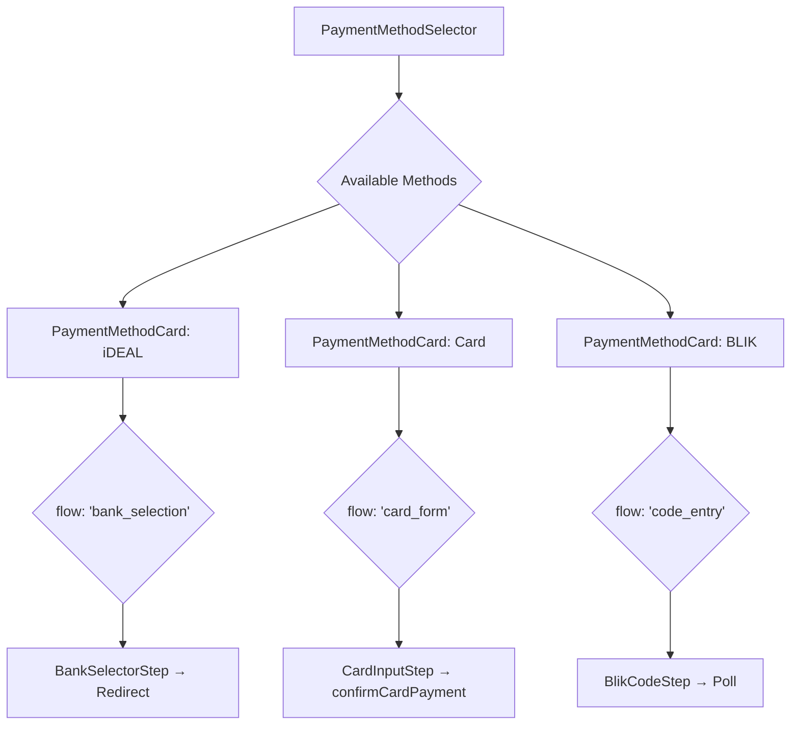
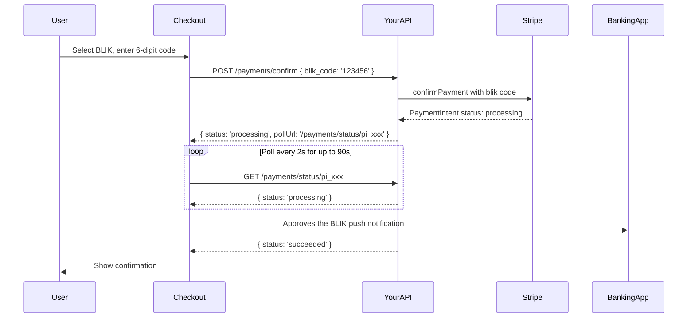
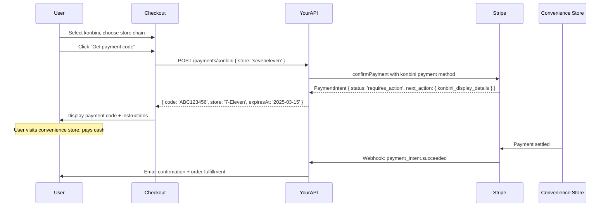

# 07 — Internationalization & Localization

> Payments i18n is harder than content i18n. Currency arithmetic is lossy if you get the minor-unit math wrong. RTL layouts break card UX in non-obvious ways. Local payment methods like iDEAL and konbini are fundamentally different UX flows, not just translated strings. These answers cover the full stack: `Intl` APIs, Stripe's currency conventions, locale-driven form architecture, and multi-currency display.

---

## Core Questions

### Q: Describe how you format currency amounts in a payments UI across different locales. What does `Intl.NumberFormat` give you, where does it fall short (e.g., currencies with non-standard subunit counts like JPY or KWD), and how do you handle amounts that arrive from your API in minor units (cents)?

**Problem framing:** Currency formatting seems trivial until you encounter it. `Intl.NumberFormat` handles locale-specific symbol placement, decimal separators, and grouping — but it knows nothing about Stripe's minor-unit convention. Getting this wrong produces amounts that are 100x or 1000x off, which in a checkout UI is catastrophic.

**Approach:**

`Intl.NumberFormat` with `style: 'currency'` gives you locale-aware formatting for free:

```typescript
// Basic: formats number with locale-aware symbol, separators, decimals
new Intl.NumberFormat('de-DE', { style: 'currency', currency: 'EUR' })
  .format(12.50); // "12,50 €"

new Intl.NumberFormat('en-US', { style: 'currency', currency: 'USD' })
  .format(12.50); // "$12.50"

new Intl.NumberFormat('ar-SA', { style: 'currency', currency: 'SAR' })
  .format(12.50); // "١٢٫٥٠ ر.س." (Arabic-Indic numerals, RTL)
```

What it handles well: symbol position (€12 vs 12€ vs 12 €), decimal separator (`.` vs `,`), grouping separator (`,` vs `.` vs ` `), and currency symbol vs code.

**Where it falls short — minor units:**

`Intl.NumberFormat` knows the correct *display* decimal places for a currency (0 for JPY, 2 for USD, 3 for KWD). But Stripe sends amounts in the currency's **smallest unit** (minor units), and `Intl.NumberFormat` expects a floating-point value. You must convert first.

```typescript
// currency-utils.ts

// ISO 4217 minor unit exponents (decimals in smallest unit)
// 0 = no subunits (JPY, KRW, VND, BIF, ...)
// 2 = cents (USD, EUR, GBP, AUD, CAD, ... — the majority)
// 3 = three decimal places (KWD, BHD, OMR, JOD, TND, ...)
const CURRENCY_MINOR_UNITS: Record<string, number> = {
  // Zero-decimal currencies
  BIF: 0, CLP: 0, DJF: 0, GNF: 0, ISK: 0, JPY: 0, KMF: 0,
  KRW: 0, MGA: 0, PYG: 0, RWF: 0, UGX: 0, VND: 0, VUV: 0,
  XAF: 0, XOF: 0, XPF: 0,
  // Three-decimal currencies
  BHD: 3, IQD: 3, JOD: 3, KWD: 3, LYD: 3, MRO: 3, OMR: 3, TND: 3,
};

export function getMinorUnitExponent(currency: string): number {
  const upper = currency.toUpperCase();
  return CURRENCY_MINOR_UNITS[upper] ?? 2; // default: 2 (cents)
}

/**
 * Convert a Stripe minor-unit amount to a display-ready decimal value.
 * Stripe: { amount: 1099, currency: 'usd' } → 10.99
 * Stripe: { amount: 1099, currency: 'jpy' } → 1099
 * Stripe: { amount: 1099, currency: 'kwd' } → 1.099
 */
export function minorUnitsToDecimal(amount: number, currency: string): number {
  const exponent = getMinorUnitExponent(currency);
  if (exponent === 0) return amount;
  return amount / Math.pow(10, exponent);
}

/**
 * Format a Stripe-style { amount, currency } for display in a given locale.
 */
export function formatCurrency(
  amount: number,
  currency: string,
  locale: string,
): string {
  const decimalAmount = minorUnitsToDecimal(amount, currency);
  return new Intl.NumberFormat(locale, {
    style: 'currency',
    currency: currency.toUpperCase(),
    // Let Intl.NumberFormat use the currency's standard decimal places
    // It already knows JPY=0, KWD=3, USD=2
  }).format(decimalAmount);
}
```

Usage examples:

```typescript
formatCurrency(1099, 'usd', 'en-US');  // "$10.99"
formatCurrency(1099, 'eur', 'de-DE');  // "10,99 €"
formatCurrency(1099, 'jpy', 'ja-JP');  // "¥1,099"
formatCurrency(1099, 'kwd', 'ar-KW');  // "١٫٠٩٩ د.ك."
formatCurrency(100,  'usd', 'en-US');  // "$1.00"
formatCurrency(100,  'jpy', 'ja-JP');  // "¥100"
```

**Additional `Intl.NumberFormat` limitation:** it cannot format with a currency code instead of a symbol (`USD 10.99` rather than `$10.99`). For B2B invoicing contexts where the ISO code is preferred, use `currencyDisplay: 'code'`.

```typescript
new Intl.NumberFormat('en-US', {
  style: 'currency',
  currency: 'USD',
  currencyDisplay: 'code', // "USD 10.99"
}).format(10.99);
```

**Tradeoffs:**

- **Alternative: store and display amounts as floating-point decimals** — avoids the minor-unit conversion but introduces floating-point rounding errors at the API boundary. `10.99` in IEEE 754 is `10.989999...`. Never store money as a float.
- **Alternative: a currency library like `dinero.js`** — handles the minor-unit math, arithmetic, and formatting in a type-safe way. Good choice for a product doing multi-currency arithmetic on the frontend (e.g., showing totals, applying discounts). For display-only, `Intl.NumberFormat` + your utility is sufficient.
- **The explicit minor-unit map** is preferable to trying to derive exponents from `Intl.NumberFormat` metadata, which is not reliably cross-browser accessible.

---

### Q: How do you display prices that include tax in markets where tax must be shown separately (US) vs. markets where prices must be shown tax-inclusive by law (EU, Australia)? How does this affect your pricing component's data contract and render logic?

**Problem framing:** Tax display is a legal requirement, not a UX preference. Showing a pre-tax price in Germany or Australia and adding tax at checkout is illegal under consumer protection law. Showing tax separately in the US is the norm. The component must handle both, driven by the server's understanding of the user's jurisdiction — the frontend should not determine tax policy from the user's locale.

**Approach:**

The server owns tax jurisdiction logic. The frontend receives a structured price object:

```typescript
interface TaxDisplayPrice {
  baseAmount: number;           // in minor units
  taxAmount: number;            // in minor units (0 if exempt)
  totalAmount: number;          // baseAmount + taxAmount
  currency: string;
  taxDisplayMode: 'inclusive' | 'exclusive' | 'exempt';
  taxLabel?: string;            // e.g., "VAT", "GST", "Sales tax"
  taxRate?: number;             // e.g., 0.19 for 19% German VAT
  taxJurisdiction?: string;     // e.g., "DE", "AU", "CA-BC"
}
```

| Market | `taxDisplayMode` | What to show |
|---|---|---|
| US (most states) | `exclusive` | Base price + "Tax: $X.XX" at checkout |
| EU (B2C) | `inclusive` | Total price + "incl. VAT" annotation |
| Australia (GST) | `inclusive` | Total price + "incl. GST" annotation |
| Germany | `inclusive` | Total price + "inkl. 19% MwSt." |
| Canada | `exclusive` | Base + separate GST/HST/PST line |
| Tax-exempt B2B | `exempt` | Base price only, "Tax-exempt" badge |

Component render logic:

```tsx
interface PriceDisplayProps {
  price: TaxDisplayPrice;
  locale: string;
  variant?: 'line-item' | 'summary' | 'product-card';
}

export function PriceDisplay({ price, locale, variant = 'line-item' }: PriceDisplayProps) {
  const fmt = (amount: number) => formatCurrency(amount, price.currency, locale);

  if (price.taxDisplayMode === 'inclusive') {
    return (
      <div className="price-display">
        <span className="price-total">{fmt(price.totalAmount)}</span>
        {price.taxAmount > 0 && (
          <span className="price-tax-note">
            {/* "incl. 19% VAT" — localized via i18n */}
            {t('price.incl_tax', {
              rate: formatPercent(price.taxRate, locale),
              label: price.taxLabel ?? 'tax',
            })}
          </span>
        )}
      </div>
    );
  }

  if (price.taxDisplayMode === 'exclusive') {
    return (
      <div className="price-display">
        <span className="price-base">{fmt(price.baseAmount)}</span>
        {variant !== 'product-card' && price.taxAmount > 0 && (
          // Don't show tax breakdown on product cards — only at checkout summary
          <div className="price-tax-line">
            <span>{price.taxLabel ?? t('price.tax')}</span>
            <span>{fmt(price.taxAmount)}</span>
          </div>
        )}
        {variant !== 'product-card' && price.taxAmount > 0 && (
          <div className="price-total-line">
            <strong>{t('price.total')}</strong>
            <strong>{fmt(price.totalAmount)}</strong>
          </div>
        )}
      </div>
    );
  }

  // exempt
  return (
    <div className="price-display">
      <span className="price-total">{fmt(price.baseAmount)}</span>
      <span className="price-tax-exempt">{t('price.tax_exempt')}</span>
    </div>
  );
}
```

**Critical rule: never derive `taxDisplayMode` from the locale on the frontend.** The user's browser locale is `de-DE` but they may be a US company with a German billing address, or a tourist, or a business with VAT exemption. Tax jurisdiction is a backend concern (determined by billing address, customer type, product category, and jurisdiction rules).

**Tradeoffs:**

- **Alternative: pass `taxDisplayMode` as a locale-derived constant in frontend config** — works for single-market products but breaks the moment a German user has a US business account. Server authority is the only correct approach.
- **Alternative: always show tax-exclusive with a "+ tax" note** — simpler frontend, but illegal for EU/AU consumer-facing checkouts where the displayed price must be the full price paid.
- **Product card vs. checkout distinction**: product listing pages typically show only the total or base price (depending on mode) without a full breakdown. The detailed tax line-item is reserved for the checkout summary. Build the `variant` prop into the data contract from the start.

---

### Q: What are the specific challenges of supporting RTL languages (Arabic, Hebrew) in a checkout form — beyond just `dir="rtl"` on the container? Think about icon placement (card type icon, CVV help icon), number formatting, and error message positioning.

**Problem framing:** `dir="rtl"` flips text direction and most layout automatically via CSS logical properties, but checkout forms have domain-specific problems that pure CSS doesn't solve: credit card numbers are LTR regardless of page direction, icon affordances reverse in meaning, and error message associations break.

**Approach:**

**Problem 1: Card number and expiry are always LTR**

Card numbers, expiry dates, and CVV codes are numeric sequences with a fixed left-to-right reading order regardless of page locale. In RTL mode, the browser may render them right-to-left unless explicitly overridden:

```tsx
{/* Card number field: always LTR, even in RTL layout */}
<input
  type="text"
  inputMode="numeric"
  dir="ltr"
  className="card-number-input"
  // In RTL layouts, right-align the text to put it near the label
  style={{ textAlign: dir === 'rtl' ? 'right' : 'left' }}
/>
```

For Stripe Elements, set the `locale` option which handles internal element direction:

```typescript
const elements = stripe.elements({
  locale: 'ar', // Stripe Elements handles its own RTL internally
  appearance: {
    // Stripe Elements does NOT auto-mirror — you set direction in variables
    variables: { fontFamily: 'Cairo, sans-serif' },
  },
});
```

**Problem 2: Card type icon and CVV icon placement**

In LTR: card type icon is on the left of the card number input; CVV help icon (ⓘ) is on the right of the CVV field.

In RTL: icons flip with the layout. The card type icon ends up on the right (now the visual start of the field in RTL reading order — correct). But the CVV help icon flips to the left, which is also the right behavior for RTL.

However, the CVV icon tooltip often contains an image of a card with the CVV circled. That card image is not mirrored — it's a literal depiction of a physical card. Wrap it explicitly:

```tsx
<CVVTooltipImage
  dir="ltr"           // The card image is always LTR — it depicts a real card
  aria-hidden="true"
/>
```

**Problem 3: Error message placement and association**

In LTR layouts, inline error messages typically appear below-left of their field. In RTL, they should appear below-right (the natural reading origin). Use CSS logical properties:

```css
.field-error {
  /* Instead of: text-align: left */
  text-align: start; /* Automatically: left in LTR, right in RTL */
  
  /* Instead of: padding-left: 12px */
  padding-inline-start: 12px;
  
  /* Icon before the text in reading direction */
  display: flex;
  flex-direction: row; /* Icon always before text in reading direction */
}
```

```tsx
<div className="field-error" role="alert">
  <ErrorIcon aria-hidden="true" />
  <span>{errorMessage}</span>
</div>
```

**Problem 4: Numeric input keyboards on mobile**

`inputMode="numeric"` shows the numeric keypad. But in Arabic locale, the keypad may show Arabic-Indic numerals (٠١٢٣...) rather than Western numerals (0123...). For card numbers, you need Western numerals:

```tsx
<input
  type="text"
  inputMode="numeric"
  pattern="[0-9\s]*"
  // Normalize Arabic-Indic numerals to ASCII before processing
  onChange={(e) => {
    const normalized = e.target.value.replace(
      /[٠-٩]/g,
      (c) => String(c.charCodeAt(0) - 0x0660)
    );
    setCardNumber(normalized);
  }}
/>
```

**Problem 5: Expiry field format**

The expiry is displayed as `MM/YY`. In Arabic, the slash direction is fine (it's not RTL-sensitive), but month/year order in Arabic convention may expect `YY/MM`. For payment cards globally, always keep `MM/YY` with `dir="ltr"` — it's a global financial standard, not a localized date format.

**Layout summary:**

```
LTR checkout form:
[Card icon] [4242 4242 4242 4242    ] [ⓘ CVV]
[Error: Card number is required         ]

RTL checkout form (Arabic):
[CVV ⓘ] [    4242 4242 4242 4242] [أيقونة البطاقة]
[         رقم البطاقة مطلوب :خطأ]
```

**Tradeoffs:**

- **Alternative: separate Arabic checkout page** — eliminates the complexity but doubles your maintenance surface. A data-driven, locale-driven single checkout is always preferable at scale.
- **Alternative: use Stripe's hosted checkout (Stripe Checkout)** — Stripe handles RTL, localization, and all the edge cases internally. You lose customization. If your product allows it, this is a reasonable tradeoff.
- **CSS logical properties** (`padding-inline-start` over `padding-left`) are the single highest-leverage RTL enabler — adopt them from the start, not as an afterthought.

---

### Q: Stripe supports "local payment methods" (iDEAL in the Netherlands, BLIK in Poland, Pix in Brazil, UPI in India). How do you architect a payment method selector that is data-driven (configured per-country) rather than hardcoded, and how do each of these methods change the checkout UX flow?

**Problem framing:** Hardcoding payment methods per country is a maintenance trap — countries add and remove methods, popularity shifts, and A/B testing requires runtime config. Worse, each local payment method has a distinct UX flow (redirect, polling, QR code, code entry) that the checkout must accommodate without a separate implementation per method.

**Approach:**

**Data-driven method configuration from the server:**

```typescript
// Returned by your backend based on the user's country and cart value
interface PaymentMethodConfig {
  id: string;               // 'ideal', 'blik', 'pix', 'upi', 'card', 'paypal'
  type: PaymentMethodType;  // drives which UX flow to render
  displayName: string;      // localized name
  logoUrl: string;
  logoAlt: string;
  recommended: boolean;     // show first
  supportedCurrencies: string[];
  minAmount?: number;       // some methods have minimums
  maxAmount?: number;
  flow: PaymentFlow;
}

type PaymentFlow =
  | 'card_form'             // Standard card input
  | 'redirect'              // Leave page, return via redirect (iDEAL, Sofort)
  | 'polling'               // Initiate + poll for confirmation (Pix, BOKS)
  | 'code_entry'            // User enters a code (BLIK, some voucher methods)
  | 'qr_code'               // Show QR, wait for scan (Pix, UPI)
  | 'bank_selection'        // Redirect to bank picker (iDEAL)
  | 'wallet'                // In-app wallet (Google Pay, Apple Pay)
  | 'async_voucher';        // Async / offline (konbini, boleto)

type PaymentMethodType =
  | 'ideal' | 'blik' | 'pix' | 'upi' | 'card'
  | 'giropay' | 'sofort' | 'bancontact' | 'konbini';
```

**Component hierarchy:**



```tsx
// PaymentMethodSelector.tsx
function PaymentMethodSelector({ methods, cartAmount, currency }: Props) {
  const [selected, setSelected] = useState<PaymentMethodConfig | null>(
    methods.find(m => m.recommended) ?? methods[0] ?? null
  );

  const eligibleMethods = methods.filter(m =>
    m.supportedCurrencies.includes(currency) &&
    (m.minAmount == null || cartAmount >= m.minAmount) &&
    (m.maxAmount == null || cartAmount <= m.maxAmount)
  );

  return (
    <fieldset>
      <legend>{t('payment.select_method')}</legend>
      <div className="method-list">
        {eligibleMethods.map(method => (
          <PaymentMethodOption
            key={method.id}
            method={method}
            selected={selected?.id === method.id}
            onSelect={() => setSelected(method)}
          />
        ))}
      </div>
      {selected && <PaymentFlowRenderer method={selected} />}
    </fieldset>
  );
}

// PaymentFlowRenderer — routes to the correct UX flow
function PaymentFlowRenderer({ method }: { method: PaymentMethodConfig }) {
  switch (method.flow) {
    case 'card_form':      return <CardForm />;
    case 'bank_selection': return <IdealBankSelector methodId={method.id} />;
    case 'code_entry':     return <BlikCodeEntry />;
    case 'qr_code':        return <PixQRCode methodId={method.id} />;
    case 'async_voucher':  return <AsyncVoucherInstructions methodId={method.id} />;
    case 'redirect':       return <RedirectPaymentButton method={method} />;
    default:               return null;
  }
}
```

**How each method changes the UX flow:**

| Method | Country | Flow type | UX change vs. card |
|---|---|---|---|
| iDEAL | 🇳🇱 Netherlands | `bank_selection` → redirect | User picks their bank, redirected to online banking, returns via `return_url` |
| BLIK | 🇵🇱 Poland | `code_entry` → polling | User generates a 6-digit code in their banking app, types it in checkout, checkout polls for confirmation |
| Pix | 🇧🇷 Brazil | `qr_code` → polling | Checkout shows a QR code, user scans with banking app, checkout polls until confirmed |
| UPI | 🇮🇳 India | `code_entry` or `qr_code` | User enters UPI ID or scans QR; bank app shows an in-app push for approval |
| Konbini | 🇯🇵 Japan | `async_voucher` | Checkout shows a payment code; user pays cash at convenience store within 3 days; order is confirmed async |

**BLIK flow detail (most distinctive):**



**Tradeoffs:**

- **Alternative: Stripe Payment Element** — Stripe's own `PaymentElement` component handles method selection, localization, and flow routing automatically. Ideal if you're comfortable with Stripe's styling constraints. You lose full design control but gain first-party handling of every local method Stripe supports.
- **Alternative: hardcode per-country components** — zero flexibility, doubles code per new market, kills A/B testing. Only defensible for a single-market product.
- **The `flow` field on the server config** is the key architectural choice — it decouples method identity from UX pattern. A new method (say, MB WAY in Portugal) just needs a new entry in your config + a `flow` type your renderer already handles.

---

### Q: How do you handle locale-specific date formatting in a payments context — specifically card expiry dates, invoice dates, and estimated delivery windows — given that `12/03` means March 12 in Europe and December 3 in the US?

**Problem framing:** Ambiguous date formatting in payments causes real user harm: wrong expiry date entry invalidates cards, misread invoice dates cause accounting errors. The challenge is that different date contexts in payments have different formatting rules — some must follow global conventions (card expiry), others should follow the user's locale (invoice dates).

**Approach:**

First, separate the three contexts — they have different requirements:

| Date type | Format convention | Who controls it | Ambiguity risk |
|---|---|---|---|
| Card expiry (`MM/YY`) | Global standard — always `MM/YY` | Payment card industry | Low (always `MM/YY`) |
| Invoice date | User's locale | Locale | High (`12/03` ambiguity) |
| Estimated delivery | User's locale, verbose | Locale | Medium (verbose format reduces ambiguity) |

**Card expiry — never localize, always annotate:**

```tsx
// Card expiry is a domain convention: always MM/YY, never localized
<div className="expiry-field">
  <label>{t('card.expiry_label')}</label>
  {/* Always LTR, always MM/YY format */}
  <input
    type="text"
    dir="ltr"
    placeholder="MM / YY"
    inputMode="numeric"
    maxLength={7}
    aria-describedby="expiry-hint"
  />
  {/* Explicit hint removes ambiguity */}
  <span id="expiry-hint" className="field-hint">
    {t('card.expiry_hint')} {/* "Month / Year — e.g. 03 / 28" */}
  </span>
</div>
```

**Invoice dates — use `Intl.DateTimeFormat` with explicit format style:**

```typescript
// date-formatting.ts
export function formatInvoiceDate(date: Date, locale: string): string {
  return new Intl.DateTimeFormat(locale, {
    year: 'numeric',
    month: 'long',   // "March" not "3" — removes ambiguity
    day: 'numeric',
  }).format(date);
  // en-US: "March 12, 2025"
  // de-DE: "12. März 2025"
  // ja-JP: "2025年3月12日"
  // ar-SA: "١٢ مارس ٢٠٢٥"
}

// Never use short numeric month for invoice dates — ambiguous
// BAD:  "12/03/2025" — is this Dec 3 or Mar 12?
// GOOD: "March 12, 2025" / "12. März 2025"
```

**Estimated delivery windows — use relative + explicit ranges:**

```typescript
export function formatDeliveryWindow(
  startDate: Date,
  endDate: Date,
  locale: string,
): string {
  const fmt = new Intl.DateTimeFormat(locale, {
    weekday: 'short',
    month: 'short',
    day: 'numeric',
  });

  // "Mon, Mar 10 – Wed, Mar 12"
  // "Mo, 10. März – Mi, 12. März"
  return `${fmt.format(startDate)} – ${fmt.format(endDate)}`;
}
```

**Date parsing from API — always use ISO 8601, never interpret locale dates server-to-client:**

```typescript
// Your API should always send dates as ISO 8601 strings
interface InvoiceResponse {
  invoice_date: string;      // "2025-03-12" — never "12/03/2025"
  due_date: string;          // "2025-04-12"
  created_at: string;        // "2025-03-12T09:30:00Z"
}

// Parsing is unambiguous: ISO 8601 has no locale ambiguity
function parseApiDate(isoString: string): Date {
  return new Date(isoString); // Safe — no locale interpretation
}
```

**Relative date formatting with `Intl.RelativeTimeFormat`:**

For "payment due in 3 days" or "invoice issued 2 weeks ago":

```typescript
const rtf = new Intl.RelativeTimeFormat(locale, { numeric: 'auto' });

rtf.format(-2, 'day');   // "2 days ago" / "vor 2 Tagen" / "منذ يومين"
rtf.format(3, 'day');    // "in 3 days" / "in 3 Tagen" / "خلال 3 أيام"
rtf.format(-1, 'day');   // "yesterday" / "gestern" / "أمس" (numeric: 'auto')
```

**Tradeoffs:**

- **Alternative: always use verbose dates everywhere** — eliminates ambiguity but breaks payment domain conventions (no one expects card expiry to say "March 2028"). Use verbose for prose context, domain convention for form fields.
- **Alternative: infer locale from `navigator.language`** — acceptable for display formatting but do not use it for parsing user-entered dates (a German user on a US-configured device would have mismatched behavior). Always have the user's locale preference from their account settings, not just the browser.
- **The firm rule**: receive dates from APIs as ISO 8601, display dates using `Intl.DateTimeFormat`, and never display short numeric dates (`12/03`) in a payments context where the month/day order is ambiguous.

---

### Q: What is your strategy for translating dynamic server error messages (card decline reasons, fraud messages) that arrive in English from your payment processor but need to be displayed in the user's language?

**Problem framing:** Stripe and other processors return machine-readable decline codes alongside English human-readable messages. The English messages are designed for developers, not users. Displaying them raw would expose technical jargon and potentially security-sensitive decline reasons to users. The challenge: the set of codes is finite and known, but you need localized copy for each, and some codes should show a generic message regardless of language.

**Approach:**

The strategy is a **code-to-copy mapping on the frontend**, not machine translation. Because the set of Stripe decline codes is documented and stable (Stripe rarely adds new ones without notice), you can maintain a translation catalog:

```typescript
// decline-messages.ts
// The key is the Stripe decline_code (machine-readable, stable)
// The value is the i18n key (looked up in your translation files)

const DECLINE_CODE_I18N_MAP: Record<string, string> = {
  // Actionable — show specific message
  insufficient_funds:        'errors.decline.insufficient_funds',
  expired_card:              'errors.decline.expired_card',
  incorrect_cvc:             'errors.decline.incorrect_cvc',
  incorrect_zip:             'errors.decline.incorrect_zip',
  card_velocity_exceeded:    'errors.decline.velocity_exceeded',
  currency_not_supported:    'errors.decline.currency_not_supported',
  card_not_supported:        'errors.decline.card_not_supported',
  // All others fall through to generic — security reasons
};

// These codes MUST show generic message regardless of language
const SILENT_CODES = new Set([
  'stolen_card', 'lost_card', 'pickup_card', 'fraudulent',
  'do_not_honor', 'restricted_card', 'security_violation',
]);

const GENERIC_I18N_KEY = 'errors.decline.generic';

export function getDeclineI18nKey(declineCode: string | undefined): string {
  if (!declineCode) return GENERIC_I18N_KEY;
  if (SILENT_CODES.has(declineCode)) return GENERIC_I18N_KEY;
  return DECLINE_CODE_I18N_MAP[declineCode] ?? GENERIC_I18N_KEY;
}
```

Translation files (one per locale):

```json
// locales/en.json
{
  "errors": {
    "decline": {
      "generic": "Your payment was declined. Please contact your bank or use a different payment method.",
      "insufficient_funds": "Your card has insufficient funds. Please check your balance or use a different card.",
      "expired_card": "Your card has expired. Please update your card details.",
      "incorrect_cvc": "The security code (CVC) you entered is incorrect. Please check and try again.",
      "incorrect_zip": "The billing postcode doesn't match your card records.",
      "velocity_exceeded": "Too many payment attempts. Please wait a few minutes before trying again.",
      "currency_not_supported": "This card doesn't support payments in this currency."
    }
  }
}

// locales/de.json
{
  "errors": {
    "decline": {
      "generic": "Ihre Zahlung wurde abgelehnt. Bitte kontaktieren Sie Ihre Bank oder verwenden Sie eine andere Zahlungsmethode.",
      "insufficient_funds": "Ihr Konto hat nicht ausreichend Deckung. Bitte überprüfen Sie Ihren Kontostand.",
      "expired_card": "Ihre Karte ist abgelaufen. Bitte aktualisieren Sie Ihre Kartendaten.",
      "incorrect_cvc": "Die eingegebene Prüfnummer (CVC) ist falsch. Bitte überprüfen Sie die Angabe."
    }
  }
}
```

In the component:

```tsx
function PaymentErrorAlert({ declineCode }: { declineCode?: string }) {
  const { t } = useTranslation();
  const i18nKey = getDeclineI18nKey(declineCode);

  return (
    <Alert role="alert" aria-live="assertive" variant="error">
      {t(i18nKey)}
    </Alert>
  );
}
```

**For API validation errors and other server messages** that are less structured (e.g., your own backend returning `"Address line 1 is required"`), never pass these directly to the user. The backend should return machine-readable error codes that the frontend maps to localized strings:

```typescript
// BAD: server returns { error: "Address line 1 is required" }
// GOOD: server returns { error_code: "address.line1.required" }
// Frontend: t('errors.address.line1.required')
```

**Tradeoffs:**

- **Alternative: machine translation of Stripe's English messages** — non-deterministic, can produce unnatural or alarming phrasing ("your card was stolen" machine-translated to Arabic could be more alarming than the English). Never use ML translation for payment error messages.
- **Alternative: always show generic message** — maximally safe but loses the conversion benefit of actionable messages. A user with insufficient funds who sees "contact your bank" instead of "check your balance" is more likely to abandon than to top up their account.
- **The i18n key indirection** (rather than putting copy directly in the code map) means your translators can work in your standard translation workflow (Phrase, Lokalise, Crowdin) without touching TypeScript files.

---

### Q: How do you support multiple currencies in a single checkout — e.g., a platform where the buyer is in Germany paying in EUR but the seller is in Canada receiving CAD? What does the UI need to display, and what data must come from the server vs. what can the frontend derive?

**Problem framing:** Multi-currency marketplace checkout is a Stripe Connect pattern. The complexity: the payment amount, currency conversion, FX fees, and settlement currency are all governed by Stripe + your platform's pricing, not by the frontend. The frontend's job is to display the right information without confusing the buyer or misrepresenting the cost.

**Approach:**

**Data contract from the server:**

```typescript
interface MultiCurrencyCheckoutPrice {
  // What the buyer pays — this is what Stripe charges
  chargeAmount: number;         // in minor units
  chargeCurrency: string;       // "EUR" — buyer's currency

  // What the seller receives (informational only for UI)
  settlementAmount: number;     // in minor units
  settlementCurrency: string;   // "CAD" — seller's currency

  // FX details — to be displayed for transparency
  exchangeRate: number;         // e.g., 1.47 (1 EUR = 1.47 CAD)
  exchangeRateTimestamp: string; // ISO 8601 — rate validity time
  platformFeeAmount?: number;   // in charge currency (optional, platform-specific)

  // Who bears FX risk
  fxResponsibility: 'buyer' | 'seller' | 'platform';
}
```

**What the frontend displays:**

```tsx
function MultiCurrencyPriceSummary({ price, locale }: Props) {
  const fmt = (amount: number, currency: string) =>
    formatCurrency(amount, currency, locale);

  return (
    <div className="price-summary">
      {/* Primary: what the buyer pays — always prominent */}
      <div className="charge-total">
        <strong>{t('checkout.you_pay')}</strong>
        <strong>{fmt(price.chargeAmount, price.chargeCurrency)}</strong>
      </div>

      {/* Secondary: currency conversion transparency */}
      {price.chargeCurrency !== price.settlementCurrency && (
        <div className="fx-detail">
          <span className="fx-rate">
            {t('checkout.fx_rate', {
              fromCurrency: price.chargeCurrency,
              toCurrency: price.settlementCurrency,
              rate: formatExchangeRate(price.exchangeRate, locale),
            })}
            {/* "Exchange rate: 1 EUR = 1.47 CAD" */}
          </span>
          <span className="fx-timestamp">
            {t('checkout.rate_as_of', {
              time: formatRelativeTime(price.exchangeRateTimestamp, locale),
            })}
            {/* "Rate as of 2 hours ago" */}
          </span>
        </div>
      )}

      {/* Seller settlement — only show on marketplace checkouts where relevant */}
      <div className="seller-receives">
        <span>{t('checkout.seller_receives')}</span>
        <span>{fmt(price.settlementAmount, price.settlementCurrency)}</span>
      </div>

      {/* Platform fee — if disclosed */}
      {price.platformFeeAmount != null && (
        <div className="platform-fee">
          <span>{t('checkout.platform_fee')}</span>
          <span>{fmt(price.platformFeeAmount, price.chargeCurrency)}</span>
        </div>
      )}
    </div>
  );
}
```

**What the frontend MUST NOT derive:**

| Data point | Why not frontend-derived |
|---|---|
| Exchange rate | Live FX rates are financial data — cannot use a static lookup or `Intl` |
| Settlement amount | Depends on Stripe Connect fee structure, platform rules, and FX timing |
| Platform fee | Business logic — never derive fees client-side |
| Charge currency | Determined by buyer's country, seller's account, and Stripe configuration |

**What the frontend CAN derive:**

```typescript
// Safe to derive on frontend:
// 1. Display formatting of any amount the server provides
const formattedCharge = formatCurrency(price.chargeAmount, price.chargeCurrency, locale);

// 2. Whether to show the FX section at all
const showFxSection = price.chargeCurrency !== price.settlementCurrency;

// 3. Rate recency warning (not the rate itself — just staleness display)
const rateAgeMs = Date.now() - new Date(price.exchangeRateTimestamp).getTime();
const isStaleRate = rateAgeMs > 4 * 60 * 60 * 1000; // > 4 hours
```

**Rate freshness handling:**

Exchange rates can go stale if the user sits on the checkout page for a long time. Refresh the price from the server before final confirmation:

```typescript
async function handleSubmit() {
  // Re-fetch current price before charging — rate may have changed
  const freshPrice = await fetchCurrentPrice(orderId);

  if (freshPrice.chargeAmount !== confirmedPrice.chargeAmount) {
    // Rate changed — show updated price and require re-confirmation
    setUpdatedPrice(freshPrice);
    setShowRateChangedModal(true);
    return;
  }

  // Price unchanged — proceed with payment
  await confirmPayment();
}
```

**Tradeoffs:**

- **Alternative: always charge in the seller's currency, convert on buyer's card** — shifts FX responsibility to the buyer's card issuer. Simpler server logic, but the buyer sees a foreign currency charge (confusing, may trigger foreign transaction fees). Worse UX.
- **Alternative: show only the charge amount, hide FX details** — cleaner UI, but legally problematic in EU (PSD2 transparency requirements for cross-border payments) and user-trust damaging on marketplace platforms.
- **The firm rule**: the server is the single source of truth for all amounts, rates, and fees. The frontend formats and displays; it never calculates prices.

---

## Deep Questions

### Q: You are expanding checkout to Japan, which has several unique requirements: prices are always displayed as whole numbers (no decimal yen), the most popular payment method is convenience store payment (konbini) which is asynchronous and cash-based, and the address form field order is reversed (postal code → prefecture → city → street, then name in family-name-first order). Walk through the specific component and data model changes required, and how you architect the address form to be locale-driven rather than requiring a separate Japanese checkout page.

**Problem framing:** Japan is the canonical example of a market that breaks all Western checkout assumptions simultaneously: zero-decimal currency, async cash payment, reversed address order, and reversed name order. The wrong answer is a separate `/checkout/jp` page. The right answer is a locale-driven component system where Japan's configuration is data, not code.

**Approach:**

**1. Currency: zero-decimal JPY**

JPY is a zero-decimal currency (`minorUnitExponent = 0`). Stripe sends `amount: 1099` for ¥1,099.

```typescript
// Already handled by our currency utility:
formatCurrency(1099, 'jpy', 'ja-JP'); // "¥1,099" — no decimal point
```

The `Intl.NumberFormat` for JPY automatically uses 0 decimal places. No special-casing needed if your `formatCurrency` utility uses the currency code correctly.

**2. Address form — locale-driven field schema:**

Model the address form as a locale-configurable schema, not a hardcoded component:

```typescript
interface AddressField {
  id: string;
  label: string;              // i18n key
  type: 'text' | 'select' | 'postal';
  autocomplete: string;       // HTML autocomplete hint
  required: boolean;
  options?: Array<{ value: string; label: string }>; // for select fields
  validation?: RegExp;
}

interface AddressSchema {
  locale: string;
  fields: AddressField[];     // ordered — render in this order
  nameOrder: 'given-family' | 'family-given';
  postalFormat?: RegExp;      // for validation/masking
}
```

US address schema (Western standard):

```typescript
const US_ADDRESS_SCHEMA: AddressSchema = {
  locale: 'en-US',
  nameOrder: 'given-family',
  fields: [
    { id: 'given_name', label: 'address.first_name', type: 'text', autocomplete: 'given-name', required: true },
    { id: 'family_name', label: 'address.last_name', type: 'text', autocomplete: 'family-name', required: true },
    { id: 'line1', label: 'address.line1', type: 'text', autocomplete: 'address-line1', required: true },
    { id: 'line2', label: 'address.line2', type: 'text', autocomplete: 'address-line2', required: false },
    { id: 'city', label: 'address.city', type: 'text', autocomplete: 'address-level2', required: true },
    { id: 'state', label: 'address.state', type: 'select', autocomplete: 'address-level1', required: true, options: US_STATES },
    { id: 'postal_code', label: 'address.zip', type: 'postal', autocomplete: 'postal-code', required: true },
  ],
};
```

Japanese address schema:

```typescript
const JP_ADDRESS_SCHEMA: AddressSchema = {
  locale: 'ja-JP',
  nameOrder: 'family-given',  // 山田 太郎 (Yamada Taro)
  postalFormat: /^\d{3}-\d{4}$/,
  fields: [
    // Japanese order: postal → prefecture → city → street → name
    { id: 'postal_code', label: 'address.postal_code', type: 'postal', autocomplete: 'postal-code', required: true,
      validation: /^\d{3}-?\d{4}$/ },
    { id: 'prefecture', label: 'address.prefecture', type: 'select', autocomplete: 'address-level1', required: true,
      options: JP_PREFECTURES },
    { id: 'city', label: 'address.city_ward', type: 'text', autocomplete: 'address-level2', required: true },
    { id: 'line1', label: 'address.street_block', type: 'text', autocomplete: 'address-line1', required: true },
    { id: 'line2', label: 'address.building', type: 'text', autocomplete: 'address-line2', required: false },
    // Name comes after address in Japan
    { id: 'family_name', label: 'address.family_name', type: 'text', autocomplete: 'family-name', required: true },
    { id: 'given_name', label: 'address.given_name', type: 'text', autocomplete: 'given-name', required: true },
    // Furigana (phonetic reading) — required for many Japanese services
    { id: 'family_name_kana', label: 'address.family_name_kana', type: 'text', autocomplete: 'off', required: true },
    { id: 'given_name_kana', label: 'address.given_name_kana', type: 'text', autocomplete: 'off', required: true },
  ],
};
```

Schema-driven `AddressForm` component:

```tsx
function AddressForm({ schema }: { schema: AddressSchema }) {
  const [values, setValues] = useState<Record<string, string>>({});

  return (
    <form>
      {schema.fields.map(field => (
        <AddressField
          key={field.id}
          field={field}
          value={values[field.id] ?? ''}
          onChange={(v) => setValues(prev => ({ ...prev, [field.id]: v }))}
        />
      ))}
    </form>
  );
}

// Schema registry — extensible without new components
const ADDRESS_SCHEMAS: Record<string, AddressSchema> = {
  'en-US': US_ADDRESS_SCHEMA,
  'ja-JP': JP_ADDRESS_SCHEMA,
  'de-DE': DE_ADDRESS_SCHEMA,
  // ...
};

function useAddressSchema(locale: string): AddressSchema {
  return ADDRESS_SCHEMAS[locale] ?? ADDRESS_SCHEMAS['en-US'];
}
```

**3. Japanese postal code → auto-fill:**

Japan has a well-known postal code → prefecture/city/ward database. Implement auto-fill on postal code entry:

```typescript
// Fetch from a Japanese postal code API (e.g., zipcloud.ibsregion.com)
async function lookupJpPostalCode(code: string): Promise<{ prefecture: string; city: string } | null> {
  const cleaned = code.replace('-', '');
  if (!/^\d{7}$/.test(cleaned)) return null;
  const res = await fetch(`https://zipcloud.ibsregion.com/api/search?zipcode=${cleaned}`);
  const data = await res.json();
  if (data.results) {
    return { prefecture: data.results[0].address1, city: data.results[0].address2 };
  }
  return null;
}
```

**4. Konbini payment flow:**

Konbini is an `async_voucher` flow — the order is placed, a payment code is issued, and the user physically pays at a convenience store (7-Eleven, FamilyMart, Lawson) within 3 days. Order fulfillment is async — you ship only after the webhook confirms payment.



The post-selection UX is an instruction screen, not a continuation of the standard checkout flow:

```tsx
function KonbiniInstructions({ details }: { details: KonbiniPaymentDetails }) {
  return (
    <div className="konbini-instructions">
      <h2>{t('konbini.payment_code')}: <strong>{details.paymentCode}</strong></h2>
      <p>{t('konbini.visit_store', { store: details.storeChain })}</p>
      <p>{t('konbini.expires', {
        date: formatInvoiceDate(new Date(details.expiresAt), 'ja-JP'),
      })}</p>
      <ol>
        <li>{t('konbini.step1')}</li>
        <li>{t('konbini.step2')}</li>
        <li>{t('konbini.step3')}</li>
      </ol>
      <Button onClick={() => window.print()}>{t('konbini.print_instructions')}</Button>
    </div>
  );
}
```

**Tradeoffs:**

- **Alternative: separate Japanese checkout page** — eliminates the schema complexity but creates two checkout code paths to maintain. Every bug fix and new feature must be applied twice.
- **Alternative: schema from the server** — the address schema could be server-driven (API returns the field list), which allows dynamic updates without a frontend deploy. More complex initial implementation but maximally flexible. Worth it for a platform targeting 20+ markets.
- **Furigana fields** are a Japan-specific requirement that has no analog in any other locale — they cannot be modeled as a generic "secondary name" field. The schema approach makes this explicit and isolated rather than polluting a shared `AddressForm` component with Japanese-specific logic.

---

### Q: Stripe's `amount` field is always an integer in the currency's smallest unit. For most currencies this is cents, but for currencies like the Jordanian Dinar (3 decimal places, 1 JOD = 1000 fils) and currencies like the Japanese Yen (0 decimal places), the math changes. Build a robust currency utility module: given a `{amount: number, currency: string}` object, how do you correctly format the display value, and how do you validate user-entered amounts to prevent off-by-100x errors?

**Problem framing:** The Stripe amount convention is a common source of catastrophic bugs — charging $10,000 instead of $100, or showing ¥0.01 instead of ¥1. A utility module that encapsulates this logic once, with validation, prevents the entire class of errors. The interviewer is testing whether you can build production-grade money utilities with proper typing and edge case handling.

**Approach:**

**Complete currency utility module:**

```typescript
// currency.ts — complete module

// ISO 4217 minor unit exponents
// Source: https://www.currency-iso.org/en/home/tables/table-a1.html
const MINOR_UNIT_EXPONENTS: Readonly<Record<string, number>> = {
  // Zero-decimal (no subunits)
  BIF: 0, CLP: 0, DJF: 0, GNF: 0, ISK: 0, JPY: 0, KMF: 0,
  KRW: 0, MGA: 0, PYG: 0, RWF: 0, UGX: 0, VND: 0, VUV: 0,
  XAF: 0, XOF: 0, XPF: 0,
  // Three-decimal currencies
  BHD: 3, IQD: 3, JOD: 3, KWD: 3, LYD: 3, OMR: 3, TND: 3,
  // All others default to 2
} as const;

export function getMinorUnitExponent(currency: string): number {
  return MINOR_UNIT_EXPONENTS[currency.toUpperCase()] ?? 2;
}

// Represents a Stripe-style money value
export interface Money {
  amount: number;   // integer, in minor units
  currency: string; // ISO 4217 code (uppercase)
}

/**
 * Convert minor units (Stripe format) to a decimal for display.
 * Uses integer arithmetic to avoid floating-point errors.
 */
export function minorUnitsToDecimal(money: Money): number {
  const exp = getMinorUnitExponent(money.currency);
  if (exp === 0) return money.amount;
  // Use string-based division to avoid IEEE 754 issues with large amounts
  const divisor = Math.pow(10, exp);
  return money.amount / divisor;
}

/**
 * Convert a user-entered decimal amount to Stripe minor units.
 * This is the critical validation path — getting this wrong causes
 * off-by-100x or off-by-1000x charge errors.
 */
export function decimalToMinorUnits(decimalAmount: number, currency: string): number {
  const exp = getMinorUnitExponent(currency);
  if (exp === 0) {
    // For zero-decimal currencies, the user enters a whole number
    // Reject anything with decimal places
    if (!Number.isInteger(decimalAmount)) {
      throw new CurrencyError(
        `${currency} does not support decimal amounts. Got: ${decimalAmount}`,
        'INVALID_DECIMAL_FOR_ZERO_DECIMAL_CURRENCY'
      );
    }
    return decimalAmount;
  }
  // Round to the currency's precision to handle floating-point input
  const multiplier = Math.pow(10, exp);
  return Math.round(decimalAmount * multiplier);
}

export class CurrencyError extends Error {
  constructor(message: string, public code: string) {
    super(message);
    this.name = 'CurrencyError';
  }
}

/**
 * Format a Money object for display in a given locale.
 * This is the single canonical formatting function for the entire app.
 */
export function formatMoney(money: Money, locale: string): string {
  const decimalAmount = minorUnitsToDecimal(money);
  return new Intl.NumberFormat(locale, {
    style: 'currency',
    currency: money.currency.toUpperCase(),
  }).format(decimalAmount);
}

/**
 * Validate a user-entered amount string for a given currency.
 * Returns { valid: true, minorUnits: number } or { valid: false, error: string }.
 */
export function validateUserAmount(
  input: string,
  currency: string,
  locale: string,
): { valid: true; minorUnits: number } | { valid: false; error: string } {
  const exp = getMinorUnitExponent(currency);

  // Normalize: remove currency symbols and locale-specific separators
  // Use Intl to detect the locale's decimal separator
  const decimalSep = getLocaleDecimalSeparator(locale);
  const groupSep = getLocaleGroupSeparator(locale);

  const normalized = input
    .replace(new RegExp(`[${escapeRegex(groupSep)}]`, 'g'), '') // remove thousands sep
    .replace(decimalSep, '.')                                    // normalize decimal sep
    .replace(/[^\d.]/g, '');                                    // strip symbols

  const parsed = parseFloat(normalized);

  if (isNaN(parsed) || normalized === '') {
    return { valid: false, error: 'errors.amount.invalid' };
  }

  if (parsed <= 0) {
    return { valid: false, error: 'errors.amount.must_be_positive' };
  }

  // Check decimal places don't exceed currency's precision
  const decimalPlaces = (normalized.split('.')[1] ?? '').length;
  if (decimalPlaces > exp) {
    return {
      valid: false,
      error: exp === 0
        ? 'errors.amount.no_decimals_for_currency'   // JPY, KRW
        : 'errors.amount.too_many_decimals',
    };
  }

  const minorUnits = decimalToMinorUnits(parsed, currency);

  // Sanity check: Stripe has a minimum charge amount per currency
  const minCharge = getMinimumChargeAmount(currency);
  if (minorUnits < minCharge) {
    return { valid: false, error: 'errors.amount.below_minimum' };
  }

  return { valid: true, minorUnits };
}

// Minimum charge amounts in minor units (per Stripe docs)
const MINIMUM_CHARGE_AMOUNTS: Record<string, number> = {
  USD: 50,   // $0.50
  EUR: 50,   // €0.50
  GBP: 30,   // £0.30
  JPY: 50,   // ¥50
  AUD: 50,
  // ... (fetch from Stripe docs for complete list)
};

function getMinimumChargeAmount(currency: string): number {
  return MINIMUM_CHARGE_AMOUNTS[currency.toUpperCase()] ?? 50;
}

function getLocaleDecimalSeparator(locale: string): string {
  // Use Intl to detect the locale's decimal separator
  const parts = new Intl.NumberFormat(locale).formatToParts(1.1);
  return parts.find(p => p.type === 'decimal')?.value ?? '.';
}

function getLocaleGroupSeparator(locale: string): string {
  const parts = new Intl.NumberFormat(locale).formatToParts(1000);
  return parts.find(p => p.type === 'group')?.value ?? ',';
}

function escapeRegex(str: string): string {
  return str.replace(/[.*+?^${}()|[\]\\]/g, '\\$&');
}
```

**Arithmetic safety — why `Math.round(amount * 100)` can still go wrong:**

```typescript
// This is a real IEEE 754 problem:
Math.round(2.675 * 100); // 267, not 268 — floating-point representation error
Math.round(1.005 * 100); // 100, not 101

// Solution: use toFixed + parseInt for user input parsing
function safeMultiply(decimal: number, exponent: number): number {
  // toFixed controls the rounding at the string level
  return parseInt((decimal * Math.pow(10, exponent)).toFixed(0), 10);
}
```

**Test matrix — the spec you write before the code:**

```typescript
describe('currency utilities', () => {
  // USD (2 decimals)
  test('minorUnitsToDecimal: USD 1099 → 10.99', () =>
    expect(minorUnitsToDecimal({ amount: 1099, currency: 'USD' })).toBe(10.99));

  // JPY (0 decimals)
  test('minorUnitsToDecimal: JPY 1099 → 1099', () =>
    expect(minorUnitsToDecimal({ amount: 1099, currency: 'JPY' })).toBe(1099));

  // KWD (3 decimals)
  test('minorUnitsToDecimal: KWD 1099 → 1.099', () =>
    expect(minorUnitsToDecimal({ amount: 1099, currency: 'KWD' })).toBe(1.099));

  // decimalToMinorUnits
  test('decimalToMinorUnits: USD 10.99 → 1099', () =>
    expect(decimalToMinorUnits(10.99, 'USD')).toBe(1099));
  test('decimalToMinorUnits: JPY 1099 → 1099', () =>
    expect(decimalToMinorUnits(1099, 'JPY')).toBe(1099));
  test('decimalToMinorUnits: JPY 10.5 → throws', () =>
    expect(() => decimalToMinorUnits(10.5, 'JPY')).toThrow(CurrencyError));
  test('decimalToMinorUnits: KWD 1.099 → 1099', () =>
    expect(decimalToMinorUnits(1.099, 'KWD')).toBe(1099));

  // Off-by-100x prevention
  test('validateUserAmount: USD "10.99" → 1099 minor units', () => {
    const result = validateUserAmount('10.99', 'USD', 'en-US');
    expect(result).toEqual({ valid: true, minorUnits: 1099 });
  });
  test('validateUserAmount: USD "1099" → 109900 minor units (not 1099!)', () => {
    const result = validateUserAmount('1099', 'USD', 'en-US');
    expect(result).toEqual({ valid: true, minorUnits: 109900 });
  });
  test('validateUserAmount: German locale "10,99" EUR → 1099', () => {
    const result = validateUserAmount('10,99', 'EUR', 'de-DE');
    expect(result).toEqual({ valid: true, minorUnits: 1099 });
  });
});
```

**Tradeoffs:**

- **Alternative: `dinero.js`** — an excellent production library that handles all of this. The tradeoff is a dependency (12KB) vs. owning the logic. For a payments product with heavy currency arithmetic, `dinero.js` is worth adopting.
- **Alternative: `decimal.js` or `big.js`** — arbitrary precision arithmetic libraries. Use if you need to do math on currency amounts on the frontend (discount calculations, tax math). Avoid `Number` arithmetic for money.
- **The test matrix is non-negotiable** — currency utility bugs manifest as wrong charges, not visible UI bugs. Write the tests before the implementation.

---

### Q: Design a payment method ranking and display system for a global checkout. The backend provides a list of available payment methods for the user's country and cart value. Your frontend must: rank them by local preference (e.g., iDEAL first in NL, not Visa), display their logos with appropriate localized labels, hide methods that don't support the cart currency, and gracefully degrade if the ranking config is unavailable. Describe the data schema, component hierarchy, and fallback behavior.

**Problem framing:** Payment method selection is the most conversion-sensitive step in a checkout. Showing iDEAL first in the Netherlands (70%+ market share) vs. showing a Visa card form first is the difference between a 15% and a 40% conversion rate. But if your ranking config goes down, you can't block checkout — you need graceful degradation.

**Approach:**

**Data schema — server response:**

```typescript
interface PaymentMethodsResponse {
  country: string;              // "NL", "PL", "JP"
  currency: string;             // "EUR"
  methods: PaymentMethodOption[];
  rankingVersion?: string;      // "v3-nl-2025-03" — for A/B testing
  fallbackUsed?: boolean;       // true if ranking config was unavailable
}

interface PaymentMethodOption {
  id: string;                   // "ideal", "card", "blik", "pix", "upi"
  displayName: string;          // Localized: "iDEAL", "Kreditkarte", "Credit card"
  shortDescription?: string;    // "Pay directly from your bank" (localized)
  logoUrl: string;              // CDN URL to SVG logo
  logoAlt: string;              // Localized alt text for accessibility
  rank: number;                 // 1 = show first; server-assigned
  recommended: boolean;         // Show "Recommended" badge
  flow: PaymentFlow;
  supportedCurrencies: string[];
  constraints?: {
    minAmount?: number;
    maxAmount?: number;
    requiresAccount?: boolean;  // e.g., PayPal requires account
  };
  saveableForFutureUse: boolean; // Can this method be saved to wallet?
}
```

**Example server response for NL (Netherlands):**

```json
{
  "country": "NL",
  "currency": "EUR",
  "methods": [
    {
      "id": "ideal",
      "displayName": "iDEAL",
      "shortDescription": "Betaal direct via je bank",
      "logoUrl": "https://cdn.example.com/logos/ideal.svg",
      "logoAlt": "iDEAL logo",
      "rank": 1,
      "recommended": true,
      "flow": "bank_selection",
      "supportedCurrencies": ["EUR"],
      "saveableForFutureUse": false
    },
    {
      "id": "card",
      "displayName": "Creditcard / Debitcard",
      "logoUrl": "https://cdn.example.com/logos/card-generic.svg",
      "logoAlt": "Betaalkaart",
      "rank": 2,
      "recommended": false,
      "flow": "card_form",
      "supportedCurrencies": ["EUR", "USD", "GBP"],
      "saveableForFutureUse": true
    }
  ],
  "rankingVersion": "v2-nl-2025-03"
}
```

**Component hierarchy:**

```mermaid
graph TD
    A[PaymentMethodGateway] --> B[usePaymentMethods hook]
    B -->|loading| C[PaymentMethodSkeleton]
    B -->|error| D[PaymentMethodFallback]
    B -->|success| E[PaymentMethodSelector]
    
    E --> F[PaymentMethodList]
    F --> G[PaymentMethodCard × N]
    G --> H[MethodLogo]
    G --> I[MethodLabel + description]
    G --> J[RecommendedBadge?]
    
    E --> K[PaymentFlowRenderer]
    K --> L[CardForm | BankSelector | QRCode | etc.]
```

```tsx
// PaymentMethodGateway.tsx
function PaymentMethodGateway({ cartAmount, currency, country }: Props) {
  const { data, error, isLoading } = usePaymentMethods({ cartAmount, currency, country });

  if (isLoading) return <PaymentMethodSkeleton count={3} />;

  if (error || !data) {
    // Graceful degradation: show card-only fallback
    return <PaymentMethodFallback reason={error?.code} />;
  }

  // Filter ineligible methods (wrong currency, amount constraints)
  const eligible = data.methods
    .filter(m => m.supportedCurrencies.includes(currency))
    .filter(m => !m.constraints?.minAmount || cartAmount >= m.constraints.minAmount)
    .filter(m => !m.constraints?.maxAmount || cartAmount <= m.constraints.maxAmount)
    .sort((a, b) => a.rank - b.rank); // Sort by server-assigned rank

  if (eligible.length === 0) {
    return <NoEligibleMethodsError currency={currency} />;
  }

  if (data.fallbackUsed) {
    // Log that ranking config was unavailable
    logger.warn('payment_ranking_fallback_used', { country, currency });
  }

  return <PaymentMethodSelector methods={eligible} />;
}

// PaymentMethodCard.tsx
function PaymentMethodCard({ method, selected, onSelect }: Props) {
  return (
    <label
      className={clsx('method-card', { 'method-card--selected': selected })}
      htmlFor={`method-${method.id}`}
    >
      <input
        type="radio"
        id={`method-${method.id}`}
        name="payment-method"
        value={method.id}
        checked={selected}
        onChange={() => onSelect(method)}
        className="sr-only"
      />
      <div className="method-card__logo">
         {
            (e.target as HTMLImageElement).src = '/assets/payment-method-placeholder.svg';
          }}
        />
      </div>
      <div className="method-card__content">
        <span className="method-card__name">{method.displayName}</span>
        {method.shortDescription && (
          <span className="method-card__desc">{method.shortDescription}</span>
        )}
      </div>
      {method.recommended && (
        <span className="method-card__badge" aria-label={t('payment.recommended_badge')}>
          {t('payment.recommended')}
        </span>
      )}
    </label>
  );
}
```

**Graceful degradation — the `PaymentMethodFallback`:**

```tsx
function PaymentMethodFallback({ reason }: { reason?: string }) {
  // Always fall back to card payment — it's the universal fallback
  // Log the reason for monitoring
  useEffect(() => {
    logger.error('payment_method_selector_degraded', { reason });
    metrics.increment('payment.method_selector.fallback');
  }, []);

  return (
    <div>
      {/* Transparent to user — no error message shown */}
      {/* Just show card form directly */}
      <CardForm />
    </div>
  );
}
```

**Fallback behavior matrix:**

| Failure scenario | User experience | What's logged |
|---|---|---|
| Ranking API times out (>2s) | Show card form only, no error | `ranking_timeout` |
| Ranking API returns 500 | Show card form only, no error | `ranking_error_5xx` |
| Ranking config missing for country | Show all methods, sorted alphabetically | `ranking_config_missing` + `fallbackUsed: true` |
| Logo CDN fails for one method | Show method with placeholder logo | `logo_load_error` |
| Logo CDN fails for all methods | Show methods with text-only display | `logo_cdn_failure` |
| No eligible methods | Show error: "No payment methods available in your currency" | `no_eligible_methods` |

**Logo loading strategy — preload + fallback:**

```typescript
// Preload the top 2 ranked logos in the document head
function usePreloadMethodLogos(methods: PaymentMethodOption[]) {
  useEffect(() => {
    methods
      .filter(m => m.rank <= 2)
      .forEach(m => {
        const link = document.createElement('link');
        link.rel = 'preload';
        link.as = 'image';
        link.href = m.logoUrl;
        document.head.appendChild(link);
      });
  }, [methods]);
}
```

**Tradeoffs:**

- **Alternative: frontend-side ranking config** — store the ranking map in the frontend bundle (e.g., `NL: ['ideal', 'card', 'paypal']`). Faster (no API call), but requires a frontend deploy for every ranking change. Can't be A/B tested without a deploy. Use backend authority for ranking.
- **Alternative: Stripe's Payment Element** — handles all of this natively. Shows locally relevant methods, ranked by Stripe's own data, with logos and localized labels. The tradeoff is design control. Stripe's data on what converts by country is better than your own for most products.
- **The `rank` field from the server** is the key architectural decision. Never sort payment methods alphabetically or by internal ID on the frontend — the ranking is a business and conversion decision that belongs on the server.

