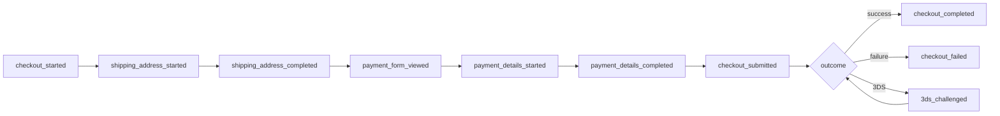
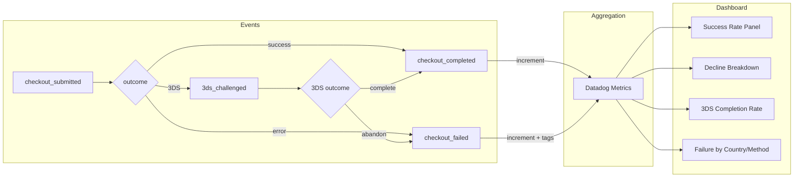
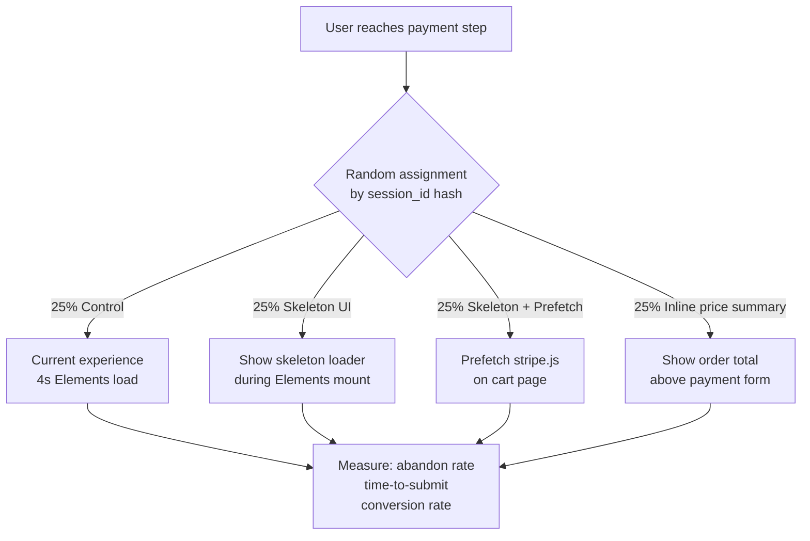
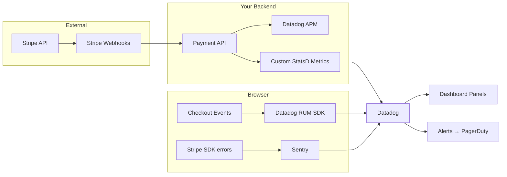
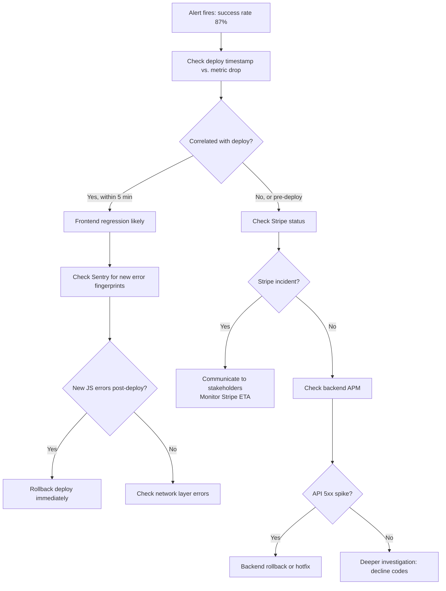

# Section 8: Observability & Analytics

---

## Q1

**Problem framing**

Checkout funnels are multi-step flows where users drop off at every stage. Without precise event instrumentation you can't tell whether users abandon at address entry, payment entry, or order review — meaning you optimize blindly. Granular events with consistent properties let you compute step-level conversion, run cohort analyses, and A/B-test individual stages.

**Approach**

Define one event per discrete funnel boundary. Each event carries a shared "envelope" of properties plus step-specific ones.

```typescript
// Shared envelope attached to every checkout event
interface CheckoutEventBase {
  session_id: string;          // anonymous, per-tab
  checkout_id: string;         // idempotency key for this cart attempt
  user_id?: string;            // logged-in users only
  experiment_variants: Record<string, string>; // active A/B flags
  device_type: 'mobile' | 'tablet' | 'desktop';
  timestamp_ms: number;
}

// --- Step events ---

// Fired when checkout page first renders (before Stripe init)
track('checkout_started', {
  ...base,
  cart_total_cents: 4999,
  currency: 'USD',
  item_count: 3,
  coupon_applied: false,
});

// Fired on first keystroke in any address field
track('shipping_address_started', { ...base });

// Fired when address form passes validation and user advances
track('shipping_address_completed', {
  ...base,
  address_country: 'US',
  address_state: 'CA',
  validation_errors_count: 0,
});

// Fired when Stripe Elements iframe is fully mounted and interactive
track('payment_form_viewed', {
  ...base,
  stripe_elements_load_ms: performance.now() - stripeInitStart,
  payment_methods_shown: ['card', 'apple_pay', 'google_pay'],
});

// Fired on first interaction with card number field (focus event)
track('payment_details_started', {
  ...base,
  payment_method_type: 'card',
});

// Fired when all card fields complete (Stripe onChange complete=true)
track('payment_details_completed', {
  ...base,
  payment_method_type: 'card',
  card_brand: 'visa',         // from Stripe's onChange event — safe to log
  card_funding: 'credit',
  is_saved_card: false,
});

// Fired on "Place Order" button click — before any network call
track('checkout_submitted', {
  ...base,
  payment_method_type: 'card',
  total_cents: 4999,
  submission_attempt: 1,      // increments on retries
});

// Fired when payment confirmation arrives from your backend
track('checkout_completed', {
  ...base,
  outcome: 'success',
  processing_time_ms: 1234,
  requires_3ds: false,
});
```

Funnel calculation in your analytics warehouse (BigQuery / Amplitude):

```sql
SELECT
  DATE(timestamp) AS day,
  COUNTIF(event = 'checkout_started')          AS started,
  COUNTIF(event = 'payment_form_viewed')       AS reached_payment,
  COUNTIF(event = 'payment_details_started')   AS touched_card,
  COUNTIF(event = 'checkout_submitted')        AS submitted,
  COUNTIF(event = 'checkout_completed')        AS completed,
  SAFE_DIVIDE(
    COUNTIF(event = 'checkout_completed'),
    COUNTIF(event = 'checkout_started')
  ) AS overall_cvr
FROM events
WHERE checkout_id IS NOT NULL
GROUP BY day;
```



**Tradeoffs**

- **Page-level vs. field-level granularity**: Tracking every individual field interaction (blur/focus) gives maximum signal but floods your event volume and raises PII risk. The approach above stops at "first interaction" + "completed" for each form section — good enough for funnel analysis without bloat.
- **Client-only vs. server-confirmed events**: `checkout_completed` should be fired on the client when the success screen renders, but also emitted server-side on webhook confirmation. Deduplication by `checkout_id` avoids double-counting; the server event is the source of truth for financial reporting.
- **Amplitude vs. Mixpanel vs. Segment**: Using Segment as a routing layer means you send events once and route to Amplitude for product analytics and BigQuery for ad-hoc SQL — decoupling instrumentation from vendor choice.

---

## Q2

**Problem framing**

"Payment abandonment" is not a single metric — it bundles three behaviorally distinct exits that require completely different product responses. Conflating them leads to misdiagnosis: redesigning the card form when the actual problem is price shock on the order summary page.

**Approach**

Model abandonment as three mutually-exclusive states, tracked via a combination of events and session lifecycle signals:

```typescript
// (a) Pre-engagement abandonment: user sees payment step but never touches it
// Detection: session ends with payment_form_viewed fired but NO payment_details_started
// Use beforeunload + Beacon API to flush a final event
window.addEventListener('beforeunload', () => {
  const state = checkoutStore.getState();
  if (state.step === 'payment' && !state.cardTouched) {
    navigator.sendBeacon('/analytics', JSON.stringify({
      event: 'checkout_abandoned',
      abandonment_type: 'pre_engagement',  // (a)
      checkout_id: state.checkoutId,
      time_on_payment_step_ms: Date.now() - state.paymentStepEnteredAt,
    }));
  }
});

// (b) Mid-entry abandonment: user interacted with card fields but left before submitting
// Detection: payment_details_started fired, checkout_submitted NOT fired
window.addEventListener('beforeunload', () => {
  const state = checkoutStore.getState();
  if (state.step === 'payment' && state.cardTouched && !state.submitted) {
    navigator.sendBeacon('/analytics', JSON.stringify({
      event: 'checkout_abandoned',
      abandonment_type: 'mid_entry',        // (b)
      checkout_id: state.checkoutId,
      fields_completed: state.stripeComplete, // boolean from Stripe onChange
      time_spent_ms: Date.now() - state.cardTouchedAt,
    }));
  }
});

// (c) Post-submit failure: user clicked Pay but request failed
// Detection: checkout_submitted fired, response was an error
async function handleSubmit() {
  track('checkout_submitted', { ...base, submission_attempt: attempt });
  try {
    const result = await stripe.confirmCardPayment(clientSecret);
    if (result.error) {
      track('checkout_failed', {
        ...base,
        abandonment_type: 'post_submit_failure',  // (c)
        error_code: result.error.code,             // e.g. 'card_declined'
        decline_code: result.error.decline_code,   // e.g. 'insufficient_funds'
        error_type: result.error.type,
        submission_attempt: attempt,
      });
    }
  } catch (networkErr) {
    track('checkout_failed', {
      ...base,
      abandonment_type: 'post_submit_failure',
      error_code: 'network_error',
    });
  }
}
```

**Why the distinction drives different decisions:**

| Type | Root cause hypotheses | Product response |
|------|----------------------|-----------------|
| (a) Pre-engagement | Price shock on order summary, missing trust signals, slow Elements load, required account creation | Show trust badges earlier, guest checkout, optimize load time |
| (b) Mid-entry | Form confusion, card not at hand, frustration with CVV/expiry layout, mobile UX friction | UX simplification, saved cards, buy-now-pay-later options |
| (c) Post-submit failure | Decline handling, error message clarity, retry UX, network timeouts | Better error messages, smart retry suggestions, alternative payment methods |

**Tradeoffs**

- **`beforeunload` reliability**: Browsers do not guarantee `beforeunload` fires on mobile tab-switch or app backgrounding. Supplement with a server-side "did this checkout_id ever get a submit?" reconciliation job that runs on sessions older than 30 minutes and back-fills `abandonment_type`.
- **Session replay correlation**: Tools like Datadog Session Replay or FullStory let you click through to a recording of any `mid_entry` abandonment. Tag the session with `abandonment_type` as a custom attribute so support/product can filter replays — far more actionable than just a metric.

---

## Q3

**Problem framing**

Payment flows handle the most sensitive user data: card numbers (PANs), CVVs, expiry dates, and billing addresses. A single accidental log line containing a PAN sent to Sentry or Datadog creates a PCI DSS scope violation that can trigger fines, audits, and loss of card-processing capability. The challenge is being aggressive about sanitization without stripping context that makes errors debuggable.

**Approach**

Layer the defense at three points: **Stripe SDK boundary**, **network request interception**, and **SDK-level scrubbing hooks**.

**Layer 1 — Never touch raw card data**

Stripe Elements renders card fields in a cross-origin iframe — your JavaScript literally cannot read the PAN or CVV. This is the primary protection. The risk comes from other sources: form field values you read yourself, API request/response bodies, and error messages that echo user input.

```typescript
// NEVER do this — reading form values to pass to your own backend
const cardNumber = (document.getElementById('card-number') as HTMLInputElement).value;

// SAFE — let Stripe tokenize in its iframe, only pass the PaymentMethod ID
const { paymentMethod, error } = await stripe.createPaymentMethod({ type: 'card', card: cardElement });
// paymentMethod.id = 'pm_xxxxx' — safe to log
```

**Layer 2 — Sentry scrubbing configuration**

```typescript
// sentry.init configuration
Sentry.init({
  dsn: process.env.SENTRY_DSN,
  beforeSend(event) {
    return sanitizeSentryEvent(event);
  },
  beforeBreadcrumb(breadcrumb) {
    // Strip fetch/XHR breadcrumbs that might contain card data in body
    if (breadcrumb.category === 'fetch' || breadcrumb.category === 'xhr') {
      if (breadcrumb.data?.body) {
        breadcrumb.data.body = '[REDACTED]';
      }
    }
    return breadcrumb;
  },
});

const PAN_PATTERN = /\b(?:\d[ -]?){13,19}\b/g;
const CVV_PATTERN = /\b\d{3,4}\b/g;  // too broad alone — combine with field context
const SENSITIVE_KEYS = new Set([
  'card_number', 'cardNumber', 'pan', 'cvv', 'cvc', 'cvc2',
  'expiry', 'expiration', 'exp_month', 'exp_year',
  'ssn', 'social_security', 'account_number', 'routing_number',
  'password', 'token', 'secret', 'authorization',
]);

function sanitizeSentryEvent(event: Sentry.Event): Sentry.Event {
  // Deep-clone then walk all string values
  const sanitized = JSON.parse(JSON.stringify(event));
  walkAndScrub(sanitized);
  return sanitized;
}

function walkAndScrub(obj: unknown): void {
  if (typeof obj !== 'object' || obj === null) return;
  for (const [key, val] of Object.entries(obj as Record<string, unknown>)) {
    if (SENSITIVE_KEYS.has(key.toLowerCase())) {
      (obj as Record<string, unknown>)[key] = '[REDACTED]';
    } else if (typeof val === 'string') {
      (obj as Record<string, unknown>)[key] = val.replace(PAN_PATTERN, '[PAN-REDACTED]');
    } else {
      walkAndScrub(val);
    }
  }
}
```

**Layer 3 — Datadog RUM custom masking**

```typescript
datadogRum.init({
  // Mask all input fields by default — opt-in to unmasking safe fields
  defaultPrivacyLevel: 'mask',
  // Redact specific URLs that carry card data in query params (shouldn't happen, but defense-in-depth)
  beforeSend(event) {
    if (event.type === 'resource') {
      event.resource.url = event.resource.url.replace(/card_number=[^&]+/, 'card_number=[REDACTED]');
    }
    return true;
  },
});
```

**Layer 4 — Allowed-list for analytics properties**

Maintain an explicit allow-list of properties that may be sent to GA/Amplitude:

```typescript
const ANALYTICS_SAFE_KEYS = new Set([
  'checkout_id', 'session_id', 'user_id', 'event',
  'card_brand', 'card_funding', 'payment_method_type',
  'error_code', 'decline_code', 'amount_cents', 'currency',
]);

function trackSafe(event: string, props: Record<string, unknown>) {
  const safe = Object.fromEntries(
    Object.entries(props).filter(([k]) => ANALYTICS_SAFE_KEYS.has(k))
  );
  analytics.track(event, safe);
}
```

**Tradeoffs**

- **Regex PAN detection is imperfect**: The Luhn algorithm detects valid card numbers more precisely. Add a Luhn check to reduce false positives — but lean toward over-redacting (false positive) rather than under-redacting (false negative). Cost of over-redaction is a less useful error; cost of under-redaction is a PCI incident.
- **Error message content**: Stripe error messages like `"Your card number is incorrect"` are safe; user-typed validation errors that echo their input are not. Sanitize `error.message` fields that originate from user input fields.
- **Sampling vs. full capture**: Some teams disable full request body capture in Datadog APM for `/api/payments/*` routes entirely, trading debuggability for guaranteed compliance. Structured logging of only safe fields (e.g., `payment_intent_id`, HTTP status, duration) is usually sufficient.

---

## Q4

**Problem framing**

Stripe.js is a third-party script (~300 KB) that your users must download, parse, and execute before the card form becomes interactive. If this takes 4 seconds on mobile, users see a spinner or blank form — a primary cause of payment abandonment. RUM data lets you correlate load times with checkout conversion per-session, proving causality for engineering prioritization.

**Approach**

Use the [User Timing API](https://developer.mozilla.org/en-US/docs/Web/API/User_Timing_API) to emit custom `performance.mark()` and `performance.measure()` calls, then ship these to Datadog RUM as custom vitals.

```typescript
// stripe-loader.ts

export async function loadStripeWithTiming(): Promise<Stripe> {
  performance.mark('stripe_js_load_start');

  // loadStripe() fetches stripe.js and resolves when parsed
  const stripe = await loadStripe(process.env.STRIPE_PUBLISHABLE_KEY!);

  performance.mark('stripe_js_load_end');
  performance.measure('stripe_js_load', 'stripe_js_load_start', 'stripe_js_load_end');

  return stripe!;
}

// CheckoutForm.tsx
useEffect(() => {
  performance.mark('stripe_elements_mount_start');

  const elements = stripe.elements({ clientSecret });
  const cardElement = elements.create('payment');

  cardElement.on('ready', () => {
    performance.mark('stripe_elements_mount_end');
    const measure = performance.measure(
      'stripe_elements_mount',
      'stripe_elements_mount_start',
      'stripe_elements_mount_end',
    );

    // Report to Datadog RUM as a custom vital
    datadogRum.addDurationVital('stripe_elements_mount_ms', {
      startTime: measure.startTime,
      duration: measure.duration,
    });

    // Also track via analytics for funnel correlation
    track('payment_form_viewed', {
      ...base,
      stripe_js_load_ms: getEntryDuration('stripe_js_load'),
      stripe_elements_mount_ms: measure.duration,
      connection_type: (navigator as any).connection?.effectiveType ?? 'unknown',
    });
  });

  cardElement.mount('#card-element');
}, [stripe]);

function getEntryDuration(name: string): number {
  const entries = performance.getEntriesByName(name, 'measure');
  return entries.length > 0 ? Math.round(entries[0].duration) : -1;
}
```

**Datadog RUM dashboard panels:**

| Panel | Metric | Query |
|-------|--------|-------|
| P50/P75/P95 Elements mount time | `@duration:stripe_elements_mount_ms` | RUM custom vital, percentile |
| Mount time by device type | Group by `@device.type` | Heatmap |
| Conversion by mount time bucket | `checkout_completed` rate where `stripe_elements_mount_ms > 3000` | Funnel |
| Mount time trend over deployments | Overlaid deploy markers | Time series |

**Correlating load time with drop-off:**

```sql
-- BigQuery: conversion rate by Elements mount time bucket
SELECT
  CASE
    WHEN stripe_elements_mount_ms < 1000 THEN 'fast (<1s)'
    WHEN stripe_elements_mount_ms < 3000 THEN 'medium (1-3s)'
    WHEN stripe_elements_mount_ms < 5000 THEN 'slow (3-5s)'
    ELSE 'very_slow (>5s)'
  END AS load_bucket,
  COUNT(*) AS sessions_reached_payment,
  COUNTIF(checkout_completed) AS conversions,
  ROUND(COUNTIF(checkout_completed) / COUNT(*) * 100, 1) AS cvr_pct
FROM checkout_sessions
GROUP BY load_bucket
ORDER BY load_bucket;
```

**Tradeoffs**

- **`PerformanceObserver` vs. manual marks**: A `PerformanceObserver` watching for `longtask` entries can detect whether the main thread was blocked during Elements mount, giving more diagnostic detail. Add this if you're investigating jank, not just total duration.
- **Resource Timing for stripe.js**: `performance.getEntriesByType('resource')` gives you the raw network timing for `js.stripe.com/v3/` (TTFB, transfer size) without custom instrumentation — useful for separating "slow network" from "slow parse/execute."
- **Synthetic monitoring**: Datadog Synthetics can run a headless browser against your checkout on a cron, emitting `stripe_elements_mount_ms` from a controlled environment — isolates regressions from CDN or Stripe-side slowdowns versus your code changes.

---

## Q5

**Problem framing**

Payment success rate is the north-star metric for a payments frontend. A degradation from 94% to 87% costs real revenue every minute it goes undetected. A real-time dashboard with sensible alerting thresholds lets on-call engineers respond within minutes, not hours.

**Approach**



**Metric definitions (StatsD / Datadog custom metrics):**

```typescript
// Sent from your backend on payment confirmation (authoritative)
// Tags drive slice-and-dice

// On success:
dd.increment('payments.outcome', 1, {
  outcome: 'success',
  payment_method: 'card',
  card_brand: 'visa',
  country: 'US',
  platform: 'web',
});

// On decline:
dd.increment('payments.outcome', 1, {
  outcome: 'declined',
  decline_code: stripeError.decline_code,  // 'insufficient_funds', 'do_not_honor', etc.
  payment_method: 'card',
  country: 'US',
});

// On 3DS:
dd.increment('payments.3ds', 1, {
  outcome: '3ds_required',
  country: 'DE',  // 3DS is heavily triggered in EU/SCA regions
});
dd.increment('payments.3ds', 1, {
  outcome: '3ds_completed',
});
dd.increment('payments.3ds', 1, {
  outcome: '3ds_abandoned',
});
```

**Derived metrics in Datadog:**

```
# Success rate (rolling 5-minute window)
success_rate = payments.outcome{outcome:success} / payments.outcome{*}

# 3DS completion rate
3ds_cvr = payments.3ds{outcome:3ds_completed} /
          (payments.3ds{outcome:3ds_required})

# Decline rate by code — top-N
topn(payments.outcome{outcome:declined}, 10, 'mean', 'top')
```

**Dashboard panels:**

| Panel | Visualization | Window |
|-------|--------------|--------|
| Overall success rate | Big number + sparkline | 5 min rolling |
| Success rate trend | Time series, 95% CI band | 24 h |
| Decline breakdown by code | Stacked bar (top 10 codes) | 1 h |
| 3DS funnel (required → completed → abandoned) | Funnel chart | 1 h |
| Failure rate by country | Choropleth map | 1 h |
| Failure rate by device type | Bar chart | 1 h |
| Error rate by payment method | Multi-series line | 1 h |

**Alerting thresholds:**

```yaml
# Datadog Monitor — page on-call immediately
alert:
  name: "Payment Success Rate Critical"
  query: >
    (sum:payments.outcome{outcome:success}.as_rate() /
     sum:payments.outcome{*}.as_rate()) * 100
  condition: "< 90 for last 5 minutes"
  severity: P1
  notify: pagerduty-payments-oncall

warning:
  condition: "< 93 for last 10 minutes"
  severity: P2
  notify: slack-payments-alerts

# 3DS abandonment spike
alert:
  name: "3DS Abandonment Rate High"
  query: >
    sum:payments.3ds{outcome:3ds_abandoned}.as_rate() /
    sum:payments.3ds{outcome:3ds_required}.as_rate()
  condition: "> 0.30 for last 10 minutes"
  severity: P2
```

**Tradeoffs**

- **Client-side vs. server-side events**: Client-side events fire faster (sub-second) but can be lost on network failure or browser crash. Server-side events (from your API on Stripe webhook) are authoritative but have ~5-30 second webhook latency. For real-time alerting, use client events for speed; reconcile against server events for accuracy in reports.
- **Volume thresholds for alerting**: A 90% threshold on 5 minutes is too noisy during low-traffic periods (midnight: 2 failures out of 20 attempts = 90%, may page unnecessarily). Add a minimum volume gate: `count > 50` in the same window before alerting.

---

## Q6

**Problem framing**

When a card is declined, your UX presents retry options (try another card, check card details, use a different payment method). Without instrumentation, you don't know whether users successfully retry, give up, or keep failing with the same card — and whether your error messages are clear enough to guide recovery.

**Approach**

Model the retry as a mini-funnel, tracking each attempt as an increment on `submission_attempt`:

```typescript
// Retry state in your checkout store
const checkoutStore = {
  submissionAttempt: 0,
  declineHistory: [] as DeclineRecord[],
};

async function handlePaymentSubmit() {
  checkoutStore.submissionAttempt++;

  track('checkout_submitted', {
    ...base,
    submission_attempt: checkoutStore.submissionAttempt,
    is_retry: checkoutStore.submissionAttempt > 1,
    previous_decline_code: checkoutStore.declineHistory.at(-1)?.decline_code,
  });

  const result = await stripe.confirmCardPayment(clientSecret);

  if (result.error) {
    const decline: DeclineRecord = {
      attempt: checkoutStore.submissionAttempt,
      decline_code: result.error.decline_code,
      error_code: result.error.code,
      timestamp: Date.now(),
    };
    checkoutStore.declineHistory.push(decline);

    track('checkout_failed', {
      ...base,
      submission_attempt: checkoutStore.submissionAttempt,
      decline_code: result.error.decline_code,
      error_code: result.error.code,
      // Did we suggest a different action?
      recovery_action_shown: getRecoveryAction(result.error.decline_code),
    });
  }
}

// Track what the user does AFTER seeing the error
function onErrorCTAClick(action: 'retry_same_card' | 'change_card' | 'use_paypal' | 'exit') {
  track('checkout_retry_action', {
    ...base,
    action,
    submission_attempt: checkoutStore.submissionAttempt,
    decline_code: checkoutStore.declineHistory.at(-1)?.decline_code,
  });
}
```

**Metrics that signal the retry flow is working:**

| Metric | Healthy signal | Warning signal |
|--------|---------------|----------------|
| `retry_success_rate` = completions where `submission_attempt > 1` | > 30% of retried checkouts complete | < 15% → error messaging not helping |
| `retry_attempt_count` distribution | Most retries succeed by attempt 2 | Spike in attempt 3+ → users stuck in loop |
| `change_card` CTA click rate after generic decline | > 40% | < 10% → "card declined" message unclear |
| Time between decline and retry action | < 30s → user understood error | > 2min → user confused, may abandon |
| `checkout_abandoned` rate after decline | < 50% | > 70% → UX not recovering users |

```sql
-- Retry success rate by decline code
SELECT
  decline_code,
  COUNT(*) AS declined_sessions,
  COUNTIF(eventually_succeeded) AS recovered,
  ROUND(COUNTIF(eventually_succeeded) / COUNT(*) * 100, 1) AS recovery_rate_pct
FROM (
  SELECT
    session_id,
    decline_code,
    MAX(IF(event = 'checkout_completed', 1, 0)) AS eventually_succeeded
  FROM events
  WHERE event IN ('checkout_failed', 'checkout_completed')
  GROUP BY session_id, decline_code
)
GROUP BY decline_code
ORDER BY declined_sessions DESC;
```

**Tradeoffs**

- **Same `clientSecret` on retry**: Stripe recommends reusing the same `PaymentIntent` (and thus `clientSecret`) across retry attempts rather than creating a new one — this ensures idempotency and links attempts in Stripe's dashboard. Make sure your `checkout_id` in analytics maps 1:1 to `payment_intent_id` so you can cross-reference Stripe's attempt log.
- **Soft vs. hard declines**: Soft declines (e.g., `insufficient_funds`, `try_again_later`) are worth retrying; hard declines (`do_not_honor`, `card_not_supported`) rarely succeed on retry. Segment retry metrics by soft/hard to avoid inflating "retry success rate" with easy wins.

---

## Q7

**Problem framing**

`payment_intent_id` (e.g., `pi_3Abc123`) and `charge_id` (e.g., `ch_3Abc123`) are Stripe-generated identifiers that uniquely reference a specific payment transaction. Sending these to third-party analytics (GA4, Amplitude, Mixpanel) creates risks that require explicit evaluation rather than a default yes or no.

**Approach**

**Risks of including these identifiers:**

1. **Data linkage / re-identification**: If an attacker or rogue employee gains access to your analytics dataset AND your Stripe dashboard, they can cross-reference `payment_intent_id` to retrieve full transaction details (amount, card brand, billing address, Stripe customer ID). This enables targeted fraud, identity theft, or regulatory exposure.

2. **Third-party data sharing**: Google Analytics, Amplitude, and Mixpanel collect data under their own privacy policies. Sharing transaction identifiers means those vendors now hold data that links an anonymous session to a specific financial transaction — this may violate GDPR Article 25 (data minimization) or CCPA.

3. **PCI DSS scope expansion**: While `pi_xxxxx` is not cardholder data (CHD) itself, Stripe's documentation and PCI assessors may consider systematically logging payment identifiers in unsecured third-party systems to be a scope expansion, requiring those systems to be included in your PCI audit.

4. **Regulatory subpoena exposure**: If your analytics vendor is subpoenaed, transaction-linked session data becomes discoverable — a legal risk your legal team should evaluate.

**When it IS acceptable:**

```typescript
// Scenario A: First-party data warehouse (BigQuery/Redshift) — generally OK
// You control the data, encryption at rest, access controls, retention policies
analyticsWarehouse.write({
  session_id: sessionId,
  payment_intent_id: paymentIntentId,  // ✓ OK in your own controlled system
  outcome: 'success',
  timestamp: Date.now(),
});

// Scenario B: Third-party analytics — avoid or hash
// If you need to correlate across systems without exposing the raw ID:
const hashedId = await crypto.subtle.digest(
  'SHA-256',
  new TextEncoder().encode(paymentIntentId + ANALYTICS_SALT)
);
const safeCorrelationId = bufferToHex(hashedId).slice(0, 16);

analytics.track('checkout_completed', {
  session_id: sessionId,
  correlation_id: safeCorrelationId,  // ✓ not reversible to payment_intent_id
  outcome: 'success',
});
```

**Decision framework:**

| Destination | Include raw `pi_xxxxx`? | Rationale |
|-------------|------------------------|-----------|
| Your own data warehouse | ✅ Yes | Controlled, auditable, within your PCI scope |
| Sentry error monitoring | ✅ Yes (as tag, not PII) | Helps debug specific failed payments; Sentry is PCI-compliant |
| Datadog RUM/APM | ✅ Yes | Operational tooling, not marketing analytics |
| Amplitude/Mixpanel | ⚠️ Only with legal sign-off | Third-party with its own data use |
| Google Analytics (GA4) | ❌ No | Data is shared with Google; violates data minimization |
| Segment (as passthrough to GA) | ❌ No | Same as above |

**Tradeoffs**

- **Debuggability vs. compliance**: Excluding `payment_intent_id` from Sentry events makes it harder to pull up the exact Stripe payment in their dashboard when debugging a failure. The compromise: include it in Sentry (operational tool, justified) but not in marketing analytics.
- **Hashing provides weak protection**: A hashed ID prevents direct lookup but is still a unique identifier that links events across sessions — if both the analytics and Stripe data are leaked, the hash can be brute-forced for the relatively small space of `pi_xxxxx` IDs. Hashing reduces risk; it does not eliminate it.

---

## Q8 *(Deep)*

**Problem framing**

23% abandonment at the payment step is a significant but ambiguous signal. Multiple hypotheses compete: slow Elements load time, price shock on the order summary, friction from required account creation, or missing trust signals. Before investing engineering effort in Stripe load optimization, you need to establish causal responsibility — correlation between "4-second load" and "abandonment" is not causation, because slow-loading sessions may also be low-intent users on poor connections.

**Approach**

**Step 1 — Instrument to generate per-hypothesis data**

```typescript
// H1: Elements load time
track('payment_form_viewed', {
  stripe_elements_mount_ms: elementsMountDuration,
  connection_effective_type: navigator.connection?.effectiveType,
  device_memory_gb: navigator.deviceMemory,
});

// H2: Price shock — did the user scroll to see the total?
const observer = new IntersectionObserver(([entry]) => {
  if (entry.isIntersecting) {
    track('order_total_visible', { checkout_id, total_cents });
  }
}, { threshold: 0.8 });
observer.observe(document.getElementById('order-total')!);

// H3: Account creation friction
track('account_required_shown', {
  checkout_id,
  gate_type: 'hard_require' | 'soft_nudge',
});
track('guest_checkout_clicked', { checkout_id });

// H4: Trust signals — scroll depth before abandonment
document.addEventListener('scroll', throttle(() => {
  const depth = Math.round((window.scrollY / document.body.scrollHeight) * 100);
  checkoutStore.maxScrollDepth = Math.max(checkoutStore.maxScrollDepth, depth);
}, 500));
// Flush maxScrollDepth in the abandonment beacon
```

**Step 2 — Observational analysis before running an experiment**

```sql
-- Check if load time alone explains abandonment
SELECT
  CASE WHEN stripe_elements_mount_ms > 3000 THEN 'slow' ELSE 'fast' END AS load_speed,
  AVG(abandoned) AS abandonment_rate,
  COUNT(*) AS n
FROM sessions
WHERE reached_payment_step = TRUE
GROUP BY load_speed;

-- Control for connection type (confound)
SELECT
  connection_effective_type,
  CASE WHEN stripe_elements_mount_ms > 3000 THEN 'slow' ELSE 'fast' END AS load_speed,
  AVG(abandoned) AS abandonment_rate
FROM sessions
GROUP BY 1, 2;
```

If slow-connection users have both slow load AND higher abandonment regardless of load time, load time is a proxy for connection quality, not the causal variable.

**Step 3 — Design the experiment**



**Instrumentation additions for the experiment:**

```typescript
// 1. Tag every event with experiment assignment
const experimentVariant = getVariantForSession(sessionId, 'stripe-load-experiment');
// variant: 'control' | 'skeleton_ui' | 'skeleton_prefetch' | 'price_summary'

// 2. For skeleton_prefetch: measure actual vs. perceived load time
performance.mark('stripe_prefetch_start'); // on cart page
performance.mark('stripe_prefetch_end');   // when stripe.js resolves on cart
// On checkout page, Elements mounts near-instantly — measure perceived time
performance.mark('payment_form_interactive'); // on Elements 'ready'

// 3. Capture whether user scrolled to see total BEFORE abandoning
// This isolates H2 (price shock) from H1 (load time)
```

**Isolating the variable — statistical requirements:**

- **Sample size**: With 23% baseline abandonment, to detect a 3pp improvement (23%→20%) at 80% power, α=0.05 → ~2,500 sessions per variant. At typical checkout traffic, this may take 1-2 weeks.
- **Guardrail metrics**: Monitor `checkout_error_rate` and `stripe_js_load_error` — a variant that aggressively prefetches Stripe might cause resource contention on slow devices.
- **Segmented analysis**: Run treatment effect analysis separately for `connection_effective_type IN ('slow-2g', '3g')` — the experiment hypothesis is most relevant for these users.

**Tradeoffs**

- **A/B test vs. regression discontinuity**: If you can't randomize (e.g., you already deployed the skeleton loader), use a regression discontinuity design around the deploy timestamp — compare abandonment immediately before vs. after while controlling for time-of-day effects.
- **Novelty effect**: Users seeing a skeleton loader may behave differently initially because it's new, not because it's faster. Run the experiment long enough (at least 2 full weekly cycles) to wash out novelty.

---

## Q9 *(Deep)*

**Problem framing**

When a payment incident hits, the on-call engineer needs answers in 60 seconds: how bad is it, where is the failure, and who is affected. This requires pre-built observability infrastructure — you cannot instrument after the fact.

**Approach**



**Event taxonomy for incident isolation:**

```typescript
// Event 1: Attempt registered (fires before any network call)
track('payment_attempt', {
  checkout_id, session_id, payment_method: 'card',
  country: billingCountry, device_type,
});

// Event 2a: Stripe SDK error (client-side, before hitting your API)
cardElement.on('change', (e) => {
  if (e.error) {
    dd.increment('payments.stripe_sdk_error', { error_code: e.error.code });
  }
});
stripe.confirmCardPayment(clientSecret).then(result => {
  if (result.error) {
    const layer = classifyError(result.error);
    // layer: 'stripe_client' | 'your_api' | 'network'
    dd.increment('payments.failure', { layer, error_code: result.error.code });
  }
});

// Error layer classification
function classifyError(error: StripeError): FailureLayer {
  if (error.type === 'validation_error' || error.type === 'card_error') {
    return 'stripe_client';      // Stripe processed it; card rejected
  }
  if (error.type === 'api_connection_error') {
    return 'network';            // Could not reach Stripe OR your API
  }
  if (error.type === 'api_error') {
    return 'your_api';           // Your backend returned 5xx
  }
  return 'unknown';
}

// Event 2b: Your API response time and status
// (Emitted from your backend, correlated by checkout_id)
dd.histogram('payments.api_latency_ms', durationMs, { status_code: '200' });
dd.increment('payments.api_response', { status: '5xx', route: '/payments/confirm' });
```

**Three dashboard panels for 60-second diagnosis:**

**Panel 1 — Success rate in real time (top of dashboard, large number)**
```
Query: sum:payments.outcome{outcome:success}.as_rate() /
       sum:payments.outcome{*}.as_rate() * 100
Display: Large number + trend arrow + red/yellow/green background
Refresh: 10 seconds
```

**Panel 2 — Failure layer breakdown (stacked time series)**
```
Query A (stripe_client failures):
  sum:payments.failure{layer:stripe_client}.as_rate()

Query B (your API failures):
  sum:payments.failure{layer:your_api}.as_rate()

Query C (network failures):
  sum:payments.failure{layer:network}.as_rate()

Display: Stacked bar chart, last 30 minutes, 1-minute granularity
Interpretation: spike in your_api = backend regression; spike in stripe_client = Stripe issue
```

**Panel 3 — Failure rate by segment (table)**
```
Rows: country (top 10 by volume)
Columns: payment method, device type
Value: failure_rate = failures / attempts * 100
Conditional formatting: red if > 15%, yellow if > 8%
Refresh: 30 seconds
```

**Supplementary panels for root-cause depth:**

```
Panel 4: Stripe SDK error codes — top 10 bar chart (updated every 60s)
Panel 5: Your API error rate by endpoint — table
Panel 6: Network error rate by geographic region — map
Panel 7: 3DS abandonment rate — time series
Panel 8: Sentry error rate grouped by fingerprint — table with links
```

**Alerting configuration for 60-second detection:**

```yaml
monitors:
  - name: "Payments: Success Rate Critical Drop"
    type: metric_alert
    query: >
      avg(last_5m):
        sum:payments.outcome{outcome:success}.as_rate() /
        sum:payments.outcome{*}.as_rate() * 100
    critical: 88
    warning: 92
    require_full_window: false  # alert even on partial data
    new_group_delay: 0          # no delay on new tags

  - name: "Payments: API Layer Spike"
    query: >
      sum(last_2m):payments.failure{layer:your_api}.as_count()
    critical: 50   # 50 API-layer failures in 2 minutes = page immediately

  - name: "Payments: Network Error Spike"
    query: >
      sum(last_2m):payments.failure{layer:network}.as_count()
    critical: 30
```

**Tradeoffs**

- **Client vs. server-side `payments.outcome` events**: Relying solely on client events for real-time rate is risky — browser crashes and ad-blockers suppress events. Run both client and server metrics in parallel; for alerting, use server-side (webhook-derived) as primary truth since it has zero loss, accepting ~10-30s webhook latency.
- **Cardinality explosion**: Tagging by `country × payment_method × device_type` creates up to hundreds of unique metric tag combinations. Use Datadog's `percentile` aggregation and avoid unbounded tags (like `user_id`) to stay within cardinality limits. Segment analysis at query time rather than metric emission time.

---

## Q10 *(Deep)*

**Problem framing**

Success rate drops from 94% to 87% — a 7-point drop that, at any meaningful payment volume, represents tens of thousands of dollars per hour in lost revenue. You have three possible culprits: a frontend regression from your deploy, a Stripe-side issue, or a backend API regression. Your diagnostic playbook must distinguish these within minutes and give you clear rollback criteria.

**Approach**



**Step 1 — Correlate the deploy timestamp (< 2 minutes)**

```bash
# Get last 5 deploy times from your CI/CD system
# In Datadog, add deploy events as annotations on dashboards:
curl -X POST "https://api.datadoghq.com/api/v1/events" \
  -H "DD-API-KEY: $DD_API_KEY" \
  -d '{
    "title": "Deploy: payments-frontend v2.4.1",
    "text": "Deployed at 14:32 UTC",
    "tags": ["service:payments-frontend", "env:production"],
    "alert_type": "info"
  }'
```

In Datadog's success rate time series, overlay the deploy event marker. If the metric drop begins within 1-2 minutes of the deploy timestamp, frontend causation is highly probable.

**Step 2 — Check Stripe's status page (< 1 minute)**

```bash
# Stripe status API — check programmatically
curl https://status.stripe.com/api/v2/status.json | jq '.status.description'

# Also check components (card processing specifically)
curl https://status.stripe.com/api/v2/components.json | jq '.components[] | select(.name | contains("Card"))'
```

If Stripe shows "investigating" or "degraded," stop — this is not your regression. Communicate to stakeholders with Stripe's incident link and set a monitor on their status RSS feed.

**Step 3 — Sentry: new error fingerprints post-deploy (< 3 minutes)**

In Sentry, filter by:
- **Time range**: Last 30 minutes
- **Tag**: `release:v2.4.1` (deploy version, set via `Sentry.init({ release })`)
- **Sort**: Newest first

Look for:
```
# Typical frontend regression signatures:
TypeError: Cannot read properties of undefined (reading 'confirmCardPayment')
  → Stripe object not initialized — likely a loading order regression

StripeError: No such payment_intent: 'pi_xxx'
  → clientSecret is stale or not being passed — likely a state management regression

NetworkError: Failed to fetch /api/payments/confirm
  → API endpoint URL changed or CORS misconfigured in deploy
```

**Step 4 — Datadog RUM: client-side error rate by version**

```
RUM Query: @type:error @view.name:Checkout
Filter by: @application.version:2.4.1 vs @application.version:2.4.0
Compare: Error count, error rate, JS exception rate
```

**Step 5 — Datadog APM: backend error rate**

```
APM → Services → payments-api
Filter: Last 30 min, env:production
Look at:
  - HTTP 5xx rate (should be < 0.5% baseline)
  - Latency P95 (spike could cause client timeouts)
  - Trace: /api/payments/confirm endpoint specifically
```

If APM shows your backend is healthy (low error rate, normal latency) but the client-side failure rate is high, the failure is in the frontend or in Stripe's API (since Stripe errors surface as `card_error` not 5xx from your backend).

**Step 6 — Check decline code distribution (< 5 minutes)**

```sql
-- BigQuery (or Datadog metric breakdown): has the decline code distribution shifted?
SELECT
  decline_code,
  COUNT(*) AS count,
  ROUND(COUNT(*) / SUM(COUNT(*)) OVER () * 100, 1) AS pct
FROM payments
WHERE created_at > TIMESTAMP_SUB(CURRENT_TIMESTAMP(), INTERVAL 30 MINUTE)
GROUP BY decline_code
ORDER BY count DESC;
```

If `do_not_honor` or `generic_decline` spikes without a corresponding Stripe incident, it may be a Stripe-side routing issue even without a formal incident post.

**Step 7 — Stripe Dashboard**

In Stripe's Dashboard:
- **Payments → Overview**: Check authorization rate graph for the last hour
- **Payments → Failed payments**: Filter by time, look for new error codes
- **Radar**: Check if a new Radar rule was accidentally deployed (Stripe has its own deploy cycle)
- **Developers → Events**: Filter for `payment_intent.payment_failed` in the last 30 min and examine `last_payment_error`

**Rollback decision criteria:**

| Signal | Action |
|--------|--------|
| New Sentry errors correlated with `release:v2.4.1` + success rate drop within 5 min of deploy | **Rollback immediately** |
| Stripe status shows active incident | **Hold rollback**, monitor Stripe ETA, communicate |
| Backend APM shows 5xx spike with no Sentry frontend errors | **Backend rollback**, not frontend |
| Decline codes shifted dramatically (new code pattern) with Stripe healthy | **Escalate to Stripe support** with `payment_intent_id` examples |
| No clear signal after 10 minutes | **Rollback as precaution**, investigate from clean baseline |

```bash
# Frontend rollback (assuming Vercel/CloudFront instant rollback)
vercel rollback --to=v2.4.0 --scope=production

# Or feature-flag rollback if using LaunchDarkly
ldcli flags update payments-new-checkout-flow --off --environment=production
```

**Tradeoffs**

- **Rollback vs. hotfix**: If the regression is a one-line bug (e.g., wrong Stripe API version string), a hotfix deploy is faster than rollback in some CI/CD systems. But at 7-point success rate drop, the revenue loss per minute of investigation exceeds most hotfix windows — bias toward rollback unless the fix is trivially obvious.
- **False positives from Stripe's "no incident"**: Stripe publishes incidents with a lag. A success rate drop that preceded a Stripe incident post by 20 minutes is not your regression. Cross-reference Stripe's `payment_intent.payment_failed` webhook volume against your historical baseline before concluding it's your code.
