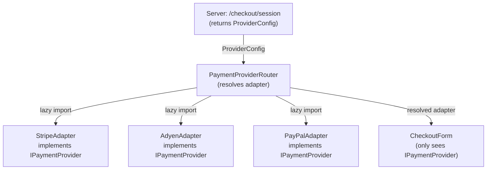
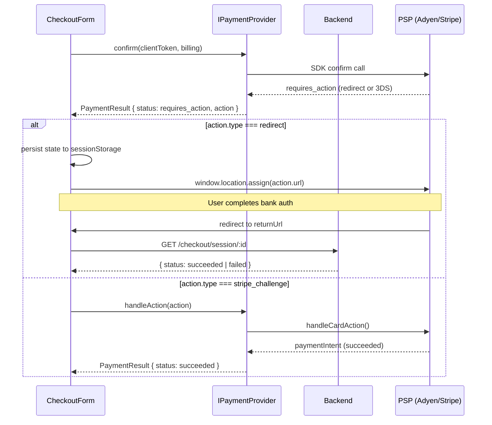
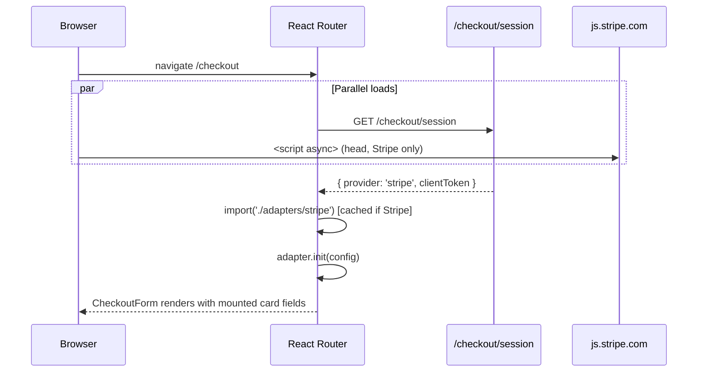
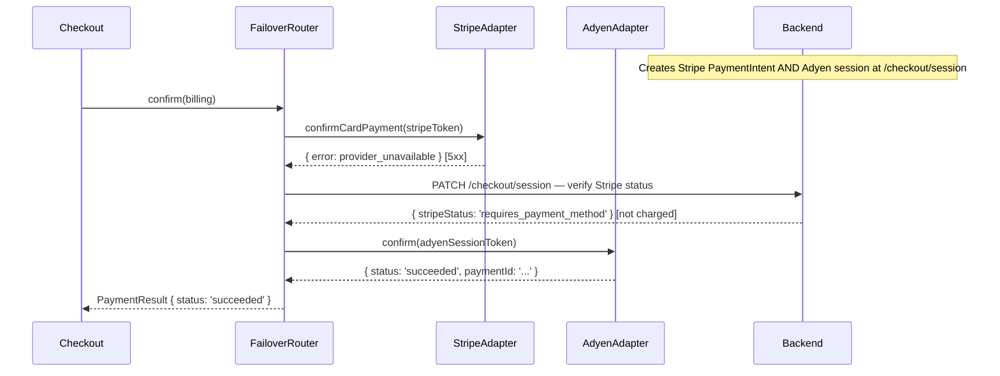

# Section 9: Architecture & Provider Abstraction

---

## Q1

**Problem framing**

As a platform grows it often needs to route payments to multiple PSPs: Stripe for cards in the US, Adyen for EU enterprise merchants, PayPal for wallet users, or Klarna for BNPL. The checkout UI should not care which PSP is active — that coupling makes A/B tests, failover, and migrations painful. The challenge is designing an abstraction layer whose seams are in the right places.

**Approach**

Define a `IPaymentProvider` interface. All PSP adapters implement it. The checkout component only calls the interface.

```typescript
// The contract every PSP adapter must satisfy
interface IPaymentProvider {
  readonly providerId: 'stripe' | 'adyen' | 'paypal' | 'braintree';

  /** Load the PSP SDK script; idempotent */
  init(config: ProviderConfig): Promise<void>;

  /** Mount card / wallet UI into the given container */
  mount(containerId: string, options: MountOptions): Promise<void>;

  /** Unmount and clean up DOM + listeners */
  unmount(): void;

  /** Confirm the payment with the server-issued client token */
  confirm(clientToken: string, billingDetails: BillingDetails): Promise<PaymentResult>;

  /** Handle a 3DS / redirect challenge */
  handleAction(actionPayload: unknown): Promise<PaymentResult>;

  /** Expose current validation state */
  getFieldState(): PaymentFieldState;
}

// Unified result — no PSP-specific fields on the success path
interface PaymentResult {
  status: 'succeeded' | 'requires_action' | 'failed';
  paymentId: string;          // normalised to our internal ID
  action?: RedirectAction | ChallengeAction;
  error?: FrontendPaymentError; // see Q6
  raw?: unknown;              // PSP-specific payload for logging only
}
```

The **router** selects which adapter to instantiate based on a server-supplied config:

```typescript
// Server sends this with the session response
interface ProviderConfig {
  provider: 'stripe' | 'adyen' | 'paypal';
  clientToken: string;        // PaymentIntent client_secret or Adyen session token
  publishableKey?: string;
  environment: 'live' | 'sandbox';
}

// Factory / registry
class PaymentProviderRouter {
  private adapters: Map<string, IPaymentProvider> = new Map();

  async resolve(config: ProviderConfig): Promise<IPaymentProvider> {
    if (!this.adapters.has(config.provider)) {
      const { default: Adapter } = await import(`./adapters/${config.provider}`);
      this.adapters.set(config.provider, new Adapter());
    }
    const adapter = this.adapters.get(config.provider)!;
    await adapter.init(config);
    return adapter;
  }
}
```

The checkout component never imports `StripeAdapter` directly — it only holds an `IPaymentProvider` ref received from the router.



**Tradeoffs**

| Approach | Pros | Cons |
|---|---|---|
| Interface-based adapters (above) | Full checkout isolation, easy to swap providers | Adapters require ongoing maintenance as PSP APIs evolve |
| Thin shim (pass-through) | Low upfront effort | Leaks PSP concepts into UI; migration = rewrite |
| Server-side rendering of PSP SDK | No client JS from PSP | Loses SDK's fraud signals and 3DS handling |

The main risk: PSP SDKs evolve — an Adyen Web Components major version can break your adapter. Pin SDK versions and add integration tests against each adapter independently.

---

## Q2

**Problem framing**

Stripe mounts a `CardElement` via `elements.create('card').mount('#id')`. Adyen uses `new AdyenCheckout(config).create('card').mount('#id')`. Braintree uses `braintree.hostedFields.create(...)`. Each has different event names, validation callbacks, and confirmation APIs. The goal is one interface all three fit behind.

**Approach**

Map each PSP API's lifecycle to the four `IPaymentProvider` methods: `init`, `mount`, `confirm`, `handleAction`.

```typescript
// StripeAdapter
class StripeAdapter implements IPaymentProvider {
  readonly providerId = 'stripe' as const;
  private stripe!: Stripe;
  private elements!: StripeElements;
  private cardElement!: StripeCardElement;
  private onChangeHandler?: (e: StripeCardElementChangeEvent) => void;

  async init(config: ProviderConfig) {
    await loadStripeJs(); // lazy — see Q7
    this.stripe = Stripe(config.publishableKey!);
    this.elements = this.stripe.elements({ locale: 'auto' });
  }

  async mount(containerId: string, options: MountOptions) {
    this.cardElement = this.elements.create('card', {
      style: options.style,
      hidePostalCode: options.hidePostalCode,
    });
    this.cardElement.mount(`#${containerId}`);

    // Normalise Stripe's onChange to our unified field state
    this.onChangeHandler = (e) => options.onFieldChange?.({
      complete: e.complete,
      empty: e.empty,
      error: e.error ? normaliseStripeFieldError(e.error) : undefined,
    });
    this.cardElement.on('change', this.onChangeHandler);
  }

  unmount() {
    this.cardElement.off('change', this.onChangeHandler);
    this.cardElement.destroy();
  }

  async confirm(clientToken: string, billing: BillingDetails): Promise<PaymentResult> {
    const { paymentIntent, error } = await this.stripe.confirmCardPayment(clientToken, {
      payment_method: { card: this.cardElement, billing_details: toStripeBilling(billing) },
    });
    if (error) return { status: 'failed', paymentId: '', error: normaliseStripeError(error) };
    if (paymentIntent?.status === 'requires_action') {
      return { status: 'requires_action', paymentId: paymentIntent.id,
               action: { type: 'stripe_action', payload: paymentIntent } };
    }
    return { status: 'succeeded', paymentId: paymentIntent!.id };
  }

  async handleAction(payload: unknown): Promise<PaymentResult> {
    const { paymentIntent, error } = await this.stripe.handleCardAction(
      (payload as { client_secret: string }).client_secret
    );
    if (error) return { status: 'failed', paymentId: '', error: normaliseStripeError(error) };
    return { status: 'succeeded', paymentId: paymentIntent!.id };
  }

  getFieldState(): PaymentFieldState {
    // Stripe doesn't expose this synchronously — adapter tracks via onChange
    return this._cachedFieldState;
  }
}
```

```typescript
// AdyenAdapter — fundamentally different API, same interface
class AdyenAdapter implements IPaymentProvider {
  readonly providerId = 'adyen' as const;
  private checkout!: AdyenCheckout;
  private cardComponent!: AdyenComponent;

  async init(config: ProviderConfig) {
    const { default: AdyenCheckout } = await import('@adyen/adyen-web');
    this.checkout = new AdyenCheckout({
      environment: config.environment === 'live' ? 'live' : 'test',
      clientKey: config.publishableKey,
      session: { id: config.clientToken, shopperLocale: 'en-US' },
    });
  }

  async mount(containerId: string, options: MountOptions) {
    this.cardComponent = this.checkout.create('card', {
      onFieldValid: (data) => options.onFieldChange?.(normaliseAdyenFieldEvent(data)),
    });
    this.cardComponent.mount(`#${containerId}`);
  }

  // ... confirm maps to this.cardComponent.submit() + session result polling
}
```

**Tradeoffs**

The normalisation layer adds an indirection cost: when Stripe ships a new API (e.g., Link, Payment Element replacing Card Element), the adapter must be updated before that feature is available. Teams often hit this when upgrading Stripe.js from v2 to v3 — the Card Element API changed substantially. Consider keeping adapters versioned (`StripeAdapterV3`) so rollback is safe.

---

## Q3

**Problem framing**

A PSP-agnostic data model for payment methods must express "card," "bank transfer," "wallet," and BNPL without referencing Stripe's `PaymentMethod` shape or Adyen's `paymentMethodsResponse`. This config drives which UI components render and which adapter code paths activate.

**Approach**

Define a `PaymentMethodConfig` returned by the server — server-side abstraction prevents leaking PSP details:

```typescript
// Returned by GET /checkout/session
interface CheckoutSession {
  sessionId: string;
  provider: ProviderConfig;
  availablePaymentMethods: PaymentMethodConfig[];
  defaultMethod: string;  // slug
}

type PaymentMethodType = 'card' | 'bank_transfer' | 'wallet' | 'bnpl' | 'voucher';

interface PaymentMethodConfig {
  slug: string;               // e.g. 'card', 'paypal', 'klarna', 'ideal'
  type: PaymentMethodType;
  displayName: string;        // "Credit or Debit Card"
  logoUrl: string;
  countries: string[];        // ISO 3166-1 alpha-2
  currencies: string[];       // ISO 4217
  requiresRedirect: boolean;  // Adyen iDEAL, PayPal, Klarna → true
  fields: PaymentFieldSchema[]; // for bank transfer: sort code, account number
}

interface PaymentFieldSchema {
  id: string;           // 'iban', 'sort_code', 'bsb'
  label: string;
  type: 'text' | 'numeric' | 'select';
  options?: { label: string; value: string }[]; // for select (bank list)
  validation: { pattern?: string; maxLength?: number };
}
```

The checkout UI renders from this config. A card method shows the PSP card element; a `bank_transfer` method with `fields` renders generic text inputs; a `wallet` method (PayPal) may show only a button that triggers the wallet SDK.

```typescript
// CheckoutForm — driven entirely by config, no PSP imports
function CheckoutForm({ session }: { session: CheckoutSession }) {
  const [selected, setSelected] = useState(session.defaultMethod);
  const method = session.availablePaymentMethods.find(m => m.slug === selected)!;

  return (
    <>
      <PaymentMethodSelector methods={session.availablePaymentMethods} onSelect={setSelected} />
      {method.type === 'card' && <CardFields providerId={session.provider.provider} />}
      {method.type === 'bank_transfer' && <BankTransferFields fields={method.fields} />}
      {method.type === 'wallet' && <WalletButton method={method} />}
      {method.type === 'bnpl' && <BnplWidget method={method} />}
    </>
  );
}
```

**Tradeoffs**

- **Server-driven config** means adding Klarna doesn't require a frontend deploy — but server and client must stay in schema sync. Use JSON Schema validation on both sides.
- **PSP-agnostic field IDs** work for generic bank transfers, but some PSPs (Adyen) pass back field-level metadata the server may need to forward. Add a `providerHints: unknown` passthrough field on `PaymentMethodConfig` for edge cases.
- **BNPL complexity**: Klarna, Afterpay, and Affirm each have different eligibility signals (cart value, shopper country). The config's `countries`/`currencies` filters handle eligibility at render time, but dynamic eligibility (e.g., cart value threshold) still requires a real-time check.

---

## Q4

**Problem framing**

Stripe's 3DS is handled inline via `confirmCardPayment` — the challenge happens in an iframe without leaving the page. Adyen iDEAL requires a full-page redirect to the bank's site. Your abstraction layer must handle both without the checkout component knowing which flow fires.

**Approach**

The `PaymentResult.action` discriminated union captures both patterns:

```typescript
type PaymentAction =
  | { type: 'stripe_challenge'; clientSecret: string }
  | { type: 'redirect'; url: string; returnUrl: string }
  | { type: 'adyen_action'; actionPayload: AdyenAction }
  | { type: 'none' };
```

Each adapter's `confirm()` returns the appropriate action type. The checkout's action handler dispatches:

```typescript
async function handlePaymentAction(action: PaymentAction, provider: IPaymentProvider) {
  switch (action.type) {
    case 'stripe_challenge':
      // Stripe handles inline — no navigation
      return provider.handleAction(action);

    case 'redirect':
      // Persist checkout state before leaving
      sessionStorage.setItem('pendingCheckout', JSON.stringify({
        sessionId: currentSession.id,
        returnTo: window.location.href,
      }));
      window.location.assign(action.url);
      // No return — page navigates away
      break;

    case 'adyen_action':
      // Adyen's drop-in handles the action inline (could be redirect or QR etc.)
      return provider.handleAction(action.actionPayload);
  }
}
```

For redirect flows, the return URL lands on a `/payment/return` page that reads the session from storage and calls `GET /checkout/session/:id` to check the final status — provider-agnostic outcome polling.



**Tradeoffs**

The redirect case breaks React state entirely — the page reloads. Store just enough in `sessionStorage` to re-hydrate the success/failure UI on return. Avoid storing sensitive fields. The risk is the user's browser blocks the redirect or they close the tab — handle this with the webhook-to-UI polling described in section 04.

---

## Q5

**Problem framing**

When building a PSP abstraction, you choose between two extremes: a "thin shim" that just renames methods, or a "rich unified API" that irons out all PSP differences. Both fail in different ways as the system grows.

**Approach**

**Thin shim**: The interface just delegates with minimal transformation. `stripeAdapter.confirm()` calls `stripe.confirmCardPayment()` and returns the raw result. Almost no normalisation.

- **Breaks when**: the checkout component starts accumulating `if (provider === 'stripe')` branches to handle PSP-specific error shapes, 3DS flows, or field validation quirks. The abstraction provides no value — the seam is at the wrong level.

**Rich unified API**: The interface fully normalises errors, field state, action types, and success shapes. Adapters do heavy lifting.

- **Breaks when**: a PSP ships a feature that has no analogue in your interface — e.g., Stripe Link (one-click checkout) or PayPal's Pay Later messaging. You either extend the interface (breaking other adapters) or bypass it (defeating the abstraction).

**Practical middle ground**: Define the interface around **checkout lifecycle events** rather than PSP API shapes. The interface has `mount`, `confirm`, `handleAction`, `getFieldState` — not `createPaymentMethod` or `retrievePaymentIntent`. PSP features that don't map into the lifecycle are exposed as **opt-in capability flags**:

```typescript
interface IPaymentProvider {
  // ... core lifecycle ...

  // Optional capabilities — adapters declare what they support
  capabilities: {
    oneTouchCheckout: boolean;  // Stripe Link, PayPal one-touch
    walletButtons: boolean;     // Apple Pay, Google Pay via this provider
    bnplMessaging: boolean;     // Klarna placement widget
  };

  // Only call if capabilities.oneTouchCheckout === true
  triggerOneTouch?(): Promise<PaymentResult>;
}
```

The checkout UI checks capabilities before rendering optional features. This keeps the common path clean while allowing PSP-specific features to opt in incrementally.

**Tradeoffs**

| | Thin Shim | Rich Unified API | Lifecycle + Capabilities |
|---|---|---|---|
| Upfront cost | Low | High | Medium |
| PSP leakage into UI | High over time | None | Low |
| New PSP feature support | Easy (just delegate) | Requires interface change | Capability flag |
| Adapter complexity | Low | High | Medium |

---

## Q6

**Problem framing**

Stripe returns `{ error: { code: 'card_declined', decline_code: 'insufficient_funds', message: '...' } }`. Adyen returns `{ resultCode: 'Refused', refusalReason: 'Not enough balance', refusalReasonCode: '8' }`. Braintree returns `{ transaction: { status: 'processor_declined', processorResponseCode: '2001' } }`. The checkout UI needs actionable categories; the support team needs the raw PSP detail.

**Approach**

Define a `FrontendPaymentError` enum with UI-actionable categories, and attach the raw PSP payload alongside:

```typescript
type PaymentErrorCategory =
  | 'insufficient_funds'        // "Your card has insufficient funds"
  | 'card_declined_generic'     // "Your card was declined" (don't reveal reason)
  | 'authentication_required'   // → trigger 3DS / redirect
  | 'expired_card'
  | 'incorrect_cvc'
  | 'do_not_retry'              // stolen card, fraud — hard stop
  | 'network_error'             // timeout, SDK load failure
  | 'provider_unavailable'      // PSP 5xx
  | 'unknown';

interface FrontendPaymentError {
  category: PaymentErrorCategory;
  userMessage: string;           // pre-localised, safe to display
  retryable: boolean;
  raw: {                         // never shown to user; sent to logging/support
    provider: string;
    code: string;
    message: string;
  };
}
```

Each adapter's normaliser maps PSP codes to categories:

```typescript
// stripe-adapter/normalise-error.ts
const STRIPE_CODE_MAP: Record<string, PaymentErrorCategory> = {
  insufficient_funds:   'insufficient_funds',
  card_declined:        'card_declined_generic',
  expired_card:         'expired_card',
  incorrect_cvc:        'incorrect_cvc',
  authentication_required: 'authentication_required',
  stolen_card:          'do_not_retry',
  fraudulent:           'do_not_retry',
  // ... etc
};

export function normaliseStripeError(err: StripeError): FrontendPaymentError {
  const category = STRIPE_CODE_MAP[err.decline_code ?? err.code ?? ''] ?? 'unknown';
  return {
    category,
    userMessage: USER_MESSAGES[category],  // i18n key lookup
    retryable: !['do_not_retry', 'unknown'].includes(category),
    raw: { provider: 'stripe', code: err.code ?? '', message: err.message ?? '' },
  };
}
```

```typescript
// adyen-adapter/normalise-error.ts — Adyen refusal reason codes
const ADYEN_REFUSAL_MAP: Record<string, PaymentErrorCategory> = {
  '2':  'card_declined_generic',  // Refused
  '5':  'do_not_retry',           // Blocked
  '8':  'insufficient_funds',     // Not enough balance
  '23': 'authentication_required', // 3D Secure required
  // ...
};
```

The `raw` field is forwarded to Sentry/Datadog with PCI-safe stripping (no card numbers). Support can query by `raw.provider` + `raw.code` without seeing card data.

**Tradeoffs**

- **Under-normalisation**: if `do_not_retry` collapses `stolen_card` and `card_velocity_exceeded` into one category, support can't distinguish fraud from limit issues. Use `raw.code` for support queries, not just the category.
- **Over-normalisation**: if you map every Adyen refusal to `card_declined_generic`, you lose the ability to surface actionable messages. Maintain a per-PSP lookup table with fallback to `unknown`.
- **Localisation**: `userMessage` should be an i18n key, not a hardcoded English string. The category enum is the translation key.

---

## Q7

**Problem framing**

Loading Stripe.js, Adyen Web, and Braintree Client on every checkout page triples the SDK weight and adds cross-origin script evaluation time even when only one provider is active. Lazy loading means loading only the provider the server selected — but the load must complete before the user reaches the card fields.

**Approach**

Use a **registry map** with dynamic `import()` and preloading triggered at route entry, not at mount time.

```typescript
// SDK loader registry
const SDK_LOADERS = {
  stripe:    () => import('./adapters/stripe'),
  adyen:     () => import('./adapters/adyen'),
  paypal:    () => import('./adapters/paypal'),
  braintree: () => import('./adapters/braintree'),
} as const;

// Called when checkout route is entered (before user sees card form)
export async function preloadPaymentSDK(provider: ProviderConfig['provider']) {
  return SDK_LOADERS[provider]();
}
```

Call `preloadPaymentSDK` as early as possible — on route prefetch, not on user click:

```typescript
// React Router v6 loader — runs before component renders
export async function checkoutLoader({ request }: LoaderArgs) {
  const session = await fetchCheckoutSession();
  // Preload SDK in parallel with session fetch, don't await here
  const sdkPreload = preloadPaymentSDK(session.provider.provider);
  // Await session; SDK loads in parallel
  const adapter = await sdkPreload.then(m => new m.default());
  await adapter.init(session.provider);
  return { session, adapter };
}
```

For Stripe specifically, Stripe recommends loading `stripe.js` from `js.stripe.com` on every page (for fraud signals). In that case, add a `<script async>` in the document `<head>` for the Stripe script URL only, and let the adapter dynamic import wire it up:

```html
<!-- In <head> — loads async, doesn't block render -->
<script async src="https://js.stripe.com/v3/"></script>
```

```typescript
// stripe-adapter: wait for window.Stripe to exist
async function loadStripeJs(): Promise<void> {
  if (window.Stripe) return; // already loaded by <head> script
  await new Promise<void>(resolve => {
    const check = setInterval(() => {
      if (window.Stripe) { clearInterval(check); resolve(); }
    }, 50);
  });
}
```

For Adyen and Braintree (no mandatory every-page load): use dynamic `import()` only — no `<head>` script tag.



**Tradeoffs**

- Stripe's "load on every page" recommendation is for fraud ML signal collection (device fingerprinting). If you only load it on `/checkout`, fraud scores are weaker. Accept this tradeoff for non-Stripe providers; for Stripe, use the async `<head>` tag even if it's not always needed.
- Dynamic import + provider-specific chunk means Webpack/Vite creates separate bundles per adapter. Set `webpackChunkName: 'payment-stripe'` so the chunk name is stable for CDN caching.
- If the server returns a provider the browser hasn't prefetched, the dynamic import adds ~200–400ms. Mitigate by reading provider from a cookie/localStorage hint set on the user's previous session.

---

## Q8 (Deep)

**Problem framing**

A multi-PSP checkout with Stripe (cards), PayPal (wallet), and Klarna (BNPL) must mount three different SDK-owned UI components into the same DOM. Each SDK renders iframes or shadow DOM. When the user switches payment methods, you must ensure the inactive SDKs are visually hidden but cleanly unmounted — leaked iframes and event listeners cause memory pressure and can fire stale callbacks.

**Approach**

**Component mounting strategy**: Use a single container div per method. Mount all three once at checkout load, then show/hide using CSS visibility rather than unmount/remount:

```typescript
// Three persistent container refs
const cardContainerRef = useRef<HTMLDivElement>(null);
const paypalContainerRef = useRef<HTMLDivElement>(null);
const klarnaContainerRef = useRef<HTMLDivElement>(null);

useEffect(() => {
  // Mount all three during init — each in its own container
  stripeAdapter.mount('card-container', { onFieldChange: handleCardChange });
  paypalAdapter.mount('paypal-container', { onApprove: handlePayPalApprove });
  klarnaAdapter.mount('klarna-container', { onAuthorize: handleKlarnaAuth });

  return () => {
    stripeAdapter.unmount();
    paypalAdapter.unmount();
    klarnaAdapter.unmount();
  };
}, []); // Mount once
```

**Visibility management** — only the selected method's container is visible:

```tsx
<div
  id="card-container"
  style={{ display: selectedMethod === 'card' ? 'block' : 'none' }}
/>
<div
  id="paypal-container"
  style={{ display: selectedMethod === 'paypal' ? 'block' : 'none' }}
/>
<div
  id="klarna-container"
  style={{ display: selectedMethod === 'klarna' ? 'block' : 'none' }}
/>
```

CSS `display: none` pauses iframe rendering without destroying the iframe's state. This is critical — Stripe's CardElement loses its internal state if the iframe is removed from DOM.

**Event communication model** — each SDK fires callbacks that the adapter normalises into a single shared event bus:

```typescript
const paymentBus = new EventTarget();

// Inside StripeAdapter.mount():
cardElement.on('change', (e) => {
  paymentBus.dispatchEvent(new CustomEvent('fieldChange', {
    detail: { provider: 'stripe', complete: e.complete, error: e.error }
  }));
});

// Inside PayPalAdapter.mount():
paypal.Buttons({
  onApprove: (data) => {
    paymentBus.dispatchEvent(new CustomEvent('paypalApproved', { detail: data }));
  },
  onError: (err) => {
    paymentBus.dispatchEvent(new CustomEvent('paymentError', {
      detail: normalisePayPalError(err)
    }));
  }
}).render('#paypal-container');
```

The React component subscribes to the bus:

```typescript
useEffect(() => {
  const handleError = (e: Event) =>
    setError((e as CustomEvent<FrontendPaymentError>).detail);
  paymentBus.addEventListener('paymentError', handleError);
  return () => paymentBus.removeEventListener('paymentError', handleError);
}, []);
```

**Only one method active at a time** — the `confirm` button is gated:

```typescript
function handleConfirm() {
  const activeAdapter = adapterMap[selectedMethod];
  activeAdapter.confirm(session.clientToken, billingDetails);
}
```

**Preventing listener leaks** — each adapter's `unmount()` cleans up:

```typescript
// StripeAdapter.unmount()
unmount() {
  this.cardElement.off('change', this.changeHandler);  // remove SDK listener
  this.cardElement.destroy();                           // destroys iframe
  // EventTarget listeners are removed by the React cleanup in useEffect
}
```

**Tradeoffs**

- **Mount-all-at-init** means all three SDKs load on checkout load, not lazily. Mitigate: combine with Q7's lazy SDK loading — only init the adapters whose SDKs are loaded. Show a loading spinner per method until its SDK is ready.
- **CSS visibility vs. unmount/remount**: `display: none` keeps the iframe alive (good for state). `visibility: hidden` is an alternative that keeps layout space. Full unmount is needed if the PSP SDK is heavyweight (Klarna's widget is ~400KB) — benchmark on mobile.
- **PayPal's button SDK** renders its own button, not a card form — mounting into a hidden container and then showing it works, but PayPal's eligibility check happens at mount time. If eligibility changes (cart update), you may need to remount the PayPal button.

---

## Q9 (Deep)

**Problem framing**

Provider failover — retrying a failed Stripe charge through Adyen within 2 seconds without user awareness — sounds like a frontend responsibility but is fundamentally a server-side problem. The frontend abstraction can coordinate it, but the constraints are severe.

**Approach**

**Server-side pre-condition**: The server must create payment intents/sessions for both providers *before* the frontend starts. The client token for Adyen cannot be created after Stripe fails — there isn't 2 seconds for a round trip plus Adyen session creation.

```typescript
// Server response must include tokens for all failover providers
interface CheckoutSession {
  sessionId: string;
  primary: ProviderConfig;    // { provider: 'stripe', clientToken: '...' }
  failover?: ProviderConfig;  // { provider: 'adyen', clientToken: '...' }
}
```

**Frontend failover logic** in the abstraction layer:

```typescript
class FailoverPaymentRouter {
  private primaryAdapter: IPaymentProvider;
  private failoverAdapter?: IPaymentProvider;

  async confirm(billing: BillingDetails, session: CheckoutSession): Promise<PaymentResult> {
    try {
      const result = await Promise.race([
        this.primaryAdapter.confirm(session.primary.clientToken, billing),
        timeout(8000), // don't wait forever on Stripe 5xx
      ]);
      if (result.status !== 'failed' || !isProviderError(result.error)) return result;
      // Only failover on 5xx, not on declined cards
      if (result.error?.category !== 'provider_unavailable') return result;
    } catch (err) {
      if (!isTimeoutOrNetworkError(err) || !this.failoverAdapter) throw err;
    }

    // Switch to failover
    console.warn('[Payment] Primary provider failed, switching to failover');
    trackEvent('payment_failover_triggered', { from: session.primary.provider, to: session.failover!.provider });
    return this.failoverAdapter!.confirm(session.failover!.clientToken, billing);
  }
}
```

**Constraints and where this breaks**:

1. **Card data never leaves the PSP iframe** — you cannot re-submit card data to Adyen after Stripe fails. The failover only works for token-based flows where the server has the tokenized card, or for wallet methods where the PSP SDK re-handles the payment.
2. **Idempotency** — if Stripe's 5xx was actually a timeout that succeeded server-side, charging through Adyen double-charges the user. The server must check the Stripe PaymentIntent status before authorising the Adyen charge.
3. **User-visible timing** — the failover adapter must be pre-initialised (SDK loaded, session token fetched). If Adyen's SDK isn't pre-loaded, the 2-second window is unrealistic.
4. **3DS** — if the Stripe flow required a 3DS challenge and failed after authentication, repeating through Adyen means a second 3DS challenge. Invisible failover is impossible in this case.



**Tradeoffs**

True silent failover is only safe for server-tokenized flows. For card-present iframe flows (Stripe Elements, Adyen Web Components), the card data is isolated in the iframe and cannot be transferred. Failover in this context means showing the user a different payment form — which is visible. Document this limitation clearly in your abstraction's interface contract.

---

## Q10 (Deep)

**Problem framing**

Migrating checkout from Braintree to Stripe over 6 months with a gradual rollout means both SDKs are active simultaneously for the migration period. You need to avoid doubling script weight, route cohorts correctly, compare success rates across providers, and define a clean "done" criteria.

**Approach**

**1. Loading both SDKs without doubling weight**

Use the adapter registry from Q7. Braintree's Client SDK (`braintree-web`) is ~70KB gzipped; Stripe.js is loaded from Stripe's CDN. During migration, route cohorts so each user loads exactly one adapter — not both.

```typescript
// Feature flag drives which adapter loads
const provider = featureFlags.get('checkout_provider'); // 'stripe' | 'braintree'

// Only the selected adapter's chunk is fetched
const { default: Adapter } = await SDK_LOADERS[provider]();
```

The `braintree-web` npm package is bundled into a separate chunk (`payment-braintree`). Users on the Stripe cohort never download it.

For Stripe's every-page fraud script: add it only for the Stripe cohort via a flag-gated `<script>` injection:

```typescript
if (provider === 'stripe' && !document.querySelector('script[src*="stripe.com"]')) {
  const s = document.createElement('script');
  s.src = 'https://js.stripe.com/v3/';
  s.async = true;
  document.head.appendChild(s);
}
```

**2. Cohort routing**

Use a deterministic hash of `userId % 100` so the same user always gets the same provider (prevents same-session switching):

```typescript
function assignProvider(userId: string, rolloutPercent: number): 'stripe' | 'braintree' {
  const hash = murmurhash3(userId) % 100;
  return hash < rolloutPercent ? 'stripe' : 'braintree';
}
```

Store the assignment in the session at login time. The server stamps it into the checkout session response so the frontend just reads it.

Rollout schedule: 5% → 20% → 50% → 100% with one week hold-and-observe at each step.

**3. Analytics: comparing success rates across providers**

Every checkout event is tagged with `{ provider: 'stripe' | 'braintree', experiment_variant: 'migration_stripe_v1' }`:

```typescript
track('payment_attempted', {
  provider: session.provider.provider,
  experiment_variant: session.migrationVariant,
  payment_method_type: selectedMethod,
});

track('payment_succeeded', {
  provider: session.provider.provider,
  payment_id: result.paymentId,
  experiment_variant: session.migrationVariant,
});
```

Dashboard query (DataDog / Amplitude):
```
success_rate = count(payment_succeeded) / count(payment_attempted)
GROUP BY provider, experiment_variant
```

Segment by card type, device, country to ensure Stripe doesn't win/lose due to cohort imbalance (e.g., if the Stripe cohort skews mobile).

**4. Defining "migration complete"**

```typescript
// Migration is complete when all of:
const migrationComplete = [
  rolloutPercent === 100,                    // All users on Stripe
  braintreeSuccessRate.p7d < 0.001,          // Braintree handling near-zero traffic
  stripeSuccessRate.p7d >= baselineRate * 0.99, // Stripe success rate ≥ 99% of Braintree baseline
  noOpenP0Incidents.stripe,                  // No open Stripe-caused incidents
  braintreeSDKChunk.notRequested,            // Braintree chunk no longer fetched
].every(Boolean);
```

Post-completion: remove the Braintree adapter, delete the `payment-braintree` chunk, remove Braintree from the feature flag system, cancel the Braintree merchant account.

**Tradeoffs**

- **Deterministic hash vs. feature flag service**: hash is zero-latency (no network call) but can't be overridden per-user for support triage. Use a feature flag service with hash-based default + manual override capability for support escalation.
- **Risk of divergent success rates**: if Braintree and Stripe process different payment method mixes (e.g., Braintree handles more AMEX), success rate comparison is confounded. Stratify the analysis by card network.
- **Braintree contract**: many contracts have termination notice periods. Begin contract wind-down at 50% rollout to Stripe, not at 100% — legal timelines are longer than technical timelines.
