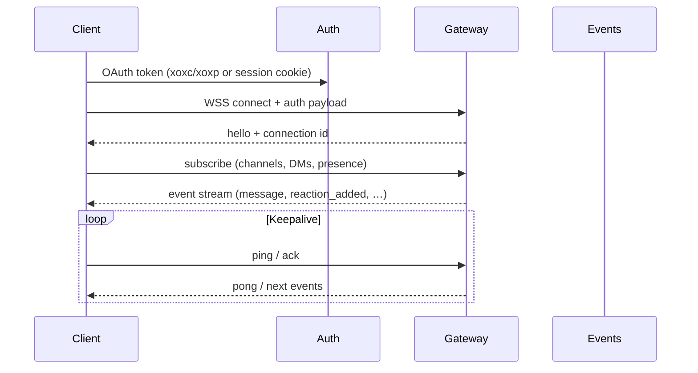
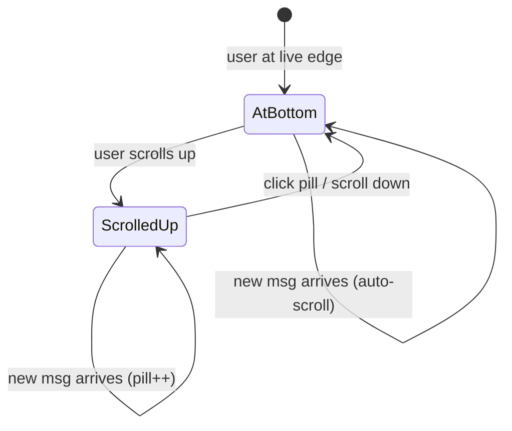
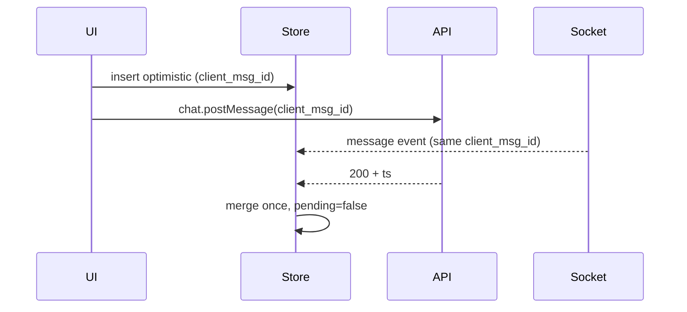
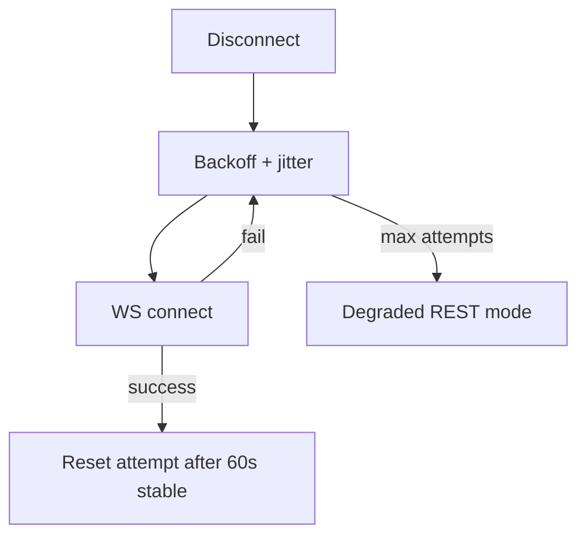
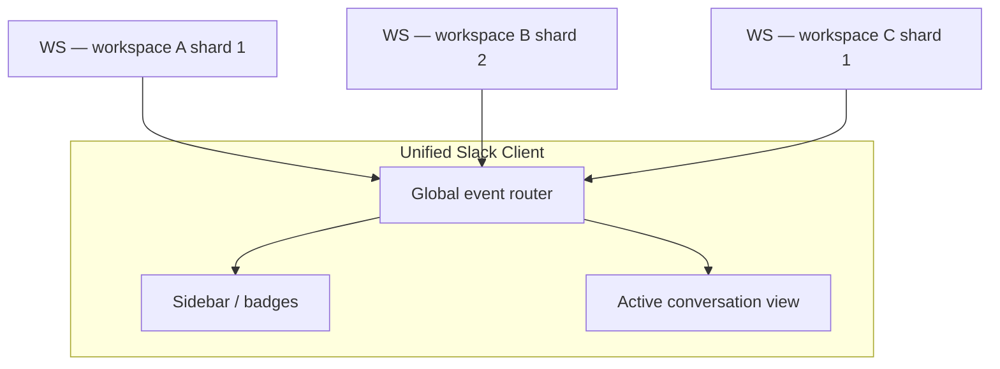

# Section 1 — Realtime Messaging & WebSocket (Answers)

Interview-depth answers for Slack's client realtime layer: problem framing, approach, tradeoffs, concrete techniques, and pitfalls. Covers the Events API WebSocket lifecycle, optimistic sends via `client_msg_id`, deduplication against REST history, reconnect/resync, and Enterprise Grid multi-shard sockets.

---

## Core

### How does the Slack client establish and maintain a WebSocket connection to the Events API?

**Problem framing:** Slack's UX depends on sub-second delivery of messages, reactions, edits, and presence — polling REST endpoints cannot scale or feel responsive. The client needs a **persistent, authenticated, bidirectional** channel that survives tab backgrounding, network flaps, and token refresh without dropping user-visible state.

**Approach:** The Slack desktop/web client opens a WebSocket to Slack's **gateway** (the transport behind the Events API for first-party clients). The lifecycle is explicit and stateful:



1. **Bootstrap** — After login, the client holds a workspace-scoped token. It requests a WebSocket URL (or uses a well-known gateway endpoint) and connects with credentials in the first frame or via cookie on the upgrade handshake.

2. **Handshake & subscription** — Server sends a `hello` (or equivalent) with connection metadata: shard id, team id, recommended heartbeat interval. Client registers interest in entities it cares about — open channels, DMs, thread subscriptions, presence — so the gateway can filter fan-out.

3. **Event dispatch** — Incoming frames are typed Events API payloads: `{ type: "message", channel: "C123", ts: "…", … }`. A central **event router** in the client normalizes these into Redux/Zustand actions: append message, patch reaction, update badge.

4. **Keepalive** — Client sends periodic pings; if no pong within N seconds, mark socket **stale** and begin reconnect. Background tabs may use longer intervals but must not let middleboxes idle-timeout the connection (typical LB timeout: 60–120s).

5. **Token refresh** — Before token expiry, refresh via REST without tearing down the socket if the protocol supports in-band re-auth; otherwise, coordinate: pause outbound sends, refresh, reconnect with new token, resume subscriptions.

6. **Single writer per workspace** — One WebSocket per active workspace tab (or shared worker) avoids duplicate event streams. Cross-tab sync uses `BroadcastChannel` or `SharedWorker` so only one tab owns the socket.

| Concern | Client responsibility |
|---------|----------------------|
| Auth | Attach token; refresh before expiry |
| Subscription | Re-send channel/DM list after reconnect |
| Ordering | Buffer + sort by `ts` within channel |
| Backpressure | Coalesce high-frequency events (see Deep) |

**Tradeoffs:** One socket multiplexes all realtime traffic — simpler than per-channel WS, but the client event loop must be fast or a hot channel blocks presence updates. **Pitfall:** Opening a socket per channel — explodes connection count and breaks Slack's fan-out model. **Pitfall:** Ignoring server heartbeat hints and getting silently dropped by a load balancer.

---

### What happens when a new message arrives over the socket while the user is scrolled up reading history?

**Problem framing:** The user is reading older messages (not at the live edge). Blindly appending new messages and auto-scrolling would **yank them away** from what they're reading. But the messages must still land in client state for unread badges, thread counts, and instant scroll-to-bottom when they choose.

**Approach:** Separate **data ingestion** from **scroll behavior** using a "pinned to bottom" flag:

```text
New socket event (message)
    |
    +-- User at bottom (scrollTop + viewport >= threshold)
    |       --> append to list, auto-scroll, mark visible
    |
    +-- User scrolled up (reading history)
            --> append to list (virtualized, off-screen)
            --> show "N new messages" pill / jump bar
            --> increment unread for channel (if not focused)
            --> do NOT change scrollTop
```

1. **Scroll anchoring** — With virtualization, insert new rows *below* the viewport without changing scroll position. Use `overflow-anchor: auto` or manual anchor: record `scrollHeight` delta and compensate if layout shifts.

2. **"New messages" affordance** — A floating pill at the bottom: "↓ 3 new messages" (optionally preview sender). Click scrolls to live edge and clears the counter.

3. **State still updates** — Sidebar badge, channel bold, @mention highlight, and thread reply counts update immediately even when the message list doesn't scroll.

4. **Focus vs scroll** — If the window is focused and user is scrolled up, some teams still suppress auto-scroll but **do** play a subtle sound or highlight the tab for @mentions per notification prefs.

5. **Thread pane independence** — A new reply in an open thread while the user reads the thread history follows the same pinned-to-bottom logic inside the thread pane, independent of the main channel feed.



**Tradeoffs:** Always appending to the in-memory list grows memory for users who stay scrolled up in a firehose channel — cap with "live buffer + lazy history" (keep last N at bottom hot, fetch older on scroll). **Pitfall:** Calling `scrollIntoView` on every socket event. **Pitfall:** Not updating unread state when suppressing scroll — user misses that they have new traffic.

---

### How do you deduplicate messages that arrive via WebSocket and also appear in a REST history fetch?

**Problem framing:** The same message can enter client state through **multiple paths**: realtime `message` event, `conversations.history` / `chat.postMessage` response, pagination when scrolling up, and reconnect catch-up. Without dedup, users see double bubbles; optimistic sends make this worse.

**Approach:** Use a **canonical message key** and a merge layer in the store:

| Key | Use case |
|-----|----------|
| `(channel_id, ts)` | Server-authoritative identity; `ts` is unique per channel |
| `client_msg_id` | Maps optimistic row → confirmed row before `ts` is known |

**Merge algorithm:**

```text
onMessage(candidate):
  if candidate.client_msg_id:
    existing = store.findByClientMsgId(candidate.client_msg_id)
    if existing:
      PATCH existing with server ts, user, reactions — return
  if store.has(candidate.channel, candidate.ts):
    return  // duplicate socket + history
  store.insert(candidate)
```

1. **REST history load** — `conversations.history` returns messages with `ts`. Insert into a normalized map keyed by `channelId → Map<ts, Message>`.

2. **Socket event** — Same `ts`? Skip insert; optionally merge fields if the socket payload is richer (e.g. latest `edited` state).

3. **Optimistic send** — Client inserts a provisional row with `client_msg_id`, `pending: true`, temporary local `ts` (or no `ts`). When REST response or socket echo arrives with matching `client_msg_id`, **replace in place** — same list slot, no flicker.

4. **Ordering** — After dedup, sort by `ts` (string comparison works for Slack's `seconds.microseconds` format).

5. **Edge: message_changed** — Keyed still by original `ts` (`message_changed` references `message.ts`). Upsert into the same slot.

**Tradeoffs:** Normalized store (by `ts`) vs array per channel — normalized dedup is O(1); array requires index map. **Pitfall:** Deduping only by text content or timestamp to the second — collisions in busy channels. **Pitfall:** Replacing optimistic row by deleting + inserting — causes virtualization key churn and scroll jump; patch in place.

---

### What is a `client_msg_id` and why does Slack use it for optimistic sends?

**Problem framing:** On send, waiting 200–800ms for REST round-trip before showing the message feels broken. Optimistic UI inserts immediately, but the server will later assign a real `ts` and may broadcast the same message back on the WebSocket — the client needs a **stable correlation id** across REST, socket, and offline replay.

**Approach:** `client_msg_id` is a **client-generated UUID** (or high-entropy string) attached to `chat.postMessage`:

```json
{
  "channel": "C123",
  "text": "Deploying now",
  "client_msg_id": "a1b2c3d4-e5f6-7890-abcd-ef1234567890"
}
```

**Why Slack uses it:**

1. **Optimistic row identity** — UI inserts `{ client_msg_id, text, user: me, pending: true }` instantly. Composer clears. Scroll pins to bottom if applicable.

2. **Idempotent send** — On retry ( flaky network, 503 ), client resends the **same** `client_msg_id`. Server dedupes — user doesn't get duplicate messages in the channel.

3. **Reconciliation** — REST 200 and socket `message` event both carry `client_msg_id`. Client finds the pending row and promotes it: `{ ...serverFields, pending: false, ts: "1710000000.000100" }`.

4. **Offline queue** — Messages queued while offline retain their original `client_msg_id`. On reconnect, replay in order; server or client rejects duplicates.



**Tradeoffs:** UUID per send — negligible size; server must index recent `client_msg_id` per team for dedup window (e.g. 24h). **Pitfall:** Generating a new id on retry — creates duplicates. **Pitfall:** No optimistic row — user sees nothing until socket echo, then a pop-in; bad on slow networks.

---

### How do you handle WebSocket disconnect — reconnect, replay missed events, or full resync?

**Problem framing:** Disconnects are normal (sleep, tunnel, deploy). The client must restore **consistency** — no permanent holes, no duplicate floods — without blocking the UI. The strategy depends on **gap duration** and what cursor the server exposes.

**Approach — tiered recovery:**

```text
Disconnect detected
    |
    +-- Reconnect immediately (backoff) --> new WebSocket
    |
    +-- On hello:
          |
          +-- Gap < ~60s + last_event_id supported
          |       --> REPLAY missed events from cursor
          |
          +-- Gap medium (1–5 min)
          |       --> INCREMENTAL: conversations.history?latest=N per open channel
          |           + merge by ts/client_msg_id
          |
          +-- Gap long / cursor expired / auth rotated
                  --> FULL RESYNC: refetch channel list, unreads, open channel history
```

1. **Reconnect** — Exponential backoff with jitter (see Deep). On success, resubscribe to channels/presence.

2. **Replay** — If the gateway accepts `last_event_id` or `last_ts` on reconnect, server replays buffered events. Client feeds them through the same dedup router.

3. **Incremental sync** — For each **open** channel/DM, call REST with `oldest=<lastKnownTs>` or fetch latest 50 messages. Cheaper than full workspace resync.

4. **Full resync** — Refetch sidebar, badge counts, and visible conversations. Used after long offline or repeated reconnect failure.

5. **User-visible state** — Show "Reconnecting…" (see Deep for tone). Queue outbound messages locally; flush with same `client_msg_id` after reconnect.

6. **Parallel paths** — While reconnecting, REST still works for explicit user actions (open channel → history fetch). Socket is optimization; REST is backstop.

| Gap | Strategy | API cost |
|-----|----------|----------|
| &lt; 1 min | Replay buffer / slight overlap fetch | Low |
| 1–10 min | Incremental history per open channel | Medium |
| &gt; 10 min | Full resync + unread reconciliation | High |

**Tradeoffs:** Aggressive replay reduces REST load but requires server-side buffers. **Pitfall:** Refetching entire 100k-message channel on every blip. **Pitfall:** Applying replay events before merging history — momentary duplicates until dedup runs; always route through one ingress.

---

### How do you order messages when two users send at the same millisecond in a busy channel?

**Problem framing:** Wall-clock time alone doesn't define a total order across distributed clients. Two messages can share the same second-level timestamp; users still expect a **stable, deterministic** order in the UI.

**Approach:** Slack assigns each message a **`ts` string** with microsecond precision: `"1710000000.123456"`. The server generates this at ingest — it is the **authoritative total order** within a channel.

1. **Primary sort: `ts`** — Lexicographic sort on the string matches chronological order (fixed-width microseconds). Client message list sorts by `ts` ascending.

2. **Same microsecond (rare)** — Server guarantees uniqueness by bumping microseconds or using an internal sequence. Clients never collide on `ts` for two distinct messages in one channel.

3. **Optimistic messages** — Pending local sends lack server `ts`. Use a temporary key: `{ sortKey: "pending:<localMonotonicCounter>", client_msg_id }`. On ACK, replace with server `ts` and re-sort once — usually no visible jump if the user was last sender.

4. **Cross-source merge** — History fetch and socket events merge into one sorted structure (sorted array with binary insert, or heap). Always compare by server `ts` after dedup.

5. **Thread replies** — Same rule within thread; parent message `ts` is unrelated — thread uses `thread_ts` linkage.

```text
Channel order (authoritative):
  msg_A  ts=1710000000.123400
  msg_B  ts=1710000000.123401   ← same ms wall clock, distinct ts
  msg_C  ts=1710000000.123402
```

**Tradeoffs:** Trusting client clock for ordering would drift — always server `ts`. **Pitfall:** Sorting by parsed Date in JS — timezone/locale issues; string compare on Slack `ts` is safer. **Pitfall:** Re-sorting entire list on every event in a 10k channel — insert in O(log n) or append + rare sort for live edge only.

---

## Deep

### How do you implement exponential backoff on WebSocket reconnect without flooding the server after a fleet-wide outage?

**Problem framing:** When Slack's gateway blips, **every client reconnects at once** — a thundering herd that can prevent recovery. Naive fixed-delay retry or tight loops amplify the outage.

**Approach:** **Exponential backoff with full jitter**, capped, plus **client-side coordination**:

```javascript
// Pseudocode: AWS-style full jitter
base = 1000  // ms
cap = 30000
attempt = min(attempt + 1, 10)
ceil = min(cap, base * 2 ** attempt)
delay = random(0, ceil)
```

1. **Backoff schedule** — Attempt 0: 0–1s, attempt 1: 0–2s, … cap at 30s. Reset attempt counter after **stable connection** held for e.g. 60s.

2. **Full jitter** — Randomize in `[0, ceil]` not `[ceil/2, ceil]` — spreads reconnects across time (Google/AWS recommendation).

3. **Add jitter per workspace tab** — If multiple tabs, elect one reconnect owner via `BroadcastChannel`; others wait for "socket ready" event.

4. **Respect `Retry-After`** — If HTTP upgrade or auth returns 503 with `Retry-After`, use `max(backoff, retryAfter)`.

5. **Circuit breaker (client)** — After N failed attempts in 5 min, enter **degraded mode**: longer cap (60s), banner "Connection trouble," rely on REST polling for open channel only — reduces load while letting user work.

6. **Don't backoff heartbeats separately** — Once connected, failed ping triggers **single** reconnect path, not parallel retry loops.



**Tradeoffs:** Max cap trades recovery speed for server protection — 30s is reasonable; all-hands may feel long without degraded REST. **Pitfall:** Identical backoff in every client (no jitter) — synchronized retries. **Pitfall:** Zero delay first retry for "snappy UX" — fine once; catastrophic at fleet scale unless server sends randomized `reconnect_after` in close frame.

---

### How do you handle a `message_changed` event that arrives before the original `message` event due to out-of-order delivery?

**Problem framing:** WebSocket delivery is **mostly ordered** but not guaranteed across reconnect overlap, shard failover, or parallel REST + socket paths. An edit (`message_changed`) referencing `message.ts` can arrive before the base `message` event — naive handlers drop the edit or crash on missing rows.

**Approach:** **Event staging buffer** keyed by `(channel, ts)`:

```text
on message_changed(channel, ts, new_content):
  if store.has(channel, ts):
    applyEdit(channel, ts, new_content)
  else:
    pendingEdits[channel, ts] = new_content   // stash

on message(channel, ts, ...):
  if pendingEdits[channel, ts]:
    merge edit into message before insert
    delete pendingEdits[channel, ts]
  store.insert(message)
```

1. **Upsert semantics** — `message_changed` carries the full updated message object and `previous_message` metadata. Apply as patch to existing row or stash.

2. **TTL on pending edits** — Expire stashed edits after 30–60s; follow up with REST `conversations.history` fetch for that `ts` if still missing.

3. **Same for deletes** — `message_deleted` before `message`: mark `pendingDelete[channel, ts]`; when message arrives, insert as already-deleted tombstone or skip render.

4. **Reactions** — `reaction_added` before message: queue on `(channel, item.ts)` similarly.

5. **Version field** — If event includes `event_ts` or revision, apply **newest wins** when merging out-of-order updates.

| Event order | Handler behavior |
|-------------|------------------|
| message → message_changed | Normal patch |
| message_changed → message | Stash edit, merge on insert |
| message_deleted → message | Tombstone or skip render |
| duplicate message_changed | Last event_ts wins |

**Tradeoffs:** Pending buffers add memory — bounded per channel, evict LRU. **Pitfall:** Dropping orphaned `message_changed` silently — user never sees edit until manual refresh. **Pitfall:** Applying edit to wrong row when `ts` reused — Slack doesn't reuse `ts`; still validate `channel` match.

---

### What is your strategy when the socket reconnects after 5 minutes offline — incremental sync vs full channel refetch?

**Problem framing:** Five minutes is long enough to miss hundreds of events across many channels, but short enough that a **full workspace reload** wastes bandwidth and blocks UI. The client must catch up **correctly** for open views and **badge/unread accuracy** everywhere else.

**Approach:** **Hybrid incremental with selective full refetch:**

```text
Reconnect after ~5 min offline
    |
    +-- Workspace metadata: client.counts / users.conversations
    |       --> refresh sidebar badges, muted state, new channels
    |
    +-- Open channel (user is viewing):
    |       --> conversations.history(limit=100, latest) + dedup merge
    |       --> OR history?oldest=lastSeenTs for gap fill only
    |
    +-- Open thread pane:
    |       --> conversations.replies(thread_ts, limit=50)
    |
    +-- Background channels (not open):
    |       --> badge counts only from client.counts — no full history
    |
    +-- Missed socket-only signals (presence, typing):
            --> drop; fresh state on next event or REST presence fetch
```

1. **Cursor per channel** — Track `latestKnownTs[channel]` from last socket event or history page. On reconnect, fetch `oldest=latestKnownTs` overlap window (include 5–10 messages **before** cursor for dedup safety).

2. **Don't refetch closed channels' history** — Unread badges come from `client.counts` or `users.conversations` — O(channels) lightweight call.

3. **Offline outbound queue** — Replay queued sends with original `client_msg_id` **before** merging history so user's messages slot correctly.

4. **Active channel UX** — If gap is large and user stares at stale feed, show subtle "Updating…" then swap in merged messages; preserve scroll if scrolled up with pill.

5. **When to full refetch open channel** — If `latestKnownTs` is null (first open), or gap &gt; retention overlap, or incremental returns `has_more` with inconsistent cursor — fall back to full latest-100 load.

| Surface | 5-min offline strategy |
|---------|------------------------|
| Sidebar badges | `client.counts` refresh |
| Active channel | Gap fill or latest 100 |
| Background DMs | Counts only until opened |
| Threads | `conversations.replies` for open thread |

**Tradeoffs:** Incremental requires reliable per-channel cursors — corrupt cursor → brief hole until user scrolls. **Pitfall:** Full refetch of every joined channel — thousands of API calls on reconnect. **Pitfall:** Ignoring `client.counts` — badges wrong until each channel opened.

---

### How do you batch or throttle high-frequency socket events (e.g. 50 reactions in a thread during a live event)?

**Problem framing:** During an all-hands or incident, reaction storms and rapid thread replies can deliver **dozens of events per second**. Handling each with a full React render recalculates virtualization, reaction pills, and badges — freezing the UI.

**Approach:** **Micro-batch on the event ingress** before the store commit:

```text
Socket raw events
    --> [per-type queue]
    --> rAF / 50ms flush
    --> coalesced store dispatch
    --> single React commit per frame
```

1. **Coalesce by target** — Multiple `reaction_added` on same `(channel, ts, name)` → keep one. Count rapid duplicates for analytics only.

2. **Batch reaction UI** — Update reaction bar once per frame: `{ "+1 👍", "+3 🎉" }` animated aggregate optional.

3. **Priority lane** — `message` with @mention bypasses batch for immediate badge; `reaction_added` and `user_typing` batch freely.

4. **Cap work per flush** — Process max 100 events per frame; defer remainder to next rAF to avoid long tasks (&gt;50ms).

5. **Virtualized list** — Only visible rows + overscan re-render; off-screen message reaction updates patch store without DOM touch.

6. **Thread sidebar** — Separate batcher for thread pane so main channel batching isn't blocked.

| Event type | Batch window | Coalesce key |
|------------|--------------|--------------|
| reaction_added | 1 frame | channel + ts + reaction |
| user_typing | 300ms debounce | channel + user |
| message | immediate if @me; else 1 frame | channel + ts |
| presence_change | 500ms | user_id |

**Tradeoffs:** 16–50ms delay on reactions — acceptable vs jank. **Pitfall:** Batching without coalescence — still 50 dispatches for 50 reactions. **Pitfall:** Dropping events to "keep up" — never drop; coalesce or defer, don't lose data.

---

### How do you surface connection state to the user — "Reconnecting…", "Some messages may be delayed" — without being alarming?

**Problem framing:** Connection issues are frequent and usually brief. A modal or red error erodes trust; **silence** during a long outage makes users think Slack is broken. The UI needs a **calm, progressive** disclosure ladder.

**Approach:** **Tiered, non-blocking status chrome:**

```text
State ladder (user-visible)
  Connected     → (nothing, or subtle green dot in debug only)
  Reconnecting  → thin banner: "Reconnecting…" + spinner, ~3s threshold
  Delayed       → "Some messages may be delayed" after 10–15s
  Offline       → "You're offline — messages send when connected" + queue icon
  Failed        → "Having trouble connecting" + [Retry] after circuit breaker
```

1. **Delay before showing** — Don't flash "Reconnecting" on sub-second blips. Show banner only after disconnect &gt; 2–3s.

2. **Placement** — Thin top banner below workspace bar (Slack-style), not modal. Composer stays usable; queued sends show clock icon.

3. **Copy tone** — Neutral, factual. Avoid "Error" red for transient states; amber/gray for delayed, red only for persistent failure.

4. **Functionality hints** — "You can still browse cached messages" when local store has history; REST read works in degraded mode.

5. **Clear on recovery** — Banner fades on stable connect; optional 2s "Connected" toast if outage was &gt;30s.

6. **Accessibility** — `aria-live="polite"` for banner; don't steal focus.

| Duration | UI | Send behavior |
|----------|-----|---------------|
| &lt; 3s | None | Queue briefly or send via REST |
| 3–30s | "Reconnecting…" | Offline queue |
| &gt; 30s | "Messages may be delayed" | Queue + manual retry link |
| REST up, WS down | "Live updates paused" | Read via REST; send via REST |

**Tradeoffs:** Hiding status too long confuses power users during incidents — optional connection detail in settings/help. **Pitfall:** Blocking composer on disconnect — user can't draft. **Pitfall:** Full-screen offline page — overkill for 5s flap.

---

### How do you handle Enterprise Grid where a user has sockets open to multiple workspace shards simultaneously?

**Problem framing:** Enterprise Grid users belong to **multiple workspaces** (orgs) that may live on **different gateway shards**. Each workspace has its own auth token, event stream, and channel namespace — but the **UI is unified** in one client with one sidebar and quick switcher.

**Approach:** **One WebSocket per active workspace**, lazy lifecycle, unified event bus:



1. **Connection policy** — **Eager:** socket for current workspace + recently switched (1–2). **Lazy:** connect on workspace switch or unread push. **Idle disconnect:** close socket for workspaces inactive &gt;15 min to save resources.

2. **Namespace isolation** — Every event tagged with `team_id` / `enterprise_id`. Store is partitioned: `state.workspaces[teamId].channels`. Router never applies workspace A event to workspace B.

3. **Aggregate badges** — Sidebar sums unread across connected workspaces; per-workspace badge from each shard's `client.counts` or streamed events.

4. **SharedWorker option** — Desktop app may hold all WS in a native or SharedWorker layer; UI subscribes per team.

5. **Reconnect independence** — Workspace A outage doesn't block B's socket. Banner scoped: "Reconnecting to Acme Corp…" only when **active** workspace is affected.

6. **Cross-workspace features** — Slack Connect shared channels belong to one hosting workspace's shard; events arrive on **that** workspace's socket even if user is viewing another org — router queues badge update without switching context.

7. **Token refresh** — Per-workspace OAuth refresh; one expired token doesn't tear down other sockets.

| Strategy | Pros | Cons |
|----------|------|------|
| 1 WS per workspace | Clean isolation, matches sharding | Multiple connections (30 workspaces → heavy) |
| Multiplex on one WS | Single connection | Requires server support; Grid doesn't unify |
| Lazy connect | Low idle cost | Switch latency on first open |

**Tradeoffs:** 30-workspace power users stress client — cap eager sockets at 3–5, lazy for rest, refresh counts via batched REST on focus. **Pitfall:** Global singleton store without `team_id` — cross-workspace message leak (critical security bug). **Pitfall:** One reconnect backoff shared across workspaces — independent backoff per team.

---

*Next section: [02 — Channels, Threads & Message Organization](./02-channels-threads-message-organization.md) (when available).*
