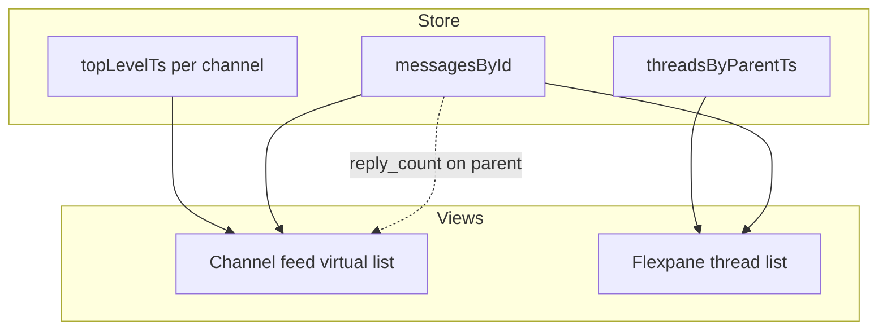
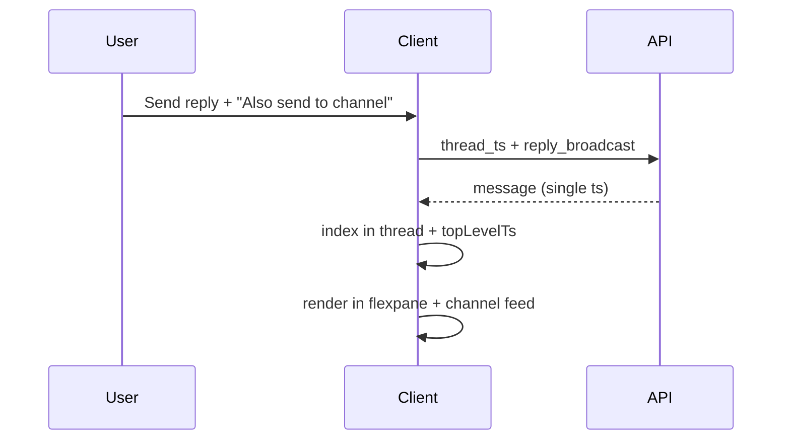
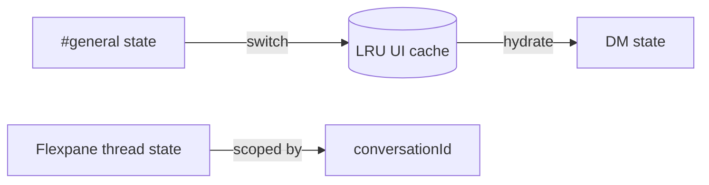
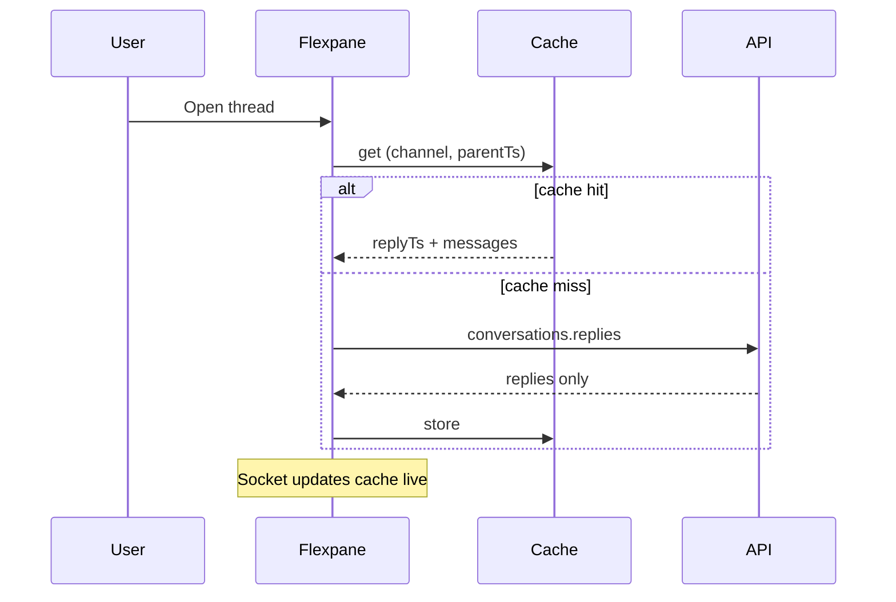
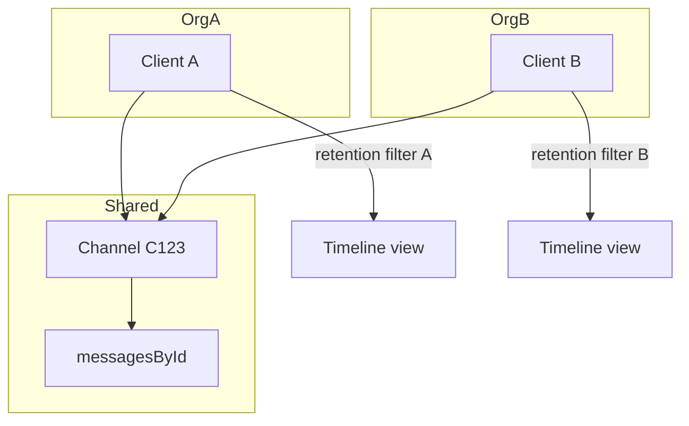
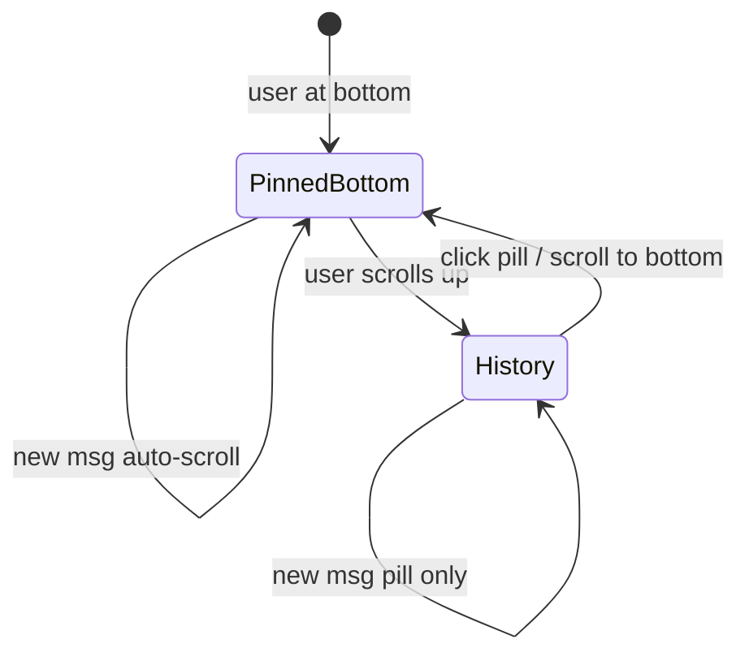

# Section 2 — Channels, Threads & Message Organization (Answers)

Interview-depth answers for Slack's client: channels vs threads vs DMs as distinct UI surfaces, flexpane, lazy history, virtualization, and scroll anchoring.

---

## Core

### How do you model the relationship between a channel, its messages, and thread replies in client state?

**Problem framing:** Slack is not a flat message list. A **channel** is a conversation container; **top-level messages** live in the channel timeline; **thread replies** are messages whose `thread_ts` points at a parent. The same logical message can appear in two views (parent row in channel + reply in flexpane). Client state must avoid duplication bugs, support partial hydration, and keep thread metadata on parents without loading every reply.

**Approach:** Use a **normalized store** with three layers:

| Layer | Responsibility |
|-------|----------------|
| **Conversation registry** | `channelsById`, `dmsById` — metadata, membership, last-read, notification prefs |
| **Message store** | `messagesById: Map<ts, Message>` — single canonical object per message |
| **Timeline indexes** | Per-conversation ordered lists of `ts` values, split by surface |

```ts
type ConversationId = string; // C123, D456

type Message = {
  ts: string;              // unique key within channel
  channel: ConversationId;
  user: string;
  text: string;
  thread_ts?: string;      // parent ts if this is a reply
  reply_count?: number;    // on parent only
  latest_reply?: string;   // ts of newest reply
  reply_users_count?: number;
  subscribed?: boolean;    // user follows thread
  // blocks, attachments, reactions...
};

type ChannelTimeline = {
  conversationId: ConversationId;
  topLevelTs: string[];           // ordered, channel feed only (no thread replies inline)
  threadsByParentTs: Map<string, {
    replyTs: string[];            // ordered replies for flexpane
    loadedRange: { oldest: string; newest: string } | null;
    hasMoreOlder: boolean;
  }>;
  historyCursor: {
    oldestLoadedTs: string | null;
    newestLoadedTs: string | null;
    hasMoreOlder: boolean;
    hasMoreNewer: boolean;
  };
};
```

**Key rules:**

1. **Thread replies never appear in `topLevelTs`** — they render only in the flexpane (except "Also send to channel" broadcast copies, which are separate top-level messages or flagged variants).
2. **Parent message holds thread summary** — `reply_count`, `latest_reply`, `reply_users` updated via socket events without loading replies.
3. **Derive views, don't duplicate** — Channel feed selector: `topLevelTs.map(ts => messagesById.get(ts))`. Thread view: `threadsByParentTs.get(parentTs).replyTs.map(...)`.
4. **Workspace scoping** — All maps keyed under `workspaceId` to prevent cross-workspace leaks.



**Tradeoffs:** Normalized store adds indirection but prevents "parent in channel shows stale reply count" bugs. Alternative — embed replies inline in channel array — matches server payloads but breaks virtualization (channel feed would include 40-reply threads). **Pitfall:** Storing two copies of the same reply object in channel and thread arrays; always one `messagesById` entry, two index lists.

---

### What changes in the UI when a user clicks "Reply in thread" vs sending a message in the main channel feed?

**Problem framing:** These are two distinct **composition targets** with different visibility, notification semantics, and layout. Confusing them is a common product bug (reply lands in channel, or channel message opens flexpane unnecessarily).

**Approach — state machine for active surface:**

```ts
type ActiveSurface =
  | { type: 'channel'; conversationId: string }
  | { type: 'thread'; conversationId: string; parentTs: string };
```

**"Reply in thread" click:**

1. Set `activeSurface = { type: 'thread', conversationId, parentTs }`.
2. **Open flexpane** (right sidebar) — ~400px pane; channel feed remains visible but narrowed.
3. **Composer context** switches: placeholder "Reply…", `thread_ts` attached to outbound payload, mentions scoped to thread participants + channel.
4. **Flexpane loads** thread history (cached or `conversations.replies` API) — virtualized list anchored at bottom or first unread reply.
5. **Focus** moves to flexpane composer; keyboard shortcut context changes (`Esc` closes flexpane, not channel).
6. Channel feed **does not scroll**; parent message may get highlight ring. No new row in main timeline until send (unless "Also send to channel").

**Send in main channel feed:**

1. `activeSurface = { type: 'channel', conversationId }`.
2. Flexpane may stay open showing a *different* thread or close — product choice; Slack keeps flexpane open if already open.
3. Outbound message has **no `thread_ts`** — appears as new row at bottom of `topLevelTs`.
4. **Unread / badge** logic uses channel last-read, not thread subscription.
5. **@channel / @here** allowed (usually blocked or warned in thread replies).

```ascii
Channel feed                    Flexpane (after "Reply in thread")
┌─────────────────────┐        ┌──────────────────┐
│ Parent msg  [3 replies]│ ──► │ Parent (collapsed)│
│ Other msg           │        │  └ reply 1        │
│ Composer: #general  │        │  └ reply 2        │
└─────────────────────┘        │ Composer: Reply…  │
                               └──────────────────┘
```

**Tradeoffs:** Inline thread expansion (Discord-style) vs Slack flexpane — flexpane keeps channel context and avoids feed height explosion. **Pitfall:** Reusing channel composer state without clearing `thread_ts` — next channel message accidentally becomes a thread reply.

---

### How do you implement "Also send to #channel" when posting a thread reply?

**Problem framing:** Thread replies are normally **channel-invisible** (only summary on parent). "Also send to #channel" (`reply_broadcast` in Slack API) duplicates visibility: reply appears in flexpane *and* as a top-level row in the channel feed. Client must show both without double-counting unread or rendering two different message objects.

**Approach:**

1. **Outbound API:** POST message with `thread_ts: parentTs` **and** `reply_broadcast: true`.
2. **Server response / socket event:** One message object with `thread_ts` set **and** `subtype: thread_broadcast` (or equivalent flag). Same `ts` everywhere — critical for dedup.
3. **Client index updates:**
   - Append `ts` to `threadsByParentTs[parentTs].replyTs` (flexpane).
   - **Also** insert `ts` into `topLevelTs` at the correct chronological position (usually near parent or at broadcast position per server ordering rules).
4. **UI rendering:** Channel feed row shows broadcast replies with distinct styling — "also sent to the channel" label, link to thread. Flexpane shows normal reply bubble.
5. **Unread:** Broadcast typically counts toward **channel** unread (it's in the feed). Thread-only replies count toward **thread** badge on parent only.



**Tradeoffs:** Single `ts` with dual indexing vs two messages — Slack uses **one message, dual surfacing**; never create a synthetic clone with a new `ts`. **Pitfall:** Incrementing `reply_count` twice or showing two unread indicators for one send. **Pitfall:** Virtualized channel list not inserting broadcast at correct scroll position — use same ordered insert as socket handler for normal messages.

---

### How do you show an unread thread indicator on a parent message without opening the thread pane?

**Problem framing:** Users scan the channel feed for "something happened in a thread I care about." The indicator must reflect **thread-level unread** distinct from channel unread, without fetching all replies.

**Approach — denormalized thread unread on parent row:**

**Server/client tracked fields (on parent or sidecar map):**

```ts
type ThreadUnreadState = {
  parentTs: string;
  unreadReplyCount: number;       // or boolean hasUnread
  lastReadReplyTs: string | null; // per-user, per-thread
  latestReplyTs: string;
  subscribed: boolean;            // "following" thread
};
```

**Population sources:**

1. **Socket `message` event** with `thread_ts` → bump parent's `reply_count`, set `latest_reply`, if user subscribed or @mentioned in reply → mark thread unread.
2. **`conversations.mark` API** with `ts: parentTs` when user opens thread → clear thread unread for that parent.
3. **Local overlay** — compare `latest_reply` to persisted `lastReadReplyTs` from IndexedDB / server `stars` or read markers.

**UI on parent row (channel feed, no flexpane open):**

- **Reply pill:** `"3 replies"` → `"3 replies · 2 new"` or bold count badge.
- **Visual:** Unread dot on reply avatars strip, accent color on "View thread" CTA.
- **Do not** fetch reply bodies — only metadata on parent message object from channel history API.

```ascii
┌────────────────────────────────────────────┐
│ Alice: We should ship Friday               │
│ [💬 5 replies · 2 new]  [avatar][avatar]   │  ← unread from metadata only
└────────────────────────────────────────────┘
```

**Tradeoffs:** Per-thread read cursors multiply state (`#channels × #active threads`) — persist lazily (only threads user opened or subscribed to). **Pitfall:** Using channel `last_read` to infer thread unread — user can read channel but not thread. **Pitfall:** Clearing thread unread when parent scrolls into view without opening thread — wrong; require explicit thread visit or "mark all read" in channel.

---

### How do you handle switching between #general, a DM, and an open thread pane — what state persists?

**Problem framing:** Slack's layout is **multi-pane**: sidebar + main conversation + optional flexpane. Switching conversations must feel instant (restore scroll, drafts, flexpane) without leaking state across channels.

**Approach — per-conversation UI snapshot + global chrome state:**

```ts
type ConversationUIState = {
  conversationId: string;
  scrollAnchor: { ts: string; offsetPx: number } | 'bottom';
  historyLoaded: ChannelTimeline['historyCursor'];
  draft: ComposerDraft;                    // per-channel draft (see Section 4)
  flexpane: {
    open: boolean;
    parentTs: string | null;
    threadScrollAnchor: { ts: string; offsetPx: number } | 'bottom';
  };
  lastVisitedAt: number;
};

type GlobalNavState = {
  activeConversationId: string;
  sidebarScrollTop: number;
  workspaceId: string;
};
```

**Switch `#general` → DM:**

1. **Persist** `#general`'s `ConversationUIState` to in-memory LRU (cap ~20 conversations) + optional IndexedDB for scroll/draft.
2. **Swap** active conversation — hydrate DM from cache or fetch `conversations.history` tail.
3. **Flexpane policy:** Close on DM switch (DMs have threads too — if DM thread was open, persist separately under that DM id). Slack closes flexpane when changing channels unless "pop out thread" window.
4. **Composer** loads DM-specific draft; channel draft saved separately.
5. **Unread** — mark-as-read rules deferred until DM focused + visible (Section 6).

**Switch channel → open thread (same channel):**

1. Flexpane opens; **channel scroll preserved** — do not reset `scrollAnchor`.
2. `activeSurface` becomes thread; channel feed remains mounted (hidden width shrink, not unmount) to avoid re-fetch and scroll loss.

**Switch thread → different channel with flexpane open:**

1. Save thread flexpane state under old `conversationId`.
2. New channel loads with flexpane closed by default; restore if user returns within session.



**Tradeoffs:** Keeping channel DOM mounted vs destroy-on-switch — mounted preserves scroll/virtualizer cache at memory cost. Unmount + restore scroll via `scrollAnchor` ts is cheaper RAM, trickier with variable-height virtualization. **Pitfall:** Global composer single instance without per-conversation draft map — user loses draft on switch. **Pitfall:** Thread flexpane tied to global `parentTs` without scoping to channel — open wrong thread after switch.

---

### How do you lazy-load older messages when the user scrolls up in a channel with 100k messages?

**Problem framing:** You cannot load 100k messages into DOM or memory. History must **paginate backward** on scroll intent, integrate with realtime inserts at the bottom, and work with virtualization.

**Approach — cursor-based backward pagination + virtual list:**

1. **Initial load:** `conversations.history` with `limit=50` (newest). Populate `topLevelTs` descending → reverse for display. Set `historyCursor.oldestLoadedTs`.

2. **Scroll trigger:** Virtualizer fires `onReachTop` when first visible index < threshold (e.g. within 10 rows of top). Guard with `isFetchingOlder` lock.

3. **Fetch:** `conversations.history` with `latest=<oldestLoadedTs>` (exclusive) + `limit=50`. Prepend to `topLevelTs`; update cursor. **Deduplicate** by `ts` against socket-delivered messages during fetch.

4. **Virtualization:** Only ~30–40 rows mounted. **Measure heights** dynamically; cache `ts → height` in LRU. Prepend causes scroll jump — use **scroll anchoring** (below): preserve anchor message ts + pixel offset before prepend, restore after layout.

5. **Memory cap:** Evict messages above viewport + buffer from `messagesById` if not referenced by loaded windows in other open threads; keep `topLevelTs` skeleton ts list or re-fetch on scroll-back (Slack leans keep ts index, lazy body fetch via `conversations.history` batches).

6. **Jump optimizations:** "Jump to date" or search result bypasses sequential scroll — direct `oldest`/`latest` ts query (Section 5).

```text
[ newest ... newest-50 loaded ... scroll up ... fetch 51-100 ... ]
     ▲                                    │
     └── realtime appends here            └── prepend + anchor restore
```

**Tradeoffs:** `limit=50` vs 200 — larger pages reduce API calls but worsen prepend jank. **Pitfall:** Fetching without excluding thread replies in API — Slack API returns only top-level in channel history by default; verify `inclusive` flags. **Pitfall:** Concurrent socket events during prepend — merge sorted by `ts`, stable sort tie-break on `client_msg_id`.

---

## Deep

### How do you implement the thread sidebar (flex pane) without re-fetching the entire channel on every open?

**Problem framing:** Opening a thread 10 times in an hour must not re-download channel history. Flexpane needs **reply-only data** plus a **parent header**, ideally from cache with incremental sync.

**Approach — thread-scoped cache keyed by `(channelId, parentTs)`:**

1. **First open:**
   - Parent message already in `messagesById` from channel feed (required).
   - If `threadsByParentTs[parentTs]` empty → `conversations.replies` with `ts=parentTs`, `limit=50` (newest or around target unread).
   - Store `replyTs[]`, set `loadedRange`.

2. **Subsequent opens:** Render immediately from cache. Background stale check: if `latest_reply` on parent > cached newest, fetch only **gap** — `conversations.replies` with `oldest=<cachedNewest>` or latest since cursor.

3. **Socket while flexpane closed:** Replies still arrive via WebSocket — append to `threadsByParentTs[parentTs].replyTs` and `messagesById` even when flexpane unmounted. Opening flexpane is pure UI.

4. **Do not** call `conversations.history` on flexpane open. Channel timeline unchanged.

5. **Flexpane virtual list** independent scroll container — separate from channel virtualizer instance.



**Tradeoffs:** Pre-fetching replies on hover over "N replies" — faster open, wasted bandwidth on accidental hovers; debounce 200ms. **Pitfall:** Invalidating entire thread cache on any channel history refresh — scope invalidation to `(parentTs)` only. **Pitfall:** Separate React Query key without `parentTs` — thread conflation.

---

### How do you keep thread reply counts and "new replies" badges in sync with the main channel list?

**Problem framing:** Parent rows in the channel feed show **stale pills** if reply metadata updates only when flexpane is open. Socket traffic for thread replies must update **parent summary fields** on the main timeline in real time.

**Approach — unified socket handler pipeline:**

1. **Inbound `message` with `thread_ts` set:**
   - Upsert full message in `messagesById`.
   - Append `ts` to `threadsByParentTs[thread_ts].replyTs` (dedupe).
   - **Patch parent** (lookup `messagesById[thread_ts]`):
     ```ts
     parent.reply_count = (parent.reply_count ?? 0) + 1;
     parent.latest_reply = message.ts;
     parent.reply_users_count = updateUniqueReplyUsers(parent, message.user);
     ```
   - Re-render **only parent row** in channel virtualizer (row-level subscription or immutable parent object swap).

2. **"New replies" badge:** Maintain `threadUnreadByParentTs` map — increment if:
   - User is subscribed to thread, OR
   - User was @mentioned in reply, OR
   - User is parent author (optional product rule)
   - AND flexpane not open on this `parentTs`, AND `message.ts > lastReadReplyTs`.

3. **Decrement/clear:** Opening flexpane + scroll to latest → `conversations.mark` with `ts=parentTs` → zero badge, update `lastReadReplyTs`.

4. **Delete/edit reply:** `message_changed` / `message_deleted` → adjust `reply_count`, recompute `latest_reply` from tail of `replyTs` or refetch parent metadata if inconsistent.

5. **Batch updates:** High-traffic thread — coalesce parent patches in rAF (50 replies/sec during incident → one parent row update per frame with latest count).

```ascii
Socket: thread reply ──► messagesById[reply]
                      ──► threadsByParentTs[parent].replyTs
                      ──► PATCH parent.reply_count (channel feed row)
                      ──► threadUnreadByParentTs++ (if rules match)
```

**Tradeoffs:** Server-trust vs client-derived `reply_count` — prefer server fields on parent in history API, reconcile client increment with periodic validation. **Pitfall:** Virtualized list not re-rendering parent because row key is index-based — key rows by `ts`. **Pitfall:** Badge cleared when channel marked read but thread unread remains — separate cursors.

---

### How do you handle a `message_deleted` event for a message that has 40 thread replies — what stays visible?

**Problem framing:** Deleting a **parent** is not the same as deleting a **reply**. Slack preserves thread integrity for compliance and context — UI must reflect tombstone rules without orphaning 40 replies in a broken flexpane.

**Approach — deletion tiers (match Slack behavior):**

| Deleted message | Channel feed | Flexpane / thread |
|-----------------|--------------|-------------------|
| **Thread reply** | If `thread_broadcast`: remove or tombstone channel copy | Remove reply row; decrement parent `reply_count` |
| **Parent with replies** | Parent becomes **tombstone** ("This message was deleted") | **Thread remains open** — replies still visible |
| **Parent with no replies** | Row removed entirely | N/A |

**Client handler for `message_deleted` (parent with 40 replies):**

1. Replace parent content in `messagesById[parentTs]` — `text: ''`, `hidden: true` or `subtype: 'tombstone'`, strip attachments/blocks per policy.
2. **Keep** `reply_count`, `thread_ts` index, and all `threadsByParentTs[parentTs].replyTs` entries — **do not** delete reply messages.
3. Channel feed row renders compact tombstone with reply pill still clickable: "This message was deleted · 40 replies".
4. Flexpane shows tombstone header + full reply history below.
5. **Composer:** Usually disable "reply" on deleted parent for non-admins; existing thread read-only or admin-only per retention policy.

**Reply deleted inside open thread:** Remove from `replyTs`, update parent count, if deleted reply was `latest_reply` walk backward for new latest.

**Tradeoffs:** Hard delete from local store vs tombstone — tombstone preserves scroll anchors and thread navigation keys (`parentTs` stable). **Pitfall:** Removing parent from `topLevelTs` — breaks thread open via parent reference. **Pitfall:** Hiding entire thread on parent delete — wrong for Slack; replies are first-class audit trail.

---

### How do you implement Slack Connect shared channels where members from two workspaces see the same channel?

**Problem framing:** A **shared channel** spans two (or more) Enterprise Grid workspaces. Same `channel_id`, same message stream, but **different users, emoji, permissions, retention, and auth boundaries** per org. Client must render a unified timeline without leaking org-private metadata.

**Approach — shared channel as overlay on normal channel model:**

1. **Identification:** Channel object includes `is_shared`, `connected_team_ids`, `conversation_host_id`. Sidebar shows shared icon; member list groups by org.

2. **Single message store** — messages are not duplicated per org. `user` field resolves via **cross-workspace user profile cache** keyed by `user_id` + `team_id`.

3. **Author rendering:** Display name + org badge ("Acme Corp" vs "Partner Inc") when `user.team_id !== currentWorkspace.team_id`. Avatar from shared profile API.

4. **Permissions UI:** Guest from Org A may not see Org B custom emoji — fallback `:emoji:` shortcode. File previews gated by **both** orgs' sharing policies; show blocked placeholder if foreign file not authorized.

5. **Realtime:** Same WebSocket channel subscription; events identical. Presence may be cross-org limited — show "External" instead of full presence dot if policy restricts.

6. **Search / history:** Scoped to viewer's retention — Org A 90-day vs Org B 1-year → same message hidden for A after 90 days while B still sees it (policy-aware filter on client render + server pagination stops at retention boundary).

7. **Workspace switcher:** Shared channel appears in each workspace's sidebar with same id — state keyed by `(workspaceId, channelId)` even though channel id matches.



**Tradeoffs:** Unified store vs per-org replicas — unified matches server; filter at render for retention. **Pitfall:** Assuming `user_id` is globally unique without `team_id` — collisions across orgs. **Pitfall:** @mention autocomplete showing users from wrong org without `is_external` guard.

---

### How do you virtualize a channel message list where messages have wildly different heights (embeds, images, code blocks)?

**Problem framing:** Fixed-row virtualization fails when one message is 40px and another is 800px (unfurled link + image). Wrong height estimates cause scroll drift, blank gaps, and broken lazy-load triggers.

**Approach — dynamic-height virtualizer with measure cache:**

1. **Library pattern:** `@tanstack/react-virtual`, `react-virtuoso`, or custom — **variable size list** with `estimateSize(ts)` + `measureElement` callback.

2. **Height cache:**
   ```ts
   type HeightEntry = { height: number; measuredAt: number; contentHash: string };
   heightCache: Map<string, HeightEntry>; // key = message ts
   ```
   On render, ref callback measures `getBoundingClientRect().height` after layout. Store by `ts`.

3. **Estimation heuristic** before measure:
   - Plain text: `lineCount * lineHeight + padding`
   - Code block: `min(lines, 20) * lineHeight` (collapsed "show more")
   - Image attachment: aspect-ratio placeholder from metadata `thumb_w/h` if available, else 200px
   - Unfurl loading: skeleton fixed 120px → remeasure on load (`ResizeObserver`)

4. **ResizeObserver** on each row — image load, emoji skin tone, edit expansion triggers remeasure → virtualizer `resizeItem(index)`.

5. **Overscan:** 5–10 rows above/below viewport to smooth fast scroll.

6. **Scroll-to-message** (search, deep link): Binary search on cumulative offsets if heights known; else iterative scroll + measure until target `ts` visible.

7. **Thread / flexpane:** Separate virtualizer instance — same cache keyed globally by `ts` (reuse measured heights when same message rendered in thread broadcast row).

```text
┌ viewport ────────────────┐
│  [row ts=100] measured 48│
│  [row ts=101] measured 320│  ← image unfurled
│  [row ts=102] estimated 60│  ← not yet measured
└──────────────────────────┘
        overscan buffer
```

**Tradeoffs:** Aggressive estimation vs measure-first — estimation enables smooth fast fling; wrong estimates cause scroll "settling." Virtuoso's `defaultItemHeight` + `increaseViewportBy` is a good default. **Pitfall:** Keying rows by array index — on prepend, remeasure storm; key by `ts`. **Pitfall:** Not remeasuring on font size / zoom change — listen to `resize` on container.

---

### How do you implement scroll anchoring when new messages arrive at the bottom while the user is reading history above?

**Problem framing:** User scrolled up reviewing yesterday's incident thread. New messages arrive at bottom via WebSocket. Without anchoring, the viewport **jumps** — disorienting and causing mis-clicks. Slack shows a "New messages" pill instead of auto-scrolling when user is not at bottom.

**Approach — dual-mode scroll policy:**

```ts
type ScrollMode = 'pinned_bottom' | 'history';

function onNewMessage(msg: Message) {
  appendToTimeline(msg);
  if (scrollMode === 'pinned_bottom') {
    scrollToBottom({ behavior: 'smooth' });
  } else {
    // DO NOT change scrollTop
    showNewMessagesPill({ count: ++pendingNewCount, latestTs: msg.ts });
    // Optional: increment unread badge
  }
}
```

**Scroll anchoring mechanics (CSS + manual):**

1. **CSS `overflow-anchor: auto`** (default on modern browsers) on scroll container — browser pins content above viewport when height changes below fold. Enable on message list wrapper; disable on inner animated elements that confuse anchor (`overflow-anchor: none` on spinners).

2. **Manual anchor on prepend (history load):** Before DOM update, record `anchorTs` = first visible message + `offsetPx` from viewport top. After prepend + layout, `scrollToMessage(anchorTs, offsetPx)`.

3. **Manual anchor on height change above viewport:** When image above fold loads and grows, without anchor user content jumps down — `ResizeObserver` on rows above scrollTop triggers scroll compensation: `scrollTop += (newHeight - oldHeight)` if row is above viewport midpoint.

4. **"New messages" pill click:** Set `scrollMode = 'pinned_bottom'`, scroll to latest, clear pill, mark read per policy.

5. **Threshold detection:** `isAtBottom = scrollHeight - scrollTop - clientHeight < 80px` — within 80px counts as bottom (sticky pin).



**Tradeoffs:** CSS anchor alone vs explicit — combine both; CSS fails on some prepend patterns. Smooth scroll on auto-pin annoys power users — instant scroll if already within 10px of bottom. **Pitfall:** Appending to virtualizer without notifying size change — list doesn't grow, pill wrong. **Pitfall:** Auto-scroll when user selected text in history — guard pin mode: if text selection active, never jump.

---

## Quick reference (interview close)

| Topic | One-liner |
|-------|-----------|
| State model | Normalized `messagesById` + `topLevelTs` + `threadsByParentTs`; one object, multiple indexes |
| Reply in thread | Flexpane opens; composer gets `thread_ts`; channel feed unchanged |
| Also send to channel | Single `ts`, dual index with `reply_broadcast`; styled row in feed + reply in thread |
| Thread unread | Parent metadata + per-thread read cursor; no reply fetch required |
| Conversation switch | LRU per-conversation scroll, draft, flexpane; scoped by `conversationId` |
| Lazy history | Backward `conversations.history` cursors + virtual prepend + scroll anchor |
| Flexpane cache | `conversations.replies` keyed by `(channel, parentTs)`; socket fills while closed |
| Reply count sync | Socket handler patches parent row; row keyed by `ts` |
| Parent delete | Tombstone in feed; thread replies remain in flexpane |
| Slack Connect | Shared channel id; cross-org profiles; retention filter at render |
| Variable height | Dynamic virtualizer + measure cache + ResizeObserver on unfurls |
| Scroll anchoring | `pinned_bottom` vs `history` mode; CSS anchor + manual compensate on prepend/load |
