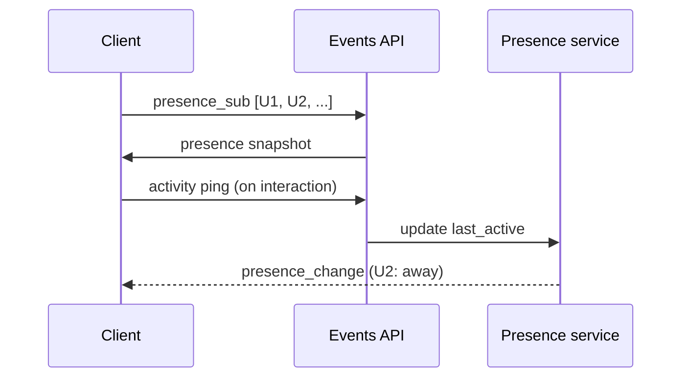
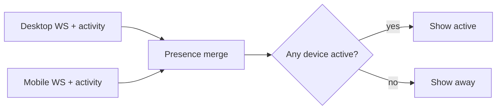
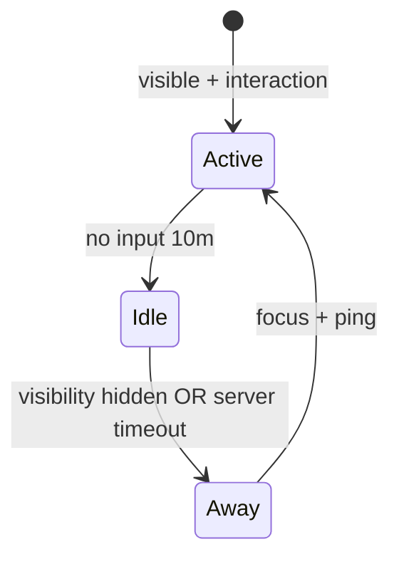
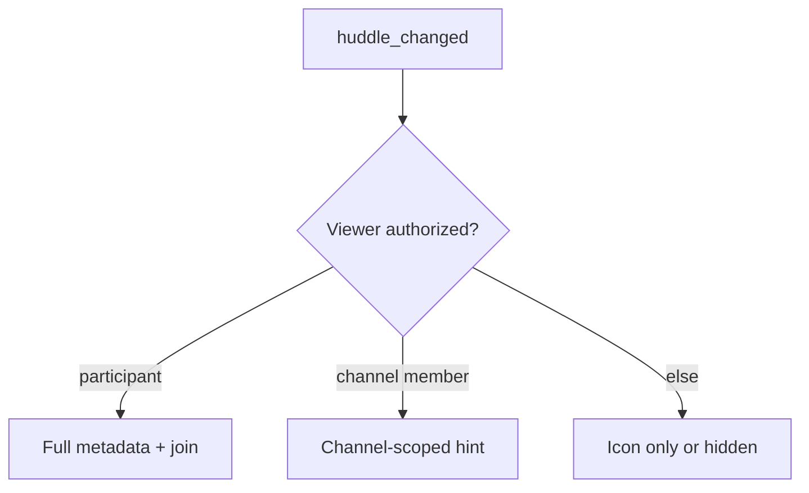

# Section 3 — Presence, Typing & Live Indicators (Answers)

Interview-depth answers for Slack's client: presence, typing, custom status, huddles, and live collaboration signals at workspace scale.

---

## Core

### How does Slack communicate online/away/DND presence for workspace members?

**Problem framing:** Presence is a **high-cardinality, low-fidelity** signal — every workspace member can be visible to hundreds of others, but the UI only needs coarse states (active, away, DND, offline). Pushing per-user heartbeats to every client would crush the WebSocket fleet; polling REST would feel stale and expensive.

**Approach:** Slack uses a **server-authoritative presence service** pushed over the existing Events API WebSocket, not client-to-client gossip.

1. **Subscription model** — On workspace load (or when opening a member list / DM), the client sends `presence_sub` for a bounded set of user IDs (visible rows, open DM, @-mention autocomplete results). The server returns a snapshot and streams deltas via `presence_change` events.

2. **Canonical presence states** — Server maps raw activity into a small enum the UI understands:

   | Server field | UI meaning |
   |-------------|------------|
   | `presence: active` | Green dot — recently interacted with Slack |
   | `presence: away` | Empty/hollow dot — idle or no recent activity |
   | `auto_away: true` | Client-side timeout fired; server may mirror as away |
   | `manual_away: true` | User explicitly set away |
   | DND enabled | Moon icon; suppresses notifications per prefs |

3. **Activity heartbeats** — Each connected client sends lightweight **activity pings** on meaningful interaction (focus window, send message, channel switch) — not on every mousemove. The presence service aggregates last-seen timestamps and emits `presence_change` only when the derived state crosses a threshold.

4. **Client state** — Store `presenceByUserId: Map<userId, { presence, lastUpdated }>` in workspace-scoped Redux/Zustand. UI components (sidebar DMs, member list rows, profile hovercards) select from this map; they never compute presence locally from socket connect state alone.



**Tradeoffs:** Subscription sets must be **bounded** — subscribing to all 10k workspace members on connect is forbidden; lazy-sub as rows enter the virtualized member list. **Pitfall:** Treating WebSocket `connected` as `active` for the local user — tab backgrounded for 20 minutes should flip to away even though the socket is alive (see Deep question on staleness). **Pitfall:** Showing presence for users you aren't subscribed to — stale cache or wrong dot; show "unknown" or fetch on demand.

---

### How do you show "Alice is typing…" in a channel with 200 active members without 200 concurrent indicators?

**Problem framing:** Typing is **ephemeral fan-out** — in a hot channel, dozens of users could theoretically emit typing events simultaneously. Rendering 200 animated footers destroys composer layout and trains users to ignore the signal entirely.

**Approach:** Typing is **scoped, server-filtered, and client-capped** — only relevant to the conversation surface you're viewing.

1. **Server-side channel scope** — When Alice types in `#incidents`, the server emits `user_typing` to subscribers of that channel (or thread), not to the whole workspace. Clients already subscribed to the channel feed receive the event; others never see it.

2. **Client-side relevance filter** — Show typing only when:
   - The user is viewing that channel/thread (not a background prefetch).
   - The typing user is not the local user.
   - The composer is not focused with an empty draft that would hide others' typing (product choice).

3. **Hard cap on visible typers** — Maintain a `typingUsers: Set<userId>` with TTL per entry. Render at most **3 display names + "and N others"** (see Deep question). Never allocate 200 DOM nodes.

4. **Ignore unknown users** — Resolve display names from the workspace member cache; if a Slack Connect external user isn't hydrated yet, show "Someone is typing…" or skip until profile loads.

```text
#incidents (200 online)
  Alice types → user_typing → only clients with #incidents open
  Client cap: "Alice, Bob, Carol and 2 others are typing…"
```

**Tradeoffs:** Typing in a channel with 200 *lurkers* still generates server fan-out — acceptable because events are tiny and short-lived; the client cap handles display. **Pitfall:** Subscribing to typing for every channel in the sidebar — only subscribe for the **active** conversation (+ optionally one background thread). **Pitfall:** Showing typing in the channel list row for all 500 channels — too noisy; limit to the open conversation footer.

---

### How do you debounce typing events so every keystroke doesn't emit a socket message?

**Problem framing:** A fast typist generates 5–10 key events per second. Emitting one WebSocket frame per key in a 50-person thread multiplies into thousands of messages per minute — wasted bandwidth and presence-service load for a hint that only needs ~5-second freshness.

**Approach:** **Emit on start, refresh on interval, explicit stop on send/blur** — classic debounce + throttle hybrid.

| Phase | Client behavior |
|-------|-----------------|
| First key in composer | Immediately send `typing_start` (or Slack's `user_typing` with channel/thread id) |
| Continued typing | Throttle re-emits to every **3–5 s** while input is non-empty |
| Pause ≥ N seconds | Stop sending; server TTL clears indicator |
| Send / clear / blur | Send `typing_cancel` if API supports it; otherwise rely on server TTL |
| Empty composer | No emits |

**Implementation sketch:**

```text
onInput:
  if !isTypingActive → emit typing; isTypingActive = true
  reset idleTimer (5s → isTypingActive = false)
  if now - lastEmit > 3s → emit typing; lastEmit = now

onSend / onBlur:
  isTypingActive = false; clear timers
```

Use **`requestAnimationFrame` or `leading debounce`** for the first character so the indicator appears instantly; trailing debounce alone feels laggy. Coalesce with the same WebSocket batching layer used for other client→server events.

**Tradeoffs:** 3–5 s throttle means someone who types one key and pauses still shows typing for the server TTL (~5–10 s) — acceptable UX. **Pitfall:** Emitting on `keydown` for navigation keys (arrows, Escape) — filter to printable input changes only. **Pitfall:** Debouncing so aggressively (10 s) that typing disappears mid-composition.

---

### How do you handle presence when a user has Slack open on desktop and mobile simultaneously?

**Problem framing:** Multi-device is the default for Slack power users. Each device has its own WebSocket, activity clock, and away timer. The UI must show **one coherent presence** to teammates — "active" if *any* device is engaged, not flickering between devices.

**Approach:** **Server-side merge with per-device activity vectors** — clients report device-scoped heartbeats; the presence service computes the workspace-visible aggregate.

1. **Per-device sessions** — Each client identifies `{ user_id, device_id, platform }` on connect. Activity pings include device context.

2. **Aggregation rule (typical)** — `active` if **any** connected device had user-initiated activity within the active window (~10 min). `away` only when **all** devices are idle past the away threshold. Manual away on one device may set global away (product decision — Slack treats explicit away as global).

3. **DND sync** — DND is a **user-level preference**, not per-device. Enabling DND on mobile immediately reflects on desktop via `dnd_updated` / user prefs event — moon icon everywhere, notifications suppressed per schedule.

4. **Client display** — Local user sees "Active on mobile and desktop" in profile/settings (optional debug); remote users see a **single dot** on the avatar. No "which device" leak in the member list.



**Tradeoffs:** "Active on mobile only" while desktop sleeps is correct but can surprise users who forgot desktop open — auto-away on unfocused desktop after N minutes helps. **Pitfall:** Independent away timers per client causing **flapping** — only the server should publish `presence_change`. **Pitfall:** Double activity pings from two devices inflating "always active" — use server merge, not client OR of local clocks.

---

### What is the UX when a user's status is "In a meeting" via calendar integration?

**Problem framing:** Calendar-linked status is **semi-automatic presence** — it must reflect reality ("I'm in standup") without overwriting intentional user status, and it must degrade gracefully when calendar sync breaks or time zones drift.

**Approach:** Layer **calendar status** beneath **manual custom status** in a clear precedence stack.

**Precedence (highest wins for display text):**

1. Manual custom status (emoji + text + expiry set by user)
2. Calendar-derived status ("In a meeting", "Out of office") while event is active
3. Default presence dot (active/away) without text

**UX behaviors:**

| Surface | Behavior |
|---------|----------|
| Avatar / profile | Show calendar icon or meeting emoji + "In a meeting" under name |
| DM header | "Alice is in a meeting until 10:30 AM" with end time from calendar |
| Notifications | Optional: treat like DND-lite — no hard suppress unless user enables "Mute during meetings" |
| Composer @-mention | Mention still works; autocomplete shows meeting status as context |
| Huddles | "Join anyway" if urgent — status informs, doesn't block |

**Sync path:** Google Calendar / Outlook OAuth → server polls or push-updates events → emits `user_status_changed` to workspace subscribers. Client stores `{ status_text, status_emoji, expiration_ts, source: 'calendar' | 'manual' }`.

**Tradeoffs:** Auto status from calendar can feel creepy if meeting **titles** leak — Slack shows generic "In a meeting", not "Interview at Competitor Inc." **Pitfall:** Stale calendar when laptop sleeps through meeting end — bind display to `expiration_ts` and clear locally even without an event. **Pitfall:** Manual "Available" during a meeting — user intent wins; calendar status should not fight explicit override.

---

### How do you show green active dots in the member list without polling every few seconds?

**Problem framing:** The member list can show hundreds of rows. Polling `users.getPresence` per row every 5 s is O(n) HTTP per scroll frame — unusable. Yet users expect dots to update within seconds when a colleague comes online.

**Approach:** **WebSocket push + lazy subscription + TTL cache** — same presence pipeline as DMs, integrated with list virtualization.

1. **Virtualized list drives subscription** — As member rows mount in the virtualizer viewport, batch `presence_sub` for newly visible `userId`s (debounced 100–200 ms). Unsubscribe (`presence_unsub`) for rows far off-screen after a grace period to cap subscription size.

2. **Push updates** — On `presence_change`, patch `presenceByUserId[userId]` and re-render only affected rows (memoized `MemberRow`).

3. **Initial hydrate** — First paint uses cached presence from IndexedDB workspace snapshot (may be minutes old) with subtle staleness; WebSocket snapshot replaces within one RTT.

4. **No polling loop** — REST `users.getPresence` only as **fallback** when socket is disconnected and user opens a profile, or for one-off hovercard fetch.

```text
Member list scroll → visible IDs [U40..U60]
  → presence_sub batch
  → snapshot + live presence_change
Off-screen 30s → presence_unsub [U1..U20]
```

**Tradeoffs:** Dots for off-screen members may be stale until scrolled into view — acceptable; full accuracy for 10k members is impossible. **Pitfall:** Global interval polling "to keep dots fresh" — reject in interview; use push. **Pitfall:** Re-subscribing on every scroll pixel — batch and diff visible set.

---

## Deep

### How do you aggregate typing indicators — show 3 names + "and 4 others" — and for how long?

**Problem framing:** Raw typing sets are unbounded; the footer must stay one line, readable, and stable (no name shuffle every 300 ms) while still feeling live.

**Approach:** **Sorted cap + TTL + stable ordering tie-break.**

1. **Data structure** — `Map<userId, { startedAt, lastRefresh }>`. On `user_typing`, upsert and refresh TTL.

2. **Display cap** — Sort by `startedAt` ascending (earliest typer first) or alphabetically for stability; take top **3** names. Remainder → `and ${n - 3} others`.

3. **Copy rules:**

   | Count | Footer text |
   |-------|-------------|
   | 1 | Alice is typing… |
   | 2 | Alice and Bob are typing… |
   | 3 | Alice, Bob, and Carol are typing… |
   | 4+ | Alice, Bob, Carol and 1 other are typing… |

4. **TTL** — Remove a user if no refresh for **~5–10 s** (match server-side expiry). Local TTL fires even if cancel event missed.

5. **Animation** — Subtle ellipsis animation; avoid reordering names on every refresh — only re-sort when someone enters or leaves the set.

```text
typing TTL: 8s per user
display cap: 3 names
stable sort: startedAt, then displayName
```

**Tradeoffs:** "And 47 others" in a mega-thread is honest but useless — some teams cap footer at "Several people are typing…" above 10. **Pitfall:** Showing the current user in the list — filter `userId !== self`. **Pitfall:** Resetting TTL on every viewer's render — only refresh on incoming events.

---

### How do you handle presence staleness when the WebSocket is connected but the user switched tabs 20 minutes ago?

**Problem framing:** TCP/WebSocket **connected ≠ user active**. A background tab holds the socket open, so the server may think the user is online while they're in another app — wrong green dot, wrong "available for huddle" signal, wrong notification delivery assumptions.

**Approach:** **Dual clock: connection liveness vs user activity**, using the Page Visibility API and idle detection on the client, with server-side auto-away as backstop.

1. **Page Visibility** — `document.visibilityState === 'hidden'` → stop sending activity heartbeats; start idle timer. On return to `visible`, send immediate activity ping + optional `manual_away: false`.

2. **Idle detection** — No keyboard/mouse in focused Slack window for ~10 min → client sets `auto_away: true` locally and notifies server. Matches Slack desktop behavior.

3. **Background tab WebSocket** — Keep socket alive (for badge/unread) but **do not** claim active presence. Some clients reduce heartbeat frequency in background per browser throttle rules.

4. **Server auto-away** — If no activity ping from **any** device for threshold T, server emits `presence_change → away` regardless of open sockets.

5. **Local vs remote UX** — Local user may still see "You're away" banner with one-click "Activate"; remote users see hollow dot.



**Tradeoffs:** Aggressive auto-away (5 min) feels punitive for people reading long threads without scrolling. **Pitfall:** Relying only on `visibilitychange` — PDF in split view may still be "visible" while user is elsewhere; combine with idle timer. **Pitfall:** Never going away because background tab sends synthetic heartbeats — separate connection keepalive from presence activity.

---

### How do you implement custom status (emoji + text + expiry) and sync it across clients?

**Problem framing:** Custom status is **user-authored, time-bounded state** (":calendar: In meetings until 3 PM") that must appear consistently on profile, hovercards, DM headers, and autocomplete — across desktop, web, and mobile — with offline edits reconciled.

**Approach:** **Server-owned profile field with optimistic multi-client sync.**

1. **Data model** — `UserProfile.status: { emoji, text, expiration_ts, status_canonical }` stored server-side. `expiration_ts = 0` means no expiry.

2. **Write path** — User sets status in profile picker → optimistic local update → `users.profile.set` (or equivalent) → ACK patches canonical fields. On failure, revert and toast.

3. **Sync path** — Other clients receive `user_change` / `status_change` on the workspace WebSocket. Patch workspace member cache and any mounted profile UI.

4. **Expiry handling** — **Client-side scheduler** fires at `expiration_ts` to clear UI immediately; server also clears on read and broadcasts. Clock skew: prefer server `expiration_ts` from ACK over local picker guess.

5. **Presets** — "In a meeting", "Commuting", "Out sick" map to emoji + default duration (1 h, 4 h, today EOD). Reduce typing friction.

```text
Desktop sets ":dart: Focus time" until 5 PM
  → API persist
  → Mobile receives user_change → updates DM header + member cache
  → 5 PM: both clients clear status locally; server confirms on next fetch
```

**Tradeoffs:** Optimistic sync can flash old status for ~1 s on slow networks — show pending state in profile only, not globally. **Pitfall:** Letting each client run independent expiry timers without server ts — user appears "In a meeting" hours later on one device. **Pitfall:** Custom status overwriting calendar status (or vice versa) without precedence rules — document stack (manual > calendar > none).

---

### How do you show huddle/call-in-progress indicators on avatars without leaking call metadata to unauthorized viewers?

**Problem framing:** Huddles and calls are **semi-private realtime sessions** — teammates should see *that* Alice is in a huddle (availability signal) but not *which* channel, *who else* is connected, or *topic* unless they're allowed to join. Wrong ACL leaks create security and social bugs.

**Approach:** **Capability-scoped presence flags** — server emits coarse indicators tied to authorization, never raw call IDs to unauthorized clients.

1. **Indicator tiers by viewer relationship:**

   | Viewer | Avatar badge | Detail on hover |
   |--------|--------------|-----------------|
   | Same huddle participant | Headphones/on-call icon | Full participant list |
   | Same channel member, huddle in channel | Headphones on Alice | "In a huddle in #team" + Join |
   | Workspace member, DM huddle | Headphones | "In a huddle" (no roster) |
   | Not in channel / no ACL | No badge OR generic "Unavailable" | No join CTA |

2. **Event shape** — Push `huddle_changed` with `{ user_id, in_huddle: true, surface: 'channel' | 'dm', channel_id? }`. **`channel_id` only included if subscriber is channel member.** Roster count, not participant IDs, for non-members.

3. **Client rendering** — Merge huddle flag into avatar overlay component (same layer as DND moon). Do not log full event payload to analytics for unauthorized views.

4. **Slack Connect / shared channels** — Apply **cross-org policy**: external members see "In a huddle" without internal-only channel names if policy forbids.



**Tradeoffs:** Generic "In a huddle" for DMs protects privacy but reduces serendipitous join — intentional. **Pitfall:** Leaking huddle channel id via DOM attributes or client cache readable by guests. **Pitfall:** Stale huddle badge after crash — server TTL + disconnect handler clears `in_huddle` within seconds.

---

### How do you throttle presence updates during a workspace-wide event (all-hands, incident channel spike)?

**Problem framing:** During an all-hands or #incidents fire, **thousands of users** connect, tab-focus, and type simultaneously. Uncoordinated `presence_change` and `user_typing` floods can spike WebSocket egress and cause client jank from constant store patches.

**Approach:** **Multi-layer throttling: client coalesce, server sample, UI batch render.**

1. **Client egress shaping** — Activity pings coalesced to max **1 per 30–60 s** per device during detected high-load (or always). Typing emits already debounced; tighten to 5 s refresh under load.

2. **Server-side aggregation** — Presence service **samples** updates: batch `presence_change` per user to max 1/60 s. Typing events deduped per `(channel, user)` with fixed TTL; subscribers receive at most one refresh per TTL window.

3. **Subscription minimization** — In a 5k-member #announcements view, **disable member-list presence sub** entirely — only show typing in active thread/composer context. Presence dots in channel header avatars limited to @mentions and thread participants.

4. **UI render batching** — Apply presence patches on `requestAnimationFrame` or React `unstable_batchedUpdates`; member list rows use memoization so 500 identical `away` transitions don't reflow the tree.

5. **Graceful degradation banner** — Optional: "Live updates may be delayed" when event rate exceeds client budget — prefer silent degradation over lying green dots.

| Layer | Normal | Spike mode |
|-------|--------|------------|
| Activity ping | ~1–2 min | 30–60 s |
| Typing refresh | 3 s | 5 s |
| presence_change delivery | immediate | batched ≤1/min/user |
| Member list dots | viewport sub | paused or cached |

**Tradeoffs:** Delayed presence during incidents is acceptable — message delivery stays prioritized on the same socket. **Pitfall:** Turning off typing entirely — engineers in #incidents rely on it; throttle, don't delete. **Pitfall:** Client-side throttle without server backpressure — fleet still melts; shaping must be bilateral.

---

*Section 3 complete. Next: message composer & rich formatting (Section 4).*
