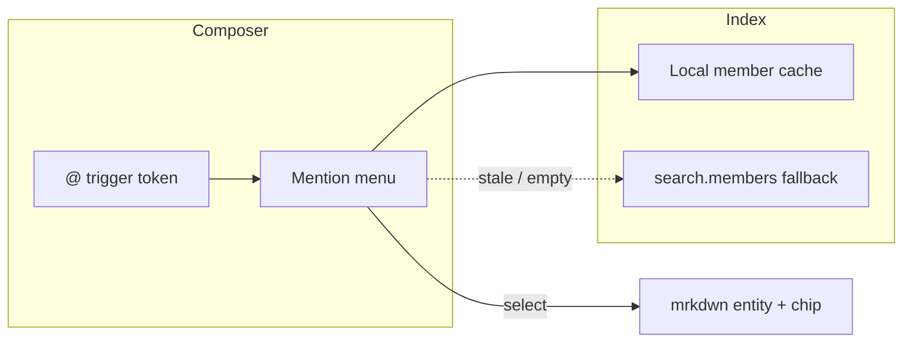
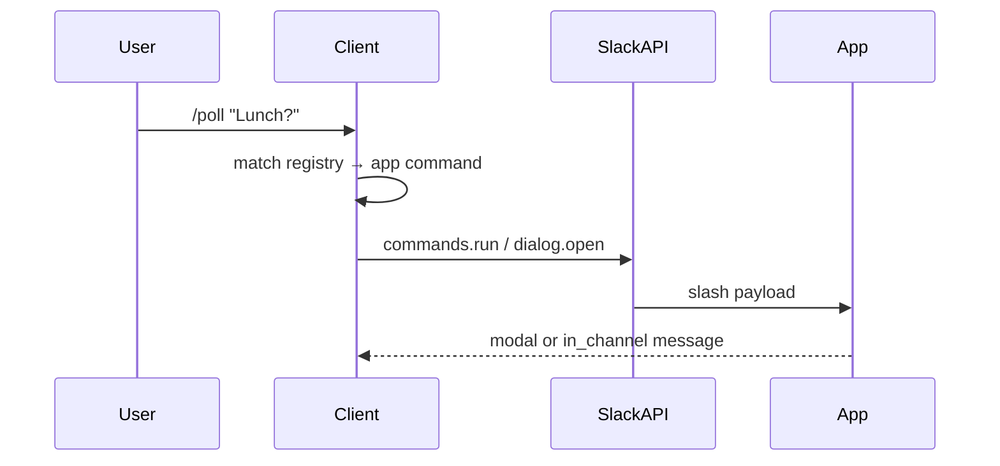
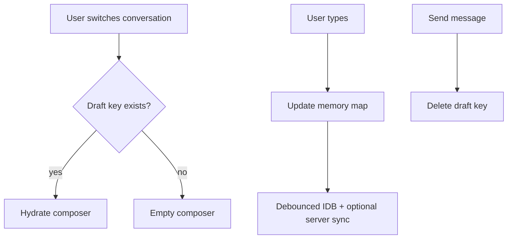
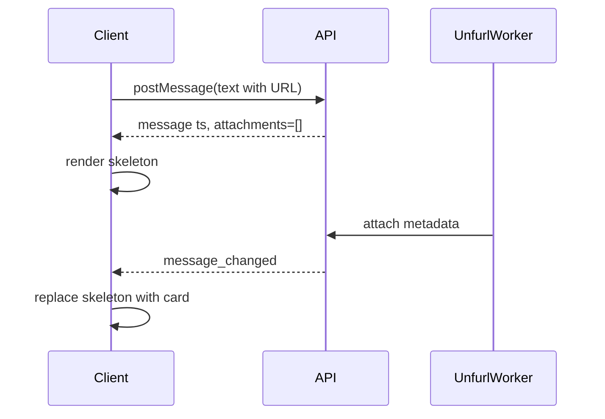
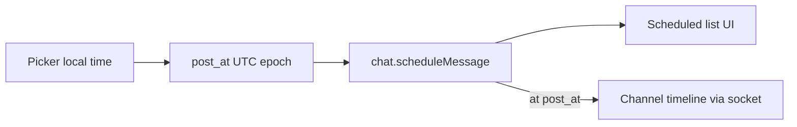
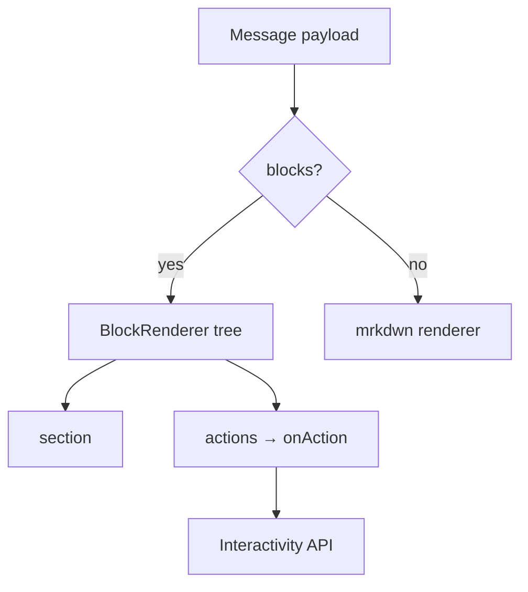
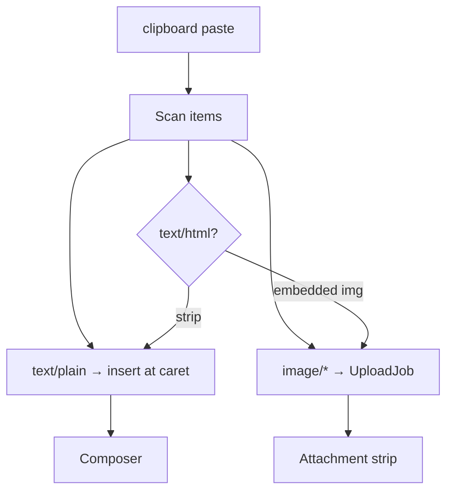

# Section 4 — Message Composer & Rich Formatting

Interview-prep system design answers for Slack's message composer: mentions, mrkdwn, emoji, slash commands, drafts, uploads, unfurls, Block Kit, edits, and scheduling.

---

## Core

### How do you implement @-mention autocomplete that searches users, user groups, and @channel/@here?

**Problem framing:** The composer must offer typeahead for `@alice`, `@engineering` (user group), `@channel`, and `@here` without blocking typing or firing a network request on every keystroke. Results must respect channel membership, guest boundaries, and notification semantics — a wrong `@channel` suggestion erodes trust fast.

**Approach:** Treat mentions as a **token trigger** inside a rich-text composer (contenteditable or Slate/ProseMirror-style document model). When the caret sits inside an `@`-prefixed token (regex: `(^|\s)@([\w-]*)$` before caret), mount a **floating mention menu** anchored to the caret via `Range.getBoundingClientRect()`.

Maintain a **local mention index** hydrated at workspace/channel load: channel members (from `conversations.members` or cached roster), user groups (`usergroups.list`), and reserved tokens `@channel`, `@here`, `@everyone` (if enabled). Filter client-side with fuzzy match (Fuse.js or prefix trie) for sub-50ms feedback; debounce optional server `search.members` only when the local index is stale or query length > 2 and local results < 5.

Menu rows are typed: `{ kind: 'user' | 'usergroup' | 'broadcast', id, label, avatar, memberCount?, warning? }`. Selecting a row **replaces the trigger token** with a canonical mrkdwn entity stored in the doc model — e.g. `<@U123>` for users, `<!subteam^S456|@eng>` for groups, `<!channel>` / `<!here>` for broadcasts — while rendering a styled **chip** in the composer (`@Alice`, `@engineering`, `@channel` with distinct color for broadcast). Show a **confirmation affordance** for `@channel`/`@here` (extra click or "Notify X members" subtitle) because they fan out notifications.

Keyboard: ↑↓ navigate, Enter/Tab select, Esc dismiss. Accessibility: `aria-activedescendant`, announce selection via live region.



**Tradeoffs:** Pure client index is instant but can be wrong after mid-session joins — refresh on `member_joined_channel` events. Server-only search is always fresh but adds latency; hybrid is Slack's shape. `@everyone` is often admin-gated — hide unless `canNotifyEveryone`. Guest users may see truncated member lists; never leak users outside the shared channel boundary.

---

### How do you render Slack mrkdwn (`*bold*`, `_italic_`, `<#C123|general>`, `<@U123>`) in sent messages?

**Problem framing:** Slack stores messages as **mrkdwn strings**, not HTML. The client must parse a constrained markup dialect into safe, accessible React (or equivalent) while resolving IDs to live labels (user left workspace, channel renamed) and avoiding XSS from `<http://evil|click me>`-style links.

**Approach:** Split rendering into **parse → resolve → render**, never `dangerouslySetInnerHTML` on raw message text.

1. **Parse:** Walk the string with a tokenizer (or compiled regex pipeline) for mrkdwn entities: `*bold*`, `_italic_`, `~strike~`, `` `code` ``, ```` ```block```` ````, `<url|label>`, `<@U123>`, `<#C123|name>`, `<!date^unix^format|fallback>`, `<!channel>`, emoji shortcodes `:wave:`. Build an AST of `{ type, children, meta }` nodes. Code blocks and preformatted regions are **literal** — no nested formatting inside.

2. **Resolve:** Batch unresolved IDs against client caches: `usersById`, `channelsById`. Missing entries trigger lazy `users.info` / `conversations.info` or show fallback (`@deactivated`, `#unknown-channel`). Links pass through an allowlist scheme check (`http`, `https`, `mailto`, `tel`); strip or neutralize `javascript:`.

3. **Render:** Map AST nodes to components: `MrkdwnBold`, `MrkdwnLink` (opens in new tab, `rel="noopener"`), `MentionChip` (click → profile / DM), `ChannelLink` (click → navigate), `Emoji` (sprite or CDN URL). Search highlighting and edit mode reuse the same parser with a different leaf renderer.

For **composer preview** (optional WYSIWYG), maintain parallel representations: visual doc model ↔ canonical mrkdwn on send via `serialize()`.

| Entity | Stored form | Rendered |
|--------|-------------|----------|
| User mention | `<@U123>` or `<@U123\|alice>` | `@Alice` link |
| Channel | `<#C123\|general>` | `#general` link |
| Link | `<https://x.com\|label>` | anchor |
| Broadcast | `<!here>` | `@here` badge |

**Tradeoffs:** Regex-only parsers are fast but brittle for nested edge cases; AST parser costs more code but powers edit, copy, and search consistently. Caching parsed AST per `message.ts + message.text` avoids re-parse on unrelated re-renders in virtualized lists. Server also sends `blocks` for rich bot messages — prefer Block Kit when present, mrkdwn fallback on `text` field.

---

### How do you handle emoji `:shortcode:` autocomplete and custom workspace emoji?

**Problem framing:** Users expect `:th` → `:thinking_face:` with skin-tone variants and **custom workspace emoji** mixed with Unicode. Autocomplete must not fight with mrkdwn link syntax or code spans, and custom emoji need CDN URLs scoped per workspace.

**Approach:** Reuse the same **trigger-token** machinery as `@` mentions. Detect `:`-wrapped partial at caret (`(?:^|\s):([a-z0-9_+-]*)$`), excluding regions inside `` ` `` and ` ``` ` via the doc model's **mark boundaries**.

**Emoji catalog:** On workspace boot, fetch `emoji.list` → build `{ shortcode, url, aliasOf?, isCustom }[]`. Unicode emoji come from a static CLDR/emoji-mart dataset; custom emoji map shortcode → `https://…/emoji/name.png`. Index with prefix trie for `:smi` → `:smile:`, `:smiley:`, custom `:smile-brand:`.

Menu shows grid row: thumbnail, `:shortcode:`, `(custom)` badge for workspace uploads. **Skin tones:** if base emoji supports Fitzpatrick modifiers, sub-menu or long-press on `:+1:` → `:+1::skin-tone-3:`. On select, insert either Unicode codepoint sequence or `<emoji name>` mrkdwn for custom (`:blob-wave:` stored as shortcode in text; render resolves to ``).

Custom emoji are **workspace-scoped** — when rendering messages from shared Slack Connect channels, resolve against the **host workspace's** emoji set or fall back to `:shortcode:` text if unknown.

**Tradeoffs:** Bundling all Unicode emoji bloats initial JS; lazy-load emoji data on first `:` trigger. Client-only list can drift until `emoji_changed` socket event — subscribe and patch catalog. `:shortcode:` inside code must never autocomplete — mark-aware parsing is non-negotiable.

---

### How do you implement slash commands (`/remind`, `/poll`) — client-side routing vs server round-trip?

**Problem framing:** Slash commands look like a chat prefix but span three behaviors: **built-in client shortcuts**, **workspace-installed app commands**, and **Slack-native server commands** (`/remind`, `/topic`). The client must route correctly, show help text before send, and never execute privileged actions without server validation.

**Approach:** Partition commands into tiers:

| Tier | Examples | Where handled |
|------|----------|---------------|
| Client-native UI | `/me`, `/shrug`, draft formatting | Client expands text before `chat.postMessage` |
| Server Slack commands | `/remind`, `/topic`, `/archive` | Client sends to **`/api/chat.command`** or dedicated endpoint; server executes |
| App commands | `/poll`, `/standup` | Client shows app-provided **dialog/modal** or forwards payload to app backend via Slack API |

**Composer UX:** When input matches `^/(\w*)$` at line start, show **command palette** filtered by registry merged from `commands.list` + static built-ins. Each entry: `{ name, desc, usage, appId?, supportsModal }`. Tab-complete inserts `/remind ` with trailing space; some commands open **modal forms** (datetime picker for remind) instead of free-text send.

On **Enter** with a slash command:
1. If `handler.type === 'modal'` → `views.open` / in-client modal; do not post a visible message until submit.
2. If `handler.type === 'server'` → POST command string + `channel_id` + `trigger_id`; render **ephemeral response** in composer area or thread (only visible to user) per response type.
3. If `handler.type === 'expand'` → transform text (`/me hello` → `_hello_`) and fall through to normal send.

Register handlers in a **command router** keyed by command name; unknown commands show inline error before network call.



**Tradeoffs:** Client-side expansion is snappy but must mirror server rules or users see different outcomes on other clients — reserve for cosmetic transforms only. Always treat server response `response_type` (`ephemeral` vs `in_channel`) as authoritative. Debounce command list fetch; stale list misses new app installs until `app_installed` event.

---

### How do you preserve an unsent draft per channel when the user switches between conversations?

**Problem framing:** Users expect `#incidents` draft to survive switching to a DM and back — including text, pending uploads, and mention chips. Drafts must be **scoped per workspace + conversation** (channel, DM, or thread composer) without leaking across workspaces or syncing stale content over sent messages.

**Approach:** Key drafts by **`{ workspaceId, conversationId, threadTs? }`**. Store in two layers:

1. **Hot memory:** `drafts: Map<DraftKey, DraftState>` in client store for instant restore on conversation switch (`{ text, docJson?, attachments[], scheduledAt? }`).
2. **Durable local:** IndexedDB table `drafts` (same key) — survives refresh; optional sync via **`drafts.list` / `drafts.update`** Slack API for cross-device (Enterprise feature).

On **conversation blur** (switch channel, open thread, Cmd+K away): serialize composer → write to map + debounced IDB persist (300ms). On **conversation focus**: hydrate composer from map; if empty, async read IDB/server. Clear draft on **successful send** or explicit discard.

Thread vs main channel are **separate keys** — replying in thread does not clobber channel draft. Show subtle **"Draft"** pill in sidebar channel list from persisted keys.

Handle **optimistic conflict:** if user had draft and receives a `draft_changed` event from another device, prompt "Replace local draft?" or merge if trivial.



**Tradeoffs:** Server-synced drafts enable mobile↔desktop continuity but add latency and privacy review (drafts may contain secrets). Local-only is simpler; cap IDB size and evict LRU drafts beyond N conversations. Do not autosave empty drafts — avoids noise in sidebar indicators.

---

### How do you handle file drag-and-drop with upload progress, cancellation, and inline preview before send?

**Problem framing:** File upload is part of the compose action, not post-send. Users drag screenshots, PDFs, and zips expecting **thumbnail preview**, progress, cancel, and the ability to add a caption before hitting Enter — all without blocking the textarea or losing partial uploads on conversation switch.

**Approach:** Model attachments as **upload jobs** in composer state, separate from message text:

```ts
type UploadJob = {
  clientFileId: string;
  file: File;
  status: 'queued' | 'uploading' | 'processing' | 'ready' | 'failed' | 'cancelled';
  progress: number; // 0–1
  abortController: AbortController;
  remote?: { fileId: string; mimetype: string; thumbUrl?: string };
};
```

**Drop target:** Composer shell registers `dragenter/dragover/drop` — highlight border on drag. On drop, `files.getFiles()` → create jobs → start upload pipeline.

**Upload path:** `files.getUploadURLExternal` → PUT bytes to URL with **`XMLHttpRequest` or fetch + ReadableStream** for progress events → `files.completeUploadExternal` → optional **`files.info`** for thumb. Slack uses external upload URLs so large files bypass app servers.

**UI:** Horizontal **attachment strip** above textarea: image thumb (object URL until remote thumb ready), filename, progress bar, X to cancel. Cancel calls `abortController.abort()` and `files.revokePublicURL` if needed. Caption text lives in composer; send disabled until all jobs `ready` or user removes failed ones.

On conversation switch, **persist pending jobs** in draft state — resume upload if same session, or re-queue from `File` blob stored in IDB (store blob reference, not just metadata).

**Tradeoffs:** `URL.createObjectURL` previews are instant but must be revoked to avoid memory leaks. Parallel uploads (max 3) balance speed vs browser connection limits. Snippet/image paste overlaps — unify into same `UploadJob` pipeline. Guest/file-retention policies may block upload early — surface policy errors on drop, not on send.

---

## Deep

### How do you implement link unfurling — show a loading skeleton, then replace with a rich attachment card?

**Problem framing:** When a user posts a URL, Slack **asynchronously unfurls** metadata (title, description, image, provider). The message appears immediately with raw link text; a rich **attachment card** arrives later via `message_changed` or link_shared pipeline. The UI must avoid layout jump panic and handle unfurl failures gracefully.

**Approach:** On send, optimistically render the message with **plain mrkdwn link**. Client includes `unfurl_links: true, unfurl_media: true` in `chat.postMessage` (unless user toggled "Do not unfurl").

**Loading state:** When message ACK includes `attachments: []` but URLs detected in text, render a **skeleton attachment block** (gray bars, fixed min-height ~72px) beneath the text — keyed by `message.ts`. Do not skeleton if user pref or `#channel` disables unfurl.

**Update path:** Server/bot completes unfurl → pushes **`message_changed`** with populated `attachments[]` or Block Kit `blocks`. Client merges by `message.ts`, replaces skeleton with **AttachmentCard** component: hero image (lazy), title, text, footer provider icon, optional actions. Remove skeleton in same React key to minimize layout shift; reserve max-width consistent with message column.

**Link shared / preview API:** Some flows use **`chat.unfurl`** with `url_private` for authenticated previews (Google Docs, internal tools) — client may pre-call for paste preview in composer before send (optional "Link preview" toggle).

Handle **unfurl denied** (paywall, robots.txt, user setting): remove skeleton, keep bare link. **Multiple URLs:** Slack may unfurl first only — skeleton per attachment slot or single combined per server rules.



**Tradeoffs:** Skeleton height guess wrong → still some jump when hero image aspect ratio unknown; use `aspect-ratio` container from oEmbed width/height when available. Prefetch unfurl on paste delays send — better UX for preview toggle, not default. Enterprise may strip external unfurls — respect `app_uninstalled` / DLP flags in attachment render.

---

### How do you handle a message that exceeds the character limit — hard block, warn, or split?

**Problem framing:** Slack enforces a **~40k character** limit (varies by surface). Long paste (logs, stack traces) must fail predictably — silent truncation or broken sends destroy incident workflows.

**Approach:** Enforce at **three layers**:

1. **Composer (soft):** Live character counter when > 80% threshold; turn red at 100%. At limit, **block Enter send** and shake counter — do not truncate user input while typing.
2. **Client submit (hard):** Before `chat.postMessage`, if `text.length > MAX` → modal: "Message too long — **Upload as snippet** / **Trim** / Cancel." Offer one-click **convert to snippet file** (`.txt` upload) with first 200 chars + "…see file" in message body.
3. **Server (authoritative):** If API returns `msg_too_long`, revert optimistic message to failed state with retry affordances.

**Splitting** is generally **not** automatic for chat messages — order guarantees and notification semantics break. Exception: internal **import tools** or bot pipelines may chunk with `(1/3)` prefixes — never default UX for humans.

For **Block Kit-only** bot payloads, limit applies to `text` fallback and block JSON size separately — validate in builder UI.

**Tradeoffs:** Hard block frustrates power users; snippet conversion is the Slack-shaped escape hatch. Warning-only without block risks failed optimistic send. Thread replies share same limit — no special casing unless product requires.

---

### How do you implement message scheduling ("Send later") with optimistic UI and timezone display?

**Problem framing:** Scheduled messages must feel **immediate in the composer** (clear that it won't post now), show **local timezone**, survive client restart, and appear in channel history only at **`post_at`** — without duplicate sends or missing reminders.

**Approach:** Composer **Schedule** action opens datetime picker (native or custom) defaulting to next half-hour in **user's locale timezone** (`user.profile.tz` or browser fallback). Display humanized label: "Tomorrow at 9:00 AM IST" via `Intl.DateTimeFormat` + `date-fns-tz`.

On confirm, call **`chat.scheduleMessage`** with `post_at` unix timestamp (UTC on wire, local in UI). Do **not** insert into channel timeline — instead:

1. Show **Scheduled tab / sidebar section** listing pending messages `{ id, channel, text preview, postAt, status }`.
2. Optimistic row with `status: pending` until API returns `scheduled_message_id`.
3. Allow **Edit / Cancel** via `chat.deleteScheduledMessage` / update API.

At fire time, server posts message → client receives normal `message` event → remove from scheduled list. If user is offline at fire time, message still posts — no client action required.

**Timezone display:** Store UTC; render always in viewer's TZ. For cross-TZ teams, optional tooltip shows "9:00 AM for you · 5:30 PM PST for @alice" when scheduling DM.



**Tradeoffs:** Optimistic timeline insert would require rollback — avoid. Reminder notifications ("Your message was sent") are optional product noise. Scheduled messages in threads use `thread_ts` + same API — UI must clarify which surface.

---

### How do you render Block Kit messages (sections, actions, context blocks) from bot integrations?

**Problem framing:** Bot and app messages often arrive as **`blocks[]`** JSON (Block Kit), not mrkdwn alone. The client must render a **consistent design system** — sections, dividers, accessory buttons, select menus, context footers — with interactive elements wired to **action IDs** and rate limits.

**Approach:** Implement a **`BlockRenderer`** that maps block `type` → React component:

| Block type | Render |
|------------|--------|
| `section` | mrkdwn `text` + optional `fields[]` grid + `accessory` (button, image, overflow, picker) |
| `context` | small muted mrkdwn/images row |
| `actions` | horizontal button/select group (max 5 elements) |
| `divider` | `<hr>` |
| `image` | titled image block |
| `header` | plain-text heading |
| `input` | only in modals — not inline feed |

Reuse **mrkdwn parser** for `text` fields inside blocks. **`accessory` buttons** dispatch `block_actions` payload to server via **`chat.postMessage` response URL** or interactive endpoint — include `action_id`, `block_id`, `value`, `message_ts`.

**Interactivity state:** After click, show loading on button; apply **`replace_original`** / `response_url` updates when server returns new blocks. Disabled buttons when channel read-only or missing permissions.

**Fallback:** If `blocks` present but client too old, render `text` + `attachments` legacy. If block array empty, mrkdwn-only.

Virtualized lists must measure **variable block height** — cache measured height per `message.ts + blocksHash` in layout cache.



**Tradeoffs:** Full Block Kit parity is large surface (modals, home tab, workflows) — message feed focuses on display + primary actions. Custom styling must not break app expectations — stay within Slack token spacing/colors. Over-nesting blocks hurts mobile — responsive rules collapse `fields` to single column.

---

### How do you implement "Edit message" with inline replacement and propagate `message_changed` to all open views?

**Problem framing:** Editing replaces message content in place while preserving `ts` identity. **`message_changed`** events must update the main channel feed, thread sidebar, search results, pinned messages, and **quoted previews** — without duplicate rows or stale mrkdwn.

**Approach:** **Edit entry:** long-press / ⋮ menu → `EditMessage`. Swap `MessageRow` into **edit mode**: composer pre-filled with raw mrkdwn (or deserialized doc model), same mention/emoji tooling as main composer. Save → `chat.update` with `text` + optional `blocks`; Cancel → restore read view.

**Optimistic update:** On save, patch local store `{ ...msg, text, edited: { user, ts } }` immediately; revert on API error.

**`message_changed` propagation:** Central **message store** keyed by `channelId + ts` (threads: same `ts`, different `thread_ts` context). All surfaces subscribe to store selectors:

- Channel virtualized list
- Thread pane (if open on that `thread_ts`)
- Pinned items panel
- Search highlight snippets (re-fetch or patch if result open)

Event payload includes `message.text`, `message.blocks`, `previous_message` for audit. Merge with **LWW on `event_ts`** to ignore stale edits during reconnect replay.

Show **(edited)** label with hover tooltip of edit time. If edit removes thread parent text, thread replies remain — parent stub still shows.

**Conflict:** User editing while another admin deletes → `message_deleted` wins; close edit mode with toast.

**Tradeoffs:** Inline edit vs modal — inline preserves scroll context but cramped on mobile (modal wins). Storing both mrkdwn source and rendered AST doubles memory — cache AST lazily. Edit history is not shown to users by default — `previous_message` is for compliance/debug only.

---

### How do you handle paste-from-clipboard that includes both text and an image in one composer action?

**Problem framing:** Screenshot paste (⌘V) often yields **`text/html` + `image/png`** together — e.g. copying from a doc with inline image. The composer must insert **both** caption text and attachment preview in one gesture without duplicate uploads or dropped content.

**Approach:** Single **`onPaste`** handler on composer with prioritized extraction:

1. **`clipboardData.items` scan:** For each item — if `kind === 'file'` and `type.startsWith('image/')`, queue `UploadJob`; if `kind === 'string'` && `text/plain`, capture text (and optionally strip redundant HTML).
2. **Order:** Insert plain text at caret first; append image jobs to attachment strip (Slack pattern: image below or above text depending on product — typically **files after text** in final message `files[]` order).
3. **Deduplicate:** If HTML contains `` *and* binary image item exists, prefer **binary** (full resolution) and skip CID placeholder text.
4. **Rich HTML paste:** Optionally `pasteAndMatchStyle` — strip to plain mrkdwn unless WYSIWYG mode; convert `<b>` → `*bold*`, links → `<url|label>`.

For **Excel/Slack-internal paste**, may receive structured snippet — detect magic clipboard MIME and call **`files.uploadV2`** with generated CSV/HTML snippet instead of raw image.

Do not auto-send on paste; user adds context and hits Enter.



**Tradeoffs:** Reading HTML is messy (Word bloat) — default to plain text unless user ⌘⇧V "paste as plain". Multiple images in one paste queue parallel uploads with shared draft key. Security: never `eval` clipboard HTML; sanitize before any innerHTML preview. Browser support for `clipboardData.items` varies on Firefox — fallback to `files` from `clipboardData.files` only.
