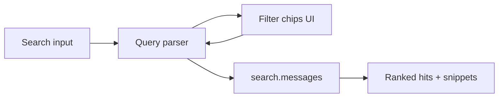
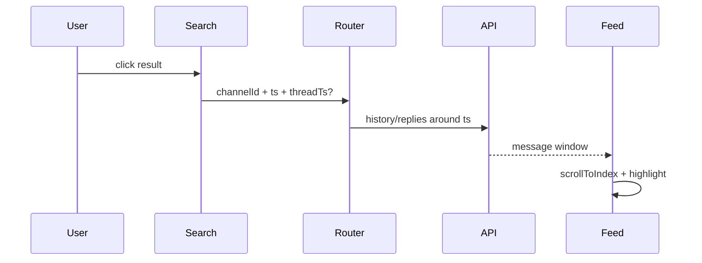
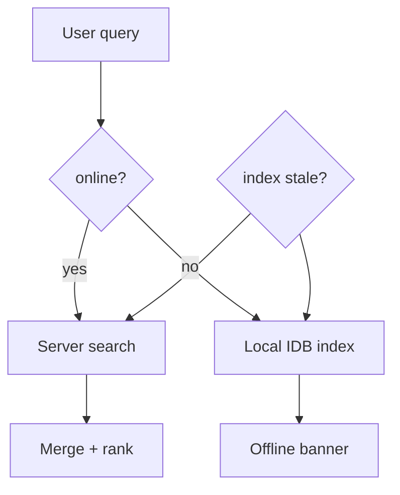
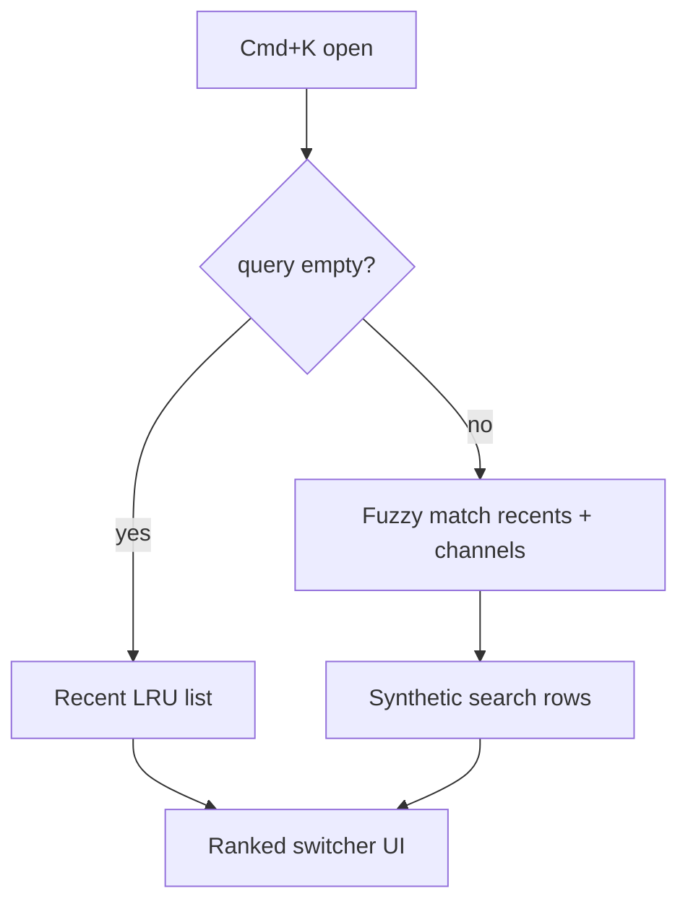
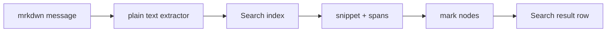
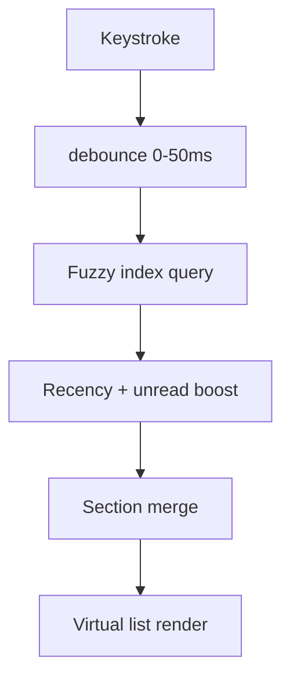
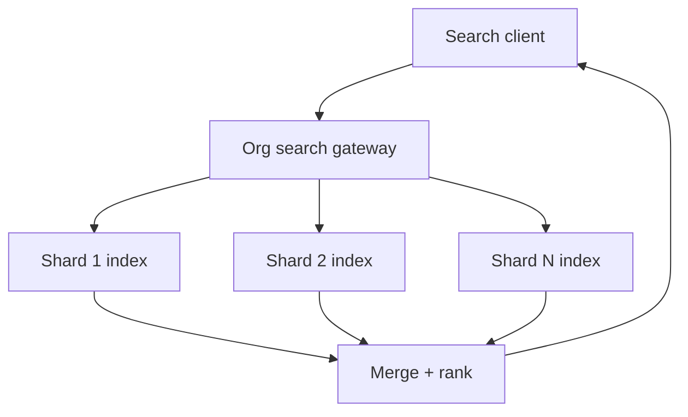
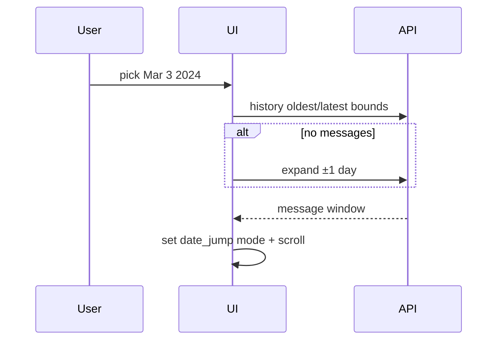

# Section 5 — Search & Discovery (Answers)

Interview-depth answers for Slack's search subsystem: workspace message search with filters, deep-link navigation, offline/stale index handling, quick switcher (Cmd+K), Enterprise Grid cross-shard search, result caching, and jump-to-date.

---

## Core

### How do you implement workspace search with filters (from:, in:, has:, before:, after:)?

**Problem framing:** Slack search is not a single text box — users expect **structured filters** (`from:@alice`, `in:#incidents`, `has:link`, `before:2024-01-01`, `after:yesterday`) composable with free text. The client must parse input into a query AST, translate to API parameters, show active filter chips, and autocomplete filter values without requiring users to memorize syntax.

**Approach:** Split into **query parser → API mapper → results UI**.

1. **Parser:** Tokenize input into `{ type: 'text' | 'filter', key?, value?, raw }[]`. Recognize filter prefixes via regex or incremental lexer as user types:

| Filter | API field | Client autocomplete source |
|--------|-----------|---------------------------|
| `from:` | `user` / `author` | Channel members + recent authors |
| `in:` | `channel` | User's channels, DMs, `@me` for DMs |
| `has:` | `has` | Static enum: `link`, `file`, `pin`, `reaction`, `star` |
| `before:` / `after:` | `latest` / `oldest` (ts) | Date picker + natural language (`yesterday`, `last week`) |
| `is:` | `is` | `saved`, `thread`, `dm` |

2. **Chip UI:** Parsed filters render as **removable pills** above the search input; editing a pill reopens typeahead for that filter type. Free-text tokens stay in the input field.

3. **API call:** Map AST to `search.messages` (or unified search endpoint):

```ts
type SearchQuery = {
  query: string;           // remaining free text after filters extracted
  sort: 'score' | 'timestamp';
  sort_dir: 'desc' | 'asc';
  count: number;
  page?: string;           // cursor
  // filters
  user?: string;           // from: U123
  channel?: string;        // in: C456
  has?: 'link' | 'file' | ...;
  oldest?: string;         // after: → oldest bound
  latest?: string;         // before: → latest bound
};
```

4. **Typeahead while typing:** When caret follows `from:` or `in:`, swap to **scoped autocomplete** (member list, channel list) instead of message search. Debounce free-text search 200–300ms; filters apply immediately on Enter.

5. **Scope enforcement:** Client never searches channels the user cannot access — server is authoritative, but client pre-filters `in:` suggestions to joined conversations to avoid empty-result confusion.



**Tradeoffs:** Client-side parser enables instant chips but must stay in sync with server-supported filters — unknown filters pass through as literal text or show "unsupported" hint. Natural-language dates (`after:last monday`) need a shared date library; wrong TZ on `before:`/`after:` is a common bug — always interpret in **user profile timezone**, convert to UTC epoch for API. Advanced filters (`has:reaction:thumbsup`) may be server-only; don't fake them in UI.

---

### How do you show search results that jump the user to the exact message in channel context?

**Problem framing:** A search hit is useless if it opens `#general` at the bottom. Users need **deep link to the exact message** with surrounding context (messages above/below), correct thread surface if the hit is a reply, and scroll position that keeps the target visible — not buried under the composer.

**Approach:** Each result row carries **`{ channelId, messageTs, threadTs?, permalink }`**. On click:

1. **Navigate:** Route to conversation — `/{workspace}/archives/{channelId}/p{tsWithoutDot}` (Slack permalink shape). Set `activeSurface` to `thread` if `threadTs` present.

2. **Hydrate context window:** Do not load full channel history. Call **`conversations.history`** or **`conversations.replies`** (for thread hits) with:
   - `latest = messageTs + epsilon`
   - `oldest = messageTs - N messages or -7 days`
   - `limit = ~50`
   - `inclusive = true` on anchor ts

   Merge into normalized message store without clobbering already-loaded ranges.

3. **Scroll & highlight:** After virtual list layout, **`scrollToIndex(anchorIndex, { align: 'center' })`** in channel or flexpane list. Apply **transient highlight** (yellow flash, 2s fade) on target row via `data-highlight-ts={ts}`.

4. **Thread parent case:** If hit is a **thread reply**, open flexpane on `threadTs`, scroll flexpane to reply ts; optionally show collapsed parent at top of flexpane.

5. **Permalink resilience:** If message not in loaded window (deleted, retention), show inline error in search pane: "Message unavailable — may have been deleted" with link to channel anyway.



**Tradeoffs:** Center-align vs top-align — center works for isolated hits; very tall messages (embeds) may need `scrollIntoView` with `block: 'nearest'`. Opening thread + channel simultaneously is heavier — defer flexpane open until history returns to avoid empty pane flash. **Pitfall:** Using `ts` string compare without normalizing floating-point string format (`1234567890.123456`).

---

### How do you handle search while offline or with a stale local index?

**Problem framing:** Search normally hits the server index, but users expect **some utility offline** (recent messages, downloaded files) and graceful degradation when the local cache is hours old. Hard-failing with a spinner erodes trust; silently showing incomplete results without disclosure is worse.

**Approach:** Tiered search strategy:

| Tier | Source | When |
|------|--------|------|
| **Online authoritative** | `search.messages` API | Default when connected |
| **Local index** | IndexedDB / SQLite message cache | Offline or `navigator.onLine === false` |
| **Hybrid refresh** | Local first, server merge | Slow network / explicit "Search all messages" |

**Local index:** On message ingest (socket + history fetch), **index denormalized docs** into IDB `searchIndex` table: `{ workspaceId, channelId, ts, textPlain, userId, hasFile, hasLink, indexedAt }`. Use MiniSearch, FlexSearch, or lunr for BM25-lite ranking. Strip mrkdwn to plain text at index time (see Deep section).

**Offline UX:**
- Banner: **"Searching cached messages only — last updated 3h ago"**
- Disable filters the local index cannot satisfy (`has:reaction` without reaction cache) — grey out with tooltip
- Queue query; auto-re-run when online

**Stale detection:** Track `lastIndexedAt` per workspace. If `Date.now() - lastIndexedAt > TTL` (e.g. 24h) and online, show subtle **"Results may be incomplete — syncing index…"** while background re-index runs from recent history cursors.

**Conflict on reconnect:** Server results supersede local for same query; dedupe by `channelId + ts`.



**Tradeoffs:** Full local index for 100k messages per workspace is heavy — cap to last N days or M messages with LRU eviction aligned to IDB message retention policy. Enterprise legal hold may forbid local indexing of certain channels — respect `is_excluded_from_index` flags from server. **Never** claim parity with server search offline.

---

### How do you differentiate searching messages vs searching for channels/people to join or DM?

**Problem framing:** The same Cmd+K / search box serves **three intents**: find an old message, find a channel to open, find a person to DM. Mixing them produces noisy results ("alice" → 400 message hits before @Alice). The client needs distinct **modes** or a unified ranked blend with clear section headers.

**Approach:** Model as **search domains** with separate indexes and APIs:

| Domain | API / index | Primary UX |
|--------|-------------|------------|
| **Messages** | `search.messages` | Search sidebar / full-page results with snippets |
| **Conversations** | Local channel list + `search.channels` | Quick switcher rows: `#name`, lock icon, unread badge |
| **People** | `users.list` cache + `search.users` | `@Alice`, presence dot, "Message" action |
| **Apps / files** | `search.files`, app directory | Secondary sections |

**Mode selection:**
1. **Explicit tabs** in search UI: Messages | People | Files (Slack desktop pattern).
2. **Implicit from syntax:** No prefix → quick switcher blend; `in:`/`from:`/`has:` → force message mode.
3. **Quick switcher (Cmd+K):** Default **navigation intent** — rank channels/DMs/people/apps first; include "Search messages for 'foo'" as bottom row linking to full message search.

**Ranking in switcher:** `recency × fuzzyScore × membership` — pinned > recent > fuzzy match. Message search uses server relevance score — different scale, don't merge naively.

```ts
type QuickSwitcherResult =
  | { kind: 'channel'; id; name; unread }
  | { kind: 'dm'; userId; name; presence }
  | { kind: 'user'; userId; name; action: 'open_dm' }
  | { kind: 'message_search'; query; redirect: true };
```

Keyboard: first section is navigable items; Enter on `message_search` row opens dedicated search view.

**Tradeoffs:** Unified box reduces cognitive load but needs visual separation (section headers, icons). Maintaining two code paths (switcher vs search page) duplicates filter logic — share parser, different result renderers. **Guest users** see truncated people search — hide "join channel" rows for private channels they can't request.

---

### How do you implement recent searches and search suggestions in the quick switcher (Cmd+K)?

**Problem framing:** Cmd+K must feel **instant and personal** — repeat visits to `#incidents`, last week's `"deploy rollback"` query, and contextual suggestions (current channel scoped search) should appear before the user finishes typing. Storage must be workspace-scoped, privacy-conscious, and not fight with fuzzy navigation results.

**Approach:**

1. **Recent items store:** Persist per workspace in IndexedDB + memory:

```ts
type RecentEntry =
  | { type: 'conversation'; id: string; lastOpenedAt: number }
  | { type: 'search'; query: string; searchedAt: number; mode: 'messages' | 'files' }
  | { type: 'person'; userId: string; lastOpenedAt: number };

// Max 20 entries, LRU eviction, dedupe by key
```

Update on: conversation open, message search submit (Enter), DM open. Do **not** log every keystroke — only committed searches.

2. **Empty-state switcher:** When query `""`, show **Recent** section (mixed channels + searches + people) then **Suggested** (channels with unread, starred, scheduled huddles).

3. **Active query suggestions:** As user types:
   - Fuzzy match recents first (prefix boost)
   - Append synthetic rows: `Search messages for "{query}"`, `Search in #{currentChannel} for "{query}"` if query length ≥ 2
   - **Channel jump hints:** `#inc` → `#incidents` before message hits

4. **Server suggestions (optional):** `search.suggestions` or trending in enterprise — merge below personal recents, labeled "Trending in workspace".

5. **Keyboard:** ↓ through recents; `Tab` on search suggestion row executes message search; `#` or `@` prefix switches autocomplete mode (channels-only / people-only).



**Tradeoffs:** Cross-device recent sync is nice-to-have — local-only is simpler and avoids syncing sensitive queries. Clear recents in settings for shared machines. Boosting recents too aggressively hides better fuzzy matches — decay score with age (`score *= 0.95^days`). Incognito / guest sessions may disable search history entirely.

---

### How do you paginate search results without the UI jumping as new results stream in?

**Problem framing:** Message search returns **cursor-paginated** batches; slow networks or streaming APIs may **append results** while the user reads. Naive `setState([...prev, ...next])` causes scroll jank, focus loss, and "result count" flicker. Infinite scroll must preserve scroll anchor and stable row keys.

**Approach:**

1. **Cursor pagination:** Request `count=20`, pass `page` cursor from previous response's `pagination.next`. **No offset-based paging** — index shifts as new messages are indexed server-side.

2. **Stable list keys:** Row key = `{channelId}-{messageTs}` — never array index. React/virtual list reconciliation stays stable when prepending/appending.

3. **Scroll preservation:** On append-at-bottom (infinite scroll):
   - Record `scrollTop` + `scrollHeight` before fetch
   - After DOM update: `scrollTop = newScrollHeight - oldScrollHeight + oldScrollTop` (same technique as chat history prepend)

4. **Streaming / progressive:** If API streams partial results, **batch UI updates** every 100ms or every 10 items via `requestAnimationFrame` coalescing — one layout pass per batch.

5. **Loading affordance:** Fixed-height skeleton rows at list bottom (3 placeholders) — prevents container height collapse. Show **"Showing 20 of ~400"** if server returns `total` estimate; avoid changing header count on every chunk — round or update max-seen only.

6. **"Load more" vs infinite scroll:** Search page often uses explicit **Load more** button to avoid accidental fetches; Cmd+F in-search may use scroll threshold. Both share same cursor state machine: `idle | loading | error | exhausted`.

```ts
type SearchResultsState = {
  hits: SearchHit[];
  cursor: string | null;
  status: 'idle' | 'loading' | 'exhausted';
  queryKey: string; // reset list when query changes
};
```

On `queryKey` change, reset list and scroll to top — do not merge with prior query results.

**Tradeoffs:** Virtualizing search results helps 1000+ hits but complicates scroll restoration — cache measured row heights per snippet length bucket. Streaming feels fast but batched commits are mandatory for 60fps. **Pitfall:** Deduplicating poorly when server replays same hit across pages — dedupe Set on `channelId+ts` before append.

---

## Deep

### How do you highlight search term matches in message snippets without re-parsing full mrkdwn?

**Problem framing:** Search results show **snippets** with `<mark>deploy</mark>` around hits. Messages contain mrkdwn (`*bold*`, `<@U123>`, links). Naively running the full mrkdwn renderer on snippets breaks on truncated entities; regex-highlighting raw text can highlight inside `<http://...|...>` URLs or user IDs — ugly and unsafe.

**Approach:** **Index plain text, highlight plain text, render lightweight.**

1. **At index time (server or client cache):** Store `textPlain` — strip mrkdwn to human-readable plain string using a fast lexer (same tokenizer as search index, not full AST). Server often returns `snippet.highlight` pre-marked — prefer server highlights when present.

2. **Highlight pipeline:**
   - Input: `snippetPlain`, `matchedTerms[]`, `highlightSpans: [{ start, end }]`
   - If server sent HTML-safe spans, validate and map to React nodes
   - Else client-side: case-insensitive match on **plain text only**, merge overlapping spans, wrap in `<mark class="search-highlight">`

3. **Render snippet:** Use **plain text renderer** for search rows — no channel links, no mention resolution in snippet body (show `@alice` as text from plain form). Full mrkdwn only after user clicks through to message.

4. **Truncation-aware:** Snippets are mid-message excerpts. Spans are relative to snippet string, not full message — server returns offset metadata; client does not re-slice raw mrkdwn.

5. **Security:** Escape HTML before injecting marks; build React fragment array `[text, <mark>, text]` — never `innerHTML` with user query echoed.



**Tradeoffs:** Plain snippets lose formatting cues (code block hits look like monospace text only if CSS applied heuristically). Re-parsing full mrkdwn for snippets in virtualized 500-row list is CPU-heavy — reserve full parser for detail view. Stemming/synonym match may highlight "deployed" when user searched "deploy" — server stem metadata avoids client NLP duplication.

---

### How do you implement the quick switcher — fuzzy match channels, DMs, apps, and recent files in one ranked list?

**Problem framing:** Cmd+K is the **primary navigation** for power users — one input must fuzzy-rank 8,000 channels across 25 workspaces, DMs, apps, files, and actions in **<16ms keystroke-to-paint** with keyboard-only workflow. Brute-force scan is too slow; over-caching stale data frustrates.

**Approach:**

1. **Pre-built index per workspace:** On sidebar hydrate, compile **search documents**:

```ts
type SwitcherDoc = {
  id: string;
  kind: 'channel' | 'dm' | 'mpim' | 'app' | 'file';
  names: string[];      // display name, normalized name, alt names
  tokens: string;       // concatenated for fuzzy
  recency: number;      // last viewed timestamp
  unread: number;
  isMember: boolean;
  workspaceId: string;
};
```

Use **prefix trie + Fuse.js** or FlexSearch with `threshold ~0.4`. Index lives in memory; rebuild incrementally on `channel_created`, `member_joined_channel`.

2. **Multi-workspace:** User in 25 workspaces — either **current workspace first** + "Search all workspaces" toggle, or unified index with `workspaceId` badge on rows. Lazy-build index for background workspaces on first Cmd+K open (show spinner once).

3. **Ranking function:**

```
score = fuzzyMatchScore
      × (1 + log1p(recencyWeight))
      × (1 + unreadBoost)
      × memberBoost
      × exactPrefixBoost
```

Pin starred channels with floor score. Deprioritize archived / muted unless exact name match.

4. **Result sections (ordered):** Channels & DMs → People (if `@` prefix or mixed) → Apps → Recent files → Actions (`/remind`, `/prefs`) → "Search messages for …"

5. **Virtualization:** Only ~15 visible rows — render full list of top 50 matches virtualized with `react-window`; keyboard selection index maps to scroll.

6. **Files:** Recent files from `search.files` cache or local download history — separate small index keyed by filename.



**Tradeoffs:** Fuzzy on 8k × 25 workspaces = 200k docs — Web Worker search avoids main-thread jank; shard by workspace and merge top-K. Aggressive recency bias hides `#finance` when user types `fin` after months away — cap recency multiplier. Apps and slash commands as switcher rows blur navigation vs action — separate styling (icon, "Run" label).

---

### How do you handle search across Enterprise Grid orgs where messages live on different workspace shards?

**Problem framing:** Enterprise Grid spans **multiple workspace shards** with separate data stores. A user may belong to Org A workspaces on shard 1 and Org B on shard 2. **Unified org search** must query across shards, respect auth boundaries, dedupe results, and not leak messages from workspaces the user hasn't joined — all while keeping latency acceptable.

**Approach:**

1. **Search coordinator (server-side):** Client calls **org-level search API** (`search.messages` with `team_id` omitted or `search.all` with org token) — gateway fans out to shard search indices in parallel, merges ranked hits, returns unified cursor. Client should **not** fan out to 30 workspace APIs manually except as fallback.

2. **Client workspace context:** Maintain `orgId`, `workspaceIds[]`, and per-workspace tokens. Search request includes **`search_scope: 'current_workspace' | 'all_my_workspaces' | 'entire_org'`** (admin/ compliance features may add org-wide).

3. **Parallel fan-out (if required):** When org API unavailable, client batches `search.messages` per workspace with **concurrency limit 5**, merges by score/timestamp, stable-sorts by `(score desc, ts desc)`. Show **per-workspace progress** chips if slow.

4. **Result labeling:** Each hit row shows **workspace badge** (small icon + team name) — critical for disambiguating `#general` across 25 workspaces.

5. **Auth & retention:** Results filtered server-side per workspace membership. Slack Connect shared channels appear once with **host workspace** context. Retention policies differ per org — server omits expired messages; client does not assume uniform history depth.

6. **Caching:** Cache key includes `orgId + scope + query + filters` — not single `workspaceId`.



**Tradeoffs:** Cross-shard merge makes **cursor pagination** hard — org API must return opaque global cursor encoding shard offsets. Client-side merge breaks pagination consistency — prefer single org endpoint. Latency tail on worst shard dominates — timeout partial results with "Some workspaces timed out — retry" banner. Compliance search (eDiscovery) is admin UI, not user Cmd+K — don't conflate.

---

### How do you cache search results so revisiting the same query feels instant?

**Problem framing:** Users repeat searches (`in:#incidents deploy`, same person lookup) during incidents. Re-fetching full results adds latency and scroll reset. Cache must balance **freshness** (new messages match query seconds later) with **instant paint**, and invalidate correctly on workspace switch.

**Approach:** Multi-layer cache:

| Layer | Key | TTL | Invalidation |
|-------|-----|-----|--------------|
| **Memory LRU** | `hash(workspaceId, normalizedQuery, filters, sort)` | Session | New message in scoped channel, workspace switch |
| **IndexedDB** | same + `cachedAt` | 15–60 min | Explicit clear, TTL expiry, index sync event |
| **Stale-while-revalidate** | — | — | Show cache immediately, background refresh |

1. **Normalization:** Lowercase, trim, sort filter chips deterministically so `from:alice deploy` === `deploy from:alice`.

2. **Instant revisit flow:**
   - User submits query → check memory cache → if hit, render + optional `stale` dot
   - Fire network request with `If-None-Match` / `since` param if API supports incremental
   - On response, diff hits (new ts only) and prepend with "New results" separator or merge silently if user hasn't scrolled

3. **Partial invalidation:** Subscribe to socket `message` events in channels matching active query's `in:` filter — mark cache entry **dirty**, don't purge until next focus on search tab.

4. **Size cap:** Memory keep last 10 queries × 50 hits; IDB cap 5MB — evict LRU.

5. **Privacy:** Clear search cache on logout; exclude from persisted state if enterprise policy requires.

```ts
type CachedSearch = {
  queryKey: string;
  hits: SearchHit[];
  cursor: string | null;
  fetchedAt: number;
  stale: boolean;
};
```

**Tradeoffs:** Aggressive caching shows misses for messages sent 30s ago — stale-while-revalidate banner mitigates. Caching across filter typos wastes memory — only cache on explicit Enter/submit. Server-side ETag support is ideal; without it, client TTL-only is simpler but less precise.

---

### How do you implement "jump to date" in a channel as an alternative to scroll-loading months of history?

**Problem framing:** Scroll-loading 6 months of `#general` to find "what did we decide on March 3?" is unusable. **Jump to date** must land the user near that day's messages in one gesture — without downloading every message in between — and integrate with read markers and search (`before:`/`after:`).

**Approach:**

1. **Entry points:**
   - Channel header ⋮ menu → **Jump to date…** (calendar picker)
   - Keyboard shortcut in channel
   - Search filter `on:2024-03-03` or `after:2024-03-01 before:2024-03-04` → "View in channel"

2. **Resolve date → message anchor:**
   - Convert picked date to **user TZ midnight–end** → UTC `[oldest, latest]` bounds
   - API: `conversations.history` with `oldest`/`latest` for that window, `limit=50`, `inclusive=true`
   - If empty (no messages that day — weekend), **expand window** ±1 day or binary-search adjacent days via `conversations.history` + `latest` cursor until hits found

3. **Alternative: date index API:** Server exposes `conversations.mark` or dedicated **`conversations.history` with `cursor=date:2024-03-03`** returning first message ts of that day — one round trip.

4. **UI state:** Replace or overlay current timeline **viewport** with fetched window; set `historyCursor = { oldestLoadedTs, newestLoadedTs, mode: 'date_jump' }`. Show **floating pill**: "Mar 3, 2024 — Load newer | Load older | Back to present".

5. **Scroll:** Virtual list loads day bucket; scroll to **first message of day** or center of window. Day dividers (`--- March 3, 2024 ---`) aid orientation.

6. **Return to present:** "Jump to latest" clears date mode, fetch tail around `channel.latest` or reconnect socket cursor.



**Tradeoffs:** Binary-search by day costs multiple API calls on quiet channels — server-side date index is cheaper at scale. Jump replaces continuous scroll mental model — user may not realize they're not at live edge; persistent **"Viewing Mar 3"** bar is required. Retention may clip dates — calendar disables unavailable ranges from `retention` metadata. Thread flexpane has separate jump — use `conversations.replies` with same date bounds on `thread_ts`.
