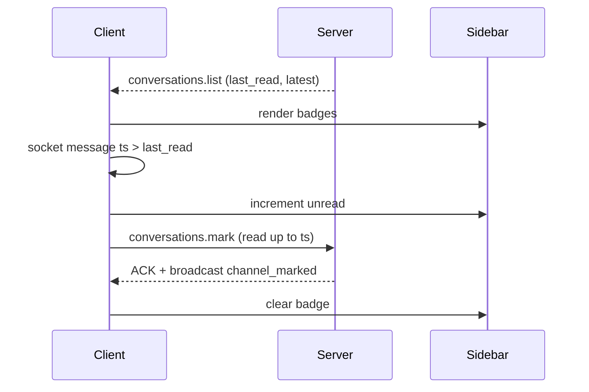
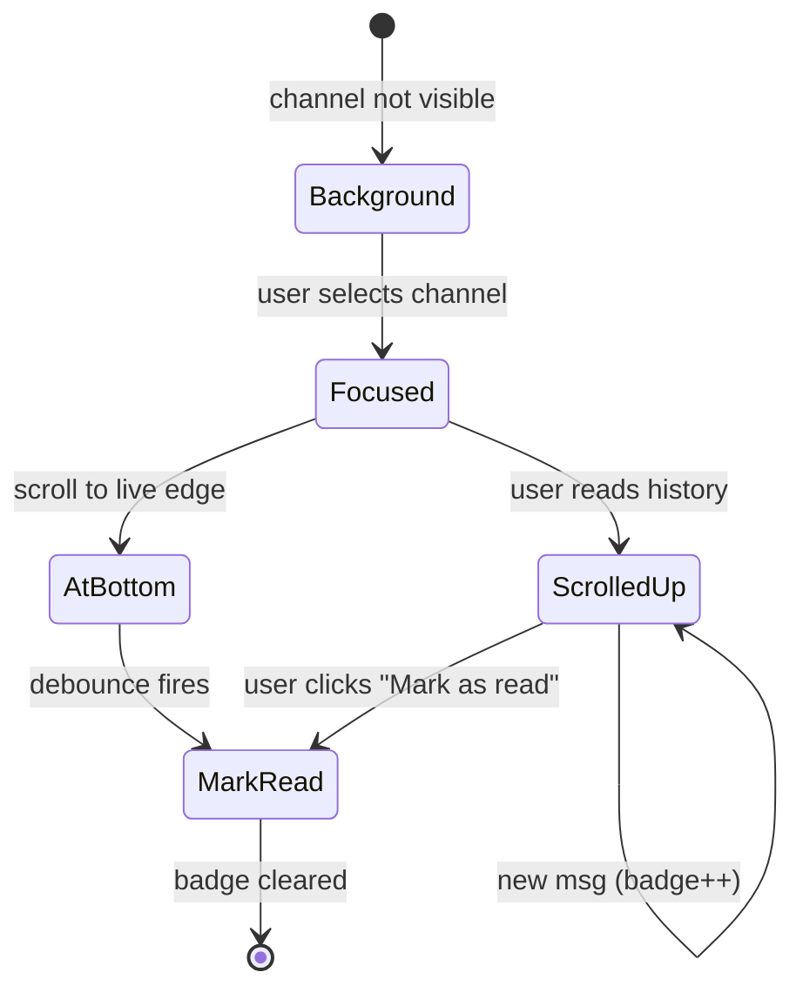
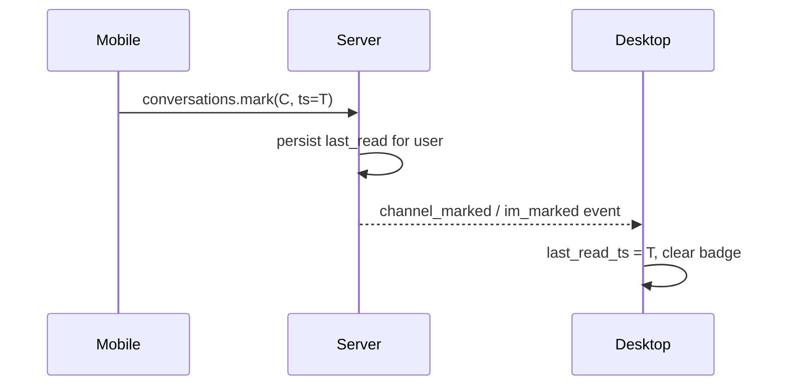

# Section 6 — Notifications & Unread State (Answers)

Interview-depth answers for Slack's client notification layer: unread badge math, read cursors, per-channel prefs, cross-device sync, push delivery, DND, thread follow, and burst handling. Badge counts wrong erode trust immediately — this section is about getting the numbers and signals right.

---

## Core

### How do you compute unread counts per channel — last-read timestamp vs last-seen message ts?

**Problem framing:** Every sidebar row needs a trustworthy unread count (or boolean) without scanning 100k messages on each socket event. The client must reconcile **what the user has acknowledged** with **what arrived since**, across channel feed, threads, and DMs — while staying consistent with server state after reconnect.

**Approach:** Slack uses a **last-read cursor** (`last_read` / `last_read_ts`) per `(user, conversation)`, not a literal "count unread messages" scan on every update.

| Concept | Meaning |
|---------|---------|
| `last_read_ts` | Server-authoritative watermark — messages with `ts > last_read_ts` are unread |
| `latest` / `last_message_ts` | Newest message in conversation (from channel metadata or latest socket event) |
| Unread count | Derived: count messages where `ts > last_read_ts` **or** approximate with metadata |

**Computation paths:**

1. **Exact count (small channels / DMs)** — Client maintains ordered `ts[]` for loaded messages. `unreadCount = messages.filter(m => m.ts > last_read_ts).length`. Updates incrementally on each new socket `message`.

2. **Metadata approximation (large channels)** — Channel object from `conversations.list` includes `unread_count_display` or similar server-computed field. Client trusts server count until local catch-up reconciles.

3. **Boolean mode** — Some surfaces only need "has unread" (bold name) not a number: `hasUnread = latest_ts > last_read_ts`.

```text
on message event (channel C, ts T):
  if T > channel.last_read_ts:
    channel.hasUnread = true
    channel.unreadCount++   // if tracking exact count locally
  if channel is focused AND user at live edge:
    // defer mark-read (see next question)
```

4. **Thread separation** — Channel `last_read_ts` covers **top-level feed only**. Thread replies use separate cursors (`last_read_reply_ts` per parent or thread subscription). Never fold thread traffic into channel count unless `reply_broadcast`.

5. **Persistence** — `last_read_ts` synced from server on workspace load (`conversations.info` / bulk `conversations.list`). Local optimistic advance on mark-read; revert if API fails.



**Tradeoffs:** `last_read_ts` is O(1) per channel vs counting — essential at scale. Exact local counts drift if history isn't fully loaded — reconcile with server `unread_count` on focus. **Pitfall:** Using "last message user scrolled past" locally without syncing — other devices show different state. **Pitfall:** Comparing `ts` as numbers — Slack `ts` is string `seconds.microseconds`; lexicographic compare works.

---

### How do you distinguish a regular unread from an unread @mention (bold badge vs normal)?

**Problem framing:** Not all unreads are equal — a direct `@you` or `@engineering` (where you're a member) demands attention; 200 messages in `#random` while you were in a meeting should not hijack the sidebar with the same urgency. The UI encodes this as **bold channel name**, **highlighted badge**, or **red dot** for mentions vs subtle unbold count for regular traffic.

**Approach:** Maintain **two independent flags** per conversation, derived from message metadata and mention parsing:

| Flag | Set when | UI |
|------|----------|-----|
| `hasUnread` | Any message `ts > last_read_ts` | Unread count or dot |
| `hasUnreadMention` | Unread message mentions local user / subscribed group / `@here` (if present) | **Bold** channel name, accent badge |

**Mention detection on ingest:**

```text
on message (channel, ts, text, blocks):
  if ts <= last_read_ts: return
  if mentionsMe(message):
    channel.hasUnreadMention = true
  channel.hasUnread = true

mentionsMe(msg):
  parse mrkdwn / blocks for <@U_local>, <!subteam^S_id>, <!here>, <!channel>
  match user id, usergroup membership, channel membership for @here
```

1. **Server assist** — Slack API may expose `unread_count_display` split or `mention_count` on conversation objects. Prefer server fields when available; client recomputes for realtime between syncs.

2. **Clear mention flag independently** — When user reads channel, both flags clear. Some products keep mention highlight until user **views** the specific message — Slack typically clears on channel mark-read up to visible `ts`.

3. **Thread @mentions** — `@you` in a thread you're **not** following may still bump channel mention badge (product rule) or only thread subscription badge — see Deep question on thread follow.

4. **Muted channels** — Mention may still bold the row even when count is suppressed (see notification prefs).

```text
Sidebar row states:
  #general     (3)           ← regular unread
  #incidents   (12) ● bold   ← unread + mention
  #random      muted gray    ← no badge, mention may still show @ badge
```

**Tradeoffs:** Client-side mention parsing must mirror server notification rules — drift causes "I got notified but no bold" bugs. **Pitfall:** Treating `@channel` the same as `@user` in UI — `@channel` is a broadcast (different icon/warning). **Pitfall:** Clearing mention flag when only scrolling past without mark-read — user misses that they were pinged.

---

### How do you mark a channel as read — on scroll, on focus, on explicit action, or a combination?

**Problem framing:** Mark-read too aggressively (tab focus alone) and users miss unread indicators while multitasking. Too conservatively (explicit click only) and badges never clear — both feel broken. The rules must differ for **focused vs background**, **at bottom vs scrolled up**, and **mobile vs desktop**.

**Approach:** **Combination policy** — focus + visibility + scroll position + debounce:

| Trigger | Mark read? | Notes |
|---------|------------|-------|
| Channel becomes active + window focused | Partial | Start read timer |
| User at live edge (bottom) for ≥1–2 s | Yes | `conversations.mark` with latest visible `ts` |
| User scrolled up reading history | No | Keep badge; "Mark as read" in menu |
| Window blur / switch channel | Flush pending | Mark up to last committed read cursor |
| Explicit "Mark as read" / Esc | Yes | Immediate API call |
| Mobile: conversation opened | Yes (often) | Mobile marks on enter; desktop stricter |

**Implementation:**

```text
readCursor = last_read_ts  // local optimistic

onFocus(channel):
  if atBottom(channel): startDebounce(1500ms → markRead(latestVisibleTs))

onScroll(channel):
  if atBottom: schedule markRead
  else: cancel pending markRead

markRead(ts):
  readCursor = max(readCursor, ts)
  optimistic clear badge
  API conversations.mark(channel, ts)
  on failure: revert badge + toast
```

1. **Visible message threshold** — Mark only up to the **lowest visible message ts** at bottom, not future messages that arrived off-screen while scrolled up.

2. **Thread pane** — Opening thread and viewing latest marks **thread** read (`ts = parentTs` or latest reply ts) separately from channel feed.

3. **Keyboard navigation** — Arrow-key through sidebar may preview channel without marking read until Enter and dwell time — prevents badge wipe on hover-preview.

4. **Unread-only filter** — "All unreads" view may use explicit tap-to-clear per row.



**Tradeoffs:** Debounce prevents mark-read while user flips through channels quickly — 1–2 s is typical. **Pitfall:** Marking read on focus while user is scrolled up in a firehose — they never saw new messages. **Pitfall:** Not marking on blur — badge persists after user clearly read at bottom.

---

### How do you respect per-channel notification preferences (all messages, mentions only, mute)?

**Problem framing:** Users want `#announcements` loud and `#random` silent. Preferences must affect **badges**, **desktop/mobile push**, **sounds**, and **email digests** consistently — but not hide messages from the feed itself.

**Approach:** **Per-conversation notification level** stored server-side, cached client-side, applied at **ingest** and **delivery** layers separately:

| Level | Badge | Push | Sound | Feed |
|-------|-------|------|-------|------|
| All messages | Yes | Yes | Yes | Always show |
| Mentions only | Mention only | Mentions | Mentions | Always show |
| Mute | Hidden (or dot only) | No | No | Always show |

1. **Data model** — `channel.notificationPreference: 'all' | 'mentions' | 'mute'` from `conversations.info` or user prefs API. Workspace defaults + per-channel override.

2. **Badge gating** — On `message` event:

```text
if pref == 'mute': suppress sidebar count (optional subtle dot for @mention)
if pref == 'mentions': increment badge only if mentionsMe(msg)
if pref == 'all': increment on any unread
```

3. **Push gating** — Same rules at notification service (server-side). Client registers device tokens; server decides whether to APNs/FCM — client should not double-send locally.

4. **UI affordances** — Channel header bell icon: filled / half / slashed. Right-click sidebar → "Change notifications". Muted channels section or gray text.

5. **Global overrides** — DND, mobile "notify me on mobile even when active on desktop", and `@mention` always-notify escape hatches layered on top (see DND Deep question).

**Tradeoffs:** Mute vs hide-from-sidebar are different features — mute still lists channel, just silent. **Pitfall:** Applying mute to **unread math** but not **push** — user gets pinged for muted channel. **Pitfall:** Client-only mute that resets on new device — must persist server-side.

---

### How do you sync read state across desktop, mobile, and web when the user reads on one device?

**Problem framing:** User reads `#incidents` on phone during commute; desktop at office still shows `(47)` until sync — classic multi-device bug. Read state is **shared user state**, not per-device, and must converge within seconds.

**Approach:** **Server-authoritative `last_read_ts` with realtime broadcast:**



1. **Write path** — Any device calling `conversations.mark` (or `mark` on DM) updates canonical cursor. Include `ts` = latest read message, not wall clock.

2. **Sync path** — Other connected clients receive **`channel_marked`** (or equivalent) on workspace WebSocket with `{ channel, ts, mention_count: 0 }`. Patch local store atomically.

3. **Optimistic local read** — Device that marked read clears badge immediately; others wait for event (~100ms–2s). On reconnect, bulk-fetch `conversations.list` with `last_read` to heal drift.

4. **Conflict resolution** — If desktop locally thought unread but server says `last_read` advanced: **server wins** (max of cursors). Never decrement `last_read` from client without explicit "Mark unread" action.

5. **Thread cursors** — Same pattern with thread-specific mark API; broadcast `thread_marked` or embed in parent metadata update.

6. **Offline device** — On next launch, `conversations.list` sync reconciles all badges in one pass — no need for missed events if REST snapshot is fresh.

**Tradeoffs:** Eventual consistency means brief dual-badge on desktop after mobile read — acceptable if <2 s. **Pitfall:** Local mark-read without API when offline — queue `mark` for replay; other devices stay stale until sync. **Pitfall:** Applying `channel_marked` only to sidebar, not open channel view — user still sees "New" divider incorrectly.

---

### How do you handle desktop push notifications without double-notifying an active window?

**Problem framing:** User has Slack focused on `#general` chatting actively — a new message in `#random` should not produce an OS banner **and** in-app badge noise for the focused conversation. Conversely, background conversations should still notify. Desktop must know **"user is present and viewing conversation X"** and suppress redundant pushes.

**Approach:** **Multi-layer suppression: server-side presence + client-side focus report:**

1. **Active window registration** — Desktop client sends **`user_active`** / **`presence`** with `{ active: true, viewing_channel_id }` on focus change. Notification service suppresses push for messages in **currently viewed** channel when window is focused and not minimized.

2. **Client-side guard** — Even if push arrives (race), client drops notification if:
   - App is focused AND message channel === active channel AND user at bottom (already saw message via socket).
   - Message was inserted optimistically from local send.

3. **Do Not Disturb / mute** — Layered before push (see prefs).

4. **Platform APIs** — macOS `NSUserNotification` / Electron: set `silent: true` or skip `show()` when suppressed. Windows toast activation same pattern.

```text
New message in #random
  → Server checks: user active on desktop viewing #general?
      → yes: skip desktop push for #random (badge still updates unless muted)
      → no: send OS notification
  → Mobile: separate device token — always evaluate mobile rules
```

5. **@mention escape** — Many users want @mention push even when active in another channel — product flag: **notify mentions always** bypasses focus suppression.

**Tradeoffs:** Server-side suppression requires accurate focus telemetry — stale "viewing #general" suppresses wrong pushes briefly. **Pitfall:** Suppressing push for active channel but also skipping badge increment — user sees message but sidebar wrong elsewhere. **Pitfall:** Double notification from **socket-triggered local toast** + **OS push** — single notification pipeline owned by one layer.

---

## Deep

### How do you implement Do Not Disturb — suppress badges, suppress push, or both?

**Problem framing:** DND means "I'm unavailable." Users expect **no interruptions**, but still want to **catch up visually** when they return. Suppressing everything including badges hides actionable state; suppressing only push leaves noisy badges during focus time.

**Approach:** **Split suppression by surface** — Slack typically:

| Surface | DND behavior |
|---------|--------------|
| Push (desktop/mobile) | **Suppressed** (except optional priority @mention override) |
| Sound / banner | **Suppressed** |
| Sidebar badges | **Still accumulate** (or muted styling — product choice; Slack shows badges but no ping) |
| Red badge on app icon | Often **still updates** so user sees backlog count |
| @mention highlight | May still **bold** channel when DND ends or in "All unreads" |

1. **Schedule model** — `dnd_enabled_until`, daily recurring windows, calendar integration. Synced user pref via `dnd_updated` WebSocket event to all devices.

2. **Notification service gate** — Server checks DND before APNs/FCM/desktop push. Client checks DND before local `Notification()` API.

3. **Badge policy (recommended)** — **Do not suppress badge math** — user opens Slack after DND and sees what they missed. Optionally show moon icon on workspace tab without hiding counts.

4. **Override paths** — "Notify me even during DND" for specific people or `@urgent` keyword; emergency on-call rotations.

```text
DND active + new @you in #incidents:
  push: suppressed
  sound: suppressed
  sidebar: bold #incidents + mention flag (queued visually)
  on DND end: optional summary "3 mentions while you were away"
```

**Tradeoffs:** Full badge suppress during DND feels "clean" but causes surprise flood on disable — most products keep badges. **Pitfall:** DND on mobile not synced to desktop — user gets desktop pings. **Pitfall:** Treating DND as mute for all channels — DND is global time window; mute is per-channel.

---

### How do you handle notification bursts in a high-traffic channel during an incident?

**Problem framing:** `#incidents` during an outage may receive **500 messages/minute**. Per-message badge increments, push fan-out, and sidebar re-renders will melt client CPU and notification quotas — users can't read 500 toasts anyway.

**Approach:** **Coalesce at server and client; cap display; defer non-critical signals:**

1. **Server push coalescing** — Notification service batches: max **1 push per channel per N minutes** with body "47 new messages in #incidents" unless `@mention` (immediate).

2. **Client badge batching** — On high event rate, switch from exact count to **`99+`** or `hasUnread` boolean; update sidebar on `requestAnimationFrame` at most 2–4 times/sec.

3. **Mention priority lane** — `@you` events bypass coalesce for badge bold flag; regular messages aggregate.

4. **Sound once** — First unread in burst plays sound; subsequent suppressed until mark-read.

5. **In-channel UX** — "New messages" pill aggregates ("500 new messages ↓"); don't flash row per message in sidebar.

6. **Auto-mute suggestion** — Prompt: "High activity in #incidents — mute notifications?" without hiding from feed.

| Rate | Badge | Push | Sidebar render |
|------|-------|------|----------------|
| Normal | exact count | per pref | immediate |
| Burst (>20/s) | `99+` / boolean | batched 1/5min | rAF batch |
| @mention in burst | immediate bold | immediate (unless DND) | immediate |

**Tradeoffs:** Coalesced push delays awareness by minutes — acceptable for non-mentions in incident channels users already watch. **Pitfall:** Dropping badge increments entirely during burst — user thinks channel is caught up. **Pitfall:** Exact unread count reconciliation after burst requires server `unread_count` resync.

---

### How do you implement thread-specific notification settings ("Follow thread" vs parent channel mute)?

**Problem framing:** User mutes `#engineering` but participates in one critical thread. Or channel is loud but they only care about **replies on a parent they started**. Thread notification state must be **orthogonal** to channel mute.

**Approach:** **Thread subscription / follow flag** independent of channel prefs:

| State | Channel msgs | Thread replies on followed parent |
|-------|--------------|-----------------------------------|
| Channel unmuted, thread not followed | Notify per channel pref | Only if @mentioned (default) |
| Channel muted, thread followed | Suppressed | **Notify** (badge on parent + optional push) |
| Thread followed | — | Reply count + "new" on parent row |

1. **Follow actions** — "Follow thread" sets `thread_subscription: { channel, parent_ts, follow: true }` via API. Persist server-side; receive `thread_subscribed` event.

2. **Badge placement** — Followed thread unread shows on **parent message** in channel feed (`"5 replies · 3 new"`) and may appear in **All Threads** / **Threads** sidebar section — not in channel-level count if channel muted.

3. **Push rules** — New reply in followed thread → push even if channel muted (unless global DND). @mention in non-followed thread while channel muted → no push.

4. **Unfollow** — On thread close or explicit unfollow; clear thread cursor.

```mermaid
flowchart TD
  Reply[New thread reply] --> Followed{User follows thread?}
  Followed -->|yes| ThreadBadge[Parent thread badge + push]
  Followed -->|no| Mention{@mentioned?}
  Mention -->|yes| MentionPath[Channel mention rules]
  Mention -->|no| MuteCheck{Channel muted?}
  MuteCheck -->|yes| Suppress[Suppress]
  MuteCheck -->|no| ChannelPath[Channel pref]
```

**Tradeoffs:** Many followed threads recreate notification noise — cap followed threads or auto-unfollow on mark-read. **Pitfall:** Incrementing **channel** unread when channel is muted but thread followed — double accounting. **Pitfall:** Not syncing follow state across devices — mobile follows, desktop never gets thread pushes.

---

### How do you reconcile badge counts after reconnect when you missed `mark_read` events from another client?

**Problem framing:** WebSocket drops for 90 s while user reads on mobile. Desktop reconnects with **stale local `last_read_ts`** and inflated badges — or worse, decrements wrong after duplicate `message` events. Client must **resync authoritative read state** without user noticing flicker.

**Approach:** **Reconnect hygiene: REST snapshot wins, then incremental events:**

1. **On reconnect (before processing live queue)** — Fetch `conversations.list` with `exclude_archived`, include `last_read`, `unread_count_display`, `mention_count`. Replace local read cursors for all channels in one reducer transaction.

2. **Missed `channel_marked` events** — Irrelevant if REST snapshot is fresh (taken after mobile mark). Snapshot timestamp vs event log: use **max(last_read_ts)** across sources.

3. **Message dedup first** — Apply reconnect message catch-up (Section 1) before badge recompute — otherwise new messages double-count.

4. **Recompute algorithm:**

```text
onReconnectSync(serverChannels):
  for ch in serverChannels:
    local.last_read_ts = server.last_read_ts
    local.unread_count = server.unread_count_display
    local.hasUnreadMention = server.mention_count > 0
  suppress sidebar animation for bulk update (single frame)
```

5. **Open channel exception** — If desktop has `#incidents` open at bottom on reconnect, re-issue local `markRead` with latest `ts` after sync — heals race where mobile read but desktop was mid-view.

6. **Workspace badge** — Sum unread across conversations or use server `team.unread_count` if provided — avoid client sum drift.

**Tradeoffs:** Full `conversations.list` on every reconnect is heavy for 500-channel users — use delta API or sync since `sync_ts` if available. **Pitfall:** Applying old events from reconnect buffer **after** snapshot — badges bounce; order: snapshot → deduped events. **Pitfall:** Animating each of 200 badge clears — batch UI update.

---

### How do you implement notification grouping on mobile — 47 messages from #incidents becomes one push?

**Problem framing:** iOS and Android limit notification volume; 47 separate pushes for `#incidents` gets the app muted or uninstalled. Grouping must preserve **mention urgency**, **channel identity**, and **tap-to-navigate** behavior.

**Approach:** **Platform notification groups + server-side aggregation:**

1. **Android `NotificationCompat.MessagingStyle`** — Group key `channel:C123`; each push updates existing notification with new line "Alice: …", "Bob: …", summary "47 messages in #incidents". `setGroupSummary(true)` on summary notification.

2. **iOS thread identifier** — `thread-id: C123` (iOS 12+) collapses notifications from same channel. Summary arg shows count.

3. **Server batching window** — Notification service holds non-mention messages for **30–120 s** per `(user, channel)` before emitting one grouped payload: `{ channel, count: 47, latest_preview, participants[] }`.

4. **@mention breakout** — Direct @user creates **separate notification** (or adds highlighted line) even within group — user sees "Alice mentioned you" atop summary.

5. **Tap action** — Single intent: open app to channel `C123` at `latest_ts` or first unread — deep link `slack://channel?id=C123&ts=…`.

```text
t=0   msg1  → start batch timer
t=30s msg47 → flush: one push "47 messages in #incidents"
t=31s @you  → immediate push "Alice mentioned you in #incidents" (may merge into group with highlight)
```

6. **Client local notifications** — When app is backgrounded but socket alive, apply same grouping before calling native APIs — don't rely on server alone for foreground-service paths.

**Tradeoffs:** Batch window delays first message awareness — shorten for DMs (often 0 batch). **Pitfall:** Grouping across **different channels** — never; one group per conversation. **Pitfall:** Losing individual message text in summary — include 3–5 recent lines in expanded style.

---

### How do you handle @channel and @here notifications differently from direct @user mentions in the UI?

**Problem framing:** `@alice` is personal; `@here` notifies online members; `@channel` notifies everyone — different **social cost**, **fan-out**, and **user expectation**. UI must warn composers, distinguish badges, and parse notification settings that treat broadcasts differently.

**Approach:** **Typed mention classes with distinct visual and notification pipelines:**

| Mention type | Who notified | Composer UX | Badge / push |
|--------------|--------------|-------------|--------------|
| `@user` | One user | Standard chip | Personal mention highlight |
| `@usergroup` | Group members | Group chip + count | Mention if member |
| `@here` | Online members | Warning color + "Notify N online" | Broadcast mention (lower priority than direct @you) |
| `@channel` | All members | Strong confirm dialog | Broadcast; often respects "mentions only" pref |

1. **Parsing** — mrkdwn `<!here>`, `<!channel>`, `<@U123>`, `<!subteam^S456|@eng>` map to enum `MentionKind`. Store on message object at ingest.

2. **Sidebar / badge** — Direct `@you` → boldest treatment (red dot, top of "All unreads"). `@here`/`@channel` you received → bold channel but distinct icon (megaphone vs `@`). Regular unread without mention → count only.

3. **Notification prefs interaction** — "Mentions only" includes direct @ and often @usergroup; **`@channel`/`@here` may be excluded** unless user opts into "all messages" — document clearly in settings copy.

4. **Push copy** — "@channel in #general: Standup in 5" vs "Alice mentioned you in #general" — different templates help user triage.

5. **Composer safeguards** — Restrict `@channel` in threads or large channels without extra confirm; show member count from `conversations.info`.

```text
All unreads view (sorted):
  1. @you      #incidents  Alice: "can you look?"
  2. @here     #general    Bob: "@here standup"
  3. (3)       #random     regular messages
```

**Tradeoffs:** Deprioritizing `@here` in sort anger users who treat it as urgent — workspace culture varies; offer setting. **Pitfall:** Counting `@channel` as personal mention in analytics — skews engagement metrics. **Pitfall:** Guest users receiving `@channel` against policy — server must block; client shows "message hidden" not broken badge.

---

*Section 6 complete. Next: auth, workspaces, offline & performance (Section 7).*
