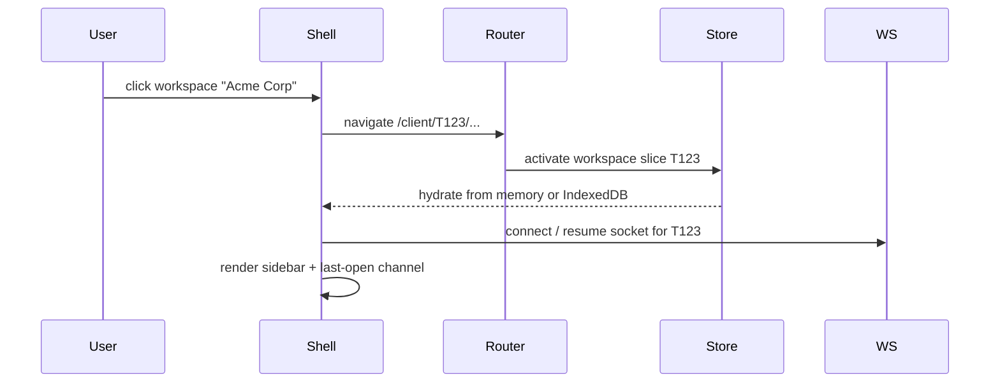
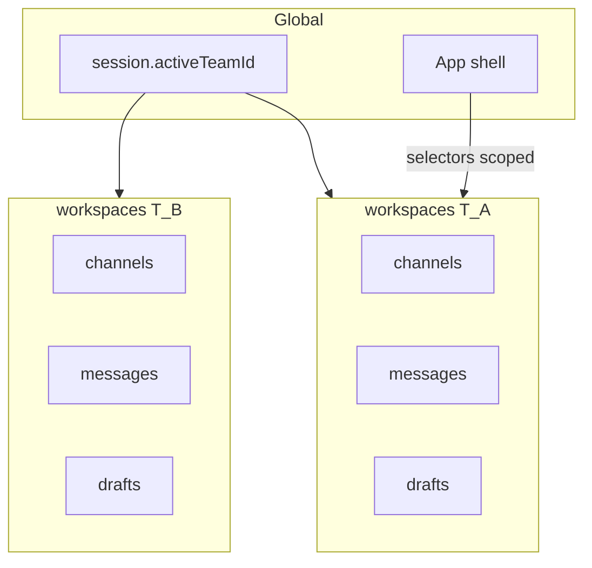
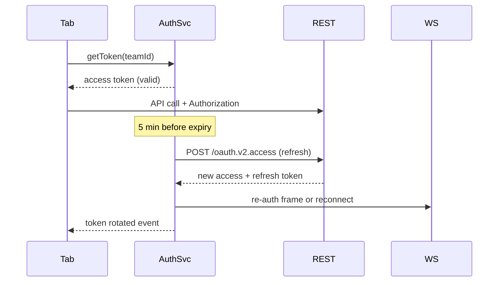
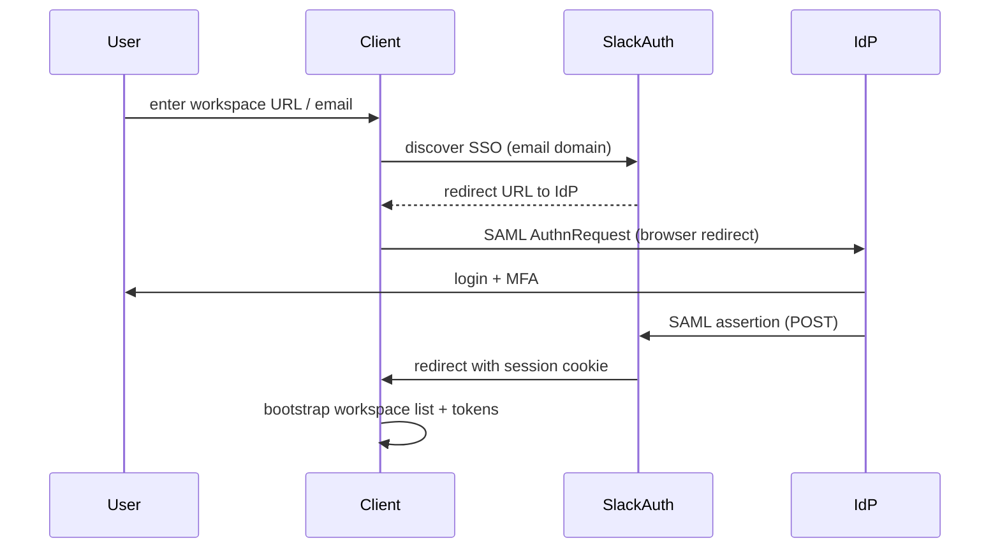
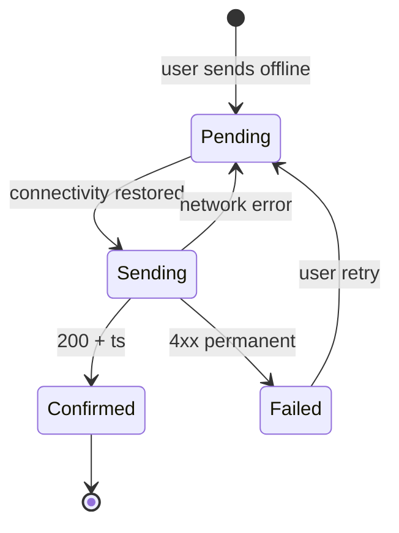
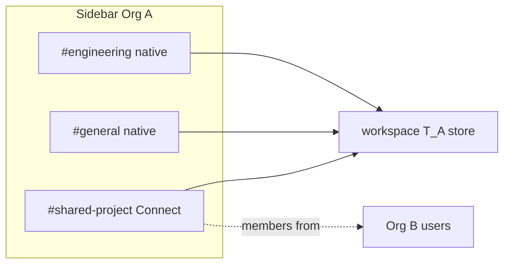
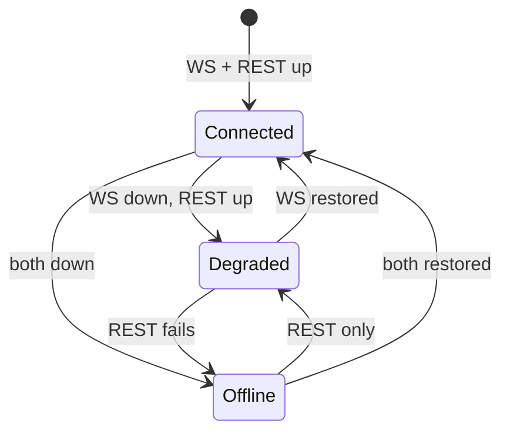
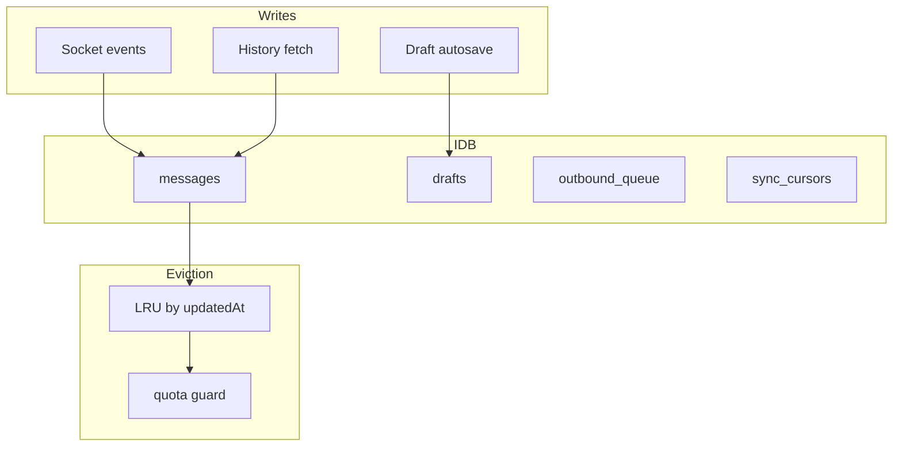

# Section 7 — Auth, Workspaces, Offline & Performance (Answers)

Interview-depth answers for Slack's client multitenancy layer: workspace switching, OAuth/SSO, offline resilience, sidebar virtualization, degraded-mode UX, scroll anchoring under layout shift, and IndexedDB persistence. Senior-level signal — covers isolation, security boundaries, and the performance patterns needed to ship Slack at scale.

---

## Core

### How do you implement workspace switching without a full page reload?

**Problem framing:** Power users belong to multiple workspaces and switch dozens of times per day. A full page reload on every switch destroys scroll position, open thread panes, composer drafts, and WebSocket subscriptions — and adds 2–5 seconds of perceived latency. The client must feel like **one app with multiple tenants**, not separate Slack instances.

**Approach:** Treat workspace switch as a **route transition within a SPA shell**, swapping tenant-scoped state and reconnecting realtime transport — not reloading the document.



1. **URL as source of truth** — `/client/{teamId}/{channelId?}` (or subdomain `acme.slack.com`). Switching workspace updates history via `pushState`; deep links survive refresh.

2. **Shell persistence** — Global chrome (title bar, quick switcher, connection banner, keyboard shortcuts) stays mounted. Only **workspace content pane** unmounts/remounts: sidebar, message list, flexpane.

3. **State activation, not reload** — On switch:
   - Deactivate current workspace slice (pause socket, save scroll/draft snapshots).
   - Activate target workspace slice from in-memory cache or cold hydrate from IndexedDB.
   - Resume or establish WebSocket for new `teamId`.
   - Restore last-open channel from `localStorage` per workspace.

4. **Prefetch on hover** — Quick switcher hover on a workspace triggers lightweight prefetch: `users.conversations` + unread counts, so switch feels instant when cache is warm.

5. **Code splitting** — Workspace-specific heavy modules (emoji packs, custom themes) lazy-load per team; core bundle shared.

6. **Cross-workspace UI** — Unified sidebar in Grid shows all orgs; switch may be **in-place filter** (show Acme channels only) vs full context swap depending on product mode.

| Layer | Survives switch | Reset on switch |
|-------|-----------------|-----------------|
| Global shell | ✓ | — |
| Quick switcher recents | ✓ | — |
| Per-workspace store slice | cached | active view |
| WebSocket | — | reconnect per team |
| Open modals | — | close or scope |

**Tradeoffs:** Keeping all workspace slices in memory enables instant switch but grows RAM for 30-workspace users — LRU-evict cold slices, persist to IndexedDB. **Pitfall:** `window.location.reload()` on team change — loses drafts and janks UX. **Pitfall:** Shared global `currentChannelId` without team prefix — opens wrong channel after switch.

---

### How do you scope all client state (channels, unread, drafts) per workspace to prevent cross-workspace leaks?

**Problem framing:** A cross-workspace leak is a **critical security and privacy bug**: showing Acme Corp's `#hr-confidential` messages while the user thinks they're in a personal workspace, or posting a draft meant for one org into another. Every piece of client state must be **namespaced by tenant**.

**Approach:** **Partition the store at the root** by `teamId` (workspace id). No global mutable maps for tenant data.

```ts
type AppState = {
  session: { userId: string; activeTeamId: string };
  workspaces: Record<TeamId, WorkspaceSlice>;
};

type WorkspaceSlice = {
  meta: { teamId: string; name: string; domain: string; token: string };
  channels: Record<ChannelId, ChannelMeta>;
  messagesById: Map<string, Message>;       // scoped to this workspace
  timelines: Record<ChannelId, ChannelTimeline>;
  unread: Record<ChannelId, UnreadState>;
  drafts: Record<ConversationId, Draft>;
  presence: Record<UserId, PresenceState>;
  connection: { wsState: 'connected' | 'reconnecting' | 'offline' };
  ui: { openChannelId: string | null; flexpane: FlexpaneState | null };
};
```

**Enforcement rules:**

1. **Selectors always take `teamId`** — `selectChannelMessages(state, teamId, channelId)`. ESLint rule or typed wrapper prevents bare `state.messages`.

2. **Event router tags every socket frame** — `{ team_id: 'T123', type: 'message', ... }`. Dispatch: `workspaces[team_id].messagesById.set(...)`. Reject events with unknown or inactive team unless badge-only routing.

3. **React context** — `<WorkspaceProvider teamId={T123}>` exposes scoped hooks. Components outside provider cannot read tenant data.

4. **Drafts, unread, read cursors** — Key: `(teamId, conversationId)`. Composer reads `drafts[`${teamId}:${channelId}`]`.

5. **IndexedDB namespaces** — Database per workspace or compound keys: `messages/{teamId}/{channelId}/{ts}`.

6. **Cross-workspace features** — Slack Connect shared channels still live under the **hosting workspace's slice**; foreign org members are rendered with `user.team_id !== currentTeamId` guards, never merged into a flat global user list.

7. **Testing** — Integration test: load workspace A messages, switch to B, assert A DOM nodes not in document and A selectors return empty when scoped to B.



**Tradeoffs:** Deep nesting vs flat keys with prefixes — `Record<teamId, Slice>` mirrors mental model and enables dropping entire tenant on logout. **Pitfall:** Caching API responses in a global Map keyed only by `channelId` — channel ids are unique globally in Slack, but tokens and unread must still scope by team. **Pitfall:** Stale closure in socket handler capturing old `teamId` — always read from event payload.

---

### How do you handle OAuth login and token refresh for the Slack API and WebSocket?

**Problem framing:** Slack's client talks to REST APIs and a persistent WebSocket, both requiring valid credentials. Tokens expire; refresh must happen **without logging the user out**, **without dropping queued sends**, and **without race conditions** where two tabs refresh simultaneously and invalidate each other.

**Approach:** Central **auth service** in the client (or SharedWorker) owns token lifecycle; all HTTP and WS consumers request tokens from it.



1. **Token types** — Browser client typically uses session cookie (`d=xoxd-...`) or workspace token (`xoxc-...`) obtained after OAuth redirect. Desktop may store `xoxp-...` in OS keychain. Never expose tokens to third-party scripts — strict CSP.

2. **Initial login** — OAuth 2.0 redirect: user authorizes → callback with code → client exchanges for tokens → store refresh token in httpOnly cookie (web) or secure storage (desktop).

3. **Proactive refresh** — Refresh at `exp - 5min`. Single-flight mutex: if refresh in progress, other callers await same promise.

4. **401 handling** — On REST 401, attempt one refresh + retry. Second 401 → force re-login flow for that workspace only.

5. **WebSocket coordination** — Protocol options:
   - **In-band re-auth:** send `{ type: 'auth_refresh', token }` without disconnect.
   - **Reconnect:** close WS with code 4001, reopen with new token, replay subscriptions.

6. **Multi-tab** — `BroadcastChannel('slack-auth')` or SharedWorker: one tab refreshes, others receive `TOKEN_UPDATED`. Leader election for refresh responsibility.

7. **Multi-workspace** — Independent token per `teamId`; refreshing Acme doesn't affect Personal workspace socket.

| Scenario | Behavior |
|----------|----------|
| Refresh succeeds | Silent; WS re-auth; no UI |
| Refresh fails (revoked) | Workspace logout modal; other workspaces unaffected |
| Offline during expiry | Queue REST; on reconnect, refresh first, then flush queue |
| Clock skew | Trust server `expires_in`; skew buffer 60s |

**Tradeoffs:** httpOnly cookies are XSS-safe but complicate non-browser clients — desktop uses keychain + PKCE. **Pitfall:** Each tab independently refreshing — rotation race invalidates sessions. **Pitfall:** Storing tokens in localStorage — XSS exfiltration risk.

---

### How do you implement SSO/SAML for Enterprise Grid — redirect flow and session persistence?

**Problem framing:** Enterprise customers require **SAML/OIDC SSO** through Okta, Azure AD, etc. The client must initiate IdP login, handle redirects across domains, support **multiple Grid orgs with different IdPs**, and persist sessions so users aren't prompted every app launch — while respecting **session timeout**, **forced re-auth**, and **step-up MFA** policies.

**Approach:** SSO is a **browser redirect dance** orchestrated by Slack's auth server; the client is a thin shell that launches, catches, and stores the resulting session.



1. **Discovery** — User enters `user@acme.com` or `acme.enterprise.slack.com`. Client calls `auth.discovery` → returns `{ sso_url, type: 'saml' | 'oidc' }` or password fallback.

2. **Redirect flow** — `window.location.href = sso_url` (full navigation required for IdP cookies). For desktop/Electron, embedded webview or system browser with custom URL scheme callback (`slack://auth/callback?...`).

3. **Session persistence** — On success, Slack sets **httpOnly secure cookies** (`d`, `xoxd-*`) with org-scoped expiry. Client does not hold long-lived SAML assertions — only Slack session tokens.

4. **Enterprise Grid org switcher** — One SSO login may grant access to multiple workspaces in the org. Client fetches `auth.teams.list` post-login; each workspace gets derived workspace token without re-SAML if org session valid.

5. **Session timeout** — IdP `SessionNotOnOrAfter` enforced server-side. Client detects 401 + `login_required` → redirect to SSO with `prompt=login` for step-up.

6. **SSO + MFA policies** — Client shows "Signing in via Acme Okta…" during redirect; handle `error=access_denied` from IdP with actionable copy.

7. **Offline / cached session** — IndexedDB holds messages; SSO not re-run until API rejects session. Desktop: OS keychain stores refresh artifact tied to device enrollment (MDM).

8. **Logout** — Local: clear cookies, wipe workspace slices, IndexedDB tenant data. Global logout: redirect to IdP SLO (Single Log-Out) if configured.

| Concern | Client role |
|---------|-------------|
| SAML XML | None — server validates assertion |
| Token storage | httpOnly cookie preferred |
| Deep link return | Preserve `return_to` channel URL through SSO |
| IdP timeout | Graceful re-auth banner, not data wipe |

**Tradeoffs:** Full redirect loses in-memory SPA state — persist drafts to IndexedDB before SSO redirect. Embedded webview SSO vs system browser — enterprise MDM often requires system browser for conditional access. **Pitfall:** Storing SAML response in localStorage. **Pitfall:** Assuming one SSO covers all 30 personal + enterprise workspaces — each org may have separate IdP.

---

### How do you queue a message sent while offline and replay it with the same `client_msg_id` on reconnect?

**Problem framing:** Users compose and hit send on flaky Wi‑Fi or in airplane mode. The message must **appear immediately** (optimistic UI), **survive tab close**, **dedupe on replay**, and **preserve send order** relative to other queued messages — without generating duplicate bubbles when the server confirms.

**Approach:** **Persistent outbound queue** keyed by `client_msg_id`, integrated with optimistic store and reconnect flush.

```ts
type OutboundMessage = {
  client_msg_id: string;       // UUID v4, generated at send time
  teamId: string;
  channelId: string;
  thread_ts?: string;
  text: string;
  blocks?: Block[];
  files?: LocalFileRef[];
  createdAt: number;
  status: 'pending' | 'sending' | 'failed';
  retryCount: number;
};

// IndexedDB store: outbound_queue/{client_msg_id}
```

**Send flow (offline or online):**

```text
User clicks Send
  → generate client_msg_id
  → insert optimistic row in messagesById (status: sending, ts: pending-{client_msg_id})
  → persist OutboundMessage to IndexedDB
  → if online: flush queue head
  → if offline: show clock icon on bubble; connection banner
```

**Reconnect flush:**

```text
WebSocket / REST connectivity restored
  → sort queue by createdAt (FIFO per channel)
  → for each pending msg (same client_msg_id):
        POST chat.postMessage({ ...payload, client_msg_id })
  → on success: patch optimistic row with server ts; remove from queue
  → on 429/5xx: exponential backoff; mark failed with retry UI
  → on 4xx (channel archived): mark failed permanently; toast user
```

1. **Same `client_msg_id` on replay** — Server dedupes: resubmitting with identical `client_msg_id` returns original message, not a duplicate.

2. **Ordering** — Queue is global FIFO but **per-channel order preserved** by sorting `createdAt` before flush. Cross-channel sends interleave as queued.

3. **Idempotency window** — Server retains `client_msg_id` dedup map ~5 min; queue entries older than window still retry once — server may accept or reject; client merges by id.

4. **File attachments** — Upload files to storage first (resumable); message send references `file_id`. If offline, queue text immediately; files upload when online before message POST.

5. **Workspace switch** — Queue filtered by `teamId`; switching workspace doesn't flush another org's queue.

6. **Tab close** — IndexedDB survives; on next launch, hydrate queue and show optimistic rows in timeline.



**Tradeoffs:** FIFO vs priority (@mention first) — FIFO is predictable; priority risks reordering user intent. **Pitfall:** Generating new `client_msg_id` on retry — creates duplicate if first request actually succeeded. **Pitfall:** In-memory-only queue — lost on refresh.

---

### How do you virtualize the channel sidebar with 500 channels and DMs?

**Problem framing:** A busy user may have **500+ conversations** in the sidebar (channels, private channels, DMs, group DMs, shared channels). Rendering 500 `<SidebarRow>` components with badges, avatars, and hover menus causes mount jank and slow workspace switch. The sidebar must scroll at 60fps and still update badges in real time.

**Approach:** **Fixed-height virtual list** for the sidebar — unlike message lists, sidebar rows are uniform (~28–36px), so fixed-size virtualization is sufficient.

```ts
// Sidebar sections: Starred, Channels, DMs, Apps — each virtualized or one flat list with section headers
type SidebarItem =
  | { type: 'header'; label: string; height: 28 }
  | { type: 'channel'; id: string; height: 32 }
  | { type: 'dm'; id: string; height: 32 };

const rowVirtualizer = useVirtualizer({
  count: flatItems.length,
  getScrollElement: () => sidebarRef.current,
  estimateSize: (i) => flatItems[i].height,
  overscan: 15,
});
```

1. **Flatten sections** — Convert grouped sidebar (starred, channels, DMs) into a **flat array with section headers** for single virtualizer, or separate virtualizers per collapsible section.

2. **Fixed row height** — 32px per channel/DM row; headers 28px. Unread bold, mute icon, presence dot fit within fixed height — no dynamic measure needed.

3. **Badge updates off-DOM** — Socket event updates `unread[channelId]` in store; virtualizer re-renders only **visible rows** (~20). Row component `memo()` on `(channelId, unread, name, avatar)`.

4. **Collapse / filter** — "Show all DMs" vs compact; filter doesn't unmount virtualizer — changes `count` and scroll restoration.

5. **Drag reorder (custom sections)** — Only mutate order array; virtualizer scroll position preserved via `scrollToIndex` if needed.

6. **Search within sidebar** — Client-side filter produces reduced list; separate virtualizer instance or same with filtered `flatItems`.

7. **Prefetch avatars** — Visible row avatars loaded eagerly; off-screen use initials fallback until scrolled into view.

```text
┌ Sidebar (virtualized) ─────┐
│ ★ Starred                  │  ← header row
│ # general            (3)   │  ← visible
│ # random                 │
│ ... 480 more in buffer ... │  ← not in DOM
│ @ alice                  │
└────────────────────────────┘
     only ~25 DOM nodes
```

| Technique | Why |
|-----------|-----|
| Fixed height | Avoids measure pass — sidebar rows uniform |
| Overscan 15 | Smooth flick scroll |
| Memoized rows | Badge storm doesn't re-render 500 rows |
| Flattened sections | Single scroll container |

**Tradeoffs:** One giant list vs per-section virtualizers — per-section allows independent collapse scroll memory but adds complexity. **Pitfall:** Rendering hidden 500-row list "just in case" — mount cost on workspace switch. **Pitfall:** Keying by index — reorder anim breaks; key by `channelId`.

---

## Deep

### How do you implement Slack Connect where a user from Org A sees a shared channel alongside native Org A channels?

**Problem framing:** Slack Connect shared channels appear **in the same sidebar** as native channels, but members may belong to **different organizations** with different policies (retention, emoji, guest rules, file sharing). The client must render a unified list without blurring auth boundaries or leaking org-specific metadata.

**Approach:** Shared channels are **first-class conversations in the hosting workspace's slice**, with cross-org member enrichment at render time.

1. **Sidebar placement** — `#shared-partner-project` listed under Channels in Org A's sidebar like any channel. `channel.is_shared === true` flag drives UI: shared icon, external member badges.

2. **Single store home** — Messages live in `workspaces[T_A].messagesById`. Org B user viewing the same channel has it under `workspaces[T_B]`. Same `channel_id` globally, but **state never merges across workspace slices**.

3. **Member resolution** — Message author `user_id` + `user.team_id`. Lookup profile via `users.info` or embedded `user_profile` on event. Render: **"Alice (Partner Inc)"** when `user.team_id !== currentTeamId`.

4. **Mixed native + shared** — Sidebar sort order unchanged (starred, alphabetical, recent). No separate "External" section required unless product chooses — filter badge optional.

5. **Permissions** — Channel actions (invite, rename, archive) gated by `channel.user_is_admin` and `is_org_shared` rules. Org A admin may manage; Org B guest may be read-only — hide UI controls server permissions mirror.

6. **Realtime** — Events arrive on hosting workspace socket. If user is in Org B and channel hosted by Org A, events come through Org A's connection — badge updates routed to correct slice.

7. **Retention / search** — Client filters history at render and pagination boundaries per **viewer's org policy** — same message visible to B, hidden to A after A's retention window.



**Tradeoffs:** Duplicating shared channel metadata in both org slices vs single host — host-only store is canonical; visitor org holds reference + unread. **Pitfall:** Flattening all users into one autocomplete — external users must be labeled and scoped. **Pitfall:** Applying Org A emoji skin to Org B message — emoji set is workspace-scoped.

---

### How do you handle a user who belongs to 30 workspaces — lazy-load sidebar vs eager prefetch?

**Problem framing:** Consultants and agency users may belong to **30+ workspaces**. Eagerly loading every sidebar (500 channels × 30 = 15,000 conversations), opening 30 WebSockets, and prefetching unread for all would ** crush memory, battery, and connection limits**. Pure lazy loading makes every switch feel cold. The client needs a **tiered hydration strategy**.

**Approach:** **Priority tiers** based on recency, unread, and user intent.

| Tier | Workspaces | What loads | WebSocket |
|------|------------|------------|-----------|
| **Active** | Current | Full sidebar, open channel, messages | Connected |
| **Warm** | Last 2–3 switched | Sidebar + unread counts; no message bodies | Connected or paused |
| **Cold** | Remaining 27 | Name + icon only from bootstrap list | Disconnected |
| **On-demand** | Switch target | Promote to Active: fetch sidebar + connect WS | Connect on switch |

1. **Bootstrap** — Login returns lightweight `teams.list`: `{ id, name, icon, unread_total }`. Render workspace switcher immediately.

2. **Lazy sidebar** — On first switch to cold workspace: `users.conversations` + `client.counts` (~1–2 API calls). Cache in `workspaces[teamId]` + IndexedDB.

3. **Eager prefetch triggers** — Hover in switcher (200ms debounce), unread badge > 0, push notification click → promote to Warm.

4. **Socket budget** — Max **3–5 concurrent WebSockets**. LRU disconnect idle warm workspaces after 15 min. Unread for cold workspaces: poll `client.counts` on app focus every 60s or single **aggregated** enterprise endpoint if Grid.

5. **Memory eviction** — Drop message bodies for cold workspaces; keep sidebar metadata (~50KB each). Re-fetch messages on channel open.

6. **IndexedDB warm start** — Last-active workspace hydrates from disk on app launch before network — instant perceived load.

```text
30 workspaces
  ├── 1 Active   (full hydrate + WS)
  ├── 2 Warm     (sidebar + counts, optional WS)
  └── 27 Cold    (switcher row only)
         └── switch → fetch sidebar → promote Active
```

**Tradeoffs:** Aggregated unread API reduces 30 calls to 1 but requires Grid backend support. **Pitfall:** 30 open WebSockets on login — mobile battery death. **Pitfall:** Never prefetching — every switch feels like first visit. **Pitfall:** Keeping full message cache for all 30 — GB of RAM; evict aggressively.

---

### How do you implement role-based UI — guest, member, admin, owner — for channel actions?

**Problem framing:** Slack has **workspace roles** (owner, admin, member, guest) and **channel roles** (member, channel manager). The client must show/hide actions (invite, archive, rename, post in read-only channel) without trusting client-side checks alone — but hiding unauthorized controls is essential UX and prevents error toasts.

**Approach:** **Server-authoritative permissions** cached on channel/workspace objects; UI is a pure function of permission flags.

```ts
type ChannelMeta = {
  id: string;
  name: string;
  is_private: boolean;
  is_archived: boolean;
  is_general: boolean;
  // from conversations.info + auth.test
  permissions: {
    can_post: boolean;
    can_invite: boolean;
    can_manage: boolean;      // rename, topic, archive
    can_thread: boolean;
    is_read_only: boolean;    // announcement channel
  };
};

type WorkspaceRole = 'owner' | 'admin' | 'member' | 'guest' | 'restricted';
```

**UI mapping:**

| Action | Visible when |
|--------|--------------|
| Post in composer | `permissions.can_post && !is_archived` |
| Invite people | `permissions.can_invite` or workspace admin |
| Channel settings | `permissions.can_manage` |
| Archive / delete | `can_manage` + not `is_general` (extra guard) |
| Create channel | workspace `member`+, not `guest` (unless allowed) |
| Manage apps | workspace `admin`+ |
| Workspace settings | `admin` or `owner` |

1. **Hydrate on load** — `conversations.info` returns permission hints; `auth.test` returns workspace role. Store on channel object.

2. **Realtime updates** — `member_joined_channel`, role change admin event → patch permissions; UI reactively hides invite button if user demoted.

3. **Guest UX** — Single-channel guests: sidebar shows only entitled channels; workspace switcher hidden. `is_ultra_restricted` → tighter channel list.

4. **Disabled vs hidden** — Prefer **hidden** for actions user can never gain (archive as member). **Disabled + tooltip** when temporary (read-only announcement: "Only admins can post").

5. **Optimistic guard** — Client blocks send; server 403 confirms. Never show success toast before response.

6. **Slack Connect** — External guest from partner org may have different role in shared channel — permissions from **host workspace's** channel membership.

**Tradeoffs:** Fetching permissions per channel vs bulk — `users.conversations` batch includes capability flags to avoid N+1. **Pitfall:** Hardcoding "admin can do X" in 50 components — central `can(user, action, channel)` helper. **Pitfall:** Showing admin UI from stale cache after demotion — socket patch or refetch on focus.

---

### How do you implement a degraded-mode UI when the WebSocket is down but REST API still works?

**Problem framing:** WebSocket and REST infrastructure can fail **independently**. During WS outage, users can still read history and send messages via REST, but lose typing indicators, instant message delivery, and live reaction updates. The UI must communicate **partial functionality** without feeling broken.

**Approach:** **Capability flags** derived from connection state drive UI behavior and transport selection.

```ts
type ConnectionCapabilities = {
  realtime: boolean;   // WebSocket up
  rest: boolean;       // API reachable
  degraded: boolean;   // rest && !realtime
};

function getCapabilities(ws: WSState, rest: RestState): ConnectionCapabilities {
  const restUp = rest === 'ok';
  const wsUp = ws === 'connected';
  return { realtime: wsUp, rest: restUp, degraded: restUp && !wsUp };
}
```

**Degraded-mode behavior:**

| Feature | Realtime | Degraded (REST only) |
|---------|----------|----------------------|
| Read history | ✓ | ✓ (cached + REST fetch) |
| Send message | ✓ via WS or REST | ✓ `chat.postMessage` REST |
| Receive new messages | instant push | **poll** active channel every 3–5s |
| Typing indicators | ✓ | hidden or stale "may be outdated" |
| Presence | live | last known + "as of …" on hover |
| Reactions | instant | optimistic + poll or refresh on focus |
| Unread badges | instant | poll `client.counts` every 30s on focus |

1. **Banner** — Non-alarming: **"Live updates paused — messages may take a moment to appear"** (amber). Distinct from full offline banner.

2. **Send path** — Fall back to REST POST immediately; skip waiting for WS reconnect. Optimistic UI identical; confirm via response body.

3. **Active channel polling** — Exponential backoff poll `conversations.history?latest=` with cursor while degraded and channel focused. Stop polling when WS recovers.

4. **Background channels** — No per-channel poll — rely on `client.counts` poll only.

5. **Recovery** — WS reconnect → cancel polls, run incremental sync (see Section 1), dismiss banner after stable 2s.

6. **Composer** — Fully enabled; drafts work. Queued offline sends flush via REST if WS still down.



**Tradeoffs:** Polling active channel adds load during fleet WS incident — jittered interval, stop when tab hidden. **Pitfall:** Blocking all sends until WS reconnects — user frustration. **Pitfall:** Showing typing indicators with stale data — hide in degraded mode.

---

### How do you implement scroll anchoring in a virtualized list when images above the viewport finish loading?

**Problem framing:** In a virtualized message list, rows **above the viewport** still mount briefly for measurement or sit in a small overscan buffer. When an image or unfurl in those rows **loads asynchronously**, row height increases. Without compensation, content the user is reading ** jumps downward** — the scroll anchoring problem compounded by dynamic layout shift outside the visible area.

**Approach:** Combine **CSS overflow anchoring**, **manual scroll compensation**, and **virtualizer resize notifications**.

1. **Detect height change** — `ResizeObserver` on each message row (or image container). When `entry.contentRect.height` changes, compute delta.

2. **Decide whether to compensate:**

```ts
function onRowResize(rowEl: HTMLElement, oldH: number, newH: number) {
  const delta = newH - oldH;
  if (delta === 0) return;

  const container = scrollContainerRef.current!;
  const rowTop = rowEl.offsetTop;
  const scrollTop = container.scrollTop;

  // Row is above viewport anchor point → compensate
  if (rowTop + oldH <= scrollTop + ANCHOR_THRESHOLD) {
    container.scrollTop = scrollTop + delta;
  }

  virtualizer.resizeItem(index, newH);
  heightCache.set(ts, newH);
}
```

3. **CSS `overflow-anchor: auto`** — On scroll container; browser natively adjusts scroll when layout shifts below anchor. Enable as first line of defense; insufficient alone for virtualized lists that recycle DOM nodes.

4. **Placeholder sizing** — Before image load, reserve space from metadata (`thumb_w`, `thumb_h`, aspect ratio). Minimize delta: skeleton 200px → actual 198px = 2px shift vs 0→400px cliff.

5. **Virtualizer integration** — `@tanstack/react-virtual` / Virtuoso: call `measureElement` or `resizeItem` after load so cumulative offsets for **below** rows update correctly.

6. **User scrolled up (history mode)** — Same compensation applies — user reading history must not jump when images above load. Do **not** auto-scroll to bottom.

7. **Batch layout shifts** — Multiple images in one frame: sum deltas, single `scrollTop` adjustment per rAF to avoid layout thrash.

```text
Before image load (user reading msg B):
  [msg A: 40px text only     ]  ← above viewport
  ┌─ viewport ───────────────┐
  │ msg B (user reading)     │
  │ msg C                    │
  └──────────────────────────┘

After image in A loads (+360px):
  WITHOUT anchor: viewport jumps — msg B moves down 360px
  WITH anchor: scrollTop += 360 — msg B stays visually fixed
```

| Layer | Role |
|-------|------|
| Placeholder | Prevent large delta |
| ResizeObserver | Detect actual delta |
| scrollTop compensate | Fix viewport when row above fold grows |
| virtualizer.resizeItem | Keep scroll height + indices correct |

**Tradeoffs:** Compensating for rows in overscan above viewport can fight user intentional scroll — only compensate if row top < `scrollTop + small buffer`. **Pitfall:** Forgetting to update virtualizer after measure — scroll thumb size wrong, blank gaps. **Pitfall:** Smooth scroll during compensation — use instant `scrollTop` assignment.

---

### How do you persist messages and drafts locally — IndexedDB schema, eviction policy, encryption at rest?

**Problem framing:** Users expect Slack to open instantly, survive refresh, and keep drafts when offline. Storing **all** messages for **all** channels forever blows disk quota (browser ~50MB–few GB). Enterprise customers may require **encryption at rest** on managed devices. The local cache is a performance and offline layer, not the source of truth.

**Approach:** **Tiered IndexedDB cache** with explicit schema, LRU eviction, and optional OS-level encryption.

**Schema (per workspace database or prefixed object stores):**

```ts
// Database: slack_cache_v3
// Object stores:

// messages: key = [teamId, channelId, ts] → Message JSON
// index: by_channel [teamId, channelId, ts]
// index: by_updated [teamId, updatedAt]  // eviction

// channel_meta: key = [teamId, channelId] → { name, unread, lastFetchedAt }
// drafts: key = [teamId, conversationId] → { text, updatedAt, thread_ts? }
// outbound_queue: key = client_msg_id → OutboundMessage
// sync_cursors: key = [teamId, channelId] → { latestTs, oldestTs }
// user_profiles: key = [teamId, userId] → cached profile (TTL)
```

1. **What to persist** — Recent messages per channel (last 100–500 or 7 days), open channel full visible window, all pending drafts, outbound queue, sidebar metadata. Not: entire 100k channel history.

2. **Write path** — On history fetch or socket append, upsert message; update `by_updated` timestamp. Debounce writes (100ms batch) to avoid IDB churn.

3. **Read path** — App launch: hydrate active workspace from IDB → paint cached timeline → background fetch gap fill from `sync_cursors.latestTs`.

4. **Eviction policy** — When estimated size > 80% quota or 500MB cap:
   - LRU evict messages by `updatedAt` across **cold channels** first.
   - Never evict: outbound queue, drafts, active channel window.
   - Keep `channel_meta` for sidebar even if messages evicted.

5. **Quota handling** — `navigator.storage.estimate()` on startup. On `QuotaExceededError`, run eviction pass; if still failing, drop oldest workspace cold caches.

6. **Encryption at rest** —
   - **Web:** Full IDB encryption is limited — rely on **disk encryption (FileVault/BitLocker)**, httpOnly session cookies, and **not storing refresh tokens in IDB**. Optional: encrypt message bodies with Web Crypto AES-GCM key held in memory (derived post-login); key cleared on logout.
   - **Desktop (Electron):** `safeStorage` / OS keychain for sensitive fields; SQLCipher or encrypted LevelDB for local store.
   - **Enterprise MDM:** Managed devices enforce FDE; client wipes IDB on logout / remote wipe signal.

7. **Logout / workspace removal** — `indexedDB.deleteDatabase` or delete all keys with `teamId` prefix. No orphaned PII.

8. **Migration** — Schema version bump migrates in upgrade handler; keep last 2 versions compatible for rollback.



| Data | Persist? | Evict? |
|------|----------|--------|
| Drafts | ✓ | never while exists |
| Outbound queue | ✓ | only after confirmed |
| Active channel msgs | ✓ | last after cold |
| Cold channel msgs | ✓ | LRU first |
| Tokens | ✗ in IDB | httpOnly cookie / keychain |

**Tradeoffs:** Encrypting IDB in web adds CPU + key management complexity — enterprise desktop app is the right place for strong at-rest encryption. **Pitfall:** Caching everything forever — quota exceeded, app breaks. **Pitfall:** Plaintext drafts with secrets in IDB on shared computer — clear on logout, optional "don't remember on this device." **Pitfall:** No schema versioning — upgrade bricks cache; wipe and refetch is acceptable fallback.

---

## Quick reference (interview close)

| Topic | One-liner |
|-------|-----------|
| Workspace switch | SPA route swap; activate tenant slice; reconnect WS; no reload |
| State scoping | `workspaces[teamId]` root partition; selectors always take teamId |
| OAuth refresh | Central auth service; single-flight refresh; WS re-auth or reconnect |
| SSO/SAML | Server-orchestrated redirect; httpOnly session cookie; preserve return_to |
| Offline send | IndexedDB outbound queue; same `client_msg_id` on replay; FIFO flush |
| Sidebar 500+ | Fixed-height virtual list; memoized rows; badge updates scoped to visible |
| Slack Connect | Shared channel in host workspace slice; cross-org labels at render |
| 30 workspaces | Tier Active/Warm/Cold; 3–5 WS max; lazy sidebar + counts poll |
| Role-based UI | Server permission flags on channel; hide/disable actions centrally |
| Degraded mode | REST send + poll active channel; banner "live updates paused" |
| Image scroll anchor | ResizeObserver + scrollTop compensate + virtualizer resizeItem |
| IndexedDB | Tiered message cache; LRU eviction; drafts/queue pinned; encrypt on desktop |

---

*Previous: [06 — Notifications & Unread State](./06-notifications-unread-state.md) (when available) · Next: [08 — The Killer Questions](./08-the-killer-questions.md) (when available)*
