# Section 8 — The "Killer" Questions (Answers)

Deep mini design docs for the six hardest Slack frontend scenarios. Each forces multi-system thinking across offline queue, optimistic UI, threads, notifications, search, multitenancy, and reconnect. Format: **Problem framing → Approach (architecture) → Tradeoffs**, with sequences and edge cases for interview use.

*Questions sourced from `system-design/slack/slack-design-doc.md` §8.*

---

## 1. Offline Send in #incidents → Switch to DM → Reconnect

### Problem framing

A user composes and sends a message in `#incidents` while the WebSocket is down (airplane mode, VPN flap, gateway outage). The client shows an optimistic bubble immediately. Before reconnect, they switch to a DM with a colleague — possibly typing a new draft there. When connectivity returns, multiple subsystems must converge without duplicate messages, lost drafts, wrong badge counts, or ordering glitches.

| Subsystem touched | What must stay correct |
|-------------------|------------------------|
| Offline outbound queue | Ordered replay with same `client_msg_id` |
| Optimistic UI | Pending row in `#incidents`, not in active DM view |
| Per-conversation drafts | `#incidents` composer cleared; DM draft preserved |
| Workspace-scoped state | Queue and drafts keyed by `workspaceId` |
| Badge / unread math | `#incidents` unread unchanged for own send; DM state independent |
| Reconnect replay | Socket events + REST ACK deduped by `(channel, ts)` and `client_msg_id` |
| Message ordering | Optimistic row promoted to server `ts` without jumping channel list |

The hard part is not "queue messages" — it is **keeping orthogonal per-conversation state consistent** while one conversation is mid-flight and another is active.

### Approach (architecture)

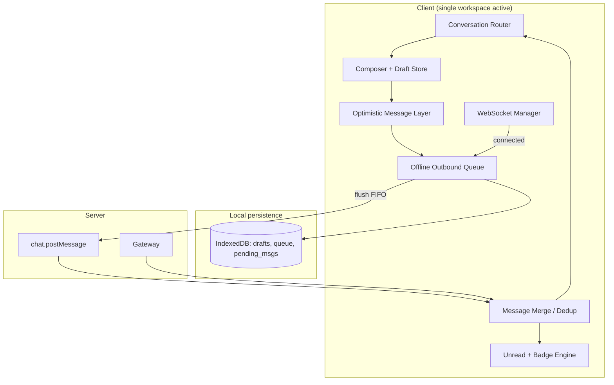

**Workspace-scoped state tree.** All mutable client state lives under `workspaces[teamId]`:

```ts
type WorkspaceState = {
  activeConversationId: string;           // currently rendered
  draftsByConversationId: Map<string, Draft>;
  outboundQueue: OutboundMessage[];       // FIFO, persisted
  messagesById: Map<string, Message>;
  timelines: Map<string, ChannelTimeline>;
  unreadByConversationId: Map<string, UnreadState>;
  connectionStatus: 'online' | 'offline' | 'reconnecting';
};
```

Switching `#incidents` → DM updates `activeConversationId` only. It does **not** flush the queue, clear optimistic rows in other channels, or merge drafts.

**Optimistic send while offline.**

1. User hits Send in `#incidents`. Client generates `client_msg_id` (UUID), inserts optimistic row `{ pending: true, failed: false, client_msg_id, channel: C_incidents, text, user: me, sortKey: 'pending:42' }`.
2. Composer clears `#incidents` draft (send consumed the text). Draft store writes empty string for `C_incidents` to IndexedDB.
3. Enqueue `{ client_msg_id, channel, text, thread_ts?, attachments?, enqueuedAt }` in `outboundQueue`. Persist queue to IndexedDB **before** acknowledging UI.
4. Show subtle delivery state on bubble: clock icon / "Sending when online…". Do **not** increment `#incidents` unread for own message.

**Switch to DM before reconnect.**

1. Save DM draft on every debounced keystroke (or on blur): `draftsByConversationId.set(D_dm, { text, caret })`.
2. Render DM timeline. `#incidents` optimistic row remains in `messagesById` + `#incidents` timeline index — invisible but present.
3. Sidebar may still show `#incidents` with a pending indicator if product policy wants it (optional subtle dot); badge count does not increase for own unsent-confirmed message.

**Reconnect + flush sequence.**

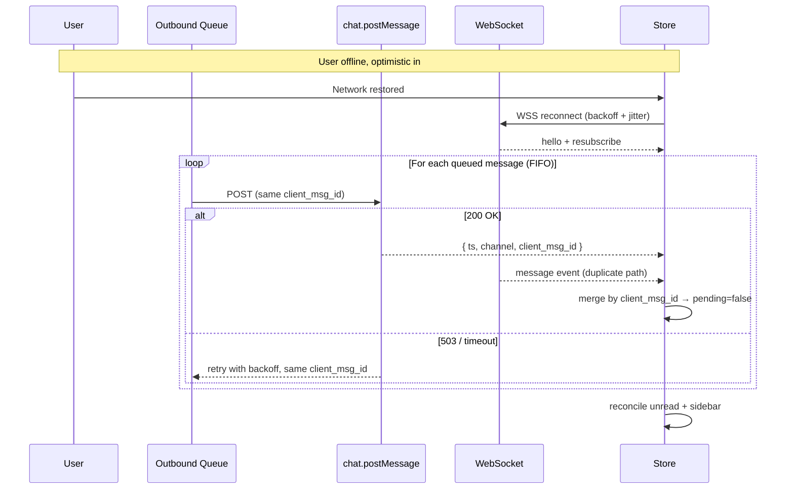

**Dedup on replay.** REST response and socket `message` event may both arrive. Merge layer:

```text
onInbound(candidate):
  if candidate.client_msg_id:
    row = findByClientMsgId(candidate.client_msg_id)
    if row: PATCH row with server ts, pending=false; return
  if has(channel, ts): return
  insert(candidate)
```

**Badge math during offline send.**

| Event | #incidents badge | DM badge |
|-------|------------------|----------|
| Own optimistic send (offline) | No change (you wrote it) | — |
| Switch to DM | Unchanged | Unchanged |
| Reconnect ACK | Still no unread for own msg | — |
| Incoming DM while away | — | +1 (if prefs allow) |

**Ordering.** Optimistic rows use `sortKey: pending:<monotonicCounter>` appended at timeline tail. On ACK, replace `sortKey` with server `ts` and re-sort once. If another user's message arrived over REST during offline, insert by `ts` — optimistic row may shift up one slot; virtualization uses stable `client_msg_id` as React key until `ts` arrives to avoid row remount flicker.

### Edge cases

- **User edits `#incidents` draft after send queued.** Too late — send already consumed text. If they had not sent, draft persists on switch.
- **Two offline sends to same channel.** Queue preserves order; each has unique `client_msg_id`; flush serially or limited parallel (2–3) per channel to preserve ordering guarantees.
- **Send fails permanently (403, channel archived).** Mark optimistic row `failed: true`, show retry/delete affordance, remove from queue, toast error.
- **User switches workspace (25 workspaces).** Queue is per-workspace; only active workspace flushes on reconnect; background workspaces flush when their socket connects (lazy socket per workspace).
- **Duplicate flush on reconnect.** Server dedupes by `client_msg_id` within 24h window; client must not regenerate id on retry.

### Failure modes

| Failure | User sees | Recovery |
|---------|-----------|----------|
| Queue persisted, app killed before reconnect | Optimistic + queue restored from IDB on boot | Auto-flush when online |
| REST OK, socket never echoes | Row confirmed via REST only | Dedup prevents double |
| Flush order violated | Messages appear out of order briefly | Serialize per-channel flush |
| Draft leak across workspaces | Wrong text in composer | Strict `workspaceId` key on drafts |
| Optimistic in hidden channel | Sidebar "pending send" hint | Reconcile on ACK |

### Tradeoffs

| Choice | Pros | Cons |
|--------|------|------|
| Global FIFO queue vs per-channel queues | Simple persistence | Cross-channel head-of-line blocking on slow channel |
| Clear composer on optimistic send vs keep failed text | Matches Slack UX | User cannot "undo send" locally |
| Show pending bubble in sidebar | Visibility | Noise in 500-channel sidebar |
| Flush all queued on reconnect vs rate-limited | Faster delivery | Spike load on gateway after outage |
| IDB-synced queue vs memory-only | Survives refresh | Write latency on each send |

**Interview sound bite:** **Per-workspace outbound queue + `client_msg_id` idempotency**; switching conversations changes the **viewport**, not the **pending send pipeline**; badges treat own optimistic sends as **non-unread** until server confirms, then still non-unread.

---

## 2. Thread Gets 200 Replies While User Is Scrolled Up in Flexpane

### Problem framing

During a live incident, a thread in `#incidents` receives ~200 replies in minutes. The user has the **flexpane open** on that thread but scrolled up reading the first 20 replies (decision log, root cause). Meanwhile: parent message `reply_count` updates in the channel feed, thread-specific unread badges increment, typing indicators fire, and the virtualized reply list must not freeze or jump.

| Concern | Conflict |
|---------|----------|
| Realtime ingestion | 200 socket events vs 60fps scroll |
| Virtualization | Insert 200 rows without layout thrash |
| Scroll anchoring | User reading history; must not yank to bottom |
| Unread badges | Thread unread vs channel mute vs "follow thread" |
| Typing indicators | 15 people typing in thread |
| "New messages" pill | Flexpane equivalent of channel jump bar |

This scenario tests whether you treat the **flexpane as a first-class surface** with its own scroll contract, not a thin wrapper over channel logic.

### Approach (architecture)

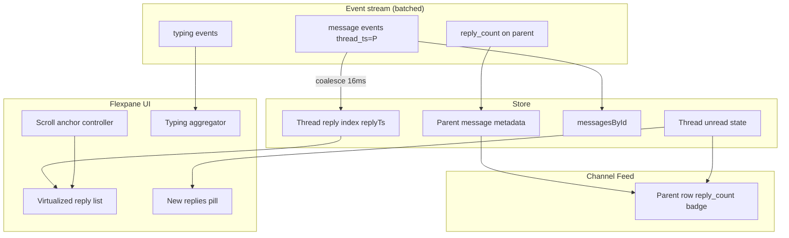

**Separate scroll state per surface.**

```ts
type FlexpaneScrollState = {
  parentTs: string;
  pinnedToBottom: boolean;      // true if within 80px of live edge
  firstUnreadReplyTs: string | null;
  belowViewportCount: number;   // for pill: "47 new replies"
  lastReadReplyTs: string;      // thread-specific read cursor
};
```

Independent from main channel feed scroll. Channel can be at bottom while flexpane is scrolled up.

**Event batching for 200 replies.** Socket handler coalesces `message` events per `(channel, thread_ts)` every frame (16ms) or 50ms during incident mode:

```text
batchBuffer.add(event)
requestAnimationFrame(() => {
  flush batch into store (single Redux dispatch)
  update parent.reply_count once (latest)
  append N ts to replyTs index
})
```

One virtual list re-measure per frame, not 200.

**Virtualized list + scroll anchoring.**

1. `@tanstack/react-virtual` over `replyTs[]` — only ~15 DOM nodes for 200 replies.
2. User scrolled up (`pinnedToBottom = false`): append new `ts` to index **below viewport** without changing `scrollTop`. Use scroll-anchor compensation if row heights change (reactions, unfurls).
3. Show pill at flexpane bottom: "↓ 47 new replies" with optional latest sender avatars. Click → `scrollToIndex(replyTs.length - 1)`, clear `belowViewportCount`, set `pinnedToBottom = true`.

**Unread badges — three layers.**

| Layer | Behavior when scrolled up + 200 new replies |
|-------|---------------------------------------------|
| Parent row in channel | Bold "new replies" badge on thread chip (`reply_count` delta since `lastReadReplyTs`) |
| Flexpane header | "New" marker on first unread reply line (Slack-style divider) |
| Sidebar `#incidents` | If thread followed or @mentioned in thread: increment mention/unread; else channel prefs apply |

**Thread read cursor.** Mark thread read only when user scrolls such that `lastReadReplyTs >= latest_reply` **or** clicks pill / explicit "Mark read". Scrolling up to read old replies does **not** mark new ones as read. Debounce read receipts: `conversations.mark` with `thread_ts` every 2s while at live edge.

**Typing indicators in hot thread.** Debounce outbound (3s idle stop). Inbound: aggregate max 3 names + "and N others", TTL 5s per typer. During 200-reply flood, **suppress typing UI** if `reply_rate > 10/s` — typing is noise; show "Active thread" static label instead.

**Parent sync without loading all replies.** Socket updates parent: `{ reply_count, latest_reply, reply_users }`. Channel feed parent row re-renders badge without opening flexpane. If flexpane closed, user still sees "200 replies" chip update.

### Sequence

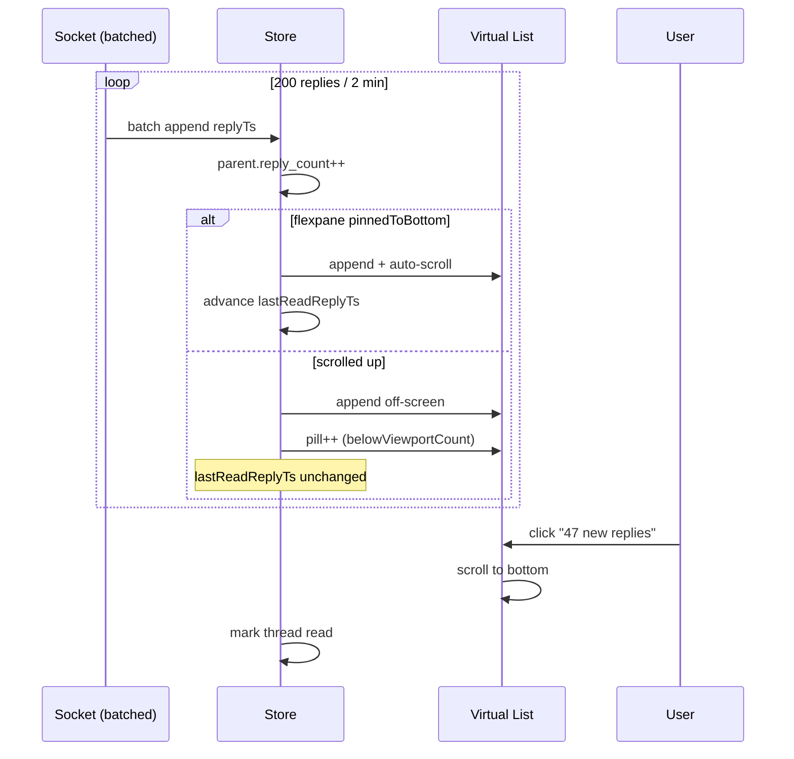

### Edge cases

- **"Also send to channel" broadcasts.** Some replies appear in both thread index and `topLevelTs` — separate rows or linked metadata; flexpane count may differ from `reply_count` (Slack excludes broadcasts from count in some views — match server semantics).
- **User at live edge, then incident spike.** Auto-scroll until user wheel-up → immediately flip `pinnedToBottom = false` on first intentional scroll-up (not programmatic).
- **Deleted reply mid-flood.** Remove from index; decrement count; pill count recalculates from `latest_reply` vs `lastReadReplyTs`.
- **Flexpane open on thread A, replies arrive on thread B.** Only thread B parent badge updates; no flexpane pill.
- **Images loading above viewport.** Scroll anchor compensates height delta when image onLoad expands row — same as channel virtualization Deep question.

### Failure modes

| Failure | Mitigation |
|---------|------------|
| 200 dispatches → UI jank | Batch per rAF |
| Pill count wrong after reconnect | Reconcile from `latest_reply` vs local cursor |
| Virtual list key churn | Key = `ts`, stable after assign |
| mark_read storm | Debounce + send max once per 2s |
| Memory: 200 full message objects | Normalized store; replies already in `messagesById` |

### Tradeoffs

| Choice | Pros | Cons |
|--------|------|------|
| Batch socket updates vs per-event | 60fps during incident | Max 1 frame latency |
| Suppress typing during flood | Cleaner UX | Less "live" feel |
| Thread read at live edge only | Accurate unread | User must scroll to clear badge |
| Pill vs auto-scroll on @mention in thread | Respects reading context | User may miss urgent ping unless highlight |
| Separate flexpane virtual list vs shared component | Tailored scroll | Some code duplication |

**Interview sound bite:** Flexpane is a **second timeline with its own pin-to-bottom flag**; ingest replies in **batches**; unread is **`lastReadReplyTs` vs `latest_reply`**, not "flexpane is open."

---

## 3. Triple @mention While #general Is Muted (DND Off)

### Problem framing

Within seconds, the user receives:

1. Direct `@user` mention in `#general` (channel notification pref: **muted** — mentions only or nothing)
2. `@user` mention in `#random` (default notify)
3. `@user` mention inside a **thread** (parent in `#incidents` or `#general`)

DND is **off**. User has desktop focused on another app; mobile in pocket. What fires for push, desktop banner, sidebar badges, and tab title?

| Input | Must evaluate |
|-------|---------------|
| Mention parser | `@user`, `@here`, `@channel`, user groups |
| Per-channel prefs | all / mentions / mute |
| Thread settings | follow thread, parent channel mute inheritance |
| Active window | suppress desktop push if Slack focused on that conversation |
| Cross-device read sync | read on desktop clears mobile badge |
| Mention vs regular unread | bold vs normal sidebar styling |

### Approach (architecture)

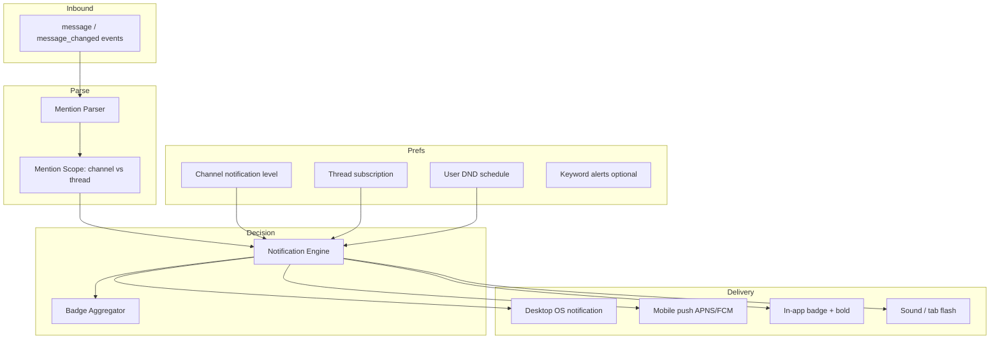

**Notification decision tree (per incoming message).**

```text
function shouldNotify(msg, viewer):
  if viewer.dnd.active: return suppressed (unless DM from VIP / keyword — product)
  if !mentionsViewer(msg): 
    return channelPref == 'all' ? notify : no
  // viewer is mentioned
  if msg.thread_ts:
    if viewer.followsThread(msg.thread_ts): return notify
    if channelPref == 'mute': 
      return threadMentionOverridesMute ? notify : no  // Slack: thread @mention often still notifies
    return notify
  // channel-level mention
  if channelPref == 'mute': return no  // @you in muted channel — typically suppressed for push
  if channelPref == 'mentions': return notify
  return notify
```

*Slack product nuance:* In a **muted** channel, `@mentions` of you may still appear as **badges** in some configurations but **not** desktop push — clarify in interview: separate **push**, **badge**, and **bold** decisions.

**Scenario walkthrough.**

| Source | Push desktop | Push mobile | Sidebar badge | Style |
|--------|--------------|-------------|---------------|-------|
| `@you` in `#general` (muted) | No | No* | Optional subtle unread, not bold mention | Normal or no increment |
| `@you` in `#random` | Yes | Yes | +1 mention | **Bold** channel |
| `@you` in thread (unmuted parent) | Yes | Yes | Thread badge on parent + sidebar | Bold if following |

\*Mobile may batch if multiple arrive within grouping window.

**Badge math — separate counters.**

```ts
type ConversationUnread = {
  lastReadTs: string;
  latestMsgTs: string;
  unreadCount: number;           // display cap 99+
  mentionCount: number;          // drives bold
  hasUnreadThread: boolean;      // parent row chip
};
```

Each mention increments `mentionCount` only if notification engine classifies it as "mention-class" for **badge purposes** (can differ from push). `#general` muted: increment `unreadCount` only if user has "Show unread counts for muted channels" pref; often **zero** for muted @mention.

**Desktop vs mobile.**

| Client | Active / focused behavior |
|--------|---------------------------|
| Desktop, Slack focused on `#random` | Suppress OS notification for `#random` message; still mark read if at live edge |
| Desktop, Slack focused on unrelated channel | OS notification for `#random` + thread; not `#general` if muted |
| Desktop, Slack minimized | All eligible pushes fire (except muted) |
| Mobile, app background | Push for eligible; **group** if 3 arrive in 5s: "3 mentions in 2 channels" |
| Mobile, after desktop read | Push for already-read suppressed via server `last_read` sync |

**Cross-device sync.** Server authoritative `last_read` per `(user, channel, thread_ts?)`. Desktop reads `#random` → mobile badge drops within ~1s via socket `channel_marked` event. Thread mention unread clears only when thread cursor catches `latest_reply`.

**Burst handling (3 simultaneous).** Coalesce notifications:

```text
notificationGroupKey = (userId, windowId=5s)
if same group: update existing OS notification body
  "#random, #incidents thread: 3 mentions"
badges still increment per-conversation internally
```

### Sequence

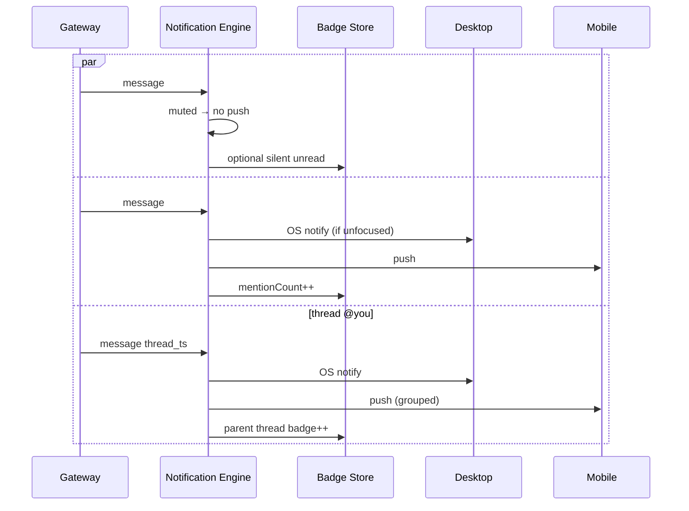

### Edge cases

- **@channel in `#random` but not @you.** Notify only if pref = all; not a direct mention badge.
- **Thread in muted `#general`, user follows thread.** Follow overrides mute for that thread — notify.
- **Same message mentions you twice (edit).** Dedupe by `(channel, ts)` for notification idempotency.
- **Scheduled DND ends mid-burst.** Queue held notifications or drop — product: usually drop stale >5min.
- **Guest user in shared channel.** Mention rules same; push may be email-only for guests.

### Failure modes

| Failure | Mitigation |
|---------|------------|
| Push without badge or inverse | Single decision function, fan-out to channels |
| Double push desktop + mobile | `active_device` registry; suppress secondary |
| Muted channel still bold | Separate mention vs mute flags |
| Thread badge stale | Bind to `latest_reply` on parent |
| Grouped push hides urgency | @channel / keyword bypass grouping |

### Tradeoffs

| Choice | Pros | Cons |
|--------|------|------|
| Unified vs split push/badge logic | One parser | Harder to tune muted behavior |
| Thread follow overrides mute | Important incident threads reach you | Notification fatigue |
| Aggressive mobile grouping | Less annoyance | Delayed awareness |
| Show muted @mention in badge | Nothing truly hidden | Defeats mute purpose |
| Server-side notification fan-out | Consistent cross-device | Less client control offline |

**Interview sound bite:** Evaluate **mention × channel pref × thread subscription × DND × focus** as a **matrix**; push, bold badge, and unread count are **three outputs** of one parser, not one boolean.

---

## 4. Quick Switcher (Cmd+K) — 25 Workspaces, 8,000 Channels

### Problem framing

Power user: **25 workspaces**, **~8,000 channels + DMs** total, plus bots, people, files, and recent searches. Cmd+K must open in **<100ms**, fuzzy-find across entities in **<50ms keystroke-to-paint**, support keyboard-only navigation, and never conflate workspaces (Org A `#secret` must not flash in Org B context).

| Requirement | Target |
|-------------|--------|
| Open modal | <100ms from keydown (cached index) |
| Keystroke latency | <50ms p95 to update results |
| Scale | 8k+ items without loading all into DOM |
| Scope | Current workspace default; optional cross-workspace mode |
| Recency | Recent channels, DMs, people boosted in rank |
| Keyboard | ↑↓ navigate, Enter open, Esc dismiss, Tab switch filter |

### Approach (architecture)

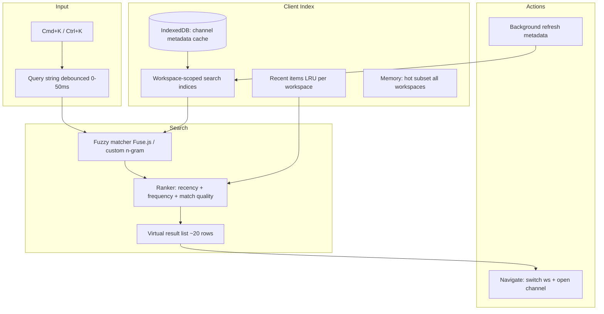

**Data model — metadata only, not messages.**

```ts
type SwitcherItem = {
  id: string;              // C123, D456, U789
  workspaceId: string;
  type: 'channel' | 'dm' | 'user' | 'app' | 'file';
  name: string;            // display name
  normalizedName: string;  // lower, no # prefix
  memberCount?: number;
  isPrivate: boolean;
  isArchived: boolean;
  lastVisitedAt: number;   // client recency
  visitCount: number;
};
```

Full message history is **never** in the switcher index. ~8k rows × ~200 bytes ≈ 1.6MB — fits memory; still use virtualization for render, not for search.

**Indexing strategy.**

1. **Per-workspace inverted index** — On workspace load (or background after login), build `Map<workspaceId, SwitcherItem[]>` from `conversations.list` paginated + local IDB cache.
2. **Lazy workspace indices** — Active workspace: eager index in memory. Other 24 workspaces: load metadata from IDB on first cross-work search or `@workspace` prefix; paginate refresh in idle time (`requestIdleCallback`).
3. **Fuzzy index** — Precompute trigrams or use Fuse.js with `keys: ['name', 'normalizedName']`, `threshold: 0.4`. For 8k items, in-memory fuzzy completes in **<10ms** on modern laptops.

**Default scope: current workspace.** Query `"deploy"` searches ~300 items in active workspace — instant. **Cross-workspace:** user prefixes `acme deploy` or toggles "Search all workspaces" → merge results from multiple indices with cap 50 per workspace.

**Ranking function.**

```text
score = 
  1000 * exactPrefixMatch(name, query) +
  500  * fuzzyMatchQuality +
  100  * recencyBoost(lastVisitedAt) +
  50   * visitCountNormalized +
  30   * typeBoost(DM > channel > user) +
  penalty if archived (hide unless exact match)
```

Recent items (`RI`, last 20 per workspace) injected at top when query empty — "Recent" section like Slack.

**Virtualized results.** `@tanstack/react-virtual`, fixed row height 36px. Arrow keys update `focusedIndex`; scrollIntoView only for focused row. **Do not** re-mount entire list on each keystroke — diff by `item.id`.

**Keyboard performance.**

```text
keydown → update query state (sync)
requestAnimationFrame → run fuzzy + rank
rAF → commit results to virtual list
```

Debounce 0ms for local index; 150ms if falling back to server search (Enterprise Grid remote channels not in cache).

**Open flow.**

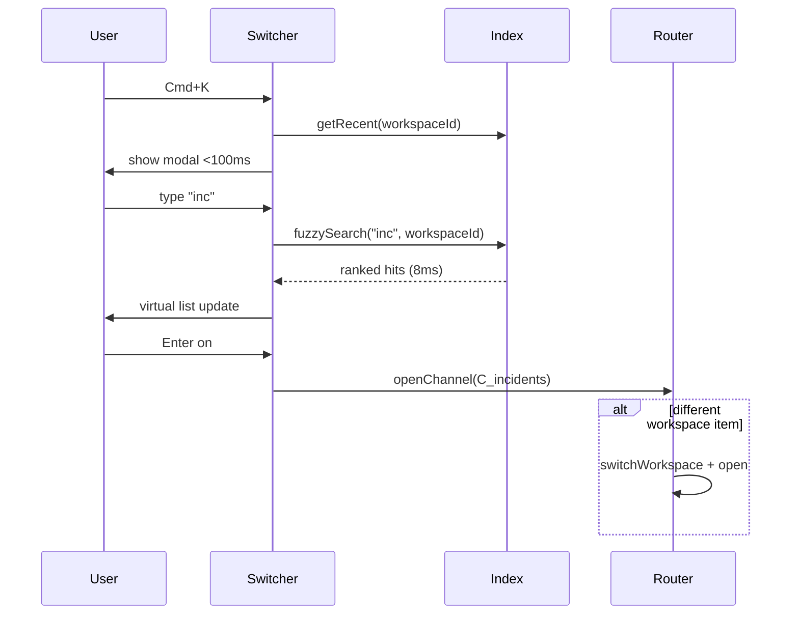

### Edge cases

- **Duplicate channel names across workspaces.** Result row shows `#incidents · Acme Corp` vs `#incidents · Beta Inc`.
- **8000 channels, user on laptop with slow CPU.** Web Worker for fuzzy search off main thread; transfer ArrayBuffer index.
- **Stale index — newly created channel.** Socket `channel_created` patches index; until then server `search` fallback on miss.
- **Archived / deleted channels.** Filter from default; show if exact name match + "(archived)" label.
- **Emoji in channel names.** Normalize for search strip emoji or index emoji shortcodes.

### Failure modes

| Failure | Mitigation |
|---------|------------|
| Index not ready on first Cmd+K | Show recents from IDB + skeleton |
| Cross-workspace search slow | Cap workspaces searched; show progress |
| Wrong workspace open | Always show workspace label on row |
| Virtual list focus lost | Maintain focusedIndex on query change if item still visible |
| Server search timeout | Local-only results + "Search still running…" |

### Tradeoffs

| Choice | Pros | Cons |
|--------|------|------|
| Client-only fuzzy vs server search | <50ms | Stale for huge Grid orgs |
| Per-workspace vs global index | Scoped default | Cross-work merge complexity |
| Web Worker search | Main thread free | Serialization cost |
| Index all 8k upfront vs lazy | Instant search | Memory ~2MB per workspace |
| Recency boost vs pure relevance | Matches muscle memory | Hides best fuzzy match |

**Interview sound bite:** Cmd+K is a **metadata fuzzy index + ranker**, not search over messages; **virtualize rendering**, not search; **workspace id on every row** prevents cross-tenant navigation bugs.

---

## 5. Slack Connect — Two Orgs, Different Retention Policies

### Problem framing

A **shared channel** connects Org A (90-day retention) and Org B (7-year retention + legal hold). Same `#proj-shared` UI, but:

- Org B user may see 2 years of history; Org A user hits "Message deleted by retention policy" tombstones at 90 days.
- Search, file preview, and export behave differently per side.
- Auth boundaries: Org A guest cannot DM Org B member outside shared context.

| Surface | Policy-aware behavior |
|---------|----------------------|
| History load | Server filters by viewer org retention |
| Search | Index scoped; results differ per org |
| File preview | Org B CDN token vs Org A blocked expired file |
| UI | Tombstones, "Not visible to your organization" |
| Member list | Show home org badge on avatars |

### Approach (architecture)

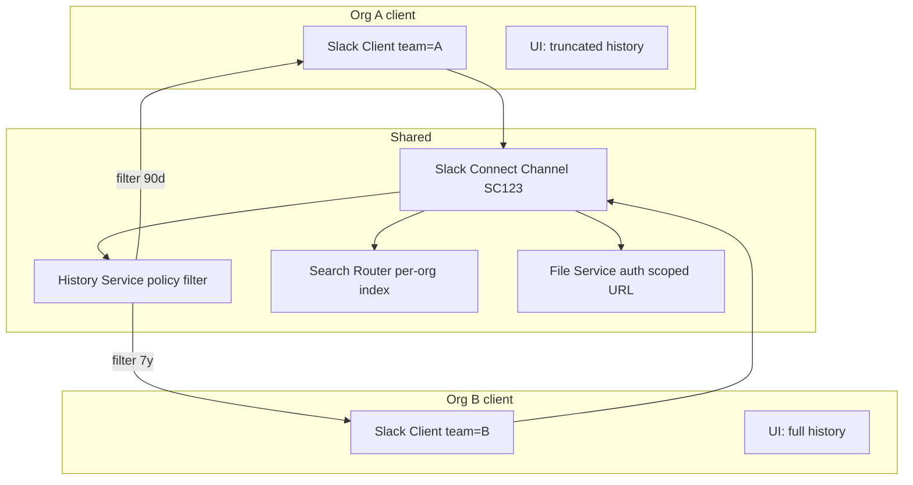

**Channel identity.** Shared channel has `channel_id` + `shared_channel` metadata: `{ connected_team_ids, is_shared, conversation_host_id }`. Client tags every message fetch with `viewer_team_id`; **server never sends** out-of-policy content — client cannot bypass.

**History loading.**

```text
GET conversations.history(channel=SC123, cursor)
Response (Org A viewer):
  messages: [ ... within 90d ... ]
  tombstones: [{ ts, type: 'retention_policy', text: 'Message removed' }]
  policy: { retention_days: 90, viewer_org: 'A' }

Response (Org B viewer):
  messages: [ ... 7y window ... ]
  tombstones: []
```

Client renders tombstones as first-class rows (not errors). Scroll-up pagination stops at org retention boundary — "Beginning of visible history for your organization."

**Search.**

- Separate search indices per org **view** of shared channel; same query `"budget Q3"` returns different hit counts.
- Client passes `team_id` + `search_scope=shared_channel` — server applies retention filter **before** returning snippets.
- UI: snippet may show `"[Message not available to your workspace]"` for hits the other org sees but you don't — or hide entirely (Slack tends to **omit** invisible hits).

**File preview.**

1. Message references `file_id F789`.
2. Client requests preview URL: `GET files.info(F789)` → server checks viewer org + file retention.
3. Org A, file 100 days old: `403` or `{ previewable: false, reason: 'retention' }` → inline card "File no longer available."
4. Org B: signed URL valid 1h → inline preview.

**Member list & auth boundaries.**

- Avatars show small org pill (Acme / Beta).
- Actions (huddle, DM, profile) gated: `can_dm(user)` false if not same org and no shared channel context.
- Guest from Org A: reduced actions — no `@channel` if policy says so.

**Client state — no merged policy.** Store messages already filtered; do **not** cache other org's hidden content in IndexedDB. On workspace switch, evict shared channel cache entries.

### Sequence

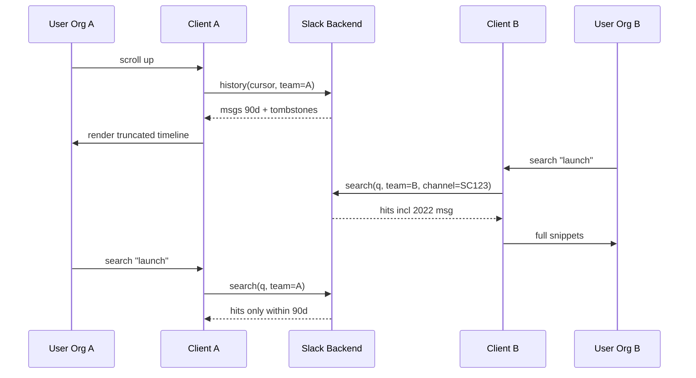

### Edge cases

- **Message sent by Org B user, deleted by Org A retention.** Org A sees tombstone; Org B may still see content until their policy deletes — **async** deletion jobs; brief inconsistency OK with server reconciliation.
- **Legal hold on Org B.** Org B user sees frozen history; export enabled; Org A unaffected.
- **User belongs to both orgs (different accounts).** Two clients or workspace switcher — indices never merge.
- **Link unfurl to internal Org A URL.** Org B members see "Link preview unavailable" — no leak.
- **Shared channel disconnected.** History read-only; search scoped to disconnect date.

### Failure modes

| Failure | Mitigation |
|---------|------------|
| Client caches pre-retention message | Server redact on fetch; TTL on IDB |
| File preview leak via shared URL | Short-lived signed URLs; org in claim |
| Search shows snippet from hidden msg | Server-side filter only |
| Tombstone count mismatch on pagination | Cursor includes policy epoch |
| User confusion why peer sees more | Inline help "Your org retention: 90 days" |

### Tradeoffs

| Choice | Pros | Cons |
|--------|------|------|
| Server filter only vs client filter | Security | Round-trip per page |
| Show tombstones vs skip gap | Transparency | Cluttered timeline |
| Omit vs placeholder in search | Cleaner | User thinks search is broken |
| Separate indices per org | Correct results | 2× index storage for shared msgs |
| Evict IDB on policy change event | Fresh compliance | Re-fetch cost |

**Interview sound bite:** Slack Connect shared UI, **policy-filtered server views** — retention is **not a client filter**; search and files are **viewer-org scoped** with tombstones and signed URLs as the UX layer.

---

## 6. WebSocket Drop 90s During All-Hands — 5,000 msg/min in #announcements

### Problem framing

Company all-hands: `#announcements` receives **~83 messages/second** (~5,000/min). WebSocket drops for **90 seconds**. User is subscribed, may or may not have channel open. On reconnect:

- ~7,500 messages may have been missed (if no buffering)
- UI must not freeze applying 7k events
- Duplicates from overlap replay + REST catch-up
- User needs honest connection UX without panic
- Badges, reactions, and thread counts must reconcile

| Phase | Challenge |
|-------|-------------|
| During outage | Degraded mode; REST backstop |
| Reconnect | Backoff without herd; resubscribe |
| Catch-up | Incremental vs full refetch |
| Apply | Batch + virtualize; don't block main thread |
| Dedup | Socket replay ∩ history API |
| UX | "Reconnecting…" → "Catching up…" → live |

### Approach (architecture)

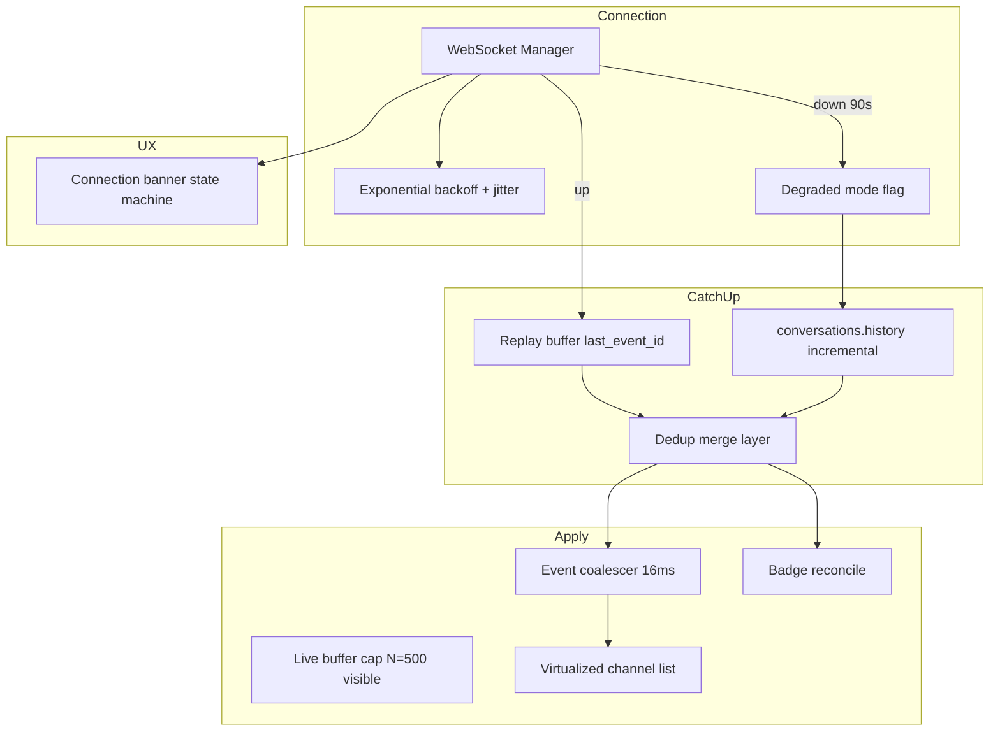

**User-visible state machine.**

```text
connected → disconnected (banner: "Reconnecting…")
  → reconnecting (backoff attempt n)
  → connected → catching_up (banner: "Catching up on #announcements…")
  → live (banner dismiss)
```

If channel not open: sidebar badge shows **"!"** or elevated count; no list jank.

**During 90s outage.**

1. Mark `connectionStatus = degraded`. Enable REST polling for **active conversation only** (if `#announcements` open): `history?oldest=lastKnownTs&limit=100` every 10s — **not** full poll of all channels.
2. Queue outbound sends (questions, reactions) locally; flush on reconnect.
3. Sidebar: subtle global indicator "Some messages may be delayed" — not modal alarm.
4. Do **not** spin-reconnect every 100ms — exponential backoff capped 30s with jitter (see §1 Deep).

**Reconnect catch-up strategy.**

```text
if offline_duration < 2min AND gateway supports last_event_id replay:
  WS connect(last_event_id)
  replay events → merge
else:
  for each subscribed channel with gap:
    REST history(oldest=lastKnownTs, limit=200) paginate until caught up
```

For `#announcements` with 7k gap: **do not** fetch all 7k if user hasn't opened channel — update `latest_ts` + unread count from `conversations.info` / summary endpoint; **lazy fetch** on open.

**If user has channel open during catch-up.**

1. **Paginated REST** in background: pages of 200, merge into store via dedup.
2. **Coalesce UI updates** — one dispatch per page, not per message.
3. **Live buffer cap** — keep last 500 messages fully hydrated in hot timeline; older gap collapsed to "7,000 messages while you were away — [Load more]" summary bar (Slack-style jump) OR auto-load in idle chunks (`requestIdleCallback` 500/msg frame).
4. Virtual list: user likely at bottom for announcements — pin to bottom during catch-up if they were at bottom before disconnect; else pill "832 new messages."

**Dedup.**

```ts
function mergeMessage(m: Message) {
  if (m.client_msg_id && pendingByClientId.has(m.client_msg_id))
    return promotePending(m);
  const key = `${m.channel}:${m.ts}`;
  if (seen.has(key)) return;
  seen.add(key);
  insert(m);
}
```

Replay + REST overlap common in first 200 messages after reconnect — dedup essential.

**Reactions / edits during flood.** Coalesce `reaction_added` per `(message_ts, reaction)` — set not counter. `message_changed` — latest wins per `ts`.

**Badge reconcile.** After catch-up:

```text
unreadCount = f(latest_ts, last_read_ts, mention_flags)
```

Server `channel_marked` events during outage may have been missed — refetch `last_read` for active channels on reconnect.

### Sequence

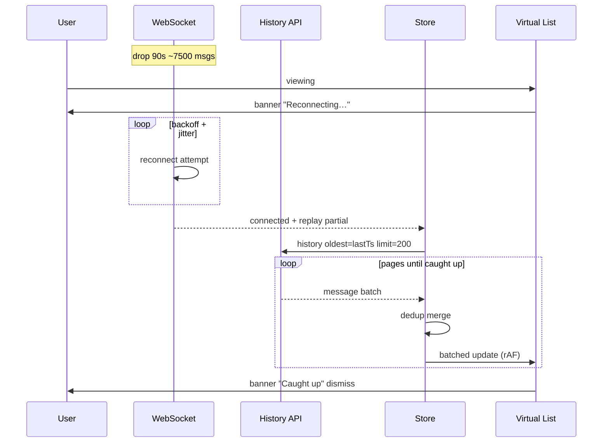

### Edge cases

- **Disconnect during disconnect** — reset backoff carefully; single reconnect owner tab.
- **User switches away from #announcements during catch-up.** Cancel low-priority pagination; keep summary badge updated.
- **Memory pressure 7k messages.** Evict bodies for messages outside hot buffer; retain `ts` index metadata.
- **Enterprise Grid shard failover.** Full resync of workspace metadata; channel list refetch.
- **Duplicate badges after reconnect.** Reset from server `unread_count_display` once per channel.

### Failure modes

| Failure | User sees | Recovery |
|---------|-----------|----------|
| Replay + REST both deliver | Dedup prevents doubles | — |
| 7k apply blocks main thread | Frozen UI | Batch + Worker merge optional |
| Catch-up slower than live rate | Growing gap | Summary mode + jump to latest |
| last_event_id not supported | Full REST gap fill | Paginate |
| Badge wrong | Over/under count | Server reconcile on reconnect |

### Tradeoffs

| Choice | Pros | Cons |
|--------|------|------|
| Lazy catch-up vs full 7k load | Fast reconnect feel | Scroll history incomplete briefly |
| Summary bar vs silent load | Honest UX | Extra click |
| REST poll during outage | Active channel stays fresh | Load on API |
| 500-msg hot buffer | Bounded memory | Older msgs need fetch |
| Worker-side merge | Smooth UI | Complexity |

**Interview sound bite:** Treat mega-channel catch-up as **paginated REST + batched merge + virtualized apply**; **dedup replay ∩ history**; **lazy load** unless user is watching the firehose — connection UX is a **state machine**, not a spinner.

---

## Cross-Scenario Synthesis (Interview Closing)

These six scenarios share patterns worth stating explicitly:

1. **Per-surface scroll and read cursors** — Channel, flexpane, and thread each own pin-to-bottom and unread math (Q2, Q3, Q6).
2. **`client_msg_id` + `(channel, ts)` dedup everywhere** — Offline queue, reconnect replay, and REST catch-up are the same merge problem (Q1, Q6).
3. **Workspace and org as hard boundaries** — State, indices, retention, and navigation never leak across (Q1, Q4, Q5).
4. **Batch realtime, virtualize render** — 200 thread replies or 7k announcement messages: coalesce ingestion, virtualize display (Q2, Q6).
5. **Server-authoritative policy and unread** — Client optimizes UX; server wins on retention, badges after reconnect, and cross-device read (Q3, Q5, Q6).

*Prep alignment: questions sourced from `system-design/slack/slack-design-doc.md` §8; complements §1–7 answer files.*
