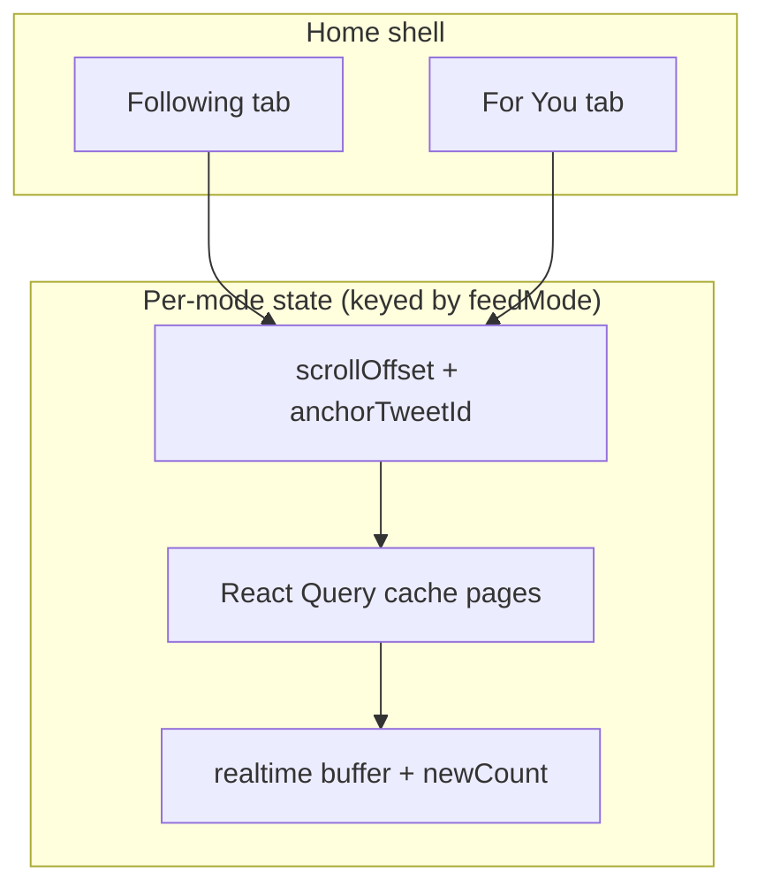
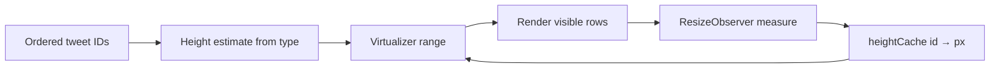
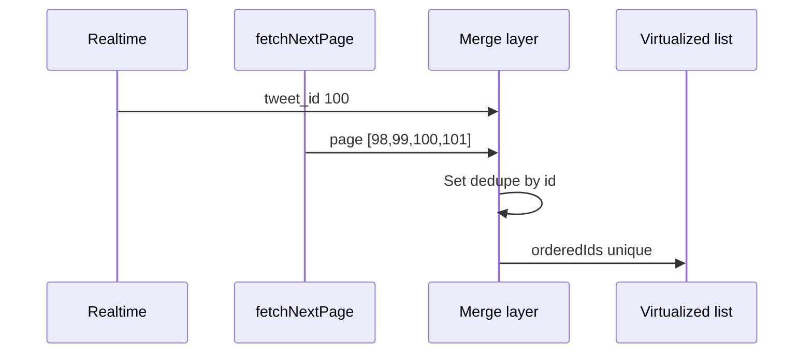
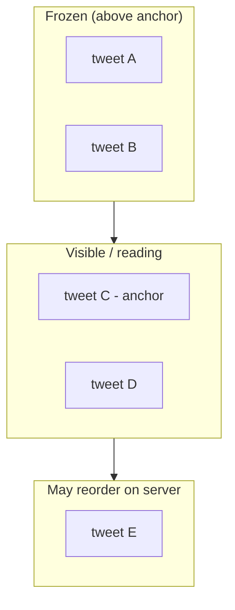
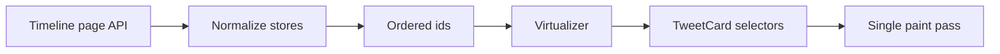
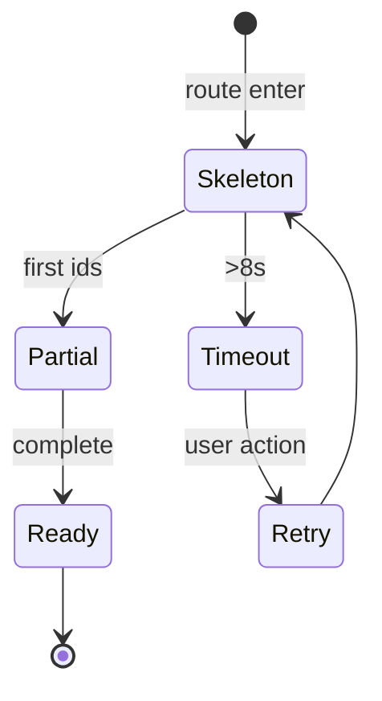
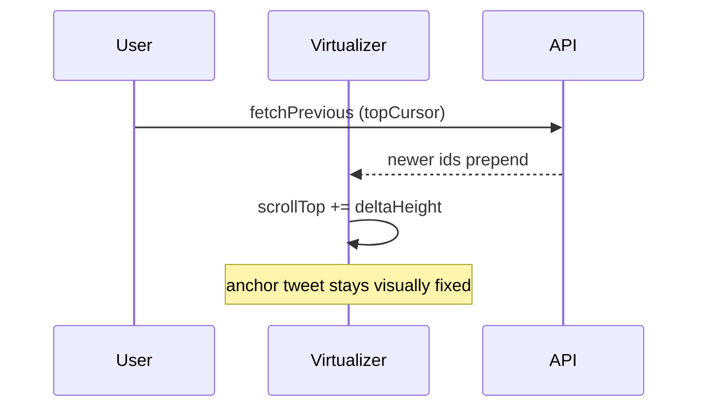
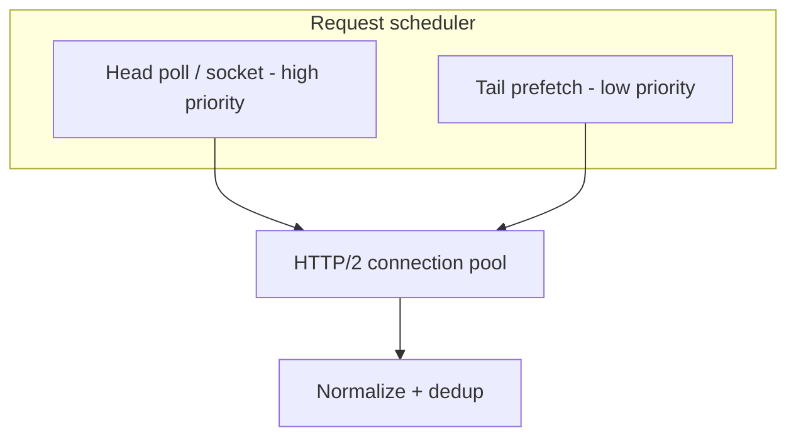

# Section 1 — Timeline & Home Feed (Answers)

Interview-depth answers for Twitter/X home timeline: problem framing, approach, tradeoffs, concrete techniques, and pitfalls. Covers Following vs For You feed modes, cursor pagination, virtualization, real-time deduplication, hybrid fan-out constraints, and algorithmic ranking UX.

---

## Core

### How do you model "Following" vs "For You" as separate feed modes with independent scroll position and cache keys?

**Problem framing:** Home is two distinct products sharing chrome: **Following** is reverse-chronological from the social graph; **For You** is ranked, injected with ads/promoted/recs, and re-ranked server-side. Users switch tabs mid-scroll and expect each mode to **remember where they were**, not bleed scroll position or stale pages across modes.

**Approach:** Treat each feed mode as an **isolated surface** with its own scroll snapshot, query cache, and real-time subscription scope — not a single `tweets[]` with a filter.



1. **Feed mode as first-class route state** — `feedMode: 'following' | 'for_you'` in URL (`/home?tab=following`) or path segment. Tab switch mounts the correct **feed instance** (or toggles visibility with `display: none` while preserving DOM — tradeoff below).

2. **Independent scroll snapshots** — Per mode, persist:
   - `scrollTop` or virtualizer `scrollOffset`
   - `anchorTweetId` + `anchorOffsetPx` (more stable across resize)
   - `firstVisibleIndex` / `range` from the virtualizer
   Store in session memory (Zustand/Redux slice) or `sessionStorage` keyed by `viewerId:feedMode`.

3. **Cache keys that encode mode + viewer + cursor chain** — Example React Query keys:

   | Key segment | Purpose |
   |-------------|---------|
   | `['timeline', viewerId, feedMode]` | Infinite query root |
   | `['timeline', viewerId, feedMode, 'pages']` | Page array |
   | `['tweet', tweetId]` | Normalized entity (shared across modes) |

   Never key only on `home` — a Following page fetch must not satisfy For You's `fetchNextPage`.

4. **Separate API contracts** — `GET /2/timeline/following?cursor=…` vs `GET /2/timeline/for_you?cursor=…&ranking_version=…`. Different sort keys, injection slots, and freshness semantics.

5. **Independent realtime channels** — Following listens to `home_following` events; For You may use lighter polling + periodic rank refresh. Counters (`newTweetCount`) are per mode.

6. **Shared normalized entity store** — Tweet bodies, users, media live in `tweetById` / `userById`. Only **ordered ID lists** and **pagination cursors** are mode-scoped. A like count update patches once and reflects in both tabs if the tweet appears in both caches.

```text
timelineFollowing: { orderedIds, pages[], scroll, newCount, cursorTop, cursorBottom }
timelineForYou:    { orderedIds, pages[], scroll, newCount, cursorTop, cursorBottom, rankingVersion }
entities:          { tweets, users, media }  // shared
```

**Tradeoffs:** Keeping both tabs mounted (hidden) preserves scroll/virtualizer state but doubles memory and may run two poll loops — gate background tab to snapshot-only. Unmounting on tab switch saves memory but requires reliable scroll restore via anchor tweet id. **Pitfall:** Single infinite query with client-side filter — For You ranking and ads break. **Pitfall:** Shared `scrollTop` on one scroll container — switching tabs jumps the user.

---

### Why does the timeline API use cursor-based pagination instead of offset/limit, and what goes in the cursor?

**Problem framing:** Timelines are **append-heavy, mutable, ranked lists**. Offset pagination (`?offset=200&limit=20`) assumes a stable total ordering; new tweets insert at the top, deletes and mutes remove rows, and For You re-ranks — so page 11 at offset 200 returns **duplicates, gaps, or skipped tweets** under load. Interviewers want the client-side contract and what's opaque inside the cursor.

**Approach:** Use **opaque, stable cursors** tied to the server's merge/rank pipeline, not row indices.

**Why cursor beats offset:**

| Issue | Offset/limit | Cursor |
|-------|--------------|--------|
| New items at head | Shifts indices; user sees repeats | Head cursor unchanged; tail fetch consistent |
| Deletes / blocks | Holes or wrong window | Server skips ineligible ids when resolving |
| For You re-rank | Same offset ≠ same tweets | Cursor binds to rank snapshot or tie-break |
| Hot accounts / fan-out | Slow COUNT/OFFSET on large sets | Seek by `(timestamp, id)` or precomputed bucket |
| Consistency | Two requests see different worlds | Cursor can embed `read_consistency_token` |

**What goes in the cursor (conceptually):**

Following (reverse-chronological):
```json
{
  "v": 1,
  "dir": "older",
  "sort": ["created_at_desc", "id_desc"],
  "pos": { "created_at": "2026-05-30T12:00:00Z", "id": "18446744073709551615" },
  "sources": ["fanout:uid123", "pull:celebrity_merge"],
  "consistency": "abc123"
}
```

For You (ranked):
```json
{
  "v": 2,
  "dir": "older",
  "ranking_version": "fy-2026-05-30T11:00Z",
  "slot": 40,
  "candidate_set_id": "cs_9f2a",
  "pos": { "score": 0.842, "id": "999" }
}
```

Wire format: **base64url-encoded protobuf or signed blob** — client treats as opaque, echoes on `next_cursor`. Signing prevents tampering (jumping into someone else's timeline).

**API shape:**
```http
GET /2/timeline/following?cursor=<opaque>&count=20
→ { "data": [ { "type": "tweet", "id": "…" }, … ],
    "meta": { "next_cursor": "…", "previous_cursor": "…" } }
```

**Client rules:** Pass `next_cursor` verbatim; never parse for logic except `dir`. On 400/expired cursor, reset to head with user-visible "Refresh timeline". Dedupe by `tweet.id` when overlapping cursors return from reconnect.

**Tradeoffs:** Opaque cursors complicate debugging — log decoded server-side only. Bi-directional feeds need paired `previous_cursor` / `next_cursor`. **Pitfall:** Client-side `offset += 20` against a ranked feed — classic duplicate-on-scroll bug. **Pitfall:** Storing cursor in URL for shareable state — usually wrong for personalized ranked feeds; use tweet id deep links instead.

---

### How do you implement infinite scroll without jank when tweet heights vary (text, polls, 4-up media, quote tweets)?

**Problem framing:** Tweet cards are **heterogeneous** (140 chars vs 4-image grid vs quote tweet vs poll). Naive "render all" blows DOM node counts; naive fixed-height virtualization causes **wrong scroll height, overlap, and scroll jump** as images load and text wraps.

**Approach:** Variable-size virtualizer + **estimate → measure → cache** loop with layout containment.



1. **Virtualizer choice** — `@tanstack/react-virtual`, `react-window` VariableSizeList, or custom. Maintain `heightCache: Map<tweetId, number>` and `defaultEstimatedHeight` per card **archetype** (text-only ~120px, media 16:9 ~280px, poll ~200px, quote + media ~360px).

2. **Stable keys** — Row key = `tweetId`, never array index. Survives prepend of new tweets without remounting off-screen rows.

3. **Aspect-ratio boxes before load** — Media containers use `padding-bottom: 56.25%` or explicit `aspect-ratio` from API metadata (`width`, `height`, `focus_rect`). Prevents CLS when CDN image arrives.

4. **Measure after paint** — `ResizeObserver` on row root updates cache; call `virtualizer.measureElement()` or `resetAfterIndex(i)` **once** per id when height changes. Debounce burst updates (image decode batch) to one rAF.

5. **Scroll anchoring** — `overflow-anchor: auto` on list; when prepending above viewport, use virtualizer **scroll correction** (adjust offset by delta height of inserted rows above anchor).

6. **Progressive media** — Blurhash/LQIP in fixed box; video defers player init until `IntersectionObserver` (e.g. 1 viewport ahead). Polls render skeleton until options hydrate.

7. **Sentinel for pagination** — IntersectionObserver on a **bottom sentinel** (not last tweet — last tweet may unload). `rootMargin: '300% 0px'` triggers `fetchNextPage` early (see Deep prefetch question).

| Card type | Estimate source |
|-----------|-----------------|
| Text | char count buckets + has link card |
| Image 1 | aspect ratio from entity |
| Image 2–4 grid | fixed grid template |
| Video/GIF | poster aspect + controls bar |
| Quote | sum(outer text + inner cached height or estimate) |

**Tradeoffs:** Remeasuring on every font resize is expensive — listen to `resize` and invalidate cache selectively. Over-estimating adds blank gap; under-estimating causes jank — bias slightly high for media. **Pitfall:** Using index-based `getItemSize(index)` without invalidating after height change — scroll drift. **Pitfall:** Loading full-resolution images for off-screen rows — kills main thread and bandwidth.

---

### What is the "N new posts" banner pattern, and when should tapping it prepend vs replace the visible window?

**Problem framing:** While the user reads mid-feed, new tweets arrive (socket, poll, or push). Auto-prepend would **shift content under their eyes**; ignoring updates loses freshness signal. The banner is the compromise: **surface count without mutating the viewport** until explicit user intent.

**Approach:** Track **pinned-to-top** vs **reading** state; buffer incoming ids separately from the displayed list.

```text
User scroll position
    |
    +-- At live edge (within ~1 viewport of top)
    |       --> prepend new tweets immediately (or soft prepend)
    |       --> hide banner
    |
    +-- Scrolled down (reading)
            --> increment newCount, show banner "See 12 posts"
            --> store pendingIds[] (or merge into shadow list)
```

**Banner UX:** Sticky pill below home header: "12 new posts" / avatars stack. Optional: only show after `newCount >= 3` or debounce 2s during flash events (Super Bowl).

**Tap behavior — prepend vs replace:**

| Scenario | Action | Rationale |
|----------|--------|-----------|
| User tapped banner while **reading** mid-feed | **Replace window to live edge** (jump to top) | User asked for latest; reset list to head cursor + merge pending |
| User at live edge, banner appeared from burst | **Prepend** into list + scroll stays at top | Already at top; new items should appear above first visible |
| User on **Following**, small N (1–2) | Often **silent prepend** if at top | Low disruption |
| **For You** after long idle | **Replace** with fresh ranked page | Stale rank; server returns new `ranking_version` |
| Return from background &gt; 30 min | **Replace** (full refresh) | Ranking + ads contract changed |

**Implementation:**
```text
onNewTweets(ids):
  if isAtLiveEdge: prependDeduped(ids); scrollTop = 0
  else: pendingIds.push(...ids); newCount++; showBanner()

onBannerTap():
  fetchHead(cursor=null) OR prepend(pendingIds)
  clear pendingIds, newCount
  virtualizer.scrollToIndex(0, { align: 'start' })
  restore focus / aria-live polite announce
```

**Tradeoffs:** Replace feels like losing reading context — offer "Show latest" vs long-press "Mark as read" for power users. Prepend-only without scroll correction jumps content — must use anchor compensation. **Pitfall:** Prepending 500 tweets during an event — batch prepend + cap pending buffer with "99+ new posts". **Pitfall:** Banner tap that prepends while user is mid-feed — they stay scrolled down but list above grows; confusing unless you also scroll to top.

---

### How do you prevent duplicate tweets when a real-time event arrives while `fetchNextPage` is in flight?

**Problem framing:** Three sources can deliver the same `tweet_id` concurrently: **tail pagination**, **head poll/socket**, and **optimistic local compose**. Without dedup, users see repeated cards; engagement state forks; virtualizer keys collide.

**Approach:** **Normalized store + ordered id list + single-flight merge** with idempotent insertion.



1. **Normalized entities** — `entities.tweets[id]` is canonical. Lists hold **ids only**. Duplicate id in two pages updates one entity.

2. **Dedup on merge** — When appending pagination:
   ```text
   newIds = page.data.map(t => t.id)
   orderedIds = [...orderedIds, ...newIds.filter(id => !seen.has(id))]
   ```
   Same for realtime prepend/buffer.

3. **In-flight coordination** — Tag requests with `requestGeneration`. If realtime delivers ids that overlap the in-flight page, **merge on response** rather than blind concat:
   ```text
   onPageSuccess(page):
     mergeTweets(page.entities)
     orderedIds = dedupeConcat(orderedIds, page.ids)
   ```

4. **Edge overlap cursors** — Server may repeat boundary ids across pages; client dedup handles it. Optionally send `last_seen_id` on next request so server trims overlap.

5. **Optimistic tweets** — Local compose uses `client_tweet_id` → maps to server `id` on ack; replace placeholder id in lists. Realtime `tweet_created` for same user dedupes via `client_tweet_id` field.

6. **Concurrent fetchNextPage** — Disable while `isFetchingNextPage` or queue second request with updated cursor after first completes (React Query default).

| Source A | Source B | Resolution |
|--------|--------|------------|
| Pagination | Pagination overlap | Dedup concat |
| Realtime | Pagination | Entity merge; id in set once |
| Optimistic | Realtime ack | Swap client id → server id |
| Realtime | Deleted event | Tombstone removes from all lists |

**Tradeoffs:** Strict dedup hides legitimate retweet-of-self edge cases — retweets are new ids. **Pitfall:** Index-keyed React lists — duplicate ids cause state bugs even if visually hidden. **Pitfall:** Merging without sorting — Following needs `created_at` order; merge sort keyed by `(created_at, id)`.

---

### How do you keep scroll position stable when the user is reading mid-feed and ranked items reorder above the viewport?

**Problem framing:** **For You** (and even Following during pull-merge) can **re-rank or insert** tweets above the user's viewport. Changing DOM order above the fold shifts scroll height and moves content the user is reading — the feed "jumps."

**Approach:** **Scroll anchoring** + **freeze window** for items above the anchor + defer invasive reorder.

1. **Anchor to first visible tweet** — On scroll, record `anchorId` + `offsetFromTop` of first visible row. After any list mutation, restore:
   ```text
   scrollTop = elementTop(anchorId) - offsetFromTop
   ```
   Virtualizers expose `scrollToOffset` / `scrollToIndex` with alignment.

2. **Freeze zone above viewport** — Items at or above `firstVisibleIndex - buffer` are **immutable in place** until user scrolls to live edge or taps refresh. Server rank updates apply to **candidate list** but not displayed order until safe (see Deep: candidate vs displayed).

3. **Insertions above viewport** — Compensate scroll by **delta height** of inserted rows:
   ```text
   delta = sum(heights of new rows inserted above anchor)
   scrollTop += delta
   ```

4. **CSS overflow-anchor** — `overflow-anchor: auto` on scroll container helps browser-native anchoring; still supplement with explicit logic for virtualized lists (browser can't anchor unmounted nodes).

5. **Promoted/ad inserts** — Contract: ads inject at **tail of loaded window** or at predefined slots **below** fold during read session; not above anchor mid-read. If must inject above, use height-preserving placeholder first.

6. **Re-rank policy** — While `!isAtLiveEdge && sessionActive`, apply server patches as **entity updates only** (counts, labels), not order changes. Full re-rank on banner tap or tab refocus.



**Tradeoffs:** Frozen windows show slightly stale ranking — acceptable while reading. Aggressive live re-rank feels "alive" but unusable. **Pitfall:** Prepend without scroll compensation — classic jump bug. **Pitfall:** Remeasuring row heights during reorder — batch layout reads in rAF.

---

### How do you hydrate a timeline page of tweet IDs into full tweet + author + engagement objects without N+1 UI waterfalls?

**Problem framing:** Timeline APIs often return **thin entries** (ids + type + maybe `includes` expansion) for cache efficiency. Naive UI that renders each `TweetCard` and fires `useUser(authorId)` + `useTweet(id)` causes **N+1 requests** and staggered paint (avatar pops, then text, then counts).

**Approach:** **Server-side expansion + normalized client cache + batched hydration** in one round trip (or one batched follow-up).

1. **Fat first response (BFF / GraphQL / REST includes)** — Prefer:
   ```http
   GET /2/timeline/following?cursor=…&expansions=author_id,attachments.media_keys,referenced_tweets.id
       &tweet.fields=…&user.fields=…&media.fields=…
   ```
   Response:
   ```json
   {
     "data": [{ "id": "1", "author_id": "u1", … }],
     "includes": {
       "users": [{ "id": "u1", "name": "…", … }],
       "media": […],
       "tweets": […]
     },
     "meta": { "next_cursor": "…" }
   }
   ```
   Client **normalizes** into stores in one pass before any row renders.

2. **Normalize on ingest** — Single reducer:
   ```text
   normalizeTimelineResponse(res):
     upsertUsers(res.includes.users)
     upsertMedia(res.includes.media)
     upsertTweets(res.includes.tweets + res.data)
     return res.data.map(t => t.id)
   ```

3. **Selector-based render** — `TweetCard({ tweetId })` reads `tweetById[id]`, `userById[tweet.author_id]` from store. **No fetch in render** — data already present or row shows skeleton for whole card.

4. **Missing reference batch** — If page is id-only (legacy path), collect missing ids and **one** request:
   ```http
   GET /2/tweets?ids=1,2,3,…&expansions=…  (max 100 ids)
   ```
   Gate list paint until batch returns OR show unified skeleton rows (not per-field waterfall).

5. **Engagement counts** — Include in tweet entity with short TTL; optional lightweight `POST /2/tweets/counts` for visible viewport only via IntersectionObserver (not per card on mount).

6. **Suspense boundaries** — One boundary per **page**, not per tweet: `Suspense fallback={<TimelinePageSkeleton />}`. Inside, cards assume hydrated entities.



**Tradeoffs:** Fat payloads increase JSON size — gzip + HTTP/2 multiplexing still beats N+1. Partial includes need fallback batch — handle 404 deleted tweets as tombstones. **Pitfall:** `useEffect` per card fetching author — guaranteed waterfall. **Pitfall:** Rendering text before author arrives — use composite skeleton matching final card layout.

---

## Deep

### How does hybrid fan-out (push timelines for normal accounts, pull merge for high-follower authors) change what the client can assume about freshness and ordering?

**Problem framing:** Twitter-scale timelines don't use pure push or pure pull. **Fan-out-on-write** fills Redis timelines for normal users; **celebrity tweets** merge at read time from pull indexes. The client cannot assume "if I have the latest cursor page, I have everything" or strict global ordering at sub-second precision.

**Approach:** Document **weaker invariants** and adapt UX/polling accordingly.

**Backend model (client-visible effects):**

| Account type | Delivery | Client-visible latency |
|--------------|----------|------------------------|
| Normal follow | Precomputed timeline (push) | Low, near real-time at head |
| High-follower | Pull merge on read | Seconds to minutes lag possible |
| For You | Rank + candidate pools | Re-rank independent of Following |

**What the client can assume:**
- **Following:** Roughly reverse-chronological within a **loaded window**; **monotonic cursors** for pagination (no duplicates if deduped).
- **Per-page consistency:** One response is self-consistent for that request's `consistency_token`.
- **Not guaranteed:** Complete celebrity tweet visibility at head immediately; same tweet order between two refreshes; parity between Following and For You.

**What the client must not assume:**
- Socket event order == REST order globally.
- "Caught up" after one head fetch during major events.
- Timestamps alone define order (retweets, edits, pinned injects break naive sort).

**Client adaptations:**
1. **Head poll / socket + REST reconcile** — Treat push as hint; head refresh confirms.
2. **Show partial freshness** when API returns `meta.timeline_status: incomplete` (see Deep warning question).
3. **For You** — Never infer Following completeness from FY content.
4. **Dedup + sort key** — `(created_at, id)` for Following display; trust server order in ranked mode.

```text
Following head = merge(push_timeline, pull_celebrity_slice, consistency_token)
                      ↓
              may arrive in two phases (see cold-start)
```

**Tradeoffs:** Explaining fan-out to users is hard — use honest subtle copy, not implementation detail. Over-polling head fixes celebrity lag but costs battery — backoff when idle. **Pitfall:** Assuming realtime socket covers all follows — celebrity gap silently. **Pitfall:** Client-side re-sort by timestamp after merge — fights server tie-breaks.

---

### How do you handle cold-start timeline reads where the server falls back to fan-out-on-read — what skeleton and timeout UX do you show?

**Problem framing:** Empty or expired push timeline (new account, cache miss, disaster recovery) triggers **fan-out-on-read (FOOR)** — server assembles the first page by querying follow graph. Latency can be **hundreds of ms to multiple seconds** vs ~20ms cache hit. Blank screen or spinner feels broken; premature empty state implies "no follows."

**Approach:** **Tiered loading UX** with time thresholds and honest progressive disclosure.

**Skeleton design:**
- Match **production tweet card geometry** (avatar circle, 2 text lines, media 16:9 block) — same as warm path to protect CLS.
- Render **5–8 skeleton rows** immediately on route enter (from shell cache), before network returns.
- Header/tabs interactive; skeleton list scrollable but disabled actions.

**Timeout tiers:**

| Elapsed | UX |
|---------|-----|
| 0–300ms | Skeleton only (no message) |
| 300ms–2s | Optional subtle progress ("Loading posts…") |
| 2–8s | Explicit delayed state: "Still loading your timeline" + spinner inline |
| &gt;8s | Offer **Retry** + **Pull to refresh**; check network/offline banner |
| Error / timeout | Differentiate **empty graph** ("Follow people") vs **server error** vs **degraded partial** |

**Partial / staged response:** Server may return **200 with `meta.status: partial`** and first batch of ids while FOOR continues — client renders available tweets, keeps skeleton rows **below** until `complete: true` or next cursor.



**Technical hooks:** AbortController on unmount; show cached **stale** timeline from IndexedDB with "Updated 5m ago" while revalidating (SWR). Don't block on socket connect — parallel REST first paint.

**Tradeoffs:** Fake skeleton too long erodes trust — transition to partial ASAP. Showing stale cache during FOOR may flash old content — fade or label "Updating". **Pitfall:** Empty state at 500ms because API slow — user thinks they have no friends. **Pitfall:** Infinite skeleton with no timeout — user trapped.

---

### How do you implement bi-directional pagination (load older below, load newer above) for "jump to latest" without resetting the virtualizer?

**Problem framing:** Infinite scroll traditionally appends **older** tweets downward. **Jump to latest** and **banner prepend** need **newer** pages above the current window. Naive "clear list and refetch" resets scroll, unmounts all rows, and loses read position history.

**Approach:** **Dual cursors** + prepend-aware virtualizer + optional windowed buffer.

**Data model:**
```text
TimelineWindow {
  topCursor:    string | null   // fetch newer
  bottomCursor: string | null   // fetch older
  orderedIds:   string[]        // contiguous window
  anchor:       { id, offset }   // reading position
}
```

**Operations:**
1. **fetchNextPage (older)** — `bottomCursor`; append ids; extend `scrollHeight` downward; no anchor change if user not at bottom.
2. **fetchPreviousPage (newer)** — `topCursor`; **prepend** ids; apply scroll compensation `scrollTop += insertedHeightAbove`.
3. **Jump to latest** — If `pendingIds` or gap to live head: either
   - **Soft jump:** `fetchPreviousPage` until caught up, preserving window below anchor (complex), or
   - **Hard jump:** replace window with head page but **save** `returnStack` (breadcrumb "Return to where you were") — product tradeoff.

**Virtualizer without reset:**
- Keep **same virtualizer instance**; update `count` and `paddingTop/paddingBottom` for off-window items.
- TanStack Virtual: `scrollMargin` + manual offset adjustment on prepend.
- Maintain **firstItemIndex** offset pattern (react-window technique): expose indices as `startIndex + i` so prepend doesn't rekey visible rows.



**Jump to latest without full reset:** Scroll to index 0 **after** head ids merged; set `topCursor = null` (live edge). Rows below can be **discarded** from window to cap memory (`maxWindowSize` 300 ids) — persist discarded range cursors if user scrolls back up (Twitter rarely needs full history in memory).

**Tradeoffs:** Bi-directional caches complicate React Query — use single query with `pages: { top, bottom }` or custom store. Hard jump is simpler and often OK for "See latest" banner. **Pitfall:** Prepend without `firstItemIndex` — all rows remount. **Pitfall:** Unbounded window — OOM on long session; trim with cursor restore.

---

### How do you reconcile algorithmic re-ranking with "don't reshuffle what I'm reading" — freeze window, version tokens, or separate candidate vs displayed lists?

**Problem framing:** For You continuously re-scores candidates. Applying every server rank to the visible list **moves tweets under the user's eyes** and breaks trust. Pure freeze shows stale recommendations. Need a principled split between **what ranking wants** and **what UI shows**.

**Approach:** **Dual-list architecture** with version tokens — strongest senior answer.

```text
candidateList   ← server rank pushes (full reorder allowed)
displayedList   ← what virtualizer renders (order frozen while reading)
rankingVersion  ← token from API; mismatch triggers soft refresh at live edge
```

1. **Candidate vs displayed** — WebSocket/poll delivers `ranking_patch` → update `candidateList`. **Displayed** updates only when:
   - User at live edge (`isAtLiveEdge`)
   - User taps "Refresh" / banner
   - User switches away and back (tab blur &gt; N minutes)
   - Session idle timeout

2. **Freeze window** — `freezeUntilIndex = firstVisibleIndex` (or anchor id). Displayed order for indices ≤ freeze may update **entity fields** (likes, labels) but not **position**.

3. **Version tokens** — Each FY response includes `ranking_version`. Client sends `If-None-Match` or `ranking_version` on poll; server returns 304 or `{ reorder: false }`. On mismatch + live edge, replace head segment.

4. **Merge algorithm when unfreezing:**
   ```text
   displayed = merge(displayed, candidate,
     pin: ids user interacted with,
     keep: displayed[0..freezeUntilIndex],
     fill: candidate slots below)
   ```

5. **Promoted tweets** — Separate **ad insertion contract** with fixed slots; don't participate in organic re-rank mid-freeze.

| Strategy | Pros | Cons |
|----------|------|------|
| Freeze window | Simple, stable read | Stale FY while scrolled |
| Version token only | Bandwidth efficient | Still need freeze on apply |
| Candidate/displayed | Clean separation | More state |
| Full live re-rank | Freshest | Unusable mid-read |

**Tradeoffs:** Long read sessions see "stale" FY until refresh — banner nudge helps. Analytics should measure `rank_apply_deferred`. **Pitfall:** Mutating displayed list in place on every poll — shuffle bug. **Pitfall:** Freeze forever — cap freeze duration (e.g. 10 min) then gentle "New posts for you" non-destructive prompt.

---

### How do you prefetch the next cursor page when the user is within three viewports of the bottom without starving the "new tweets" poll?

**Problem framing:** Two competing **head** and **tail** workloads share bandwidth, main-thread merge, and rate limits. Aggressive tail prefetch delays "N new posts" discovery; aggressive head polling leaves scroll stutter at bottom.

**Approach:** **Priority scheduler** with separate budgets, shared dedup layer.



1. **Viewport-triggered tail prefetch** — IntersectionObserver sentinel with `rootMargin: '300% 0px'` (~3 viewports). Set `prefetchNextPage()` when sentinel visible **once per cursor** (dedupe in-flight).

2. **Head poll cadence** — Adaptive:
   - Live edge + focused: 15–30s REST or websocket push
   - Scrolled up: 60–120s or socket-only hints
   - Background tab: pause or 5 min + Page Visibility API

3. **Priority rules:**
   - **Head always wins** — If head request in flight, **defer** tail prefetch until complete (or cancel tail if low bandwidth via Network Information API).
   - Cap concurrent timeline fetches: **max 1** Following + **max 1** For You.
   - Use `requestIdleCallback` for tail merge/normalize if &gt;50 entities.

4. **Separate cursors/endpoints** — Tail uses `bottomCursor`; head uses `since_id` or `topCursor` — no lock contention on same query key in React Query (`fetchNextPage` vs `fetchPreviousPage` with explicit priority flag).

5. **Bandwidth budget (mobile)** — Data saver: disable 3-viewport prefetch; only fetch on sentinel visible at 0.5 viewport.

| Signal | Tail prefetch | Head poll |
|--------|---------------|-----------|
| At live edge | Yes | Aggressive |
| Mid-feed reading | Yes (idle) | Reduced |
| Head in flight | Pause tail | — |
| saveData=true | Off | Normal |
| Rate limit 429 | Backoff tail first | Preserve head |

**Tradeoffs:** 3-viewport prefetch on fast scroll may waste bytes — acceptable vs scroll wait. Starvation fix matters more on slow networks. **Pitfall:** Same React Query `queryFn` without priority — tail blocks head. **Pitfall:** Prefetching but not merging into cache — wasted request.

---

### How do you surface fan-out lag or partial freshness ("Timeline may be incomplete") without training users to ignore warnings?

**Problem framing:** Honesty about **celebrity pull lag**, FOOR partials, or incident degradation conflicts with **banner blindness**. A permanent yellow bar becomes noise; hiding it loses trust when tweets are genuinely missing.

**Approach:** **Contextual, actionable, self-clearing** disclosure — not a persistent footer.

**When to show:**
- API `meta.timeline_complete: false` or `missing_sources: ['pull_merge']`
- Head vs tail inconsistency detected (optional client heuristic)
- Known incident flag from remote config

**UX patterns that stay credible:**

| Pattern | Use |
|---------|-----|
| **Inline subtle line** (once) | First incomplete load only; disappears after successful full refresh |
| **Specific copy** | "Posts from some accounts may appear shortly" — not vague "Something went wrong" |
| **Self-clearing** | Auto-dismiss when `complete: true` on next poll — no manual ✕ needed |
| **Action tied** | "Tap to refresh" performs head refetch; show checkmark when resolved |
| **No alarm colors for routine lag** | Muted text; reserve yellow/red for hard errors |
| **Rate limit disclosure** | Different copy: "You're rate limited" — user action: wait |

**Avoid training ignore:**
- Don't show on every navigation — **once per session** per condition (`sessionStorage.incomplete_warned`).
- Escalate only if still incomplete after 30s: slightly stronger copy, not louder color.
- Never stack with ads/promo banners — compete for attention and lose.
- Telemetry: `incomplete_shown`, `time_to_complete`, dismiss vs refresh — tune thresholds.

```text
incomplete detected
  → show subtle banner (specific copy)
  → start head poll backoff until complete
  → on complete: collapse banner with 200ms fade
  → if still incomplete @ 30s: one retry CTA
  → never show again this session if complete once
```

**Incident mode (rare):** Remote config promotes to **global toast** with estimated recovery — distinct from routine fan-out lag.

**Tradeoffs:** Users may never see missing celebrity tweet — acceptable if head poll catches up quickly. Over-disclosure creates anxiety during normal load. **Pitfall:** Permanent "Timeline may be incomplete" — users ignore all warnings. **Pitfall:** Generic error without refresh action — learned helplessness.

---

*Next section: [02 — Compose, Posts & Social Actions](./02-compose-posts-social-actions.md) (when available).*
