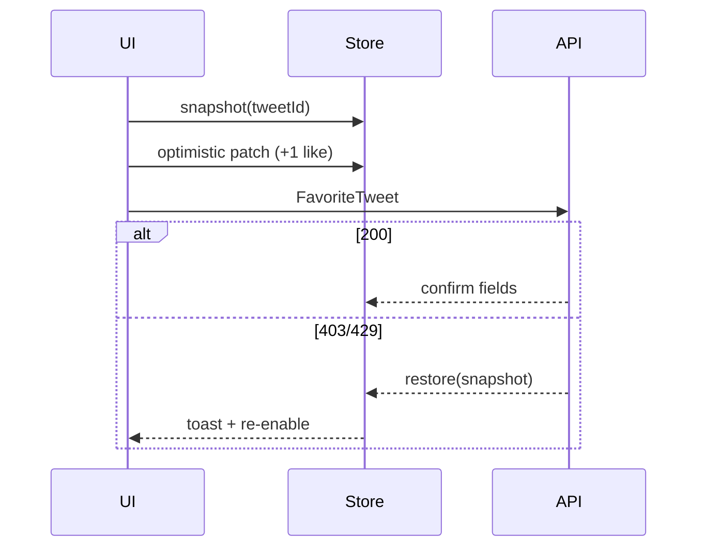
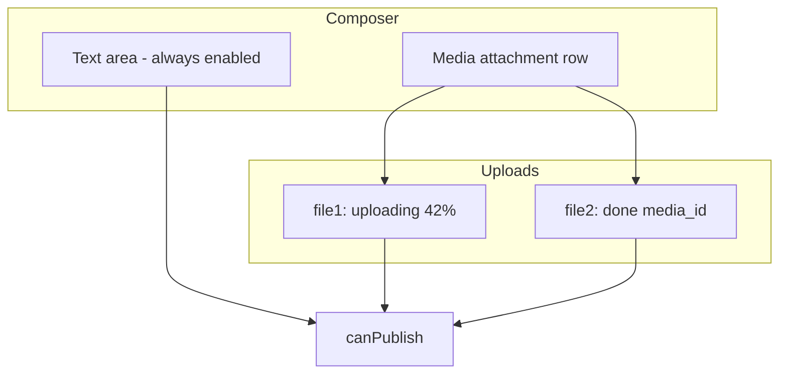

# Section 2 — Compose, Posts & Social Actions (Answers)

Interview-depth answers for Twitter/X compose, optimistic publish, social actions, threads, offline replay, and cross-surface consistency. Covers intent modeling, idempotent publish, rollback on 403/429, thread rendering, validation gates, and edit/delete propagation.

---

## Core

### How do you structure the compose flow for text, mentions, hashtags, polls, scheduled posts, and reply vs quote vs repost?

**Problem framing:** Compose is not one form — it is a **family of publish intents** (plain post, reply, quote, poll, schedule, community) sharing chrome (text area, media row, audience picker) but differing in API variables, validation rules, and where the result appears. Interviewers want a single shell with explicit intent, not six separate pages.

**Approach:** One **composer shell** driven by an **intent object** that maps to mutation variables and UI affordances.

```mermaid
flowchart LR
  subgraph Intent["ComposeIntent"]
    mode[mode: post | reply | quote | repost]
    parent[parentTweetId?]
    quoted[quotedTweetId?]
    schedule[scheduledAt?]
    poll[pollDraft?]
  end
  Intent --> UI[ComposerShell]
  Intent --> Vars[CreateTweet variables]
  UI --> Validate[Validation gate]
  Vars --> API[POST CreateTweet / ScheduleTweet]
```

1. **Intent as source of truth** — Per account, store:
   ```ts
   type ComposeIntent = {
     mode: 'post' | 'reply' | 'quote' | 'repost_only';
     parentTweetId?: string;      // reply target
     quotedTweetId?: string;      // quote embed
     conversationId?: string;     // thread context
     text: string;
     entities: MentionEntity[];   // ranges for @user
     hashtags: string[];
     mediaLocalIds: string[];
     pollDraft?: { options: string[]; durationMinutes: number };
     scheduledAt?: string;          // ISO — schedule mutation
     replyAudience?: 'everyone' | 'mentioned' | 'followers';
   };
   ```
   Key: `composeByAccountId[accountId]` — isolated per logged-in account.

2. **Mode-specific UI without mode-specific components** — Reply: show parent tweet header + "Replying to @handle". Quote: embed quoted card above text. Repost-only: minimal confirm sheet (no text) → `CreateRetweet`. Poll: options UI replaces media row (poll XOR media rule). Schedule: datetime picker sets `scheduledAt` and calls schedule endpoint.

3. **Mentions/hashtags** — Typeahead debounced user search; insert at caret preserving `display_text_range`-compatible offsets. Hashtag detection on `#` with optional trend hints — client-side parse mirrors server tokenizer for length.

4. **Mutation mapping** — One `CreateTweet` (or GraphQL equivalent) with variables branch:
   | Mode | Key variables |
   |------|----------------|
   | post | `tweet_text`, `media`, `poll` |
   | reply | + `reply.in_reply_to_tweet_id`, `exclude_reply_user_ids` |
   | quote | + `attachment_url` / quoted tweet id |
   | schedule | `scheduled_at` instead of immediate publish |

5. **Navigation entry points** — Global compose button → `mode: post`. Reply icon on tweet → prefill `parentTweetId`. Repost menu → quote vs repost-only branch. Deep link `/compose?in_reply_to=…` hydrates intent on mount.

**Tradeoffs:** Single shell reduces duplication but grows conditional UI — use sub-panels (PollEditor, SchedulePicker) lazy-loaded. Separate composers per mode are simpler locally but diverge validation. **Pitfall:** Treating repost as text compose — wrong mutation and count semantics. **Pitfall:** Losing intent on route change without persisting draft key `reply:{tweetId}`.

---

### How do you implement optimistic posting — show the tweet immediately, then reconcile with server-assigned ID and timestamps?

**Problem framing:** Users expect **instant feedback** after Post — waiting 500ms–2s for round-trip feels broken. The client must show a tweet immediately, then **swap temp identity for server `id_str`** without list flicker, duplicate rows, or virtualizer remounts.

**Approach:** **Optimistic normalized insert** with pending id, in-place reconcile on success, failed state on error.

```text
Send tap
  → generate client_tweet_id
  → insert tweetsById[pending:{uuid}] with _optimistic: pending
  → prepend entryId to relevant connections (home if self, thread, profile)
  → mutation in flight
  → success: patch pendingId → id_str, server created_at, clear _optimistic
  → failure: _optimistic.status = failed, offer Retry/Discard
```

1. **Temp identity** — Optimistic id `pending:{client_tweet_id}` until response returns `legacy.id_str` (Snowflake string).

2. **Normalized tweet node:**
   ```ts
   tweetsById.set(pendingId, {
     rest_id: pendingId,
     legacy: {
       full_text: draftText,
       created_at: new Date().toISOString(), // client estimate
       favorite_count: 0,
       retweet_count: 0,
       reply_count: 0,
     },
     core: { user_results: { result: viewerUser } },
     _optimistic: { status: 'pending', client_tweet_id },
   });
   ```

3. **Connection prepend** — Relay `@prependEdge` pattern on `homeTimeline`, `userTweets`, `threadReplies:{conversationId}` — same virtualizer slot, update `entryId` on reconcile.

4. **Reconcile in place** — On success, **mutate same store entry**: change key `pending:{uuid}` → `id_str` with a single `replaceId` helper that updates all connection arrays referencing the old id. Do not delete+insert (virtualizer key churn, scroll jump).

5. **Timestamps** — Show client time until server `created_at` arrives; optional subtle "Posting…" on pending row. After reconcile, use server time for sort index.

6. **Libraries** — Relay `optimisticUpdater` + `updater`; TanStack Query `onMutate` snapshot + `onSettled`; Apollo `optimisticResponse`.

**Tradeoffs:** Optimistic tweet may appear in wrong order if server rejects — remove on failure. Showing on home Following before fan-out completes is product choice (usually only profile/thread until event). **Pitfall:** New list item with new React key on reconcile — breaks scroll. **Pitfall:** Two rows if retry without collapsing same `client_tweet_id`.

---

### How do you generate and persist a `client_tweet_id` (or equivalent) for idempotent publish on retry?

**Problem framing:** Mobile networks drop mid-request; users tap Retry. Without a stable client-generated id, the server creates **duplicate tweets** on replay. Interviewers expect UUID at intent creation, not at each HTTP attempt.

**Approach:** Generate **`client_tweet_id` once per user intent**; send on every attempt; server dedupes `(user_id, client_tweet_id)` within a TTL window.

1. **Generation** — `crypto.randomUUID()` (or v4) at **first Post tap** (or draft promotion to sending), stored on the optimistic row and outbound queue record.

2. **Persistence layers:**
   | Layer | Holds |
   |-------|--------|
   | Optimistic tweet `_optimistic.client_tweet_id` | In-memory store |
   | IndexedDB `outbound_tweets/{client_tweet_id}` | Offline/retry queue |
   | Optional `sessionStorage` | Crash recovery hint |

3. **API contract:**
   ```json
   POST CreateTweet
   { "tweet_text": "…", "client_tweet_id": "550e8400-e29b-41d4-a716-446655440000", … }
   ```
   Server: first request creates tweet; replay within ~5–15 min returns **same** `id_str` (201 vs 200 acceptable).

4. **Client merge on replay response** — If `tweetsById` already has `pending:{client_tweet_id}` and response returns `id_str`, run `replaceId` once. If two entries exist, dedupe by `client_tweet_id` field on server body.

5. **Never regenerate on retry** — Retry button reuses same payload + same `client_tweet_id`. New UUID only when user explicitly "Discard and write new post".

**Tradeoffs:** Server must implement dedup store — client-only UUID without server support is insufficient for true idempotency. Long TTL increases storage; short TTL risks duplicate on delayed retry. **Pitfall:** New UUID per HTTP retry — classic duplicate tweet bug. **Pitfall:** Id only in memory — refresh loses dedup unless IndexedDB queue restored.

---

### How do you roll back optimistic like, repost, and bookmark actions when the API returns 403 or rate-limit errors?

**Problem framing:** Social actions feel instant via optimistic toggles on `legacy.favorited`, counts, and timeline edges. **403** (protected tweet, blocked user), **401**, and **429** require **deterministic rollback** and honest UX — not silent wrong state.

**Approach:** Snapshot-before-mutate, patch normalized tweet (and connections for repost), revert on error with reason-specific toasts.



1. **Snapshot** — Before mutation: `const prev = clone(tweetsById[tweetId])` including `legacy.favorite_count`, `favorited`, `retweeted`, `bookmark_count`, viewer flags.

2. **Optimistic patch** — Like: `favorited=true`, `favorite_count++`. Repost: `retweeted=true`, `retweet_count++`, optional **prepend retweet edge** on home. Bookmark: `bookmarked=true` (often no public count).

3. **Rollback** — `onError`: restore `prev`; `favorite_count = Math.max(0, n-1)`; icons revert. **429**: do not leave optimistic on — show "Try again in Ns" from `Retry-After`. **403**: "You can't like this post" — no retry loop.

4. **In-flight guard** — `mutationInFlight[`${tweetId}:like`]` ignores double-tap until settled.

5. **Multi-tab** — `BroadcastChannel('tweet-store')` or `storage` event syncs canonical `tweetsById[id]` after successful mutation; rollback is local-first then broadcast.

**Tradeoffs:** Optimistic repost edge prepend is heavier to roll back than boolean toggle — snapshot must include connection ids. Debouncing likes loses snappy feel — prefer in-flight lock. **Pitfall:** Incrementing count without rollback on 429 — user distrust. **Pitfall:** Only rolling back button state, not feed embeds showing wrong count.

---

### How do you render a thread — collapsed "Show this thread", linear reply chain, and "Show more replies" pagination?

**Problem framing:** Threads span **home preview** (collapsed module), **detail view** (focal tweet + ancestors + replies), and **paginated reply subtrees**. Each uses URT-style entries, not a flat array — wrong modeling breaks "Show more replies" and optimistic reply placement.

**Approach:** Model threads as **conversation_id-scoped entry lists** with module collapse state and cursor pagination on the reply connection.

1. **Data model** — Every reply is a Tweet with `legacy.conversation_id_str`, `in_reply_to_status_id_str`. Focal tweet in detail: `TweetDetail` with `focalTweetId`.

2. **Home collapsed module** — `TimelineModule` / `VerticalConversation` shows 2–3 tweets + **"Show this thread"** → navigates to detail route with `conversationId` + `focalTweetId`. State: `collapsedModuleIds` — don't fetch full reply tree on home.

3. **Detail layout:**
   ```text
   [ancestors…] → focal tweet (pinned context)
   [reply chain sorted by sortIndex / id]
   [Show more replies] → fetchNextPage(bottomCursor)
   ```

4. **State key:**
   ```ts
   threadsByConversationId[conversationId] = {
     focalTweetId,
     entryIds: string[],
     cursors: { top?: string; bottom?: string },
     expandedModule: boolean,
   };
   ```

5. **"Show more replies"** — Cursor-based `cursorType: 'Bottom'` on reply subtree — never offset. Dedupe by `tweet.id` when prepending optimistic reply.

6. **Self-thread** — When server returns author chain as single module, render linearly without extra pagination until reply count exceeds threshold.

7. **Virtualization** — Detail pages often &lt;50 replies — virtualize when reply count high; dynamic heights for media cards.

**Tradeoffs:** Fetching full thread on home scroll wastes bandwidth — collapse is mandatory. Linear reply sort vs "Top replies" ranking changes pagination cursor shape — follow API contract. **Pitfall:** Offset pagination on replies — gaps when new replies arrive. **Pitfall:** Optimistic reply inserted at wrong sort position — use parent id + conversation id, not append-only to end if ranked.

---

### How do you enforce character limits, URL counting, and attachment rules before enabling the Post button?

**Problem framing:** Twitter counts **weighted characters** (URLs as ~23 chars via t.co), **grapheme clusters** (emoji), and **mutually exclusive attachments** (poll vs media). Enabling Post on invalid drafts causes avoidable API errors and bad UX.

**Approach:** Shared **validation pipeline** runs on every keystroke/media change; Post button bound to `canPublish(intent)`.

1. **Character counting** — Use grapheme-aware counter (`Intl.Segmenter` or `grapheme-splitter`); add **weighted URL length** from parsed entities (`https://…` → 23 each per Twitter rules, or conservative client estimate). Display `remaining = limit - weightedCount`.

2. **Entity parsing** — Mirror server: extract URLs, mentions, hashtags from text ranges; recalc on paste and mention insert.

3. **Attachment rules matrix:**

   | Rule | Gate |
   |------|------|
   | Poll + media | Mutually exclusive — disable one |
   | Max 4 images / 1 video | Block add media |
   | GIF size/duration | Pre-validate from file metadata |
   | Alt text required (a11y product) | Warn or block video post |
   | Empty text + no media | Disable Post |
   | Scheduled in past | Disable + error |

4. **Media upload state** — Post disabled while **required** uploads `in_progress` or `failed`; allow text edit during upload (see Deep question on non-blocking composer).

5. **Server preflight (optional)** — Debounced `ValidateTweet` for edge cases; client rules handle 95% for instant feedback.

```ts
function canPublish(intent: ComposeIntent, uploads: MediaUpload[]): boolean {
  if (weightedCount(intent.text) > LIMIT) return false;
  if (intent.pollDraft && intent.mediaLocalIds.length) return false;
  if (uploads.some(u => u.status === 'uploading' || u.status === 'error')) return false;
  if (!intent.text.trim() && !intent.mediaLocalIds.length && !intent.pollDraft) return false;
  return true;
}
```

**Tradeoffs:** Conservative client URL counting may disagree with server by 1–2 chars — show buffer at 280-5. Server-only validation adds latency — use for schedule/poll edge cases. **Pitfall:** `string.length` for emoji — wrong limit. **Pitfall:** Enabling Post during upload → publish mutation without `media_id`.

---

## Deep

### How do you queue failed publishes offline and replay them on reconnect without duplicate posts?

**Problem framing:** Users compose on flaky networks; publish fails after optimistic UI or before server ack. Queue must **survive refresh**, **flush FIFO**, and **not duplicate** on replay — ties directly to `client_tweet_id` idempotency.

**Approach:** **IndexedDB outbound queue** + optimistic row + reconnect flush with same idempotency key.

```text
Post tapped (offline or timeout)
  → client_tweet_id assigned
  → optimistic pending row + outbound_tweets record
  → status: pending
navigator.onLine / online event
  → flush queue head-first per accountId
  → CreateTweet(same client_tweet_id)
  → reconcile or mark failed with backoff
```

1. **Queue record:**
   ```ts
   type OutboundTweet = {
     client_tweet_id: string;
     accountId: string;
     payload: CreateTweetVariables;
     createdAt: number;
     status: 'pending' | 'sending' | 'failed';
     retryCount: number;
   };
   // IndexedDB: outbound_tweets/{client_tweet_id}
   ```

2. **Ordering** — Global FIFO by `createdAt`; **reply chains**: if B replies to A, sort A before B even if B tapped first (dependency order).

3. **Media** — Queue tweet only after uploads complete, **or** queue with `localMediaRefs` and run upload-first on flush before `CreateTweet`.

4. **Flush policy** — One in-flight send per account; exponential backoff on 5xx/429; respect `Retry-After`. On success, remove queue entry + reconcile store. On idempotent replay response, treat as success.

5. **Account switch** — Filter `accountId`; never flush with wrong session cookies.

6. **Boot hydrate** — On app load, read queue + restore optimistic `pending:*` rows into normalized store.

**Tradeoffs:** FIFO delays urgent reply behind large failed video post — optional priority lane for text-only. Queue size cap with user prompt to discard oldest drafts. **Pitfall:** New `client_tweet_id` on flush — duplicates. **Pitfall:** In-memory queue only — lost on kill.

---

### How do you store per-account compose drafts in IndexedDB with eviction when storage pressure hits?

**Problem framing:** Long-form drafts, multi-image attachments, and multi-account switching require **durable drafts** without blowing mobile storage quotas or leaking drafts across accounts.

**Approach:** Namespaced IndexedDB store, debounced writes, LRU eviction driven by `navigator.storage.estimate()`.

1. **Schema** — `drafts/{accountId}/{draftKey}` where `draftKey` = `home` | `reply:{tweetId}` | `quote:{tweetId}`:
   ```ts
   type DraftRecord = {
     intent: ComposeIntent;
     savedAt: number;
     approxBytes: number; // text + media refs
   };
   ```

2. **Debounced persist** — 300–500ms after keystroke; immediate flush on `visibilitychange` hidden or composer blur.

3. **Media in drafts** — Store **local blob refs** or file handles + thumbnail metadata, not full binary if &gt;N MB — re-prompt pick on restore if blob evicted.

4. **Eviction** — On `quota` pressure or `estimate().usage / quota &gt; 0.85`:
   - Drop **oldest** drafts per account (LRU by `savedAt`)
   - Never evict `outbound_tweets` queue before successful send
   - Cap drafts per account (e.g. 20 keys)
   - Strip large media previews first, keep text

5. **Account isolation** — Keys always prefix `accountId`; on logout, optional `clearDrafts(accountId)` per privacy policy.

**Tradeoffs:** IndexedDB async — show "Draft saved" subtly, not blocking typing. localStorage too small for media metadata — IDB required. **Pitfall:** Single global draft key — cross-account leak. **Pitfall:** Evicting unsent outbound queue — data loss.

---

### How do you handle "Post" tapped twice — disable button, in-flight lock, or server idempotency key?

**Problem framing:** Double-tap Post is common on mobile. UI disable alone fails on race conditions; server idempotency alone feels slow without disable. Senior answer layers **UI lock + in-flight map + `client_tweet_id`**.

**Approach:** Defense in depth — all three, with single intent id.

| Layer | Mechanism |
|-------|-----------|
| UI | Disable Post + spinner on first tap; `aria-busy` |
| Client lock | `inFlightByDraftKey[draftKey] = true` until settle |
| Idempotency | Same `client_tweet_id` on accidental second HTTP request |

1. **First tap** — Set lock, generate `client_tweet_id` if not exists, fire mutation once.

2. **Second tap while in-flight** — Ignored at handler; button already disabled.

3. **Rapid double-fire before disable paints** — Mutex in `publish()` — if `inFlight`, return early.

4. **Server** — Second request with same `client_tweet_id` returns original tweet — client merges, does not second prepend.

5. **Release lock** — On success, error, or unrecoverable failure (user must Discard to retry with new id).

**Tradeoffs:** Disable-only frustrates if request hangs — add timeout → failed state with Retry. Idempotency without lock still creates double optimistic rows — lock prevents duplicate UI. **Pitfall:** Release lock before reconcile — triple tap window. **Pitfall:** New `client_tweet_id` per tap — server dedup useless.

---

### How do you show upload-in-progress for media attached to a draft without blocking the text composer?

**Problem framing:** Video upload may take minutes; users still edit text, add alt text, and toggle poll. Blocking the whole composer on upload kills throughput; allowing Post mid-upload causes broken publishes.

**Approach:** **Parallel upload pipeline** with per-file state on the draft row; composer text remains editable; Post gated on upload completion.



1. **Per-file state machine** — `idle → uploading → processing → ready | error` with `media_id` on ready.

2. **UI** — Thumbnail strip with progress ring, cancel, retry; **text area never disabled** by upload.

3. **Background upload** — Start on file pick (before Post); resumable/chunked protocol (INIT/APPEND/FINALIZE) where supported.

4. **Post gate** — `canPublish` false while any attachment `uploading` or `error`; true when all `ready` or no media.

5. **Post tap with slow upload** — Either wait with aggregate progress on Post button, or split: "Post text now" product-rare — default is wait.

6. **Cancel upload** — Remove `media_id` from draft variables; abort XHR/upload worker.

**Tradeoffs:** Early upload wastes bandwidth if user discards draft — acceptable vs Post-time stall. Parallel uploads max 2–4 concurrent to avoid radio contention. **Pitfall:** Disabling entire composer during upload. **Pitfall:** Publishing without `media_id` while bar shows 99%.

---

### How do you propagate `tweet_deleted` and `tweet_edited` events to every surface showing that tweet (feed, profile, notifications)?

**Problem framing:** Tweets appear in home, profile, search, notifications, threads, quote embeds, and DMs preview. Patching one React component leaves **ghost tweets** elsewhere. Senior answer: **normalized single source of truth** + global event bus.

**Approach:** `tweetsById[id_str]` canonical; all surfaces hold **references** (entry ids or tweet id); edit/delete patch once, fan-out via store subscribers.

1. **Edit** — `EditTweet` response or `tweet.edited` event:
   ```ts
   patchTweet(id, {
     legacy: { full_text, edited_timestamp },
     edit_control: { edit_tweet_ids, editable_until_msecs },
   });
   ```
   Quote embeds nest `quoted_status_result` — recursive patch or tombstone nested node.

2. **Delete strategies:**
   | Strategy | When |
   |----------|------|
   | Hard remove | Remove `entryId` from all connections — tweet vanishes from feeds |
   | Tombstone | `TweetUnavailable` / "Post deleted" — keep slot in threads with replies |

3. **Store APIs** — Relay mutation `updater` on `Tweet` record selector; Apollo `cache.modify` + `cache.evict`; TanStack `setQueriesData` for `['tweet', id]` + invalidate list queries if needed.

4. **Realtime** — WebSocket/bus `tweet.deleted` / `tweet.edited` → same `patchTweet` / `removeEdge` path. Handle **out-of-order**: delete ack before create ack → drop optimistic `pending:*`.

5. **Notifications** — Prefer notification → `tweetId` ref; render live from `tweetsById`. If denormalized snippet only, match `targetTweetId` and update snippet text or remove row.

6. **Multi-tab** — Broadcast patch after local mutation success.

```text
Event tweet.edited(id)
  → tweetsById[id] = merge(...)
  → all selectors re-render (feed cards, profile, thread, quote depth-1)
```

**Tradeoffs:** Tombstones preserve thread coherence but clutter UI — product rules for "parent deleted". Full cache invalidation is simpler but janky — surgical patch preferred. **Pitfall:** Deleting only from current route's local state. **Pitfall:** Edit changes id — breaks keys; standard edit keeps same `id_str`.

---

### How do you implement "Undo repost" within the grace window while keeping counts consistent across tabs?

**Problem framing:** After repost, clients show **Undo** toast (5–30s). User expects retweet to vanish and counts to match reality across tabs — while optimistic repost may have prepended a timeline edge.

**Approach:** Time-boxed undo calls `DeleteRetweet`; optimistic repost snapshot includes edge ids; undo reverts store and removes edge; multi-tab sync.

1. **Repost success path** — Optimistic: `retweeted=true`, `retweet_count++`, prepend `entryId: retweet-{viewerId}-{tweetId}` to home connection. Snapshot for undo.

2. **Undo toast** — `setTimeout(graceMs)` or user tap Undo → `DeleteRetweet(tweet_id)`:
   - Revert `retweeted`, decrement count (floor 0)
   - `@deleteEdge` by retweet entry id
   - Dismiss toast

3. **In-flight repost + Undo** — If Undo before CreateRetweet ack: queue undo after ack, or cancel if API supports abort (usually queue DeleteRetweet).

4. **Grace expired** — Toast gone; user must use standard unretweet action on tweet menu.

5. **Multi-tab** — Successful DeleteRetweet broadcasts patch; other tabs remove edge and fix count without separate undo UI.

6. **Count consistency** — Never decrement below 0; prefer server count on reconcile over client `-1` drift; coalesce WebSocket count deltas 100–300ms to avoid flicker.

| Scenario | Behavior |
|----------|----------|
| Undo in grace | DeleteRetweet + remove edge |
| Undo after grace | Menu unretweet only |
| 429 on DeleteRetweet | Toast error; retweeted stays true |
| Tab B idle | BroadcastChannel sync |

**Tradeoffs:** Prepended retweet edge on home may be wrong if product hides self-retweets — follow API. Long grace increases mistaken undo — 5–10s typical. **Pitfall:** Undo only hides toast, not edge. **Pitfall:** Count -1 without checking server retweet_count — negative display.

---

*Next section: [03 — Profiles, Identity & Graph UI](./03-profiles-identity-graph-ui.md)*
