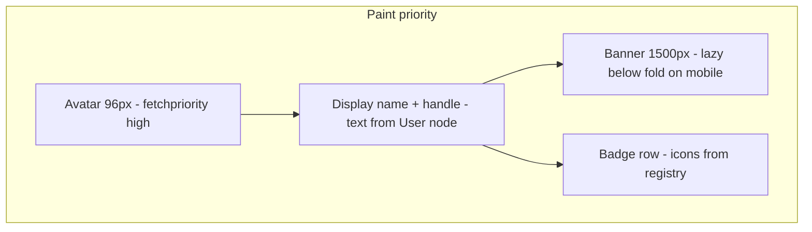
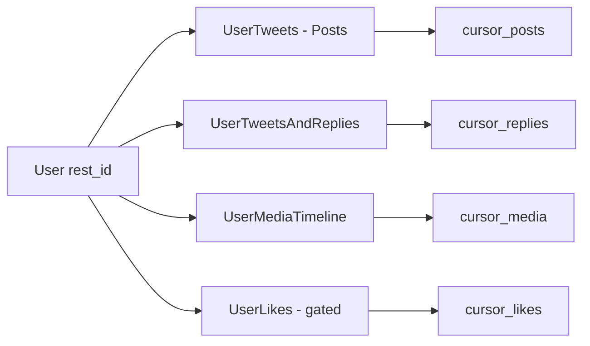
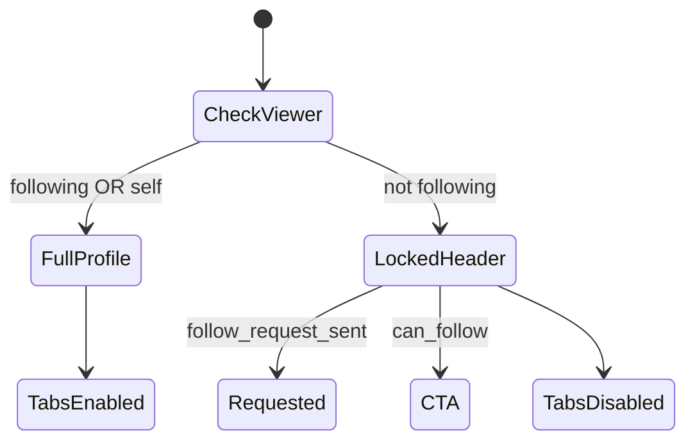
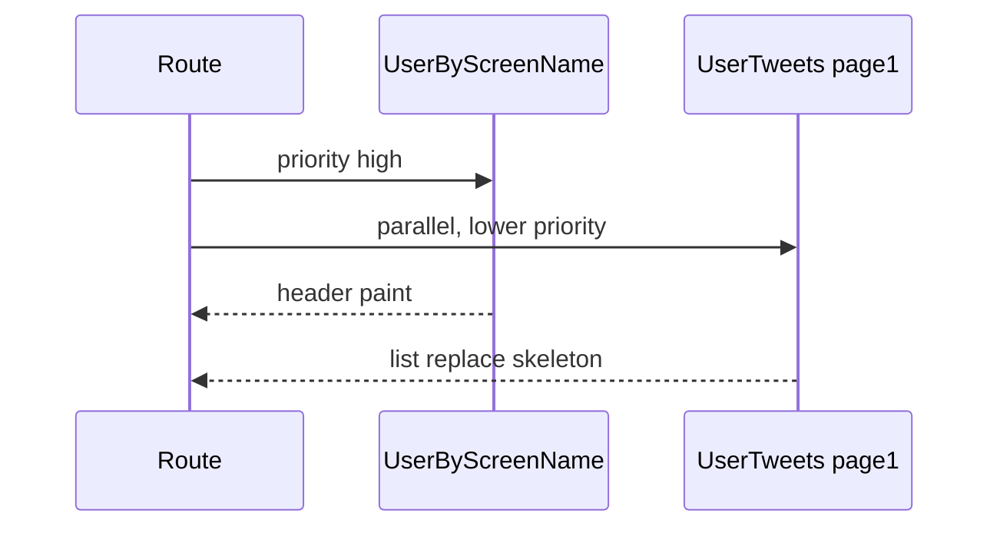

# Section 3 — Profiles, Identity & Graph UI (Answers)

Interview-depth answers for Twitter/X profile surfaces: header layout and image priorities, tabbed timelines with independent cursors, live counters, protected-account gating, status deep-links, block/mute enforcement, multi-account isolation, split metadata/timeline cache, blocked/deleted UX, sensitive media grids, badge registries, and mid-session identity invalidation. Covers Relay normalized store, `id_str`, GraphQL timeline connections, and virtualized tab feeds.

---

## Core

### How do you layout profile header (avatar, banner, bio, verified badge, subscription labels) with responsive image priorities?

**Problem framing:** The profile header is **above-the-fold identity** — avatar, banner, bio, verification, and subscription labels must paint fast on 3G while not blocking tab timelines. Interviewers want **responsive image priority** (what loads first, what can lazy-load) and layout stability when metadata arrives before high-res assets.

**Approach:** Split header into **static shell + progressive media tiers**; prioritize LCP (avatar) over decorative banner; badge row driven by a typed `labels[]` model, not inline conditionals per product.



1. **Layout regions** — Sticky sub-header (back, overflow menu) + **banner band** (aspect ~3:1 desktop, shorter crop mobile) + **avatar overlap** (negative margin into banner) + **identity column** (name, `@screen_name`, bio, location/link, join date) + **action row** (Follow / Subscribe / Message) + **stats row** (following, followers, posts) + **pinned tweet slot** (optional, own query or inline on `User`).

2. **Responsive image contract** — CDN variants via `profile_image_url_https` / `profile_banner_url` with width params:
   | Asset | Mobile | Desktop | `fetchpriority` |
   |-------|--------|---------|-----------------|
   | Avatar | 96–128px | 128–200px | `high` (LCP candidate) |
   | Banner | 600w lazy | 1500w | `low` or lazy when below fold |
   | Badge icons | 16–20px SVG | same | inline sprite / icon font |

3. **Placeholder strategy** — Avatar: default egg silhouette or **blurhash** from `profile_image_extensions` metadata. Banner: solid `profile_banner_color` from API until image `onLoad` — reserve `min-height` to prevent CLS when banner pops in.

4. **Verified + subscription labels** — Render from `verification_info` / `affiliates_highlighted_label` / `creator_subscriptions` GraphQL fields as **badge descriptors** `{ type, label, iconKey, tooltip, href? }` mapped through a registry (see Deep question 11). Stack horizontally with truncation: `+N` overflow popover on narrow widths.

5. **Bio and entities** — Parse `description` with same entity tokenizer as tweets (`urls`, `user_mentions`) — links open in-app browser. `possibly_sensitive` on user does not change header layout; it affects media tabs.

6. **Relay pattern** — `UserByScreenName` or `UserByRestId` fragment on header container; child tabs subscribe to `User` record only for counts/actions, not re-fetch header on pagination.

```tsx
// Skeleton: text paints from store; images layered
<ProfileHeader user={user}>
  <Banner src={bannerUrl} loading="lazy" decoding="async" />
  <Avatar src={avatarUrl} fetchPriority="high" width={128} height={128} />
  <BadgeRow labels={resolveUserLabels(user)} />
</ProfileHeader>
```

**Tradeoffs:** High-priority banner on desktop competes with avatar for bandwidth — mobile should lazy banner. Inline SVG badges per type explode bundle size — central registry wins. **Pitfall:** No reserved banner height — layout jumps when image loads. **Pitfall:** Hard-coding blue check vs gold check in JSX — product adds verification tiers constantly.

---

### How do you paginate a user's tweets, replies, media, and likes as separate tabs with independent cursors?

**Problem framing:** Profile is **four+ timelines** (Posts, Replies, Media, Likes) with different server filters and eligibility (likes may be private). Users switch tabs mid-scroll and expect **independent scroll position and cursors** — sharing one list causes wrong content and broken `fetchNextPage`.

**Approach:** Each tab is a **separate GraphQL connection** (or REST resource) with its own cursor chain, cache key, and virtualized scroller instance; normalized tweets dedupe in `tweetsById`.



1. **Tab → operation mapping** — Typical GraphQL (names vary by version):
   | Tab | Filter | Connection field |
   |-----|--------|------------------|
   | Posts | excludes replies & retweets | `user_timeline` / `UserTweets` |
   | Replies | conversation entries | `UserTweetsAndReplies` |
   | Media | `has:media` | `UserMediaTimeline` |
   | Likes | liked tweets | `UserLikes` (viewer + privacy) |

2. **Independent cache keys** — React Query / Relay:
   ```ts
   ['profile', userId, 'tab', 'posts', cursorChain]
   ['profile', userId, 'tab', 'replies', cursorChain]
   ```
   Never paginate with one `profileTimeline` array filtered client-side — cursors are incompatible.

3. **Cursor shape** — Opaque `cursor` / `bottom_cursor` from `TimelineTimelineCursor`; entries are `TimelineTimelineItem` with `tweet_results` or `cursor-bottom`. Store `pageInfo: { end_cursor, has_next_page }` per tab.

4. **Virtualized list per tab** — Mount scroller only for **active tab** (or keep mounted hidden with `display:none` to preserve scroll — memory tradeoff). Item key: `entryId` or `tweet-{id_str}` — stable across pages.

5. **Prefetch on tab hover** — `queryClient.prefetchInfiniteQuery` for target tab's first page; cap prefetches to avoid four parallel megabyte responses on profile land.

6. **Pinned tweet** — Fetched on `User` node or first Posts page `pinned_tweet_ids`; inject **above** connection as non-paginated slot (not duplicated in page 1 if server already excludes).

7. **Relay** — `@refetchable` connections on tab containers; `fetchMore({ cursor: endCursor })` scoped to that connection record only.

**Tradeoffs:** Four mounted virtualizers preserve scroll but 4× memory on heavy profiles — unmount inactive tabs and snapshot `anchorTweetId` + offset. Single scroller with tab swap is lighter but scroll restore is harder. **Pitfall:** Reusing Posts cursor for Replies — API returns 400 or wrong slice. **Pitfall:** Likes tab visible when `protected` and not approved — leaks intent; gate tab (see protected accounts).

---

### How do you show follower/following counts that update in real time without flashing stale numbers?

**Problem framing:** `followers_count` and `friends_count` change on follow/unfollow, block, spam purge, and bot removal. Naive refetch shows **0 → 1.2M → 1.2M+1** flicker; optimistic ±1 without reconciliation drifts from truth.

**Approach:** **Monotonic display layer** with versioned counter patches from normalized `User` node; coalesce bursts; reconcile on profile refetch without downgrading below last optimistic value until server ack.

1. **Canonical store field** — `legacy.followers_count`, `legacy.friends_count` (or `relationship_counts`) on `usersById[rest_id]`. All surfaces (header, follow sheet, search cards) read one selector.

2. **Patch paths** — After `FriendshipsCreate` / `FriendshipsDestroy` success:
   ```ts
   patchUser(userId, (u) => ({
     legacy: {
       ...u.legacy,
       followers_count: u.legacy.followers_count + (isFollow ? 1 : -1),
     },
     _counterPending: true,
   }));
   ```
   On **viewed profile** when someone follows *you*, WebSocket `follow` event increments your follower count if profile is self.

3. **Anti-flicker rules** — Display component uses `displayCount = max(lastRendered, serverCount)` while `_counterPending` OR within 2s of navigation — prevents brief stale lower number from cache hydration. After TTL, trust server.

4. **Coalesce realtime** — Buffer `counter.updated` events 100–300ms; apply single `+delta` per user id per frame (batch 12 follows in a row → one re-render).

5. **Formatting** — `1.2M` abbreviated only in UI layer; store keeps integer. Transition: prefer **opacity pulse** on digit change over width-changing layout (`tabular-nums` font).

6. **Multi-tab** — `BroadcastChannel('user-patch')` or `localStorage` event so follow in modal updates header count on profile route.

| Source | Update |
|--------|--------|
| Optimistic follow | ±1 on target `followers_count`, viewer `friends_count` |
| WS / SSE | delta or full count replace |
| Profile refetch | merge if `server.version > local.version` |

**Tradeoffs:** `max()` heuristic can show inflated count for seconds if server was wrong — short window only. Showing exact count for accounts >10k vs rounded — product; store still exact. **Pitfall:** Local state on header component only — search suggestions show old count. **Pitfall:** Refetch replacing entire User with cached stale fragment — use `merge: true` in Relay.

---

### How do you handle protected accounts — gating timeline tabs, follow request CTA, and error states?

**Problem framing:** Protected (`protected`: true) users hide tweets from non-followers. The client must **not fetch or render** timeline connections without approval, show **Follow request sent** states, and map 403/404 to clear UX without leaking tweet snippets in cache.

**Approach:** Gate on **`relationship`: following | follow_request_sent | none** from `User` + `Viewer`; disable timeline queries until `following`; distinct empty states per relationship.



1. **Header always (mostly)** — Avatar, name, bio (if policy allows), follower counts may be hidden or approximate per API — render what `UserByScreenName` returns for non-followers. **No tweet IDs** in store for locked timelines.

2. **Tab gating** — `enabled: relationship.following || isSelf` on infinite queries. Inactive tabs show placeholder: "These posts are protected" + Follow CTA, not empty virtualized list (avoids accidental prefetch).

3. **Follow request CTA** — `CreateFriendship` with `follow_request=true` → optimistic `relationship.follow_request_sent`; button "Requested" disabled. Accept/decline only on notifications, not profile.

4. **Error mapping** —
   | Response | UX |
   |----------|-----|
   | 403 on timeline | Locked state (not generic error) |
   | 404 user | Account doesn't exist |
   | 401 | Login prompt |
   | GraphQL `TimelineDenied` | Same as locked — no retry loop |

5. **Cache hygiene** — Do not write timeline edges to normalized store on denied response. If a prior session cached tweets then user protected account, invalidate `['profile', userId, 'tab', *]` on `User.protected` flip.

6. **Likes tab** — Extra strict: hide tab or show "Not available" for non-followers even when Posts might leak via stale cache — server is source of truth.

**Tradeoffs:** Showing follower count to non-followers is product/policy — some apps hide. Aggressive no-prefetch feels slower after follow approve — refetch all tabs on `following` transition. **Pitfall:** Tab still fetching in background when locked — network leak + cache leak. **Pitfall:** Showing "No tweets yet" instead of "Protected" — wrong mental model.

---

### How do you deep-link to a specific tweet on a profile (`/status/:id`) and scroll it into view inside the tab feed?

**Problem framing:** URLs like `/@handle/status/1234567890` must open the **correct tab** (Posts vs Replies), hydrate the tweet if not in loaded pages, and **scroll without layout thrash** in a virtualized list that may not contain the target index yet.

**Approach:** Route resolves `tweetId` (`id_str`) → determine tab → **anchor fetch** if missing → virtualizer `scrollToIndex` with stable key after pages merge.

1. **Route split** — `/:screen_name/status/:tweetId` loads profile shell + **status overlay** or inline highlight. Parse `tweetId` as string (Snowflake `id_str`).

2. **Tab selection** — Prefetch tweet metadata (`TweetDetail` / `TweetResultByRestId`):
   - If `in_reply_to_user_id` matches profile user → **Replies** tab
   - Else → **Posts** tab
   - Media-only → **Media** if applicable

3. **Hydrate into connection** — If `tweetId` not in loaded `entryIds`:
   - Fetch **context page** API (`?referenced_tweet_id=`) or single-tweet inject endpoint
   - Insert edge at correct chronological index in normalized connection (or prepend + "View newer" if older than loaded window)

4. **Scroll strategy** — Virtualizer (react-virtual / Virtuoso):
   ```ts
   await ensureTweetInConnection(tweetId);
   const index = entryIds.indexOf(`tweet-${tweetId}`);
   virtualizer.scrollToIndex(index, { align: 'center', behavior: 'auto' });
   ```
   Retry after `measureElement` if heights async (images). Highlight ring 2s (`aria-current`).

5. **Deep link + pagination** — If tweet is page 40, either load pages until found (bad) or **jump cursor** API that returns cursor anchored at tweet — preferred at scale.

6. **Modal vs inline** — Mobile often opens **TweetDetail** sheet on top of profile; desktop may inline-scroll. Both share `tweetsById[tweetId]`.

**Tradeoffs:** Loading all pages until hit is O(n) — must use anchor API. Opening detail modal without scrolling list is simpler but interview expects tab scroll. **Pitfall:** `scrollToIndex` before tweet row mounted — scroll to wrong position. **Pitfall:** Numeric JS precision on large `id_str` — always string keys.

---

### How do you reflect block, mute, and restrict actions immediately in feeds, search, and suggestions?

**Problem framing:** Block/mute/restrict are **graph edges** that must apply everywhere simultaneously — home, profile, search, typeahead, notifications, DMs list. Updating only the profile menu leaves ghost content and is a trust bug.

**Approach:** Optimistic **relationship patch** on `User` + global **eligibility filter** at read time; purge or tombstone content from blocked `userId` in all connections.

```text
Block @handle
  → patchUser(id, { blocking: true, blocked_by: true })
  → removeEdgesWhereAuthor(id) on all timeline connections
  → invalidate search + typeahead caches
  → cancel in-flight fetches for that user's tweets
```

1. **Normalized flags** — `User`: `blocking`, `blocked_by`, `muting`, `restricted_by_viewer`. Single mutation response updates viewer→target relationship.

2. **Feed purge** — `removeEdges` matching `tweet.core.user_results.result.rest_id === blockedId` on home, profile, explore. Virtualizer recycles — expect scroll jump; optional "Undo" toast.

3. **Mute (softer)** — Keep tweets but hide push/notifications; optionally collapse in Following with "Muted @handle" — still filter @mentions in notifications. Search may downrank not remove.

4. **Restrict** — Limit engagement (replies only followers); UI hides reply composer on their tweets; no full removal from feed.

5. **Search & suggestions** — Filter client results immediately; server eventual consistency — `queryClient.removeQueries({ queryKey: ['search'] })`. Typeahead: drop entries where `user.id === blockedId`.

6. **Realtime** — If blocked user tweets while viewer on home, drop event in handler before `appendEdge`.

7. **Relay** — Updater on `BlockUser` mutation touches root `viewerUser` and runs `ConnectionHandler` filters on each known connection id.

**Tradeoffs:** Aggressive purge feels abrupt but correct for block. Mute-with-still-visible is confusing if not labeled. **Pitfall:** Only hiding profile route — home still shows tweets. **Pitfall:** Stale React Query pages rehydrate blocked content — must patch all page arrays or invalidate keys.

---

## Deep

### How do you implement profile switching in a multi-account client without leaking cookies, cache, or draft state?

**Problem framing:** Power users run 2–5 accounts. Switching must swap **auth identity**, **API credentials**, **normalized store partition**, and **UI drafts** without showing wrong account's DMs, compose text, or notifications.

**Approach:** **Account-scoped partitions** for every persistent layer; switch is atomic: pause old streams → flush pending mutations → swap active `accountId` → hydrate new account snapshot.

1. **Session model** — Per account: `authToken` / OAuth refresh in secure storage keyed `account:{id}:token`. Active pointer `activeAccountId` only in memory + secure prefs.

2. **Store namespaces** —
   ```ts
   store[accountId] = { users, tweets, connections, composeByAccountId, scrollSnapshots }
   ```
   Selectors always prefix `activeAccountId`. Never global `tweetsById` without partition.

3. **Switch sequence** —
   - Cancel in-flight requests (AbortController registry per account)
   - Close WebSocket for old account; open new subscription with new token
   - `RelayEnvironment` per account OR single env with `networkCacheKey` including account id
   - Reset React Query with `queryClient.clear()` for old partition only (multi-client instance or tagged mutations)

4. **Draft isolation** — `composeByAccountId[accountId]` already (Section 2); profile scroll snapshots `profile:{accountId}:{userId}:{tab}`.

5. **Cookie / WebView** — Embedded auth flows use separate cookie stores per account (iOS Keychain groups, Android WebView profiles) — no shared `document.cookie` for x.com.

6. **UI** — Account picker shows avatar + `@handle`; after switch, navigate to **home** of new account (avoid showing previous account's profile route).

**Tradeoffs:** One Relay store with partitions vs multiple environments — partitions need strict selector discipline. Full clear on switch is safe but cold-start slow — keep warm cache per account in memory cap LRU. **Pitfall:** Shared Service Worker cache keys without account prefix — cross-leak images/API. **Pitfall:** Notification badge from account A while viewing account B.

---

### How do you cache profile metadata separately from timeline pages so header paint isn't blocked on first tweet page?

**Problem framing:** Profile route historically bundled **User + first tweet page** in one payload — header waits on timeline SQL/GraphQL. Users perceive profile as slow even when name/avatar are cheap.

**Approach:** **Parallel queries** with staggered priority: `User` fragment resolves header; timeline connection loads in tab panel with skeleton below fold.



1. **Query split** — GraphQL:
   - `UserByScreenName(screen_name)` — header fragment: avatar, banner, bio, counts, relationship, pinned id
   - `UserTweets(user_id, count: 20)` — connection only, no duplicate heavy user fields

2. **HTTP/2 or parallel React Query** — `useQuery(['user', screenName])` + `useInfiniteQuery(['profile', userId, 'posts'])` — `enabled: !!userId` after user resolves.

3. **Stale-while-revalidate** — Show cached `User` from search or previous visit immediately (`placeholderData`); refresh counts in background.

4. **Relay** — Parent `ProfileRoute` issues preloaded `userQuery`; child `PostsTab` uses `@defer` or separate `useLazyLoadQuery` so header suspends on User only.

5. **Resource hints** — `<link rel="preload" as="image" href={avatarUrl}>` from cached user node before timeline returns.

6. **Pinned tweet** — Optional tiny third query if pinned not on User node — still does not block avatar/name.

**Tradeoffs:** Two round trips on cold network vs one fat payload — parallel RTT usually wins on HTTP/2. Over-caching User without invalidation shows stale verification badge — TTL + focus refetch. **Pitfall:** Single query with nested 20 tweets — header blocked on slowest tweet card hydration. **Pitfall:** Waterfall `await user then tweets` in one loader — unnecessary.

---

### How do you render "You're blocked" vs empty profile vs deleted account with distinct UX and no data leaks?

**Problem framing:** Three similar "no content" states have different **legal and safety** implications: blocked viewer must not infer private data; empty user is public zero tweets; deleted/suspended must not expose PII from cache.

**Approach:** Branch on **typed error / user state enum** from API, not on empty connection length alone; scrub store on sensitive errors.

| State | API signal | UX | Data allowed |
|-------|------------|-----|--------------|
| You're blocked | `blocked_by: true` or 403 `BlockingRelationship` | "You are blocked from viewing…" | No tweets, no counts if policy says so |
| Empty profile | 200, `statuses_count: 0` | "No posts yet" | Full header |
| Deleted / suspended | 404 or `UserUnavailable` / `reason` | "This account doesn't exist" / suspended copy | No cache render of old bio |
| Withheld / geo | `withheld_in_countries` | Region message | Minimal |

1. **Detection order** — On profile load: user missing → deleted. User present + `blocked_by` → blocked message **before** timeline query. Else timeline empty → empty state.

2. **No leak via cache** — On 403 blocked, `evict(userId)` optional for partial nodes; strip `timeline` connections from store. Do not show cached avatar from earlier session if server returns blocked — use generic silhouette.

3. **Empty vs protected** — Protected non-follower: "Posts are protected" + CTA, not "empty". Different iconography and aria labels.

4. **Deleted account** — Remove route from index if you have search history; `meta robots noindex` on web. Cached SPAs: `user === null` → full-page message, no tabs.

5. **GraphQL unions** — `UserUnavailable` / `UserBanned` typename switches component tree at route boundary — children never assume `User` fields exist.

**Tradeoffs:** Generic "Something went wrong" avoids enumeration but hurts UX — product often accepts distinct blocked copy. Scrubbing cache on block is aggressive — needed for shared devices. **Pitfall:** Empty connection + rich header for blocked user — leaked that account exists with bio from cache. **Pitfall:** Same illustration for suspended and deleted — confusing for appeals flow.

---

### How do you handle NSFW/sensitive media interstitials on profile grids without breaking virtualized layouts?

**Problem framing:** Media tab is a **grid of uneven tiles** (1–4 images per tweet) with `possibly_sensitive` / `adult_content` flags. Blur interstitials change height if implemented as expand-in-place — virtualizer indices drift and scroll jumps.

**Approach:** **Fixed aspect-ratio cells** with overlay interstitial; reveal is in-place swap at constant dimensions; viewer settings gate default blur.

1. **Fixed cell geometry** — Grid cell `aspect-ratio: 1` (or 16/9 column) — blurred thumbnail fills box (`object-fit: cover`). Interstitial: "Sensitive content" button centered overlay — **cell height unchanged**.

2. **State per media id** — `revealedMediaIds: Set<string>` in session or account prefs `display_sensitive_media=true` skips overlay globally.

3. **Virtualization** — Grid uses same virtualizer rules as list: measure **row height from column width**, not from expanded content. "Show media" sets `revealed=true` on tile — swap `filter: blur(20px)` off, no layout reflow.

4. **Prefetch** — Do not autoplay video in grid; play only in lightbox route — saves measure churn.

5. **Profile vs global** — `User.possibly_sensitive` marks account; individual media still has `ext_sensitive_media_warning`. Apply stricter default on grid than timeline if product requires.

6. **a11y** — Reveal button `aria-label="Show sensitive media"`; focus trap in lightbox not in grid cell.

```tsx
<GridCell style={{ aspectRatio: '1' }}>
  
  {!revealed && <SensitiveOverlay onReveal={() => markRevealed(mediaId)} />}
</GridCell>
```

**Tradeoffs:** Fixed square crops portrait media — acceptable for grid uniformity. Global "always show" increases HR complaints — default blur safer. **Pitfall:** Accordion expand below tile — breaks `react-virtual` row height cache. **Pitfall:** Loading full-res unblurred in DOM before reveal — preview leak in devtools.

---

### How do you show community role badges, subscription perks, and verification types without hard-coding every variant in the view layer?

**Problem framing:** X ships **blue/gold/grey check**, government labels, `CommunityRole`, Super Follower, Premium, affiliate badges — new types weekly. Hard-coded `if (goldCheck)` in `ProfileHeader.tsx` does not scale.

**Approach:** **Badge descriptor pipeline**: API → normalized `Label[]` → **registry** maps `type` → icon, priority, tooltip component.

1. **API → descriptors** — Parse GraphQL:
   - `is_blue_verified`, `verification_info`, `affiliates_highlighted_label`
   - `creator_subscriptions_subscription_count`
   - `community_role` / `badge_url`
   Into:
   ```ts
   type UserLabel = {
     id: string;
     type: string; // 'verified_blue' | 'verified_gold' | 'subscriber' | ...
     priority: number;
     text?: string;
     iconUrl?: string;
     action?: { href: string };
   };
   ```

2. **Registry** — `badgeRegistry[type] = { Icon, defaultTooltip, sortPriority }` — new types added in one file without touching header layout.

3. **Sort & cap** — `labels.sort((a,b) => a.priority - b.priority).slice(0, maxVisible)` — overflow `+2` opens popover listing all.

4. **Subscription perks** — Not separate UI per perk — map to labels: "Subscriber", "Founding member" from `subscription_product_features`.

5. **Community role** — `Moderator` / `Admin` from community membership edge on profile context; badge links to community explainers.

6. **Feature flags** — Remote config can hide badge types before registry ships — `enabledBadgeTypes` set.

**Tradeoffs:** Registry indirection for unknown types — fallback generic badge vs hide. Server-driven SVG URLs vs local icons — CDN dependency but no app release. **Pitfall:** 40 `if` branches in JSX — unmaintainable. **Pitfall:** Wrong priority — gold check hidden behind affiliate chip.

---

### How do you invalidate profile-scoped caches when the viewed user changes display name or avatar mid-session?

**Problem framing:** User edits profile while a viewer has their profile open, or viewer saw them in search cards. Stale **avatar in virtualized lists** and wrong `@screen_name` in cached URLs cause 404 navigation and trust issues.

**Approach:** **Versioned identity** on `User` node + event-driven patch; scoped invalidation of keys containing `userId`; URL routes by `rest_id` not display name.

1. **Canonical id** — Routes prefer `rest_id` internally; `screen_name` in URL redirects on rename via `UserNameChange` redirect API. Cache keys: `['user', rest_id]` primary, `['user', 'screenName', name]` secondary index.

2. **Patch in place** — On `user.updated` WS or profile refetch:
   ```ts
   patchUser(rest_id, {
     legacy: { name, profile_image_url_https, screen_name },
     profile_image_shape: 'Circle',
     _avatarVersion: Date.now(),
   });
   ```
   Image URLs often new path — bust img cache with `?v=${_avatarVersion}` or new URL only.

3. **Fan-out to embeddings** — All `tweetsById` where `authorId === rest_id` use live selector for avatar/name — tweet cards re-render without invalidating every timeline page if store is normalized.

4. **Invalidate list queries** — Search/highlight caches keyed by old screen_name: `queryClient.invalidateQueries({ queryKey: ['search'] })`. Profile tabs: soft refetch active connection only.

5. **Relay** — `User` record update propagates to all fragments referencing that id — no manual sweep if normalized correctly.

6. **Mid-session rename while viewing** — If URL is `/@oldName`, server 301 or client `replaceState` to `/@newName` when patch arrives — avoid duplicate history entries.

| Change | Action |
|--------|--------|
| Avatar | patch User + img cache bust |
| Display name | patch User + tweet author refs |
| screen_name | redirect URL + invalidate screenName key |
| Banner | patch User header only |

**Tradeoffs:** Invalidating all timelines containing user is heavy — normalized author refs cheaper. Optimistic rename before server ack can 404 deep links — wait for ack or use rest_id links. **Pitfall:** Caching avatar URL string on tweet snapshot only — never updates. **Pitfall:** Invalidating entire `profile` tree on any user field change — over-fetch; patch User node suffices with normalized UI.

---

*Next section: [04 — Real-Time Updates & Notifications](./04-real-time-updates-notifications.md) (when available).*
