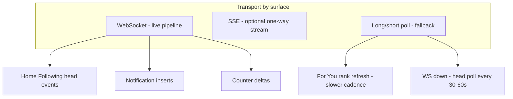
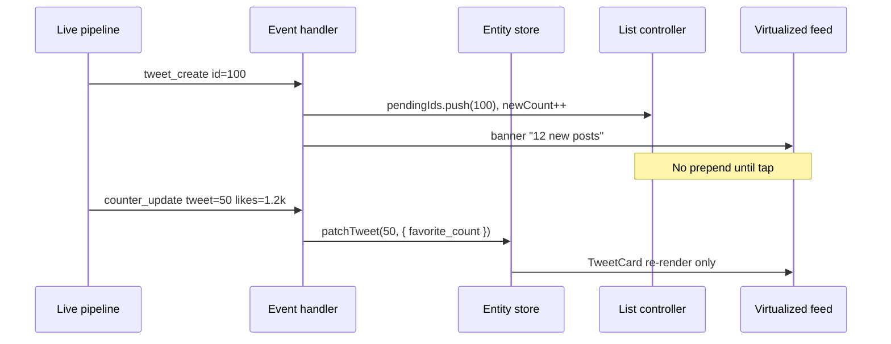
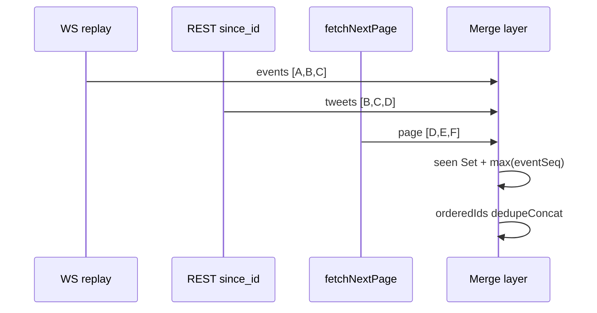
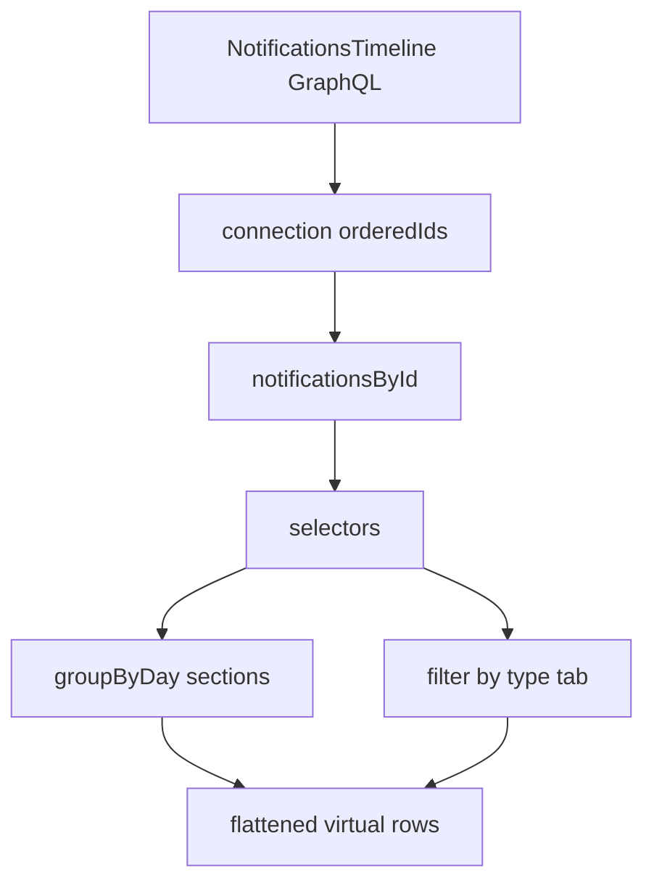
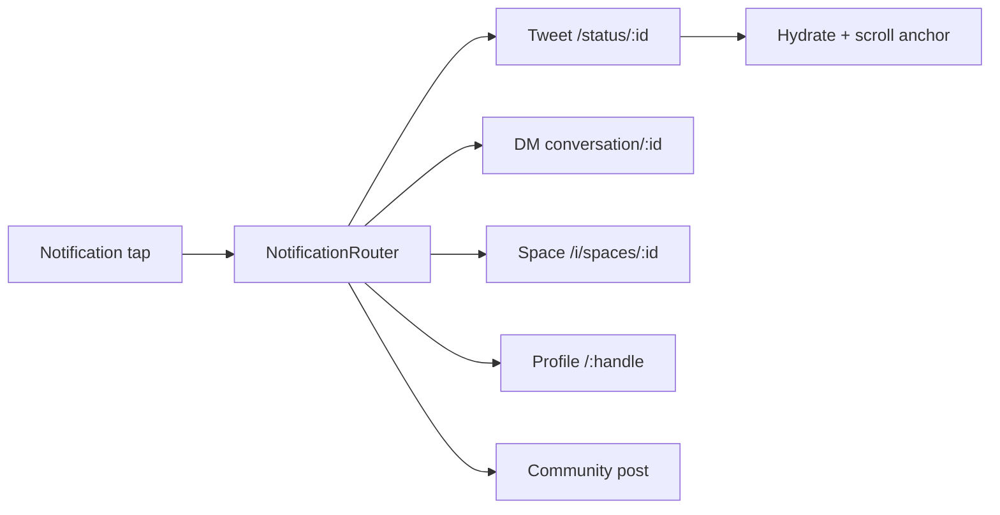
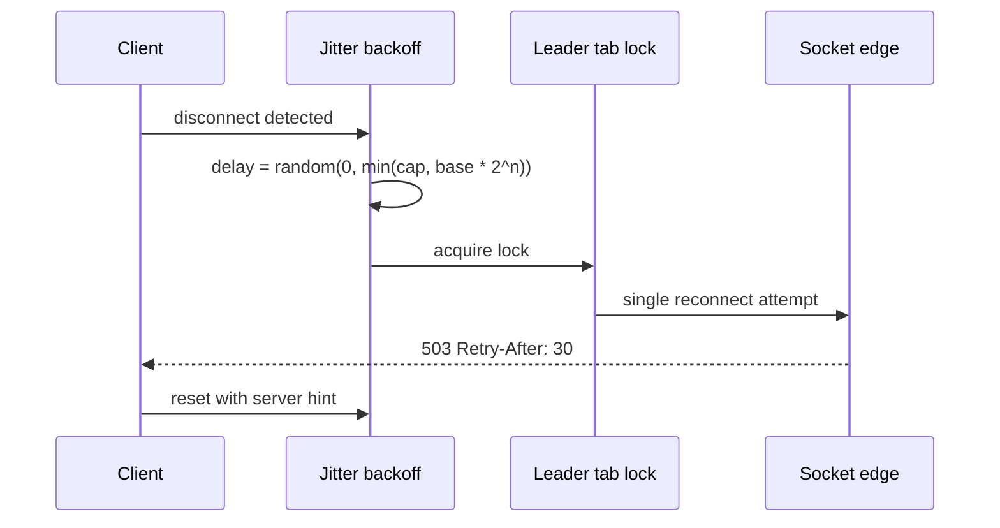
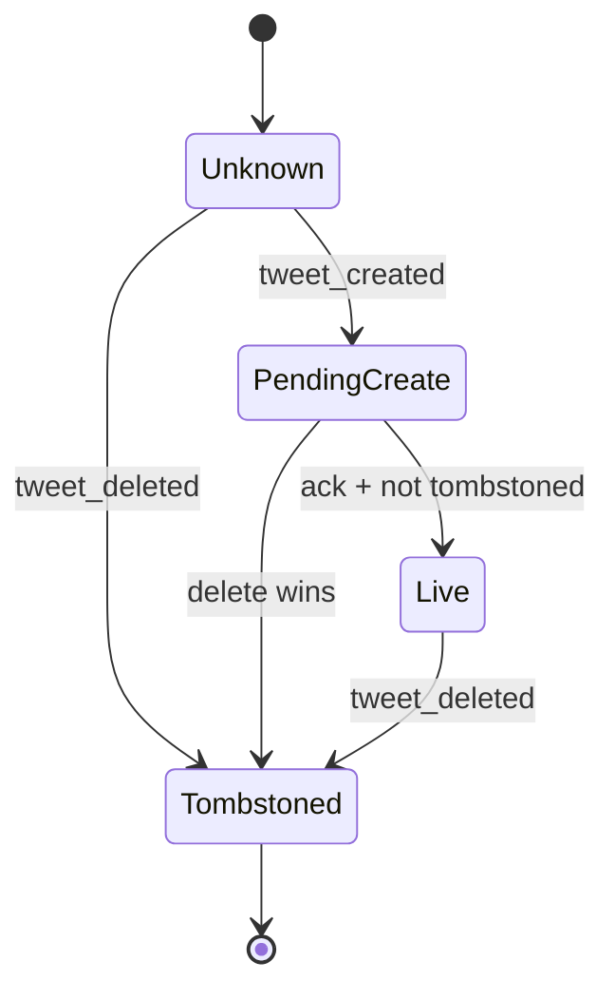
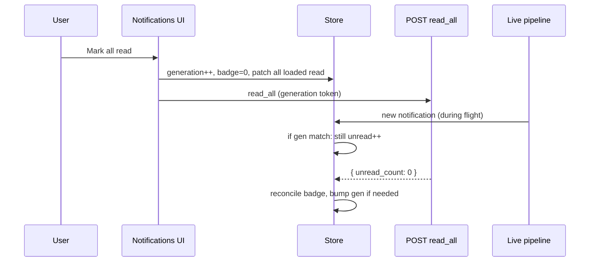

# Section 4 — Real-Time Updates & Notifications (Answers)

Interview-depth answers for Twitter/X real-time surfaces: WebSocket vs SSE vs polling for home freshness, lightweight push without full feed refetch, event dedup after reconnect, notifications tab modeling (day/type/read state), cross-device unread math, deep-links into tweets/DMs/Spaces, fleet-wide reconnect backoff, batched counter updates in virtualized lists, out-of-order event handling, push preference vs in-app badges, optimistic mark-all-read, and testing sparse event payloads. Covers GraphQL live pipeline, `id_str`, notification unions, and Relay normalized store patterns.

---

## Core

### When do you use WebSocket vs SSE vs polling for home timeline freshness, and what does each imply for reconnect?

**Problem framing:** Home freshness must balance **battery, server cost, and scroll stability**. Following wants near-live head updates; For You may tolerate slower rank refresh. Interviewers want a **transport decision matrix** and explicit reconnect semantics — resume cursor vs full replay, multi-tab behavior, and what happens to in-flight pagination when the pipe drops.

**Approach:** Use **WebSocket for bidirectional live pipeline** (home events, counters, notifications), **SSE for one-way server push** where HTTP infra is simpler, and **polling as degraded fallback** — each with different reconnect and state recovery contracts.



1. **When to use each** —

   | Transport | Best for | X-style usage |
   |-----------|----------|---------------|
   | **WebSocket** | High-frequency, multiplexed events; need client acks / heartbeats | Live pipeline: `tweet_create`, `counter_update`, `notification`, `tweet_delete` on authenticated session |
   | **SSE** | Server→client only; HTTP/2 friendly; auto-reconnect in browser | Lighter clients, read-only live badges, or CDN-proxied event fanout where WS blocked |
   | **Polling** | Degraded mode, background tab, For You rank refresh | `GET /2/timeline/following?since_id=` head poll; For You periodic `ranking_version` check every 60–120s when idle |

2. **Following vs For You** — **Following** subscribes to `home_following` on WS (or SSE channel keyed by `viewerId`). **For You** often combines WS entity patches (counts on visible tweets) with **less aggressive head refresh** — full re-rank via REST on focus or banner tap, not every socket event.

3. **WebSocket reconnect** — On drop:
   - Send `resume_token` + `last_event_id` (monotonic server sequence) on reconnect handshake
   - Server replays gap from event log **or** client falls back to REST `since_id` head fetch
   - Close code handling: `1001` going away → immediate reconnect; `4001` auth → refresh token then reconnect; `1013` try again later → backoff

4. **SSE reconnect** — Browser `EventSource` auto-reconnects with `Last-Event-ID` header — server must idempotently replay from that id. Client dedupes against normalized store (see Core Q3). No client→server path — mutations stay on REST/GraphQL.

5. **Polling reconnect** — Implicit: next interval fires. Store `lastSeenTweetId` / `max(event.timestamp)` in memory; poll with `since_id` or `min_id`. Backoff when 429/503: exponential + jitter (see Deep Q7).

6. **Multi-tab** — One **leader tab** holds WS; others receive events via `BroadcastChannel('live-events')` to avoid N connections per user. Leader election via `navigator.locks.request('x-live-socket')`.

7. **Background tab policy** — Page Visibility: downgrade WS to heartbeat-only or close socket; resume on `visibilitychange` with gap fill via REST before resubscribing.

```ts
// Reconnect handshake (conceptual)
ws.send({
  type: 'subscribe',
  channels: ['home_following', 'notifications', 'counters'],
  resume: { lastEventId: store.live.lastEventId, token: auth.accessToken },
});
```

**Tradeoffs:** WS lowest latency but hardest through corporate proxies and mobile radio power management — SSE/poll fallback required. Multiple tabs each opening WS is a thundering herd on reconnect — leader tab pattern adds complexity. **Pitfall:** Reconnect without `last_event_id` — duplicate head events or missed deletes. **Pitfall:** Polling every 5s on Following at scale — battery and 429 storms; use adaptive interval.

---

### How do you show lightweight push events ("new tweets available", live like counts) without refetching the entire feed?

**Problem framing:** Full timeline refetch on every socket event destroys **scroll position**, wastes bandwidth, and re-renders hundreds of virtualized rows. Users need **signals** (banner, badge, count tick) and **surgical entity patches** — not `invalidateQueries(['timeline'])`.

**Approach:** Separate **transport events** into (a) *list-order signals* buffered at the head and (b) *entity patches* applied to normalized `tweetsById` / `usersById` without touching connection order until user action.



1. **"New tweets available" banner** — On `tweet_create` / `home_refresh`:
   - Append `id_str` to `pendingHeadIds[]` (cap at 500, show "99+")
   - Increment `newTweetCount` per feed mode (`following` | `for_you`)
   - **Do not** prepend to `orderedIds` while user mid-scroll (`!isAtLiveEdge`)
   - Banner tap: fetch thin head page OR prepend `pendingHeadIds` with scroll compensation (Section 1)

2. **Live like/repost counts** — Event shape:
   ```json
   { "type": "counter_update", "tweet_id": "18446744073709551615", "field": "favorite_count", "value": 1203 }
   ```
   Apply `patchTweet(tweetId, { legacy: { favorite_count: value } })` — only subscribers to that tweet record re-render.

3. **GraphQL live / subscription patches** — Relay `@live` or subscription payload delivers `Tweet` field deltas; merge into normalized node. List holds ids — **no connection invalidation**.

4. **Notification bell** — Increment `unreadNotifications` on `notification` event; tab list unchanged until user opens notifications.

5. **What still uses targeted REST** — First time a tweet id appears in viewport and entity missing → `TweetResultByRestId` single fetch. Socket never carries full card for every follower — only ids + counters + delete flags.

6. **Rate limiting UI work** — Coalesce head signals: 200ms buffer merges 50 `tweet_create` into one banner update. Counter patches batched per frame (Deep Q8).

| Event type | Store action | List action |
|------------|--------------|-------------|
| `tweet_create` | Upsert entity if payload includes; else id-only pending | Buffer head ids; banner |
| `counter_update` | Patch entity fields | None |
| `tweet_delete` | Tombstone entity | Remove id from connections |
| `user.updated` | Patch User | None (cards pick up via selector) |

**Tradeoffs:** Id-only head events require hydration on prepend — acceptable on banner tap batch fetch. Showing live counts on off-screen tweets still patches store — memory cheap, avoid subscribing entire list to all ids. **Pitfall:** Invalidating infinite query on every like — full feed flash. **Pitfall:** Prepending on socket while reading — scroll jump without banner discipline.

---

### How do you deduplicate events that also appear in REST pagination responses after reconnect?

**Problem framing:** After reconnect, the client may **simultaneously** receive replayed WebSocket events, a gap-fill REST head fetch, and in-flight `fetchNextPage` tail responses — the same `id_str` arrives from three sources. Without idempotent merge, users see duplicate cards and broken virtualizer keys.

**Approach:** **Normalized entity store + ordered id list + event sequence watermark** — same pattern as Section 1 pagination dedup, extended with reconnect replay and tombstone awareness.



1. **Single canonical key** — All tweet references use string `id_str`. `entities.tweets[id]` is source of truth; lists store ids only.

2. **Dedup on insert** — Idempotent helper:
   ```ts
   function appendIds(list: string[], incoming: string[]): string[] {
     const seen = new Set(list);
     return [...list, ...incoming.filter((id) => !seen.has(id) && !seen.add(id))];
   }
   ```

3. **Reconnect watermark** — Persist `lastEventId` (server monotonic) and `lastSeenTweetId` (max snowflake at head). On reconnect:
   - Apply WS replay events with `eventId <= watermark` → skip if id already in `seen` or entity exists with `version >= event.version`
   - REST gap fill uses `since_id=lastSeenTweetId` — merge with dedup before applying WS buffer

4. **Pagination overlap** — Boundary ids repeat across pages; dedup concat handles. Tag each HTTP request with `requestGeneration`; on page success, merge entities then dedupe ids — never blind spread.

5. **Delete wins over create** — Maintain `tombstones: Set<tweetId>`. If `tweet_deleted` processed before `tweet_create` for same id (Deep Q9), drop create. Dedup layer checks tombstone before insert.

6. **Optimistic compose** — Map `client_tweet_id` → server `id_str` on ack; realtime `tweet_create` dedupes via client id field in payload.

7. **Notification dedup** — Notifications keyed by `notification_id` (or composite `type + target + actor + timestamp bucket`); REST page merge uses same id set as live inserts.

| Source A | Source B | Resolution |
|----------|----------|------------|
| WS replay | REST since_id | Entity merge; id once in list |
| WS replay | Tail pagination | Dedup concat |
| REST head | Pending buffer | Union pending into head on merge |
| Delete event | Any create | Tombstone blocks insert |

**Tradeoffs:** Keeping `seen` Set for entire session grows memory on long scroll — scope to loaded window + pending buffer, rely on entity existence for older ids. **Pitfall:** Numeric JS ids — always `id_str`. **Pitfall:** Reconnect full timeline refetch — duplicates and scroll loss; prefer since_id + replay.

---

### How do you model the notifications tab — grouped by day, by type (mention, repost, follow), and read/unread?

**Problem framing:** Notifications mix **social types** (follow, mention, like, repost, quote, Community, Subscription), **time density** (50 likes in an hour), and **read state** that must survive pagination. Flat list is noisy; over-grouping hides actionable items. Interviewers want a **data model** that supports UI grouping, filters, and stable virtualization keys.

**Approach:** Normalized **`Notification` records** + **derived view groups** computed in selectors — not mutating grouped arrays in the store. Primary API: cursor-paginated timeline; optional filter tabs map to server `filter` params.

1. **Normalized record** — GraphQL `Notification` / REST `notification` union:
   ```ts
   type Notification = {
     id: string;                    // notification id
     sortIndex: string;             // opaque cursor key (often snowflake-based)
     timestamp: string;
     read: boolean;
     type: NotificationType;      // 'mention' | 'follow' | 'like' | 'retweet' | ...
     actors: User[];                // 1 or aggregated many
     targetTweetId?: string;        // id_str
     targetUserId?: string;
     message?: string;              // optional text for system types
     icon: string;
     url?: string;                  // deep-link hint
   };
   ```

2. **Flat connection store** — `notificationsConnection: { orderedIds: string[], pageInfo }` — same Relay connection pattern as timelines. **Do not** store pre-grouped nested arrays in cache (breaks pagination merge).

3. **Day grouping (UI selector)** — Bucket by viewer-local calendar date of `timestamp`:
   ```ts
   function groupByDay(ids: string[], byId: Record<string, Notification>) {
     return ids.reduce((sections, id) => {
       const day = formatDay(byId[id].timestamp, viewerTimezone);
       sections[day] ??= [];
       sections[day].push(id);
       return sections;
     }, {} as Record<string, string[]>);
   }
   ```
   Render sticky headers: "Today", "Yesterday", "May 28". Virtualizer uses **flattened rows**: `[header, item, item, header, item…]` with row types.

4. **Type filtering** — Tabs: All | Mentions | Verified (product-specific). Server query: `NotificationsTimeline(filter: MENTIONS)` with independent cursor. Client-side filter only for quick toggles on already-loaded data — full filter uses separate cache key `['notifications', accountId, filter]`.

5. **Aggregation** — Server may return **bundled** notification: "A, B, and 12 others liked your post" as one row with `actors[]` and `aggregate_count`. Single id — do not split client-side unless expanding detail view.

6. **Read/unread UI** — Unread: `read === false` → bold text + blue dot. Mark read on row tap or visibility threshold (optional). **All tab** still shows read items — muted styling, paginated historically.

7. **Virtualization keys** — Row key = `notification.id` (not day header index). Headers get `header-${day}`.



**Tradeoffs:** Client-side day grouping recomputes on timezone change — re-run selector on `viewerTimezone` update. Separate filter queries duplicate data — acceptable for clarity vs one mega-query. **Pitfall:** Storing grouped arrays in Redux — append page breaks group boundaries. **Pitfall:** Using tweet id as notification key — collisions across types.

---

### How do you compute unread notification count vs per-notification `read` state across devices?

**Problem framing:** The nav badge shows **aggregate unread** (`42`) while each row has **`read: boolean`**. Marking read on phone must drop badge on web; another device marking all read must not leave stale blue dots locally. Count and per-item state can **temporarily diverge** during optimistic updates.

**Approach:** Treat **`unreadCount` as server-authoritative aggregate** with local **monotonic reconciliation**; per-notification `read` flags live in normalized records; cross-tab/device sync via refetch, WS `notification_read` events, or `BroadcastChannel`.

1. **Two-layer model** —

   | Layer | Field | Source of truth |
   |-------|-------|-----------------|
   | Badge | `viewer.unreadNotificationsCount` or `GET /notifications/unread_count` | Server aggregate |
   | Rows | `notificationsById[id].read` | Server per item, patched locally |

2. **Badge fetch** — Lightweight endpoint on app boot and WS reconnect:
   ```http
   GET /2/notifications/unread_count.json
   → { "unread_count": 42 }
   ```
   GraphQL: `viewer.unread_notification_count`. Poll on focus if WS down.

3. **Decrement rules** — When marking notification `id` read:
   - Optimistic: `read=true` on record; `badgeCount = max(0, badgeCount - 1)` if previously unread
   - Server ack returns `{ unread_count: 41 }` — **reconcile badge to server value** (handles multi-device)

4. **Mark all read** — Optimistic `badgeCount = 0`; patch all loaded ids `read=true`; server `POST /notifications/read_all` returns final count (Deep Q11).

5. **Cross-device sync** — WS event:
   ```json
   { "type": "notification_read", "notification_id": "…" }
   { "type": "notifications_read_all", "unread_count": 0 }
   ```
   Apply patch without local user action. On app focus: `refetchUnreadCount()` + merge drift.

6. **New notification while tab open** — WS `notification` insert: prepend to connection, `badgeCount++` if not on notifications route. If on notifications route and auto-mark-read policy — increment only when row scrolled away (product choice).

7. **Multi-account** — Partition `badgeCount` by `accountId` — switch account swaps badge selector (Section 3).

8. **Invariant repair** — Periodic sanity: `badgeCount >= count(unread in loaded pages)` is not required globally — loaded window is subset. On mismatch after full notifications fetch, trust server aggregate.

**Tradeoffs:** Optimistic badge can briefly disagree with dots in list — reconcile on ack. Storing badge only client-side without server sync — multi-device broken. **Pitfall:** Decrementing badge when marking already-read item — double-tap guard with `if (!n.read)`. **Pitfall:** Using loaded unread length for badge — wrong when 1000 unread exist beyond first page.

---

### How do you deep-link from a notification into the right tweet, DM, or Space with correct scroll context?

**Problem framing:** Notifications land on **different surfaces** — tweet detail, profile status anchor, DM thread, Space room, Community post, follow profile. Wrong route or missing scroll context (tweet not in loaded pages) feels broken; notification payload is often **thin** compared to REST hydration.

**Approach:** **`NotificationRouter`** maps typed notification → `{ route, params, prefetch[], scrollStrategy }` — resolve targets by `id_str`, fetch missing context, then navigate with anchor or modal policy.



1. **Router table** — Map `NotificationType` → handler:

   | Type | Route | Scroll / context |
   |------|-------|------------------|
   | `mention`, `like`, `retweet`, `quote`, `reply` | `/{author}/status/{tweetId}` or `/i/status/{tweetId}` | TweetDetail modal mobile; inline anchor profile/home if context known |
   | `follow` | `/{screen_name}` | Profile header — no scroll |
   | `dm` | `/messages/{conversation_id}` | Scroll to message id if provided |
   | `space` | `/i/spaces/{space_id}` | Join room shell; fetch Space metadata |
   | `community` | `/i/communities/{id}/post/{tweetId}` | Community timeline anchor |
   | `live` | `/i/broadcasts/{id}` | Player surface |

2. **Always string ids** — `tweetId`, `conversation_id`, `space_id` from payload as `id_str` — no Number() conversion.

3. **Thin payload hydration** — Notification carries `targetTweetId` + `actorId` only:
   - Parallel prefetch: `TweetResultByRestId`, `UserByRestId`
   - Navigate after skeleton ready or optimistic navigate with spinner on detail shell

4. **Tweet scroll context** — If opening on profile/home tab feed:
   - Determine tab (Posts vs Replies) from tweet metadata (Section 3)
   - `ensureTweetInConnection(tweetId)` → anchor fetch or cursor jump API
   - `virtualizer.scrollToIndex(index, { align: 'center' })` + highlight ring

5. **DM scroll** — Conversation store keyed by `conversation_id`; message id from notification → `scrollToMessage(messageId)` in message list virtualizer; fetch gap if message older than loaded window.

6. **Space context** — Notification may reference scheduled vs live — fetch `AudioSpaceById` → state `Live` | `Ended` | `Scheduled`; show join vs replay vs calendar.

7. **Mark read on navigation** — Optimistic mark notification read on tap; does not block navigation.

8. **Fallback URLs** — Payload `url` field (e.g. `https://x.com/i/notifications/…`) parsed as last resort — prefer typed ids for in-app routing.

**Tradeoffs:** Modal tweet detail avoids scroll hunt — simpler but interview expects anchor behavior on feeds. Prefetch before navigate adds latency — balance with skeleton UI. **Pitfall:** Deep link by `screen_name` after rename — prefer `rest_id` routes internally. **Pitfall:** Opening deleted tweet — tombstone screen from live store, not 404 crash.

---

## Deep

### How do you implement exponential backoff on reconnect after a fleet-wide outage without thundering herds?

**Problem framing:** When X's live pipeline region fails, **millions of clients reconnect simultaneously** when service restores — identical backoff intervals create synchronized retry waves (thundering herd), re-overwhelming edge and auth. Client must **jitter**, **cap concurrency**, and **respect Retry-After**.

**Approach:** **Full jitter exponential backoff** per client + **global rate limit on reconnect attempts** + leader-tab single socket + server hints.



1. **Backoff formula** — `delay = random(0, min(maxDelay, baseMs * 2^attempt))` — "full jitter" (AWS pattern). Typical: `baseMs=1000`, `maxDelay=60000`, `attempt` capped at 6.

2. **Fleet-wide outage detection** — HTTP `503` / WS close `1013` / GraphQL `ServiceUnavailable` increments global `outageGeneration`. All surfaces pause non-critical refetch; live pipeline uses backoff only (no tight poll loop).

3. **Retry-After respect** — On 503 response header `Retry-After: 120` — `delay = max(computedJitter, 120000)`.

4. **Leader tab** — Only one tab per browser profile reconnects WS; followers wait for `BroadcastChannel('socket-status')` **connected** before assuming live. Prevents 5 tabs × reconnect storm per user.

5. **Stagger on visibility** — Background tabs delay reconnect an extra `random(0, 5000)` when returning visible — spreads mobile app opens after push notification burst.

6. **Auth refresh serialization** — Token refresh on `4001` uses mutex — one refresh, shared promise across tabs via `BroadcastChannel`.

7. **Degraded mode** — After `attempt > 3`, fall back to **slow poll** (60s head check) instead of hammering WS endpoint — user sees "Connection lost" banner with manual retry.

8. **Manual retry** — User tap "Retry now" resets attempt counter but still applies small jitter `random(0, 500)`.

```ts
function nextBackoffMs(attempt: number, retryAfterSec?: number): number {
  const cap = 60_000;
  const base = 1_000;
  const exp = Math.min(cap, base * 2 ** attempt);
  const jitter = Math.random() * exp;
  const server = retryAfterSec ? retryAfterSec * 1000 : 0;
  return Math.max(jitter, server);
}
```

**Tradeoffs:** Aggressive max delay (5min) feels dead on recovery — cap 60s for consumer app. Manual retry without jitter can spike — still apply minimum random delay. **Pitfall:** Identical `setTimeout(5000)` across clients — always randomize. **Pitfall:** Every tab opening independent WS — multiply herd size.

---

### How do you batch high-frequency counter updates (likes, reposts) in the UI to avoid re-rendering the whole virtualized list?

**Problem framing:** Viral tweet receives **dozens of like counter updates per second** on live pipeline. Naive store updates notify all timeline subscribers — virtualizer thinks entire list changed → dropped frames and flickering counts.

**Approach:** **Per-entity subscription** + **rAF-coalesced patch queue** + **display layer decoupled from canonical store** for visible rows only.

1. **Normalized updates** — Patch `tweetsById[id].legacy.favorite_count` in store — do not replace timeline `orderedIds` array reference on counter events.

2. **Coalesce queue** — Buffer patches in `Map<tweetId, Partial<Tweet>>`:
   ```ts
   queueCounterPatch(tweetId, { favorite_count: 1203 });
   // flush once per frame
   requestAnimationFrame(() => {
     for (const [id, patch] of queue) mergeTweet(id, patch);
     queue.clear();
   });
   ```

3. **Fine-grained subscriptions** — TweetCard subscribes via selector:
   ```ts
   useStore((s) => s.tweetsById[tweetId]?.legacy.favorite_count)
   ```
   Relay: fragment on `Tweet` only — parent list container does not re-render on count change if memoized with `orderedIds` stable reference.

4. **Virtualizer memo** — List parent passes `tweetId` only; row component owns count display. `React.memo(TweetRow, (a,b) => a.tweetId === b.tweetId && a.layoutEpoch === b.layoutEpoch)`.

5. **Display smoothing** — Optional **lerp** or 300ms debounce on count *label* for off-screen ids; on-screen updates immediate. Prevents unreadable blur on 1.2K → 1.3K → 1.4K rapid fire.

6. **Tabular nums** — `font-variant-numeric: tabular-nums` prevents layout shift when digits widen.

7. **Batch WS messages** — Server may bundle `counter_updates[]` — client applies in one rAF flush regardless.

8. **Engagement by viewer** — Separate `favorited_by_viewer` boolean from count — do not coalesce boolean with count incorrectly; viewer state updates immediately on tap.

| Technique | Prevents |
|-----------|----------|
| Stable orderedIds ref | Full list re-render |
| rAF batch | 60 patches/sec → 1 frame |
| Per-tweet selector | Unaffected rows stay idle |
| Memoized row | Virtualizer recycle churn |

**Tradeoffs:** 1-frame delay on counts — imperceptible vs jank. Debouncing on-screen counts feels laggy on own tweet — bypass debounce for `authorId === viewerId`. **Pitfall:** Context provider holding entire timeline — any patch re-renders all consumers. **Pitfall:** Replacing tweet object root `{ ...tweet, count }` breaking memo — patch in place or use immutable tool with structural sharing at id level only.

---

### How do you handle out-of-order events — e.g., `tweet_deleted` before `tweet_created` for the same id?

**Problem framing:** Live pipeline and REST responses **cross on the network** — delete ack, replay buffer, and create event for the same `id_str` can arrive in any order. Showing a deleted tweet flash or resurrecting removed content is a trust bug.

**Approach:** **Per-entity version/lifecycle state machine** + **tombstone registry** + **event reorder buffer** with short TTL.



1. **Lifecycle states** — `unknown | pending | live | tombstoned` on each tweet id slot. Unknown + delete → tombstone immediately (never render). Unknown + create → pending until REST/GraphQL confirms or timeout.

2. **Tombstone registry** — `tombstones: Map<id, { at: timestamp, reason }>`. All list insert paths check:
   ```ts
   function canInsert(id: string) {
     return !tombstones.has(id);
   }
   ```

3. **Delete before create** — On `tweet_deleted(id)` while no entity:
   - Set tombstone
   - Drop id from pending buffers and optimistic maps
   - When late `tweet_create` arrives → **discard** if tombstone newer than event `version`

4. **Create before delete (normal)** — Render tweet; delete removes from connections + tombstone prevents re-add from stale pagination.

5. **Version / timestamp tie-break** — Events carry `event_id` or `updated_at`:
   ```ts
   if (incoming.version <= entity.lastAppliedVersion) return; // stale
   ```

6. **Reorder buffer** — Hold ambiguous events 100–300ms when `entity.state === pending` — merge before apply. Mobile flaky network: cap buffer; after timeout apply best-known state and refetch single tweet.

7. **Optimistic compose race** — User deletes tweet before create ack: track `pendingDeleteClientIds`; drop create ack if delete already sent.

8. **Notifications** — Notification referencing deleted tweet: row shows "Post unavailable" with actors preserved; tap opens tombstone detail.

**Tradeoffs:** Reorder buffer adds latency to edge cases — keep ≤300ms. Refetch on ambiguity is safe but costly — use for own tweets only. **Pitfall:** Removing tombstone on pagination seeing tweet — pagination must respect server 404 on deleted id. **Pitfall:** Applying delete only to one connection — global tombstone + remove from all connections (Section 2).

---

### How do you respect push notification preferences per category while still showing in-app badges?

**Problem framing:** User disables **push** for "Likes" but still expects **in-app** notification tab entries and possibly badge when opening the app. Push preferences (APNs/FCM), email, SMS, and in-app are **different channels** — conflating them breaks settings trust or over-notifies.

**Approach:** **Channel × category preference matrix** — push delivery filtered server-side; client badge driven by **in-app notification stream** regardless of push opt-out unless user disables in-app category too.

1. **Preference model** — Server stores per category:

   | Category | Push | In-app | Email |
   |----------|------|--------|-------|
   | Mentions | ✓ | ✓ | ✗ |
   | Likes | ✗ | ✓ | ✗ |
   | Follows | ✓ | ✓ | ✗ |
   | DMs | ✓ | ✓ | ✗ |

   Settings UI writes `NotificationSettings` GraphQL mutation — client caches locally.

2. **Push path** — Server push dispatcher checks `push_enabled && category_push[ type ]` before APNs/FCM — **client does not filter pushes that already arrived**; OS handles display. In-app settings page explains "You won't receive push for likes; they'll still appear here."

3. **In-app badge** — Badge count from `unread_count` API reflects **in-app-eligible** notifications only — server excludes categories user disabled for in-app if product supports full mute; otherwise badge = all unread in notifications timeline.

4. **Badge vs push icon** — Nav bell badge uses in-app unread aggregate. App icon badge (iOS) may mirror push-eligible unread only — platform-specific:
   ```ts
   // iOS: setApplicationIconBadgeNumber(pushEligibleUnread)
   // In-app bell: allUnread from API
   ```

5. **Realtime insert** — WS `notification` still arrives for in-app timeline; client inserts row. If category muted for in-app (strict mode) — drop insert and do not increment badge.

6. **Settings optimistic** — Toggle like push off → UI immediate; revert on 4xx. Refetch unread count after save — badge may drop if server recalculates.

7. **Muted accounts** — `@handle` mute suppresses like/repost notifications in-app and push — separate from global category prefs.

**Tradeoffs:** Badge number differing from OS app icon confuses users — document in settings or sync when possible. Server-driven badge counts avoid client miscalculation. **Pitfall:** Filtering WS events for disabled push — user never sees in-app row. **Pitfall:** Client-side only push block — user still gets APNs until server settings sync.

---

### How do you implement "mark all read" optimistically while a background sync reconciles with the server?

**Problem framing:** User taps **Mark all read** expecting instant badge clear and muted list. Server mutation may take seconds; parallel WS inserts may add unread during flight; another device may mark subset read — client must **optimistically zero UI** then reconcile without resurrecting ghost unread.

**Approach:** **Optimistic generation token** + immediate local patch + async mutation with server count authoritative on completion.



1. **Optimistic actions** —
   ```ts
   const gen = ++markAllReadGeneration;
   setBadge(0);
   patchAllLoadedNotifications({ read: true });
   enqueueMutation({ type: 'read_all', clientGen: gen });
   ```

2. **In-flight notification inserts** — WS `notification` during pending mutation:
   - If `clientGen === markAllReadGeneration` and mutation not acked → **still prepend** notification (user should see new activity) but **do not increment badge** until mutation fails OR increment and let server ack zero — product choice: prefer showing new row with unread dot if arrived after tap (fairness).

   Cleaner rule: notifications with `timestamp > markAllReadStartedAt` → unread even if mutation in flight.

3. **Server ack** — Response `{ unread_count: N }`:
   - Set badge to `N` (often 0)
   - Increment generation; drop optimistic flag
   - Refetch first page if `N > 0` — partial read_all failure edge case

4. **Mutation failure** — Rollback: `refetchUnreadCount()` + refetch notifications connection; restore `read` flags from server — do not guess.

5. **Concurrent mark all** — Disable button while `isMarkingAllRead`; ignore double tap.

6. **Cross-device** — WS `notifications_read_all` event → same badge zero + patch loaded ids without local generation (server-initiated sync).

7. **Partial loaded window** — Mark all read applies to **server state for all notifications**, not just loaded ids — unloaded unread cleared server-side; client badge zero immediately; opening tab later shows all read styling on fetch.

**Tradeoffs:** Hiding new notifications during optimistic window loses trust — timestamp rule safer. Full refetch after ack is heavy — badge + patch suffices if server reliable. **Pitfall:** Only patching visible rows — badge 0 but older unread on page 5 until scroll — server read_all must clear all pages server-side. **Pitfall:** No generation token — late ack clears newly arrived unread incorrectly.

---

### How do you test notification grouping and badge math when event payloads omit fields the UI normally hydrates from REST?

**Problem framing:** Live pipeline events are **sparse** — `notification_id`, `type`, `timestamp`, `actor_id` only — while UI normally hydrates `User` avatars, tweet snippets, and verified badges from GraphQL. Tests must validate **grouping selectors and badge math** without full REST fixtures and catch regressions when fields missing.

**Approach:** **Fixture factory with hydration tiers** + **selector unit tests** + **MSW/WebSocket mock with sparse payloads** + **contract tests for merge behavior**.

1. **Hydration tiers in fixtures** —
   ```ts
   function notif(overrides: Partial<Notification> & { id: string }): Notification {
     return {
       id: overrides.id,
       sortIndex: overrides.id,
       timestamp: '2026-05-30T12:00:00Z',
       read: false,
       type: 'like',
       actors: [],           // sparse — no hydration
       targetTweetId: undefined,
       ...overrides,
     };
   }
   ```

2. **Selector tests (pure)** — Test `groupByDay`, `flattenForVirtualizer`, `computeBadgeDelta` without React:
   ```ts
   expect(groupByDay(['n1','n2'], { n1: notif({ id: 'n1', ...}), ... }))
   expect(badgeDelta({ read: false }, { read: true })).toBe(-1);
   ```

3. **Sparse WS mock** — Test harness pushes minimal frames:
   ```json
   { "type": "notification", "id": "99", "notification_type": "follow", "actor_id": "123" }
   ```
   Assert: badge +1; list row renders skeleton/placeholder avatar; no throw on missing `actors[0].profile_image_url`.

4. **Hydration waterfall test** — Render notification row with sparse store → expect placeholder → resolve `UserByRestId` mock → avatar appears. Single `@testing-library/react` flow with MSW delayed response.

5. **Badge math integration** — Sequence: sparse insert (+1) → mark read (-1) → `read_all` (0) → sparse insert during mutation (timestamp rule) → assert final badge matches table-driven cases.

6. **Grouping without tweet text** — Day headers still render; type filter excludes `mention` without needing `targetTweetId` on record — filter uses `type` field only.

7. **Snapshot isolation** — Do not snapshot full DOM with hydrated data — snapshot **flattened row model** (serializable) derived from selectors.

8. **Contract test** — JSON schema or TypeScript type guard on live event payloads in CI — fail build if server removes `notification_id` or sends numeric id instead of `id_str`.

| Test layer | Validates |
|------------|-----------|
| Selector unit | Grouping, badge delta, day buckets |
| Sparse WS integration | No crash; placeholder UI |
| Hydration async | User fetch fills row |
| Contract | Payload shape / id_str |

**Tradeoffs:** Over-mocking REST hides integration bugs — one E2E with full hydration per release. Testing implementation details of Virtualizer — prefer row model assertions. **Pitfall:** Tests only with fat fixtures — sparse production events untested. **Pitfall:** Using numeric snowflakes in fixtures — misses precision bugs in grouping sort.

---

*Next section: [05 — Search, Explore & Direct Messages](./05-search-explore-direct-messages.md) (when available).*
