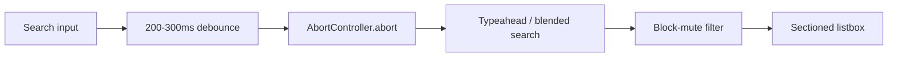
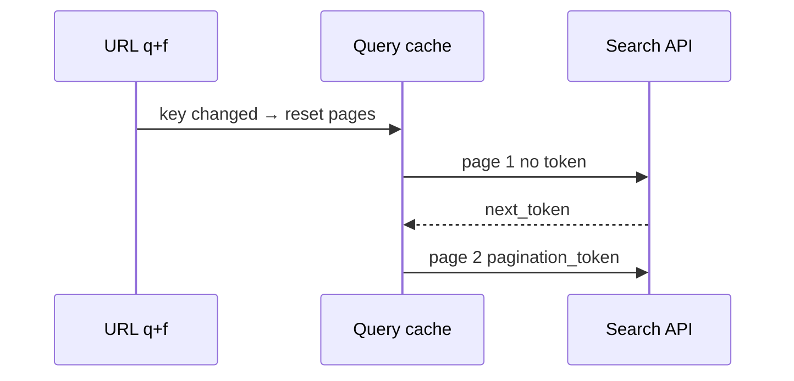
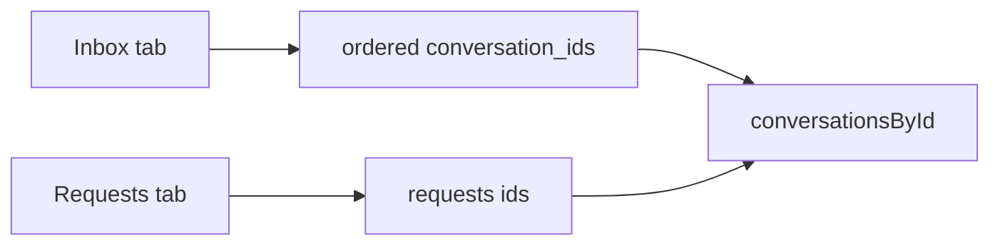
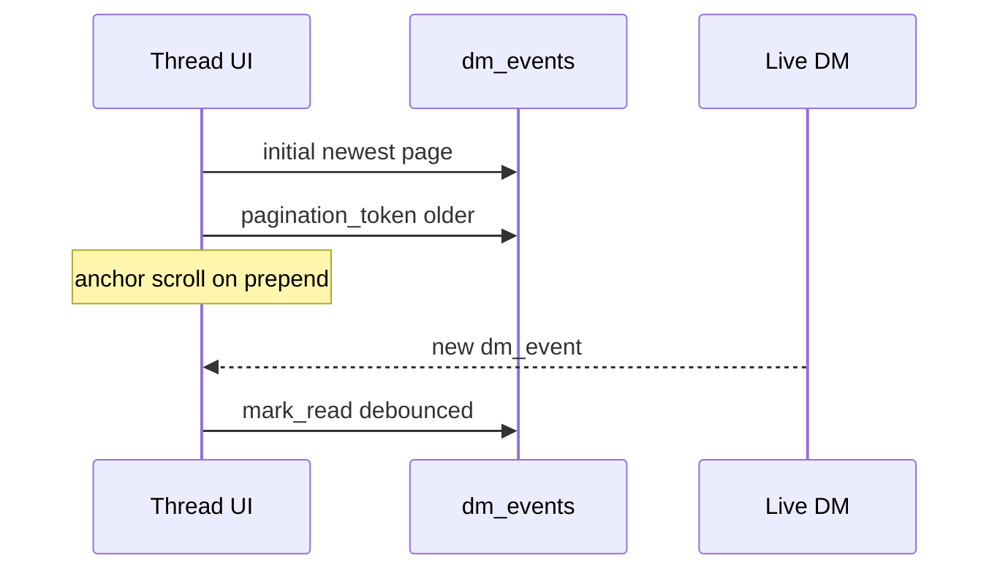
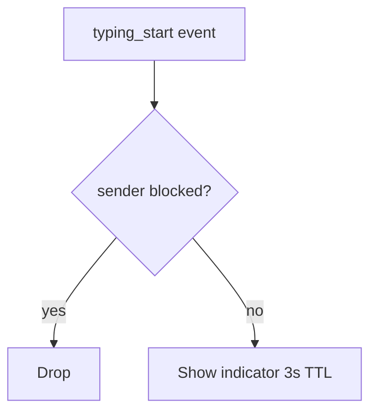
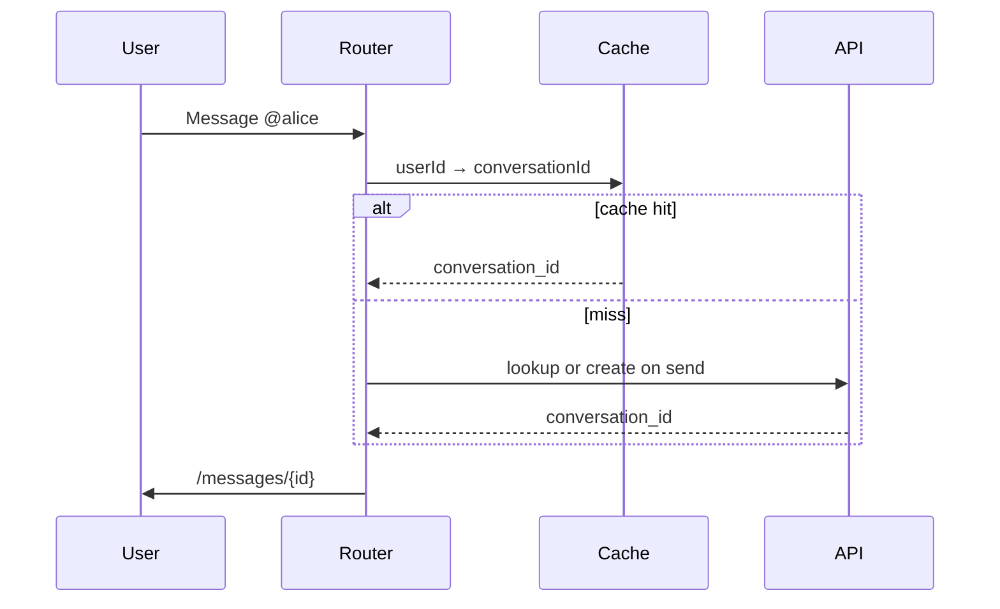

# Section 5 — Search, Explore & Direct Messages (Answers)

Interview-depth answers for Twitter/X discovery and messaging: typeahead with debounce/abort across users/tweets/hashtags, Explore mixed-card virtualization, search URL + cursor pagination, query highlighting with entity parsing, DM inbox (requests, unread, previews), DM history + read receipts, offline/degraded search, 429 UX, E2EE trust UI, typing/presence privacy, mention→DM deep links, and heterogeneous message virtualization.

---

## Core

### How do you implement typeahead search across accounts, posts, and hashtags with debouncing and cancellation?

**Problem framing:** Keystrokes outpace network RTT; without debounce and cancellation, stale responses overwrite newer queries and the dropdown flickers wrong results. Search typeahead must blend **users**, **posts**, and **hashtags** in one keyboard-navigable surface while respecting block/mute graph and rate limits.

**Approach:** Separate **input timing** (debounce), **transport** (abort + generation id), **entity merge** (typed sections), and **read-path filtering** (block/mute at selectors).



1. **Debounce** — Fire fetch 200–300ms after last `input` event; `minChars` 2–3; on `Enter` or blur, flush pending debounce immediately so committed navigation is not delayed.

2. **Cancellation** — Hold one `AbortController` ref; call `abort()` before each new request; pass `signal` to `fetch`/axios. Swallow `AbortError` in catch — not user-visible errors.

3. **Generation guard** — Increment `requestId` on each send; apply response only if `requestId === latest` (belt when proxy strips abort).

4. **Mixed entities** — Prefer one batched product response `{ users[], tweets[], hashtags[] }` or `results[].type` discriminator. UI: section headers (`People`, `Posts`, `Hashtags`), `role="listbox"` / `role="option"`, arrow keys cross sections.

5. **Parallel fallback** — If backend splits endpoints (`users/search` + `tweets/search/recent` prefix + trending hashtags), merge in client with per-section loading skeletons — do not block People on slow Posts.

6. **Cache** — `Map<normalizedQuery, SuggestionBundle>` LRU ~50 entries for backspace; invalidate on account switch.

7. **Graph hygiene** — Filter `blocking` / `blocked_by` / `muting` on user rows before render; purge typeahead cache on block/mute mutation (Section 3).

```ts
let abort: AbortController | null = null;
let gen = 0;

async function fetchTypeahead(q: string) {
  abort?.abort();
  abort = new AbortController();
  const id = ++gen;
  const res = await api.typeahead(q, { signal: abort.signal });
  if (id !== gen) return;
  setSuggestions(filterBlocked(res));
}
```

**Tradeoffs:** Single merged request simplifies loading state but slowest section blocks all — parallel is snappier with more UI code. Debounce-only without abort still wastes server work. Aggressive cache can show stale user avatars after block — purge on graph events. **Pitfall:** `dangerouslySetInnerHTML` in dropdown highlights — XSS risk; use segmented React nodes. **Pitfall:** Numeric conversion on tweet ids in list keys — use `id_str` only.

---

### How do you render Explore/Trending with mixed entity types (news, topics, promoted) in one scroller?

**Problem framing:** Explore is not a homogeneous tweet list — one scroller interleaves **trends**, **news cards**, **topics**, **promoted**, and **who-to-follow carousels** with different heights, actions, and impression tracking. Naive map-over-array causes layout thrash and broken virtualization.

**Approach:** Normalize API modules into a **flattened discriminated row model**, virtualize with per-kind size estimates + measure pass, and isolate promoted slots from index-only keys.

```mermaid
flowchart TB
  API[Explore payload modules] --> Norm[ExploreRow[] discriminated union]
  Norm --> Virt[Virtualizer estimateSize + measure]
  Virt --> Render[switch row.kind]
```

1. **Row union** —
   ```ts
   type ExploreRow =
     | { kind: 'trend'; id: string; name: string; tweetVolume?: number }
     | { kind: 'news'; id: string; headline: string; source: string; aspect: number }
     | { kind: 'topic'; id: string; title: string }
     | { kind: 'promoted'; id: string; campaignId: string; payload: unknown }
     | { kind: 'user_carousel'; id: string; userIds: string[] };
   ```

2. **Stable keys** — `explore-${row.kind}-${row.id}` — never `index` alone (promoted reorder on refresh).

3. **Virtualization** — `@tanstack/react-virtual` or Virtuoso: `estimateSize(kind)` defaults (trend ~72px, news ~120px, carousel ~200px); `measureElement` on first paint; overscan 3–5.

4. **Promoted** — `isPromoted` flag drives disclosure label and separate impression beacon; do not share cache key with organic trends.

5. **Refresh** — Stale-while-revalidate: show cached rows + subtle spinner; anchor scroll to `moduleId` on return navigation.

6. **Tabs** — If Explore has sub-tabs (News, Sports), either separate virtual lists per tab or unmount inactive tab to cap memory — avoid mounting all tabs’ full Explore payloads.

| Row kind | estimateSize | measure on |
|----------|--------------|------------|
| trend | 72 | first text wrap |
| news | 120 + thumb | image decode |
| carousel | 200 | horizontal scroll mount |
| promoted | variable | image + CTA |

**Tradeoffs:** Variable-height virtualizer needs measure pass — brief scroll drift vs fixed wrong estimates. One infinite scroller vs sectioned “Load more” — infinite feels modern but harder analytics per module. **Pitfall:** Treating Explore cache like `['timeline', mode]` — wrong invalidation on tweet post. **Pitfall:** Image load changing height without `measureElement` — overlapping cards.

---

### How do you paginate search results and preserve filters (people, latest, media) in the URL for shareable state?

**Problem framing:** Users share “python latest with media” searches; back/forward must restore filters; infinite scroll must not reset when unrelated state changes. **Cursors** are opaque and long — they belong in query cache, not always in the URL.

**Approach:** Encode **human-shareable** state in URL; keep **pagination_token** in React Query/SWR `pageParam` keyed by normalized query + filter tuple.

**URL params**

| Param | Values | Maps to |
|-------|--------|---------|
| `q` | encoded string | `query` / operators |
| `f` | `top` \| `latest` \| `people` \| `media` | tab + `sort_order` / endpoint choice |
| `src` | optional | analytics (`typed_query`, `hashtag_click`) |

Example: `/search?q=lang%3Aen%20%23react&f=latest`

**API (Twitter API v2 conceptual)**

```
GET /2/tweets/search/recent?query=...&sort_order=recency|relevancy&max_results=10&pagination_token=
GET /2/users/search?query=...&max_results=...&pagination_token=
```

- `meta.next_token` → next page’s `pagination_token` — opaque; never parse client-side.
- People tab may hit **users search** — separate cache key from tweet search.

**Client cache key**

```ts
['search', viewerId, normalize(q), filter, sort] // pageParam: string | undefined
```

On `q` or `f` change: reset `pageParam` chain and scroll to top. On `fetchNextPage`: append with returned token only for **same** key tuple.



**Tradeoffs:** Putting cursor in URL enables exact page share but ugly/stale links — filters-only URL is cleaner. Client-only filter that does not change API `query` string confuses share recipients — keep URL and API mapper in sync. **Pitfall:** Reusing `pagination_token` after switching `latest` → `top` — corrupt overlap. **Pitfall:** Changing `q` without clearing pages — duplicate first page rows.

---

### How do you highlight query terms in tweet snippets without breaking entity parsing (mentions, links, cashtags)?

**Problem framing:** Search snippets must emphasize the matched terms while preserving clickable **@mentions**, **URLs**, **#hashtags**, and **$cashtags** aligned to `display_text_range` — regex bolding the whole string breaks offsets and accessibility.

**Approach:** **Entities first, highlight second** — build non-overlapping segments, apply highlight only inside plain text spans.

1. **Parse** — Use server `entities` (`user_mentions`, `urls`, `hashtags`, `symbols`) + `display_text_range` / `full_text`. Sort ranges; reject overlaps.

2. **Segment builder** — Walk text → `[EntitySegment | PlainSegment]`.

3. **Highlight** — For each plain segment, find query tokens (case-fold policy: case-insensitive for Latin; respect `lang:` boundaries). Merge adjacent highlight spans.

4. **Render** — React children: `<Mention />`, `<Url />`, `<Hashtag />`, `<Cashtag />`, `<mark className="search-hit">`, plain text. No raw HTML injection.

5. **Server-prehighlighted** — If API returns `highlighted_text` or offset array, prefer server ranges for snippet — client only for live preview.

```text
full_text + entities → segments[]
for plain segment: apply query highlight ranges (clip to segment bounds)
render segment list
```

6. **UTF-16** — JavaScript string indices are UTF-16 code units; emoji in query match must use same indexing as Twitter entities API.

**Tradeoffs:** Client tokenizer must mirror display rules, not necessarily 280-count composer rules. Server-only highlighting reduces client bugs but stale if user edits quoted tweet. **Pitfall:** Highlight inside `https://` URL visible text. **Pitfall:** Overlapping highlight + mention when query is `@handle` — prefer entity link, not double wrap.

---

### How do you model the DM inbox — conversation list, last message preview, unread badge, and request folder?

**Problem framing:** Inbox UI is a **ranked conversation list**, not messages — it needs last-activity ordering, one-line previews, unread math, and a privacy boundary for **Message Requests** separate from trusted inbox.

**Approach:** Normalized `conversationsById` + ordered id list per tab; previews derived from last event; requests as partition with accept flow.

```ts
type Conversation = {
  conversation_id: string;
  type: 'ONE_TO_ONE' | 'GROUP';
  participants: User[];
  last_readable_event_id?: string;
  last_message?: {
    sender_id: string;
    created_at: string;
    preview_type: 'text' | 'photo' | 'gif' | 'voice' | 'post';
    text?: string;
  };
  unread_count: number;
  is_pinned?: boolean;
  trusted?: boolean;
  encryption_state?: 'none' | 'e2ee';
};

type InboxTab = 'all' | 'requests';
```

1. **Ordering** — Server `sort_by=last_activity` desc; optimistic bump `last_activity` on local send before ACK.

2. **Preview line** — Truncate text ~80 chars; attachments → “Photo”, “GIF”, “Voice message”; group prefix `Alice: …`; outgoing prefix `You: …`.

3. **Unread badge** — Prefer server `unread_count`; fallback `latest_event_id` vs `last_read_event_id` per viewer.

4. **Requests folder** — Separate query `['dm-inbox', viewerId, 'requests']`; rows show Accept/Delete; accept moves id from `requestsOrderedIds` → `inboxOrderedIds` and may call trust API.

5. **Multi-account** — Partition all keys with `activeAccountId` (Section 3) — never show another account’s previews.

6. **Realtime** — Socket `dm_conversation_update` patches `last_message` + `unread_count`; dedupe by `conversation_id`.



**Tradeoffs:** Optimistic preview before ACK can roll back on failure — show failed state on conversation row. Showing full last message vs privacy-safe preview for sensitive attachments. **Pitfall:** Blocked user conversation still in list until server purge — hide via selector. **Pitfall:** Unread count drift across devices until mark-read sync.

---

### How do you load DM message history with cursor pagination and attach read receipts where supported?

**Problem framing:** Threads can be thousands of events; chat UX is **bottom-anchored** (newest at bottom) while APIs often return **newest-first pages**; read receipts must sync across devices without flashing “Seen” incorrectly.

**Approach:** Bi-directional cursor pagination with scroll anchor on prepend; append realtime at bottom; debounced mark-read on thread focus.

1. **Initial load** — `GET /2/dm_conversations/{id}/dm_events?max_results=50` — reverse to chronological if API newest-first.

2. **Older history** — `pagination_token` from `meta.next_token` → `fetchPreviousPage` prepends to `messageIds[]` with **anchor scroll** (same math as timeline Section 1): record `anchorEventId` + offset before prepend, restore after layout.

3. **New events** — WebSocket append at bottom; dedupe `dm_event_id` / `id_str`; if user at bottom, auto-scroll; if reading history, show “New messages” chip.

4. **Read receipts** — On thread focus: debounced `POST mark_read` with `last_read_event_id`; optimistic “Seen” under last outgoing message when `peer.last_read_event_id >= myMessageId`; reconcile on ACK.

5. **Receipt UI** — Only on last message in outgoing group; `aria-label="Seen by {name}"` for a11y; hide if feature flag off or peer blocked.



**Tradeoffs:** Mark-read on every scroll vs on open only — open-only saves API but wrong receipt while user reads mid-thread. Newest-down API forces client reverse — document in team conventions. **Pitfall:** Prepend without anchor — viewport jumps. **Pitfall:** Showing “Seen” when blocked peer cannot read.

---

## Deep

### How do you implement “search while offline” or degraded mode with a stale local index and clear labeling?

**Problem framing:** Users still open search when offline; showing empty state implies no matches exist globally. Client must surface **cached/local** results with explicit degraded labeling and disable server-only filters.

**Approach:** Tiered local sources + offline banner + no fake infinite scroll.

| Source | Contents |
|--------|----------|
| Recent queries | `localStorage` / IndexedDB last ~20 |
| Follow graph cache | Handles + display names for prefix match |
| Cached tweets | Optional IndexedDB FTS on last N fetched timeline tweets |
| Visited profiles | Recent `User` entities in normalized store |

1. **Detection** — `navigator.onLine` + failed fetch `NetworkError` → enter degraded mode for search routes.

2. **UI** — Banner: “You’re offline — showing saved results only”; amber icon on typeahead; disable `Latest` / global tabs that require network.

3. **`searchOffline(q)`** — Rank: exact handle match > prefix handle > local FTS tweet text > recent query replay; cap 20 results.

4. **Reconnect** — On `online`, invalidate `['search', …]`; refetch active `q` if user still on search page.

5. **No silent merge** — Do not blend offline hits into online results without badge — user must see mode change.

**Tradeoffs:** IndexedDB FTS build cost on mobile — defer to Wi-Fi or cap index size. Offline typeahead from follow graph only misses global search — correct expectation setting. **Pitfall:** Stale deleted tweets in local index — tombstone check before render. **Pitfall:** Identical empty UI for offline vs zero hits.

---

### How do you handle rate-limited search (429) with retry-after UX instead of silent empty results?

**Problem framing:** Search endpoints hit **429** under abuse protection; clearing results or showing empty state trains hammer retries and worsens fleet load.

**Approach:** Respect `Retry-After`, preserve last good page, block typeahead loop, surface countdown.

1. **Detect** — `429` + parse `Retry-After` (seconds) and optional `x-rate-limit-reset`.

2. **UI** — Inline banner: “Search temporarily limited. Try again in 0:45.”; disable search input or read-only browse; show **cached results** with “Results from earlier” sublabel.

3. **Typeahead** — Stop debounced fetch until window elapses; do not auto-retry in background tabs.

4. **Backoff** — If user taps Retry, `delay = max(jitter(0, Retry-After), computedBackoff)` — same full-jitter pattern as Section 4 reconnect.

5. **Telemetry** — `rate_limit_search` with endpoint + `retry_after_sec` — no query text in logs (privacy).

```ts
if (res.status === 429) {
  const sec = Number(res.headers.get('Retry-After') ?? 60);
  setSearchRateLimit({ until: Date.now() + sec * 1000, keepPreviousResults: true });
}
```

**Tradeoffs:** Hard-disabling input frustrates power users — allow editing query but block submit until window ends. Showing cached page without timestamp confuses — always show “as of {time}”. **Pitfall:** Treating 429 as `[]` — looks like no matches. **Pitfall:** Five tabs each retrying search on focus — coordinate via `BroadcastChannel` rate-limit state.

---

### How do you implement encrypted DM indicators, key change warnings, and device trust UI without exposing secrets?

**Problem framing:** E2EE cryptography belongs in OS/native layers; web UI must communicate **trust state** and key changes without ever holding private keys in JS or logging sensitive material.

**Approach:** Enum-driven UI fed by **trusted native bridge** only; placeholder bubbles for undecryptable content.

| Signal | UX |
|--------|-----|
| Encrypted thread | Lock icon + “End-to-end encrypted” in header |
| Key change | Blocking modal: “Safety number changed” — Verify or Continue with friction |
| Verify | Numeric/QR fingerprint from bridge — never derive in web from raw keys |
| Devices | “Linked devices” list from server metadata ids only |
| Decrypt fail | In-thread placeholder: “Message can’t be read on this device” |

1. **`encryption_state`** on `Conversation` — `none | e2ee | verifying`; header subtitle follows enum.

2. **Bridge contract** — `postMessage` / native module: `{ type: 'TRUST_STATE', conversationId, verified: boolean, fingerprintDisplay?: string }` — no key material in payload.

3. **Key-change event** — `KEY_CHANGED` → modal must dismiss before composer enabled; store `acknowledgedKeyVersion` per conversation.

4. **Message bubble** — `content_state: 'plaintext' | 'decrypting' | 'failed' | 'placeholder'` — spinner only in decrypting; never log ciphertext.

5. **Analytics** — Count `e2ee_key_change_shown` — never attach keys or safety numbers.

**Tradeoffs:** “Continue anyway” on key change reduces friction vs security — product choice; interview: default Verify. Web-only clients may be view-only for E2EE — clear unsupported state. **Pitfall:** `localStorage` for session keys. **Pitfall:** Screenshot fingerprint in error reports.

---

### How do you show typing indicators and presence in DMs without leaking activity to blocked users?

**Problem framing:** Typing and “Active now” are **presence signals** — must not reach users you blocked or who blocked you; client cannot rely on UI-only hiding if server leaks.

**Approach:** Server-authoritative gating + client subscription scope + inbound filter + short TTL.

1. **Subscribe** — Only open typing channel for `conversation_id` where viewer is participant and **no** `blocking` / `blocked_by` with any participant.

2. **Outbound** — Debounce `typing_start` max once per 2s; auto-stop after 3s idle; do not send if thread with blocked user (composer disabled).

3. **Inbound** — Drop `typing_start` if `sender_id ∈ blockedSet`; never render “@{blocked} is typing…”.

4. **Presence header** — “Active now” only if `user_presence` API returns allowed + relationship flags; same as profile DM entry (Section 3).

5. **TTL** — Typing UI clears if no refresh in 3–5s — avoids stuck indicator after socket drop.



**Tradeoffs:** Optimistic local “typing…” when sending — optional; peer-only is simpler. Per-conversation socket vs multiplex — multiplex cheaper, one filter layer. **Pitfall:** Global presence poll exposing last seen to blocked accounts. **Pitfall:** Group DM typing shows name — leak if blocked user in group should not see you — server must exclude.

---

### How do you jump from a tweet mention to the DM thread with the same participant and correct conversation id?

**Problem framing:** “Message” from tweet or profile must open the **existing** 1:1 thread or create one deterministically — wrong `conversation_id` opens empty thread or wrong participant, especially multi-account.

**Approach:** Resolve `participant_id` → `conversation_id` via cache then API; pass mention context as compose draft only.

1. **CTA entry** — Tweet detail / profile: `Message` → `resolveDmConversation(targetUserId)`.

2. **Cache lookup** — `participantToConversationId.get(targetUserId)` from inbox normalized store.

3. **API miss** — Product GraphQL `ConversationByParticipantId` or inbox search filter — avoid creating duplicate conversations on navigation-only.

4. **Navigate** — `/messages/{conversation_id}`; hydrate thread shell + message list query.

5. **Lazy create** — If no conversation: show empty thread with composer; create on first send via `POST /2/dm_conversations/with/{participant_id}/messages` — returns ids for route replace.

6. **Mention context** — `referring_tweet_id` in draft state — not encoded in `conversation_id`.

7. **Block/mute** — Disable CTA when `blocking` or `blocked_by`; no navigation.



**Tradeoffs:** Create-on-navigation vs create-on-first-send — former avoids empty shell confusion, latter fewer orphan conversations. URL with `participant_id` query param helps share but leaks intent — prefer internal resolve. **Pitfall:** Multi-account showing inbox A while resolving user from account B. **Pitfall:** Using `@screen_name` in route after rename — resolve to `rest_id` first.

---

### How do you virtualize DM threads with images, voice notes, and link cards of heterogeneous height?

**Problem framing:** DM rows range from one-line text to tall images, voice waveforms, and link previews — uniform row height breaks virtualization; wrong estimates cause overlap and scroll jank.

**Approach:** Discriminated message rows + per-type `estimateSize` + `measureElement` + `ResizeObserver` on media decode + bottom-anchored virtualizer.

1. **Row types** — `TextMessage | ImageMessage | VoiceMessage | LinkCard | SystemEvent | Unsupported`.

2. **Defaults** — text `min(72, lines * 20)`; image width-bound aspect box before decode; voice fixed 56px; link card ~88px + thumb.

3. **Virtualizer** — `useVirtualizer` with `flex-direction: column-reverse` (chat bottom) or inverted indices; keys = `dm_event_id` string.

4. **Measure cache** — `heightsByEventId` session map after first measure; reuse on scroll-back.

5. **Grouping** — Collapse consecutive same-sender bubbles → one row with internal stack — reduces row count but complicates height — measure whole group.

6. **Media** — `ResizeObserver` → `virtualizer.measureElement(rowRef)` when image loads; prefer reserved `aspect-ratio` box to minimize CLS.

```ts
const rowEstimate = (row: DmRow) => {
  switch (row.kind) {
    case 'text': return 72;
    case 'image': return row.width ? (row.width / row.aspect) : 200;
    case 'voice': return 56;
    case 'link_card': return 96;
    default: return 48;
  }
};
```

**Tradeoffs:** Remeasure on every image vs fixed aspect box — accuracy vs scroll stability. Grouped bubbles harder to recycle — disable row recycling for attachment rows if glitchy. **Pitfall:** Recycled row shows previous attachment flash — `key={dm_event_id}` + reset media state on mount. **Pitfall:** Voice waveform async height without remeasure — overlap next message.

---
