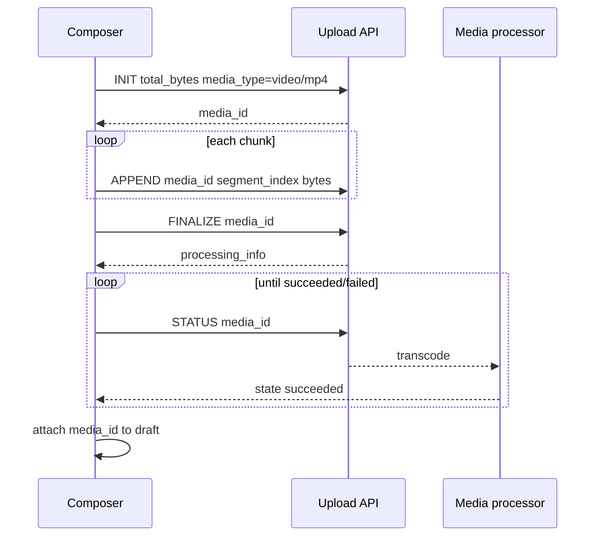
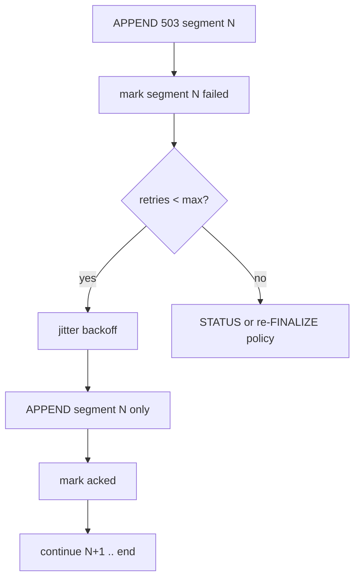
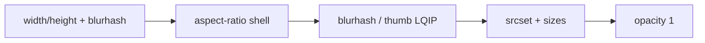
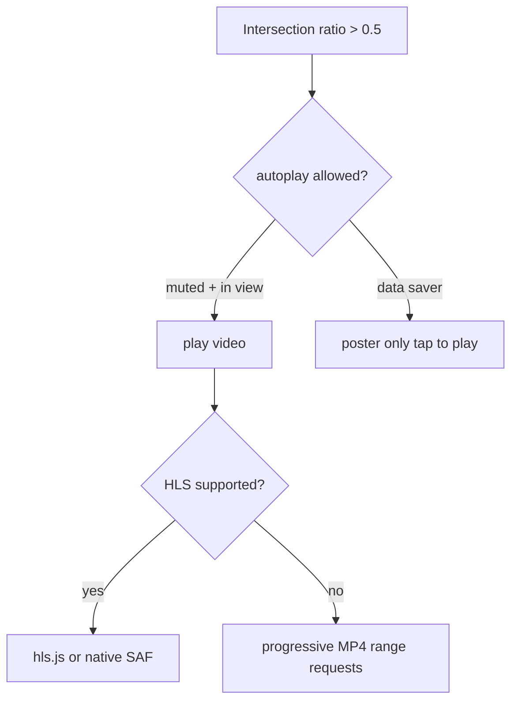
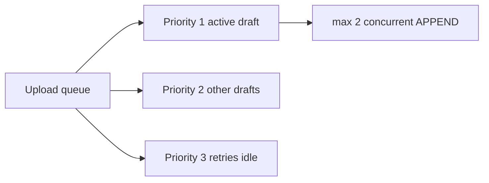
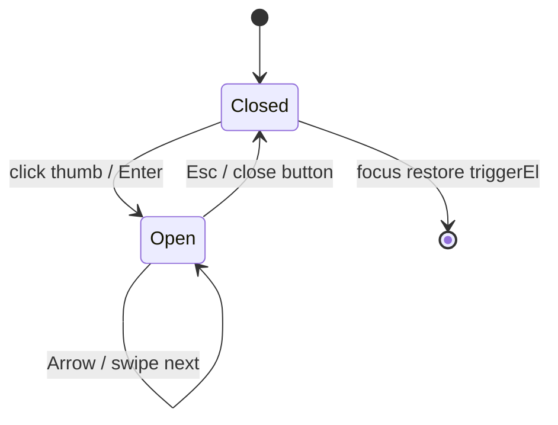
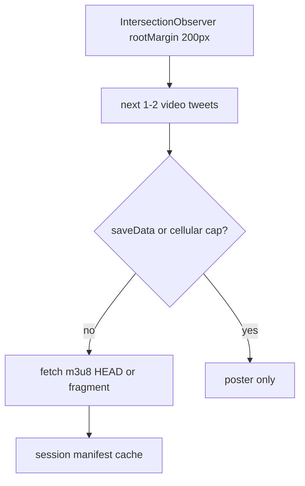

# Section 6 — Media Upload, Playback & Accessibility (Answers)

Interview-depth answers for Twitter/X media: chunked upload (INIT → APPEND → FINALIZE → STATUS), per-chunk retry without full restart, composer progress for GIF/image/video, blurhash/LQIP + responsive `srcset`, progressive MP4/HLS with autoplay and data-saver, alt-text authoring and screen-reader exposure, upload concurrency caps, EXIF/GIF preprocessing, lightbox a11y, virtualized-feed CLS, post-processing policy errors, and bandwidth-aware manifest prefetch.

---

## Core

### How do you implement the INIT → APPEND → FINALIZE → STATUS chunked upload flow for video in the composer?

**Problem framing:** Video exceeds single-request limits (historically ~5MB per `APPEND` on Twitter’s upload API); the composer must upload **before** `CreateTweet`, track opaque `media_id`, and poll until transcoding finishes. A naive `multipart/form-data` one-shot fails on mobile networks and cannot resume.

**Approach:** Treat upload as a **state machine** keyed by `media_id` (from INIT), with byte-range APPENDs and async processing after FINALIZE.



1. **INIT** — `POST https://upload.twitter.com/1.1/media/upload.json` with `command=INIT`, `total_bytes`, `media_type` (`video/mp4`, `image/gif`, `image/jpeg`), optional `media_category` (`tweet_video`, `tweet_image`, `amplify_video`). Response: `media_id` / `media_id_string` — use **string** only in JS.

2. **APPEND** — Repeated `command=APPEND`, same `media_id`, `segment_index` (0-based), raw bytes in body (typically 4–5MB segments). Increment index only after 2xx ACK.

3. **FINALIZE** — `command=FINALIZE` triggers server-side processing; response may include `processing_info` with `state`, `check_after_secs`, `progress_percent`.

4. **STATUS** — Poll `command=STATUS` until `processing_info.state` is `succeeded` or `failed` (and `error` object). Exponential poll: respect `check_after_secs` from server, cap interval ~5s.

5. **Composer integration** — Start on file pick (Section 2); store `{ localId, media_id?, phase, bytesSent, totalBytes }` on draft; gate `canPublish` until `phase === 'ready'`.

6. **Auth** — OAuth 1.0a or Bearer on upload host; separate from GraphQL — isolate upload client module.

```ts
type UploadPhase = 'init' | 'appending' | 'finalizing' | 'processing' | 'ready' | 'error';

async function uploadVideo(file: File, onProgress: (pct: number) => void) {
  const init = await mediaUploadInit(file.size, 'video/mp4', 'tweet_video');
  const mediaId = init.media_id_string;
  const chunkSize = 4 * 1024 * 1024;
  let segment = 0;
  for (let offset = 0; offset < file.size; offset += chunkSize) {
    const blob = file.slice(offset, offset + chunkSize);
    await mediaUploadAppend(mediaId, segment++, blob);
    onProgress(Math.min(100, ((offset + blob.size) / file.size) * 90)); // reserve 10% for processing
  }
  await mediaUploadFinalize(mediaId);
  await pollStatusUntilDone(mediaId, onProgress);
  return mediaId;
}
```

| Phase | User-visible label | Blocks Post? |
|-------|-------------------|--------------|
| init/appending | Uploading… {n}% | yes |
| finalizing/processing | Processing video… | yes |
| ready | Checkmark on thumb | no |
| error | Retry / Remove | yes |

**Tradeoffs:** Early upload on pick wastes bandwidth if user removes file — better than Post-time stall. INIT per file vs batch — Twitter model is per asset. **Pitfall:** Losing `media_id` on refresh — persist upload session in draft IDB. **Pitfall:** Publishing with processing incomplete — server rejects or broken playback.

---

### How do you retry individual failed chunks without restarting a multi-hundred-megabyte upload?

**Problem framing:** On flaky LTE, chunk 47 of 120 fails; re-INIT and re-uploading 400MB is unacceptable. The client must retry **only failed segment_index** ranges while preserving `media_id` and already-ACKed segments.

**Approach:** **Checkpoint map** per upload session: `segment_index → status (acked | pending | failed)`; retry with bounded backoff; never reset `media_id` unless server returns irrecoverable errors.



1. **Idempotent segments** — Only advance `nextSegment` after HTTP 2xx. Keep `bytesAcked = sum(chunkSizes[0..segment-1])` for progress UI.

2. **Retry policy** — Per segment: max 5 attempts, delay `min(30s, 2^attempt * 250ms + jitter)`; classify errors: **retryable** (408, 429, 5xx, network reset) vs **fatal** (401, 400 bad segment, unknown `media_id`).

3. **429** — Honor `Retry-After`; pause **all** segments for that `media_id` to avoid amplifying rate limit (Section 5 pattern).

4. **Partial APPEND** — If connection drops mid-body, assume segment not acked — re-send **entire segment bytes** (same `segment_index`), not byte-range within segment unless API documents sub-range (Twitter does not — whole segment).

5. **FINALIZE gating** — Call FINALIZE only when `failed.size === 0` and `nextSegment === totalSegments`. If FINALIZE fails with “incomplete”, STATUS may report missing segments — re-APPEND missing indices.

6. **Cross-tab resume** — Persist `{ media_id, totalBytes, segmentSize, ackedThrough }` in IndexedDB draft; on reload, STATUS first — if upload still open, continue APPEND from `ackedThrough + 1`.

```ts
async function appendWithRetry(mediaId: string, segment: number, blob: Blob) {
  for (let attempt = 0; attempt < 5; attempt++) {
    try {
      await mediaUploadAppend(mediaId, segment, blob);
      return;
    } catch (e) {
      if (!isRetryable(e) || attempt === 4) throw e;
      await sleep(jitter(250 * 2 ** attempt));
    }
  }
}
```

**Tradeoffs:** Smaller chunks fail less but more round-trips — 4MB is typical balance. Client-side segment queue vs parallel APPENDs — Twitter historically **serial** segments; parallel may not be supported. **Pitfall:** Skipping segment index after timeout — corrupt video. **Pitfall:** New INIT on any error — doubles user data charge.

---

### How do you show upload progress, processing state, and failure/retry for GIF vs image vs video?

**Problem framing:** **Image** may complete after one APPEND; **GIF** can be large and counted as `image/gif` with different processing; **video** has long transcode STATUS. A single progress bar confuses users when UI shows 100% but Post stays disabled during processing.

**Approach:** Discriminate by `media_type` and `processing_info.state`; split progress into **upload bytes** vs **server processing**; type-specific copy and icons.

1. **State machine per attachment** —
   ```ts
   type MediaUploadUi =
     | { kind: 'image'; phase: 'uploading' | 'ready' | 'error'; pct: number }
     | { kind: 'gif'; phase: 'uploading' | 'processing' | 'ready' | 'error'; pct: number }
     | { kind: 'video'; phase: 'uploading' | 'processing' | 'ready' | 'error'; uploadPct: number; transcodePct?: number };
   ```

2. **Progress mapping** — Image: 0–100% upload only. Video: 0–85% upload bytes, 85–100% from `processing_info.progress_percent` when present. GIF: upload then short `processing` if API returns it.

3. **Thumbnail strip UI** — Per tile: ring progress, phase label (“Uploading”, “Processing”, “Failed”), Cancel (abort XHR + optional server discard), Retry (failed segments only for video; full re-pick for fatal image error).

4. **Post button** — Aggregate: `disabled if any phase ∉ {ready}`; subtitle “Uploading 2 of 3…” on primary CTA.

5. **GIF vs video detection** — If user picks `.gif` but bytes are H.264 (converted GIF), still show GIF badge if product treats as GIF; processing copy differs from MP4 video length limits.

| Type | API `media_type` | Processing poll? | Typical failure copy |
|------|------------------|------------------|----------------------|
| Image | `image/jpeg`, `image/png` | rare | “Couldn’t upload photo” |
| GIF | `image/gif` | sometimes | “GIF too large” / dimension |
| Video | `video/mp4` | always | “Processing failed” / duration |

**Tradeoffs:** Two-segment progress bar is clearer but more UI code than one bar. Showing transcode % when server omits it — indeterminate spinner only. **Pitfall:** 100% upload bar while STATUS pending — user thinks app frozen. **Pitfall:** Same retry UX for 413 dimension error (no retry helps) vs network blip.

---

### How do you render inline images with blurhash/LQIP placeholders and responsive `srcset` from CDN variants?

**Problem framing:** Timeline images load over slow networks; without placeholders, virtualized cells **collapse then pop** (CLS). Twitter serves multiple resolutions via CDN (`pbs.twimg.com`) and may ship **blurhash** in extensions metadata — the client must pick variants by DPR and layout width.

**Approach:** Reserve **aspect-ratio box** from metadata → paint blurhash/LQIP → swap to responsive `srcset`/`sizes` on decode.

1. **Metadata** — From tweet `extended_entities.media[]` or GraphQL `Media` node: `original_info.width/height`, `sizes` (`thumb`, `small`, `medium`, `large`), optional `blurhash` / dominant color in `media_key` extensions.

2. **Placeholder** — CSS `aspect-ratio: width / height` on wrapper; canvas or SVG blurhash decode (~20×20 coefficients → upscale); fallback: `background: #1a1a1a` + low-res `thumb` URL if no hash.

3. **Responsive URLs** — Build `srcset` from known width buckets:
   ```ts
   function twimgSrcset(mediaUrl: string, widths = [480, 680, 1200, 2048]) {
     return widths.map(w => `${formatUrl(mediaUrl, 'name=orig&format=jpg')} ${w}w`).join(', ');
   }
   ```
   Match product CDN rules (`?format=webp&name=small` etc.) — use **`name=`** params Twitter documents for photo sizes.

4. **`sizes` attribute** — Map layout: full-width timeline `(min-width: 600px) 600px, 100vw`; 2-up grid `50vw`; 4-up `25vw`.

5. **Decode strategy** — `loading="lazy"` below fold; `fetchpriority="high"` for LCP tweet; `decoding="async"`.

6. **Fade-in** — `opacity` transition on `onLoad`; keep blurhash until load or error (error → broken icon, preserve box).



**Tradeoffs:** WebP/AVIF variants save bytes but complicate `srcset` — negotiate via `Accept` or stick to JPG for interview clarity. Blurhash decode on main thread — WASM worker for jank on low-end. **Pitfall:** `width/height` missing — default 16:9 guess causes letterbox jump. **Pitfall:** Recycling virtual row shows wrong hash — key `media_key` on placeholder.

---

### How do you implement progressive MP4 or HLS playback with autoplay policies, mute-by-default, and data-saver mode?

**Problem framing:** Timeline video must **autoplay in view** without blasting audio; iOS Safari blocks unmuted autoplay; full MP4 download on cellular wastes data. Product also offers **data saver** — no autoplay, lower resolution, Wi-Fi-only prefetch.

**Approach:** **IntersectionObserver** gating + **muted default** + format selection (MP4 progressive vs HLS adaptive) driven by `prefers-reduced-data` and in-app settings.



1. **Formats** — Twitter delivers **HLS** (`.m3u8`) for adaptive bitrate on many clients; fallback **MP4** progressive URL in `video_info.variants` (pick highest ≤ cap). Sort variants by `bitrate` ascending for data saver.

2. **Autoplay policy** — Play when: visible ≥50% viewport, `document.visibilityState === 'visible'`, user **not** enabled “autoplay off” / data saver, element `muted` (and `playsInline` for iOS). Pause on scroll-out — do not leave audio tab ghosts.

3. **Mute-by-default** — `video.muted = true` on mount; speaker toggle sets `muted = false` only after **user gesture** on that player (stores `userUnmuted[id]` session).

4. **Data saver** — Settings flag or `navigator.connection.saveData`: no autoplay, show poster + play button; cap max variant bitrate (e.g. 480p); disable manifest prefetch (Deep question).

5. **HLS vs MP4** — HLS: `hls.js` on Chrome/Android; native HLS on Safari. MP4: use `Range` requests for progressive seek; single file simpler but no ABR.

6. **Single active player** — Global coordinator: only one `mediaId` plays at a time in timeline — second in view pauses first (X-style behavior).

```ts
function selectVariant(variants: VideoVariant[], dataSaver: boolean) {
  const sorted = [...variants].sort((a, b) => a.bitrate - b.bitrate);
  if (dataSaver) return sorted.find(v => v.height <= 480) ?? sorted[0];
  return sorted[sorted.length - 1];
}
```

| Setting | Autoplay | Max quality | Prefetch |
|---------|----------|-------------|----------|
| Default | muted in-view | ABR high on Wi-Fi | next manifest light |
| Data saver | off | ≤480p | off |
| Reduced motion | poster/static | n/a | off |

**Tradeoffs:** hls.js bundle size vs native-only Safari — split chunk. Autoplay engagement vs accessibility — always provide visible controls. **Pitfall:** Autoplay with sound — browser block + user annoyance. **Pitfall:** Multiple HLS instances — memory; tear down on virtualizer unmount.

---

### How do you require and edit alt text, and expose it to screen readers in the timeline and lightbox?

**Problem framing:** Alt text is the primary **non-visual** description for images/GIFs; Twitter allows `alt_text` on upload (FINALIZE or metadata POST) and product may **require** it for accessibility. Screen readers need alt in **timeline** (not only composer) and **lightbox** without duplicating noisy tweet text.

**Approach:** Composer **alt modal** bound to `media_id`; persist via API; timeline renders `aria-label` / visually hidden description; lightbox exposes long description and focus order.

1. **Authoring** — On attach or before Post: open “Add description” sheet; `maxlength` 1000 (product limit); store `altText` on local upload row; send with `ALT_TEXT` metadata command or GraphQL `CreateTweet` media metadata after upload.

2. **Require gate** — `canPublish` false if `feature.requireAltText && imageCount > 0 && any missing alt`; show inline “Description required” on thumb badge.

3. **Edit after upload** — `PATCH` / metadata endpoint with `media_id` before tweet sent; after tweet posted, edit via tweet edit flow if alt supported — else disabled copy.

4. **Timeline exposure** —
   ```tsx
    {/* decorative if tweet text sufficient */}
   <span className="sr-only">{media.alt_text || 'Image'}</span>
   ```
   Better pattern when alt exists: set **`alt={media.alt_text}`** on image; tweet text remains separate. For linked image cards: `role="group"` `aria-roledescription="Image"` + alt on img.

5. **Lightbox** — On open: focus dialog; announce `aria-label={`Image: ${alt_text}`}`; if no alt, offer “No description available” not silence.

6. **GIF/video** — GIF: alt describes motion/content; video: separate **captions** track vs alt (poster frame alt optional) — do not stuff transcript into img alt.

**Tradeoffs:** Mandatory alt slows power users — allow draft with warning vs hard block. Empty alt `""` correct when tweet text fully describes image — rare. **Pitfall:** Duplicating full tweet in alt — SR reads twice. **Pitfall:** `alt` on div background-image — use real `` or explicit `aria-label`.

---

## Deep

### How do you cap concurrent uploads per session and prioritize the tweet the user is about to post?

**Problem framing:** Users attach media to **drafts** and background tabs; unconstrained parallel APPEND saturates radio and CPU, starving the **active compose** Post path. Need global cap + **priority queue**.

**Approach:** Session-wide **upload scheduler** (max 2–3 concurrent) with priority lanes: `activeComposer > scheduledDraft > background`.



1. **Cap** — `MAX_CONCURRENT_UPLOADS = 2` (3 on Wi-Fi optional); new APPEND starts only when slot free.

2. **Priority score** — `activeComposeIntentId === draft.id` → 100; visible composer minimized → 50; background draft → 10; failed retry → 80 (don’t starve recovery).

3. **Preempt** — On focus active composer, **pause** low-priority uploads (abort in-flight XHR, checkpoint segment) and resume slots for active file.

4. **Post burst** — When user taps Post, **promote** all attachments for that draft to priority 100 and optionally pause others until publish completes.

5. **Telemetry** — `upload_queue_wait_ms` by priority — detect starvation.

```ts
class MediaUploadScheduler {
  private running = 0;
  private queue: PriorityQueue<UploadJob> = new PriorityQueue();

  enqueue(job: UploadJob) {
    this.queue.push(job);
    this.pump();
  }
  private async pump() {
    while (this.running < MAX_CONCURRENT && !this.queue.empty()) {
      const job = this.queue.pop();
      this.running++;
      runUpload(job).finally(() => { this.running--; this.pump(); });
    }
  }
}
```

**Tradeoffs:** Pausing mid-chunk adds latency to background drafts — acceptable. Wi-Fi-only uploads for non-active — frustrates mobile journalists. **Pitfall:** Fair round-robin ignores Post deadline. **Pitfall:** Per-tab duplicate schedulers — use SharedWorker or single tab leader.

---

### How do you handle EXIF orientation, animated GIF vs video detection, and client-side downscale before upload?

**Problem framing:** Phone photos arrive **sideways** (EXIF orientation tag 6); 12MP PNGs blow INIT size limits; users pick “GIF” that are actually MP4; uploading pixels the server will reject wastes STATUS failures.

**Approach:** **Normalize in browser** before INIT: read EXIF, draw to canvas with correct orientation, downscale to product max edge, classify GIF vs video codec.

1. **EXIF orientation** — `createImageBitmap` + canvas or `exifr` library: read `Orientation`; apply transform (swap width/height for 5–8); strip EXIF on export (`canvas.toBlob('image/jpeg', 0.92)`) so pixels match display.

2. **Downscale** — Rules (typical): longest edge ≤ 4096px images, ≤ 15MB video / 512MB product-dependent; JPEG quality 0.85–0.92; preserve alpha → PNG only if needed.

3. **GIF vs video** — If extension `.gif` but `file.type === 'video/mp4'` or ffprobe-like sniff: treat as **video** (`tweet_video`) or reject with “Use video for this file”. True GIF: enforce max dimensions / frame count before INIT (client probe via ImageDecoder API where available).

4. **Animated GIF** — Large GIFs → suggest “convert to video” (Twitter often prefers MP4 for size); optional client transcode is heavy — usually **block early** with message.

5. **Worker** — Run resize in **Web Worker** + OffscreenCanvas so composer thread stays interactive.

```ts
async function normalizeImage(file: File): Promise<Blob> {
  const bitmap = await createImageBitmap(file);
  const oriented = applyExifOrientation(bitmap, await readExifOrientation(file));
  const { width, height } = capDimensions(oriented.width, oriented.height, 4096);
  const canvas = drawToCanvas(oriented, width, height);
  return canvasToJpegBlob(canvas, 0.9);
}
```

| Check | Client action |
|-------|----------------|
| EXIF 6/8 | rotate before upload |
| > 4096px | downscale |
| GIF > 15MB | error + suggest video |
| HEIC | convert to JPEG in worker |

**Tradeoffs:** Canvas reencode loses some EXIF (GPS) — privacy win. Client transcode video — battery heavy; usually server-side. **Pitfall:** Uploading without EXIF fix — sideways timeline image. **Pitfall:** `file.size` after downscale still over limit — validate post-compression.

---

### How do you implement a media lightbox with keyboard trap, focus return, and swipe gestures on mobile web?

**Problem framing:** Opening a photo from timeline must feel native: **Esc** closes, focus trapped in modal, **return focus** to originating tweet for keyboard users; mobile needs **swipe** between gallery items without breaking scroll behind.

**Approach:** Portal-based dialog with **roving tabindex**, `inert` on background, touch handlers for horizontal swipe, `prefers-reduced-motion` respect.



1. **Open** — Save `document.activeElement` as `triggerEl`; render portal `role="dialog"` `aria-modal="true"`; move focus to close button or first focusable control.

2. **Focus trap** — Tab cycles within dialog only (`focus-trap-react` or manual listen `keydown` Tab wrap); **Esc** → `onClose()`.

3. **Keyboard** — `ArrowLeft`/`ArrowRight` prev/next media in tweet; `ArrowUp` optional thread context; `Space` not scroll page (preventDefault).

4. **Focus return** — `onClose`: `triggerEl?.focus({ preventScroll: true })` in `requestAnimationFrame` after unmount.

5. **Mobile swipe** — `pointerdown` record x; `pointerup` delta > 50px → next/prev; passive listeners where not preventing scroll; vertical scroll in thread behind blocked via `body { overflow: hidden }` + `overscroll-behavior: contain`.

6. **Pinch-zoom** — Optional `transform: scale` on image; double-tap zoom; don’t nest conflicting handlers with swipe.

7. **SR** — Announce slide `2 of 4`; alt text in dedicated region (Core alt question).

**Tradeoffs:** Full-screen portal vs route `/photo/1` — route enables share but complicates focus restore. Swipe vs browser back — intercept only inside dialog. **Pitfall:** Focus lost to `body` on close — keyboard user stranded. **Pitfall:** Background still focusable — missing `inert` polyfill.

---

### How do you avoid layout shift when images load above the fold in a virtualized feed — aspect-ratio boxes and `ResizeObserver`?

**Problem framing:** Virtualized timeline (Section 1) recycles rows; images without reserved height collapse then expand — **CLS** and wrong `scrollTop`. Above-the-fold first paint is scored by Core Web Vitals.

**Approach:** **Aspect-ratio reservation** from API dimensions + `ResizeObserver` only when estimate wrong (quote tweet, poll, dynamic card).

1. **Known aspect** — `aspect-ratio: original_info.width / original_info.height` on media wrapper; width 100% of tweet column; height computed by CSS.

2. **Unknown aspect** — Fallback `min-height: 200px` or 16:9 until probe — `Image()` preload off-DOM to read natural dimensions once, cache `mediaKey → aspect` in session Map.

3. **Virtualizer** — Pass `estimateSize` including **reserved media height** from aspect + layout mode (1-up vs 2-up grid). On wrong estimate: `virtualizer.measureElement(node)` after load.

4. **ResizeObserver** — Observe media wrapper; on height change (image decode, font wrap reflow), call `measureElement` **once** debounced 50ms — avoid measure loop.

```ts
useLayoutEffect(() => {
  const ro = new ResizeObserver(entries => {
    for (const e of entries) {
      debouncedRemeasure(e.target as HTMLElement);
    }
  });
  if (rowRef.current) ro.observe(rowRef.current);
  return () => ro.disconnect();
}, [tweetId]);
```

5. **Above-fold** — First 2 tweets: embed `width`/`height` attributes on `` + `fetchpriority="high"`; do not lazy-load LCP candidate.

6. **Multi-image grid** — Fixed aspect per cell (1.91:1 product card) even before each thumb loads — grid gap constant.

**Tradeoffs:** Wrong API dimensions rare but brutal — observer fixes at cost of scroll jump once. Caching aspects globally helps recycle rows. **Pitfall:** `measureElement` every frame during decode storm. **Pitfall:** No reservation on quote-tweet embedded media — nested CLS.

---

### How do you surface copyright, sensitive, or geo-restricted media errors returned after processing completes?

**Problem framing:** Upload and FINALIZE succeed; **STATUS** or tweet render later returns `failed` with `copyright`, `sensitive`, or geo-block — user already left composer. Silent failure looks like app bug; showing raw API codes is useless.

**Approach:** Map server **processing errors** to human copy on attachment tile and tweet publish path; block Post if detected pre-publish; post-publish → inline tombstone on media slot.

| `processing_info.error.code` (conceptual) | User message | UI surface |
|---------------------------------------------|--------------|------------|
| `COPYRIGHT` | “Copyright claim — can’t use this media” | composer tile + toast |
| `SENSITIVE` / policy | “This file can’t be uploaded” | composer block |
| `GEO` / broadcast | “Not available in your region” | playback overlay |
| Dimension / duration | “Video too long” | pre-INIT validation |

1. **STATUS polling** — On `state === 'failed'`, parse `processing_info.error.message` + code; set upload row `errorKind` enum for icon and CTA (Remove, Pick different file).

2. **Post-publish** — GraphQL tweet may return `ext_restricted_media` / withheld flags — render **placeholder card** (“Media not available”) instead of broken ``; no infinite retry.

3. **Copyright strike UX** — Do not encourage re-upload loops; link to policy/help; log `media_failed_copyright` without file bytes.

4. **Sensitive** — Distinguish **upload rejected** vs **interstitial** (blur overlay on display) — upload fail is composer; interstitial is viewer (Section 3 grid).

5. **Geo** — Video player overlay: “This video is not available in your country”; disable play button; don’t fetch HLS manifest (saves bandwidth).

```ts
function mapProcessingError(err: ProcessingError): MediaErrorUi {
  switch (err.code) {
    case 'COPYRIGHT': return { title: 'Copyright restriction', recoverable: false };
    case 'GEO_NOT_AVAILABLE': return { title: 'Not available in your region', recoverable: false };
    default: return { title: err.message ?? 'Processing failed', recoverable: true };
  }
}
```

**Tradeoffs:** Generic copy safer legally than accusing user of infringement. Retry only for transient codes. **Pitfall:** Showing local thumbnail of blocked media — policy leak in screenshots. **Pitfall:** Optimistic tweet with media id that later withheld — need realtime patch or refetch tweet.

---

### How do you prefetch video manifests for the next visible tweet without blowing mobile bandwidth budgets?

**Problem framing:** Autoplay-in-view needs **low startup latency** — waiting for `.m3u8` parse on visibility is late. Prefetching every upcoming video on scroll fires **hundreds of KB** on cellular and competes with image `srcset`.

**Approach:** **Budgeted prefetch** of manifest only (not full segments) for next 1–2 candidates, gated by connection, data saver, and IntersectionObserver “near viewport”.




1. **Who to prefetch** — Videos with `intersectionRatio === 0` but `boundingClientRect.top < viewport + 1.5 * viewportHeight` (near below fold); max **2** queue depth; skip if already cached `mediaKey`.

2. **What to fetch** — `.m3u8` master playlist only (few KB) or first TS segment for **one** rung (240p) — not full ABR ladder. Use `fetch(url, { priority: 'low' })` / `<link rel="prefetch">` where appropriate.

3. **Budget** — Session byte counter: max 500KB manifest+init segment on cellular, 2MB on Wi-Fi; reset per navigation. `navigator.connection.saveData` → **zero** prefetch.

4. **Coordination** — Single **PrefetchManager** dedupes URLs; cancel prefetch if user scrolls away before visible (AbortController).

5. **Data saver** — User setting disables prefetch and autoplay — poster only.

6. **Don’t compete with images** — Pause video prefetch while LCP image still loading (first tweet).

```ts
const manifestCache = new Map<string, string>(); // mediaKey -> m3u8 text

async function prefetchManifest(url: string, signal: AbortSignal, budget: ByteBudget) {
  if (!budget.tryAllocate(50_000)) return;
  const res = await fetch(url, { signal, priority: 'low' });
  manifestCache.set(url, await res.text());
}
```

**Tradeoffs:** Manifest prefetch helps startup but not enough on high-latency without first segment — segment costs more bytes. hls.js has its own buffer — align caps. **Pitfall:** Prefetching all variants in master playlist — parse m3u8 and pick one rung. **Pitfall:** Background tab prefetch draining battery — `document.hidden` → pause queue.

---
