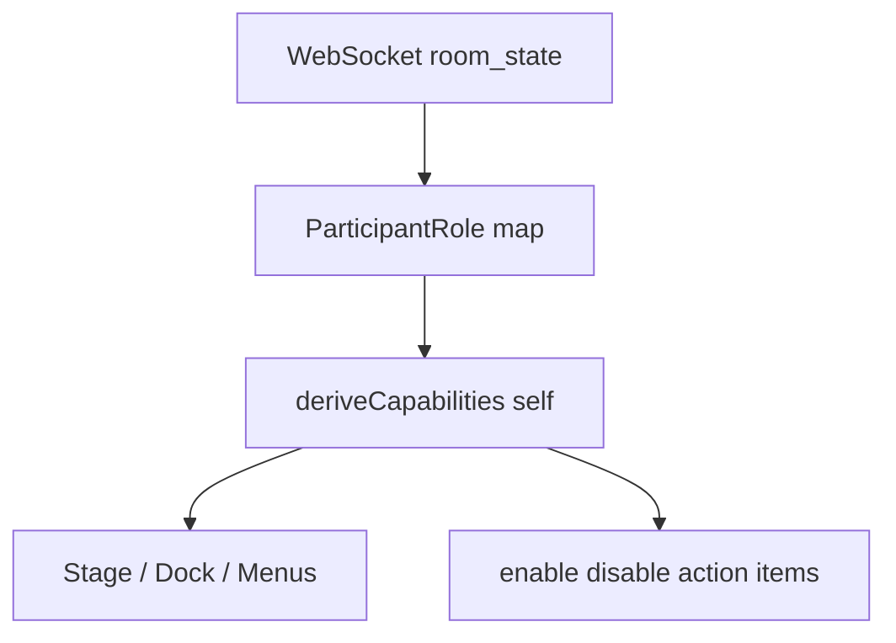
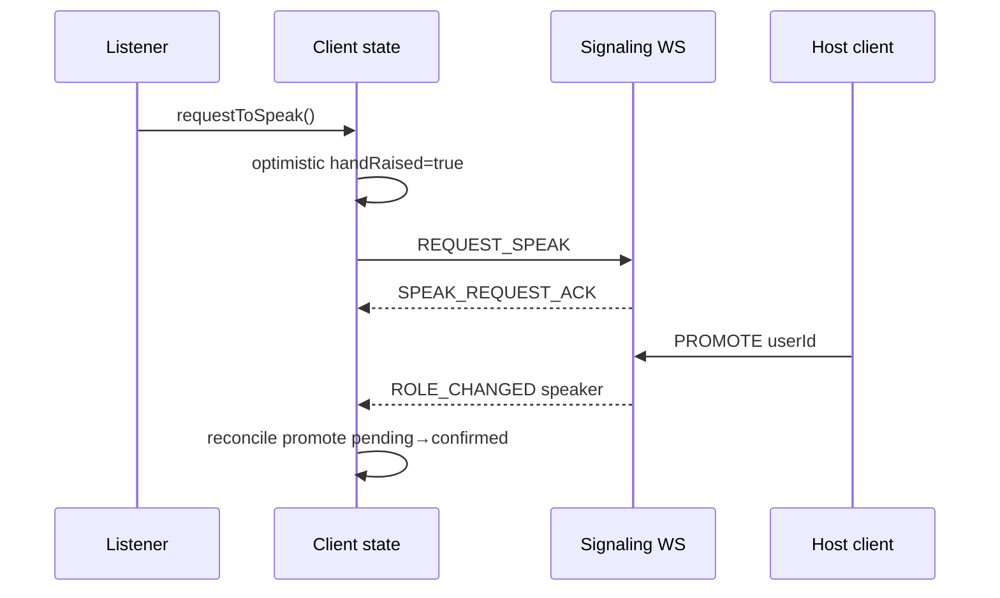
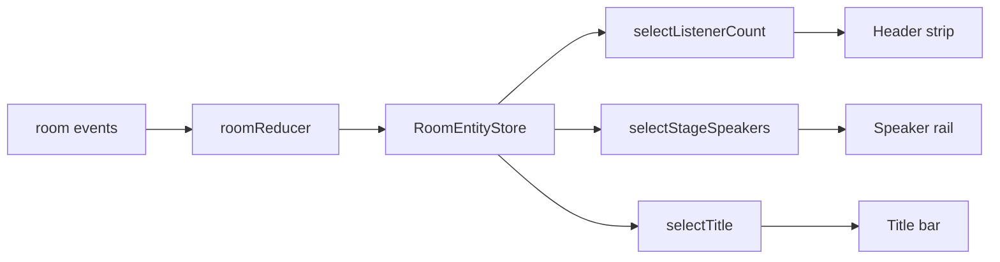
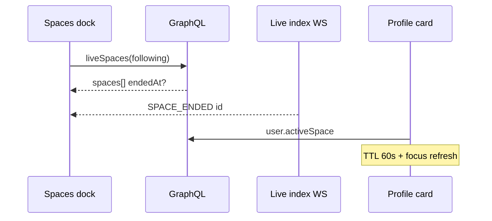
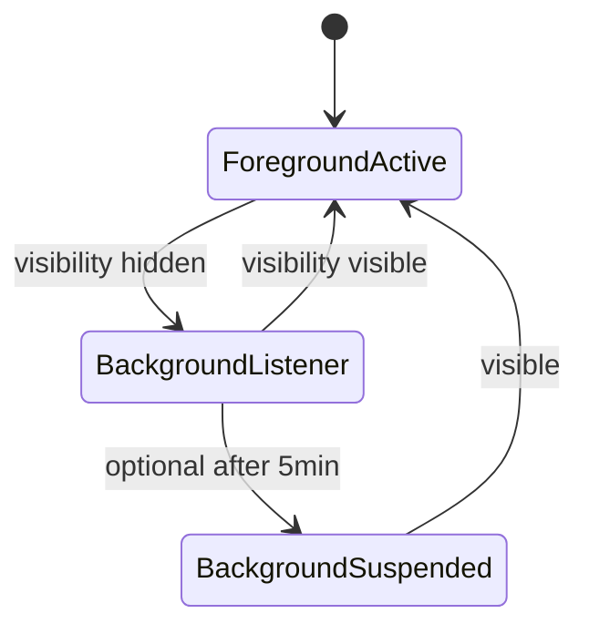
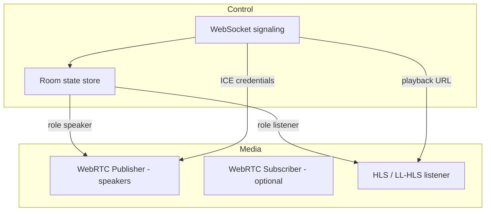
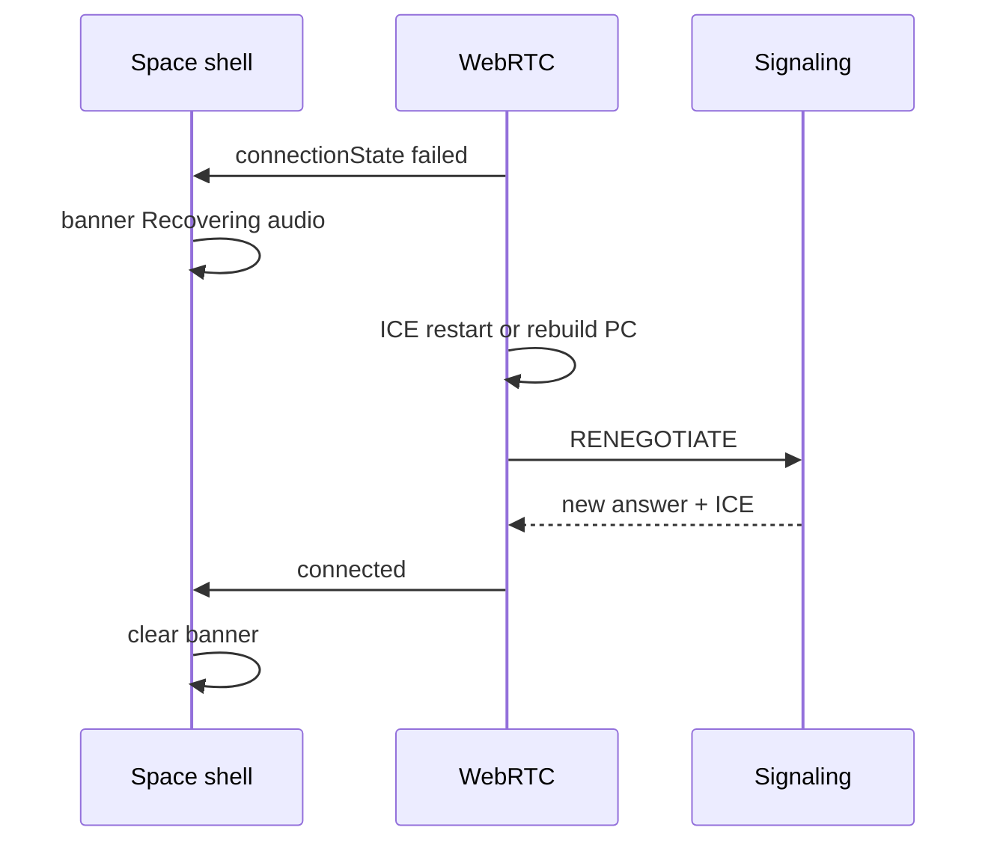
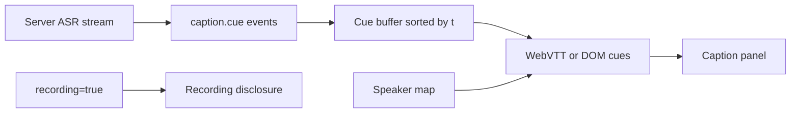
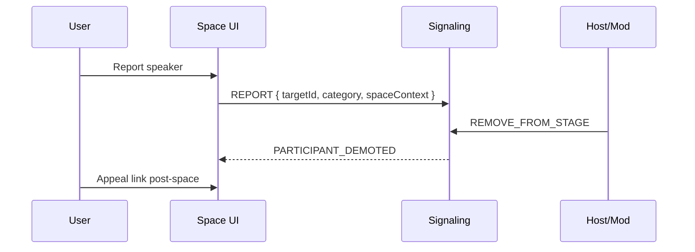
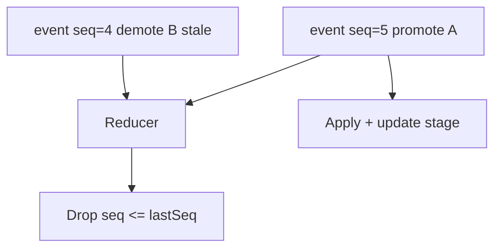

# Section 7 — Spaces, Communities & Live Surfaces (Answers)

Interview-depth answers for Twitter/X live audio and Communities: role-based Spaces UI (host/co-host/speaker/listener), optimistic permission updates, incremental room state, community timelines and mod queues, live discovery with stale-state handling, background listener power savings, WebSocket signaling vs asymmetric WebRTC/CDN media, ICE restart and network switch recovery, live captions and recording disclosures, live moderation UX, out-of-order roster event testing, and universal Space deep links.

---

## Core

### How do you differentiate host, co-host, speaker, and listener roles in the Spaces UI and action menus?

**Problem framing:** A Space is one shell but four materially different experiences — hosts run the room, co-hosts share moderation, speakers publish audio, listeners consume only. Showing the same action sheet to everyone causes permission errors, accidental stage changes, and trust issues (“why can’t I mute them?”). The UI must derive from a **permission matrix**, not hard-coded “if host” branches scattered in components.

**Approach:** Centralize roles in a **RoomCapability** model; render chrome (stage, dock, overflow menus) from capabilities; badge roles in the speaker rail so social context is visible at a glance.



1. **Role enum and hierarchy** —
   ```ts
   type SpaceRole = 'host' | 'co_host' | 'speaker' | 'listener';

   type SpaceCapabilities = {
     canEndSpace: boolean;
     canInviteCoHost: boolean;
     canPromoteToSpeaker: boolean;
     canDemoteSpeaker: boolean;
     canRemoveFromSpace: boolean;
     canMuteOthers: boolean;
     canShareScreen: boolean; // if product supports
     canRequestToSpeak: boolean;
     canPublishAudio: boolean;
     canEditTitle: boolean;
     canManageCaptions: boolean;
   };

   function deriveCapabilities(
     selfRole: SpaceRole,
     targetRole: SpaceRole,
     roomFlags: { ended: boolean; recording: boolean }
   ): SpaceCapabilities {
     if (roomFlags.ended) return allFalse();
     switch (selfRole) {
       case 'host':
         return {
           canEndSpace: true,
           canInviteCoHost: true,
           canPromoteToSpeaker: targetRole === 'listener',
           canDemoteSpeaker: targetRole === 'speaker' || targetRole === 'co_host',
           canRemoveFromSpace: targetRole !== 'host',
           canMuteOthers: true,
           canShareScreen: false,
           canRequestToSpeak: false,
           canPublishAudio: true,
           canEditTitle: true,
           canManageCaptions: true,
         };
       case 'co_host':
         return { /* promote/demote/mute/remove except host/co-host demotion rules */ } as SpaceCapabilities;
       case 'speaker':
         return { canPublishAudio: true, canRequestToSpeak: false, /* ... */ } as SpaceCapabilities;
       case 'listener':
         return { canRequestToSpeak: true, canPublishAudio: false, /* ... */ } as SpaceCapabilities;
     }
   }
   ```

2. **Visual differentiation** — Speaker rail: host gets crown/mic-primary ring; co-host gets secondary badge; speakers get pulsing mic when unmuted; listeners appear only in listener count / “Raised hands” queue, not on stage unless promoted. Overflow menu on avatar: actions filtered by `deriveCapabilities(self, target)`.

3. **Primary dock CTA by role** — Host/co-host: “Manage” + end Space; speaker: mute/unmute + leave stage; listener: “Request” / “Cancel request” + react. Never show disabled End Space to listeners — **omit** unavailable actions (progressive disclosure).

4. **Action menu matrix (simplified)** —

   | Action | Host | Co-host | Speaker | Listener |
   |--------|------|---------|---------|----------|
   | End Space | ✓ | ✗ | ✗ | ✗ |
   | Invite co-host | ✓ | ✗* | ✗ | ✗ |
   | Promote to speaker | ✓ | ✓ | ✗ | ✗ |
   | Demote / remove | ✓ | ✓† | ✗ | ✗ |
   | Mute other | ✓ | ✓ | ✗ | ✗ |
   | Request to speak | ✗ | ✗ | ✗ | ✓ |
   | Publish audio | ✓ | ✓ | ✓ | ✗ |

   *Product may allow co-host invite — encode in matrix, not JSX. †Co-host cannot remove host.

5. **Self vs other** — `SpaceActionSheet` takes `{ actorId, targetId, room }`; compute capabilities per target. Host tapping self sees “End Space”; tapping speaker sees “Remove from speakers”.

6. **Realtime updates** — On `participant.role_changed`, patch local `participants` map; re-run capability selector; animate badge transitions (listener → speaker slides onto stage).

**Tradeoffs:** Single matrix module vs per-component checks — matrix scales when roles grow (scheduled Spaces, paid tickets). Showing all actions disabled educates poorly — hide instead. **Pitfall:** Stale self role after promotion — always trust server ack for `canPublishAudio` before unmuting WebRTC. **Pitfall:** Co-host/host ambiguity when host leaves — server assigns successor; UI must handle `host_transferred` event.

---

### How do you handle "Request to speak", promote/demote, and mute controls with optimistic permission updates?

**Problem framing:** Moderation actions feel laggy at 200–400ms RTT; hosts expect instant mute, listeners expect immediate “hand raised” feedback. Pure pessimistic UI waits on WebSocket round-trips and feels broken. Pure optimistic without rollback lets users think they’re speaking when server denied — worse on live audio.

**Approach:** **Optimistic local intent** with server reconciliation: apply UI immediately for *your* actions and *host-initiated* actions you initiated; show pending state for others; rollback on explicit `permission_denied` or version conflict.



1. **Intent ledger** — Per participant, track `pendingIntents: { kind, at, expiresAt }[]`:
   ```ts
   type PendingIntent =
     | { kind: 'request_speak'; status: 'pending' | 'accepted' | 'denied' }
     | { kind: 'promote'; targetId: string; status: 'pending' }
     | { kind: 'mute'; targetId: string; muted: boolean; status: 'pending' };

   function applyOptimistic(state: RoomState, action: ModerationAction): RoomState {
     switch (action.type) {
       case 'REQUEST_SPEAK':
         return patchParticipant(state, selfId, { handRaised: true, pendingIntents: [...] });
       case 'PROMOTE':
         return patchParticipant(state, action.targetId, {
           role: 'speaker',
           handRaised: false,
           pendingIntents: [{ kind: 'promote', status: 'pending', ... }],
         });
       case 'MUTE':
         return patchParticipant(state, action.targetId, {
           mutedByHost: true,
           pendingIntents: [{ kind: 'mute', muted: true, status: 'pending' }],
         });
     }
   }
   ```

2. **Request to speak** — Listener tap → immediate hand icon + queue position if server sends it; disable double-tap with 2s cooldown. Cancel → optimistic clear. Host sees queue sorted by `requestedAt`.

3. **Promote/demote** — Host/co-host only. Optimistic: move avatar to stage, role badge update. **Do not** start WebRTC publish until `ROLE_CHANGED` confirms `speaker` — show “Joining as speaker…” spinner on mic button.

4. **Mute** — Host mutes speaker: optimistic mic-off icon + local playback gain 0 for that tile (UI preview). Target client receives `FORCE_MUTE` → must stop RTCP outbound regardless of local toggle. Self-mute: optimistic + immediate `track.enabled = false`.

5. **Rollback** — On `ERROR` / `PERMISSION_DENIED` / stale `roomVersion`:
   ```ts
   function reconcile(state: RoomState, event: ServerEvent): RoomState {
     if (event.type === 'permission_denied') {
       return revertIntent(state, event.clientActionId);
     }
     if (event.type === 'room_snapshot') {
       return mergeSnapshot(state, event); // server wins on conflict
     }
     return applyServerEvent(state, event);
   }
   ```
   Toast: “Couldn’t mute — you may not have permission.” Restore hand-raised if request rejected.

6. **Idempotency** — Client generates `actionId` (UUID) per moderation call; server echoes in events; ignore duplicate WS deliveries.

| Action | Optimistic UI | Start media side-effect | Rollback trigger |
|--------|---------------|-------------------------|------------------|
| Request speak | Hand raised | none | denied, left room |
| Promote | On stage, badge | wait for ACK before getUserMedia | demote snapshot |
| Demote | Off stage | stop publish on ACK | n/a if server wins |
| Host mute | Mic off icon | target stops RTCP on FORCE_MUTE | permission_denied |

**Tradeoffs:** Optimistic promote improves perceived speed but brief “ghost speaker” if denied — keep spinner until media path live. Queue order optimistic reorder is risky — only host UI may optimistically reorder on self-initiated promote. **Pitfall:** Optimistic unmute while host-muted — server mute flag must disable local unmute toggle. **Pitfall:** Lost actionId on reconnect — full `room_snapshot` on resume clears pending intents.

---

### How do you show live listener count, speaker avatars, and title updates without full room reload?

**Problem framing:** Spaces run 30–90+ minutes; polling REST for full room state reloads the shell, resets scroll, flickers avatars, and drops ephemeral UI (open sheets, caption prefs). Updates arrive at mixed cadence: title rarely, listener count every few seconds, speaker roster on promotions.

**Approach:** **Incremental patch model** over a stable `roomId` shell: subscribe via WebSocket (or SSE fallback) to typed delta events; normalize into a normalized entity store; UI subscribes via selectors so only affected subtrees re-render.



1. **Event types** — `ROOM_META_UPDATED { title?, topic?, startedAt? }`, `PARTICIPANT_JOINED | LEFT`, `PARTICIPANT_UPDATED { role, muted, avatarUrl }`, `LISTENER_COUNT { total, approximate? }`, `SPEAKER_ACTIVE { userId, speakingEnergy? }`. Each carries `seq` monotonic per room.

2. **Reducer patch** —
   ```ts
   function roomReducer(state: RoomState, event: RoomEvent): RoomState {
     if (event.seq <= state.lastSeq) return state; // dedupe
     switch (event.type) {
       case 'LISTENER_COUNT':
         return { ...state, listenerCount: event.total, lastSeq: event.seq };
       case 'ROOM_META_UPDATED':
         return { ...state, title: event.title ?? state.title, lastSeq: event.seq };
       case 'PARTICIPANT_UPDATED':
         return {
           ...state,
           participants: upsert(state.participants, event.userId, event.patch),
           lastSeq: event.seq,
         };
     }
   }
   ```

3. **Speaker rail** — Stage list derived: `participants.filter(p => p.role !== 'listener').sort(hostFirst)`. Avatar changes patch single entry — React `key={userId}` preserves DOM nodes. Active speaker ring driven by `SPEAKER_ACTIVE` or WebRTC audio level events throttled to 10Hz.

4. **Listener count** — Display rounded bucket when `approximate: true` (“1.2K listening”) to reduce churn; animate digit changes with brief CSS transition, not layout reflow. Avoid updating more than 1Hz in UI even if server sends 5Hz.

5. **Title updates** — Inline editable for host; on blur send `UPDATE_TITLE`; optimistic local title with rollback. Non-hosts read-only label; `ROOM_META_UPDATED` patches without remounting composer.

6. **No full reload triggers** — Reconnect: apply `room_snapshot` once, then deltas only. Route param `spaceId` stable — never `key={spaceId}` on root when only metadata changes.

7. **Virtualized listener list** — If product shows listener drawer, paginate GraphQL cursor; WS only updates count + “friends in space” subset, not full 10K list.

**Tradeoffs:** Approximate listener count reduces anxiety about exact number vs accuracy. Subscribing entire room to one context causes over-render — use Zustand/Redux selectors or `useSyncExternalStore` with memoized selectors. **Pitfall:** Full participant list on every join — throttle bulk sync. **Pitfall:** Title XSS — sanitize server strings before `textContent`.

---

### How do you render community timelines, rules, moderation queues, and membership join/leave flows?

**Problem framing:** Communities are **scoped sub-timelines** with governance — not just another Home feed. Users need rules before joining, mods need queue workflows, members need clear join/leave/request states. Reusing Home timeline verbatim misses pinned rules, membership gates, and mod-only surfaces.

**Approach:** Route-level **Community shell** with tabbed surfaces (Posts, About/Rules, Moderation for mods); timeline uses same virtualized tweet row as Home but different GraphQL query + membership guard; mod queue is a separate prioritized list with action mutations.

```mermaid
flowchart TB
  subgraph CommunityShell
    Header[Community header + join CTA]
    Tabs[Posts | About | Mod Queue*]
    TL[Community timeline]
    Rules[Rules + description]
    Queue[Reported posts queue]
  end
  Header --> MembershipState
  MembershipState -->|member| TL
  MembershipState -->|non-member| Rules
  Tabs --> TL
  Tabs --> Rules
  Tabs --> Queue
```

1. **Membership state machine** —
   ```ts
   type MembershipStatus =
     | 'not_member'
     | 'pending_request'
     | 'member'
     | 'moderator'
     | 'admin'
     | 'banned';

   type CommunityJoinFlow =
     | { action: 'instant_join' }
     | { action: 'request_approval'; questions?: string[] }
     | { action: 'invite_only' };
   ```

2. **Join/leave UX** — Primary CTA in header: “Join” → instant or questionnaire modal → `JoinCommunity` mutation → optimistic `member` with skeleton timeline until first page loads. “Leave” → confirm dialog (lose access to private posts) → mutation → redirect to About or Explore. Pending: disabled “Requested” + cancel request.

3. **Timeline** — Query `CommunityTweets(communityId, cursor)` — same virtualizer as Section 1 with `communityId` in cache key. Non-members see preview (N posts blurred) or rules-only — product flag. Pinned rules post or mod announcement at top via `pinnedTweetId` slot row.

4. **Rules surface** — Static `rules[]` from community metadata; markdown-lite rendering; “Agree and join” on onboarding modal copies rules checkbox (compliance). Edit rules: admin-only form, optimistic list, version number for audit.

5. **Moderation queue** — Mod-only tab; items `{ reportId, tweet, reportReason, reporterCount, createdAt }`; actions Approve (dismiss report), Remove post, Ban user, Escalate. Each action: optimistic remove row from queue + toast undo window 5s. Empty state: “Queue clear.”

6. **Cache isolation** — `queryKey: ['community', id, 'timeline']` separate from Home — leaving community should `removeQueries` for private content. Member role change patches header CTA without route remount.

| Surface | Data source | Gated by |
|---------|-------------|----------|
| Posts tab | CommunityTweets | member (or preview) |
| About/Rules | CommunityById | public |
| Mod queue | CommunityModQueue | moderator+ |
| Join CTA | membership + joinPolicy | auth |

**Tradeoffs:** Single community page with tabs vs nested routes — tabs simpler for mobile, routes better for deep links (`/community/:id/mod`). Preview for non-members drives joins but leaks metadata — balance with product. **Pitfall:** Showing mod queue badge count without WS — poll on tab focus only. **Pitfall:** Join optimistic then fail (banned) — redirect to rules with error.

---

### How do you discover live Spaces from the dock, notifications, and profile cards with stale-state handling?

**Problem framing:** Live discovery is **time-sensitive** — a Space shown as LIVE may have ended 30s ago; profile cards cache “in a Space” badges; dock pill competes with Fleets/audio mini-player. Without TTL and reconciliation, users tap into dead rooms or miss active ones.

**Approach:** **Multi-surface live index** with short TTL, `endedAt` reconciliation, and unified `LiveSpaceRef` entity synced from push, poll-on-focus, and GraphQL fragments.



1. **LiveSpaceRef model** —
   ```ts
   type LiveSpaceRef = {
     spaceId: string;
     hostId: string;
     title: string;
     state: 'scheduled' | 'live' | 'ended';
     startedAt: string;
     endedAt?: string;
     participantPreview: UserId[]; // 3 avatars
     fetchedAt: number;
   };
   ```

2. **Spaces dock** — Horizontal carousel of live Spaces from following + suggested; poll every 60s when visible; `document.visibilitychange` → immediate refresh. Each tile: host avatar, title, listener count (stale OK with ~prefix). Tap → navigate `/i/spaces/:id` with skeleton shell.

3. **Notifications** — “X started a Space” push/in-app: payload includes `spaceId`, `hostId`, `state`. On render, if `fetchedAt` > 5 min, refetch `SpaceById` before showing Join — else deep link with loading. Ended: replace CTA with “Space ended” + replay if available.

4. **Profile cards** — `User.activeSpace` GraphQL field on hover card and profile header. Cache TTL **60s**; on card open, background revalidate. Badge “Live in a Space” only if `state === 'live' && !endedAt`. Click → join flow.

5. **Stale-state handling** —
   ```ts
   function isStale(ref: LiveSpaceRef, now = Date.now()): boolean {
     return now - ref.fetchedAt > 60_000;
   }

   async function openSpace(spaceId: string) {
     const cached = store.get(spaceId);
     if (!cached || isStale(cached)) {
       const fresh = await fetchSpace(spaceId);
       if (fresh.state === 'ended') return showEndedModal(fresh);
       store.set(spaceId, fresh);
     }
     navigateToRoom(spaceId);
   }
   ```
   Subscribe global `SPACE_ENDED` on WS when any cached live id set non-empty — patch all surfaces instantly.

6. **Dedup** — Same Space from dock + notification + profile → one normalized store entry keyed by `spaceId`.

| Surface | Refresh trigger | Stale UX |
|---------|-----------------|----------|
| Dock | 60s + focus | shimmer recount |
| Notification | on click | refetch if old |
| Profile badge | 60s TTL | hide if ended after refetch |

**Tradeoffs:** Aggressive poll keeps dock fresh but costs API — WS fanout cheaper at scale if available. Hiding stale badges vs showing “may have ended” — prefer refetch-on-click over pessimistic hide. **Pitfall:** Client clock skew on scheduled Spaces — trust server `state` only. **Pitfall:** Opening ended Space without check — always validate on entry route.

---

### How do you minimize battery and CPU use when the user is a listener-only participant in the background tab?

**Problem framing:** Listener path still runs **audio decode**, **WebSocket**, and optionally **animations** (waveforms, speaking rings). Background tab on mobile Safari/Chrome throttles timers but not necessarily MediaElement work — users report drain and thermal throttling during 2hr Spaces.

**Approach:** Tiered **power profile** keyed on `document.visibilityState`, role=`listener`, and `navigator.connection.saveData`; degrade non-essential work before touching audio continuity.



1. **Page Visibility API** —
   ```ts
   document.addEventListener('visibilitychange', () => {
     const bg = document.hidden;
     if (role !== 'listener') return; // speakers need full capture
     mediaController.setProfile(bg ? 'background' : 'foreground');
     wsClient.setHeartbeatInterval(bg ? 30_000 : 15_000);
     uiStore.setAnimationsEnabled(!bg);
   });
   ```

2. **Media path** — Listeners on **HLS/MediaElement** or passive WebRTC recv-only: background → pause visualizer canvases; reduce ABR cap to lowest acceptable rung (64–96kbps); disable `requestVideoFrameCallback` / AnalyserNode. Keep **one** audio output — no duplicate decode paths.

3. **WebSocket** — Increase ping interval in background; batch non-critical events (listener count) to 1 update/2s client-side. On `visibilitychange` visible → send `SYNC_REQUEST` for missed deltas (seq gap).

4. **Rendering** — Stop speaker energy animations; static avatars. React: lower priority updates via `startTransition` for count labels. No `requestAnimationFrame` loops in background.

5. **Wake lock** — **Do not** hold screen wake lock for listeners in background. Release on hide unless user explicitly “keep listening” with picture-in-picture (PiP) where supported.

6. **Optional suspend** — After 5 min hidden + listener + no PiP: mute UI updates entirely except audio; detach waveform workers. iOS may suspend tab — `pageshow`/`resume` handler refetches room snapshot.

7. **Picture-in-Picture** — Web: `audioElement` PiP or mini-player dock — keeps audio alive with lighter chrome than full Space UI.

| Component | Foreground | Background listener |
|-----------|------------|---------------------|
| Audio decode | ABR auto | capped low bitrate |
| WS heartbeat | 15s | 30s |
| Avatar animations | on | off |
| Listener count UI | 1 Hz | on visible only |
| getUserMedia | n/a | n/a |

**Tradeoffs:** Aggressive WS slowdown may miss rapid demotion while background — resync on focus. Low ABR saves power but worse audio — step up immediately on foreground. **Pitfall:** AnalyserNode on remote stream for “speaking” UI — expensive; use server `SPEAKER_ACTIVE` in background. **Pitfall:** Hidden tab + speaker role — never throttle capture; prompt “You’re speaking in background.”

---

## Deep

### How do you architect signaling (WebSocket) vs media (WebRTC for speakers, CDN/stream for listeners) on the client?

**Problem framing:** Spaces mixes **control-plane** (who’s on stage, mute, permissions) with **media-plane** (audio bytes). Collapsing both into one WebRTC mesh doesn’t scale to 5K listeners; pure CDN can’t give speakers sub-second duplex. Twitter’s asymmetric model: **WebSocket for state**, **WebRTC publish for speakers**, **CDN/HLS (or SFU fanout recv) for listeners**.

**Approach:** **Split stack** — `SignalingClient` (WS) owns room truth; `MediaSession` factory picks `Publisher`, `Subscriber`, or `ListenerStream` by role; shared `roomId` correlates both.



1. **Module boundaries** —
   ```ts
   interface SignalingClient {
     connect(spaceId: string): void;
     on(event: 'room_state' | 'media_credentials', handler): void;
     send(action: ClientAction): void;
   }

   interface MediaSession {
     start(): Promise<void>;
     stop(): void;
     setMuted(m: boolean): void;
   }

   function createMediaSession(role: SpaceRole, creds: MediaCredentials): MediaSession {
     if (role === 'listener') return new HlsListenerSession(creds.playbackUrl);
     return new WebRtcPublisherSession(creds.turn, creds.sfU);
   }
   ```

2. **WebSocket responsibilities** — Join/leave, role changes, mute commands, speaker roster, listener count, caption lines metadata, recording flags, **not** audio payloads. JSON or binary protobuf frames; heartbeat + reconnect with `lastSeq`.

3. **Speaker WebRTC** — `getUserMedia({ audio: true })` → `RTCPeerConnection` to SFU; one outbound audio track; simulcast off for audio. ICE/TURN from WS `MEDIA_TOKEN` event. Handle `iceRestart` on network change (see Q8).

4. **Listener CDN path** — WS delivers `playbackUrl` (LL-HLS `.m3u8` or similar); `hls.js` or native Safari HLS; 3–6s latency acceptable for passive listeners. Switch to WebRTC recv only for “interactive listener” product modes if any — still not full mesh.

5. **Lifecycle coupling** — On `ROLE_CHANGED` to speaker: tear down HLS session, start WebRTC after `getUserMedia` grant. Demote: stop RTCP tracks, start HLS from latest URL. Never two audio outputs — crossfade or hard cut with 100ms fade.

6. **Error isolation** — WS disconnect ≠ media death — listener HLS may keep playing while reconnecting WS for metadata. UI banner: “Reconnecting room info…” not full-page error.

| Plane | Protocol | Latency target | Scales to |
|-------|----------|----------------|-----------|
| Signaling | WebSocket | <500ms | all participants |
| Speaker uplink | WebRTC → SFU | ~200ms | tens of speakers |
| Listener downlink | HLS/CDN | 3–10s | millions |

**Tradeoffs:** Dual stack complexity vs operational flexibility — industry standard for live audio at scale. LL-HLS narrows latency gap but costs CDN. **Pitfall:** Starting WebRTC before role ACK — echo/permission leak. **Pitfall:** WS message ordering — use seq (Q11). **Pitfall:** CORS/cookie on HLS vs authenticated WS — separate token for playback URL.

---

### How do you recover from ICE failure or mid-Space network switch without dropping the room shell?

**Problem framing:** Wi-Fi → LTE handoff, VPN toggle, or TURN glitch causes `RTCPeerConnection` `failed` / `disconnected`. Naive handlers that unmount the Space shell destroy chat, captions, and user context; users re-enter as new joiner losing queue position.

**Approach:** **Resilient shell, soft media recovery** — room UI persists on route; media layer enters `recovering` substate; ICE restart or full renegotiation; WS resync parallel; only fatal errors show leave dialog.



1. **Connection state machine** —
   ```ts
   type MediaConnectionState =
     | 'idle'
     | 'connecting'
     | 'connected'
     | 'recovering'
     | 'failed_terminal';

   pc.onconnectionstatechange = () => {
     if (pc.connectionState === 'failed') scheduleIceRestart();
     if (pc.connectionState === 'disconnected') startDisconnectTimer(5_000);
   };
   ```

2. **ICE restart** — Prefer `pc.restartIce()` + renomination on same PC when supported; else create new `RTCPeerConnection`, re-add tracks, exchange via WS `REOFFER`/`REANSWER`. Cap retries: 3 ICE restarts in 60s exponential backoff.

3. **Network switch** — Listen `navigator.connection?.addEventListener('change')` and `online`/`offline` window events. On `online`, parallel: WS reconnect + ICE restart. **Do not** navigate away.

4. **Listener HLS** — On network blip, `video/audio.error` → `hls.recoverMediaError()` or reload manifest with cache-bust; shell stays. Show spinner overlay on audio bar only.

5. **WS + media independence** — Shell reads room state from store populated by WS; if WS up but media down, show “Audio interrupted — reconnecting…” with retry button calling `mediaSession.reconnect()`.

6. **User-initiated leave vs recover** — Distinguish `userLeft` flag from `recovering` — never auto-close modal on ICE fail. After max retries, `failed_terminal` → offer “Leave Space” / “Try again” (full media rebuild).

7. **Background tab** — ICE may fail silently; on `visibilitychange` visible, probe connection and restart if not `connected`.

**Tradeoffs:** ICE restart cheaper than full remount but not universal on old Safari — fallback rebuild. Keeping HLS alive during speaker recovery irrelevant — speakers don’t use HLS uplink. **Pitfall:** Duplicate audio after rebuild — `stop()` old tracks before new PC. **Pitfall:** Unmounting React root on error — preserve `spaceId` route and store.

---

### How do you implement live captions, speaker labels, and recording disclosures for accessibility and compliance?

**Problem framing:** Live audio excludes deaf/hard-of-hearing users without **captions**; multi-speaker rooms need **speaker attribution**; many jurisdictions require **recording consent** when Spaces are recorded. Captions arrive async, may lag audio, and must work with screen readers without duplicating noisy live regions.

**Approach:** Caption pipeline as **timed text track** (WebVTT or custom cue list) bound to speaker ids; persistent **recording disclosure** component driven by WS flag; a11y via `aria-live` politeness tiers and user prefs.



1. **Caption events** —
   ```ts
   type CaptionCue = {
     id: string;
     speakerId: string;
     text: string;
     startMs: number;
     endMs?: number;
     isFinal: boolean;
   };
   ```

   WS: `CAPTION_CUE` with monotonic `cueId`. Client buffer sorted by `startMs`; merge partials (`isFinal: false`) into same id; drop superseded partials.

2. **Rendering** — Dedicated caption panel (user toggle + auto-on if system `prefers-reduced-motion` / a11y setting). Show `@handle` or display name from participant map; highlight active speaker tile in sync. Max 2–3 lines; auto-scroll with manual scroll lock if user scrolls up.

3. **WebVTT / track element** — For replay/VOD, attach `track kind=captions srclang=en` on audio/video element. Live: custom DOM for lower latency than rebuilding VTT files.

4. **Screen readers** — `aria-live="polite"` on caption container; **throttle** announcements to finalized cues only (every 2–3s batch) to avoid interrupting navigation. Separate control labels: “Captions on, press C to hide.”

5. **Speaker labels on stage** — Each avatar: visible name + role; `aria-label={`${name}, ${role}, ${muted ? 'muted' : 'speaking'}`}`. Active speaker: `aria-current="true"` on rail item.

6. **Recording disclosure** — When WS `recording: true` or room metadata `isRecorded`: persistent banner “This Space is being recorded” with link to policy; on join modal **before** audio connect: checkbox or acknowledge in regulated regions. Host start recording → broadcast event; listeners see non-dismissible badge until recording stops.

7. **Compliance hooks** — Export caption transcript post-Space for replay; `aria-describedby` linking banner to help article. Mute/leave always available regardless of recording state.

| Element | a11y | Compliance |
|---------|------|------------|
| Live captions | polite live region | WCAG 1.2.4 baseline |
| Speaker label | avatar aria-label | attribution |
| Recording banner | assertive on start | consent jurisdictions |

**Tradeoffs:** Partial caption updates flicker if rendered raw — replace in place by `cueId`. Auto-captions error rate — show “Captions may be inaccurate.” **Pitfall:** `aria-live="assertive"` on every partial — SR chaos. **Pitfall:** Recording flag only on client — must come from server, not host honor system.

---

### How do you moderate live audio — report flow, stage removal, and appeal UX tied to real-time room state?

**Problem framing:** Live moderation is **time-critical** — harmful speech needs report + remove faster than post-hoc tweet review. UX must tie **report** to room context (who, when in Space), **stage removal** to immediate mute + demote, and **appeals** to post-session workflows without blocking the live shell for other participants.

**Approach:** In-room report sheet enriched with live metadata; host/mod actions via signaling; reporter feedback optimistic; appeal flow async linked to `reportId` + replay timestamp.



1. **Report flow** — Long-press avatar or overflow → Report → categories ( abuse, violence, etc. ) + optional detail. Attach **context bundle**:
   ```ts
   type SpaceReportContext = {
     spaceId: string;
     reportedUserId: string;
     reporterRole: SpaceRole;
     serverTimeMs: number;
     captionSnippet?: string; // last N s if captions on
   };
   ```
   Submit → toast “Thanks — we’ll review” + local `reportSubmitted` flag; don’t block audio.

2. **Stage removal** — Host/co-host: “Remove from Space” / “Remove from speakers” → confirm → `REMOVE_PARTICIPANT` or `DEMOTE` via WS. Optimistic: demote + mute tile; target receives full-screen “You were removed” with reason if server sends. Remaining users see avatar leave stage — no graphic of reason (privacy).

3. **Listener reports** — Can report host or speakers; cannot self-remove others. High-severity auto-escalation server-side may end Space — client handles `ROOM_ENDED reason=moderation` with neutral copy.

4. **Trust & safety overlay** — Automated intervention: WS `FORCE_END` or mute-all; UI shows “This Space has been limited” banner. Mod queue (internal) not in consumer UI — community mods differ from Spaces global T&S.

5. **Appeal UX** — After removal or report outcome notification (hours later): deep link to `AppealFlow(reportId)` with Space title, date, policy cited. **Not** in live room — separate settings/support surface. Show status: received → under review → upheld/overturned.

6. **Realtime consistency** — Report doesn’t instantly remove — unless automated. Host action and server ban may race — server snapshot wins; removed user’s client must listen for `YOU_REMOVED` and stop publish immediately.

| Actor | In-room actions | Post-space |
|-------|-----------------|------------|
| Host/co-host | remove, mute, end | n/a |
| Listener | report | appeal via notification |
| Platform | force end, shadow mute | email decision |

**Tradeoffs:** Captions in report context helps reviewers but PII-sensitive — truncate and secure transmit. In-room appeal CTAs distract — keep async. **Pitfall:** Reporter expecting instant eject — set expectations in copy. **Pitfall:** Removed user still hearing via HLS lag — server must revoke playback token.

---

### How do you test Spaces UI when speaker roster events arrive out of order during rapid promotions?

**Problem framing:** Under load, WS may deliver `PROMOTE userB` before `DEMOTE userA`, or duplicate `PARTICIPANT_UPDATED` with old role after new. Rapid host taps cause **out-of-order** events; last-write-wins by arrival breaks stage truth (two hosts, ghost speakers).

**Approach:** **Versioned events** — per-participant `version` or room-level `seq`; reducer applies only if `event.seq > lastAppliedSeq` (room) or `event.participantVersion > local.version` (per user); integration tests with fixture replay engines.



1. **Sequencing model** —
   ```ts
   type Participant = {
     userId: string;
     role: SpaceRole;
     version: number; // server increment per change
   };

   type RoomState = {
     lastSeq: number;
     participants: Map<string, Participant>;
   };

   function applyParticipantEvent(state: RoomState, e: ParticipantEvent): RoomState {
     if (e.roomSeq <= state.lastSeq) return state;
     const cur = state.participants.get(e.userId);
     if (cur && e.participantVersion <= cur.version) return state; // stale
     return {
       ...state,
       lastSeq: Math.max(state.lastSeq, e.roomSeq),
       participants: upsert(state.participants, e.userId, {
         ...cur,
         ...e.patch,
         version: e.participantVersion,
       }),
     };
   }
   ```

2. **Gap detection** — If `roomSeq > lastSeq + 1`, request `room_snapshot` — don’t apply partial gap without snapshot (avoids compounding errors).

3. **UI test harness** — Deterministic **event replayer**:
   ```ts
   async function replayOutOfOrder(events: RoomEvent[]) {
     const shuffled = shuffle(events); // or worst-case: reverse promotions
     for (const e of shuffled) store.dispatch(applyEvent(e));
     expect(selectStage(store.getState())).toMatchSnapshot('final stage');
   }
   ```

4. **Scenario fixtures** — Rapid promote A,B,C then demote all; duplicate `listener` event after `speaker`; `host_transferred` interleaved with promotes. Assert: exactly one host, speakers ⊆ {promoted}, no listener on stage.

5. **Component tests** — `@testing-library/react` with mocked WS: emit events in wrong order, assert rail order and badge counts. Visual regression on speaker rail for reorder.

6. **E2E** — Two browsers Playwright: host spams promote; listener asserts final roster via `data-testid=speaker-{userId}` count — flaky network simulated with proxy delay injection.

7. **Production debug** — Dev overlay shows `lastSeq` / per-user `version`; log `stale_event_dropped` to RUM.

| Test type | What it catches |
|-----------|-----------------|
| Reducer unit | stale version, dup seq |
| Replayer integration | out-of-order batches |
| E2E two-client | real WS ordering |

**Tradeoffs:** Snapshot on gap adds latency vs hoping order holds — necessary at scale. Vector clocks overkill — monotonic `seq` + per-entity version enough. **Pitfall:** Tests that always send ordered events — useless for this bug class. **Pitfall:** Optimistic promote without version bump — reconcile by overwriting with server version on any ACK.

---

### How do you share a Space link that opens the correct client surface (web vs app) with graceful fallback?

**Problem framing:** Space URLs (`https://twitter.com/i/spaces/:id`, `https://x.com/i/spaces/:id`) shared in tweets/DMs must **open the native app** when installed (better audio, background listen) but **work on web** when not — without trap pages, broken intent loops, or losing room context on fallback.

**Approach:** **Universal link / App Link** with web route as source of truth; smart banner optional; web shell loads minimal join UI immediately; deferred deep link params preserved in query hash.

```mermaid
flowchart TD
  Share[Share space URL] --> Click[User opens link]
  Click --> OS{OS universal link}
  OS -->|app installed| App[Native Space surface]
  OS -->|web| Web[/i/spaces/:id]
  Web --> Check{state live?}
  Check -->|yes| Join[Web Space shell]
  Check -->|ended| Replay[Ended / replay CTA]
  App -->|not installed| Store[Store redirect optional]
```

1. **Canonical URL** — Always share `https://x.com/i/spaces/{spaceId}` (or `twitter.com` redirect). Include `?s=tk` source param for analytics only — not required for join.

2. **Universal Links (iOS) / App Links (Android)** — Associated domain hosts `apple-app-site-association` / `assetlinks.json` mapping `/i/spaces/*` to app. App registers same path; OS opens app without Safari interstitial when installed.

3. **Web route behavior** — `/i/spaces/:id` SSR or client:
   ```ts
   // route loader
   async function spaceLoader({ params }) {
     const space = await fetchSpace(params.id);
     return { space, prefersApp: detectMobile() };
   }
   ```
   Render **immediately**: title, host, Live/Ended badge, Join button — don’t block on media. Parallel: auth check, fetch playback/signaling tokens on join click.

4. **Smart App Banner** — Optional `<meta name="apple-itunes-app" content="app-id=..., app-argument=/i/spaces/id">` on mobile web — user choice, not forced redirect.

5. **Graceful fallback matrix** —

   | Context | Behavior |
   |---------|----------|
   | Desktop web | full web Space |
   | Mobile web, no app | web Space + install CTA |
   | Mobile, app installed | universal link → app |
   | Ended Space | replay card or “Space ended” |
   | Logged out | preview + login to join |

6. **Avoid broken patterns** — No exclusive `twitter://` scheme links in share text (breaks desktop). Custom scheme as **secondary** after timeout if product still uses it — prefer universal links. If using intent URL on Android, include `S.browser_fallback_url`.

7. **Clipboard / in-app WebView** — Instagram in-app browser: universal links may not fire — web join must work with WebRTC/HLS limits; show “Open in Safari/Chrome for best experience” when `detectInAppBrowser()`.

8. **OG tags** — `og:title`, `og:description`, `twitter:card` for link preview in tweet composer — space title + host; image host avatar. Preview click lands same `/i/spaces/id` path.

```html
<meta property="og:title" content="Join [Host]'s Space: [Title]" />
<meta name="twitter:app:name:iphone" content="X" />
<meta name="twitter:app:url:iphone" content="twitter://spaces/id/..." />
<link rel="alternate" href="android-app://com.twitter.android/..." />
```

**Tradeoffs:** Universal links fail if user long-press “Open in browser” — web must stand alone. Forcing app redirect harms SEO and desktop shares. **Pitfall:** Intent loop without fallback URL. **Pitfall:** spaceId case sensitivity — normalize lowercase in router. **Pitfall:** Auth redirect dropping deep link — post-login return to `/i/spaces/:id` via `state` param.

---
