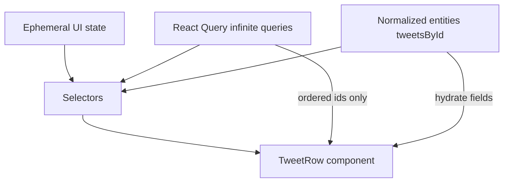
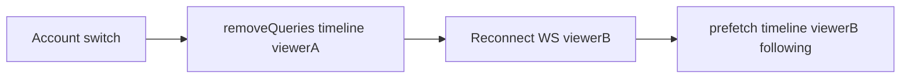
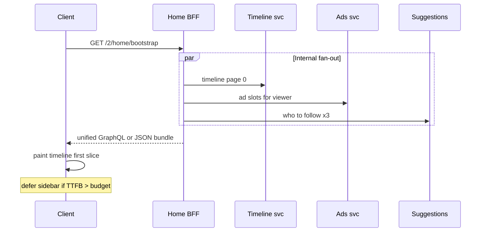
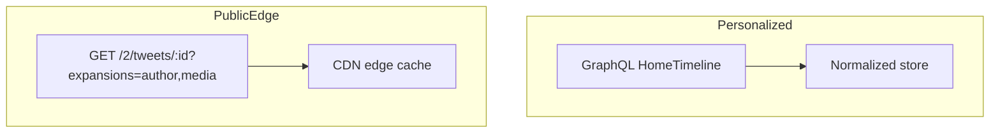
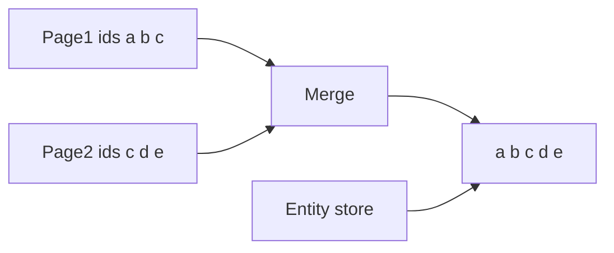
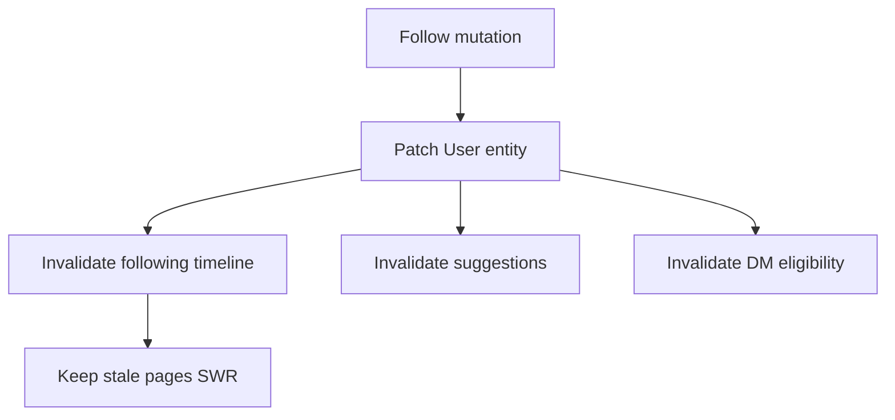
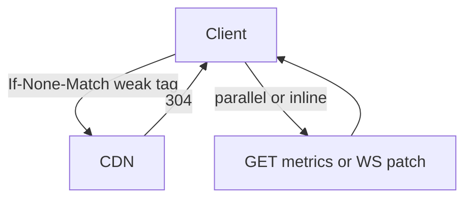

# Section 8 — Client State, API Layer & Caching (Answers)

Interview-depth answers for Twitter/X client architecture: separating ephemeral UI from server cache and normalized entities, query key design for multi-account timelines, stale-while-revalidate profiles and config, BFF aggregation vs parallel REST, first-paint request coalescing, rate-limit UX, GraphQL vs REST at read scale, cursor-stable infinite cache merges, service worker and HTTP edge caching, surgical graph invalidation, partial GraphQL error handling, and ETag strategies for tweet detail with fresh engagement counts.

---

## Core

### What belongs in ephemeral UI state vs React Query/SWR cache vs normalized entity store (tweet by id)?

**Problem framing:** At X-scale, the same tweet appears in home, profile, search, notifications, and DMs. Stuffing everything into one React state tree causes over-render and stale duplicates; stuffing everything into React Query page blobs prevents cross-surface like-count updates. Interviewers want a **three-layer model** with clear ownership and merge rules.

**Approach:** Partition by **lifetime and fan-out**:

| Layer | Owns | Examples | Lifetime |
|-------|------|----------|----------|
| **Ephemeral UI** | View-local, discardable | Scroll offset, open compose sheet, hover card anchor, `expanded` on long tweet, active tab, modal stack, drag state | Session / route |
| **Server cache (React Query / SWR)** | Ordered lists, pagination, fetch metadata | Timeline pages, profile tab cursors, search results, `isFetching`, `dataUpdatedAt`, stale flags | Until invalidated or GC |
| **Normalized entity store** | Identity-keyed records | `tweetsById`, `usersById`, `mediaById`, conversation headers | Until entity deleted or account switch purge |



1. **Ephemeral UI** — Zustand slice or component `useState` for chrome that never round-trips:
   ```ts
   type FeedUiState = {
     feedMode: 'following' | 'for_you';
     scrollAnchor: { tweetId: string; offsetPx: number } | null;
     newPostsBannerCount: number;
     composeOpen: boolean;
     replyTargetTweetId: string | null;
   };
   ```
   Do **not** put scroll position in React Query — it is not server data.

2. **React Query / SWR** — Holds **references**, not full tweet graphs:
   ```ts
   type TimelinePage = {
     ids: string[];
     cursorBottom: string | null;
     cursorTop: string | null;
     fetchedAt: number;
   };
   // queryKey: ['timeline', viewerId, feedMode]
   // data: InfiniteData<TimelinePage>
   ```
   Pages store `ids[]` only; hydration reads `tweetsById[id]`.

3. **Normalized entity store** — Single source for tweet body, author ref, media, counts:
   ```ts
   type TweetEntity = {
     id: string;
     text: string;
     authorId: string;
     createdAt: string;
     likeCount: number;
     replyCount: number;
     repostCount: number;
     mediaIds: string[];
     _meta: { version: number; pending?: boolean };
   };

   function upsertTweet(store: EntityStore, tweet: TweetEntity) {
     const prev = store.tweetsById[tweet.id];
     store.tweetsById[tweet.id] = prev
       ? mergeTweet(prev, tweet) // monotonic counts, newer wins on text
       : tweet;
   }
   ```
   Like/reply mutations patch **one** `tweetsById` entry; all surfaces re-render via selectors.

4. **Write path** — Optimistic compose inserts `pending:*` into entity store + prepends id to active timeline query; on success, reconcile id swap (`pending:uuid` → real `id_str`).

5. **Relay alignment** — GraphQL normalized cache is the entity store; React Query can be dropped if Relay handles connections — same split: connection edges vs record store.

6. **What never goes where** —

   | Data | Wrong home | Right home |
   |------|------------|------------|
   | Like count | Ephemeral UI | Entity store |
   | Page 3 cursor | Entity store | React Query page |
   | Virtualizer range | React Query | Ephemeral UI |
   | User avatar URL | Duplicated per page blob | Entity store `usersById` |

**Tradeoffs:** Three layers add plumbing (`selectTweet(id)` hooks) vs one giant cache. Normalized store requires merge discipline — stale page arrays pointing at deleted tweets need tombstones. **Pitfall:** Full tweet objects inside every infinite page — 5× memory when same viral tweet appears in home + profile + search. **Pitfall:** Putting `feedMode` in entity store — mode is UI/query scope, not tweet property.

---

### How do you key timeline queries (`feedMode`, `cursor`, `viewerId`) for correct invalidation on account switch?

**Problem framing:** Power users switch among 2–5 accounts. A cache key missing `viewerId` shows Account B's home while Account A's auth cookie still lingers in a worker — catastrophic. Keys that embed `cursor` in the root key break pagination; keys that ignore `feedMode` bleed Following into For You.

**Approach:** **Hierarchical query keys** with `viewerId` and `feedMode` at the root; cursors live inside page params, never in the static key prefix. On account switch, **scoped purge** not global clear.

```ts
// Query key factory
export const timelineKeys = {
  all: (viewerId: string) => ['timeline', viewerId] as const,
  feed: (viewerId: string, feedMode: FeedMode) =>
    [...timelineKeys.all(viewerId), feedMode] as const,
  // cursor is pageParam, NOT key segment
};

// React Query infinite query
useInfiniteQuery({
  queryKey: timelineKeys.feed(viewerId, feedMode),
  queryFn: ({ pageParam }) =>
    fetchTimeline({ viewerId, feedMode, cursor: pageParam }),
  initialPageParam: null as string | null,
  getNextPageParam: (lastPage) => lastPage.cursorBottom,
});
```

1. **Key segments and purpose** —

   | Segment | Required | Invalidation trigger |
   |---------|----------|----------------------|
   | `'timeline'` | namespace | never alone |
   | `viewerId` (`rest_id`) | yes | account switch → remove subtree |
   | `feedMode` | yes | tab switch → separate cache |
   | `cursor` | **pageParam only** | append pages, not new query |

2. **Account switch handler** —
   ```ts
   async function switchAccount(nextViewerId: string) {
     const prevViewerId = getActiveViewerId();
     await flushPendingMutations(prevViewerId);
     queryClient.removeQueries({ queryKey: timelineKeys.all(prevViewerId) });
     queryClient.removeQueries({ queryKey: ['notifications', prevViewerId] });
     queryClient.removeQueries({ queryKey: ['dm', prevViewerId] });
     // Shared entities: drop or partition by viewerId tag
     entityStore.purgePartition(prevViewerId);
     setActiveViewerId(nextViewerId);
     reconnectWebSocket(nextViewerId);
   }
   ```

3. **Do not key on screen name** — `viewerId` is stable; `@handle` changes break cache on rename.

4. **Prefetch isolation** — Hover prefetch must pass current `viewerId`: `prefetchInfiniteQuery({ queryKey: timelineKeys.feed(viewerId, 'following'), ... })`.

5. **Multi-tab** — `BroadcastChannel('account')` syncs active viewer; each tab's query cache uses same key factory so Account A tab cannot read Account B keys if viewerId in key.

6. **Stale closure guard** — `queryFn` reads `viewerId` from closure captured at fetch time; include `viewerId` in request header (`X-Act-As-User`) and reject mismatch responses.



**Tradeoffs:** Partitioning entity store by viewer doubles memory for shared public tweets — acceptable vs privacy bug; optional global read-only cache for public tweets with viewer-specific overlays (like state). **Pitfall:** `queryClient.clear()` on switch — nukes static config cache; use scoped remove. **Pitfall:** Cursor in query key → every page is orphan cache entry.

---

### How do you implement stale-while-revalidate for profiles and static config with `revalidateOnFocus` tradeoffs?

**Problem framing:** Profiles and feature flags are read constantly but change infrequently; users expect **instant paint** from cache on back-navigation. Pure `cacheTime: 0` hammers GraphQL at millions of QPS; pure `staleTime: Infinity` shows wrong follower counts after viral moments. `revalidateOnFocus` refreshes on every tab focus — good for DMs, noisy for profile headers.

**Approach:** **Tiered SWR policy** by resource volatility; show cached data immediately, background refetch with subtle UI reconciliation.

```ts
const cachePolicy = {
  staticConfig: {
    staleTime: 30 * 60_000,      // 30 min
    gcTime: 24 * 60 * 60_000,
    refetchOnWindowFocus: false,
    refetchOnReconnect: true,
  },
  userProfile: {
    staleTime: 60_000,           // 1 min
    gcTime: 10 * 60_000,
    refetchOnWindowFocus: 'always', // but debounced — see below
  },
  profileTimeline: {
    staleTime: 30_000,
    refetchOnWindowFocus: false, // WS + pull-to-refresh instead
  },
} as const;
```

1. **Stale-while-revalidate flow** —
   ```ts
   function useProfile(userId: string) {
     return useQuery({
       queryKey: ['user', viewerId, userId],
       queryFn: () => fetchUser(userId),
       ...cachePolicy.userProfile,
       placeholderData: (prev) => prev, // SWR: show stale while fetching
     });
   }
   ```
   On mount: render cached `User` immediately; if `isStale`, fire background `refetch()`; patch normalized store on arrival.

2. **Static config** (`/1.1/help/settings.json`, feature switches, emoji map) — Long `staleTime`, versioned by `configVersion` in bootstrap payload. SW or HTTP cache (see Deep Q3) serves shell; client refetches only on version mismatch or 24h TTL.

3. **`revalidateOnFocus` tradeoffs** —

   | Surface | refetchOnFocus | Rationale |
   |---------|----------------|-----------|
   | Profile header (counts, bio) | Debounced true | User expects fresh counts when returning |
   | Home timeline | false | WS + manual refresh; focus refetch causes scroll jank |
   | Notifications badge | true | Small payload, high freshness need |
   | Static config | false | Wastes bandwidth |

4. **Debounced focus refetch** — Global listener coalesces focus events within 5s:
   ```ts
   let lastFocusRefetch = 0;
   window.addEventListener('visibilitychange', () => {
     if (document.visibilityState !== 'visible') return;
     if (Date.now() - lastFocusRefetch < 5000) return;
     lastFocusRefetch = Date.now();
     queryClient.invalidateQueries({ queryKey: ['user'], refetchType: 'active' });
   });
   ```

5. **Visual reconciliation** — Follower count animates or updates quietly; avoid full header skeleton on background refetch (`isFetching && !isLoading` → no layout shift).

6. **CDN + client** — Profile metadata GET with `Cache-Control: private, max-age=60`; client SWR aligns with server TTL to avoid redundant 304 round-trips when ETag matches.

**Tradeoffs:** Long staleTime on config means gradual rollout delay — mitigate with version poll on WS `config_updated`. Aggressive focus refetch drains mobile battery on app switchers. **Pitfall:** Refetch replaces entire profile object and resets form fields mid-edit — patch merge, don't replace. **Pitfall:** Same policy for protected vs public profiles — protected need shorter stale or auth-aware keys.

---

### When would a BFF aggregate timeline + suggested users + ads in one round trip vs many parallel REST calls?

**Problem framing:** Home first paint needs timeline (~20 tweets), sidebar suggestions, promoted slots, and viewer context. Parallel REST on cold start opens 4–8 connections, duplicates auth/user hydration, and hits **rate-limit buckets** separately. Over-aggregating creates a monolith payload that blocks LCP on slow suggestions.

**Approach:** **BFF aggregate for critical path** (first screen); **parallel lazy fetch** for below-fold and non-blocking modules.



1. **Prefer one round trip when** —
   - Cold **first paint** / LCP-critical path (mobile 3G, TTFB budget < 600ms)
   - Shared **viewer context** (blocks, mutes, ad eligibility) needed by all three
   - **HTTP/1.1** or high-latency networks — connection setup dominates
   - **Rate-limit coordination** — one token vs three

2. **Prefer parallel REST/GraphQL when** —
   - Modules independently cacheable at CDN (`static suggestions` vs personalized timeline)
   - **Partial failure isolation** — ads down must not block timeline
   - **Streaming** — timeline SSR streams first; suggestions load after `</first-tweet>`
   - **HTTP/2 multiplex** on warm connection — marginal gain from BFF
   - **Different stale policies** — timeline 30s, ads per-request, suggestions 5min

3. **BFF response shape** —
   ```ts
   type HomeBootstrap = {
     timeline: { ids: string[]; cursor: string; tweets: Tweet[]; users: User[] };
     injections: { index: number; kind: 'ad' | 'who_to_follow'; payload: unknown }[];
     viewer: { rest_id: string; features: Record<string, boolean> };
   };
   ```
   Client hydrates normalized store once; applies injection indices when rendering virtualized list.

4. **GraphQL as BFF** — Single `HomeTimelineQuery` with `@defer` on sidebar fields — timeline fields resolve first, suggestions stream second.

5. **Fallback contract** — If BFF timeout > 800ms, client renders cached stale timeline + skeleton sidebar; retry suggestions via separate endpoint.

| Factor | BFF aggregate | Parallel REST |
|--------|---------------|---------------|
| Cold start mobile | ✓ | |
| Ads failure isolation | | ✓ |
| HTTP/2 warm tab | marginal | ✓ |
| Shared auth/rate limit | ✓ | |
| CDN edge cache per resource | | ✓ |

**Tradeoffs:** BFF adds operational surface and deploy coupling — timeline schema change requires BFF deploy. Parallel calls simplify teams but hurt p95 first paint. **Pitfall:** BFF sequential internal calls — must fan-out in parallel inside BFF. **Pitfall:** Giant bundle blocking parse — gzip + split `tweets` array first in JSON serializer order.

---

### How do you batch or coalesce API requests on first paint without violating rate limits?

**Problem framing:** App boot triggers timeline, notifications count, DM inbox badge, feature config, and unread settings — easily 6+ requests in 200ms. Uncoordinated bursts hit **429** on shared IP or per-user buckets; HTTP/2 helps concurrency not limits. Interviewers want **coalescing**, **priority queues**, and **server-side batch endpoints**.

**Approach:** **Boot scheduler** with priority tiers, request deduplication, and exponential spacing against limit headers.

```ts
type Priority = 'critical' | 'high' | 'low';

const bootQueue = createRequestScheduler({
  maxConcurrent: 4,
  minIntervalMs: 50, // smooth burst
  respectRateLimitHeaders: true,
});

bootQueue.enqueue(() => fetchHomeBootstrap(), 'critical');
bootQueue.enqueue(() => fetchNotificationsBadge(), 'high');
bootQueue.enqueue(() => fetchDmUnread(), 'high');
bootQueue.enqueue(() => fetchFeatureConfig(), 'low'); // may use stale cache
```

1. **Dedup in-flight** — Same `queryKey` → single Promise:
   ```ts
   const inflight = new Map<string, Promise<unknown>>();
   function dedupeFetch(key: string, fn: () => Promise<unknown>) {
     if (!inflight.has(key)) inflight.set(key, fn().finally(() => inflight.delete(key)));
     return inflight.get(key)!;
   }
   ```

2. **Server batch API** — `POST /2/batch` with allowlisted read operations:
   ```json
   { "requests": [
     { "id": "1", "method": "GET", "path": "/2/notifications/unread_count" },
     { "id": "2", "method": "GET", "path": "/2/dm/inbox/unread_count" }
   ]}
   ```
   Counts as **one** rate-limit unit on many platforms.

3. **Read limit headers** — On 429 or `x-rate-limit-remaining: 0`, pause scheduler until `x-rate-limit-reset`:
   ```ts
   function onResponse(res: Response) {
     const remaining = Number(res.headers.get('x-rate-limit-remaining'));
     const reset = Number(res.headers.get('x-rate-limit-reset')) * 1000;
     if (remaining < 5) scheduler.pauseUntil(reset);
   }
   ```

4. **Priority table (first paint)** —

   | Priority | Request | Defer if low bandwidth |
   |----------|---------|------------------------|
   | P0 | Home timeline bootstrap | never |
   | P1 | Auth/session validate | never |
   | P2 | Notifications + DM counts | 500ms |
   | P3 | Who to follow, trends | idle callback |
   | P4 | Analytics beacon | after `load` event |

5. **Coalesce hover prefetches** — Profile hover debounced 150ms; cancel if pointer leaves; max 2 parallel prefetches globally.

6. **Service worker boot** — SW returns cached config immediately; network refresh queued at `low` priority — zero rate-limit cost for repeat visits.

**Tradeoffs:** Batch API failure fails all sub-requests unless partial results — need per-item error codes. Artificial `minIntervalMs` adds latency on fast networks — tune by connection type (`navigator.connection.saveData`). **Pitfall:** Each component firing `useEffect` fetch on mount — centralize boot in router loader. **Pitfall:** Ignoring `Retry-After` — retry storm extends ban.

---

### How do you show rate-limit UX — countdown, queue, or downgrade — for post, like, and search actions?

**Problem framing:** X rate-limits writes (tweets, likes, follows) and reads (search) per 15-minute window. Silent failure erodes trust; modal spam on every like annoys. Different actions need different UX: **post** is high-stakes (draft loss), **like** is high-frequency, **search** is read-path.

**Approach:** **Action-class policies** — countdown for user-initiated writes, queue for retryable background work, downgrade for read surfaces.

```ts
type RateLimitState = {
  resource: 'tweets' | 'favorites' | 'search';
  remaining: number;
  resetAt: number; // unix ms
};

function rateLimitUx(action: Action, limit: RateLimitState): UxDecision {
  if (limit.remaining > 0) return { kind: 'allow' };
  const secLeft = Math.ceil((limit.resetAt - Date.now()) / 1000);
  switch (action) {
    case 'compose_post':
      return { kind: 'countdown', secLeft, saveDraft: true, disableSubmit: true };
    case 'like':
      return { kind: 'downgrade', message: 'Try again later', revertOptimistic: true };
    case 'search':
      return { kind: 'downgrade', showCachedResults: true, banner: `Search limited · ${fmt(secLeft)}` };
    case 'background_retry':
      return { kind: 'queue', retryAt: limit.resetAt };
  }
}
```

1. **Compose / post — countdown + draft preservation** —
   - Disable Post button; show inline "Limit reached · try again in 12:34"
   - Persist draft to IndexedDB regardless — never lose text
   - Optional: queue post for auto-send at reset (explicit opt-in — legal/consent)

2. **Like / repost — optimistic with fast rollback** —
   - Optimistic toggle immediately
   - On 429: revert heart state, toast "Too many requests — wait a few minutes"
   - No modal — blocks scroll thread
   - Disable rapid repeat taps 300ms debounce

3. **Search — downgrade** —
   - Keep showing last successful results (stale SWR)
   - Banner with countdown; disable new query submit
   - Typeahead returns cached prefix matches only

4. **Global limit store** — Parse headers on every response; central `rateLimits` atom:
   ```ts
   // x-rate-limit-resource: favorites
   function ingestRateLimitHeaders(resource: string, headers: Headers) {
     store.set(resource, {
       remaining: Number(headers.get('x-rate-limit-remaining')),
       resetAt: Number(headers.get('x-rate-limit-reset')) * 1000,
     });
   }
   ```

5. **Queue for failed mutations** — Outbox pattern (from compose section): 429 → `{ status: 'rate_limited', retryAt }`; background worker retries once after reset; max one retry then surface failed state.

| Action | UX pattern | Optimistic | User sees |
|--------|------------|------------|-----------|
| Post tweet | Countdown | No (or queued) | Disabled composer + timer |
| Like | Downgrade | Yes, revert | Toast |
| Search | Downgrade | N/A | Stale results + banner |
| Upload media | Queue | Progress paused | "Resume when limit resets" |

**Tradeoffs:** Auto-queue posts at reset can surprise users — require confirmation. Showing exact reset time reveals limit internals — acceptable for power users. **Pitfall:** Per-endpoint limits — global banner wrong if only search limited; key by resource header. **Pitfall:** Countdown drift — sync from server `resetAt`, not client timer only.

---

## Deep

### How do you defend GraphQL on a read-heavy feed vs REST + field expansion + CDN edge caching?

**Problem framing:** Home feed is **millions of reads per second**; REST advocates cite CDN-cacheable GET URLs and simple edge scaling. GraphQL critics cite N+1 resolvers and POST-only caches. Senior answer: defend GraphQL where **client-driven shape + normalized store** wins; acknowledge REST+CDN for **public, anonymous, stable** resources.

**Approach:** **Hybrid transport** — GraphQL (or BFF) for personalized authenticated feeds; REST + `?expansions=` + CDN for public tweet oEmbed and static assets.



1. **GraphQL wins on read-heavy feed because** —
   - **One round trip** replaces 5 REST calls (timeline + users + media + polls + card)
   - **Field masks** via fragments — mobile omits heavy fields desktop fetches
   - **Normalized cache** dedupes author across 20 tweets automatically (Relay)
   - **Incremental delivery** — `@defer` / `@stream` for ranked feed chunks
   - **Schema evolution** — add `CommunityNote` field without v3 REST version

2. **REST + expansions + CDN wins when** —
   - **Anonymous** tweet detail pages — cache key `GET /2/tweets/123?expansions=author,media.public_metrics`
   - **Surrogate-Key** purge on delete propagates in seconds globally
   - **No POST** — GraphQL over POST bypasses most CDNs for full query
   - **Bot/scraper** traffic — edge serves 304 without origin GraphQL cost

3. **Defending at X-scale** —
   - **Persisted queries** — APQ hash → GET `/graphql?extensions={"persistedQuery":{"sha256Hash":"..."}}}` enables CDN cache for **repeat** read shapes
   - **Query complexity limits** — max depth 8, cost analysis per operation
   - **Batched dataloaders** — author/media resolved in O(1) DB round-trips per request, not N+1
   - **Separate read replicas** — GraphQL gateway routes to read pool; writes on REST mutation paths

4. **Comparison table** —

   | Concern | GraphQL feed | REST + expansions + CDN |
   |---------|--------------|-------------------------|
   | Personalized ranking | ✓ native | awkward cache |
   | Public tweet share URL | needs APQ/GET | ✓ edge TTL |
   | Client field selection | ✓ fragments | fixed expansion sets |
   | Cache invalidation | normalized node | Surrogate-Key purge |
   | Tooling / debug | complexity | curl-friendly |

5. **Pragmatic X architecture** — Authenticated app: GraphQL live pipeline + normalized client. Public web: REST or persisted GET GraphQL at edge. Same protobuf models underneath.

**Tradeoffs:** GraphQL gateway is single chokepoint — requires aggressive caching and complexity limits. REST proliferation (`/timeline`, `/timeline/ranked`, …) fragments clients. **Pitfall:** Caching GraphQL POST bodies at CDN — only safe for public persisted queries. **Pitfall:** Denormalized REST expansions duplicated across 20 tweets — 20× author payload vs GraphQL normalized refs.

---

### How do you implement cursor-stable cache merges when the server returns overlapping tweet ids across pages?

**Problem framing:** Infinite scroll fetches page N and N+1; ranking shifts, edits, or **"duplicate edges"** from GraphQL connections can return the same `tweetId` twice. Naive `pages.flatMap(p => p.ids)` shows duplicate rows; replacing entire cache on overlap loses scroll position.

**Approach:** **Ordered dedupe merge** with stable cursor invariants — append-only tail, dedupe by id preserving first occurrence unless server `sortIndex` increases.

```ts
function mergeTimelinePages(
  pages: TimelinePage[],
  entities: EntityStore
): string[] {
  const seen = new Set<string>();
  const ordered: string[] = [];
  for (const page of pages) {
    for (const id of page.ids) {
      if (seen.has(id)) continue;
      seen.add(id);
      ordered.push(id);
      upsertTweet(entities, page.tweetsById[id]); // always refresh entity
    }
  }
  return ordered;
}
```

1. **Infinite query merge on fetch** —
   ```ts
   getNextPageParam: (lastPage) => lastPage.cursorBottom,
   // React Query keeps pages[] — derive display list via mergeTimelinePages(data.pages)
   ```

2. **Overlap detection** — When new page's first id exists in previous pages:
   - **Expected** — cursoring bug or rank refresh → dedupe display, **do not** discard page (cursor may differ)
   - **Log** `overlapCount` metric for ranking team

3. **Cursor-stable invariant** — Store `pageMeta: { cursorIn, cursorOut, fetchedAt }` per page. Never reorder pages in array — only dedupe flattened view. Virtualizer indexes map to deduped list.

4. **Head prepend (new tweets)** — Separate `pendingHeadIds` buffer; on "Show new posts", prepend ids not in `seen`; dedupe against tail pages.

5. **GraphQL connection merge** —
   ```ts
   function mergeConnection<T extends { cursor: string; node: { id: string } }>(
     existing: T[],
     incoming: T[]
   ) {
     const byId = new Map(existing.map((e) => [e.node.id, e]));
     for (const edge of incoming) byId.set(edge.node.id, edge); // newer edge wins
     return sortByCursor([...byId.values()]);
   }
   ```

6. **Rank refresh mid-scroll** — Server returns `rankingVersion` bump → optional soft invalidate: keep entities, reset pages[], refetch from anchor tweet id cursor (advanced) or show "Feed updated" banner without silent shuffle.



**Tradeoffs:** First-occurrence wins hides rank changes for duplicate id — acceptable for display; entity store still gets latest metrics. Full page replace on overlap simpler but janks scroll. **Pitfall:** Dedupe only in render — memory retains duplicate pages forever; periodic page compaction. **Pitfall:** Tombstoned deleted tweets — filter `entities.tweetsById[id]._deleted` in merge step.

---

### How do you use service worker or HTTP cache for emoji fonts, static bundles, and read-only tweet JSON at the edge?

**Problem framing:** Repeat visits should not re-download MB of JS and emoji fonts; public tweet permalinks should serve from **edge** when auth absent. Wrong cache strategy shows deleted tweets or stale JS after deploy.

**Approach:** **Cache-first static assets**, **stale-while-revalidate for fonts**, **HTTP CDN for anonymous tweet JSON** with short TTL + surrogate purge — SW orchestrates, CDN does heavy lifting.

1. **Static bundles (JS/CSS)** — Content-hash filenames (`main.a3f2.js`) → `Cache-Control: public, max-age=31536000, immutable`. SW install precache manifest; activate deletes old hashes.

2. **Emoji / icon fonts** —
   ```ts
   // sw.ts — stale-while-revalidate
   registerRoute(
     ({ url }) => url.pathname.endsWith('.woff2'),
     new StaleWhileRevalidate({ cacheName: 'fonts-v1', plugins: [expirationPlugin({ maxEntries: 20 })] })
   );
   ```
   `font-display: optional` or `swap` on CSS — avoid CLS on slow font.

3. **Read-only tweet JSON (anonymous)** —
   - CDN caches `GET /2/tweets/:id?expansions=...` with `Cache-Control: public, s-maxage=60, stale-while-revalidate=300`
   - **Surrogate-Key**: `tweet-123`, `user-456` — purge on delete within ~5s globally
   - **Authenticated** reads: `private, no-store` — SW passes through, no cache

4. **SW strategy matrix** —

   | Asset | Strategy | Invalidation |
   |-------|----------|--------------|
   | Hashed JS/CSS | cache-first | new deploy hash |
   | Emoji fonts | stale-while-revalidate | version bump |
   | Public tweet API | network-first or CDN only | Surrogate-Key purge |
   | GraphQL POST | no SW cache | n/a |
   | index.html | network-first | short max-age |

5. **Offline read-only mode** — SW serves cached public tweet from Cache API if network fails; show banner "Offline · cached copy".

6. **Security** — Never cache responses with `Set-Cookie` or personalized fields (`liked_by_viewer`). Strip viewer-specific expansions from edge cache key.

**Tradeoffs:** SW adds debug complexity and iOS WebKit quirks — measure repeat-visit LCP win. CDN 60s TTL means deleted tweet may linger — purge latency vs origin load. **Pitfall:** Caching HTML shell aggressively — users stuck on old app version; always network-first for `index.html`. **Pitfall:** SW intercepting auth API — breaks login; bypass `/oauth` paths.

---

### How do you invalidate "following graph changed" across home, lists, and DMs without global `queryClient.clear()`?

**Problem framing:** Follow/unfollow mutates **social graph** affecting home ranking, list membership hints, DM permission ("can message"), and suggestions — but not tweet entities themselves. `queryClient.clear()` refetches everything, causes scroll reset, and spikes QPS; ignoring invalidation leaves "following-only" tweets from unfollowed users.

**Approach:** **Event-scoped invalidation** with dependency tags — graph change emits invalidation map; patch what you can, invalidate lists only where needed.

```ts
async function onFollowGraphChange(
  viewerId: string,
  targetUserId: string,
  action: 'follow' | 'unfollow'
) {
  // 1. Patch user entity
  patchUser(targetUserId, { following: action === 'follow' });

  // 2. Targeted query invalidation
  await queryClient.invalidateQueries({
    queryKey: timelineKeys.feed(viewerId, 'following'),
    refetchType: 'active', // background refetch, keep stale pages visible
  });
  await queryClient.invalidateQueries({
    queryKey: ['timeline', viewerId, 'list'],
  });
  await queryClient.invalidateQueries({
    queryKey: ['suggestions', viewerId],
  });
  await queryClient.invalidateQueries({
    queryKey: ['dm', viewerId, 'canMessage', targetUserId],
  });

  // 3. For You — softer: mark stale, no immediate refetch (ranking lags OK)
  queryClient.invalidateQueries({
    queryKey: timelineKeys.feed(viewerId, 'for_you'),
    refetchType: 'none',
  });

  // 4. Do NOT invalidate: ['tweet', tweetId] entities, static config
}
```

1. **Invalidation dependency graph** —

   | Event | Invalidate | Patch in place |
   |-------|------------|----------------|
   | follow/unfollow | following timeline, suggestions | `User.following` |
   | block | home, search, profile tabs, DMs | remove user from lists |
   | mute | home (client filter), notifications | `User.muted` flag |
   | list CRUD | that list timeline only | list metadata |

2. **Client-side filter pass (mute/unfollow)** — Until refetch completes, filter page ids against `mutedUserIds` / `unfollowedUserIds` Set — instant UX, reconciled on fetch.

3. **WS graph event** — `following_graph_changed { userId, action }` from live pipeline triggers same handler — cross-tab via `BroadcastChannel`.

4. **Relay equivalent** — `updater` on follow mutation invalidates `HomeTimelineFollowingConnection` only; records in store updated via `commitFollow`.

5. **Avoid** — `queryClient.clear()`, `invalidateQueries({ queryKey: ['timeline'] })` without viewerId (cross-account bug).



**Tradeoffs:** Partial invalidation may show unfollowed user's tweet until refetch — client filter masks gap. Immediate following feed refetch costs bytes — debounce rapid follow spam 2s batch invalidate. **Pitfall:** Invalidating all profile tabs globally — scope to graph-dependent tabs. **Pitfall:** For You full refetch on every follow — expensive; mark stale suffices.

---

### How do you handle partial GraphQL errors — render timeline with missing attachment hydration vs fail the whole page?

**Problem framing:** GraphQL returns `200` with `{ data: { home: { edges: [...] } }, errors: [{ path: ['home','edges',2,'node','media',0], message: 'Timeout' }] }`. Failing the whole feed for one broken GIF punishes millions; silently omitting media without indicator feels broken. Policy must be **per-field** and **user-visible**.

**Approach:** **Render partial success** with field-level fallbacks; only fail page on auth or root timeline errors.

```ts
type FieldError = { path: (string | number)[]; message: string; extensions?: { code?: string } };

function classifyGraphQLErrors(errors: FieldError[]) {
  const fatal = errors.filter((e) => e.extensions?.code === 'UNAUTHENTICATED' || e.path.length <= 2);
  const field = errors.filter((e) => !fatal.includes(e));
  return { fatal, field };
}
```

1. **Error boundaries by depth** —

   | Error path | Behavior |
   |------------|----------|
   | `home` root | Full page error + retry |
   | `edges[n].node` | Omit tweet row OR placeholder "Unavailable" |
   | `edges[n].node.media[k]` | Tweet renders; media slot shows retry skeleton |
   | `edges[n].node.author` | Omit tweet — author required |
   | `card.binding_values` | Link card fallback to plain URL |

2. **Nullability schema design** — Media, poll, card as nullable fields; timeline edge non-null if tweet id exists. Server returns `media: null` with `mediaUnavailableReason` instead of error when possible — errors for truly exceptional paths.

3. **Client merge** —
   ```tsx
   function TweetRow({ tweetId }: { tweetId: string }) {
     const tweet = useTweet(tweetId);
     const mediaError = useFieldError(['tweet', tweetId, 'media']);
     if (!tweet) return <TweetUnavailable />;
     return (
       <>
         <TweetText tweet={tweet} />
         {mediaError ? <MediaRetry tweetId={tweetId} /> : <MediaGrid ids={tweet.mediaIds} />}
       </>
     );
   }
   ```

4. **Retry hydration** — `queryClient.fetchQuery({ queryKey: ['tweet', id, 'media'], retry: 2 })` on media expand only — don't refetch entire timeline.

5. **Telemetry** — Log `partial_graphql_error` with path histogram — ops detects systemic media outage.

6. **vs fail whole page** — Fail only when `edges` empty AND errors present, or `UNAUTHENTICATED`. Super Bowl traffic: partial render keeps feed usable when card service degrades.

**Tradeoffs:** Placeholder slots add UI complexity. Omitting broken tweets changes rank/count — prefer placeholder row with "Something went wrong". **Pitfall:** `@required` client directives treating optional server null as crash — align schema. **Pitfall:** Retrying full HomeQuery on any error — amplifies outage.

---

### How do you design ETag/`If-None-Match` for tweet detail while keeping engagement counts fresh?

**Problem framing:** Tweet detail permalink is revisited and CDN-cacheable; full refetch on every view wastes bandwidth. But like/reply counts change by the second on viral posts — blind 304 on entire payload shows stale counts. Need **split caching**: stable tweet body vs volatile metrics.

**Approach:** **Composite resource model** — ETag on immutable-ish core; counts via short-TTL sidecar, separate request, or `Cache-Control: must-revalidate` on metrics fields.



1. **Split response (REST)** —
   ```
   GET /2/tweets/:id
     → body, author, media, created_at
     → ETag: W/"tweet-123-v7"  (bump v on edit/delete)
     → Cache-Control: public, max-age=300

   GET /2/tweets/:id/metrics
     → like_count, reply_count, repost_count, view_count
     → Cache-Control: private, max-age=15, must-revalidate
     → no CDN cache OR edge TTL 5s
   ```
   Detail page: first request conditional GET for core; always fetch metrics (cheap) or subscribe WS `tweet_metrics_updated`.

2. **Single endpoint with field-level freshness (GraphQL)** —
   ```graphql
   query TweetDetail($id: ID!) {
     tweet(id: $id) {
       id text created_at author { ... }
       ... @defer(label: "metrics") {
         like_count reply_count repost_count quote_count
       }
     }
   }
   ```
   Core resolves first from CDN-cached persisted query; metrics stream deferred chunk — not covered by core ETag.

3. **ETag construction** —
   ```ts
   // Server
   const coreFingerprint = hash(tweet.id, tweet.text, tweet.updated_at, mediaKeys);
   const etag = `W/"${tweet.id}-${coreFingerprint}"`;
   if (req.headers['if-none-match'] === etag) return 304;
   ```
   Exclude counts from fingerprint — counts delivered separately.

4. **Client strategy** —
   ```ts
   const core = await fetchTweetCore(id, { headers: { 'If-None-Match': cachedEtag } });
   if (core.status === 304) useNormalizedStore(id);
   const metrics = await fetchTweetMetrics(id); // never send If-None-Match on first paint
   mergeTweet(id, { ...core.body, ...metrics });
   ```
   On WS patch: update counts in entity store only — no core refetch.

5. **Deleted tweet** — Surrogate-Key purge + ETag mismatch on next GET → 404; client tombstones normalized entry.

| Layer | ETag | TTL | CDN |
|-------|------|-----|-----|
| Tweet text/media | yes | minutes | public |
| Engagement counts | no | 5–15s | private or bypass |
| Viewer-specific (liked) | no | 0 | never |

**Tradeoffs:** Two requests vs one fat request — trade extra RTT for cache hit on core; HTTP/2 multiplex minimizes cost. Weak ETags (`W/`) allow gzip transformation at CDN. **Pitfall:** Including counts in ETag — 304 forever on viral tweet. **Pitfall:** Client caches 304 response body incorrectly — 304 has no body; hydrate from normalized store. **Pitfall:** View count freshness expectations — label "· updated just now" if >60s stale.
