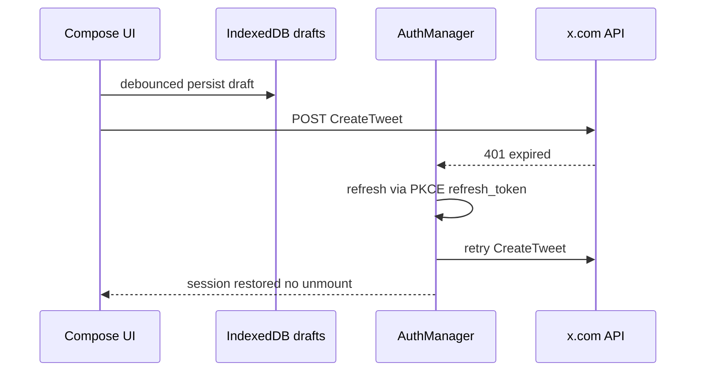
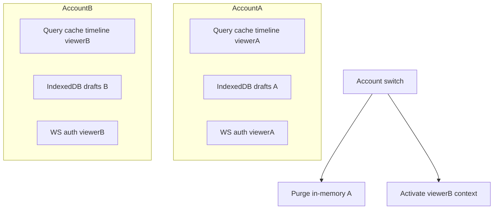
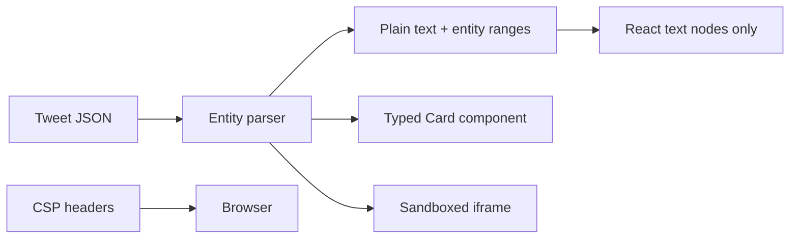
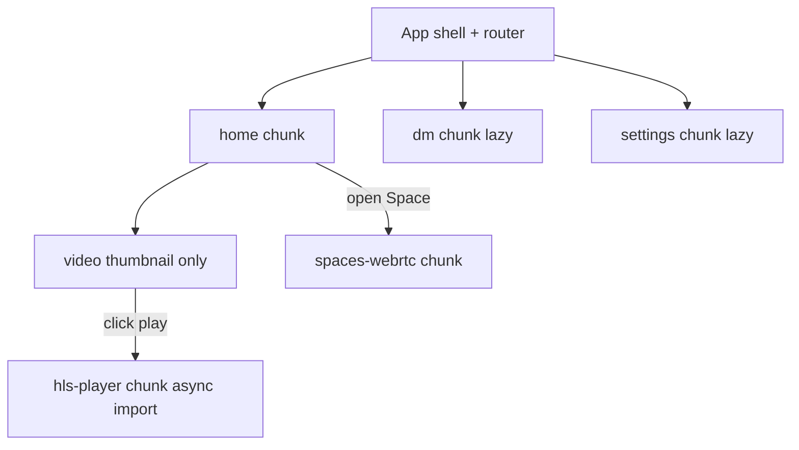
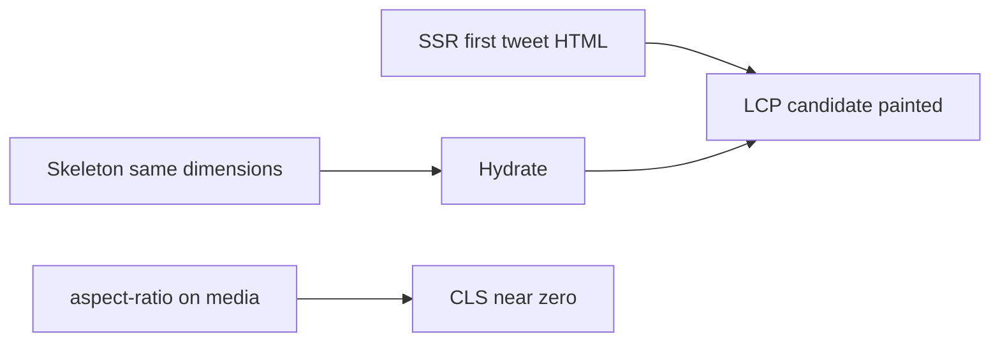
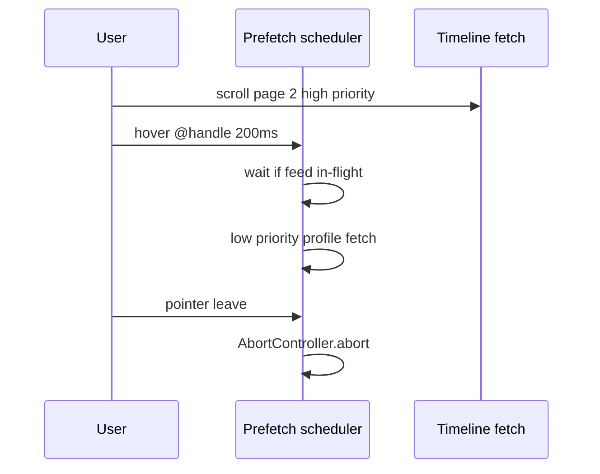
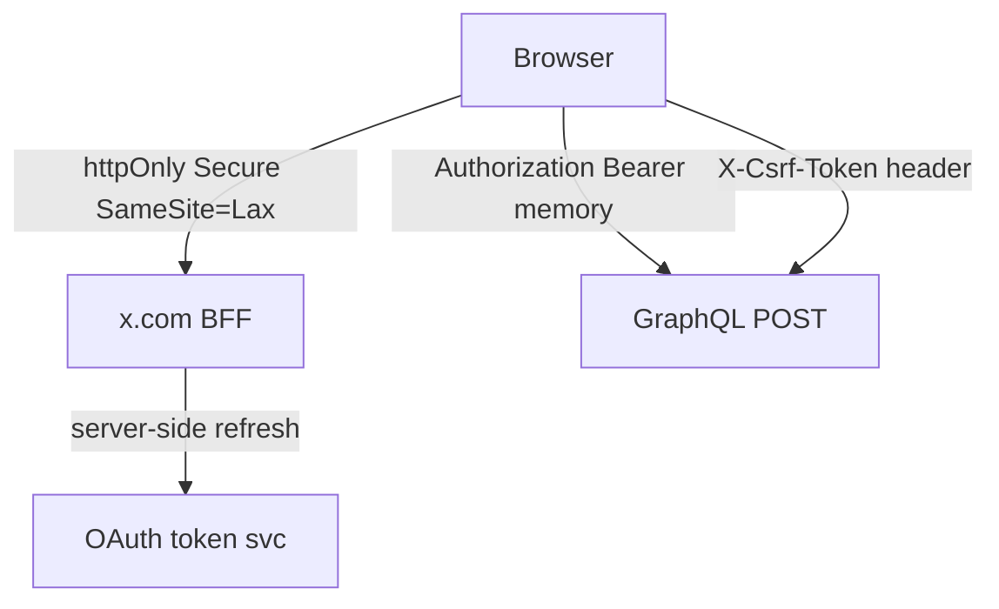
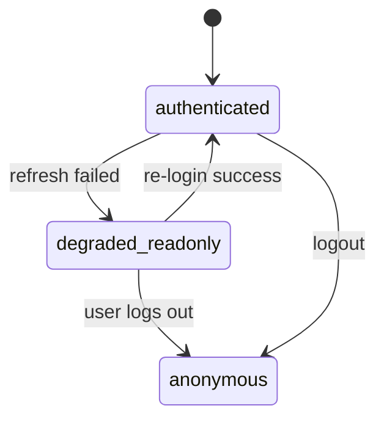
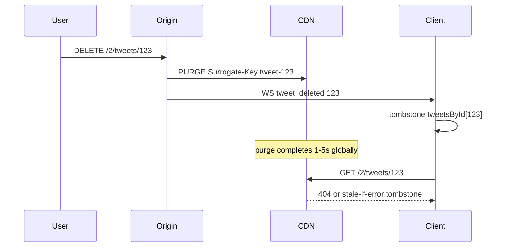

# Section 9 — Auth, Security, Performance & Delivery (Answers)

Interview-depth answers covering OAuth/session, multi-account isolation, XSS/CSP, code-splitting, Core Web Vitals, prefetch, token storage/CSRF, CSP with ads, degraded read-only mode, RUM attribution, skeleton loaders for ads, CDN TTL vs delete propagation.

---

## Core

### How do you implement OAuth login, token refresh, and session expiry without losing in-flight compose drafts?

**Problem framing:** X uses OAuth 2.0 with PKCE for web login; access tokens expire (often 2h), refresh tokens rotate, and silent refresh can fail mid-compose. Naive "logout on 401" wipes drafts in memory; blocking the UI during refresh loses typing momentum. Interviewers want **auth lifecycle decoupled from compose durability**.

**Approach:** **Three-layer session model** — durable drafts in IndexedDB, auth tokens in secure storage (see Deep Q7), and a global auth interceptor that refreshes without unmounting compose.



1. **OAuth 2.0 PKCE flow (web)** —
   ```ts
   // Login redirect
   const { codeVerifier, codeChallenge } = await generatePkce();
   sessionStorage.setItem('oauth_code_verifier', codeVerifier);
   location.href = buildAuthorizeUrl({
     client_id: X_WEB_CLIENT_ID,
     redirect_uri: 'https://x.com/i/oauth2/callback',
     scope: 'tweet.read tweet.write users.read offline.access',
     code_challenge: codeChallenge,
     code_challenge_method: 'S256',
     state: csrfState,
   });
   // Callback exchanges code + verifier for access + refresh tokens
   ```

2. **Draft durability independent of auth** — Compose persists to IndexedDB keyed by `accountId + draftKey` (global, reply, quote):
   ```ts
   type DraftRecord = {
     accountId: string;
     draftKey: string; // 'global' | `reply:${tweetId}`
     intent: ComposeIntent;
     updatedAt: number;
   };
   // debounce 300ms on every keystroke — survives refresh, expiry, tab crash
   ```

3. **Silent refresh pipeline** — Single-flight refresh mutex; queue in-flight API calls:
   ```ts
   let refreshPromise: Promise<void> | null = null;
   async function ensureValidSession(): Promise<void> {
     if (!isExpired(accessToken)) return;
     refreshPromise ??= refreshTokens().finally(() => { refreshPromise = null; });
     await refreshPromise;
   }
   // axios/fetch interceptor: on 401 → ensureValidSession → retry once
   ```

4. **Session expiry UX** — If refresh fails (revoked, password change): **do not** clear IndexedDB drafts. Show re-auth modal; on success, restore compose from DB. Pending outbox mutations (failed posts) stay queued with `status: 'awaiting_auth'`.

5. **Proactive refresh** — Refresh at 80% TTL during idle (`requestIdleCallback`) to avoid burst 401s during Post tap.

6. **Account-scoped tokens** — Multi-account stores refresh token per `rest_id`; switching accounts swaps token bundle without touching other account's drafts partition.

| Event | Draft behavior | Auth behavior |
|-------|----------------|---------------|
| Access token expires | IndexedDB intact | Silent refresh |
| Refresh fails | Keep drafts | Read-only + re-login modal |
| User logs out explicitly | Optional clear prompt | Wipe tokens + cache |
| Tab reload | Restore from IDB | Bootstrap from httpOnly cookie |

**Tradeoffs:** IndexedDB drafts may contain sensitive text on shared machines — encrypt at rest optional for enterprise. Single-flight refresh adds latency to first 401 — acceptable vs duplicate refresh races. **Pitfall:** Clearing React state on auth error — compose unmount loses unsaved keystrokes between debounce ticks; flush on `visibilitychange`. **Pitfall:** Retrying compose without idempotency key — duplicate tweets on double refresh.

---

### How do you isolate state per logged-in account (tabs, storage namespaces, service worker scopes)?

**Problem framing:** X supports multi-account switching (up to 5 accounts). Leaking Account A's timeline into Account B's tab is a privacy incident. Shared `localStorage`, global React Query cache, and one SW cache namespace cause cross-account bleed. Interviewers want **hard boundaries** across storage, network, and UI state.

**Approach:** **`viewerId` (rest_id) as isolation root** — every persisted key, query key, SW cache partition, and WebSocket connection scoped to active account.



1. **Storage namespaces** —
   ```ts
   const storageKey = (viewerId: string, key: string) => `x:${viewerId}:${key}`;
   // localStorage: x:44196397:feedMode, x:783214:feedMode
   // IndexedDB database: `x-drafts-${viewerId}` or single DB with compound key
   ```

2. **In-memory state** — React Query keys always include `viewerId` (see Section 8). Entity store partitioned: `entitiesByViewer[viewerId].tweetsById` or tag records with viewer scope.

3. **Account switch ritual** —
   ```ts
   async function switchAccount(nextViewerId: string) {
     await flushDrafts(currentViewerId);
     disconnectWebSocket();
     queryClient.removeQueries({ queryKey: ['timeline', currentViewerId] });
     entityStore.dropPartition(currentViewerId);
     setAuthContext(nextViewerId);
     await prefetchBootstrap(nextViewerId);
     connectWebSocket(nextViewerId);
   }
   ```

4. **Multi-tab sync** — `BroadcastChannel('x-account')` broadcasts `{ type: 'ACTIVE_ACCOUNT', viewerId }`. Tabs either mirror active account or show read-only banner "This tab is Account A; another tab switched to B" — pick one policy; X mirrors.

5. **Service worker scope** — SW cache names include viewer for personalized API: `api-v3-${viewerId}`. Public assets (`main.hash.js`) remain global. On switch, `caches.delete()` for previous viewer's API cache only.

6. **HTTP layer** — Every mutating request sends `X-Act-As-User: ${viewerId}` + cookie; server rejects mismatch. Client validates response `viewer_context.rest_id`.

7. **UI affordances** — Account switcher shows avatar ring per account; compose badge shows which account will post. DM and notifications entirely viewer-scoped routes `/i/chat` uses session viewer.

| Layer | Isolation mechanism |
|-------|---------------------|
| localStorage | `x:{viewerId}:*` prefix |
| IndexedDB | per-viewer DB or compound keys |
| React Query | viewerId in queryKey root |
| WebSocket | reconnect with viewer token |
| SW cache | partitioned cacheName |

**Tradeoffs:** Partitioning duplicates cached public tweets across accounts — memory cost vs privacy. Global SW for static assets simplifies deploy. **Pitfall:** `queryClient.clear()` on switch — nukes shared config; scoped remove only. **Pitfall:** Stale tab posting after switch in another tab — BroadcastChannel force reload or block writes.

---

### How do you mitigate XSS from rendered tweet text, cards, and third-party embeds — sanitization vs CSP?

**Problem framing:** Tweets contain user text, auto-linked URLs, **link preview cards** (summary_large_image), quoted tweets, polls, and third-party embeds (YouTube, Instagram). One unsanitized `@mention` HTML injection or compromised card iframe steals session cookies. Defense must be **layered** — sanitization alone fails on parser differentials; CSP alone breaks embeds.

**Approach:** **Sanitize on ingest + strict CSP + sandboxed embeds** — never `dangerouslySetInnerHTML` with raw API strings; treat cards and embeds as typed components with allowlists.



1. **Tweet text rendering** — Parse `entities` (urls, mentions, hashtags, cashtags) server-side; client renders **React children**, not HTML:
   ```tsx
   function TweetText({ text, entities }: Tweet) {
     const segments = buildSegments(text, entities); // [{type:'text'|'url'|'mention', ...}]
     return (
       <span>
         {segments.map((s) =>
           s.type === 'url' ? <SafeLink key={s.key} url={s.expandedUrl} /> : s.value
         )}
       </span>
     );
   }
   ```
   `SafeLink` validates URL scheme (`https:` only), adds `rel="noopener noreferrer"`, strips `javascript:`.

2. **Link preview cards** — Card metadata from API is **data**, not HTML. Render fixed card chrome (title, domain, image) via `` with CSP `img-src` allowlist (pbs.twimg.com, card CDN). No card HTML blob from third-party sites.

3. **Third-party embeds** — Lazy iframe with strict sandbox:
   ```tsx
   <iframe
     sandbox="allow-scripts allow-same-origin allow-popups"
     src={trustedEmbedUrl} // server-validated oEmbed endpoint only
     loading="lazy"
   />
   ```
   Prefer **Twitter-native video/GIF** (pbs.twimg.com) over arbitrary embeds on timeline.

4. **Content Security Policy (baseline)** —
   ```
   default-src 'self';
   script-src 'self' 'nonce-{perRequest}' https://ads.x.com;
   style-src 'self' 'unsafe-inline'; /* prefer nonce migration */
   img-src 'self' data: https://pbs.twimg.com https://*.twimg.com;
   frame-src https://www.youtube.com https://platform.twitter.com;
   object-src 'none';
   base-uri 'self';
   ```

5. **DOMPurify for rich surfaces only** — DM custom emoji packs, Community notes with limited markup — sanitize with allowlist tags (`b`, `i`, `a`) if unavoidable; timeline stays text-only.

6. **Server-side HTML generation** — SSR tweet pages escape all dynamic text; hydration mismatch tests in CI.

| Vector | Primary defense | Secondary |
|--------|-----------------|-----------|
| Tweet text | React text nodes + entity parser | CSP `script-src` |
| Link cards | Typed components, no raw HTML | `img-src` allowlist |
| oEmbed iframe | sandbox + domain allowlist | `frame-src` |
| Analytics inline | nonce (see Deep Q8) | SRI on external scripts |

**Tradeoffs:** Sandboxed embeds break some player features (fullscreen APIs) — trade UX for security. Strict CSP requires nonce plumbing in SSR. **Pitfall:** `innerHTML` for highlight search terms — use `<mark>` via DOM API. **Pitfall:** User-supplied `data-*` attributes on cards — strip non-allowlisted attrs.

---

### How do you code-split by route (home, DM, settings) and defer heavy players (video, Spaces) behind interaction?

**Problem framing:** x.com ships a large JS bundle; loading HLS video, Spaces WebRTC, and settings admin panels on home first paint destroys TTI and INP. Interviewers want **route-level splits** plus **interaction-gated** heavy chunks on a timeline full of inline video thumbnails.

**Approach:** **Framework route splitting** (Next.js `dynamic()` / React `lazy`) with **prefetch on intent**, and **media players mounted only on play tap**.



1. **Route map** —
   ```ts
   const HomeTimeline = lazy(() => import('./routes/HomeTimeline'));
   const MessagesRoute = lazy(() => import('./routes/Messages')); // ~120KB
   const SettingsRoute = lazy(() => import('./routes/Settings')); // admin, 2FA, data export
   const GrokRoute = lazy(() => import('./routes/Grok')); // defer entirely
   ```

2. **Router prefetch** — On hover/focus nav icons (`/messages`, `/settings`), `import()` prefetch after 100ms hover — warms cache without blocking home.

3. **Video deferral** — Timeline renders `<VideoThumb poster={url} duration={s} />` — zero HLS.js. On play:
   ```ts
   async function onPlayClick(mediaId: string) {
     const { HlsPlayer } = await import('./media/HlsPlayer');
     mountPlayer(mediaId, HlsPlayer);
   }
   ```
   Intersection Observer: preload player chunk when thumb ≥50% visible **only on Wi-Fi** (`navigator.connection.saveData` check).

4. **Spaces / live audio** — Chunk loads when user opens Space card or `/i/spaces/` route — includes WebRTC, audio worklets. Not on home bootstrap.

5. **Shared vendor splitting** — `react`, `react-dom`, design system in long-cache entry; route chunks stay <80KB gzip each where possible.

6. **SSR / RSC alignment** — Home shell SSR streams first tweet HTML; client hydrates virtualized list. DM/settings client-only acceptable — lower SEO priority.

| Chunk | Load trigger | Approx size |
|-------|--------------|-------------|
| `home-timeline` | initial route | critical |
| `dm` | navigate / hover prefetch | deferred |
| `hls-player` | play tap or visible+wifi | interaction |
| `spaces` | join Space | interaction |
| `settings` | navigate | deferred |

**Tradeoffs:** Play tap adds 100–300ms before first frame — show spinner on thumb. Over-splitting causes chunk waterfall — bundle analyzer for optimal groupings. **Pitfall:** Importing player in tweet row module — static analysis pulls HLS into home chunk; isolate thumb component. **Pitfall:** Prefetching DM on every home load — wastes bandwidth; hover-gate only.

---

### How do you hit LCP and CLS budgets on the timeline with skeletons, fixed media aspect ratios, and font display strategy?

**Problem framing:** Timeline LCP is often **first tweet avatar, text block, or hero image** — not the logo. CLS spikes from async media, web fonts (Chirp), injected ads, and "Show more replies" expansion. Core Web Vitals budgets (~LCP <2.5s, CLS <0.1) are interview metrics at X-scale mobile.

**Approach:** **Reserve space before paint** — skeleton dimensions match production tweet row, `aspect-ratio` on all media slots, `font-display: optional` for body with system fallback stack.

1. **Tweet row skeleton contract** — Fixed heights per row variant:
   ```tsx
   function TweetSkeleton({ hasMedia }: { hasMedia: boolean }) {
     return (
       <article className="tweet-skeleton" style={{ minHeight: hasMedia ? 420 : 120 }}>
         <div className="avatar-skeleton" style={{ width: 40, height: 40 }} />
         <div className="text-lines" />
         {hasMedia && <div className="media-skeleton" style={{ aspectRatio: '16/9' }} />}
       </article>
     );
   }
   ```
   Swap skeleton → content without layout shift — same grid template.

2. **Media aspect ratios** — API returns `original_info.width/height` or `sizes.medium.w/h`. Set before image load:
   ```tsx
   <div style={{ aspectRatio: `${w}/${h}`, maxHeight: 510 }}>
     
   </div>
   ```
   Multi-image grid uses fixed mosaic template (1 large + 2 small) — ratios from server metadata, not post-load measurement.

3. **Font strategy** —
   ```css
   @font-face {
     font-family: 'Chirp';
     src: url('chirp.woff2') format('woff2');
     font-display: optional; /* no swap shift on slow 3G; fallback on first visit */
     size-adjust: 102%; /* match system-ui metrics */
   }
   body { font-family: system-ui, 'Chirp', sans-serif; }
   ```
   Preload only `chirp.woff2` weight 400 — defer bold/italic. User avatars use `font-display: optional` irrelevant — image with fixed 40×40.

4. **LCP optimization** — First screen tweet (index 0–2): `fetchpriority="high"` on hero image, no lazy. SSR first tweet in HTML shell. Priority hint on LCP candidate only — not all 20 tweets.

5. **Ad / injection CLS** — Promoted tweet slot reserved at known indices (see Deep Q11) — `min-height: 180px` placeholder before ad fills.

6. **Expandable text** — "Show more" pre-computes collapsed `max-height` from line-clamp — button tap expands reserved region; avoid reflow of tweets above (contain layout).



| Technique | Targets | Budget impact |
|-----------|---------|---------------|
| Skeleton = final layout | CLS | primary |
| aspect-ratio on media | CLS | primary |
| font-display: optional | CLS | secondary |
| fetchpriority on first image | LCP | primary |
| Reserved ad slot height | CLS | primary |

**Tradeoffs:** `font-display: optional` may show system font on first visit — acceptable vs shift. Fixed skeleton height wrong for long threads — use variant skeletons. **Pitfall:** Lazy-loading LCP image — kills LCP score. **Pitfall:** Missing dimensions on GIF — default 16:9 box better than no box.

---

### How do you prefetch likely next routes (profile hover, tweet detail) without starving the active feed's bandwidth?

**Problem framing:** Hover on `@handle` or tweet should feel instant; aggressive prefetch competes with infinite scroll fetching page 2+, degrading feed INP and causing 429s. Mobile save-data users need zero hover prefetch. Interviewers want **bandwidth-aware, cancellable, priority-downgraded** prefetch.

**Approach:** **Intent-gated prefetch scheduler** with concurrency cap, `AbortSignal` cancel on unhover, and `fetchPriority: 'low'`.

```ts
const prefetchScheduler = createScheduler({
  maxConcurrent: 2,
  maxLowPriority: 1,
  respectSaveData: true,
});

function onProfileHover(userId: string, signal: AbortSignal) {
  prefetchScheduler.enqueue(
    () => queryClient.prefetchQuery({
      queryKey: ['user', viewerId, userId],
      queryFn: () => fetchUserProfile(userId, { signal }),
    }),
    { priority: 'low', signal }
  );
  // defer timeline prefetch until 300ms sustained hover
}
```

1. **Hover debounce** — Profile card: 150ms before prefetch starts; pointer leave aborts via `AbortController`. Tweet detail: prefetch on mousedown (intent stronger than hover) for `/status/:id`.

2. **Priority relative to feed** — Active feed pagination always `priority: 'high'`. Prefetch uses:
   ```ts
   fetch(url, { priority: 'low' }); // Chrome fetch priority
   // or requestIdleCallback for JSON parse
   ```

3. **Link prefetch (Next/router)** —
   ```tsx
   <Link href={`/${handle}`} prefetch={false} onMouseEnter={debouncedPrefetch} />
   ```
   Disable automatic viewport prefetch — X timeline has hundreds of profile links.

4. **Resource budgets** — Max 1 profile + 1 tweet detail prefetched simultaneously. LRU cache of last 10 prefetched profiles — evict on memory pressure (`document.hidden`).

5. **Connection-aware** —
   ```ts
   const conn = navigator.connection;
   if (conn?.saveData || conn?.effectiveType === '2g') return; // no prefetch
   if (conn?.effectiveType === '4g') enableAggressivePrefetch();
   ```

6. **Data prefetch vs chunk prefetch** — Route JS prefetch on nav hover; **API data** prefetch separate — data without chunk still helps if user navigates within SPA.



| Signal | Prefetch? | Priority |
|--------|-----------|----------|
| Scroll feed | no | — |
| Hover @handle 150ms+ | profile metadata | low |
| mousedown tweet | tweet detail | low |
| saveData on | never | — |
| 429 recent | pause 60s | — |

**Tradeoffs:** mousedown-only loses keyboard navigation prefetch — add `focus` equivalent. Aborted prefetches still cost partial TCP — debounce reduces waste. **Pitfall:** Prefetching full profile timeline (heavy) — metadata + pinned tweet only. **Pitfall:** React Query prefetch without staleTime — immediate refetch on navigate duplicates work; set `staleTime: 30_000`.

---

## Deep

### How do you store tokens — httpOnly cookies vs memory — and defend against CSRF on mutating endpoints?

**Problem framing:** Access tokens in `localStorage` are XSS-exfiltratable. Pure memory tokens vanish on refresh. Mutations via cookie auth invite **CSRF** unless defended. X web must balance SPA ergonomics with OAuth 2.0 BFF patterns.

**Approach:** **BFF httpOnly refresh + short-lived access in memory** (or httpOnly session cookie for same-site API), plus **CSRF double-submit** or `SameSite=Strict` + custom header on mutations.



1. **Token storage split** —

   | Token | Storage | Rationale |
   |-------|---------|-----------|
   | Refresh token | httpOnly, Secure, SameSite=Lax cookie | Not JS-readable |
   | Access token | Memory (module closure) or httpOnly session | Short TTL ~2h |
   | PKCE verifier | sessionStorage | Tab-scoped, login only |
   | Never | localStorage | XSS theft |

2. **Bootstrap** — Page load: BFF `GET /api/session` validates refresh cookie, returns access token in **JSON body** (memory) or sets second httpOnly session for API subdomain.

3. **CSRF defense on mutations** — GraphQL POST and REST writes require:
   ```ts
   // Set on login via non-httpOnly cookie or meta tag
   const csrfToken = getCookie('ct0'); // X's csrf token pattern
   fetch('/graphql', {
     method: 'POST',
     credentials: 'include',
     headers: {
       'X-Csrf-Token': csrfToken,
       'Authorization': `Bearer ${accessToken}`,
       'Content-Type': 'application/json',
     },
     body: JSON.stringify({ query, variables }),
   });
   ```
   Server validates header matches cookie (`ct0` === `X-Csrf-Token`). Cross-origin attackers cannot read cookie to forge header.

4. **SameSite** — `SameSite=Lax` on auth cookies blocks cross-site POST from evil.com. `Strict` breaks OAuth redirect chain — Lax + CSRF header is standard.

5. **Origin check** — Server rejects mutations if `Origin` not in allowlist (`https://x.com`, `https://twitter.com`).

6. **CORS** — API does not allow arbitrary origins with credentials; mobile apps use different OAuth flow (PKCE, no cookies).

**Tradeoffs:** Memory access token lost on hard refresh — acceptable with silent refresh via httpOnly refresh cookie. Full httpOnly-only requires BFF proxy for all API calls — operational cost. **Pitfall:** Storing access token in localStorage for "persistence" — XSS game over. **Pitfall:** GET mutations — never; CSRF via ``. **Pitfall:** Subdomain cookie scope too broad — limit path and domain.

---

### How do you implement Content Security Policy with inline analytics, ads, and user-generated link previews?

**Problem framing:** Strict CSP blocks inline GA/Sentry bootstrap, **ads.x.com** scripts, and dynamic card image domains. User-generated link previews need wide `img-src` but not `script-src`. Interviewers want **nonce/hash CSP** with **tiered directives** and **Trusted Types** where feasible.

**Approach:** **Nonce-per-request CSP** on SSR HTML, **allowlisted third-party script hosts** for ads/analytics, **no inline scripts** in tweet content (data-only cards), **`img-src` wider than `script-src`**.

1. **SSR nonce injection** —
   ```tsx
   // middleware generates nonce per request
   const nonce = crypto.randomUUID();
   res.setHeader('Content-Security-Policy', `
     default-src 'self';
     script-src 'self' 'nonce-${nonce}' https://ads.x.com https://static.ads-twitter.com;
     style-src 'self' 'nonce-${nonce}';
     img-src 'self' data: blob: https://pbs.twimg.com https://*.twimg.com https:;
     frame-src https://ads.x.com https://www.youtube.com;
     connect-src 'self' https://api.x.com wss://*.x.com;
     report-uri /csp-report;
   `.replace(/\s+/g, ' '));
   // <script nonce={nonce}> bootstraps app </script>
   ```

2. **Analytics** — Move inline pixels to nonce script or external file with SRI:
   ```html
   <script nonce="{nonce}" src="/rum/v1/bundle.js" integrity="sha384-..."></script>
   ```
   No `unsafe-inline` in production `script-src`.

3. **Ads** — Ads load in **iframe** from `ads.x.com` with separate CSP inside iframe — parent page only needs `frame-src` + narrow `script-src` for ad controller SDK host. Promoted tweet rendering stays same-origin React — ad **metadata** is JSON, not ad network HTML in timeline DOM.

4. **UGC link previews** — Cards use `` — allowed via `img-src https:` (or domain category allowlist). **Never** inject card HTML from crawled page. Fallback icon if image domain blocked.

5. **Trusted Types (progressive)** —
   ```ts
   if (window.trustedTypes) {
     trustedTypes.createPolicy('default', {
       createHTML: (s) => DOMPurify.sanitize(s, { RETURN_TRUSTED_TYPE: true }),
     });
   }
   ```

6. **CSP reporting** — `report-uri /csp-report` aggregates violations — detect regressions when new ad partner added.

| Directive | Strictness | Reason |
|-----------|------------|--------|
| script-src | strict + nonce | XSS |
| img-src | moderate (https:) | UGC previews |
| frame-src | allowlist | embeds + ads |
| object-src | none | legacy plugins |

**Tradeoffs:** Nonce breaks static CDN HTML cache — per-request SSR or edge nonce at CDN (Fastly dynamic). `img-src https:` allows any HTTPS image — malware images possible but not script execution. **Pitfall:** `'unsafe-inline'` for styles — needed for some libs; isolate with strict script. **Pitfall:** Third-party ad script in main bundle — violates CSP and SRI.

---

### How do you ship a degraded read-only mode when auth refresh fails mid-session?

**Problem framing:** Refresh token revocation, enterprise SSO expiry, or auth service outage mid-scroll should not white-screen the app or lose context. Users should **read cached timeline**, see clear **"Session expired"** chrome, and recover drafts after re-login.

**Approach:** **Auth state machine** with `authenticated | degraded_readonly | anonymous` modes; gate mutations, not renders.



1. **Detection** —
   ```ts
   async function onRefreshFailure(err: AuthError) {
     if (err.code === 'invalid_grant' || err.status === 401) {
       authStore.setMode('degraded_readonly');
       emitRum('auth_degraded');
     }
   }
   ```

2. **Read-only capabilities** — Allow: timeline from normalized cache + stale SWR, tweet detail from cache, profile view, search last results. Deny: compose, like, repost, DM send, follow — buttons disabled with tooltip.

3. **UI chrome** —
   ```tsx
   {mode === 'degraded_readonly' && (
     <Banner persistent>
       Session expired · <button onClick={openReLogin}>Log in again</button>
       Your drafts are saved
     </Banner>
   )}
   ```

4. **Network layer** — Interceptor blocks mutating methods; reads proceed with last known access token until 401, then serve cache-only:
   ```ts
   if (mode === 'degraded_readonly' && method !== 'GET') {
     throw new DegradedModeError('Re-login required');
   }
   ```

5. **Re-login flow** — Modal OAuth PKCE; on success: restore mode, flush outbox, invalidate stale queries, **no full page reload**. Merge refreshed viewer context.

6. **WebSocket** — Disconnect on degraded; live updates stop — banner note "Live updates paused". Reconnect after auth restore.

7. **Edge case: partial outage** — Auth up, API down — different banner ("Something went wrong") vs auth degraded; don't conflate.

| Mode | Timeline | Compose | Live WS |
|------|----------|---------|---------|
| authenticated | network + cache | yes | yes |
| degraded_readonly | cache + stale GET | disabled | no |
| anonymous | public only | no | no |

**Tradeoffs:** Stale read-only timeline may show deleted tweets until TTL — acceptable vs hard logout. Disabled buttons frustrate — offer one-tap re-auth. **Pitfall:** Clearing cache on auth failure — destroys read-only value. **Pitfall:** Silent failed likes stacking — block optimistic UI entirely in degraded mode.

---

### How do you use RUM (LCP, INP, CLS) and attribution to tweet card components vs ads vs third-party scripts?

**Problem framing:** Aggregate LCP/INP/CLS on x.com is unactionable — spikes come from **promoted tweets**, **link preview cards**, **video autopreview**, or **ads.x.com** scripts. Interviewers want **component-level attribution** tied to Web Vitals API and beacon pipeline.

**Approach:** **RUM wrapper** around tweet row types + `PerformanceObserver` + `elementTiming` + Long Animation Frame attribution; tag beacons with `surface`, `rowKind`, `injectionType`.

1. **Instrument row kinds** —
   ```tsx
   function TweetRow({ id, rowKind }: { id: string; rowKind: 'organic' | 'promoted' | 'who_to_follow' | 'gap' }) {
     useEffect(() => {
       mark(`tweet-row-${rowKind}-start`, { tweetId: id });
       return () => mark(`tweet-row-${rowKind}-end`);
     }, [id, rowKind]);
     // ...
   }
   ```

2. **LCP attribution** — `PerformanceObserver` for `largest-contentful-paint`:
   ```ts
   const po = new PerformanceObserver((list) => {
     const entry = list.getEntries().at(-1) as LCPEntry;
     const el = entry.element as HTMLElement;
     const attribution = {
       lcp: entry.startTime,
       rowKind: el.closest('[data-row-kind]')?.dataset.rowKind,
       isAd: el.closest('[data-promoted]') !== null,
       resourceUrl: entry.url,
     };
     sendRum('web-vitals', attribution);
   });
   po.observe({ type: 'largest-contentful-paint', buffered: true });
   ```

3. **INP / long tasks** — `PerformanceObserver` for `event` (INP) and `longtask`:
   ```ts
   // Attribute input delay to nearest data-row-kind container
   function attributeInp(eventEntry: PerformanceEventTiming) {
     const target = document.elementFromPoint(eventEntry.clientX, eventEntry.clientY);
     return target?.closest('[data-row-kind]')?.dataset.rowKind ?? 'chrome';
   }
   ```

4. **CLS contribution** — Layout shift sources:
   ```ts
   po.observe({ type: 'layout-shift', buffered: true });
   // entry.sources[].node → trace to promoted slot vs media vs font
   ```

5. **Third-party script attribution** — `PerformanceResourceTiming` for `ads.x.com`, analytics:
   ```ts
   resources.filter(r => r.name.includes('ads.x.com'))
     .forEach(r => sendRum('third-party', { name: r.name, duration: r.duration, transferSize: r.transferSize }));
   ```

6. **Dashboard slices** — Ops views: p75 LCP where `rowKind=promoted` vs `organic`; INP on "Like tap" vs "Open tweet"; CLS from `injectionType=ad_slot`.

```mermaid
flowchart TB
  PO[PerformanceObserver] --> Agg[RUM aggregator]
  Rows[data-row-kind attributes] --> Agg
  Agg --> Beacon[/rum/v1/beacon]
  Beacon --> Dash[Grafana: LCP by rowKind]
```

| Metric | Attribution key | Action if bad |
|--------|-----------------|---------------|
| LCP | rowKind, image domain | defer ad hero |
| INP | interaction target, rowKind | virtualize fewer |
| CLS | shift source, injection | fix slot height |
| Long task | script URL | defer third-party |

**Tradeoffs:** `elementTiming` requires opt-in on images — overhead on millions of elements; sample 1–5% sessions. Deep attribution increases beacon payload — batch and compress. **Pitfall:** Aggregating all tweets as one — useless. **Pitfall:** Not correlating with `feedMode` / device class — mobile 3G promoted LCP differs.

---

### How do you implement skeleton loaders that match final layout for ads, promoted tweets, and recommendation inserts?

**Problem framing:** Ads and "Who to follow" inject at **fixed indices** (e.g., every 7th row) with different heights than organic tweets. Generic shimmer bars cause CLS when promoted content loads taller. Interviewers want **typed skeletons** mirroring final injection contracts.

**Approach:** **Injection slot registry** — each `injectionKind` maps to skeleton component + `minHeight` + final component; virtualizer uses stable slot IDs.

1. **Injection model** —
   ```ts
   type FeedItem =
     | { kind: 'tweet'; id: string }
     | { kind: 'promoted'; slotId: string; resolved?: PromotedTweet }
     | { kind: 'who_to_follow'; slotId: string; resolved?: WtfModule }
     | { kind: 'gap'; slotId: string }; // placeholder loading

   function buildFeedItems(tweetIds: string[], injections: InjectionPlan[]): FeedItem[] {
     // merge tweets with injection indices from home bootstrap
   }
   ```

2. **Typed skeletons** —
   ```tsx
   function PromotedTweetSkeleton() {
     return (
       <article data-row-kind="promoted" style={{ minHeight: 220 }}>
         <span className="label">Ad</span>
         <div className="avatar" style={{ width: 40, height: 40 }} />
         <div className="text-block" style={{ height: 48 }} />
         <div className="media" style={{ aspectRatio: '1.91/1', maxHeight: 280 }} />
         <div className="cta" style={{ height: 36, width: 120 }} />
       </article>
     );
   }

   function WhoToFollowSkeleton() {
     return (
       <article data-row-kind="who_to_follow" style={{ minHeight: 200 }}>
         <div className="heading" />
         {[1, 2, 3].map((i) => <div key={i} className="user-row" style={{ height: 56 }} />)}
       </article>
     );
   }
   ```

3. **Render switch** —
   ```tsx
   function FeedRow({ item }: { item: FeedItem }) {
     if (item.kind === 'gap') {
       return injectionSkeletons[item.injectionKind] ?? <TweetSkeleton />;
     }
     if (item.kind === 'promoted' && !item.resolved) return <PromotedTweetSkeleton />;
     if (item.kind === 'promoted') return <PromotedTweet data={item.resolved} />;
     // ...
   }
   ```

4. **Bootstrap contract** — Home BFF returns `injections: [{ index: 6, kind: 'promoted' }, { index: 13, kind: 'who_to_follow' }]` — client inserts `gap` slots immediately, fetches ad payload async.

5. **Virtualizer stability** — `slotId` as row key (not array index) — ad resolving does not remount neighbors. `estimateSize` returns skeleton height until resolved.

6. **Promoted vs organic** — Promoted uses `1.91:1` card aspect (standard X ad unit); organic may vary — different skeleton components.

| injectionKind | Skeleton height | Final height source |
|---------------|-----------------|---------------------|
| promoted | 220px + 1.91:1 media | ad creative API |
| who_to_follow | 200px fixed | 3 user rows |
| organic tweet | 120 / 420+media | tweet metadata |

**Tradeoffs:** Wrong skeleton when ad format varies (video vs carousel) — use creative type hint from ad API early. Pre-reserving max height wastes whitespace — better slight gap than CLS. **Pitfall:** Index drift after "Show new posts" prepend — slot IDs anchored to session plan, recompute on full refresh. **Pitfall:** Same skeleton for DPA vs install app ad — sub-types need sub-skeletons.

---

### How do you align CDN cache TTLs with "delete tweet" propagation so users never see resurrected deleted content?

**Problem framing:** Public tweet permalinks and embeds cache at CDN (`s-maxage=60` or longer). User deletes tweet — origin 404s, but edge may serve stale JSON for TTL window. Worse: **browser cache + SW** resurrects deleted content after purge. Interviewers want **purge latency < perception**, **tombstone consistency**, and **client-side merge rules**.

**Approach:** **Short TTL + Surrogate-Key purge + tombstone headers + client tombstone store** — defense in depth; no single layer trusted alone.



1. **CDN caching policy** —
   ```
   GET /2/tweets/:id (public)
     Cache-Control: public, s-maxage=30, stale-while-revalidate=60, stale-if-error=300
     Surrogate-Key: tweet-{id} user-{authorId}
   ```
   Short `s-maxage` bounds resurrection window; purge targets all keys on delete.

2. **Purge on delete** — Origin emits purge to Fastly/Akamai/CloudFront:
   ```ts
   async function onTweetDeleted(tweetId: string, authorId: string) {
     await cdn.purgeBySurrogateKeys([`tweet-${tweetId}`, `user-${authorId}`]);
     await searchIndex.remove(tweetId);
   }
   ```
   Target p99 purge propagation <5s.

3. **Tombstone response** — Prefer `404` with `Cache-Control: max-age=0` over serving deleted body. Optional `410 Gone` for permanence. Include `X-Tweet-Status: deleted` for client logic.

4. **WebSocket / live pipeline** — `tweet_deleted { id }` event → all connected clients tombstone immediately regardless of CDN:
   ```ts
   function onTweetDeletedEvent(id: string) {
     entityStore.tweetsById[id] = { ...existing, _deleted: true, text: '' };
     queryClient.invalidateQueries({ queryKey: ['tweet', id] });
     removeFromTimelinePages(id);
   }
   ```

5. **Client HTTP cache** — Authenticated API: `private, no-store`. Public embed pages: `ETag` on core — deleted tweet ETag invalidated on purge. SW never caches DELETE responses; on 404 purge from SW cache:
   ```ts
   if (response.status === 404) caches.open('public-tweets').then(c => c.delete(request));
   ```

6. **Stale-while-revalidate edge case** — During SWR window, edge may serve deleted tweet — **WS tombstone already hid it** on active app; permalink cold load risk remains — mitigate with aggressive purge + 30s TTL max for tweet JSON.

7. **Embed/oEmbed** — Third-party sites cache HTML — `DELETE` triggers oEmbed cache purge; `cache_age` param on oEmbed endpoint capped.

| Layer | TTL | Delete behavior |
|-------|-----|-----------------|
| CDN edge | 30s s-maxage | Surrogate-Key purge |
| Browser HTTP | no-store (auth) | n/a |
| Client entity store | until GC | WS tombstone immediate |
| SW cache | optional public | delete on 404 |

**Tradeoffs:** 30s TTL increases origin QPS on viral tweets — mitigate with soft purge keeping cached copy only if tombstone header set. Longer TTL for static media (pbs.twimg.com) OK — image 404s separately. **Pitfall:** Purge lag > SWR window — user sees ghost tweet on cold load; accept rare with monitoring. **Pitfall:** CDN purge without client tombstone — app shows deleted tweet from normalized store until refetch. **Pitfall:** `stale-if-error` serving deleted content during outage — cap or disable for tweet routes.
