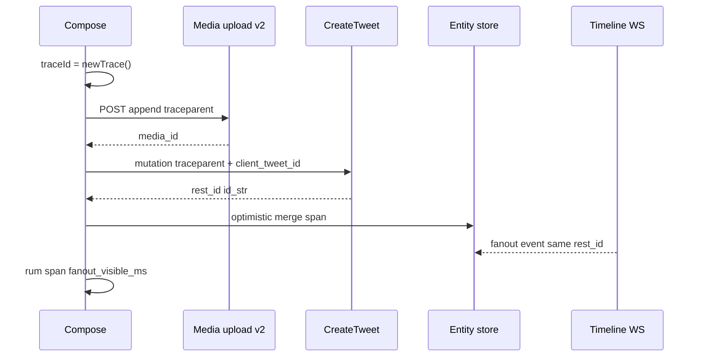
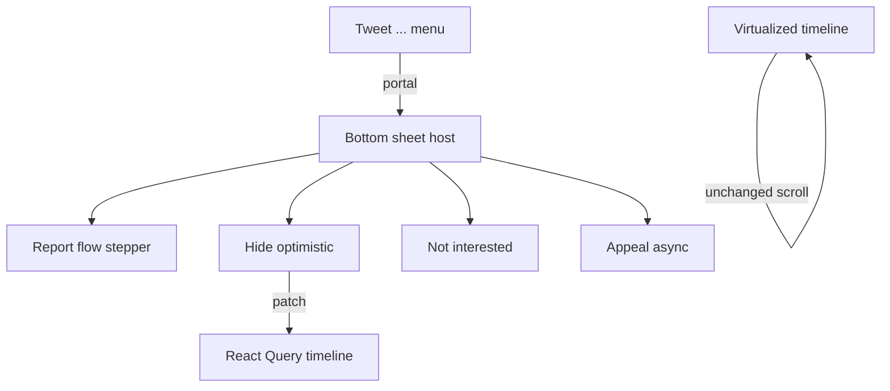
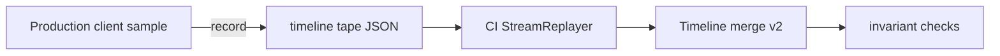
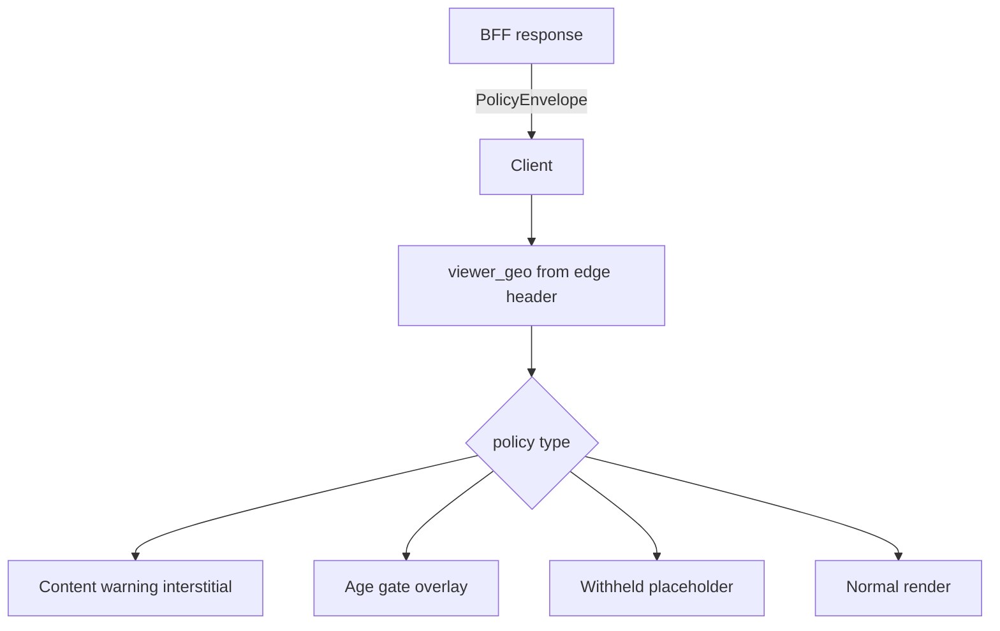
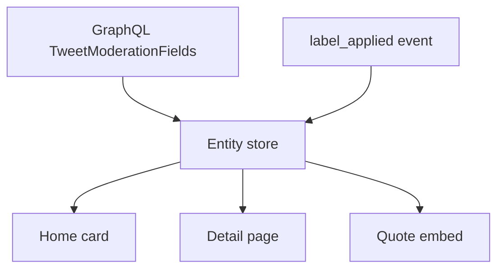

# Section 10 — Observability, Testing, i18n & Moderation UI (Answers)

Interview-depth answers covering client metrics, distributed tracing, stream testing, infinite scroll tests, RTL/i18n, moderation UX, stream replay, load testing, pluralization, geo-aware policy UI, moderation labels, visual regression.

---

## Core

### What client metrics do you emit for feed freshness lag, socket reconnect rate, and optimistic rollback frequency?

**Problem framing:** Home timeline health is invisible without client-side signals — users complain "my feed is stale" long before server dashboards spike. Socket churn during live events, and optimistic like/repost rollbacks after 403/429, are early indicators of ranking pipeline lag, infra instability, or rate-limit misconfiguration. Interviewers want **named, dimensional metrics** tied to viewer context, not ad-hoc `console.log`.

**Approach:** **Structured RUM beacon pipeline** (see Section 9 RUM) with a dedicated `client_stream_health` namespace — counters, histograms, and gauges emitted from timeline, WebSocket, and optimistic mutation layers.

```mermaid
flowchart LR
  Timeline[Timeline merge] -->|freshness_lag_ms| Beacon[RUM aggregator]
  WS[WebSocket manager] -->|reconnect_rate| Beacon
  Optimistic[Optimistic actions] -->|rollback_count| Beacon
  Beacon -->|batch 30s| Ingest[/rum/v1/beacon]
  Ingest --> Dash[Grafana / internal TSDB]
```

1. **Feed freshness lag** — Time between server event timestamp and client render:
   ```ts
   type FreshnessSample = {
     metric: 'feed_freshness_lag_ms';
     value: number; // Date.now() - event.serverCreatedAt
     dims: {
       feedMode: 'following' | 'for_you';
       transport: 'websocket' | 'sse' | 'rest_poll';
       viewerId: string; // hashed in beacon
       surface: 'home' | 'list' | 'community';
     };
   };

   function onTimelineHeadApplied(event: TimelineInsertEvent) {
     const lagMs = performance.now() - event.serverCreatedAt;
     rum.histogram('feed_freshness_lag_ms', lagMs, {
       feedMode: timelineStore.mode,
       transport: streamManager.activeTransport,
     });
     // Also track perceived lag: user saw "N new posts" banner → tap → paint
     if (event.viaBanner) {
       rum.histogram('feed_banner_to_paint_ms', event.bannerTapToPaintMs);
     }
   }
   ```
   Emit p50/p95/p99 per `feedMode` — Following should stay <3s p95; For You tolerates higher.

2. **Socket reconnect rate** — Counter + session histogram from WebSocket manager (Section 4):
   ```ts
   type ReconnectEvent = {
     metric: 'socket_reconnect_total';
     dims: {
       reason: 'idle_timeout' | 'network_change' | 'server_close' | 'auth_refresh' | 'tab_background';
       gapFillStrategy: 'since_id' | 'full_replay' | 'none';
       reconnectAttempt: number;
       success: boolean;
       gapDurationMs?: number; // time disconnected
     };
   };

   streamManager.on('reconnect', (ctx) => {
     rum.counter('socket_reconnect_total', 1, ctx.dims);
     rum.histogram('socket_reconnect_duration_ms', ctx.handshakeMs);
     if (!ctx.success) rum.counter('socket_reconnect_failure_total', 1, { reason: ctx.failReason });
   });
   ```
   Alert when `reconnect_total / active_sessions` exceeds baseline during non-live windows.

3. **Optimistic rollback frequency** — From social action layer (Section 2):
   ```ts
   function onOptimisticRollback(action: SocialAction, err: ApiError) {
     rum.counter('optimistic_rollback_total', 1, {
       action: action.kind, // 'like' | 'repost' | 'follow' | 'block'
       httpStatus: err.status,
       errorCode: err.body?.errors?.[0]?.code, // e.g. 326 'rate limit'
       surface: action.surface,
     });
     // Ratio metric computed server-side: rollback / optimistic_attempt
     rum.counter('optimistic_attempt_total', 1, { action: action.kind }); // on apply
   }
   ```

4. **Metric naming convention** —

   | Metric | Type | Key dimensions | SLO hint |
   |--------|------|----------------|----------|
   | `feed_freshness_lag_ms` | histogram | feedMode, transport, surface | p95 < 5000ms Following |
   | `feed_head_gap_ms` | histogram | feedMode | time since last head event |
   | `socket_reconnect_total` | counter | reason, success | <0.1/session avg |
   | `socket_reconnect_duration_ms` | histogram | transport | p95 < 2000ms |
   | `optimistic_rollback_total` | counter | action, httpStatus | <2% of attempts |
   | `optimistic_rollback_ratio` | gauge | action, feedMode | derived |

5. **Sampling and privacy** — Sample 100% on reconnect failures and rollbacks; freshness at 10% sessions or all when `lagMs > 30_000`. Hash `viewerId` in beacon; never emit tweet text. Batch beacons every 30s or on `visibilitychange` hidden.

6. **Correlation with existing RUM** — Attach `traceId` from publish flow (Deep Q2) to rollback events when action tied to recent compose. Dashboard joins: high rollback + high `429` → rate-limit UX issue (Section 8).

**Tradeoffs:** Client metrics duplicate server-side fan-out lag — client captures **perceived** freshness including merge/render time; keep both. High-cardinality dims (`tweetId`) explode TSDB — use aggregated surfaces only. **Pitfall:** Measuring lag from `Date.now()` vs server clock skew — prefer server `created_at` in payload. **Pitfall:** Counting reconnect on intentional tab background as failure — tag `reason=tab_background` and exclude from SLO.

---

### How do you trace a tweet publish end-to-end with correlation ids across upload, create, and fan-out visibility?

**Problem framing:** "I posted but don't see it" spans media upload chunks, `CreateTweet` GraphQL, timeline merge, and WebSocket fan-out — four teams, four log systems. Without a **client-originated trace root**, support cannot connect `client_tweet_id` to CDN upload session to `rest_id` to timeline insert latency. Interviewers want **W3C trace context** propagated from compose tap through visibility.

**Approach:** **`client_tweet_id` as business correlation key** + **`traceparent` header** on every HTTP leg + **span milestones** in client RUM for upload → create → merge → paint.



1. **Trace root at intent creation** (Section 2):
   ```ts
   function createComposeTrace(clientTweetId: string) {
     const traceId = crypto.randomUUID().replace(/-/g, '');
     const spanId = crypto.randomUUID().slice(0, 16);
     return {
       clientTweetId,
       traceparent: `00-${traceId}-${spanId}-01`,
       traceId,
       spans: [] as ClientSpan[],
     };
   }
   ```

2. **Propagate on all HTTP** —
   ```ts
   async function uploadMediaChunk(chunk: Blob, ctx: PublishTrace) {
     const start = performance.now();
     const res = await fetch('/i/media/upload.json', {
       method: 'POST',
       headers: {
         'traceparent': ctx.traceparent,
         'X-Client-Tweet-Id': ctx.clientTweetId,
         'X-Client-Transaction-Id': ctx.clientTweetId, // X pattern
       },
       body: formData,
     });
     ctx.spans.push({
       name: 'media_upload_chunk',
       durationMs: performance.now() - start,
       mediaId: res.headers.get('X-Media-Id'),
     });
   }
   ```

3. **CreateTweet mutation** —
   ```ts
   await graphql({
     operationName: 'CreateTweet',
     variables: {
       tweet_text: text,
       media_ids: [mediaId],
       // server reads idempotency from header or variable
     },
     headers: {
       traceparent: ctx.traceparent,
       'X-Client-Tweet-Id': ctx.clientTweetId,
     },
   });
   // Response: { rest_id, id_str, created_at }
   ctx.spans.push({ name: 'create_tweet_ack', restId: data.rest_id });
   ```

4. **Client-side span milestones** —

   | Span name | Start | End | Attributes |
   |-----------|-------|-----|------------|
   | `compose_publish_tap` | Post click | upload start | hasMedia, threadDepth |
   | `media_upload_total` | first chunk | finalize | bytes, chunkCount |
   | `create_tweet_roundtrip` | mutation send | 201/200 | status, rest_id |
   | `optimistic_paint` | ack received | React commit | surface |
   | `fanout_visible` | ack | WS/REST head contains rest_id | transport |
   | `permalink_resolvable` | ack | GET detail 200 | optional |

   ```ts
   function markFanoutVisible(restId: string, ctx: PublishTrace) {
     const fanoutMs = performance.now() - ctx.createAckAt;
     rum.span('publish_fanout_visible_ms', fanoutMs, {
       traceId: ctx.traceId,
       clientTweetId: ctx.clientTweetId,
       restId,
       exceededSlo: fanoutMs > 10_000,
     });
     // Full trace blob on slow path (>10s) or user report
     if (fanoutMs > 10_000) rum.sendTraceBundle(ctx);
   }
   ```

5. **Fan-out detection** — Subscribe to timeline merge: optimistic row replaced by server row **or** WS `tweet_create` with matching `rest_id`. If only optimistic after 30s, emit `publish_stuck_visible` with trace bundle.

6. **Server alignment** — BFF logs `traceId`, `client_tweet_id`, `rest_id` in single structured line; media pipeline logs same `traceparent`. Support UI searches by any of three ids.

7. **Multi-tab** — `BroadcastChannel('x-publish')` shares trace context; secondary tab duplicate visibility marks dedupe via `rest_id`.

**Tradeoffs:** Full OpenTelemetry in browser adds bytes — use lightweight custom spans + sample 1% happy path, 100% slow. `traceparent` on GraphQL requires gateway support. **Pitfall:** New trace per retry — reuse same `traceId`, new span id per attempt. **Pitfall:** Fan-out visible on author profile but not Home — span per surface; user cares about surface they posted from.

---

### How do you mock WebSocket/SSE timelines in integration tests with deterministic event ordering?

**Problem framing:** Real WebSocket tests flake — timing, ordering, reconnect races. CI cannot depend on live ranking pipeline. Interviewers want **deterministic stream fixtures** that exercise merge/dedup (Section 4), reconnect replay, and tombstone ordering without a backend.

**Approach:** **`MockStreamTransport` implementing the same interface as production WS/SSE** — tests inject ordered event arrays, control clock, and assert normalized timeline state.

1. **Transport abstraction** (shared prod + test):
   ```ts
   interface TimelineStream {
     connect(viewerId: string): Promise<void>;
     disconnect(): void;
     onEvent(cb: (e: StreamEvent) => void): () => void;
     readonly state: 'connected' | 'disconnected' | 'reconnecting';
   }

   // Production: WebSocketTimelineStream
   // Test: MockTimelineStream
   ```

2. **Mock implementation** —
   ```ts
   class MockTimelineStream implements TimelineStream {
     private queue: StreamEvent[] = [];
     private handlers = new Set<(e: StreamEvent) => void>();
     state: TimelineStream['state'] = 'disconnected';

     /** Test API: enqueue events with optional delay */
     enqueue(...events: StreamEvent[]) {
       this.queue.push(...events);
     }

     /** Deterministic flush — call explicitly in tests */
     async flush(clock = fakeTimers) {
       while (this.queue.length) {
         const e = this.queue.shift()!;
         if (e.delayMs) await clock.advanceAsync(e.delayMs);
         this.handlers.forEach(h => h(e));
       }
     }

     async connect() {
       this.state = 'connected';
     }

     onEvent(cb: (e: StreamEvent) => void) {
       this.handlers.add(cb);
       return () => this.handlers.delete(cb);
     }
     disconnect() { this.state = 'disconnected'; }
   }
   ```

3. **Fixture format** —
   ```ts
   // fixtures/superbowl_head_burst.json
   const FIXTURE: StreamEvent[] = [
     { type: 'tweet_create', seq: 1001, payload: { id_str: '1', ... } },
     { type: 'tweet_create', seq: 1002, payload: { id_str: '2', ... } },
     { type: 'tweet_delete', seq: 1003, payload: { id_str: '1' } },
     { type: 'tweet_metrics', seq: 1004, payload: { id_str: '2', like_count: 999 } },
   ];
   ```

4. **Integration test pattern** —
   ```ts
   it('applies reconnect replay without duplicates', async () => {
     const stream = new MockTimelineStream();
     renderHome({ stream, initialPages: [page1] });

     stream.enqueue(...FIXTURE.slice(0, 2));
     await stream.flush();

     // simulate disconnect + replay overlap with REST since_id
     stream.disconnect();
     mockRestHead(FIXTURE[0].payload); // duplicate id_str from REST
     stream.enqueue(...FIXTURE); // full replay including seq 1001 again
     await stream.connect();
     await stream.flush();

     expect(screen.getAllByTestId('tweet-row')).toHaveLength(uniqueIds(FIXTURE));
   });
   ```

5. **SSE-specific** — Mock `EventSource` via `msw` or `@microsoft/fetch-event-source` wrapper:
   ```ts
   class MockEventSource {
     emit(id: string, data: string) {
       this.onmessage?.({ lastEventId: id, data } as MessageEvent);
     }
   }
   ```
   Test `Last-Event-ID` resume: reconnect mock sends events with `id <= lastApplied` → client skips.

6. **Ordering torture tests** —

   | Scenario | Event order | Expected |
   |----------|-------------|----------|
   | Delete before create ack | delete, create same id | tombstone wins |
   | Metrics before create | metrics, create | buffer metrics until entity exists |
   | Duplicate seq | create x2 same seq | idempotent skip |
   | Out-of-order seq | 1003, 1001, 1002 | reorder buffer then apply |

7. **DI wiring** — `StreamProvider` accepts `transportFactory`; test injects mock. Playwright component tests use same mock via `window.__TEST_STREAM__`.

**Tradeoffs:** Mock stream misses binary framing bugs — add one smoke E2E against staging WS. Fixture maintenance cost — generate from recorded sessions (Deep Q7). **Pitfall:** `setTimeout` in mock without fake timers — flaky CI. **Pitfall:** Tests bypass React Query merge — always render through production `TimelineProvider`.

---

### How do you test infinite scroll — sentinel firing, duplicate page edges, and virtualizer unmount/remount?

**Problem framing:** Infinite scroll bugs — double fetch, blank gaps, duplicate tweets at page boundaries, scroll jump on remount — are the #1 timeline regressions. Unit tests miss intersection observer timing; E2E without control hit real API. Interviewers want **layered tests** for sentinel, cursor merge (Section 8), and virtualizer lifecycle (Section 1).

**Approach:** **Three test tiers** — virtualizer unit tests with fixed heights, integration tests with mock fetch + IO stub, Playwright E2E with network stub.

1. **Sentinel firing** —
   ```ts
   // Stub IntersectionObserver in jsdom/vitest
   class MockIO {
     observe(el: Element) { this.targets.add(el); }
     /** Test helper */
     intersect(el: Element, ratio = 1) {
       this.callback([{ isIntersecting: ratio > 0, intersectionRatio: ratio, target: el }]);
     }
   }

   it('fetches next page once when sentinel visible', async () => {
     const fetchNext = vi.fn().mockResolvedValue(page2);
     renderTimeline({ fetchNext, pages: [page1] });
     mockIO.intersect(screen.getByTestId('timeline-sentinel'));
     await waitFor(() => expect(fetchNext).toHaveBeenCalledTimes(1));
     mockIO.intersect(screen.getByTestId('timeline-sentinel')); // still visible
     expect(fetchNext).toHaveBeenCalledTimes(1); // no double fetch
   });
   ```

2. **Duplicate page edges** — Test merge helper from Section 8:
   ```ts
   it('dedupes overlapping cursor pages', () => {
     const pageA = { ids: ['1', '2', '3'], cursor: 'c1' };
     const pageB = { ids: ['3', '4', '5'], cursor: 'c2' }; // 3 duplicated
     const merged = mergeTimelinePages([pageA, pageB]);
     expect(merged.ids).toEqual(['1', '2', '3', '4', '5']);
   });

   it('renders single row for duplicate id at boundary', async () => {
     mockFetchPages([pageA, pageB]);
     renderTimeline();
     await scrollToSentinel();
     expect(screen.getAllByTestId('tweet-3')).toHaveLength(1);
   });
   ```

3. **Virtualizer unmount/remount** — `@tanstack/react-virtual` test harness:
   ```ts
   it('preserves scroll offset after remount with same cache key', async () => {
     const { unmount } = renderTimeline({ pages: longFeed, viewerId: 'A' });
     await scrollToIndex(40);
     const offsetBefore = getScrollTop();
     unmount();

     renderTimeline({ pages: longFeed, viewerId: 'A' }); // remount
     expect(getScrollTop()).toBeCloseTo(offsetBefore, 0);
     expect(screen.getByTestId('tweet-row-40')).toBeInTheDocument();
   });

   it('restores measured heights from ResizeObserver cache', () => {
     // measureElement stores height in virtualizer cache
     const heights = measureTweetRows([textTweet, mediaTweet, pollTweet]);
     remountVirtualizer();
     expect(estimateSize(1)).toBe(heights[1]); // no layout jump
   });
   ```

4. **Account switch remount** — Switching viewerId must **not** reuse scroll offset:
   ```ts
   it('resets scroll on account switch', async () => {
     renderTimeline({ viewerId: 'A' });
     await scrollToIndex(50);
     await switchAccount('B');
     expect(getScrollTop()).toBe(0);
   });
   ```

5. **E2E scenarios** —

   | Test | Assertion |
   |------|-----------|
   | Scroll 3 pages | exactly 3 cursor requests, monotonic cursors |
   | Rapid scroll bounce | no fetch while inFlight |
   | Prepend "new posts" + tail load | no duplicate keys, anchor stable |
   | Rotate device | remeasure, no overlapping rows |

6. **Playwright network stub** —
   ```ts
   await page.route('**/HomeTimeline*', route => {
     const cursor = new URL(route.request().url()).searchParams.get('cursor');
     route.fulfill({ json: cursor ? page2 : page1 });
   });
   ```

**Tradeoffs:** Mock IO doesn't catch root margin misconfig — one E2E with real IO. Testing internal virtualizer cache ties to library — wrap in app-level `scrollRestore` API. **Pitfall:** Asserting DOM count equals total ids — virtualizer only mounts window; query visible rows + `aria-setsize`. **Pitfall:** Flaky `waitFor` scroll — use `scrollTo` programmatically, not wheel simulation.

---

### How do you implement RTL layouts and locale-aware timestamps without breaking truncation and screen readers?

**Problem framing:** X serves Arabic, Hebrew, Persian, and Urdu — RTL mirroring must flip **layout** without reversing **logical content order** (mentions, URLs, numbers). Locale-aware timestamps ("2h" vs "٢ س") interact badly with CSS truncation and `aria-label` generation. Interviewers want **`dir` discipline**, **Unicode bidi isolates**, and **Intl** formatting separated from display truncation.

**Approach:** **`dir=auto` on tweet text**, **`dir=ltr` on handles/URLs**, **CSS logical properties**, **Intl.DateTimeFormat / RelativeTimeFormat**, and **accessible datetime alternatives** beyond visual abbreviations.

1. **Document and shell direction** —
   ```tsx
   // locale from user settings or Accept-Language
   <html lang={locale} dir={isRtlLocale(locale) ? 'rtl' : 'ltr'}>
   ```
   Chrome (nav, sidebars) mirrors via logical properties; tweet content uses nested direction.

2. **Tweet text bidi** —
   ```tsx
   function TweetText({ text, entities }: Props) {
     return (
       <p dir="auto" className="tweet-text">
         {renderWithEntities(text, entities)} {/* mentions rendered LTR */}
       </p>
     );
   }

   function Mention({ handle }: { handle: string }) {
     // U+2066 LEFT-TO-RIGHT ISOLATE around @handle
     return (
       <span dir="ltr" lang="en">
         @{handle}
       </span>
     );
   }
   ```

3. **CSS logical properties** — Replace `margin-left`, `padding-right`, `text-align: left`:
   ```css
   .tweet-row {
     padding-inline-start: 12px;
     border-inline-start: 2px solid var(--accent);
   }
   .tweet-actions {
     inset-inline-end: 0;
   }
   ```

4. **Locale-aware timestamps** —
   ```ts
   const rtf = new Intl.RelativeTimeFormat(locale, { numeric: 'auto' });
   function formatTweetTime(createdAt: Date, locale: string): { display: string; aria: string } {
     const diffSec = (Date.now() - createdAt.getTime()) / 1000;
     const display = diffSec < 3600
       ? rtf.format(-Math.floor(diffSec / 60), 'minute')
       : rtf.format(-Math.floor(diffSec / 3600), 'hour');
     const aria = new Intl.DateTimeFormat(locale, {
       dateStyle: 'long',
       timeStyle: 'short',
     }).format(createdAt);
     return { display, aria };
   }
   ```

5. **Truncation without breaking screen readers** —
   ```tsx
   <time dateTime={createdAt.toISOString()} aria-label={aria}>
     <span aria-hidden="true" className="truncate">{display}</span>
   </time>
   ```
   Full datetime in `aria-label`; visual "2h" truncated separately. For tweet body truncation:
   ```tsx
   <p dir="auto">
     <span className="line-clamp-3" aria-hidden="true">{visualText}</span>
     <span className="sr-only">{fullText}</span>
   </p>
   ```
   "Show more" expands visual; SR-only duplicate removed on expand to avoid double-read.

6. **Numbers and counts** —
   ```ts
   const nf = new Intl.NumberFormat(locale, { notation: 'compact' });
   // 1.2K vs ١٫٢ ألف — layout reserves min-width via tabular-nums
   ```

7. **Testing matrix** —

   | Locale | Check |
   |--------|-------|
   | ar | avatar right, text align, mention order |
   | en + ar mixed tweet | `dir=auto` resolves per paragraph |
   | de | relative time plural |
   | ja | no erroneous RTL flip on CJK |

   Visual: Storybook `direction: rtl` global toggle. a11y: axe + VoiceOver rotor navigation order.

**Tradeoffs:** `dir=auto` wrong on short Latin in Arabic UI — rare; user can set tweet language metadata when available. Duplicate SR-only text increases DOM — only on truncated state. **Pitfall:** `unicode-bidi: plaintext` on entire card — breaks action button order. **Pitfall:** Hardcoded "·" separator — use locale punctuation or neutral dot with spaces.

---

### How do you render "Report", "Hide", "Not interested", and appeal flows without blocking the scroll thread?

**Problem framing:** Moderation actions originate from tweet overflow menus on a **virtualized, 60fps scroll surface**. Modal-heavy flows block interaction, unmount rows, or trap focus incorrectly. Appeal forms are long. Interviewers want **non-blocking overlays**, **optimistic removal**, and **portal-based sheets** that preserve scroll position and virtualizer keys.

**Approach:** **Lazy-loaded bottom sheets / side panels via portal**, **optimistic timeline patch**, **defer heavy form chunks**, and **focus trap isolated from timeline**.



1. **Portal host at app root** —
   ```tsx
   // Single #modal-root outside virtualized list
   function TweetActionMenu({ tweetId }: { tweetId: string }) {
     const openSheet = useModerationSheet();
     return (
       <MenuItem onSelect={() => openSheet({ kind: 'report', tweetId })}>
         Report post
       </MenuItem>
     );
   }
   ```

2. **Action-specific UX** —

   | Action | UI pattern | Timeline effect |
   |--------|------------|-----------------|
   | Report | Multi-step sheet (reason → detail → submit) | none until submit |
   | Hide | Confirm → optimistic remove | remove id from pages |
   | Not interested | Instant + undo toast 5s | remove + feedback signal |
   | Appeal | Full-height sheet, prefill context | none |

3. **Hide / Not interested optimistic** —
   ```ts
   async function hideTweet(tweetId: string) {
     const snapshot = queryClient.getQueryData(['timeline', viewerId, mode]);
     queryClient.setQueryData(['timeline', viewerId, mode], (old) =>
       removeIdFromPages(old, tweetId)
     );
     toast.undo('Post hidden', () => restore(snapshot));
     try {
       await api.muteTweet(tweetId); // or NotInterestedFeedback
     } catch {
       queryClient.setQueryData(['timeline', viewerId, mode], snapshot);
     }
   }
   ```
   Row unmounts but **scroll offset preserved** — virtualizer handles shorter list.

4. **Report flow lazy** —
   ```ts
   const ReportSheet = lazy(() => import('./ReportSheet'));
   // Open sheet immediately with skeleton; load form on idle
   ```

5. **No scroll lock on timeline** — Avoid `overflow: hidden` on `body` for lightweight sheets; use `inert` on main content only when focus trapped in sheet (Accessibility):
   ```tsx
   <dialog popover="manual" aria-labelledby="report-title">
     {/* focus trap inside */}
   </dialog>
   ```
   Pointer events on timeline disabled via `inert` on `#primary-column` — sheet remains interactive.

6. **Appeal flow** — Opens from notification or label detail link; carries `reportId`, `tweetId`, `policyStrikeId`. Submit async; close sheet returns to exact scroll via `sessionStorage` anchor `{ viewerId, scrollOffset, anchorTweetId }` saved on open.

7. **Keyboard** — Menu roving tabindex on visible rows only; Esc closes sheet without unmounting timeline.

**Tradeoffs:** Portal sheets over darkened backdrop obscure context — use partial-height bottom sheet on mobile. Optimistic hide may remove tweet user wanted to report — order menu: Report above Hide. **Pitfall:** Modal inside virtualized row — remount hell; never. **Pitfall:** Focus return to ... button after close — row may have virtualized away; return focus to timeline landmark with live announcement.

---

## Deep

### How do you build a stream recorder/replay harness for ranking changes and regression-test "no shuffle while reading"?

**Problem framing:** For You re-ranking during scroll causes **read position shuffle** — interview killer scenario #4. Ranking model changes are impossible to A/B manually at scale. Teams need **recorded production stream sessions** replayed against new merge logic to assert **freeze window** and **in-place update** invariants.

**Approach:** **StreamRecorder** captures WS + REST timeline responses + scroll state; **StreamReplayer** feeds mock transport in CI; **invariant assertions** on ranked id order stability during active read.



1. **Tape format** —
   ```ts
   type TimelineTape = {
     version: 1;
     recordedAt: string;
     viewerId: string; // redacted hash
     feedMode: 'for_you';
     events: Array<
       | { t: number; kind: 'ws'; payload: StreamEvent }
       | { t: number; kind: 'rest'; url: string; body: HomeTimelineResponse }
       | { t: number; kind: 'scroll'; anchorId: string; offsetPx: number }
       | { t: number; kind: 'user_reading'; active: boolean }
     >;
   };
   ```

2. **Recorder (sampled 0.01% internal dogfood)** —
   ```ts
   class StreamRecorder {
     private tape: TimelineTape['events'] = [];
     recordWs(e: StreamEvent) {
       this.tape.push({ t: performance.now(), kind: 'ws', payload: e });
     }
     recordScroll(anchorId: string, offsetPx: number) {
       this.tape.push({ t: performance.now(), kind: 'scroll', anchorId, offsetPx });
     }
     setUserReading(active: boolean) {
       this.tape.push({ t: performance.now(), kind: 'user_reading', active });
     }
   }
   ```

3. **Replayer** —
   ```ts
   async function replayTape(tape: TimelineTape, mergeFn: MergeTimeline) {
     const stream = new MockTimelineStream();
     const clock = new VirtualClock();
     renderHome({ stream, mergeFn });

     for (const entry of tape.events) {
       await clock.advanceTo(entry.t);
       switch (entry.kind) {
         case 'ws':
           stream.enqueue(entry.payload);
           await stream.flush(clock);
           break;
         case 'rest':
           mockFetch(entry.url, entry.body);
           break;
         case 'scroll':
           setScrollAnchor(entry.anchorId, entry.offsetPx);
           break;
         case 'user_reading':
           readingStore.setActive(entry.active);
           break;
       }
     }
   }
   ```

4. **"No shuffle while reading" invariants** —
   ```ts
   function assertNoShuffleWhileReading(tape: TimelineTape, result: TimelineState) {
     const readingWindows = windowsWhere(tape, e => e.kind === 'user_reading' && e.active);
     for (const win of readingWindows) {
       const idsBefore = snapshotIdsAt(win.start);
       const idsAfter = snapshotIdsAt(win.end);
       const visibleBefore = idsBefore.slice(visibleRange);
       const visibleAfter = idsAfter.slice(visibleRange);
       // Allowed: metric updates, new posts above anchor (prepended)
       // Forbidden: reorder of ids already below read anchor
       expect(visibleAfter).toEqual(stableMerge(visibleBefore, allowedPrepends(win)));
     }
   }
   ```

5. **Ranking regression suite** — Golden tapes: `superbowl_live.json`, `for_you_injection_ad.json`, `following_head_burst.json`. On merge algorithm change, replay 100 tapes — diff `ids[]` at each timestamp vs baseline.

6. **Freeze window logic under test** (Section 1):
   ```ts
   // When userReading && scrollVelocity < threshold, defer rank-only WS updates
   it('defers re-rank patches during active read', async () => {
     await replayTape(tapeRankShuffle, mergeWithFreeze);
     expect(getMovedIds()).toEqual([]); // no visible row permutations
   });
   ```

7. **Integration with feature flags** — Replay same tape with `rankFreezeV2=on/off`; compare metrics `shuffle_count`.

| Invariant | Violation means |
|-----------|-----------------|
| No id reorder below anchor while reading | rank patch applied mid-read |
| Prepend only above anchor | wrong insert index |
| Deduped ids | replay duplicate |
| Tombstone permanent | resurrected deleted |

**Tradeoffs:** Tapes stale as schema evolves — migration scripts on tape version. Recording PII — strip tweet text, keep ids and event types only. **Pitfall:** Replayer uses simplified scroll — supplement with Playwright video diff for anchor drift. **Pitfall:** Testing merge in isolation misses virtualizer remount shuffle — run full render path.

---

### How do you load-test optimistic action storms (mass like during live events) in the client metrics pipeline?

**Problem framing:** Super Bowl / election night: millions tap Like within seconds — client emits optimistic UI updates, API 429s, rollbacks, and metric beacons. Without load-testing the **client metrics pipeline**, dashboards lag or drop samples precisely when on-call needs them. Interviewers want **synthetic storm harness** validating backpressure, sampling, and rollback telemetry under burst.

**Approach:** **Headless client storm simulator** + **metrics sink load test** + **assertions on beacon drop rate and rollback ratio accuracy**.

1. **Storm simulator** —
   ```ts
   // runs in k6 browser or custom Node + jsdom
   async function likeStorm(config: {
     virtualUsers: number;
     likesPerUser: number;
     rampMs: number;
     tweetIds: string[];
   }) {
     const users = Array.from({ length: config.virtualUsers }, () =>
       createSyntheticSession({ viewerId: randomId() })
     );
     await rampedExecute(users, config.rampMs, async (user) => {
       for (let i = 0; i < config.likesPerUser; i++) {
         const tweetId = pick(config.tweetIds);
         user.applyOptimisticLike(tweetId);
         await user.api.like(tweetId).catch(e => user.recordRollback(e));
         user.rum.flushIfNeeded();
       }
     });
   }
   ```

2. **Metrics pipeline under test** —
   ```mermaid
   flowchart TB
     Sim[1000 headless clients] -->|beacons| LB[rum ingress]
     LB --> Kafka
     Kafka --> Flink[aggregation]
     Flink --> TSDB[Grafana]
   ```

3. **Key load scenarios** —

   | Scenario | VUs | likes/s | Assert |
   |----------|-----|---------|--------|
   | Baseline | 100 | 50 | p99 ingest < 2s |
   | Live event | 10k | 5000 | sampling kicks in, no OOM |
   | 429 storm | 5k | 2000 | rollback_total accurate ±1% |
   | Beacon offline | 1k | 500 | queue caps, drop oldest |

4. **Client-side backpressure** —
   ```ts
   class RumBuffer {
     private queue: RumEvent[] = [];
     private readonly MAX = 500;
     enqueue(e: RumEvent) {
       if (this.queue.length >= this.MAX) {
         this.queue.shift(); // drop oldest
         rum.counter('rum_buffer_drop_total', 1);
       }
       this.queue.push(e);
     }
     flush() {
       const batch = this.queue.splice(0, 50);
       navigator.sendBeacon('/rum/v1/beacon', JSON.stringify(batch));
     }
   }
   ```
   Load test verifies drops increment `rum_buffer_drop_total` not silent loss.

5. **Rollback ratio validation** — Mock API returns 429 for 30% of likes; assert TSDB `optimistic_rollback_total / optimistic_attempt_total ≈ 0.30` per minute bucket.

6. **Entity store pressure** — Storm updates `favorite_count` on same viral tweet — measure merge CPU and INP attribution (Section 9); target p95 INP < 200ms on like tap under storm.

7. **Multi-account isolation** — Each VU scoped viewerId; no cross-partition cache bleed (Section 9).

**Tradeoffs:** Headless lacks real GPU/layout — pair with smaller real-device farm. sendBeacon fire-and-forget hides 503 — duplicate with fetch keepalive for critical counters. **Pitfall:** Load test against prod RUM — always isolated staging sink. **Pitfall:** Optimistic storm without API mock — hits real rate limits, bans IPs.

---

### How do you pluralize and interpolate strings with `@mentions` and counts embedded in translated copy?

**Problem framing:** English "Alice and 3 others liked your post" becomes **gendered, reordered, pluralized** mess in Polish or Arabic. `@mentions` and `{count}` inside translated strings break if concatenated in code. ICU MessageFormat is standard — interviewers want **placeholder discipline**, **mention preservation**, and **RTL-safe interpolation**.

**Approach:** **ICU MessageFormat via `@formatjs/intl` or `intl-messageformat`**, **rich text placeholders** for mentions, **explicit plural/select rules**, never string concat.

1. **Message definitions** —
   ```json
   {
     "notification.like_group": "{count, plural, =1 {{firstUser} liked your post} other {{firstUser} and {othersCount} others liked your post}}",
     "tweet.reply_count": "{count, plural, =0 {Reply} one {1 Reply} other {{count} Replies}}",
     "compose.mention_warning": "You are mentioning @{screen_name} — {count, plural, one {1 follower} other {{count} followers}}"
   }
   ```

2. **Rich mention placeholder** —
   ```tsx
   function LikeNotification({ actors, count }: Props) {
     const msg = useIntl().formatMessage(
       { id: 'notification.like_group' },
       {
         count,
         firstUser: (chunks) => (
           <UserLink screenName={actors[0].screen_name}>{chunks}</UserLink>
         ),
         othersCount: count - 1,
       }
     );
     return <p dir="auto">{msg}</p>;
   }
   ```
   Translators reorder `{firstUser}` and `{othersCount}` freely in target locale.

3. **Mention in translated copy** — Never split `@handle` across placeholders:
   ```json
   "moderation.mention_report": "Report post from {author} mentioning {mentionTarget}"
   ```
   Both `author` and `mentionTarget` render as `<UserLink dir="ltr">` components.

4. **Number formatting inside plural** —
   ```ts
   formatMessage(
     { id: 'tweet.stats' },
     {
       count: likeCount,
       formattedCount: intl.formatNumber(likeCount, { notation: 'compact' }),
     }
   );
   // "12K likes" vs separate plural on raw count — pick per locale review
   ```

5. **Select for gender (where required)** —
   ```json
   "profile.follows_you": "{gender, select, female {She follows you} male {He follows you} other {They follow you}}"
   ```

6. **Extraction CI** — `formatjs extract` on `defineMessages`; fail build on raw string in JSX:
   ```tsx
   // BAD: `${name} reposted`
   // GOOD: formatMessage({ id: 'social.reposted' }, { name })
   ```

7. **Testing** —

   | Locale | String | Verify |
   |--------|--------|--------|
   | pl | plural rules | few/many forms |
   | ar | RTL | mention LTR island |
   | ja | no plural | `other` branch only |

**Tradeoffs:** ICU JSON in repo vs TMS (Transifex) — TMS must support ICU. Rich placeholders complicate SSR — serialize to known component map. **Pitfall:** `{count}` as string "1,2K" breaks plural rules — plural on numeric count, format separately. **Pitfall:** Translator splits `@` into another language — lock mentions as `{variable}` blocks with glossary.

---

### How do you implement content warnings, age gates, and government-requested withholdings with geo-aware UI?

**Problem framing:** Legal compliance varies by **viewer geo**, not author — Germany age gate, Turkey withholding, EU DSA labels, Japan CSAM hash blocks. Client receives `legal_policy` metadata on tweets/users; wrong rendering is a compliance incident. Interviewers want **policy-driven UI components**, **geo from trusted source**, and **override-safe** appeal paths.

**Approach:** **`PolicyEnvelope` on every tweet/user payload**, **geo resolution server-side** (client sends coarse geo hint), **composable warning interstitials**, **withheld placeholder** replacing body.



1. **Policy model** —
   ```ts
   type PolicyEnvelope = {
     interstitial?: {
       kind: 'content_warning' | 'age_gate' | 'geo_withheld' | 'dmca';
       reasonCode: string; // 'sensitive_media' | 'legal_demand' | 'age_restricted'
       copyKey: string; // i18n key
       appealEligible: boolean;
       learnMoreUrl?: string;
     };
     visibility: 'full' | 'limited' | 'withheld' | 'blocked';
     applicableRegions?: string[]; // ISO country codes
   };

   type Tweet = {
     rest_id: string;
     text?: string; // absent when withheld
     legal_policy?: PolicyEnvelope;
   };
   ```

2. **Geo-aware resolution** — Client sends `X-Viewer-Country` from edge (Cloudflare/Vercel) or account registration country; **server decides** policy — client never self-attests VPN geo for legal:
   ```ts
   // Server sets: legal_policy resolved for viewer
   // Client renders what server sends — no client-side geo guessing for withhold
   ```

3. **Content warning interstitial** —
   ```tsx
   function TweetWithPolicy({ tweet }: { tweet: Tweet }) {
     const policy = tweet.legal_policy;
     if (policy?.interstitial?.kind === 'content_warning') {
       return (
         <ContentWarningCard
           tweetId={tweet.rest_id}
           copyKey={policy.interstitial.copyKey}
           onReveal={() => revealStore.markShown(tweet.rest_id)}
           mediaBlurred // CSS blur on pbs.twimg.com until reveal
         />
       );
     }
     return <TweetCard tweet={tweet} />;
   }
   ```
   Reveal persists per `tweet.rest_id` in sessionStorage; media loads only after tap.

4. **Age gate** —
   ```tsx
   function AgeGateOverlay({ policy }: { policy: PolicyEnvelope }) {
     return (
       <div role="dialog" aria-labelledby="age-gate-title">
         <h2 id="age-gate-title">{t(policy.interstitial!.copyKey)}</h2>
         <button onClick={verifyAge}>Enter birth date</button>
         {/* or redirect to account age verification flow */}
       </div>
     );
   }
   ```
   No tweet body/media in DOM until verified — prevents inspect-element bypass of blur.

5. **Government withholding** —
   ```tsx
   function WithheldTweetPlaceholder({ policy }: Props) {
     return (
       <article aria-label={t('legal.withheld.aria')}>
         <Icon name="withheld" />
         <p>{t(policy.interstitial!.copyKey)}</p>
         {policy.interstitial!.learnMoreUrl && (
           <a href={policy.interstitial!.learnMoreUrl}>{t('legal.learn_more')}</a>
         )}
       </article>
     );
   }
   ```
   Quote tweets show "Quoted post unavailable in your country" — no leakage via card metadata.

6. **Consistency across surfaces** — Same `PolicyRenderer` in timeline, detail, embed (limited), DM link preview. Embeds may show stricter `visibility=withheld` always.

7. **Policy change live** — WS `tweet_policy_updated` → patch entity store; interstitial appears without full refetch.

| Policy kind | Body in DOM | Media | Appeal |
|-------------|-------------|-------|--------|
| content_warning | after reveal | blurred until reveal | optional |
| age_gate | no | no | account setting |
| geo_withheld | placeholder only | none | link if eligible |
| dmca | placeholder | none | counter-notice link |

**Tradeoffs:** Server-side geo only — latency on travel; VPN users see destination country (by design). Age verification UX friction — balance compliance vs drop-off. **Pitfall:** Blur-only without withholding text — text still in JSON; true withhold strips body server-side. **Pitfall:** Cached tweet without policy field — short TTL on legal fields or mandatory policy on every response.

---

### How do you show moderation outcomes ("visibility limited", "labeled") on tweets shared across surfaces consistently?

**Problem framing:** A tweet labeled "Misleading" or "Visibility limited" must render **identically** on Home, tweet detail, quote tweet, profile, search, notification, and embed — with **single source of truth** in normalized entity store (Section 8). Stale or missing labels erode trust; inconsistent copy violates DSA transparency expectations.

**Approach:** **`ModerationLabel[]` on tweet entity**, shared **`ModerationBanner` component**, surface-specific layout slots, **version field** for label updates.

1. **Entity schema** —
   ```ts
   type ModerationLabel = {
     id: string;
     kind: 'visibility_limited' | 'misleading' | 'hateful_conduct' | 'generic';
     copyKey: string; // i18n
     severity: 'inform' | 'warning' | 'limit';
     url?: string; // learn more
     appliedAt: string;
     version: number;
   };

   type TweetEntity = {
     rest_id: string;
     text: string;
     moderation_labels?: ModerationLabel[];
     visibility?: 'normal' | 'limited' | 'restricted';
   };
   ```

2. **Shared banner component** —
   ```tsx
   function ModerationBanner({ labels }: { labels: ModerationLabel[] }) {
     const primary = pickPrimaryLabel(labels); // highest severity
     return (
       <aside
         role="note"
         data-testid="moderation-banner"
         className={`mod-banner mod-banner--${primary.severity}`}
       >
         <Icon name={primary.kind} />
         <span>{formatMessage({ id: primary.copyKey })}</span>
         {primary.url && <a href={primary.url}>{t('label.learn_more')}</a>}
       </aside>
     );
   }
   ```

3. **Surface placement** —

   | Surface | Placement | Behavior |
   |---------|-----------|----------|
   | Home timeline | above tweet body | always visible |
   | Tweet detail | below author, above body | + appeal link |
   | Quote tweet | inside quoted card | compact variant |
   | Search result | above snippet | may truncate label |
   | Notification | in payload preview | label copy only |
   | Embed | iframe | server-rendered same HTML |

4. **Quote tweet compact variant** —
   ```tsx
   function QuotedTweet({ tweet }: { tweet: TweetEntity }) {
     return (
       <div className="quoted-tweet">
         {tweet.moderation_labels?.length > 0 && (
           <ModerationBanner labels={tweet.moderation_labels} compact />
         )}
         <TweetBody text={tweet.text} truncated />
       </div>
     );
   }
   ```

5. **Store merge rules** —
   ```ts
   function mergeTweetEntity(existing: TweetEntity, incoming: TweetEntity): TweetEntity {
     const labels = mergeLabels(existing.moderation_labels, incoming.moderation_labels);
     // higher version wins per label id
     return { ...existing, ...incoming, moderation_labels: labels };
   }
   ```
   WS `label_applied` / `label_removed` events patch by `label.id`.

6. **Visibility limited behavior** — `visibility=limited`: suppress algorithmic amplification in UI (no "You might like" on detail), show banner, **reply still allowed** unless `restricted`. Repost button disabled with tooltip citing label.

7. **Cross-surface testing** — Storybook matrix: `{ surface, labelKind }` × locales; screenshot diff per combination. Contract test: GraphQL fragment `TweetModerationFields` shared across HomeTimeline, TweetDetail, SearchTimeline queries.



**Tradeoffs:** Compact vs full banner — two components share i18n keys. Embeds lag app label updates — embed TTL short or iframe postMessage refresh. **Pitfall:** Duplicating label copy in notification payload — reference `label.copyKey` only. **Pitfall:** Hiding label on own tweets — author sees "Your post has limited visibility" variant (`copyKey` suffix `.author`).

---

### How do you run visual regression on tweet cards when typography scales for accessibility (200% zoom)?

**Problem framing:** WCAG requires **200% zoom** without loss of content/function. Tweet cards use dynamic media, truncation, Chirp font scales, and promoted modules — layout breaks (overlapping actions, clipped counts) slip past unit tests. Interviewers want **visual regression at multiple scale factors** integrated in CI without flaky pixel noise.

**Approach:** **Percy/Chromatic/Playwright screenshot diff** at `100%`, `200%`, and **`prefers-reduced-motion`**, with **stabilized fonts/animations**, **deterministic tweet fixtures**, and **component-level + full-page** captures.

1. **Test matrix** —

   | Variant | zoom | width | Notes |
   |---------|------|-------|-------|
   | default | 100% | 390px | iPhone 14 |
   | a11y zoom | 200% | 390px | browser zoom 2x |
   | large text | 100% | 390px | `font-size: 200%` root |
   | desktop | 100% | 1280px | multi-column |
   | RTL + 200% | 200% | 390px | ar locale |

2. **Playwright setup** —
   ```ts
   const TWEET_FIXTURES = [
     'text-only',
     'long-thread-author',
     'quote-with-media',
     'poll-4-choice',
     'promoted-1.91-card',
     'moderation-labeled',
     'reply-context',
   ];

   for (const fixture of TWEET_FIXTURES) {
     test(`tweet card ${fixture} @ 200% zoom`, async ({ page }) => {
       await page.goto(`/dev/tweet-fixture/${fixture}`);
       await page.evaluate(() => {
         document.documentElement.style.fontSize = '200%';
       });
       // or page.setViewportSize + deviceScaleFactor
       await disableAnimations(page);
       await expect(page.locator('[data-testid="tweet-card"]')).toHaveScreenshot(
         `${fixture}-200pct.png`,
         { maxDiffPixelRatio: 0.02 }
       );
     });
   }
   ```

3. **Stabilization helpers** —
   ```ts
   async function disableAnimations(page: Page) {
     await page.addStyleTag({
       content: '*, *::before, *::after { animation: none !important; transition: none !important; }',
     });
   }
   // Mock Date for relative timestamps
   await page.clock.setFixedTime(new Date('2026-01-15T12:00:00Z'));
   // Block external fonts variance — use cached Chirp subset in test env
   await page.route('**/fonts/**', route => route.fulfill({ path: cachedChirp }));
   ```

4. **Dynamic content masking** — Mask live counts and timestamps in diff:
   ```ts
   await expect(card).toHaveScreenshot({
     mask: [page.locator('[data-testid="like-count"]'), page.locator('time')],
   });
   ```
   Structure diffed; volatile numbers ignored.

5. **200% zoom assertions beyond pixels** —
   ```ts
   test('actions reachable at 200% zoom', async ({ page }) => {
     await page.setViewportSize({ width: 390, height: 844 });
     await page.evaluate(() => (document.documentElement.style.fontSize = '200%'));
     const reply = page.getByRole('button', { name: /reply/i });
     await expect(reply).toBeVisible();
     await expect(reply).toBeInViewport();
     // no overlap: bounding boxes disjoint
     const boxes = await page.locator('[data-testid="tweet-actions"] button').evaluateAll(
       els => els.map(el => el.getBoundingClientRect())
     );
     assertNoOverlap(boxes);
   });
   ```

6. **Promoted and ad slots** — Separate snapshots with `data-row-kind=promoted`; ad creative fixture from Section 9 skeleton contract — 200% zoom must not CLS action buttons below fold without scroll.

7. **CI integration** — Storybook `@storybook/test-runner` + Chromatic per story; threshold 0-2% diff; review queue for intentional Chirp metric changes.

8. **Real user settings** — Test `prefers-reduced-motion: reduce` and `-webkit-text-size-adjust` iOS 200% system text:
   ```ts
   await page.emulateMedia({ reducedMotion: 'reduce' });
   ```

**Tradeoffs:** Pixel diff flaky on subpixel antialiasing — use same headless GPU in CI (Docker `--gpu` or SwiftShader). Masking counts hides regression in number layout — separate unmasked test for compact `1.2K` widths. **Pitfall:** Full-page timeline diff — too noisy; component fixtures first. **Pitfall:** Only testing browser zoom, not OS accessibility text size — cover both. **Pitfall:** Dark mode matrix explosion — gate: light 200% required; dark optional nightly.

---
